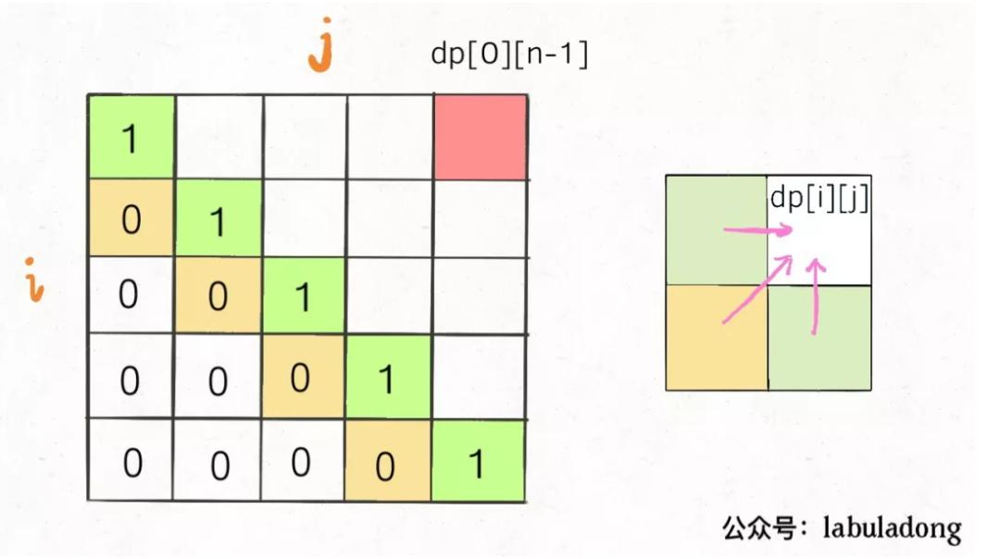
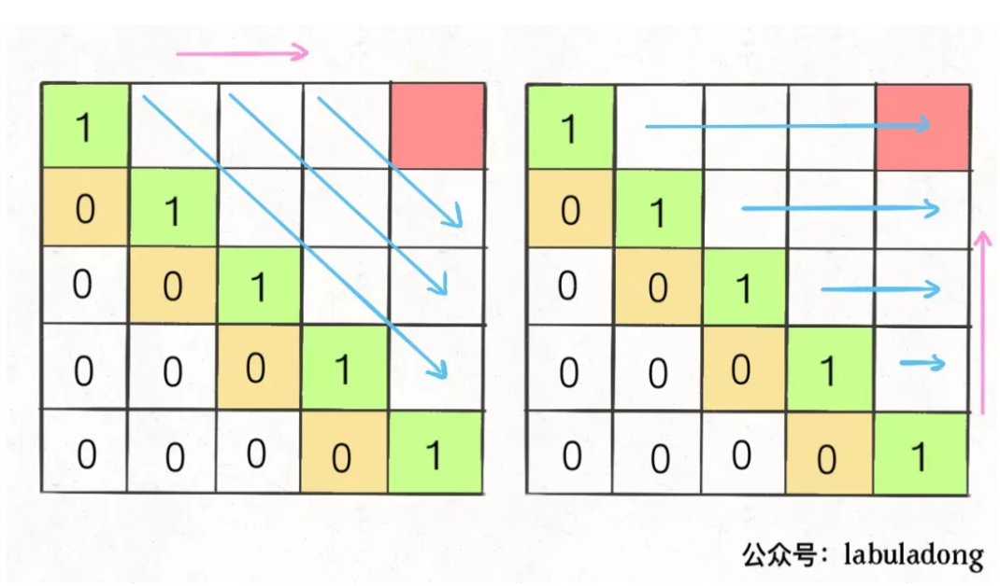
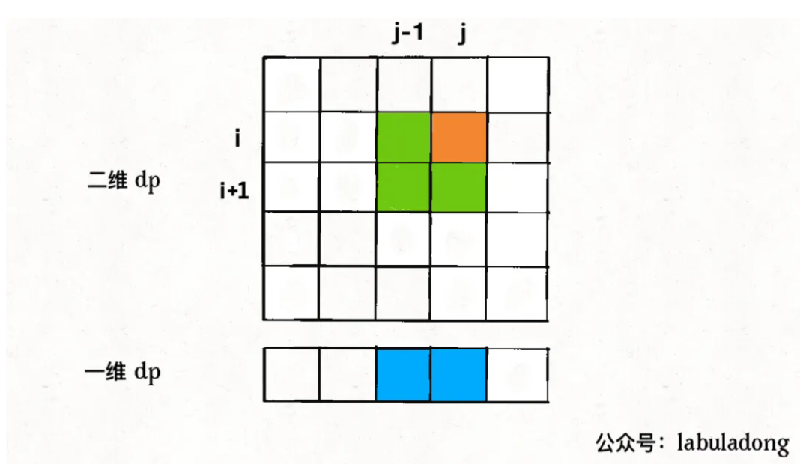
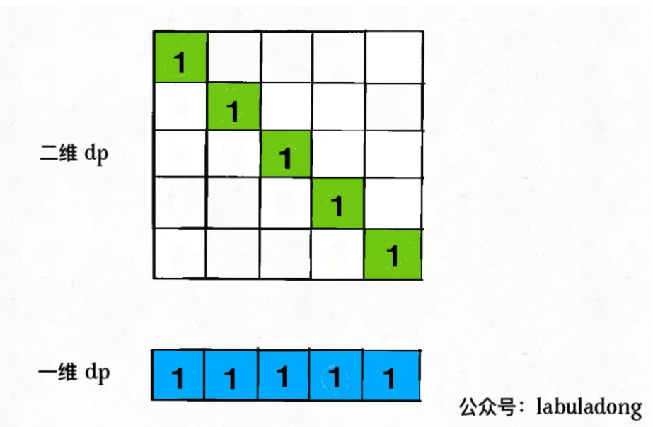

> 字串(子数组)要求是连续的，而子序列不要求。字串问题一般使用双指针，滑动窗口来求解，也可以用动态规划求解, 而子序列一般需要用动态规划求解。

### dp和子序列

子序列问题一般就是求一个最长子序列，最短子序列就是一个字符没啥可求的。一个串的子序列数量是指数级的，而动态规划往往可以压缩到时间复杂度为`O(N^2)`

#### 一维dp数组

这种常见的是求`最长递增子序列`
```java
int n = array.length;
int[] dp = new int[n];

for (int i = 1; i < n; i++) {
    for (int j = 0; j < i; j++) {
        dp[i] = 最值(dp[i], dp[j] + ...);
    }
}
```

`dp`数组的定义是, 在子数组`array[0..i]`中，以`array[i]`结尾的目标子序列(最长递增子序列)的长度为`dp[i]`。

* 最长递增子序列
算法时间复杂度`O(N^2)`
```cpp
    vector<int> dp(n, 1);
    for (int i = 1; i < n; i++) {
        for (int j = 0; j < i; j++){
            if (s[i] > s[i-1])
                dp[i] = max(dp[i], dp[j] + 1);
        }
    }
```

这种思路来自于归纳法。

#### 二维dp数组

这种思路用的多一些。

```java
int n = arr.length;
int[][] dp = new dp[n][n];

for (int i = 0; i < n; i++) {
    for (int j = 1; j < n; j++) {
        if (arr[i] == arr[j])
            dp[i][j] = dp[i][j] + ...
        else
            dp[i][j] = 最值(...)
    }
}
```

<!-- more -->

涉及到两个字符串/数组时, (比如最长公共子序列), dp数组含义。在子数组`arr1[0..i]`和子数组`arr2[0..j]`中, 我们要求的子序列(最长公共子序列)长度为`dp[i][j]`

只涉及一个字符串/数组时, dp数组含义。在子数组`array[i..j]`中, 我们要求的子序列(最长回文子序列)为`dp[i][j]`。

#### 最长回文子串

寻找回文串的核心思想是: 从中间字符开始向两边扩散来判断回文串。
```
for 0 <= i < len(s):
    找到以s[i]为中心的回文串
    更新答案
```

但由于回文串长度可能是奇数也可能是偶数, 因此
```cpp
for 0 <= i < len(s):
    找到以s[i]为中心的回文串
    找到以s[i]和s[i+1]为中心的回文串
    更新答案

// 代码

// 寻找回文串的函数
string palindrome(string& s, int l, int r) {
    // 传递两个指针
    // 满足情况向两侧扩散
    while (l >= 0 && r < s.size() && s[l] == s[r]>) {
        l--;
        r++;
    }
    // 返回以s[l] 和s[r]为中心的最长回文串
    // 不含边界
    return s.substr(l+1, r-l-1);
}

string longestPalindrome(string s) {
    string res;
    for (int i = 0; i < s.size(); i++) {
        // 以s[i]为中心的最长回文字符串
        string s1 = palindrome(s, i, i);
        // 以s[i], s[i+1]为中心的最长回文字符串
        string s2 = palindrome(s, i, i+1);

        res = res.size() > s1.size() ? res:s1;
        res =res.size() > s2.size() ? res: s2;
    }
    return res;
}
```

#### 最长回文子序列

对二维dp数组定义, 字串`s[i..j]`中, 最长回文子序列的长度为`dp[i][j]`。

```cpp
if (s[i] == s[j])
    dp[i][j] = dp[i+1][j-1] + 2;
else
    dp[i][j] = max(dp[i+1][j], dp[i][j-1])

```
`dp[0][n-1]`就是整个`s`的最长回文子序列的长度。

想求`dp[i][j]`需要知道`dp[i+1][j-1]`, `dp[i+1][j]`, `dp[i][j-1]`,



保证每次计算`dp[i][j]`, 左, 下, 左下三个方向位置已经计算出来，只能横着或者反着遍历。



反着遍历, i应该从大到小, j从小到大

```cpp
int longestPalindromeSubseq(string s){
    int n = s.size();
    // dp数组初始化
    vector<vector<int>> dp(n, vector<int>(n, 0));
    //base case
    for (int i = 0; i < n; i++) {
        dp[i][i] = 1;
    }
    // 反着遍历
    for (int i = n-1; i >=0; i--) {
        for (int j = i+1; j < n; j++) {
            if (s[i] == s[j])
                dp[i][j] = dp[i+1][j-1] + 2;
            else
                dp[i][j] = max(dp[i+1][j], dp[i][j-1])
        }
    }
}
```

找到状态转移和base case之后，一定观察DP table, 看看怎样遍历的。

### 状态压缩

动态规划的状态压缩, 一般能将空间复杂度由`O(N^2)`降低到`O(N)`。能够使用状态压缩技巧的动态规划都是二维`dp`问题, **如果状态转移, 计算`dp[i][j]`需要的都是`dp[i][j]`相邻的状态，那么就可以使用状态压缩技巧**，将二维`dp`数组转化成一维，空间复杂度由`O(N^2)`降低到`O(N)`。

例如最长回文子序列, 计算`dp[i][j]`需要三组相邻状态


一般的，状态压缩是去掉i这个维度, 也就是像j轴方向投影。

`dp[j]`赋新值之前，`dp[j]`的值为外层循环上一次迭代的值，即对应`dp[i+1][j]`的位置。

`dp[j-1]`的值为内层for循环上一次迭代的值，也就是`dp[i][j-1]`.

```cpp
for (int i = n-1; i >=0; i--) {
    for (int j = i+1; j < n; j++) {
        if (s[i] == s[j])
            // dp[i][j] = dp[i+1][j-1] + 2;
            dp[j] = ?? +2;
        else
            // dp[i][j] = max(dp[i+1][j], dp[i][j-1])
            dp[j] = max(dp[j], dp[j-1]);
    }
}
```

注意`??`处, `dp[i+1][j-1]`并没有在`dp[]`表示中。这里实现十分巧妙

```cpp
for (int i = n-1; i >=0; i--) {
    int pre = 0;
    for (int j = i+1; j < n; j++) {
        // dp[j] 表示dp[i+1][j]
        int temp = dp[j];
        if (s[i] == s[j])
            // dp[i][j] = dp[i+1][j-1] + 2;
            dp[j] = pre +2;
        else
            // dp[i][j] = max(dp[i+1][j], dp[i][j-1])
            dp[j] = max(dp[j], dp[j-1]);
        // 下一轮, pre就表示dp[i+1][j-1]了， 即上一轮的dp[j]
        pre = temp;
    }
}
```

将状态压缩理解成向j轴的投影。



从投影中显然看出, 由于求解方向是i轴向小, j轴向大, 这样求出dp[i][j]之前会求出dp[i+1][j]和dp[i][j-1]。因此`dp[j]`会先表示`dp[i+1][j]`, `dp[j-1]`先表示`dp[i+1][j-1]`, 后表示`dp[i][j-1]`, 显然`dp[i+1][j-1]`被覆盖了。但同时我们注意到`dp[i+1][j-1]`实际是上一轮的`dp[j]`。



```cpp
int longestPalindromeSubseq(string s) {
    int n = s.size();
    // base case：一维 dp 数组全部初始化为 1
    vector<int> dp(n, 1);

    for (int i = n - 2; i >= 0; i--) {
        int pre = 0;
        for (int j = i + 1; j < n; j++) {
            int temp = dp[j];
            // 状态转移方程
            if (s[i] == s[j])
                dp[j] = pre + 2;
            else
                dp[j] = max(dp[j], dp[j - 1]);
            pre = temp;
        }
    }
    return dp[n - 1];
}
```

#### 最长公共子序列

我们可以使用上文最长回文子串的逻辑，以及状态压缩

```cpp
class Solution {
public:
    int longestCommonSubsequence(string s1, string s2) {
        int n1 = s1.size();
        int n2 = s2.size();
        vector<vector<int>> dp (n1+1, vector<int>(n2+1, 0));

        for (int i = 1; i <= n1; i ++) {
            for (int j = 1; j <= n2; j++) {
                if (s1[i-1] == s2[j-1])
                    dp[i][j] = dp[i-1][j-1] + 1;
                else
                    dp[i][j] = max(dp[i][j-1], dp[i-1][j]);
            }
        }
        return dp[n1][n2];
    }

    // 状态压缩
    int longestCommonSubsequence_reduce(string s1, string s2) {
        int n1 = s1.size();
        int n2 = s2.size();
        vector<int> dp (n2+1, 0);

        for (int i = 1; i <= n1; i ++) {
            int pre = 0;
            // pre存储dp[i-1][j-1]
            for (int j = 1; j <= n2; j++) {
                int temp = dp[j];
                if (s1[i-1] == s2[j-1])
                    dp[j] = pre + 1;
                else
                    dp[j] = max(dp[j-1], dp[j]);
                
                pre = temp;
            }
        }
        return dp[n2];
    }
};

```

我们考虑递归和备忘录的解法

```cpp
int dp(string s1, int i, string s2, int j) {
    if (s1[i] == s2[j])
        return 1+dp(s1, i+1, s2, j+1);
    
    else
        // 两种情况, s1[i]在LCS中或s2[j]在LCS中
        return max (
            dp(s1, i+1, s2, j),
            dp (s1, i, s2, j+1)
        )
}
```

使用备忘录优化

```cpp
int longestCommonSubsequence (string s1, string s2) {
    int m = s1.size();
    int n = s2.size();
    vector<vector<int>> memo(m, vector<int>(n, -1));
    
    return dp(s1, 0, s2, 0, mono)
}

// 自顶向下的备忘录方法
int dp(string s1, int i, string s2, int j, vector<vector<int>> memo) {

    if (i == s1.size() || j == s2.size())
        return 0;
    
    if (mono[i][j] != -1)
        return mono[i][j];

    if (s1[i] == s2[j])
        mono[i][j] =  1+dp(s1, i+1, s2, j+1);
    
    else
        // 两种情况, s1[i]在LCS中或s2[j]在LCS中
        mono[i][j] =  max (
            dp(s1, i+1, s2, j),
            dp (s1, i, s2, j+1)
        )
    
    return mono[i][j];
}

// 自底向上的解法
int longestCommonSubsequence(string s1, string s2) {
    int n1 = s1.size();
    int n2 = s2.size();
    vector<vector<int>> dp (n1+1, vector<int>(n2+1, 0));

    for (int i = 1; i <= n1; i ++) {
        for (int j = 1; j <= n2; j++) {
            if (s1[i-1] == s2[j-1])
                dp[i][j] = dp[i-1][j-1] + 1;
            else
                dp[i][j] = max(dp[i][j-1], dp[i-1][j]);
        }
    }
    return dp[n1][n2];
}
```

#### 俄罗斯套娃信封问题

给你一个二维整数数组 envelopes ，其中 envelopes[i] = [wi, hi] ，表示第 i 个信封的宽度和高度。

当另一个信封的宽度和高度都比这个信封大的时候，这个信封就可以放进另一个信封里，如同俄罗斯套娃一样。

请计算 最多能有多少个 信封能组成一组“俄罗斯套娃”信封（即可以把一个信封放到另一个信封里面）。

思路是，先按照a[0]从小到大, a[1]从大到小排序。之后对a[1]求最长递增子序列即可。


```cpp
class Solution {
public:
    int maxEnvelopes(vector<vector<int>>& envelopes) {
        sort (envelopes.begin(), envelopes.end(), [](const auto& a, const auto& b) {
            return a[0] < b[0] || (a[0] == b[0] && a[1] > b[1]);
        });

        /// 最长上升子序列
        int n = envelopes.size();

        vector<int> dp(n, 1);

        for (int i = 1; i < n; ++i) {
            for (int j = 0; j < i; ++j) {
                if (envelopes[j][1] < envelopes[i][1]) {
                    dp[i] = max(dp[i], dp[j] + 1);
                }
            }
        }

        int max_increase_length = 0;
        for (int i = 0; i < n; i++)
            if (dp[i] > max_increase_length)
                max_increase_length = dp[i];
        return max_increase_length;
    }
};
```

#### 最长重复子数组

子数组和子串一样, 要求是连续的。最长重复子数组就是求最长的连续子串。

```
输入：
A: [1,2,3,2,1]
B: [3,2,1,4,7]
输出：3
解释：
长度最长的公共子数组是 [3, 2, 1] 。
```

最长子串由于是连续的, 在动态规划时要求`dp[i][j]`是以i, j结尾的最长子数组。子序列由于不要求连续, 只需要范围为[:i], [:j]即可, 不需要以i, j位置的字符为结尾。 这样连续子串问题可以认为是子序列问题的子集。

```cpp
class Solution {
public:
    int findLength(vector<int>& nums1, vector<int>& nums2) {
        int len1 = nums1.size();
        int len2 = nums2.size();

        vector<vector<int>> dp(len1+1, vector<int>(len2+2));
        int result = 0;

        for (int i = 1; i <= len1; i++) {
            for (int j = 1; j <= len2; j++) {
                if (nums1[i-1] == nums2[j-1])
                    dp[i][j] = dp[i-1][j-1]+1;
                else 
                    dp[i][j] = 0;   // 如果以i, j结尾的字符不一样, dp[i][j]以i, j结尾情况下肯定不是子数组, 因此设置为0
                result = max(result, dp[i][j]);
            }
        }

        return result;
    }
};
```