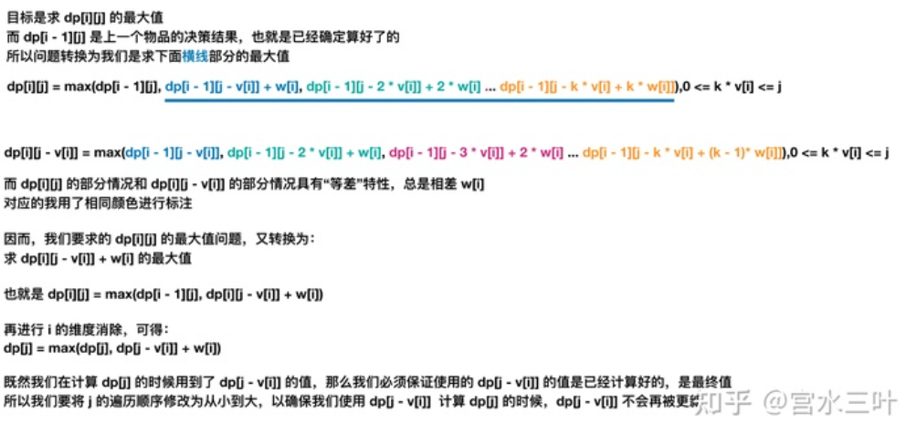

### 背包问题

对背包问题定义的理解：给定一个背包容量target，再给定一个数组nums(物品)，能否按一定方式选取nums中的元素得到target, 都可称之为背包问题
1. 背包容量target和物品nums的类型可能是数，也可能是字符串
2. target可能题目已经给出(显式)，也可能是需要我们从题目的信息中挖掘出来(非显式)(常见的非显式target比如sum/2等)
3. 选取方式有常见的一下几种：每个元素选一次/每个元素选多次/选元素进行排列组合


常见的背包类型主要有以下几种：
1. 0/1背包问题：每个元素最多选取一次
2. 完全背包问题：每个元素可以重复选择
3. 组合背包问题：背包中的物品要考虑顺序
4. 分组背包问题：不止一个背包，需要遍历每个背包

背包问题要求的也是不同的，按照所求问题分类，又可以分为以下几种：

1. 最值问题：要求最大值/最小值 `dp[i] = max/min(dp[i], dp[i-nums]+1)或dp[i] = max/min(dp[i], dp[i-num]+nums);`
2. 存在问题：是否存在…………，满足………… `dp[i]=dp[i]||dp[i-num];`
3. 组合问题：求所有满足……的组合 `dp[i]+=dp[i-num];`。例如存在多少种1,2组合使和为3, 如3=1+1+1, 3=1+2, 类似题可见leetcode518. 零钱兑换 II

背包九讲: http://cuitianyi.com/Pack/

#### 0-1背包

明确两点，**状态**和**选择**

01背包状态有两个，就是**背包的容量**和**可选择的物品**。

选择就是**装进背包**或者**不装进背包**。 即01两种选择。

```
for 状态1 in 状态1的所有取值：
    for 状态2 in 状态2的所有取值：
        for ...
            dp[状态1][状态2][...] = 择优(选择1，选择2...)

给定一组多个（$n$）物品，每种物品都有自己的重量（$w_i$）和价值（$v_i$），在限定的总重量/总容量（$C$）内，选择其中若干个（也即每种物品可以选0个或1个），设计选择方案使得物品的总价值最高。
```

二维数组，一个维度表示物品，另一个维度表示剩余的重量，值表示当前的价值。

```cpp
// 0-1背包问题模板
void test_2_wei_bag_problem1() {
    vector<int> weight = {1, 3, 4};
    vector<int> value = {15, 20, 30};
    int bagWeight = 4;  /// 容量

    // 二维数组
    vector<vector<int>> dp(weight.size(), vector<int>(bagWeight + 1, 0));

    // 初始化, 第一个物品开始, 当j>=weight[0]时,dp[0][j] = value[0]
    for (int j = weight[0]; j <= bagWeight; j++) {
        dp[0][j] = value[0];
    }

    // weight数组的大小 就是物品个数
    for(int i = 1; i < weight.size(); i++) { // 遍历物品, 从第二件物品开始
        for(int j = 0; j <= bagWeight; j++) { // 遍历背包容量
            if (j < weight[i]) dp[i][j] = dp[i - 1][j]; /// 装不了i
            else dp[i][j] = max(dp[i - 1][j], dp[i - 1][j - weight[i]] + value[i]);
        }
    }

    cout << dp[weight.size() - 1][bagWeight] << endl;
}
```

由于`max`是或的关系, 因此同一时刻`dp[i - 1][j]`和`dp[i - 1][j - weight[i]] + value[i]`只会选一个, 没有冲突问题。因此写成一维数组形式十分简单, 也就是`dp[j] = max(dp[j], dp[j - weight[i]] + value[i])`

二维代码可以进行优化，去除选取物品的那一层，简化为一维背包。背包问题i自小到大, j也自小到大, 且不存在覆盖问题。在使用二维数组的时候，递推公式：`dp[i][j] = max(dp[i - 1][j], dp[i - 1][j - weight[i]] + value[i])`; 可以发现如果把`dp[i - 1]`那一层拷贝到`dp[i]`上(一个是i-1层, 一个是第i层), 表达式完全可以是：`dp[i][j] = max(dp[i][j], dp[i][j - weight[i]] + value[i])`; 由此有表达式`dp[j] = max(dp[j], dp[j - weight[i]] + value[i]);`

注意有n个物品, 如果j从小到大变化, 会发现i=1时dp数组被赋了一次值(选了一次物品1), 但随着j的增大dp数组可以是`dp[j - weight[i]] + value[i]`从而可能又选了一次物品1, 这样可能会出现重复选择。而令j从大到小就可以避免重复原则的情况, 一个物品最多选择一次。

这种重复使用数组数据, 用新数据覆盖旧数据实现空间压缩的方法称为滚动数组。

```cpp
for(int i = 0; i < weight.size(); i++) { // 遍历物品
    for(int j = bagWeight; j >= weight[i]; j--) { // 遍历背包容量,从bagWeight到物品重量weight[i]
        dp[j] = max(dp[j], dp[j - weight[i]] + value[i]);

    }
}
```

#### 等和子集

将数组划分成两个相等的集合，相当于从数组选取数字, 将容量为sum/2的背包装满。

`dp[i][j]` 表示从数组的 `[0,i]`下标范围内选取第i个数字（可以是 0 个），是否存在一种选取方案使得被选取的正整数的和等于 j。

如果 `j>=nums[i]`，则对于当前的数字 nums[i]，可以选取也可以不选取，两种情况只要有一个为 true，就有 dp[i][j]=true。如果 `j<nums[i]`，则在选取的数字的和等于 j 的情况下无法选取当前的数字 `nums[i]`，因此有 `dp[i][j]=dp[i−1][j]`。


如果不选取 nums[i]，则 `dp[i][j]=dp[i−1][j]`；如果选取 `dp[i][j]=dp[i−1][j−nums[i]]`。

`dp[i][j] = dp[i−1][j−nums[i]] | dp[i−1][j]`
表示选取或者不选取


```cpp
bool canPartition(vector<int>& nums) {
    int sum = 0;
    for (int num : nums) sum += num;
    // 和为奇数时，不可能划分成两个和相等的集合
    if (sum % 2 != 0) return false;
    int n = nums.size();
    sum = sum / 2;
    vector<vector<bool>> 
        dp(n + 1, vector<bool>(sum + 1, false));
    // base case
    // 背包没有空间的时候，就相当于装满了，
    for (int i = 0; i <= n; i++)
        dp[i][0] = true;

    /// 判断自顶向下是否能到达dp[i][0]
    for (int i = 1; i <= n; i++) {
        for (int j = 1; j <= sum; j++) {
            if (j - nums[i - 1] < 0) {
               // 背包容量不足，不能装入第 i 个物品
                dp[i][j] = dp[i - 1][j]; 
            } else {
                // 装入或不装入背包
                dp[i][j] = dp[i - 1][j] | dp[i - 1][j-nums[i-1]];
            }
        }
    }
    return dp[n][sum];
}
```

#### 最后一块石头的重量

```
有一堆石头，用整数数组stones 表示。其中stones[i] 表示第 i 块石头的重量。

每一回合，从中选出任意两块石头，然后将它们一起粉碎。假设石头的重量分别为x 和y，且x <= y。那么粉碎的可能结果如下：

如果x == y，那么两块石头都会被完全粉碎；
如果x != y，那么重量为x的石头将会完全粉碎，而重量为y的石头新重量为y-x。
最后，最多只会剩下一块 石头。返回此石头 最小的可能重量 。如果没有石头剩下，就返回 0。

```

分析，可以想象把石头分成两堆，这两堆石头依次进行粉碎。可想而知，最后剩下石头的最小重量，**目标可以是这两堆石头的重量相差最小**。理想情况下两堆石头重量一致，石头没有剩下。当重量不一致时，重量较小的一堆石头重量小于`sum(stones)/2`。显然问题可以转化为，挑选石头，使在重量不高于`sum(stones)/2`时得到最大重量。

这道题于是变成了背包问题，在容量`sum(stones)/2`限制下选择石头。假设`f[i][j]`为在抉择第i块石头，剩余重量为j 时的最大重量。这道题和leetcode 494目标和问题类似。**凡是在一个数组中做选择的, 都看看是否能转化为有限制的背包问题**

```cpp
class Solution {
public:
    int lastStoneWeightII(vector<int>& stones) {
        /// 从stones中选择，凑成质量不超过sum(stones)/2的最大值

        int n = stones.size();
        int sum = 0;
        for (auto& stone : stones) {
            sum+= stone;
        }
        int target = sum/2;

        vector<vector<int>> f(n+1, vector<int>(target));

        for (int i = 1; i <= stones.size(); i++) {
            for (int j = 1; j <= target; j++) {
                //cout << f[i][j] << " ";
                f[i][j] = f[i-1][j];
                if (j >= stones[i-1]) {
                    f[i][j] = max(f[i-1][j], f[i-1][j-stones[i-1]]+stones[i-1]);
                }
            }
        }

        return sum - 2*f[n][target];
    }
};
```

#### 完全背包

与0-1背包问题不同的地方时，完全背包问题允许一件物品无限次的出现。

01背包问题的递推方程式 `dp[i][w] = max(dp[i - 1][w], dp[i - 1][w - w[i]] + v[i]); `; 完全背包对于某个物品可以选多个(直到容量不足), 其的递推方程式 `dp[i][w] = max(dp[i - 1][w], dp[i - 1][w - k * w[i]] + k * v[i]);`

```cpp
    //dp[i][w] 代表前i件物品放入质量为w的背包时的最大价值。
    //k 代表着第i件物品拿了几件，咱们枚举一下自然就知道几件的时候可以使得价值最大，这个就是扩展01背包问题的关键地方


for(int i = 1; i <= N; i++){
    for(int j = 1; j <= W; j++){
        if (j < nums[i])
            dp[i][j] = dp[i - 1][j];
        for(int k = 0; j - k*w[i] >= 0; k++){ //在拿了k件的条件下容量足够
            dp[i][j] = max(dp[i][j], dp[i - 1][j - k * w[i]] + k * v[i]);  // 找到dp[i - 1][j - k * w[i]] + k * v[i]的最大值
//dp[i][w] 代表前i件物品放入质量为w的背包时的最大价值。
//k 代表着第i件物品拿了几件，咱们枚举一下自然就知道几件的时候可以使得价值最大，这个就是扩展01背包问题的关键地方
        }
    }
```

完全背包问题还有一个简单又有效的优化，那就是如果 `w[a] > w[b] && v[a] < v[b]` 这种情况下a比b重价值a却小于b, 这时候可以a物品去掉，因为有b就没必要去选a了。即`dp[i][j] = max(dp[i - 1][j], dp[i][j - w[i]] + v[i])`, 相比于0-1背包，只在`dp[i-1]`换成`dp[i]`。



完全背包递推
```cpp
for(int i = 1; i <= N; i++){
    for(int j = 1; j <= W; j++){
        if(j < W[i]) dp[i][j] = dp[i-1][j];
        else dp[i][j] = max(dp[i - 1][j], dp[i][j - w[i]] + v[i]);

    }
}
```

前面讲过在0-1背包j从小到大变化会出现重复选择的情况, 因此j应该从大到小变化; 而j从小到大变化正好符合完全背包的条件。

```cpp
// 先遍历物品，再遍历背包
for(int i = 0; i < weight.size(); i++) { // 遍历物品
    for(int j = weight[i]; j < bagWeight ; j++) { // 从小到大遍历，因为可以添加多次
        dp[j] = max(dp[j], dp[j - weight[i]] + value[i]);

    }
}
```

#### 零钱兑换问题

leetcode 322 零钱兑换
```
给你一个整数数组 coins ，表示不同面额的硬币；以及一个整数 amount ，表示总金额。

计算并返回可以凑成总金额所需的 最少的硬币个数 。如果没有任何一种硬币组合能组成总金额，返回-1 。

你可以认为每种硬币的数量是无限的。
```

同样是完全背包, 可以选取无限种硬币, 注意本题返回最小的硬币个数, 而不是value最大

```cpp
class Solution {
public:
    int INF = 0x3f3f3f3f;
    int coinChange(vector<int>& coins, int amount) {
         int n = coins.size();
         vector<vector<int>> f (n + 1, vector<int>(amount + 1, INF));

        for (int i = 0; i <= n; i++) 
            f[i][0] = 0;  
         for(int i = 1; i <= n; i++)
         {
         	int val = coins[i-1];
            for(int j = 0; j <= amount; j++) {
                if (j < val)
                    f[i][j] = f[i - 1][j];
                for(int k = 0; k*val <= j; k++)
                {
                    f[i][j] = min(f[i][j] , f[i-1][j-k*val] + k);   // 得到f[i-1][j-k*val] + k的最小值
                }
            }
         }	 
        if (f[n][amount] == INF) f[n][amount] = -1;
        return f[n][amount];
    }
};
```

优化思路
```
v代表第i件物品的体积(面值)

f[i][j] = min( f[i-1][j],f[i-1][j-v] + 1,f[i-1][j-2v] + 2......f[i-1][j-kv] + k)

f[i][j-v] + 1 = min(f[i-1][j-v] + 1,f[i-1][j-2v] + 2......,f[i-1][j-kv] + k-1)

因此：

f[i][j] = min(f[i-1][j],f[i][j-v] + 1)
```

所以完全背包模板题
```cpp
int coinChange(vector<int>& coins, int amount) {
         int n = coins.size();
         vector<vector<int>> f (n + 1, vector<int>(amount + 1, INF));

         for (int i = 0; i <= n; i++) 
            f[i][0] = 0; 
         for(int i = 1; i <= n; i++)
         {
         	int val = coins[i-1];
            for(int j = 0; j <= amount; j++) {
                if (j >= val) {
                    f[i][j] = min(f[i - 1][j] , f[i][j-val] + 1);
                }else {
                    f[i][j] = f[i - 1][j];
                }
            }
         }	 
        if (f[n][amount] == INF) f[n][amount] = -1;
        return f[n][amount];
    }
```

一维状态压缩
```cpp
class Solution {
public:
    int INF = 0x3f3f3f3f;
    int coinChange(vector<int>& coins, int amount) {
         int n = coins.size();
         vector<int> f (amount + 1, INF);

         f[0] = 0;
         for(int i = 1; i <= n; i++)
         {
         	int val = coins[i-1];
            for(int j = 0; j <= amount; j++) {
                if (j >= val) {
                    f[j] = min(f[j] , f[j-val] + 1);
                }
            }
         }	 
        if (f[amount] == INF) f[amount] = -1;
        return f[amount];
    }
};
```

* leetcode 322零钱兑换II

```
给你一个整数数组 coins 表示不同面额的硬币，另给一个整数 amount 表示总金额。

请你计算并返回可以凑成总金额的硬币组合数。如果任何硬币组合都无法凑出总金额，返回 0 。

假设每一种面额的硬币有无限个。

题目数据保证结果符合 32 位带符号整数。

输入：amount = 5, coins = [1, 2, 5]
输出：4
解释：有四种方式可以凑成总金额：
5=5
5=2+2+1
5=2+1+1+1
5=1+1+1+1+1
```

与上题不同, 该题需要求解组合数量

```cpp
class Solution {
public:
    int change(int amount, vector<int>& coins) {
        int n = coins.size();

        vector<vector<int>> dp(n+1, vector<int>(amount+1));

        // 当i=0时的情况
        for (int i = 0; i < n; i++) 
            dp[i][0] = 1;   // 初始化
        
        for (int j = 1; j <= amount; j++) {
            if (j % coins[0] == 0)
                dp[0][j] = 1;
        }

        for (int i = 1; i < n; i++) {
            for (int j = 1; j <= amount; j++) {
                if (j < coins[i])
                    dp[i][j] = dp[i-1][j];  // 容量有限，无法选择第i个硬币
                else {
                    dp[i][j] = dp[i-1][j] + dp[i][j-coins[i]]; // 可选择第i个硬币
                }
            }
        }

        return dp[n-1][amount];

    }
};

或者
    int change(int amount, vector<int>& coins) {
        int n = coins.size();

        vector<vector<int>> dp(n+1, vector<int>(amount+1));

        for (int i = 0; i <= n; i++) 
            dp[i][0] = 1;   // 初始化
        

        for (int i = 1; i <= n; i++) {
            for (int j = 1; j <= amount; j++) {
                if (j < coins[i-1])
                    dp[i][j] = dp[i-1][j];  // 容量有限，无法选择第i个硬币
                else {
                    dp[i][j] = dp[i-1][j] + dp[i][j-coins[i-1]]; // 可选择第i个硬币
                }
            }
        }

        return dp[n][amount];

    }
```


### 记忆化搜索的动态规划

#### 扔鸡蛋问题

题目要求, 面前有一栋从1到N共N层的楼, 给K个鸡蛋(K至少为1)。该楼存在楼层`0<=F<=N`，在这层楼扔下去, 鸡蛋恰好每摔碎(高于F的楼层都会碎, 低于F的楼层不会碎)。问**最坏情况下**，扔多少次鸡蛋，确定该楼层。

我们在第`i`层楼扔鸡蛋, 可能出现两种情况, 鸡蛋碎了和鸡蛋没碎。

如果鸡蛋碎了, 鸡蛋的个数`K`减1, 搜索楼层区间应该从`[1..N]`变为`[1..i-1]`共`i-1`层楼。

如果鸡蛋没碎, 鸡蛋个数`K`不变, 搜索楼层从`[1..N]`变为`[i+1..N]`共`N-i`层楼。


<!-- more -->

所以有递归写法
```py
def dp(K, N):
    for 1 <= i <= N:
        # 最坏情况下的最少扔鸡蛋次数
        res = min(res, 
                  max( 
                        dp(K - 1, i - 1), # 碎
                        dp(K, N - i)      # 没碎
                     ) + 1 # 在第 i 楼扔了一次
                 )
    return res
```
加上备忘录
```py
def superEggDrop(K: int, N: int):

    memo = dict()
    def dp(K, N) -> int:
        # base case
        if K == 1: return N
        if N == 0: return 0
        # 避免重复计算
        if (K, N) in memo:
            return memo[(K, N)]

        res = float('INF')
        # 穷举所有可能的选择
        for i in range(1, N + 1):
            res = min(res, 
                      max(
                            dp(K, N - i), 
                            dp(K - 1, i - 1)
                         ) + 1
                  )
        # 记入备忘录
        memo[(K, N)] = res
        return res

    return dp(K, N)
```

#### 编辑距离


**解决两个字符串的动态规划问题，一般都是用两个指针i,j分别指向两个字符串的最后**，然后一步步往前走，缩小问题的规模。

注意每一个字符串都可以进行插入, 删除, 替换操作。换言之可以按照, a删除, b替换等顺序。

一般的, 可以有如下思路
```
if s1[i] == s2[j]:
    啥都别做（skip）
    i, j 同时向前移动
else:
    三选一：
        插入（insert）
        删除（delete）
        替换（replace）
```


```py
def minDistance(s1, s2) -> int:
    def dp(i, j):

        if i == -1:
            return j+1  # j+1个字符全部删除
        if j == -1:
            return i+1
        

        if s[i] == s[j]:
            return dp(i-1, j-1) # i, j前移, 啥也不做
        else
            return min(dp(i-1, j),  # 删除
            dp(i, j-1), # 增加一个字符
            dp(i-1, j-1) # 替换字符
            )
    return dp(len(s1)-1, len(s2)-1)

dp(i, j - 1) + 1,    # 插入
# 解释：
# 我直接在 s1[i] 插入一个和 s2[j] 一样的字符
# 那么 s2[j] 就被匹配了，前移 j，继续跟 i 对比
# 别忘了操作数加一

dp(i - 1, j) + 1,    # 删除
# 解释：
# 我直接把 s[i] 这个字符删掉
# 前移 i，继续跟 j 对比
# 操作数加一

dp(i - 1, j - 1) + 1 # 替换
# 解释：
# 我直接把 s1[i] 替换成 s2[j]，这样它俩就匹配了
# 同时前移 i，j 继续对比
# 操作数加一

```

加备忘录

```py
def minDistance(s1, s2) -> int:

    memo = dict() # 备忘录
    def dp(i, j):
        if (i, j) in memo: 
            return memo[(i, j)]
        ...

        if s1[i] == s2[j]:
            memo[(i, j)] = ...  
        else:
            memo[(i, j)] = ...
        return memo[(i, j)]

    return dp(len(s1) - 1, len(s2) - 1)
```

dp table的自底向上


* dp[i][j] 表示两个字符串分为在i, j位置(从1开始)的最小编辑距离。i,j对应字符串位置为i-1, j-1。
* 对字符s1[i-1]和s2[j-1], 如果不等, 增加删除字符可以理解为某个字符串字符前移, 也就是对应dp[i-1][j], dp[i][j-1], 替换字符位置不变(两个都前移), 为dp[i-1][j-1]。 换言之, dp[i-1][j]+1表示从0位置到第i-1, j字符串编辑距离加一。

```cpp
int minDistance(string s1, string s2) {
    int m = s1.size();
    int n = s2.size();

    vector<vector<int>> dp(m+1, vector<int>(n+1, 0));
    /// 初始条件要注意
    for (int i = 0; i <=m; i++)
        dp[i][0] = i;
    for (int j = 0; j <= n; j++) 
        dp[0][j] = j;

    for (int i = 1; i <= m; i++) {
        for (int j = 1; j <= n; j++) {
            if (s1[i-1] == s2[j-1])
                dp[i][j] = dp[i-1][j-1];
            else
                dp[i][j] = Min(dp[i-1][j-1]+1,  dp[i-1][j]+1, dp[i][j-1]+1);
        }
    }
    return dp[m][n];
}

int Min (int a, int b, int c) {
    return min(a, min(b,c));
}
```


可以用状态压缩使空间复杂度从O(N^2)变为O(N)


#### 信封嵌套问题


解法
先对宽度w进行升序排序，如果遇到w相同的情况，则按照高度h降序排序。之后把所有的h作为一个数组，在这个数组上计算 LIS 的长度就是答案。


然后在`h`上寻找最长递增子序列：


#### 两个字符串的删除操作

```
给定两个单词 word1 和 word2，找到使得 word1 和 word2 相同所需的最小步数，每步可以删除任意一个字符串中的一个字符。

输入: "sea", "eat"
输出: 2
解释: 第一步将"sea"变为"ea"，第二步将"eat"变为"ea"
```

这个问题和编辑距离的区别是, 编辑距离两个字符串都可以进行替换,增加, 删除操作, 本问题两个字符串智能进行删除的操作

在i, j处, 字符串s1删除一个字符, 与字符串s2增加一个字符效果一致。最后都是s1[i-1]与s[j]进行比较。因此本题可以用编辑距离求解

```cpp
int minDistance(string s1, string s2) {
    int m = s1.size();
    int n = s2.size();

    vector<vector<int>> dp(m+1, vector<int>(n+1, 0));
    /// 初始条件要注意
    for (int i = 0; i <=m; i++)
        dp[i][0] = i;
    for (int j = 0; j <= n; j++) 
        dp[0][j] = j;

    for (int i = 1; i <= m; i++) {
        for (int j = 1; j <= n; j++) {
            if (s1[i-1] == s2[j-1])
                dp[i][j] = dp[i-1][j-1];
            else
                dp[i][j] = min( dp[i-1][j]+1, dp[i][j-1]+1);
        }
    }
    return dp[m][n];
}
```

另一种办法是求最长公共子序列解决

```cpp
    int minDistance2(string word1, string word2) {
        int m = word1.size();
        int n = word2.size();
        vector<vector<int>> dp(m + 1, vector<int>(n + 1));

        for (int i = 1; i <= m; i++) {
            char c1 = word1[i - 1];
            for (int j = 1; j <= n; j++) {
                char c2 = word2[j - 1];
                if (c1 == c2) {
                    dp[i][j] = dp[i - 1][j - 1] + 1;
                } else {
                    dp[i][j] = max(dp[i - 1][j], dp[i][j - 1]);
                }
            }
        }

        int lcs = dp[m][n];
        return m - lcs + n - lcs;
    }
```

