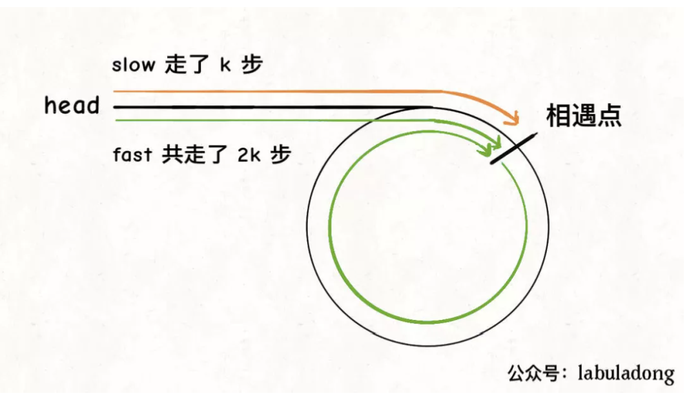
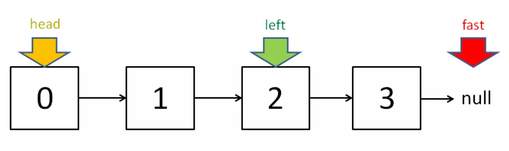

双指针技巧可分为两类，一类是「快慢指针」，一类是「左右指针」。前者解决主要解决链表中的问题，比如典型的判定链表中是否包含环；后者主要解决数组（或者字符串）中的问题，比如二分查找。

### 快慢指针

#### 判定链表中是否含有环

经典解法就是用两个指针，一个跑得快，一个跑得慢。如果不含有环，跑得快的那个指针最终会遇到null，说明链表不含环；如果含有环，快指针最终会超慢指针一圈，和慢指针相遇，说明链表含有环。

```cpp
boolean hasCycle(ListNode head) {
    ListNode fast, slow;
    fast = slow = head;
    while (fast != null && fast.next != null) {
        fast = fast.next.next;
        slow = slow.next;

        if (fast == slow) return true;
    }
    return false;
}

bool hasCycle(ListNode* head) {
    ListNode* fast = head;
    ListNode* slow = head;

    while (fast != nullptr && fast->next != nullptr) {
        fast = fast->next->next;
        slow = slow->next;

        if (fast == slow)   // 有环
            return true;
    }
    return false;
}
```

<!-- more -->

#### 已知链表中含有环，返回这个环的起始位置

当快慢指针相遇时，让其中任一个指针指向头节点，然后让它俩以相同速度前进，再次相遇时所在的节点位置就是环开始的位置。

第一次相遇时，假设慢指针slow走了`k`步，那么快指针fast一定走了`2k`步, fast一定比slow多走了k步，这多走的k步其实就是fast指针在环里转圈圈，所以**k的值就是环长度的整数倍**。

设相遇点距环的起点的距离为m，那么环的起点距头结点head的距离为k - m，也就是说如果从head前进k - m步就能到达环起点。同时从相遇点继续前进k - m步，也恰好到达环起点。



只要我们把快慢指针中的任一个重新指向head，然后两个指针同速前进，k - m步后就会相遇，相遇之处就是环的起点了。

```cpp
ListNode* detectCycle(ListNode* head) {
    ListNode* fast, slow;
    fast = slow = head;
    while (fast != nullptr && fast->next != nullptr) {
        fast = fast->next->next;
        slow = slow->next;
        if (fast == slow) break;    // 到达相遇点
    }
    // 上面的代码类似 hasCycle 函数
    slow = head;
    while (slow != fast) {
        fast = fast->next;
        slow = slow->next;
    }
    return slow;
}
```

#### 寻找链表的中点

让快指针一次前进两步，慢指针一次前进一步，当快指针到达链表尽头时，慢指针就处于链表的中间位置。

当链表的长度是奇数时，slow恰巧停在中点位置；如果长度是偶数，slow最终的位置是中间偏右。



```cpp
ListNode* middleNode(ListNode* head) {
    ListNode* fast, slow;
    fast = slow = head;
    while (fast != nullptr && fast->next != nullptr) {
        fast = fast->next->next;
        slow = slow->next;
    }
    // slow 就在中间位置
    return slow;
}
```

#### 寻找链表的倒数第n个元素

给定一个链表，删除链表的倒数第n个元素。

思路是使用快慢指针，让快指针先走n步，然后快慢指针开始同速前进。这样当快指针走到链表末尾null时，慢指针所在的位置就是倒数第n个链表节点（n不会超过链表长度）。

#### 判断环形数组是否存在循环

```
存在一个不含 0 的 环形 数组nums ，每个 nums[i] 都表示位于下标 i 的角色应该向前或向后移动的下标个数：

如果 nums[i] 是正数，向前（下标递增方向）移动 nums[i] 步
如果 nums[i] 是负数，向后（下标递减方向）移动 nums[i] 步
因为数组是 环形 的，所以可以假设从最后一个元素向前移动一步会到达第一个元素，而第一个元素向后移动一步会到达最后一个元素。

数组中的 循环 由长度为 k 的下标序列 seq 标识：

遵循上述移动规则将导致一组重复下标序列 seq[0] -> seq[1] -> ... -> seq[k - 1] -> seq[0] -> ...

所有 nums[seq[j]] 应当不是 全正 就是 全负k > 1

如果 nums 中存在循环，返回 true ；否则，返回 false 。
```

常见的思路就是快慢指针，在链表问题中，快指针每次走 2 步，慢指针每次走 1 步。当快慢指针相遇的时候，说明存在环。快慢指针的原理是每增加一步, 快指针比慢指针距离增加1, 如果存在环, 快指针早晚与慢指针相遇(相差步数为环一圈加环起始点距离)

在每次移动中，快指针需要走 2 次，而慢指针需要走 1 次；

每次移动的步数等于数组中每个位置存储的元素；

当快慢指针相遇的时候，说明有环。

两个限制条件：

在每次循环的过程中，必须保证所经历过的所有数字都是同号的。因此在快指针经历过的每个位置都要判断一下和出发点的数字是不是相同的符号。

当快慢指针相遇的时候，还要判断环的大小不是 1。


如果 next 为负数：在 next 的基础上增加 n，将其映射回正值；

如果 next 为正数：将 next 模数组长度n，确保不会越界。

可以统一写成 `next = ((cur + nums[cur]) % n + n ) % n`

```cpp
class Solution {
public:
    int nextstep(int index, int n, vector<int>& nums) {
        return ((index + nums[index])%n + n) % n;
    }

    bool circularArrayLoop(vector<int>& nums) {
        int len = nums.size();
        for (int i = 0; i < len; i++) {
            int slow = i;
            int fast = nextstep(slow, len, nums);

            
            // 方向一致且不为0
            while (nums[fast] * nums[i] > 0 && nums[nextstep(fast, len, nums)] * nums[i] > 0) {
                if (slow == fast) {
                    if (slow == nextstep(slow, len, nums))
                        break;
                    return true;
                }
                slow = nextstep(slow, len, nums);
                // 快指针走两次, 慢指针走一次
                fast = nextstep(nextstep(fast, len, nums), len, nums);
            }
        }
        return false;
    }
};
```

### 左右指针

#### 二分查找

```cpp
int binarySearch(vector<int>& nums, int target) {
    int left = 0; 
    int right = nums.size() - 1;
    while(left <= right) {
        int mid = (right + left) / 2;
        if(nums[mid] == target)
            return mid; 
        else if (nums[mid] < target)
            left = mid + 1; 
        else if (nums[mid] > target)
            right = mid - 1;
    }
    return -1;
}
```

#### 反转数组

```cpp
void reverseString(vector<char> arr) {
    int left = 0;
    int right = arr.size() - 1;
    while (left < right) {
        // 交换 arr[left] 和 arr[right]
        char temp = arr[left];
        arr[left] = arr[right];
        arr[right] = temp;
        left++; right--;
    }
}
```

### 滑动窗口

滑动窗口一般先right指针扩大窗口, 然后left缩小窗口。需要明确扩大或缩小窗口时的条件, 数据的更新。

具体的

1. 当移动right扩大窗口，即加入字符时，应该更新哪些数据？

2. 什么条件下，窗口应该暂停扩大，开始移动left缩小窗口？

3. 当移动left缩小窗口，即移出字符时，应该更新哪些数据？

4. 我们要的结果应该在扩大窗口时还是缩小窗口时进行更新？

例题 

给你一个字符串 s 、一个字符串 t 。返回 s 中涵盖 t 所有字符的最小子串。如果 s 中不存在涵盖 t 所有字符的子串，则返回空字符串 "" 。

思路,
1. 将需要匹配的字符串t的字符, 统计到need map中
2. 先右移动窗口, 移动时更新window和valid
3. 窗口右移完毕左窗口收缩条件, valid == need.size()
4. 更新此时最小字串起始终止位置索引
5. 左移窗口,更新数据, window和valid

valid表示滑动窗口中已经满足T中字符的个数。
windows表示, 滑动窗口满足T中字符的map计数
```cpp
string minWindow(string s, string t) {
    unordered_map<char, int> need, window;

    // need 需要匹配的字符
    for (char c : t) need[c]++;

    int left = 0, right = 0;
    int valid = 0;
    // 记录最小覆盖子串的起始索引及长度
    int start = 0, len = INT_MAX;
    while (right < s.size()) {
        // c 是将移入窗口的字符
        char c = s[right];
        // 右移窗口
        right++;
        // 进行窗口内数据的一系列更新
        if (need.count(c)) {
            window[c]++;
            if (window[c] == need[c])
                valid++;
        }

        // 判断左侧窗口是否要收缩
        while (valid == need.size()) {
            // 在这里更新最小覆盖子串
            if (right - left < len) {
                start = left;
                len = right - left;
            }
            // d 是将移出窗口的字符
            char d = s[left];
            // 左移窗口
            left++;
            // 进行窗口内数据的一系列更新
            if (need.count(d)) {
                if (window[d] == need[d])
                    valid--;
                window[d]--;
            }                    
        }
    }
    // 返回最小覆盖子串
    return len == INT_MAX ?
        "" : s.substr(start, len);
}
```

该题要求返回包含字符串的最小字串, 未强制长度。如果要求返回长度为n的字串, 滑动窗口左侧收缩的条件应该变为`while (right - left >= n)`
```cpp
/// 长度要求，更新左侧窗口
while (right - left >= t.size()) {
            // 在这里判断是否找到了合法的子串
            if (valid == need.size())
                return true;
            char d = s[left];
            left++;
            // 进行窗口内数据的一系列更新
            if (need.count(d)) {
                if (window[d] == need[d])
                    valid--;
                window[d]--;
            }
        }
```

给定两个字符串 s 和 p，找到 s 中所有 p 的 异位词 的子串，返回这些子串的起始索引。不考虑答案输出的顺序。

异位词 指字母相同，但排列不同的字符串。

```
输入: s = "cbaebabacd", p = "abc"
输出: [0,6]
解释:
起始索引等于 0 的子串是 "cba", 它是 "abc" 的异位词。
起始索引等于 6 的子串是 "bac", 它是 "abc" 的异位词。
```

代码

```cpp
vector<int> findAnagrams(string s, string t) {
    unordered_map<char, int> need, window;
    for (char c : t) need[c]++;

    int left = 0, right = 0;
    int valid = 0;
    vector<int> res; // 记录结果
    while (right < s.size()) {
        char c = s[right];
        right++;
        // 进行窗口内数据的一系列更新
        if (need.count(c)) {
            window[c]++;
            if (window[c] == need[c]) 
                valid++;
        }
        // 判断左侧窗口是否要收缩
        /// 字母异位词显然要求长度一样
        while (right - left >= t.size()) {
            // 当窗口符合条件时，把起始索引加入 res
            if (valid == need.size())
                res.push_back(left);
            char d = s[left];
            left++;
            // 进行窗口内数据的一系列更新
            if (need.count(d)) {
                if (window[d] == need[d])
                    valid--;
                window[d]--;
            }
        }
    }
    return res;
}
```

给定一个字符串 s ，请你找出其中不含有重复字符的 最长子串 的长度。

当`window[c]`值大于 1 时，说明窗口中存在重复字符，不符合条件，就该移动left缩小窗口
```cpp
int lengthOfLongestSubstring(string s) {
    unordered_map<char, int> window;

    int left = 0, right = 0;
    int res = 0; // 记录结果
    while (right < s.size()) {
        char c = s[right];
        right++;
        // 进行窗口内数据的一系列更新
        window[c]++;
        // 判断左侧窗口是否要收缩
        while (window[c] > 1) {
            char d = s[left];
            left++;
            // 进行窗口内数据的一系列更新
            window[d]--;
        }
        // 在这里更新答案
        res = max(res, right - left);
    }
    return res;
}
```


####  leetcode 594最长和谐子序列
```
和谐数组是指一个数组里元素的最大值和最小值之间的差别 正好是 1 。

现在，给你一个整数数组 nums ，请你在所有可能的子序列中找到最长的和谐子序列的长度。

输入：nums = [1,3,2,2,5,2,3,7]
输出：5
解释：最长的和谐子序列是 [3,2,2,2,3]
```

这里和谐数组可以看成一个序列, 其中仅包含差为1的两个值。例如`1 1 2 2 3 4`, 如何寻找这样的序列呢。首先对原序列进行排序。

接着可以使用双指针的解法，所谓双指针，就是先移动一个指针到前面, 之后再移动另一个指针，之间形成一个窗口。例如以上，我们先让left指针指向0位置, 然后移动right指针直到right指向3, 因为right指向3时再向右移动没有意义, 这时候就要移动left了。

双指针是两重循环, 第一重是移动right, 第二重是不满足情况是移动left使之满足情况。

```cpp
int findLHS(vector<int>& nums) {
    sort(nums.begin(),nums.end());
    int left = 0;
    int right = 0;
    int res = 0;
    for (right = 0; right < nums.size(); right++) {
        if (nums[right] - nums[left] == 1) { // 如果满足相差为1, 更新res
            res = max(res, right - left + 1);
        }
        while (nums[right] - nums[left] > 1) {  // 如果相差>1, 则需要更新left 
            left++;
        }
    }
    return res;
}
```

#### 下一个排列

思路如下,
1. **从后向前查找第一个相邻升序的元素对** `(i,j)`，满足 `A[i] < A[j]`。此时 `[j,end)` 必然是降序
2. 在 `[j,end)` **从后向前查找第一个满足 A[i] < A[k] 的 k**。
3. 将 A[i] 与 A[k] 交换
4. **可以断定这时 `[j,end)` 必然是降序**，逆置 [j,end)，使其升序

这种容易模拟case的，case一定要弄好
```cpp
class Solution {
public:
    void nextPermutation(vector<int>& nums) {
        if (nums.size() == 1)
            return;
        int backPos = nums.size()-2;
        while (backPos >= 0 && nums[backPos+1] <= nums[backPos])
        {
            backPos --;
        }
        if (backPos < 0)
        {
            reverse(nums.begin(), nums.end());
            return;
        }
        int k = nums.size()-1;
        while (k >= 0 && nums[k] <= nums[backPos])
        {
            k--;
        }
        swap(nums[k], nums[backPos]);
        reverse(nums.begin() + backPos + 1, nums.end());
    }
};
```