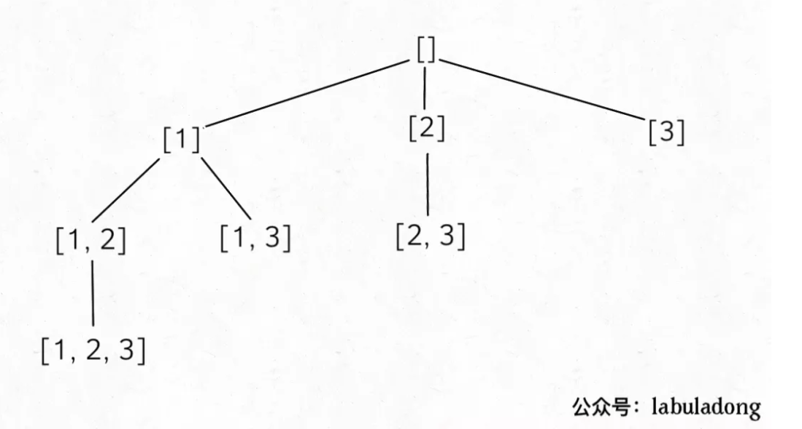
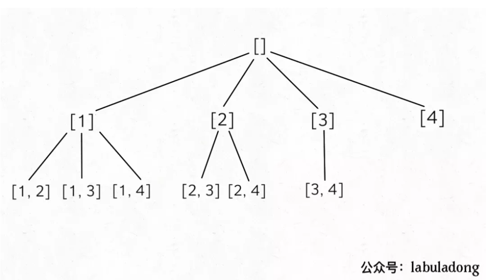
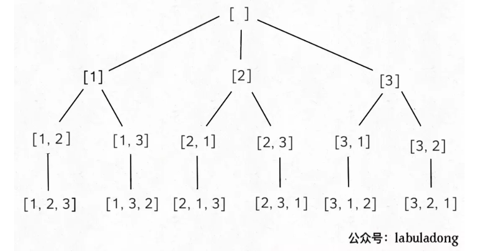

### 回溯算法

回溯算法注意决策选择, 实际上每一个决策都来自于递归树。回溯算法就是穷举一棵决策树的过程

#### 子集选择

输入一个不包含重复数字的数组，要求算法输出这些数字的所有子集。

如下是递归树


我们可以发现
1. 结果包含递归树的每一个节点，而不仅仅是叶子节点
2. 无重复集合
3. 树高与起始索引有关

<!-- more -->

```cpp
void backtrack(const vector<int>& nums, vector<int>& track, int index) {
    
    /// 下面这一行可以获得递归树的每一个节点()
    res.push_back(track);

    /// 使用index, 保证无重复集合
    /// 有重复集合, 变为int i = 0, 例如排列问题
    for (int i = index; i < nums.size(); i++) {
        track.push_back(nums[i]);
        backtrack(nums, track, i+1);
        track.pop_back();
    }
}
```

#### 组合问题

输入两个数字 n, k，算法输出 [1..n] 中 k 个数字的所有组合。


比如输入 n = 4, k = 2，输出如下结果，不能包含重复（按照组合的定义，[1,2] 和 [2,1] 也算重复）：
```
[
 [1,2],
 [1,3],
 [1,4],
 [2,3],
 [2,4],
 [3,4]
]
```



我们可以发现
1. 需要的结果来自叶子节点
2. 无重复集合
3. k 决定递归树树高

```cpp
void backtrack(vector<int>& nums, int k, vector<int>& track, int index) {
    /// k 决定树高, 因此k==0时return
    if (k == 0) {
        /// 需要的结果来自叶子节点, 因此return前对res进行push_back
        res.push_back(track);
        return ;
    }

    /// 使用index, 保证无重复集合
    /// 有重复集合, 变为int i = 0, 例如排列问题
    for (int i = index; i < nums.size(); i++) {
        track.push_back(nums[i]);
        backtrack(nums, k-1, track, i+1);
        track.pop_back();
    }
}
```


#### 排列

输入一个不包含重复数字的数组 nums，返回这些数字的全部排列。

```
比如说输入数组 [1,2,3]，输出结果应该如下

[
 [1,2,3],
 [1,3,2],
 [2,1,3],
 [2,3,1],
 [3,1,2],
 [3,2,1]
]
```



我们可以发现
1. 需要的结果来自叶子节点
2. 有重复集合, 例如[1,2,3],[1,3,2]
3. 输入nums的size决定树高

```cpp
void traceback(const vector<int>& list, vector<int>& track) {
    /// 输入list的size决定树高
    if (list.size() == track.size()) {
        /// 需要的结果来自叶子节点
        res.push_back(track);
        return;
    }

    /// 有重复集合, 因此起始int i = 0
    for (int i = 0; i < list.size(); i++) {

        /// 当前元素list[i]不在track里面
        if (!count(track.begin(), track.end(), list[i])) {
            track.push_back(list[i]);
            traceback(list, track);
            track.pop_back();
        }
    }
}
```

#### 括号生成

输入是一个正整数n，输出是n对儿括号的所有合法组合

```
比如说，输入n=3，输出为如下 5 个字符串：

"((()))",
"(()())",
"(())()",
"()(())",
"()()()"
```

通过递归树
1. 需要的结果来自叶子节点
2. 选择有两种,左括号和右括号
3. 输入n，树高为2n
4. 剪枝条件, 任一时刻, 左括号个数>=右括号个数

```cpp
void backtrack(string& track, int left_num, int right_num, const int n) {

    // 剪枝条件, 任意时刻, 左括号个数>=右括号个数， 不满足退出
    if (left_num < right_num)
        return;

    /// 需要的结果来自叶子节点
    if (left_num == n && right_num == n) {
        res.push_back(track);
        return;
    }

    /// 做选择, 左括号, 条件是left_num < n
    if (left_num < n) {
        track.push_back('(');
        backtrack(track, left_num+1, right_num, n);
        track.pop_back();
    }
    /// 做选择, 右括号, 条件是right_num < n
    if (right_num < n) {
        track.push_back(')');
        backtrack(track, left_num, right_num+1, n);
        track.pop_back();
    }
}
```

#### leetcode 241运算符设置优先级

```
给定一个含有数字和运算符的字符串，为表达式添加括号，改变其运算优先级以求出不同的结果。你需要给出所有可能的组合的结果。有效的运算符号包含 +,-以及*。

示例1:

输入: "2-1-1"
输出: [0, 2]
解释: 
((2-1)-1) = 0 
(2-(1-1)) = 2
示例2:

输入: "2*3-4*5"
输出: [-34, -14, -10, -10, 10]
解释: 
(2*(3-(4*5))) = -34 
((2*3)-(4*5)) = -14 
((2*(3-4))*5) = -10 
(2*((3-4)*5)) = -10 
(((2*3)-4)*5) = 10
```

回溯算法求解, 和分治的思想
```cpp
void divid_merge(一个数组) {
  if (达到数组边界) return;
//相当于二叉树的后续遍历
  divid_merge(左半个数组);
  divid_merge(右半个数组);
  merge(左半个数组, 右半个数组);
}
```


```cpp
class Solution {
public:
    // 返回input表达式可组成的全部值
    vector<int> diffWaysToCompute(string input) {
        vector<int> vec1, vec2, res;
        int n = input.size();
        int flag = 0;
        for(int i=0; i<n; i++){
            if(input[i] == '+' || input[i] == '-' || input[i] == '*'){
                flag = 1; // flag=1说明string是表达式，flag=0说明string是一个数字
                vec1 = diffWaysToCompute(string(input, 0, i)); // 从第0个开始，存i个字符, 表示可能组成的值
                vec2 = diffWaysToCompute(string(input, i+1, n-i-1)); 
                for(int v1:vec1){
                    for(int v2:vec2){
                        if(input[i] == '+') res.push_back(v1+v2);
                        if(input[i] == '-') res.push_back(v1-v2);
                        if(input[i] == '*') res.push_back(v1*v2);
                    }
                }
            }
        }
        if(flag==0) return {std::stoi(input)};
        return res;
    }
};
```

### dfs自定义决策

#### 火柴拼正方形

```
输入为小女孩拥有火柴的数目，每根火柴用其长度表示。输出即为是否能用所有的火柴拼成正方形。

示例 1:

输入: [1,1,2,2,2]
输出: true

解释: 能拼成一个边长为2的正方形，每边两根火柴。

给定的火柴长度和在 0 到 10^9之间。
火柴数组的长度不超过15。
```

对于每一个火柴，都有四种决策，正方形的第1,2,3,4个边。根据此，可以使用dfs搜索; dfs的原理就是遍历所有可能存在的情况。

稍微不同寻常的思路，但这里dfs实际就是二维的搜索，一个维度是决策，一个维度是数组元素。而在全排列这种递归，则更多是选择构建的决策树。

```cpp
class Solution {
public:
    bool makesquare(vector<int>& matchsticks) {
        int sum=0;
        for(int num:matchsticks){
            sum+=num;   /// 求和
        }
        if(sum%4!=0)return false;

        vector<int>adds(4,0);   /// 记录每条边的长度
        sort(matchsticks.begin(),matchsticks.end(),greater<int>());     /// 从大到小排序
        return dfs(0,adds,matchsticks,sum);
    }
    bool dfs(int index,vector<int>&adds,vector<int>&matchsticks,int sum){
        if(*max_element(adds.begin(),adds.end()) > sum/4)return false;  /// 每条边长度不能超过sum/4
        if(index ==matchsticks.size()){
            /// 四条边一样
            if(adds[0]==adds[1]&&adds[1]==adds[2]&&adds[2]==adds[3]){
                return true;
            }
            else return false;
        }
        for(int i=0;i<4;i++){   /// 四条边选择火柴, 每个火柴有四种决策
            adds[i]+=matchsticks[index];  /// 选择火柴
            if(dfs(index+1,adds,matchsticks,sum))return true;
            adds[i]-=matchsticks[index];
        }
        return false;
    }
};
```

#### 路径
```
leetcode 576

给你一个大小为 m x n 的网格和一个球。球的起始坐标为 [startRow, startColumn] 。你可以将球移到在四个方向上相邻的单元格内（可以穿过网格边界到达网格之外）。你 最多 可以移动 maxMove 次球。

给你五个整数 m、n、maxMove、startRow 以及 startColumn ，找出并返回可以将球移出边界的路径数量。因为答案可能非常大，返回对 10^9 + 7 取余 后的结果。
```

一般二维网格路径题使用记忆化搜索和动态规划均可以解决, 但记忆化搜索更加便于理解。

记忆化搜索需要记忆状态，这和动态规划类似。在写记忆化搜索时传递的参数需要有状态。
`dfs(int m, int n, int x, int y, int k)` 其中
`x,y,k`对应着一个状态
* 加备忘录的是回溯的特殊情况
* 加备忘录时, 函数的返回值不为void,而是int


Leetcode 552 学生出勤记录

无备忘录情况

```cpp
    void backtrack(vector<char>& list, vector<char>& track, int k,int A, int L) {
        if (k == 0){
            res++;
            res %= MOD;
        }
        
        int ans = 0;
        for (char c : list) {
            if (L == 2 && c == 'L' || A == 1 && c == 'A') {
                continue;
            }
            else{
                track.push_back(c);
                // 备忘录的状态, L应该是连续状态
                if (c == 'A')
                    backtrack(list, track, k-1, A+1, 0);
                else if (c == 'L')
                    backtrack(list, track, k-1, A, L+1);
                else
                    backtrack(list, track, k-1, A, 0);
                track.pop_back();
            }   
        }
    }
```

有备忘录情况

```cpp
    int backtrack_mm(vector<char>& list, vector<char>& track, int k,int A, int L) {
        if (k == 0){
            // 到达边界, return 1, 表示一种可能性
            return 1;
        }

        if (cache[k][A][L] != 0){

            return cache[k][A][L];
        }
        
        int ans = 0;
        for (char c : list) {
            if (L == 2 && c == 'L' || A == 1 && c == 'A') {
                continue;
            }
            else{
                track.push_back(c);
                // 备忘录的状态, L应该是连续状态
                // 有备忘录时, ans应该设置为+
                if (c == 'A')
                    ans =  (ans + backtrack_mm(list, track, k-1, A+1, 0)) % MOD;
                else if (c == 'L')
                    ans = (ans + backtrack_mm(list, track, k-1, A, L+1)) % MOD;
                else
                    ans = (ans + backtrack_mm(list, track, k-1, A, 0) ) % MOD;
                track.pop_back();
            }   
        }

        cache[k][A][L] = ans;
        return ans;
    }
```


#### 太平洋大西洋水流问题

```
给定一个 m x n 的非负整数矩阵来表示一片大陆上各个单元格的高度。"太平洋"处于大陆的左边界和上边界，而"大西洋"处于大陆的右边界和下边界。

规定水流只能按照上、下、左、右四个方向流动，且只能从高到低或者在同等高度上流动。

请找出那些水流既可以流动到"太平洋"，又能流动到"大西洋"的陆地单元的坐标。

输出坐标的顺序不重要
m 和 n 都小于150

给定下面的 5x5 矩阵:

  太平洋 ~   ~   ~   ~   ~ 
       ~  1   2   2   3  (5) *
       ~  3   2   3  (4) (4) *
       ~  2   4  (5)  3   1  *
       ~ (6) (7)  1   4   5  *
       ~ (5)  1   1   2   4  *
          *   *   *   *   * 大西洋

返回:

[[0, 4], [1, 3], [1, 4], [2, 2], [3, 0], [3, 1], [4, 0]] (上图中带括号的单元).
```

可以从左上边界每个坐标开始dfs,找到可以流到太平洋的坐标

再从右下边界dfs,找到可以流到大西洋的坐标

二者坐标的交集就是所求

```cpp
class Solution {
public:
    vector<vector<int>> P, A, ans;
    int n, m;
    vector<vector<int>> pacificAtlantic(vector<vector<int>>& M) {
        n = M.size(), m = M[0].size();
        /// P,A分别记录大西洋，太平洋可流经的地点
        P = A = vector<vector<int>>(n, vector<int>(m, 0));
        //左右两边加上下两边出发深搜
        for(int i = 0; i < n; ++i) dfs(M, P, i, 0), dfs(M, A, i, m - 1);
        for(int j = 0; j < m; ++j) dfs(M, P, 0, j), dfs(M, A, n - 1, j);             
        return ans;
    }
    void dfs(vector<vector<int>>& M, vector<vector<int>>& visited, int i, int j){        
        if(visited[i][j]) return;
        visited[i][j] = 1;  /// visited可以是P或者A的形参

        if(P[i][j] && A[i][j]) ans.push_back({i,j}); 

        //上下左右深搜
        if(i-1 >= 0 && M[i-1][j] >= M[i][j]) dfs(M, visited, i-1, j);
        if(i+1 < n && M[i+1][j] >= M[i][j]) dfs(M, visited, i+1, j); 
        if(j-1 >= 0 && M[i][j-1] >= M[i][j]) dfs(M, visited, i, j-1);
        if(j+1 < m && M[i][j+1] >= M[i][j]) dfs(M, visited, i, j+1); 
    }
};
```


#### 472连接词

leetcode 472

```
给你一个 不含重复 单词的字符串数组 words ，请你找出并返回 words 中的所有 连接词 。

连接词 定义为：一个完全由给定数组中的至少两个较短单词组成的字符串。

输入：words = ["cat","cats","catsdogcats","dog","dogcatsdog","hippopotamuses","rat","ratcatdogcat"]
输出：["catsdogcats","dogcatsdog","ratcatdogcat"]
解释："catsdogcats" 由 "cats", "dog" 和 "cats" 组成; 
     "dogcatsdog" 由 "dog", "cats" 和 "dog" 组成; 
     "ratcatdogcat" 由 "rat", "cat", "dog" 和 "cat" 组成。
```


这道题考虑使用字典树, Trie。

首先将words列表的单词按照长度排序, 这保证从前到后考察时，在探测到连接词例如catsdogcats, 其子词cats, dog已经被考虑过了。

每考虑到一个词, 都将这个词用Trie维护, 换言之Trie维护了words列表的所有词, 在结尾字符有标志这个字符是一个词的结束字符。

判断word是否是连接词可以dfs Trie树, 之前通过排序保证当考虑连接词例如catsdogcats时, 子词cats, dog已经放入了Trie中。这时候可以执行类似Trie寻找词的逻辑, 只是如果遇到词的结尾。有两个选择, 继续探寻, 返回root考虑一个新词。例如catsdogcats的第三个字符t, 由于cat进入了Trie, 这个t字符标注了词的结尾; 这样我们有两个选择, 一个把下一个字符s当成新词开始, 另一个是继续探寻得到cats。如果可以在Trie中遍历完全catsdogcats, 说明catsdogcats是连接词。

```cpp
struct TrieNode {
    vector<TrieNode*> next;
    bool end;
    TrieNode()
        : end(false)
    {
        next.assign(26, nullptr);
    }
};

class Solution {
public:
    vector<string> findAllConcatenatedWordsInADict(vector<string>& words) {
        sort (words.begin(), words.end(), [](string& lhs, string& rhs) {
            return lhs.size() < rhs.size();
        });

        vector<string> result;
        TrieNode* root = new TrieNode;
        TrieNode* p = root;

        for (string& word : words) {
            // 利用Trie 回溯检索是否连接词
            if (dfs(root, 0, word, root))
                result.push_back(word);

            for (int i = 0; i < word.size(); i++) { // word加入到Trie维护
                if (!p->next[word[i] - 'a'])
                    p->next[word[i] - 'a'] = new TrieNode;
                p = p->next[word[i] - 'a'];
            }
            p->end = true;
            p = root;
        }

        return result;
    }

    bool dfs(TrieNode* node, int index, string& word, TrieNode* root) { // index表示已经完成的数量

        if (!node)
            return false;
        
        if (node->end && index == word.size())
            return true;

        if (index >= word.size)
            return false;
        
        if (node->end) {    // 这里说明到了一个单词的结尾字符, 可以继续向下, 也可以换一个单词
            //node = root;
            bool flag = dfs(node->next[word[index] - 'a'], index+1, word, root) || dfs(root->next[word[index] - 'a'], index+1, word, root);
            return flag;
        }
        return dfs(node->next[word[index] - 'a'], index+1, word, root);
    }
};
```

#### 回溯剪枝

回溯算法的剪枝十分重要, 作为一种强大算法的优化, 合理的使用剪枝往往能多过很多测试用例, 甚至可以算法AC

以leetcode 698为例
```
leetcode 698 划分为k个相等的子集
给定一个整数数组nums 和一个正整数 k，找出是否有可能把这个数组分成 k 个非空子集，其总和都相等。

示例 1: 

输入： nums = [4, 3, 2, 3, 5, 2, 1], k = 4
输出： True
说明： 有可能将其分成 4 个子集（5），（1,4），（2,3），（2,3）等于总和。
```

简单的我们使用回溯算法可以写成
```cpp
class Solution {
public:
    bool canPartitionKSubsets(vector<int>& nums, int k) {
        int sum_ = accumulate(nums.begin(), nums.end(), 0);
        if (sum_ % k != 0)
            return false;
        int target = sum_ / k;
            
        vector<int> visited(nums.size());
        return dfs(nums, visited, target, 0, 0, k);
    }

    bool dfs(vector<int>& nums, vector<int>& visited, int target, int cursum, int curpart, int k) {
        if (cursum > target)
            return false;
        if (cursum == target) { // 访问到一个子集
            curpart ++;
            cursum  = 0;
        }
        if (curpart == k)
            return true;
        for (int i = 0; i < nums.size(); i++) {
            if (!visited[i]) {
                visited[i] = 1;
                if (dfs(nums, visited, target, cursum+nums[i], curpart, k))
                    return true;
                visited[i] = 0;
            }
        }

        return false;
    }
};
```

这个只能通过45/142个测试用例, 然后我们想到, 如果事先对数组nums从大到小排序, 因为我们dfs是从数组左边向右进行的。这样可以快速的通过`if (cursum > target)`这个条件排除不合理情况。例如1,3,4,9,7,6 如果不排序我们需要经过1,3,4,9才发现1+3+4+9>10排除, 但排了序9,7,6,4,3,1可以尽快的排除, 不用走过深的错误路线。 这里说明了剪枝的目的是尽快发现错误, 尽快在递归树还不深的时候return。

加了` sort(nums.begin(), nums.end(), greater<int>());`可以通过118/142个用例了, 我们可以再看程序的问题。访问到一个子集, 也就是当`curpart == k`时会继续向下走, 不会停止。这个复杂度是很大的。类似2dfs将O(n!)下降到2O(n/2 !)的复杂度, 我们可以分别查找k个子集, 而不是串行的。
```cpp
class Solution {
public:
    bool canPartitionKSubsets(vector<int>& nums, int k) {
        int sum_ = accumulate(nums.begin(), nums.end(), 0);
        if (sum_ % k != 0)
            return false;
        int target = sum_ / k;
        int size_ = nums.size();
        sort(nums.begin(), nums.end(), greater<int>());
        vector<int> visited(size_);

        for(int i=0; i<size_; i++){     // 分别开始遍历nums
            if(visited[i])  continue;
            if(!dfs(i+1,target-nums[i],visited,nums))
                return false;
        }
        // 因为nums是排序的, 如果nums的每个元素都能找到其他元素构成一个子集, 那么nums肯定可以切分子集
        return true;
    }

     bool dfs(int beg, int target, vector<int>& visited, vector<int>& nums){
        if(target==0)return true;
        if(beg==nums.size())return false;

        for(int i=beg;i<nums.size();i++){
            if(visited[i])  continue;
            if(nums[i]>target)  continue;
            visited[i]=1;
            if(dfs(i+1,target-nums[i],visited,nums))
                return true;
            visited[i]=0;
        }
        return false;
    }
};
```
这个击败了100%的人

这里排序十分重要, 例如2,1,1,3,2,3 不排序将优先得到子集{2,1,1} , 这样后面的3,2,3就不能处理了, 实际上应该组成{2,2}。因为排了序, 变成3,3,2,2,1,1, 将优先处理数值大的, 防止了小数组成子集造成大数无法组。因为大数组子集更难，条件更苛刻，所以应该优先处理。