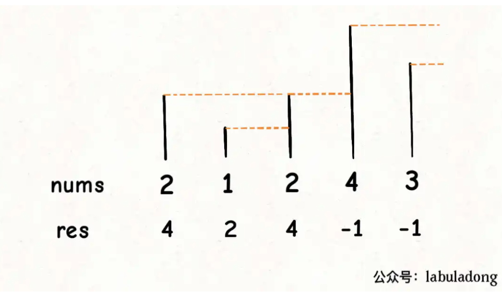
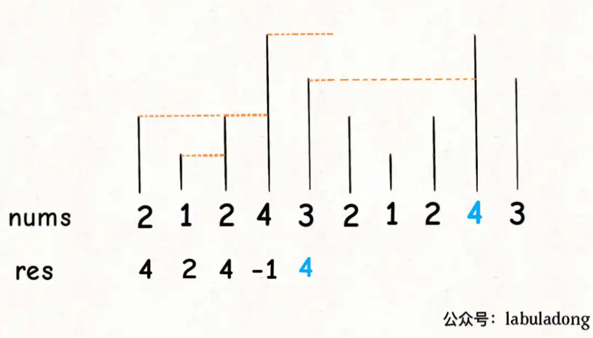

### 单调栈

单调栈，是在栈的先进后出基础之上额外添加一个特性：从栈顶到栈底的元素是严格递增（or递减）。
单调栈由于其有序性，方便处理要求序列输出有序的问题。

具体进栈过程如下：

* 对于单调递增栈，若当前进栈元素为 e，从栈顶开始遍历元素，把小于 e 或者等于 e 的元素弹出栈，直接遇到一个大于 e 的元素或者栈为空为止，然后再把 e 压入栈中。
* 对于单调递减栈，则每次弹出的是大于 e 或者等于 e 的元素。

字符串的字典序，对两个字符串，大小关系取决于两个字符串从左到右第一个不同字符的 ASCII 值的大小关系。

>leetcode 316
给你一个字符串 s ，请你去除字符串中重复的字母，使得每个字母只出现一次。需保证 返回结果的字典序最小（要求不能打乱其他字符的相对位置）。
输入：s = "bcabc"
输出："abc"

简要分析得到
1. 要去重。
2. 去重字符串中的字符顺序不能打乱 s 中字符出现的相对顺序。
3. 在所有符合上一条要求的去重字符串中，字典序最小的作为最终结果。
4. 注意在不打乱相对顺序的情况下，输出字典序最小的结果。

<!-- more -->

使用栈这种数据结构，使字符串的顺序不变。
对于去重，记住当前栈中元素，若出现过则后续元素不再入栈。这样可以做到要求1和要求2，不会打乱相对顺序，也能去重，但不能输出字典序。

重新对入栈逻辑进行调整，类似单调栈，当字符入栈时，检查栈中元素，若**栈顶元素字典序大于该字符且后续还有该栈顶元素（后面也可以入栈）**，则该栈顶元素出栈。保证了字典序。

检查栈中元素，检查top()，若满足则出栈继续检查top()，直到不符合出栈情况。
```cpp
class Solution {
public:
    string removeDuplicateLetters(string s) {
        vector<int> count(26, 0);//Count
        vector<bool> isInStack(26, false);
        stack<char> st;
        string res;
        for (auto c : s)
        {
            count[c - 'a']++;   // 字符出现次数
        }
        for (int i = 0; i < s.size(); ++i)
        {
            count[s[i] - 'a']--;
            if (isInStack[s[i] - 'a'] == false) // 栈中没有该元素
            {
                while (!st.empty() && st.top() > s[i])
                {
                    //如果只有这一个字符，不出栈
                    if (count[st.top() - 'a'] == 0)
                        break;
                    //如果有不止一个该字符，出栈并继续循环
                    isInStack[st.top() - 'a'] = false;
                    st.pop();
                }
                st.push(s[i]);
                isInStack[s[i] - 'a'] = true;
            }
        }
        while (!st.empty())
        {
            res += st.top();
            st.pop();
        }
        reverse(res.begin(), res.end());
        return res;
    }
};
```


单调栈, 只是在入栈前进行比较，满足要求的才入栈同时不满足要求的出栈, 使得新元素入栈后，**栈内的元素都保持有序**（单调递增或单调递减）.

常见的单调栈是**弹出的数据舍弃掉**, 例如栈中是5 4 3 2 1，如果压入3, 则将3 2 1弹出，再压入3，栈变成5 4 3。弹出的元素我们直接舍弃掉。

leetcode 496 题,给你一个数组，返回一个等长的数组，对应索引存储着下一个更大元素，如果没有更大的元素，就存 -1。
```
输入一个数组nums = [2,1,2,4,3]，你返回数组[4,2,4,-1,-1]。
```




如上, 我们考虑从后向前遍历。每遍历一个元素, 将栈内小于的元素出栈, 这样栈顶位置必然是下一个更大元素。如果栈空, 则加入-1。

```
从后向前考虑, 注意弹出的数据直接舍弃掉了
遍历到3, 栈空,3入栈
遍历到4, 3<4弹出, 栈空, 4入栈
遍历到2, 4>2, 栈中元素为4, 2入栈
遍历到1, 1入栈, 栈中元素1,2,4
遍历到2, 1,2,出栈, 栈中元素为4
```

```cpp
vector<int> nextGreaterElement(vector<int>& nums) {
    vector<int> res(nums.size()); // 存放答案的数组
    stack<int> s;
    // 倒着往栈里放
    for (int i = nums.size() - 1; i >= 0; i--) {
        // 去除小于该元素的栈中元素
        while (!s.empty() && s.top() <= nums[i]) {
            // 矮个起开，反正也被挡着了。。。
            s.pop();
        }
        // nums[i] 身后的 next great number
        res[i] = s.empty() ? -1 : s.top();
        // 入栈
        s.push(nums[i]);
    }
    return res;
}
```

#### 处理环形数组

同样是 `Next Greater Number`可以用单调栈解决，但是假设数组是个环形的。比如输入一个数组`[2,1,2,4,3]`，返回数组`[4,2,4,-1,4]`。拥有了环形属性，最后一个元素 3 绕了一圈后找到了比自己大的元素 4。

* 对于这种需求，常用套路就是**将数组长度翻倍**：



可以利用循环数组的技巧来模拟数组长度翻倍的效果, 而不用构造新数组。

```cpp
vector<int> nextGreaterElements(vector<int>& nums) {
    int n = nums.size();
    vector<int> res(n);
    stack<int> s;
    // 假装这个数组长度翻倍了
    for (int i = 2 * n - 1; i >= 0; i--) {
        // 索引要求模，其他的和模板一样
        while (!s.empty() && s.top() <= nums[i % n])
            s.pop();
        res[i % n] = s.empty() ? -1 : s.top();
        s.push(nums[i % n]);
    }
    return res;
}
```

#### 移除k位数字

leetcode 402 

给你一个以字符串表示的非负整数 num 和一个整数 k ，移除这个数中的 k 位数字，使得剩下的数字最小。请你以字符串形式返回这个最小的数字。

```
输入：num = "1432219", k = 3
输出："1219"
解释：移除掉三个数字 4, 3, 和 2 形成一个新的最小的数字 1219 。
```

基本思路是, 每访问一个数字, 都要移除前面比它大的数字。

```
对于 1432219
访问到1, 入栈
访问到4, 入栈
访问到3, 应该移除前面比它大的数字4
访问到2, 应该移除前面比它大的数字3
...

```

这是一个单调栈的策略, 至于最大k个数字。
* 如果我们删除了 m 个数字且 `m<k`，这种情况下我们需要从序列尾部删除额外的 `k−m` 个数字。
* 如果最终的数字序列存在前导零，我们要删去前导零。

```cpp
class Solution {
public:
    string removeKdigits(string num, int k) {
        // 元素全部会去除 
        if (k == num.size())
            return string("0");

        // 用vector模拟栈
        string stk = "";
        for (auto& digit: num) {
            /// 删除栈中大于digit的数字, 且k > 0时
            while (stk.size() > 0 && stk.back() > digit && k > 0) {
                stk.pop_back();
                k --;
            }
            stk.push_back(digit);
        }

        /// 移除栈元素, 如果k<=num.size()
        for (; k > 0; --k) {
            stk.pop_back();
        }
        int i;

        // 去除前缀0
        for (i = 0; i < stk.size()-1; i++) {
            if (stk[i] != '0') 
                break;
        }
        return stk.substr(i);
    }
};
```

### 单调队列

类似于单调栈, 单调队列从队列头到队列尾的元素是严格递增。同时在添加元素到队尾时, 先将不满足要求的元素出队(比如小于的元素)。注意，普通的队列queue是不支持从队尾删除，我们需要使用双端队列deque。

如果限制队列的大小, 一般将溢出的元素从队首出队

### 数组

#### 前缀和

前缀和数组, preSum 的含义很好理解，`preSum[i]` 就是 `nums[0..i-1]` 的和。如果我们想求 `nums[i..j]` 的和，只需要一步操作 `preSum[j+1]-preSum[i]` 即可

leetcode 1744
```
给你一个下标从 0 开始的正整数数组 candiesCount ，其中 candiesCount[i] 表示你拥有的第 i 类糖果的数目。同时给你一个二维数组 queries ，其中 queries[i] = [favoriteTypei, favoriteDayi, dailyCapi] 。

你按照如下规则进行一场游戏：

你从第 0 天开始吃糖果。
你在吃完 所有 第 i - 1 类糖果之前，不能 吃任何一颗第 i 类糖果。
在吃完所有糖果之前，你必须每天 至少 吃 一颗 糖果。
请你构建一个布尔型数组 answer ，用以给出 queries 中每一项的对应答案。此数组满足：

answer.length == queries.length 。answer[i] 是 queries[i] 的答案。
answer[i] 为 true 的条件是：在每天吃 不超过 dailyCapi 颗糖果的前提下，你可以在第 favoriteDayi 天吃到第 favoriteTypei 类糖果；否则 answer[i] 为 false 。
注意，只要满足上面 3 条规则中的第二条规则，你就可以在同一天吃不同类型的糖果。

请你返回得到的数组 answer 。

输入：candiesCount = [7,4,5,3,8], queries = [[0,2,2],[4,2,4],[2,13,1000000000]]
输出：[true,false,true]
提示：
1- 在第 0 天吃 2 颗糖果(类型 0），第 1 天吃 2 颗糖果（类型 0），第 2 天你可以吃到类型 0 的糖果。
2- 每天你最多吃 4 颗糖果。即使第 0 天吃 4 颗糖果（类型 0），第 1 天吃 4 颗糖果（类型 0 和类型 1），你也没办法在第 2 天吃到类型 4 的糖果。换言之，你没法在每天吃 4 颗糖果的限制下在第 2 天吃到第 4 类糖果。
3- 如果你每天吃 1 颗糖果，你可以在第 13 天吃到类型 2 的糖果。
```

问题转换为如何快速求得「最早/最晚」吃到第 `queries[i][0]` 类糖果的时间。前缀和数组 sum表示第i类糖果之前有多少糖果。

最早时间（第一颗 t 类糖的最早时间）：当以最大速率 c 吃糖时，可以在最早时间内吃到糖。时间为吃掉第 t 类糖果 前面 的所有糖果的时间（下取整）加 1 ：`sum[i]/t + 1`

最晚时间（最后一颗 t 类糖的最晚时间）：当以最小速率 1 吃糖时，可以计算出最晚吃糖时间。时间为吃掉所有 t 类糖的时间：`sum[i+1]`


```cpp
class Solution {
public:
    vector<bool> canEat(vector<int>& candiesCount, vector<vector<int>>& queries) {
        int n = queries.size(), m = candiesCount.size();

        vector<bool> res(n, false);
        vector<long> sum(m+1,0);

        // 第i类糖果, 每天一颗, 最晚吃到的时间
        for (int i = 1; i <= m; i++) {
            sum[i] = sum[i-1] + candiesCount[i-1];
        }

        for (int i =0; i < n; i++) {
            int t = queries[i][0], d = queries[i][1] + 1, c = queries[i][2];
            // 从第1天开始算最早最晚时间
            long a = sum[t]/c + 1;  // 第i类糖最早吃到的时间
            long b = sum[t+1];  // 第i类糖最晚吃到的时间
            res[i] = d >= a && d <= b;
        }

        return res;
    }
};
```

#### 前缀和与连续数组

求连续数组(字符串)常用的办法除双指针外, 又增加了前缀和的方法。

leetcode 523 连续的子数组和

```
给你一个整数数组 nums 和一个整数 k ，编写一个函数来判断该数组是否含有同时满足下述条件的连续子数组：

子数组大小 至少为 2 ，且
子数组元素总和为 k 的倍数。
如果存在，返回 true ；否则，返回 false 。

如果存在一个整数 n ，令整数 x 符合 x = n * k ，则称 x 是 k 的一个倍数。0 始终视为 k 的一个倍数。

```

最长连续数组, 想起了用前缀和, 也就是
`prefix_sum[i+1] - prefix_sum[i] = nums[i]`

前缀和数组大小为nums数组的长度+1。这样某一段连续子数组的和可用前缀和数组表示, 例如`nums[3]+num[4] = prfix_sum[5] - prefix_sum[3]`。本题因此可用前缀和数组遍历解决, 时间复杂度为O(n^2)。

在此之上我们考虑, 一段连续数组之和可用前缀和数组差表示, 而要求的段和可被k整除可以表示`prefix_sum[i] -prefix_sum[j] = n*k`。**这里说明了`prefix_sum[i] %k == prefix_sum[j] % k`**。

由此有了O(N)时间复杂度的办法, 遍历前缀和数组, 用map存储(数组元素模k值, 数组元素序号), 若map存在同样的key说明存在``prefix_sum[i] %k == prefix_sum[j] % k`, 只需要验证序号差是否大于等于2即可得到解。

```cpp
class Solution {
public:
    bool checkSubarraySum(vector<int>& nums, int k) {
        int n = nums.size();
        map<int, int> use_map;
        vector<int> prefix_nums(n+1,0);

        for (int i = 1; i <= nums.size(); i++) {
            prefix_nums[i] = prefix_nums[i-1] + nums[i-1];
        }

        for (int j = 0; j < prefix_nums.size(); j++) {
            if (! use_map.count(prefix_nums[j] % k)) {
                use_map[prefix_nums[j] % k] = j;
            }else {
                if (j - use_map[prefix_nums[j] % k] >= 2)
                    return true;
            }
        }

        return false;
    }
};
```

#### leetcode 525 连续数组

```
给定一个二进制数组 nums , 找到含有相同数量的 0 和 1 的最长连续子数组，并返回该子数组的长度
```

同样的求前缀和我们可得`prefix_sum[i+1] - prefix_sum[i] = nums[i]`, 即判断是否存在`prefix_sum[i]`与`prefix_sum[j]`中是否存在相同数量的0和1。

考虑将0替换成-1, 直接得到`prefix_sum[i] - prefix_sum[j] == 0`, 因为存在的1和-1数量相同。

基于此可以编程
```cpp
class Solution {
public:
    int findMaxLength(vector<int>& nums) {
        unordered_map<int, int> use_map;
        int n = nums.size();
        vector<int> prefix_nums(n+1, -1);
        for (int i = 1; i <= n; i++) {
            /// 0替换成-1
            if (nums[i-1] == 0)
                prefix_nums[i] = -1 + prefix_nums[i-1];
            else
                prefix_nums[i] = 1 + prefix_nums[i-1];
        }

        int max_len = 0;
        for (int i = 0; i <= n; i++) {
            /// 存在prefix_nums[j] 使prefix_nums[i] == prefix_nums[j] 
            if (!use_map.count(prefix_nums[i])) {
                use_map[prefix_nums[i]] = i;
            }
            else {
                max_len = max(max_len, i - use_map[prefix_nums[i]]);
            }
        }

        return max_len;
    }
};
```

#### 翻转链表

一次处理一个节点，必须清晰处理的是哪个节点, 动对应的指针。

```cpp
class Solution {
public:
    ListNode* reverseList(ListNode* head) {
        if (!head || !head->next )
            return head;
        ListNode* prev = nullptr;
        ListNode* current = head;
        while (current) {
            /// prev, current, next三个指针, 只有current指向当前需要处理的节点
            ListNode* next = current->next;
            current->next = prev;
            prev = current;
            current = next;
        }
        return prev;
    }
};
```