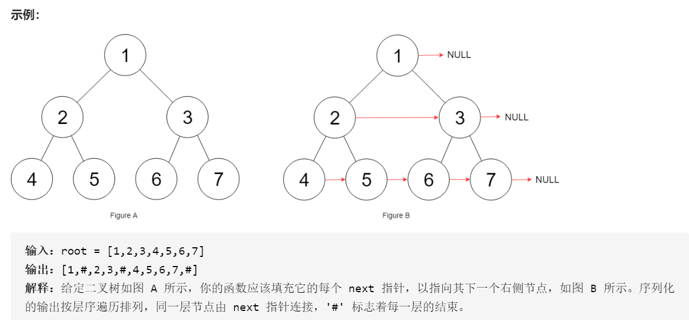
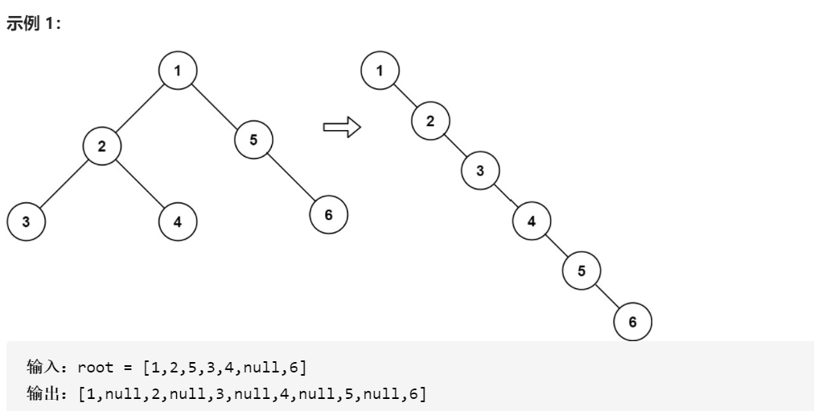

### 二叉树

回溯、动归、分治算法，可以看成基于树结构的问题。图的处理，也是可以转化成多叉树，多了个有环的特点。

快速排序可以理解为二叉树的前序遍历(根左右)，从根节点慢慢下降, 得到的叶子节点就是最终排序结果。归并排序可以理解为二叉树的后续遍历(左右根),从叶子节点逐渐向上,最终的根节点就是最终排序结果

快速排序的逻辑是，若要对`nums[lo..hi]`进行排序，我们先找一个分界点`p`，通过交换元素使得`nums[lo..p-1]`都小于等于`nums[p]`，且`nums[p+1..hi]`都大于`nums[p]`，然后递归地去`nums[lo..p-1]`和`nums[p+1..hi]`中寻找新的分界点，最后整个数组就被排序了。

```cpp
void sort(int[] nums, int lo, int hi) {
    /****** 前序遍历位置 ******/
    // 通过交换元素构建分界点 p
    int p = partition(nums, lo, hi);
    /************************/

    sort(nums, lo, p - 1);
    sort(nums, p + 1, hi);
}
```

<!-- more -->

归并排序的逻辑，若要对`nums[lo..hi]`进行排序，我们先对`nums[lo..mid]`排序，再对`nums[mid+1..hi]`排序，最后把这两个有序的子数组合并，整个数组就排好序了。

```cpp
void sort(int[] nums, int lo, int hi) {
    int mid = (lo + hi) / 2;
    sort(nums, lo, mid);
    sort(nums, mid + 1, hi);

    /****** 后序遍历位置 ******/
    // 合并两个排好序的子数组
    merge(nums, lo, mid, hi);
    /************************/
}
```

递归算法的出口, 对于树来说, 出口就是`node == nullptr`。

二叉树的定义, 二叉搜索树, 中序遍历是有序的。

```cpp
struct TreeNode {
    int val;
    TreeNode *left;
    TreeNode *right;
    TreeNode() : val(0), left(nullptr), right(nullptr) {}
    TreeNode(int x) : val(x), left(nullptr), right(nullptr) {}
    TreeNode(int x, TreeNode *left, TreeNode *right) : val(x), left(left), right(right) {}
 };
 ```

 #### 填充每个节点的下一个右侧节点指针 

 

 二叉树的问题难点在于，如何把题目的要求**细化成每个节点需要做的事情**，但是如果只依赖一个节点的话，肯定是没办法连接「跨父节点」的两个相邻节点的。

 ```cpp
Node* connect(Node* root) {
    if (!root)
        return root;
    recursion(root->left, root->right);

    return root;

}

void recursion(Node* l, Node* r) {

    // l或者r为nullptr, 都应该退出之
    if (!l || !r) {
        return;
    }

    l->next = r;

    recursion(l->left, l->right);
    recursion(r->left, r->right);
    recursion(l->right,r->left);
}
```


#### 二叉树展开成链表

给你二叉树的根结点 root ，请你将它展开为一个单链表：展开后的单链表应该与二叉树 先序遍历 顺序相同。
 

以下流程：

1. 将root的左子树和右子树拉平。

2. 将root的右子树接到左子树下方，然后将整个左子树作为右子树。


```cpp
class Solution {
public:
    void flatten(TreeNode* root) {
        if (!root)
            return;

        /// 左右子树递归
        flatten(root->left);
        flatten(root->right);

        /// 左右子树已经被拉直

        TreeNode* l = root->left;
        TreeNode* r = root->right;

        /// 重设置左右子树
        root->left = nullptr;
        root->right = l;
        /// 右子树连接到左子树尾部
        TreeNode* p = root;
        while (p->right != nullptr) {
            p=p->right;
        }
        p->right = r;
    }
};
```

这个和归并排序原理好类似，相当于二叉树左右根向上拼接。

#### 判断二叉搜索树
leetcode 98. 验证二叉搜索树
 BST 的定义，root的整个左子树都要小于root.val，整个右子树都要大于root.val。这时可以辅助函数，增加函数参数列表，将这种约束传递给子树的所有节点

 ```cpp
 boolean isValidBST(TreeNode root) {
    return isValidBST(root, null, null);
}

class Solution {
public:
    bool isValidBST(TreeNode* root) {
        return isValidBST(root ,nullptr, nullptr);
    }

    bool isValidBST(TreeNode*root, TreeNode* min, TreeNode* max) {
        if (root == nullptr)
            return true;
        if (min != nullptr && root->val <= min->val)
            return false;
        if (max != nullptr && root->val >= max->val)
            return false;
        // 限定左子树的最大值是 root->val，右子树的最小值是 root->val
        return isValidBST(root->left, min, root)
            && isValidBST(root->right, root, max);
    }
};
```

### AVL树

AVL 树是一种平衡二叉树，得名于其发明者的名字(Adelson-Velskii 以及 Landis)。平衡二叉树递归定义如下：

1. 左右子树的高度差小于等于 1。其中左子树的高度减去右子树高度为平衡因子, 因此AVL树也是所有结点的平衡因子的绝对值都不超过 1 的二叉树
2. 其每一个子树均为平衡二叉树。

AVL树节点的定义变量包括, key, 子树高度, `*left`和`*right`。注意初始化节点高度为1
```cpp
    class node{
    public:
        T key;
        int height;
        node * left;
        node * right;
        node(T k){
            height = 1;
            key = k;
            left = NULL;
            right = NULL;
        }
    };
```

树的高度, 输入根节点, 直接返回高度变量, 如果节点为空高度为0。
```cpp
    // tree height
    int height(node* head){
        if (head==nullptr)
            return 0;
        return head->height;
    }
```

插入节点是一个递归的过程, 是AVL的核心, 这个操作集检索插入位置以及插入, 更新高度, 检查平衡和处理不平衡为一体。

1. 先插入值, 即根据key的大小最终找到一个为NULL的节点, 新建节点对象。返回新建的指针。
2. 然后更新树高, 新添加的节点初始化高度为1, 然后返回后会逐渐更新根节点的高度, 方法是`head->height = 1 + max(height(head->left), height(head->right));`
3. 每个更新树高的过程会同时判断是否平衡, 当平衡因子绝对值大于1说明需要调整, 也就是左旋右旋。基本思路是, **如果左子树高且元素插入到左子树的左孩子里头**, 只需要以head为轴右旋;**如果左子树高但元素插入到左子树的右孩子里头**; 则先以head->left为轴左旋, 再以head为轴右旋。右子树高同理。2,3每次递归都会进行, 从叶子节点直到根节点, 从而**更新了涉及插入节点的每个子树的高度以及判断了每个子树是否平衡**

```cpp
node * insertUtil(node * head, T x){
        if(head==NULL){
            n+=1;   // 节点个数
            node * temp = new node(x);
            return temp;
        }
        // 先插入值, 返回到head->left或者head->right
        // 注意如果发生了旋转, 返回的根节点也会重新设置为head->left或者head->right, 因此这里既有插入操作返回节点, 也包括旋转操作返回节点
        if(x < head->key) head->left = insertUtil(head->left, x);
        else if(x > head->key) head->right = insertUtil(head->right, x);

        // 再更新树高
        head->height = 1 + max(height(head->left), height(head->right));

        // 更新树高后判断是否左旋右旋
        int bal = height(head->left) - height(head->right);
        if(bal>1){  // 左侧高
            if(x < head->left->key){    // 说明元素插入到了左子树的左孩子，右旋即可
                return rightRotation(head);
            }else{  
                head->left = leftRotation(head->left);  // 插入到左子树的右孩子，先左旋再右旋转
                return rightRotation(head);
            }

        }else if(bal<-1){
            // 右侧高
            if(x > head->right->key){   // 元素插入到了右子树的右孩子, 只需要左旋
                return leftRotation(head);
            }else{  // 元素插入到了右子树的左孩子, 需要先以head->right为轴右旋,再以head为轴左旋
                head->right = rightRotation(head->right);   
                return leftRotation(head);
            }
        }
        return head;
    }
```

4. 左旋右旋实际上就是处理三个节点的关系, 右旋也就所顺时针旋转，左旋逆时针。输入的节点是旋转的轴节点(根节点), 右旋, 轴节点的左孩子变成新的轴节点, **原轴节点变成了新轴节点的右子树**。**新轴节点原来的右子树则变成了原轴节点的左子树**。总共用了原轴节点, 新轴节点，新轴节点原来的右子树三个节点。返回的节点指针是新的轴节点, 并被插入操作`head->left = insertUtil(head->left, x);`接收, 注意更新高度

```cpp
    node * rightRotation(node* head){
        node* newhead = head->left; // head为原轴节点, newhead为新轴节点
        head->left = newhead->right; // 新轴节点原来的右子树变成原轴节点的左子树
        newhead->right = head;  // 原轴节点变成新轴节点的右子树

        // 更新原轴节点的高度, 原轴节点子树没变, 因此高度不变
        head->height = 1+max(height(head->left), height(head->right));
        // 更新新轴节点的高度, 新轴节点左子树没变, 右子树变为head
        newhead->height = 1+max(height(newhead->left), height(newhead->right));
        // 返回的新轴节点为新的轴节点
        return newhead;
    }

    // 左旋，本来头节点为head(记A)，变成了head的右子树节点(记B)
    // 同时B的左子树变成了A的右子树，A变成了B的左子树
    // 一切操作与右旋相反
    node * leftRotation(node * head){
        node * newhead = head->right;
        head->right = newhead->left;
        newhead->left = head;
        head->height = 1+max(height(head->left), height(head->right));
        newhead->height = 1+max(height(newhead->left), height(newhead->right));
        return newhead;
    }
```
    
删除节点, 简单的也是通过二叉搜索找到要删除的节点, 删除之, 更新高度, 检查是否平衡和处理。这一个流程也是一个递归解决。

```cpp
    node* removeUtil(node * head, T x){
        if(head==NULL) return NULL;
        if(x < head->key){
            head->left = removeUtil(head->left, x);
        }else if(x > head->key){
            head->right = removeUtil(head->right, x);
        }else{
        // 将当前节点删除
            node * r = head->right;
            if(head->right==NULL){
                node * l = head->left;
                delete(head);
                head = l;
            }else if(head->left==NULL){
                delete(head);
                head = r;
            }else{
                while(r->left!=NULL) r = r->left;
                head->key = r->key;
                head->right = removeUtil(head->right, r->key);
            }
        }
        if(head==NULL) return head;
        head->height = 1 + max(height(head->left), height(head->right));

        // 删除之后需要更新高度
        int bal = height(head->left) - height(head->right);
        /// 检查是否平衡
        if(bal>1){
            if(height(head->left) >= height(head->right)){
                return rightRotation(head);
            }else{
                head->left = leftRotation(head->left);
                return rightRotation(head);
            }
        }else if(bal < -1){
            if(height(head->right) >= height(head->left)){
                return leftRotation(head);
            }else{
                head->right = rightRotation(head->right);
                return leftRotation(head);
            }
        }
        return head;
    }
```

提供二叉查找的功能
```
    // 二叉查找树
    node * searchUtil(node * head, T x){
        if(head == NULL) return NULL;
        T k = head->key;
        if(k == x) return head;
        if(k > x) return searchUtil(head->left, x);
        if(k < x) return searchUtil(head->right, x);
    }
```


