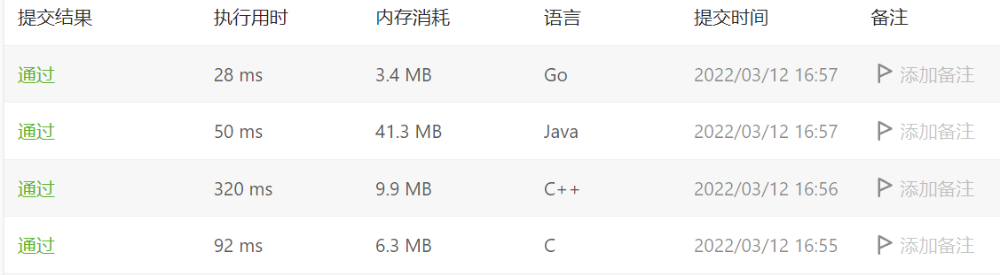
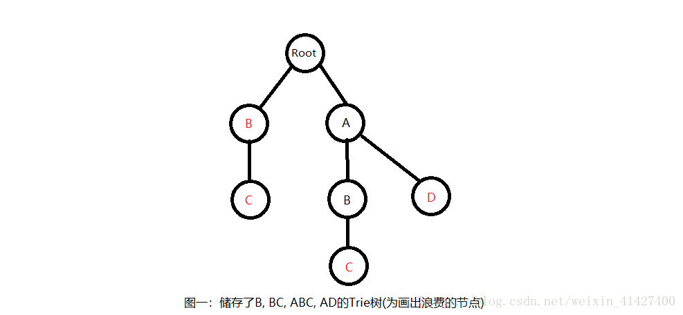

算法参考网站

https://leetcode-solution-leetcode-pp.gitbook.io/leetcode-solution/

leetcode第一题两数之和, golang也太猛了, C/C++没开优化因此慢了速度



### LRU

涉及的主要技术，
* LRU存储的数据是key-value型数据
* 链表使用虚拟节点方便进行节点的删除和插入。单向链表使用虚拟头节点，双向链表使用虚拟头节点和虚拟尾节点。
* 使用一个`map<int, LinkedNode>`可以轻松根据`key`映射到`LinkedNode`，查询数据

* 双向链表来维护数据存储，起到队列的作用, 新数据从头节点插入，而旧数据需要从尾节点删除。原本的旧数据一旦被处理应该移动到头节点变成新数据。这里的处理策略也是需要学习的。

* 查找, 添加，删除的时间复杂度都是O(1), map支持查找, list支持添加删除

<!-- more -->

```cpp
// 双向链表，作为存储单元
// 存储的数据是key-value
struct DLinkedNode {
    int key, value;
    DLinkedNode* prev;
    DLinkedNode* next;
    DLinkedNode(): key(0), value(0), prev(nullptr), next(nullptr) {}
    DLinkedNode(int _key, int _value) : key(_key), value(_value), prev(nullptr), next(nullptr) {}
};

// LRU 最近最少使用，这个使用包括geth和put，也就是一旦执行get或者put就要移动节点到头部
// 对于size > capaity的情况要删除尾部节点
// map可以通过key定位到节点，实现查询O(1)复杂度。get步骤实际通过map进行
// Put步骤需要判断存在否，
// 四个子方法，添加节点头部，删除某个节点，删除尾部节点并返回，移动某个节点到头节点
class LRUCache {
private:
    // 使用hash表，直接根据key定位存储的节点
    // 使用链表修改元素
    unordered_map<int, DLinkedNode* > cache;
    DLinkedNode* head;
    DLinkedNode* tail;
    int size;
    int capacity;

public:
    LRUCache(int _capacity): capacity(_capacity), size(0) {
        // 使用伪头部和伪尾部节点，构建head和tail节点
        // head和tail不存储数据，实际是虚拟节点，方便进行插入删除定位的。
        // 同理，链表增加一个虚拟头节点便于数据插入删除处理
        // 初始化capacity和size
        head = new DLinkedNode();
        tail = new DLinkedNode();
        head->next = tail;
        tail->prev = head;
    }
    
    int get(int key) {
        if (!cache.count(key)) {
            return -1;
        }
        // 如果 key 存在，先通过哈希表定位，再移到头部
        DLinkedNode* node = cache[key];
        moveToHead(node);
        return node->value;
    }
    
    void put(int key, int value) {
        if (!cache.count(key)) {
            // 如果 key 不存在，创建一个新的节点
            DLinkedNode* node = new DLinkedNode(key, value);
            // 添加进哈希表
            cache[key] = node;
            // 添加至双向链表的头部
            addToHead(node);
            ++size;
            if (size > capacity) {
                // 如果超出容量，删除双向链表的尾部节点
                DLinkedNode* removed = removeTail();
                // 删除哈希表中对应的项
                cache.erase(removed->key);
                // 防止内存泄漏
                delete removed;
                --size;
            }
        }else{
            // 如果 key 存在，先通过哈希表定位，再修改 value，并移到头部
            DLinkedNode* node = cache[key];
            node->value = value;
            moveToHead(node);
        }
    }

    // 添加到第一个数据，一共四个link
    // 分别是node->prev node->next
    // head->next->prev head->next 
    void addToHead(DLinkedNode* node) {
        node->prev = head;
        node->next = head->next;
        head->next->prev = node;
        head->next = node;
    }
    
    // 删除某个节点node
    // 调整两个link
    // node->prev->next node->next->prev
    void removeNode(DLinkedNode* node) {
        node->prev->next = node->next;
        node->next->prev = node->prev;
    }

    // 移动节点到头节点，两个步骤
    // 删除该节点
    // 在头部插入该节点
    void moveToHead(DLinkedNode* node) {
        removeNode(node);
        addToHead(node);
    }

    // 删除尾部节点
    DLinkedNode* removeTail() {
        DLinkedNode* node = tail->prev;
        removeNode(node);
        return node;
    }
};
/**
 * Your LRUCache object will be instantiated and called as such:
 * LRUCache* obj = new LRUCache(capacity);
 * int param_1 = obj->get(key);
 * obj->put(key,value);
 */
```

### Leetcode 前缀树
trie树(前缀树)，也就是单词查找树。Trie树和其他的各种查找树一样也是由链接的节点组成的数据结构，这些节点可以为空，也可以指向其他的节点。

trie由一个根节点引出所有的节点，且根部不储存任何的属性。


* 插入操作，遍历需要插入的string，同时指针p从root一直往下next，如果对应字符的next为NULL，就创建一个新的TrieNode，遍历完后，在最终那个TireNode标记为True，表示这个TrieNode对应的词在这课Trie树中存在。

* 查找操作，从第一字符开始检索查找的单词，若第一个字符查找到，则检索其下一层是否有第二个字符，直到查找完最后一位字符； 若中途只能查找到空节点(子节点有26个，没有查到的是空节点)，或是最后节点isword==false,则返回false，否则返回true； 

* 删除操作，查找到目标单词的最后一个单词所在的节点，将这个单词节点设置isword=false，同时从这个节点开始向根节点回溯，**如果一个节点的下一层节点全为空节点则删除该节点**。树的删除往往比较复杂, 删除操作可以使用递归解决。
```cpp
struct TrieNode {
    char val;
    /// val->node*
    unordered_map<char, TrieNode*> next;
    bool isend;

    TrieNode(char val_):val(val_), isend(false) {}
};

class Trie {
public:
    /** Initialize your data structure here. */
    Trie() {
        // 根节点不存储
        root = new TrieNode('0');
    }
    
    /** Inserts a word into the trie. */
    void insert(string word) {
        TrieNode* p = root;
        bool isin = true;
        for (char c : word) {
            if (isin && p->next.count(c)) {
                p = p->next[c];
            }else{
                isin = false;
                TrieNode* node = new TrieNode(c);
                p->next[c] = node;
                p = node;
            }
        }
        p->isend = true;
    }
    
    /** Returns if the word is in the trie. */
    /// 区分word还是前缀
    /// 加一个结束标识
    bool search(string word) {
        TrieNode* p = root;
        for (char c : word) {
            if (p->next.count(c)) {
                p = p->next[c];
            }else{
                return false;
            }
        }
        return p->isend;
    }
    
    /** Returns if there is any word in the trie that starts with the given prefix. */
    bool startsWith(string prefix) {
        TrieNode* p = root;
        for (char c : prefix) {
            if (p->next.count(c)) {
                p = p->next[c];
            }else{
                return false;
            }
        }
        return true;
    }

private:
    TrieNode* root;
};
```

#### 前缀树来优化递归

对于网格迷宫字符串的问题搜索的问题, 可以使用前缀树优化递归, 例如

```
给定一个 m x n 二维字符网格 board 和一个单词（字符串）列表 words，找出所有同时在二维网格和字典中出现的单词。

单词必须按照字母顺序，通过 相邻的单元格 内的字母构成，其中“相邻”单元格是那些水平相邻或垂直相邻的单元格。同一个单元格内的字母在一个单词中不允许被重复使用。

输入：board = [["o","a","a","n"],["e","t","a","e"],["i","h","k","r"],["i","f","l","v"]], words = ["oath","pea","eat","rain"]
输出：["eat","oath"]
```

自然想到每个单元格开始递归遍历, 并不断和words的单词进行匹配。可是, 什么时候结束递归呢。

最有效的办法是利用前缀树, 将words用前缀树维护, 每在二维网格递归一次, 就查询以下前缀树是否有该前缀, 如果没有可以提前return。

我之前用办法是查字符串长度,如果超过长度则return, 显然前缀树办法更高效(剪枝), 不需要超过长度就可以提前剪枝

```cpp
struct Trie
{
    /// Trie维护两个元素
    /// child[26]数组一个顶俩, 既表示了当前字符char, 又表示了next
	Trie* child[26];
    /// 结尾
	string word = "";

	Trie() {
		for (int i = 0; i < 26; i++)
			child[i] = nullptr;
	}
};
class Solution {
public:
	vector<string> res;
	vector<string> findWords(vector<vector<char>>& board, vector<string>& words) {
		Trie* t = new Trie();
		//创建前缀树，将words中所有单词加入前缀树
		for (int i = 0; i < words.size(); i++)
		{
			Trie* cur = t;
			for (int j = 0; j < words[i].size(); j++)
			{
				if (cur->child[words[i][j] - 'a'] == nullptr)
					cur->child[words[i][j] - 'a'] = new Trie();
				cur = cur->child[words[i][j] - 'a'];
			}
			cur->word = words[i];
		}
		for (int i = 0; i < board.size(); i++)
		{
			for (int j = 0; j < board[i].size(); j++)
			{
				dfs(board, t, i, j);	
			}
		}
		return res;
	}
	void dfs(vector<vector<char>>& board, Trie* t,int i ,int j)
	{
		if (i < 0 || j < 0 || i >= board.size() || j >= board[0].size())
			return;
		char c = board[i][j];
        /// 如果前缀树查不到return
		if (c == '*' || t->child[c-'a']==nullptr)
			return;
        /// 下一个char
		t = t->child[c - 'a'];
        /// 有这样的words, 加入res
        /// 用t->word原因是1.表示到word结尾2.防止加入重复word
		if (t->word != "")
		{
			res.push_back(t->word);
			t->word = "";
		}
        /// board可以同时做标记
		board[i][j] = '*';
		dfs(board, t, i + 1, j);
		dfs(board, t, i - 1, j);
		dfs(board, t, i, j + 1);
		dfs(board, t, i, j - 1);
		board[i][j] = c;
		return;	
	}
};
```

### 添加与搜索单词 - 数据结构设计

```
请你设计一个数据结构，支持 添加新单词 和 查找字符串是否与任何先前添加的字符串匹配 。

实现词典类 WordDictionary ：

WordDictionary() 初始化词典对象
void addWord(word) 将 word 添加到数据结构中，之后可以对它进行匹配
bool search(word) 如果数据结构中存在字符串与 word 匹配，则返回 true ；否则，返回  false 。word 中可能包含一些 '.' ，每个 . 都可以表示任何一个字母。
```

方便单词存储和搜索的数据结构是前缀树, 也就是Trie.Trie的构造就是基于26维的指针数组, 26维代表26个字母, 指针指向下一个节点

检索时有`.`通配符, 这样检索只能用dfs搜索了, 不能简单的通过是否有指针依次检索。检索复杂度是指数的。

```cpp
class TrieNode {
public:
    vector<TrieNode*> next;
    bool isend;
    TrieNode() :isend(false){
        next.resize(26, nullptr);
    }
};

class WordDictionary {
public:
    TrieNode* root;
    WordDictionary() {
        root = new TrieNode();
    }
    /// 通过前缀树添加
    void addWord(string word) {
        TrieNode* node = root;
        for (auto& w : word) {
            if (!node->next[w-'a'])
                node->next[w-'a'] = new TrieNode();
            node = node->next[w-'a'];
        }
        /// 单词结束标志
        node->isend = true;
    }
    
    /// 通过dfs检索单词
    bool search(string word) {
        return dfs(root, word, 0);
    }

    bool dfs(TrieNode* node, string word, int index) {
        if (index == word.size() && node->isend == true)
            return true;
        if (index == word.size() && node->isend == false)
            return false;
        
        bool flag = false;
        for (int i = 0; i < 26; i++) {
            if (node->next[i] && (word[index] == '.' || word[index]-'a'==i))
                flag = flag || dfs(node->next[i], word, index+1);
        }

        return flag;
    }
};
```

### 用两个堆维护中位数

leetcode 295 数据流的中位数

```
[2,3,4] 的中位数是 3

[2,3] 的中位数是 (2 + 3) / 2 = 2.5

设计一个支持以下两种操作的数据结构：

void addNum(int num) - 从数据流中添加一个整数到数据结构中。
double findMedian() - 返回目前所有元素的中位数

addNum(1)
addNum(2)
findMedian() -> 1.5
addNum(3) 
findMedian() -> 2
```

堆定义如下

1. 堆树是一颗完全二叉树；

2. 堆树中某个节点的值总是不大于或不小于其孩子节点的值；

3. 堆树中每个节点的子树都是堆树。

使用两个优先队列（堆）来维护整个数据流数据，令维护数据流左半边数据的优先队列（堆）为 l，维护数据流右半边数据的优先队列（堆）为 r

当数据流元素数量为偶数：l 和 r 大小相同，此时动态中位数为两者堆顶元素的平均值; 当数据流元素数量为奇数：l 比 r 多1，此时动态中位数为 l 的堆顶原数。

stl 最大堆参数为`less<int>`, 异即`bool operator() return a < b`, 最大堆排序是升序, 每次最大元素出堆。最小堆反之。

堆push pop之后内部会自动排好序
```cpp
class MedianFinder {
public:
// 大顶堆, 堆顶元素为前半的最大值
    priority_queue<int, vector<int>, less<int>> queMin;
// 小顶堆, 堆顶是后半的最小值
    priority_queue<int, vector<int>, greater<int>> queMax;

    MedianFinder() {}

    void addNum(int num) {

        if (queMin.empty() || num <= queMin.top()) {
            /// num位于前半部分
            queMin.push(num);
            /// 只能允许size之差最大为1
            if (queMax.size() + 1 < queMin.size()) {
                queMax.push(queMin.top());
                queMin.pop();
            }
        } else {
          /// 后半部分
            queMax.push(num);
            /// 不能允许queMax堆大于queMin
            if (queMax.size() > queMin.size()) {
                queMin.push(queMax.top());
                queMax.pop();
            }
        }
    }

    double findMedian() {
        // 奇数
        if (queMin.size() > queMax.size()) {
            return queMin.top();
        }
        // 偶数情况
        return (queMin.top() + queMax.top()) / 2.0;
    }
};
```

#### 最大矩阵和

```
给定一个正整数、负整数和 0 组成的 N × M 矩阵，编写代码找出元素总和最大的子矩阵。

返回一个数组 [r1, c1, r2, c2]，其中 r1, c1 分别代表子矩阵左上角的行号和列号，r2, c2 分别代表右下角的行号和列号。
```

可以从最大子序和说起,
leetcode 53
```
给定一个整数数组 nums ，找到一个具有最大和的连续子数组（子数组最少包含一个元素），返回其最大和。
```

可以用动态规划来解
```cpp
    int maxSubArray(vector<int>& nums) {
        if (nums.size() == 1)
           return nums[0]; 
        vector<int> dp(nums.size(),0);
        dp[0] = nums[0];
        for (int i = 1; i < nums.size(); i++){
          // 要么等于dp[i-1]+nums[i], 要么从头开始等于nums[i]
          /// 其实等价于判断if dp[i-1] >0 
            dp[i] = max(dp[i-1]+nums[i],nums[i]);
        }

        int res = dp[0];
        for (int i = 1; i < dp.size(); i++)
            res = max(res,dp[i]);
        return res;
    }
```

而最大矩阵和, 可以将二维转化为一维，对于矩阵的每一列，我们将其加在一起，成为了一维上的一个数，二维矩阵的和转化为了一维数组的和。也就是最大子段和。


### leetcode2034. 股票价格波动

```
给你一支股票价格的数据流。数据流中每一条记录包含一个 时间戳 和该时间点股票对应的 价格 。

不巧的是，由于股票市场内在的波动性，股票价格记录可能不是按时间顺序到来的。某些情况下，有的记录可能是错的。如果两个有相同时间戳的记录出现在数据流中，前一条记录视为错误记录，后出现的记录 更正 前一条错误的记录。

请你设计一个算法，实现：

更新 股票在某一时间戳的股票价格，如果有之前同一时间戳的价格，这一操作将更正之前的错误价格。
找到当前记录里 最新股票价格。最新股票价格 定义为时间戳最晚的股票价格。
找到当前记录里股票的 最高价格。
找到当前记录里股票的 最低价格
```

优先队列存储最大值和最小值

基本思路, 使用两个优先队列维护最大值和最小值。使用map维护查询。

因为可能存在后来插入的覆盖前面插入的，因此这里使用`stocks[timestamp] = price;`起到覆盖作用, 而`stocks.insert({timestamp, price});`调用`unique_insert`不能起到覆盖的作用。

由于可能被覆盖，因此最大堆出队不一定是最大值，这时候需要判断该值是否已经被覆盖，判断的方法只需要判断该price值是否存在map中即可。

<!-- more -->

```cpp
class StockPrice {
public:
    StockPrice() {
       
    }
    /// 更新值
    void update(int timestamp, int price) {
        if (timestamp>=currentTime) { 
            currentPrice = price;
            currentTime = timestamp;
        }
        //stocks.insert({timestamp, price}); insert不会被覆盖
        stocks[timestamp] = price;
        minHeap.push({price, timestamp});   /// 插入{price, timestamp}, 会自动按照price排序得到最大堆或者最小堆
        maxHeap.push({price, timestamp});
        
    }
    
    int current() {
        return currentPrice;    /// 当前值(时间戳最大对应的price)
    }
    
    int maximum() {
        auto p = maxHeap.top();

        while (stocks[p.second] != p.first) {   /// 如果stocks[p.second] != p.first，说明该price被覆盖了
            maxHeap.pop();
            p = maxHeap.top();
        }
        return p.first;
    }
    
    int minimum() {
        auto p = minHeap.top();
        while (stocks[p.second] != p.first) {
            minHeap.pop();
            p = minHeap.top();
        }
        return p.first;
    }
private:
    int currentPrice;

    int currentTime;


    map<int, int> stocks;
    priority_queue<pair<int,int>, vector<pair<int, int>>, less<pair<int, int>>> maxHeap;
    priority_queue<pair<int, int>, vector<pair<int, int>>, greater<pair<int, int>>> minHeap;

};
```
