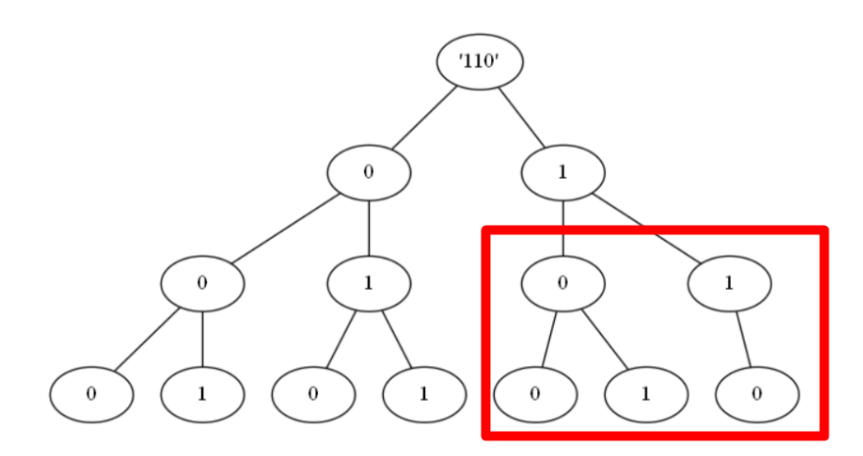

### leetcode 600 不含连续1的非负整数

* 给定一个正整数 n，找出小于或等于 n 的非负整数中，其二进制表示不包含 连续的1 的个数。

```
输入: 5
输出: 5
解释: 
下面是带有相应二进制表示的非负整数<= 5：
0 : 0
1 : 1
2 : 10
3 : 11
4 : 100
5 : 101
其中，只有整数3违反规则（有两个连续的1），其他5个满足规则。
```

#### dfs的解法

dfs从1开始，按位增。如果当前结尾是1的话就补0； 如果是0的话就补0或者1；如果大于n就停止。

<!-- more -->

```cpp
class Solution {
public:
    int ans = 0;
    int g_n;
    int findIntegers(int n) {
        g_n = n;
        ans = 1;
        dfs(1);
        return ans;
    }

    /// 表示从1(01)开始填位
    void dfs(int cur){
        if(cur > g_n) return;

        /// 递归一次, 一次情况 +1
        ans++;
        /// 如果当前位1, 下一位只能选10
        if((cur & 1)){
            dfs(cur << 1);
        } 
        /// 当前位位0, 下一次可以是00,01两者
        else{
            dfs(cur << 1);
            dfs((cur << 1)+1);
        }
        return;
    }
};
```

这种按位决策的思路, 可以引申到动态规划中。

我们考虑从二进制高位到低位填数, 如果当前二进制数为1, 则如果填0则肯定小于这个数(例如`101`, 首位填0得到`0XX`肯定小于`101`), 当然可以填1, 填完1之后我们需要观察下一位进一步判断; 如果当前二进制数为0, 则必须填`0`, 然后看下一位。

```
对x的二进制分析
满足条件的数 res = 0

loop 
如果当前位是1，res += (当前位为0的所有情况), 判断下一位
如果当前位是0, 直接判断下一位 
```

因此我们需要一个备忘录记住(当前位位0的所有情况), 就可以直接查找了。可以记`f[i][j]`表示二进制位数位`i`, 最高位为`j`且不超`j11111`的满足要求数的个数, 即`f[2][0]`表示不超`01`的个数, `f[2][1]`表示不超`11`的个数，如`f[2][1] = 3`分别是,`00, 01,10` 有`f[i + 1][0] = f[i][1]; f[i + 1][1] = f[i][0] + f[i][1];`。

这样上述`当前位为0的所有情况`也就是`f[i][0]`, 也就是不超过`01111...`的个数。


```cpp
class Solution {
public:
/// 判断最高位为1
    int get_bina_len(int n) {
        for (int i = 31; i >= 0; i--) {
            /// n的二进制有多少位
            if ((n>>i) & 1 == 1)
                return i;
        }
    }

    int findIntegers(int n) {
        int len = get_bina_len(n);
        vector<vector<int>> dp(len+2, vector<int>(2,0));
        dp[1][0] = 1;
        dp[1][1] = 2;
        for (int i = 2; i <= len+1; i++) {
            dp[i][0] = dp[i-1][1];
            dp[i][1] = dp[i-1][0] + dp[i-1][1];
        }
        /// 从高到低
        int res = 0;
        int prev = 0;
        for (int i = len; i >= 0; i--) {
            /// 当前位数字
            int cur = (n>>i) &1;
            if (cur == 1)
                /// 当前放0的所有结果
                res += dp[i+1][0];
            /// 不能继续下去因为这里不能放1了
            if (prev == 1 && cur == 1) 
                break; 
            /// 如果没有连续的1说明这里可以继续放1
            prev = cur;
            /// 加一个当前的值
            if (i == 0) res++;

        }
        return res;
    }
};
```

#### 01字典树+动态规划



由以上字典树, 我们可以看出, 路径可由若干以`0`为根节点的满二叉子树组成, 考虑用 `dp[k][t]` 表示根节点为 k，高度为 t 的满二叉树中，满足题意的路径数量。

如果根节点为0, 有`dp[0][t]=dp[0][t−1]+dp[1][t−1]`, 子节点可以为0也可以为1

如果根节点为1, 子节点只能为0, `dp[1][t]=dp[0][t−1]`

所以有`dp[0][t]=dp[0][t−1]+dp[1][t−1]=dp[0][t−1]+dp[0][t−2]`, 即`dp[t]= dp[t−1]+dp[t−2],t≥2; dp[1]=1`

如上对`110`，可以看成根为0,高为3的子树路径数量 + 根为0,高位2的路径数量。因此可以得到如下

```cpp
class Solution {
public:
    int findIntegers(int n) {
        // 预处理第 i 层满二叉树的路径数量
        vector<int> dp(31);
        dp[0] = dp[1] = 1;
        for (int i = 2; i < 31; ++i) {
            dp[i] = dp[i - 1] + dp[i - 2];
        }

        // pre 记录上一层的根节点值，res 记录最终路径数
        int pre = 0, res = 0;
        for (int i = 29; i >= 0; --i) {
            /// 从顶到底分析
            int val = 1 << i;
            // if 语句判断 当前子树是否有右子树, 如果为真, 左右子树高为i+1
            /// 当前位二进制值为1, 说明才有右子树
            if ((n & val) != 0) {
                // 有右子树
                n -= val;
                res += dp[i + 1]; // 先将左子树（满二叉树）的路径加到结果中

                // 处理右子树
                if (pre == 1) {
                    // 上一层为 1，之后要处理的右子树根节点肯定也为 1
                    // 此时连续两个 1，不满足题意，直接退出
                    break;
                }
                // 标记当前根节点为 1
                pre = 1;
            } else {
                // 无右子树，下一层再继续判断
                pre = 0;
            }

            if (i == 0) {
                ++res;
            }
        }

        return res;
    }
};
```

### 多重hashmap和gcd辗转相除法

```
用一个下标从 0 开始的二维整数数组 rectangles 来表示 n 个矩形，其中 rectangles[i] = [widthi, heighti] 表示第 i 个矩形的宽度和高度。

如果两个矩形 i 和 j（i < j）的宽高比相同，则认为这两个矩形 可互换 。更规范的说法是，两个矩形满足 widthi/heighti == widthj/heightj（使用实数除法而非整数除法），则认为这两个矩形 可互换 。

计算并返回 rectangles 中有多少对 可互换 矩形。

输入：rectangles = [[4,8],[3,6],[10,20],[15,30]]
输出：6
解释：下面按下标（从 0 开始）列出可互换矩形的配对情况：
- 矩形 0 和矩形 1 ：4/8 == 3/6
- 矩形 0 和矩形 2 ：4/8 == 10/20
- 矩形 0 和矩形 3 ：4/8 == 15/30
- 矩形 1 和矩形 2 ：3/6 == 10/20
- 矩形 1 和矩形 3 ：3/6 == 15/30
- 矩形 2 和矩形 3 ：10/20 == 15/30
```

可以使用辗转相除法, 横纵坐标除以它们的公因数。对于列表`[4,8]`这样的存储在哈希表中, 可以使用多重hashmap, 也就是`unordered_map<int, unordered_map<int, long long>>`

辗转相除法 即 `return b == 0 ? a : gcd(b, a%b);`

```cpp
class Solution {
public:
    int gcd (int a, int b) {
        if (b == 0)
            return a;
        else
            return gcd(b, a%b);
    }
    long long interchangeableRectangles(vector<vector<int>>& rectangles) {
        int n = rectangles.size();
        if (n < 2)
            return 0;
        // 多重hashmap
        unordered_map<int, unordered_map<int, long long>> use_map;

        for (auto&& rect : rectangles) {
            int mod = gcd (rect[0], rect[1]);
            rect[0] = rect[0] / mod;
            rect[1] = rect[1] / mod;
            use_map[rect[0]][rect[1]]++;
        }
        long long res = 0;
        /// 当重复个数为n, 可互换矩形对数为n(n-1)/2
        for (auto&& m : use_map) {
            for (auto&& iter : m.second)
                res += (iter.second * (iter.second-1))/2;
        }
        return res;
    }
};
```
#### 数据类型范围

`int`, -2147483648 ~	2147483647 (2^31 - 1), 2* 10^10级别

`long`, `long long`	`-9223372036854775808 ~	9223372036854775807` (2^63 - 1) 10^19级别，可以用来表示int范围内的乘法。

### 暴力回溯求解 两个回文子序列长度的最大乘积

* 大量的题目都能用暴力方法求解(即便有更快的办法), 暴力的办法至少能通过很多测试用例, 有部分的得分

```
给你一个字符串 s ，请你找到 s 中两个 不相交回文子序列 ，使得它们长度的 乘积最大 。两个子序列在原字符串中如果没有任何相同下标的字符，则它们是 不相交 的。

请你返回两个回文子序列长度可以达到的 最大乘积 
```

* 暴力对的做法
```cpp
class Solution {
public:
    int ans = 0;
    int maxProduct(string s) {
        string s1, s2;
        dfs(s, s1, s2, 0);
        return ans;
    }
    
    void dfs(string &s, string s1, string s2, int index) {
        /// 每次循环都判断下是否满足回文, 储存最大积
        if(check(s1) && check(s2)) ans = max(ans, int(s1.size() * s2.size()));
        if(index == s.size()) return;
        /// 对每个字符都有三种选择, s1用,s2用, 都不用
        /// 当程序执行完之时, 意味着遍历完了所有的情况
        dfs(s, s1 + s[index], s2, index + 1);//子序列s1使用该字符
        dfs(s, s1, s2 + s[index], index + 1);//子序列s2使用该字符
        dfs(s, s1, s2, index + 1);//子序列都不使用该字符
    }
    
    bool check(string &s) {
        int l = 0, r = s.size() - 1;
        while(l < r) {
            if(s[l++] != s[r--]) return false;
        }
        return true;
    }
};

/// 针对dfs函数,可以进一步用引用加速

void dfs(string &s, string &s1, string &s2, int index) {
    if(check(s1) && check(s2)) ans = max(ans, int(s1.size() * s2.size()));
    if(index == s.size()) return;

    //// 以下是典型的回溯, 穷举法
    s1.push_back(s[index]);
    dfs(s, s1, s2, index + 1);
    s1.pop_back();
    s2.push_back(s[index]);
    dfs(s, s1, s2, index + 1);
    s2.pop_back();
    dfs(s, s1, s2, index + 1);
}
```


### 质数

#### 判断质数

方式如下
```cpp
bool IsPrime(int num){
    if(num==1)   return false;
	if(num==2)	return true;
	for(int i=2;i<sqrt(num)+1;i++){
		if((num%i)==0)	
            return false;
	}
	return true;
}
```

#### 分解质因数

使用短除法, 不断除`2~n`的整数, 直到`n==1`
```cpp
int QFContract(int n) //用短除法对合数进行分解
{
    while(n > 1)
    {
        for(int i= 2; i<= n; i++)
        {
            if(n % i==0) //短除法分解质因数
            {
                a = a / i;/// 质因子为i
                cout << " i" <<endl;    /// 输出质因子为i
                break;
            }
        }
    }
}
```

#### 650. 只有两个键的键盘

```
最初记事本上只有一个字符 'A' 。你每次可以对这个记事本进行两种操作：

Copy All（复制全部）：复制这个记事本中的所有字符（不允许仅复制部分字符）。
Paste（粘贴）：粘贴 上一次 复制的字符。
给你一个数字 n ，你需要使用最少的操作次数，在记事本上输出 恰好 n 个 'A' 。返回能够打印出 n 个 'A' 的最少操作次数。

输入：3
输出：3
解释：
最初, 只有一个字符 'A'。
第 1 步, 使用 Copy All 操作。
第 2 步, 使用 Paste 操作来获得 'AA'。
第 3 步, 使用 Paste 操作来获得 'AAA'。
```
 
* 基于分解质因数, 例如`12 = 2 * 2 * 3`, 可以认为先生成第一个质数2, 即复制一次粘贴一次共两次, 然后复制一次粘贴1次生成4, 最后复制一次粘贴2次得到12。一共需要七步。

```cpp
class Solution {
public:
    int minSteps(int n) {

        if (n == 1)
            return 0;
        
        vector<int> primes;
        int number = n;

        while(number > 1)
        {
            for(int i=2; i<=number; i++)
            {
                if(number % i==0) //短除法分解质因数, i为质因数
                {
                    number = number/i;
                    primes.push_back(i);    /// 加入因子, 顺序应该从小到大
                    break;
                }
            }
        }
        
        /// 合数
        int result = primes[0]; /// copy + paste, 生成第一个质数次数
        for (int i = 1; i < primes.size(); i++) {
            
            result++;   // 拷贝次数
            result+= primes[i]-1; //粘贴次数            
        }
        return result;
    }
};
```

