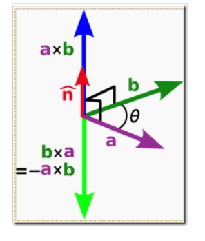
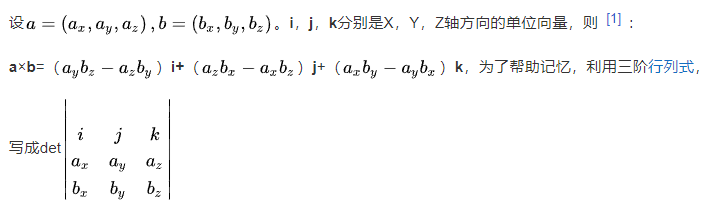
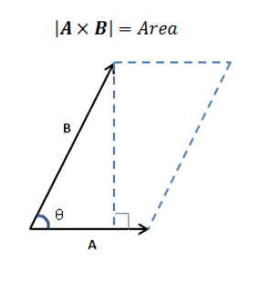
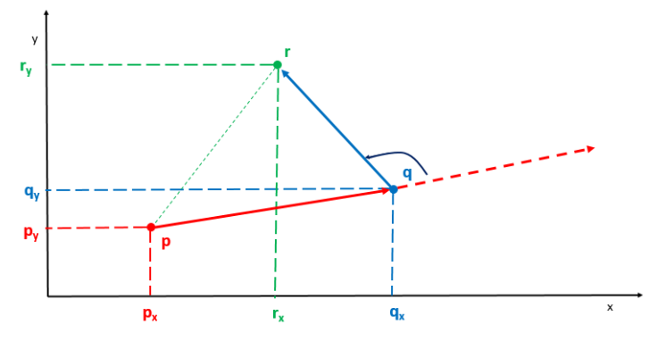
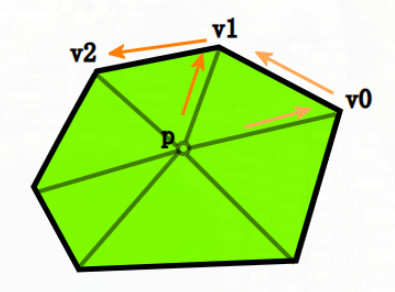
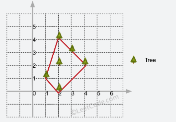

#### 排列组合

latex和数学相关参考

https://www.cnblogs.com/1024th/

* 排列

从$n$个不同元素种取出$m(m≤n)$个元素的所有不同排列的个数，叫做从n个不同元素种取出$m$个元素的排列数，用符号$A^m_n$表示。

$A^m_n = n(n-1)(n-2)...(n-m+1) = \frac{n!}{(n-m)!}$

* 组合

从$n$个不同元素种取出$m(m≤n)$个元素的所有不同组合的个数，叫做从n个不同元素种取出$m$个元素的组合数，用符号$C_m^n$表示。组合相当于取出子集, 不考虑集合内元素的顺序

$C_n^m = \frac{A_n^m}{A_m^m} = \frac{n(n-1)(n-2)...(n-m+1)}{m!} = \frac{n!}{m!(n-m)!}$

$C_n^0 = C_n^n = 1$

组合相当于求序列不同子集的个数, 因此

$C_n^0 + C_n^1 + C_n^2 + .. + C_n^n = 2^n$

二项式定理

$(a+b)^n = \sum_{k=0}^{n} C_n^k a^{n-k}b^k$

#### 多重hashmap和gcd辗转相除法

```
用一个下标从 0 开始的二维整数数组rectangles 来表示 n 个矩形，其中 rectangles[i] = [widthi, heighti] 表示第 i 个矩形的宽度和高度。

如果两个矩形 i 和 j（i < j）的宽高比相同，则认为这两个矩形 可互换 。更规范的说法是，两个矩形满足widthi/heighti == widthj/heightj（使用实数除法而非整数除法），则认为这两个矩形 可互换 。

计算并返回rectangles 中有多少对 可互换 矩形。

输入：rectangles = [[4,8],[3,6],[10,20],[15,30]]
输出：6
解释：下面按下标（从 0 开始）列出可互换矩形的配对情况：
- 矩形 0 和矩形 1 ：4/8 == 3/6
- 矩形 0 和矩形 2 ：4/8 == 10/20
- 矩形 0 和矩形 3 ：4/8 == 15/30
- 矩形 1 和矩形 2 ：3/6 == 10/20
- 矩形 1 和矩形 3 ：3/6 == 15/30
- 矩形 2 和矩形 3 ：10/20 == 15/30
```

可以使用辗转相除法, 横纵坐标除以它们的公因数。对于列表`[4,8]`这样的存储在哈希表中, 可以使用多重hashmap, 也就是`unordered_map<int, unordered_map<int, long long>>`

辗转相除法 即 `return b == 0 ? a : gcd(b, a%b);`

```cpp
class Solution {
public:
    int gcd (int a, int b) {
        if (b == 0)
            return a;
        else
            return gcd(b, a%b);
    }
    long long interchangeableRectangles(vector<vector<int>>& rectangles) {
        int n = rectangles.size();
        if (n < 2)
            return 0;
        // 多重hashmap
        unordered_map<int, unordered_map<int, long long>> use_map;

        for (auto&& rect : rectangles) {
            int mod = gcd (rect[0], rect[1]);
            rect[0] = rect[0] / mod;
            rect[1] = rect[1] / mod;
            use_map[rect[0]][rect[1]]++;
        }
        long long res = 0;
        /// 当重复个数为n, 可互换矩形对数为n(n-1)/2
        for (auto&& m : use_map) {
            for (auto&& iter : m.second)
                res += (iter.second * (iter.second-1))/2;
        }
        return res;
    }
};
```

#### 数据类型范围

`int`, -2147483648 ~	2147483647 (2^31 - 1), 2* 10^10级别

`long`, `long long`	`-9223372036854775808 ~	9223372036854775807` (2^63 - 1) 10^19级别，可以用来表示int范围内的乘法。

#### 暴力回溯求解 两个回文子序列长度的最大乘积

* 大量的题目都能用暴力方法求解(即便有更快的办法), 暴力的办法至少能通过很多测试用例, 有部分的得分

```
给你一个字符串s，请你找到s中两个不相交回文子序列，使得它们长度的乘积最大。两个子序列在原字符串中如果没有任何相同下标的字符，则它们是 不相交 的。

请你返回两个回文子序列长度可以达到的 最大乘积 
```

* 暴力对的做法
```cpp
class Solution {
public:
    int ans = 0;
    int maxProduct(string s) {
        string s1, s2;
        dfs(s, s1, s2, 0);
        return ans;
    }
    
    void dfs(string &s, string s1, string s2, int index) {
        /// 每次循环都判断下是否满足回文, 储存最大积
        if(check(s1) && check(s2)) ans = max(ans, int(s1.size() * s2.size()));
        if(index == s.size()) return;
        /// 对每个字符都有三种选择, s1用,s2用, 都不用
        /// 当程序执行完之时, 意味着遍历完了所有的情况
        dfs(s, s1 + s[index], s2, index + 1);//子序列s1使用该字符
        dfs(s, s1, s2 + s[index], index + 1);//子序列s2使用该字符
        dfs(s, s1, s2, index + 1);//子序列都不使用该字符
    }
    
    bool check(string &s) {
        int l = 0, r = s.size() - 1;
        while(l < r) {
            if(s[l++] != s[r--]) return false;
        }
        return true;
    }
};

/// 针对dfs函数,可以进一步用引用加速

void dfs(string &s, string &s1, string &s2, int index) {
    if(check(s1) && check(s2)) ans = max(ans, int(s1.size() * s2.size()));
    if(index == s.size()) return;

    //// 以下是典型的回溯, 穷举法
    s1.push_back(s[index]);
    dfs(s, s1, s2, index + 1);
    s1.pop_back();
    s2.push_back(s[index]);
    dfs(s, s1, s2, index + 1);
    s2.pop_back();
    dfs(s, s1, s2, index + 1);
}
```


### 质数

#### 判断质数

方式如下
```cpp
bool IsPrime(int num){
    if(num==1)   return false;
	if(num==2)	return true;
	for(int i=2;i<sqrt(num)+1;i++){
		if((num%i)==0)	
            return false;
	}
	return true;
}
```

#### 分解质因数

使用短除法, 不断除`2~n`的整数, 直到`n==1`
```cpp
int QFContract(int n) //用短除法对合数进行分解
{
    while(n > 1)
    {
        for(int i= 2; i<= n; i++)
        {
            if(n % i==0) //短除法分解质因数
            {
                a = a / i;/// 质因子为i
                cout << " i" <<endl;    /// 输出质因子为i
                break;
            }
        }
    }
}
```

### 650. 只有两个键的键盘

```
最初记事本上只有一个字符 'A' 。你每次可以对这个记事本进行两种操作：

Copy All（复制全部）：复制这个记事本中的所有字符（不允许仅复制部分字符）。
Paste（粘贴）：粘贴 上一次 复制的字符。
给你一个数字 n ，你需要使用最少的操作次数，在记事本上输出 恰好 n 个 'A' 。返回能够打印出 n 个 'A' 的最少操作次数。

输入：3
输出：3
解释：
最初, 只有一个字符 'A'。
第 1 步, 使用 Copy All 操作。
第 2 步, 使用 Paste 操作来获得 'AA'。
第 3 步, 使用 Paste 操作来获得 'AAA'。
```
 
基于分解质因数, 例如`12 = 2 * 2 * 3`, 可以认为先生成第一个质数2, 即复制一次粘贴一次共两次, 然后复制一次粘贴1次生成4, 最后复制一次粘贴2次得到12。一共需要七步。

```cpp
class Solution {
public:
    int minSteps(int n) {

        if (n == 1)
            return 0;
        
        vector<int> primes;
        int number = n;

        while(number > 1)
        {
            for(int i=2; i<=number; i++)
            {
                if(number % i==0) //短除法分解质因数, i为质因数
                {
                    number = number/i;
                    primes.push_back(i);    /// 加入因子, 顺序应该从小到大
                    break;
                }
            }
        }
        
        /// 合数
        int result = primes[0]; /// copy + paste, 生成第一个质数次数
        for (int i = 1; i < primes.size(); i++) {
            
            result++;   // 拷贝次数
            result+= primes[i]-1; //粘贴次数            
        }
        return result;
    }
};
```


### 洗牌算法

传统的办法是假设我们把每个数都放在一个 帽子 里面，然后我们从帽子里面把它们一个个摸出来，摸出来的数按顺序放入数组，这个数组正好就是我们要的洗牌后的数组。因此我们把数组 array 复制一份给数组 aux，之后每次**随机从 aux 中取一个数**，为了防止数被重复取出，每次取完就把这个数从 aux 中移除。

这种方法正确性在于, 每次每个数被选出的概率都是相等的, 但是注意把取出的数删除。

* C++生成随机数

`int rand(void)`   位于头文件 `stdlib.h` rand()的内部实现是用线性同余法做的，它不是真的随机数，因其周期特别长，故在一定的范围里可看成是随机的。rand()返回一随机数值的范围在0至RAND_MAX 间。RAND_MAX的范围最少是在32767之间(int)。

`void srand(unsigned int seed)`  位于stdlib.h。参数seed必须是个整数，如果每次seed都设相同值，rand()所产生的随机数值每次就会一样。

一般用时钟作为seed, 即`srand((unsigned int)(time(NULL))`，注意这里的时钟表示程序进程开始运行的时间, 不是运行到这句话的时间

<!-- more -->

```cpp
for (int i = 0; i < 5; i++) {
    cout << time(0) <<endl;
}

// 1632387374
1632387374
1632387374
1632387374
1632387374
```
程序进程开始运行时间是相同的。获得运行到这个语句的时间可以用`clock()`

取得`[a,b)`的随机整数，使用`(rand() % (b-a))+ a`;

```cpp
srand((unsigned)time(NULL)); 
for(int i = 0; i < 10;i++ ) 
        cout << rand() << '\t'; 
cout << endl; 
```

leetcode 384 打乱数组
```
给你一个整数数组 nums ，设计算法来打乱一个没有重复元素的数组。

实现 Solution class:

Solution(int[] nums) 使用整数数组 nums 初始化对象
int[] reset() 重设数组到它的初始状态并返回
int[] shuffle() 返回数组随机打乱后的结果
```

朴素的算法

```cpp
class Solution {
public:
    Solution(vector<int>& nums) {
        srand((unsigned)time(NULL));
        ret.assign(nums.begin(), nums.end());
        ret_back.assign(ret.begin(), ret.end());
        n = nums.size();
    }
    
    /** Resets the array to its original configuration and return it. */
    vector<int> reset() {
        ret.assign(ret_back.begin(), ret_back.end());

        return ret;
    }
    
    /** Returns a random shuffling of the array. */
    vector<int> shuffle() {
        ret_copy.assign(ret.begin(), ret.end());
        
        int i = n;
        int idx = 0;
        /// 随机从ret_copy中拿出数据
        while (i) {
            int r = rand() % i;
            ret[idx++] = ret_copy[r];
            --i;
            ret_copy.erase(ret_copy.begin() + r );
        }
        return ret;
    }

private:
    vector<int> ret_copy;
    vector<int> ret_back;
    vector<int> ret;
    int n;
};
```

#### Fisher-Yates 洗牌算法

在每次迭代中，生成一个**范围在当前下标到数组末尾元素下标之间的随机整数(包含当前下标)**。然后将当前下标和随机选出的下标交换 。

这模拟了每次从"帽子"里面摸一个元素的过程，即在下标i时, 可以随机从`i~n-1`的下标中选出一个元素代替i。此外还有一个需要注意的细节，当前元素是可以和它本身互相交换的。

```cpp
    vector<int> shuffle() { 
        for (int i = 0; i < n; i++){    // 生成一个从当前下标i, 到末尾下标n-1之间的随机数字
            //产生[a,b]范围的随机整数公式(rand() % (b-a+1)) + a
            int swap_idx = i + rand() % (n-i);
            swap(ret[swap_idx], ret[i]);
        }
        return ret;
    }
```

证明, 第一次选取元素时, 将`a[0]`与`a[0]-a[n-1]`n个元素选择一个交换, 选择每个元素的概率为1/n;

选择第二次元素时, 如果第一次是a[0]自身交换, 则每个元素的选择概率为(n-1)/n * 1/(n-1) = 1/n;

如果第一次是a[0]与a[1]~a[n-1]一个元素交换, 则第一次没有选上的元素第二次选择的概率(包括a[0]), (n-1)/n * 1/(n-1) = 1/n; 第一次选上的元素的概率直接就是1/n了。

#### Leetcode 69 牛顿迭代法求平方根

* 牛顿迭代法是用数值的方法求解方程, 基于切线是曲线的线性逼近
而对切线与x轴的交点进行迭代,会逐渐逼近曲线的零点。


* $x_n$点的切线方程为: $f(x_n) + f^{'}_{n} (x-x_n) = 0$, 求$x_{n+1}$, 也就是求$f(x_n) + f^{'}_{n} (x-x_n) = 0$的解, 即$x_{n+1} = x_n - f(x_n)/f^{'}_{n}(x_n)$

```
实现 int sqrt(int x) 函数。
```
* 计算并返回 x 的平方根，其中 x 是非负整数。
可以使用牛顿迭代法，求`x^2-c=0`的根。
* 迭代公式, `f(x) = x^2-c`, `f'(x) = 2x`, $f(x_n)/f^{'}_{n}(x_n)$ = `(x^2-c) / (2*x)` .迭代方程$x_n - f(x_n)/f^{'}_{n}(x_n)$ = `x - (x^2-c) / (2*x)` = `0.5*(x+ c/x)`

```cpp
class Solution {
public:
    int mySqrt(int x) {
        if (x == 0) {
            return 0;
        }
        double C = x, x0 = x;
        while (true) {
            double xi = 0.5 * (x0 + C / x0);    /// 迭代方程
            if (fabs(x0 - xi) < 1e-7) {
                break;
            }
            x0 = xi;
        }
        return int(x0);
    }
};
```

### 主要元素

```
数组中占比超过一半的元素称之为主要元素。给你一个 整数 数组，找出其中的主要元素。若没有，返回 -1 。请设计时间复杂度为 O(N) 、空间复杂度为 O(1) 的解决方案。
```

摩尔投票算法, 每个不同的数字代表一个国家，他们在一起混战，就是不同国家每两个人都同归于尽。在主要元素存在的情况下, 我们就可以知道人数大于数组长度一半的国家会获胜。

```cpp
    int majorityElement(vector<int>& nums) {
        if (nums.size() <= 0)
            return -1;
        
        int count = 1;
        int major = nums[0];
        for (int i = 1; i < nums.size(); i++) {
          // 遇到相同国家, count++
            if (nums[i] == major)
                count ++;
            else    
          // 不同国家, 同归于尽, count--
                count--;
          // count < 0说明之前已经同归于尽， 重置
            if (count < 0) {
                major = nums[i];
                count = 1;
            }
        }
        // 因为假设主要元素存在才成立，因此需要检查主要元素是否存在。
        int half = nums.size() >> 1;
        count = 0;
        for (int i : nums) {
            if (i == major)
                count++;
            if (count > half)
                return major;
        }
        return -1;
    }
```

#### 快速幂

快速幂也称为Exponentiation by squaring，平方求幂, 可以在log(n)时间下求乘方。

思路比较简单, 基于二分的思想, 计算a的n次方，如果n是偶数（不为0），那么就先计算a的n/2次方，然后平方；如果n是奇数，那么就先计算a的n-1次方，再乘上a；递归出口是a的0次方为1。

```cpp
int qpow(int a, int n)
{
    if (n == 0)
        return 1;
    else if (n % 2 == 1)
        return qpow(a, n - 1) * a;
    else
    {
        int temp = qpow(a, n / 2);
        return temp * temp;
    }
}
```

基于递归的思想, 我们可以写出迭代的算法。注意到二进制位运算和二分是关联密切的，因为左移一位表示乘2, 右移一位表示除2。

例如指数n=4, 二进制为100; 对n右移, 开始是`a*a`, 之后是`a^2*a^2`。
```cpp
int qpow(int a, int n){
    int ans = 1;    // 初始化ans为1
    // 对n进行分解
    while(n){
        if(n&1)        //如果n的当前末位为1
            ans *= a;  //ans乘上当前的a
        a *= a;        //a自乘
        n >>= 1;       //n往右移一位
    }
    return ans;
}
```

由于乘方是比较大的数, 使用时往往涉及取模, 例如求 `m^k mod p`，时间复杂度 O(logk)。

```cpp
int qmi(int m, int k, int p)
{
    int res = 1 % p, t = m;
    while (k)
    {
        if (k&1) res = res * t % p; // 最后一次
        t = t * t % p;  // 每次取模
        k >>= 1;    // k右移
    }
    return res;
}
```

#### 凸包

向量叉积

$a \times b $, 数值等于$|a| |b| sin \theta$, 方向遵循右手定则(a向量与b向量的向量积的方向与这两个向量所在平面垂直, 当右手的四指从a以不超过180度的转角转向b时，竖起的大拇指指向是c的方向。)



使用行列式计算坐标



我们可以直接使用行列式求解，一般的, 对于二维平面向量的叉积, 结果是z轴的向量, 值为$a_xb_y - a_yb_x$

叉积的几何意义是以两个向量为边的平行四边形的面积



我们可以通过叉积的值判断夹角, 两个向量的叉积大于0 时，则两个向量之间的夹角小于 180度, 叉积等于 0 时，则表示两个向量之间平行, 叉积小于0 时，则表示两个向量之间的夹角大于 180度 (根据右手定则, 当a 叉乘 b 且a向b旋转不超过180度时且旋转为逆时针, 形成的z方向>0)



如上, 对于向量pq和qr的叉积, 从pq到qr是逆时针旋转<180度的(满足右手定则), 那叉积值会>0; 而如果qr方向相反(指向y轴反方向), 那么叉积就<0。可以根据这个规则判断给定p,q两点, 在pq向量的左侧, 还是右侧。

进而, 可以用叉积判断点是否在凸多边形内部, 目标点p对凸多边形每个顶点之间建立一个向量vec（如：v1-p），该向量与其对应的顶点的边edge（如：v2-v1）进行叉乘，得到一个叉积值。若每个叉积值的符号都一样（都是正数/都是负数），则证明点在凸多边形内。



```
leetcode 587

在一个二维的花园中，有一些用 (x, y) 坐标表示的树。由于安装费用十分昂贵，你的任务是先用最短的绳子围起所有的树。只有当所有的树都被绳子包围时，花园才能围好栅栏。你需要找到正好位于栅栏边界上的树的坐标。

输入: [[1,1],[2,2],[2,0],[2,4],[3,3],[4,2]]
输出: [[1,1],[2,0],[4,2],[3,3],[2,4]]
```

解释, 这是典型的求凸包的问题


* Jarvis 算法

该算法实际是一种贪心算法求凸包, 时间复杂度为$O(n^2)$

从凸包上的某一点开始，比如从给定点集中最左边的点开始，例如最左的一点 $A_1$, 然后选择 $A_{2}$点使得所有点都在向量 $\vec{A_{1}A_{2}}$ 的左方或者右方(所有点构成的向量叉积符号相同); 然后以 $A_{2}$为原点，重复这个步骤

给定原点 p，如何找到点 q，满足其余的点 r 均在向量$\vec{pq}$的左边，可以使用向量叉积来进行判别。

遍历所有点 r，找到对于点 p 来说逆时针方向最靠外的点 q (即角qpr最大)，把它加入凸包。如果存在 2 个点相对点 p 在同一条线上，我们应当将 q 和 p 同一线段上的边界点都考虑进来，需要进行标记，防止重复添加。

```cpp
class Solution {
public:
    // 向量pq, qr的叉积
    int cross(vector<int> & p, vector<int> & q, vector<int> & r) {
        return (q[0] - p[0]) * (r[1] - q[1]) - (q[1] - p[1]) * (r[0] - q[0]);
    }

    vector<vector<int>> outerTrees(vector<vector<int>>& trees) {
        int n = trees.size();
        if (n < 4) {
            return trees;
        }
        int leftMost = 0;
        // 最左侧的点, 即x轴坐标最小的点
        for (int i = 0; i < n; i++) {
            if (trees[i][0] < trees[leftMost][0]) {
                leftMost = i;
            }
        }

        vector<vector<int>> res;
        vector<bool> visit(n, false);
        int p = leftMost;
        do {
            int q = (p + 1) % n;
            // 从r里面找q
            for (int r = 0; r < n; r++) {
                /* 如果 r 在 pq 的右侧，则 q = r */ 
                if (cross(trees[p], trees[q], trees[r]) < 0) {
                    q = r;
                }
            }
            /* 是否存在点 i, 使得 p 、q 、i 在同一条直线上 */
            for (int i = 0; i < n; i++) {
                if (visit[i] || i == p || i == q) {
                    continue;
                }
                if (cross(trees[p], trees[q], trees[i]) == 0) {
                    // 一条直线的点也是要凸包上的点
                    res.emplace_back(trees[i]);
                    visit[i] = true;
                }
            }
            if  (!visit[q]) {
                res.emplace_back(trees[q]);
                visit[q] = true;
            }
            p = q;  // 更新p
        } while (p != leftMost);
        return res;
    }
};
```

#### 霍夫曼编码

Huffman于1952年提出一种编码方法，该方法完全依据字符出现概率来构造异字头的平均长度最短的码字，有时称之为最佳编码，一般就叫做Huffman编码。huffman条件下, 一个字符可以用小于8位来表示(一般压缩前一个字符用一个字节表示, 也就是八位), 从而实现了编码

#### 递增的三元子序列

```
leetcode 334
给你一个整数数组nums ，判断这个数组中是否存在长度为 3 的递增子序列。

如果存在这样的三元组下标 (i, j, k)且满足 i < j < k ，使得nums[i] < nums[j] < nums[k] ，返回 true ；否则，返回 false 。
```

如果有三个指针指向这三个数, 我们需要考虑这三个数特征是什么。

在遍历数组时, 我们让a始终记录最小元素，a应该满足最小。b应该满足b>a, 但注意如果a更新了小数, b只要>a即可所以b也有可能更新成更小的数。。所以遇到小数应该先更新a, 然后遇到`>a, <b`的数会更新b。如果找到比 b 大的元素，说明找到了三元组。

```cpp
class Solution {
public:
    bool increasingTriplet(vector<int>& nums) {
        if (nums.size() <=2)
            return false;
        int first = INT32_MAX, second = INT32_MAX;
        for (int num : nums){   // 遍历元素
            if (first > num)
                first = num;    // first是最小的元素
            else if (first < num && second > num)   // second应该>first且尽可能小
                second = num;
            else if (num > second)  // 如果找到second的数, 宣告结束
                return true;
        }
        return false;
    }
};
```

#### 数组中重复的数据

```
给你一个长度为 n 的整数数组 nums ，其中 nums 的所有整数都在范围 [1, n] 内，且每个整数出现 一次 或 两次 。请你找出所有出现 两次 的整数，并以数组形式返回。

你必须设计并实现一个时间复杂度为 O(n) 且仅使用常量额外空间的算法解决此问题。

示例 1：

输入：nums = [4,3,2,7,8,2,3,1]
输出：[2,3]
```

注意这里条件有个, nums的所有整数都在范围[1,n]内, 这样nums自身就构成了一个桶, 即可以通过nums[nums[i]]来记录。 不使用额外空间, 但使用nums自己的空间是合适的。 所以我们的问题变成, 如果利用nums实现记录整数出现的功能, 从而找到所有出现两次的整数。

一种办法是通过正负号表示出现了一次和两次, 也就是遍历nums数组, 我们将`nums[nums[i]]`的值取负数, 这样就用nums自身的正负性记录了`nums[i]`的出现次数。而若对`nums[j]`的数值取绝对值还是`nums[j]`存储的数值。这样基于正负号nums既存储了数值, 也记录了元素出现的次数。

```cpp
class Solution {
public:
    vector<int> findDuplicates(vector<int>& nums) {
        if (nums.size() == 0)
            return vector<int>{};
        vector<int> result;
        for (int i = 0; i < nums.size(); i++) {
            int num = abs(nums[i]); // 绝对值表示nums[i]存储的数值
            if (nums[num-1] > 0)    // 正负号表示num出现的次数
                nums[num-1] *= -1;  // 出现了一次, 变号
            else  
                result.push_back(num);  // 出现了两次
        }

        return result;
    }
};
```