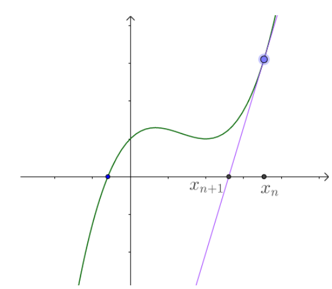

### 洗牌算法

* 传统的办法是假设我们把每个数都放在一个 帽子 里面，然后我们从帽子里面把它们一个个摸出来，摸出来的数按顺序放入数组，这个数组正好就是我们要的洗牌后的数组。因此我们把数组 array 复制一份给数组 aux，之后每次**随机从 aux 中取一个数**，为了防止数被重复取出，每次取完就把这个数从 aux 中移除。

这种方法正确性在于, 每次每个数被选出的概率都是相等的, 但是注意把取出的数删除。

* C++生成随机数

* `int rand(void)`   位于头文件 `stdlib.h`

rand()的内部实现是用线性同余法做的，它不是真的随机数，因其周期特别长，故在一定的范围里可看成是随机的。

rand()返回一随机数值的范围在0至RAND_MAX 间。RAND_MAX的范围最少是在32767之间(int)。

* `void srand(unsigned int seed)`  位于stdlib.h。参数seed必须是个整数，如果每次seed都设相同值，rand()所产生的随机数值每次就会一样。

一般用时钟作为seed, 即`srand((unsigned int)(time(NULL))`，注意这里的时钟表示程序进程开始运行的时间, 不是运行到这句话的时间
<!-- more -->

```cpp
for (int i = 0; i < 5; i++) {
    cout << time(0) <<endl;
}

// 1632387374
1632387374
1632387374
1632387374
1632387374
```
程序进程开始运行时间是相同的。获得运行到这个语句的时间可以用`clock()`

取得`[a,b)`的随机整数，使用`(rand() % (b-a))+ a`;

```cpp
srand((unsigned)time(NULL)); 
for(int i = 0; i < 10;i++ ) 
        cout << rand() << '\t'; 
cout << endl; 
```

leetcode 384 打乱数组
```
给你一个整数数组 nums ，设计算法来打乱一个没有重复元素的数组。

实现 Solution class:

Solution(int[] nums) 使用整数数组 nums 初始化对象
int[] reset() 重设数组到它的初始状态并返回
int[] shuffle() 返回数组随机打乱后的结果
```

朴素的算法

```cpp
class Solution {
public:
    Solution(vector<int>& nums) {
        srand((unsigned)time(NULL));
        ret.assign(nums.begin(), nums.end());
        ret_back.assign(ret.begin(), ret.end());
        n = nums.size();
    }
    
    /** Resets the array to its original configuration and return it. */
    vector<int> reset() {
        ret.assign(ret_back.begin(), ret_back.end());

        return ret;
    }
    
    /** Returns a random shuffling of the array. */
    vector<int> shuffle() {
        ret_copy.assign(ret.begin(), ret.end());
        
        int i = n;
        int idx = 0;
        /// 随机从ret_copy中拿出数据
        while (i) {
            int r = rand() % i;
            ret[idx++] = ret_copy[r];
            --i;
            ret_copy.erase(ret_copy.begin() + r );
        }
        return ret;
    }

private:
    vector<int> ret_copy;
    vector<int> ret_back;
    vector<int> ret;
    int n;
};
```

#### Fisher-Yates 洗牌算法

* 在每次迭代中，生成一个**范围在当前下标到数组末尾元素下标之间的随机整数**。然后将当前下标和随机选出的下标交换 。

这模拟了每次从 "帽子"里面摸一个元素的过程，即在下标i时, 可以随机从`i~n-1`的下标中选出一个元素代替i。此外还有一个需要注意的细节，当前元素是可以和它本身互相交换的。

```cpp
    vector<int> shuffle() { 
        for (int i = 0; i < n; i++){    // 生成一个从当前下标i, 到末尾下标n-1之间的随机数字
            //产生[a,b]范围的随机整数公式(rand() % (b-a+1)) + a
            int swap_idx = i + rand() % (n-i);
            swap(ret[swap_idx], ret[i]);
        }
        return ret;
    }
```

### Leetcode 69 牛顿迭代法求平方根

* 牛顿迭代法是用数值的方法求解方程, 基于切线是曲线的线性逼近
而对切线与x轴的交点进行迭代,会逐渐逼近曲线的零点。



* $x_n$点的切线方程为: $f(x_n) + f^{'}_{n} (x-x_n) = 0$, 求$x_{n+1}$, 也就是求$f(x_n) + f^{'}_{n} (x-x_n) = 0$的解, 即$x_{n+1} = x_n - f(x_n)/f^{'}_{n}(x_n)$

```
实现 int sqrt(int x) 函数。
```
* 计算并返回 x 的平方根，其中 x 是非负整数。
可以使用牛顿迭代法，求`x^2-c=0`的根。
* 迭代公式, `f(x) = x^2-c`, `f'(x) = 2x`, $f(x_n)/f^{'}_{n}(x_n)$ = `(x^2-c) / (2*x)` .迭代方程$x_n - f(x_n)/f^{'}_{n}(x_n)$ = `x - (x^2-c) / (2*x)` = `0.5*(x+ c/x)`

```cpp
class Solution {
public:
    int mySqrt(int x) {
        if (x == 0) {
            return 0;
        }
        double C = x, x0 = x;
        while (true) {
            double xi = 0.5 * (x0 + C / x0);    /// 迭代方程
            if (fabs(x0 - xi) < 1e-7) {
                break;
            }
            x0 = xi;
        }
        return int(x0);
    }
};
```