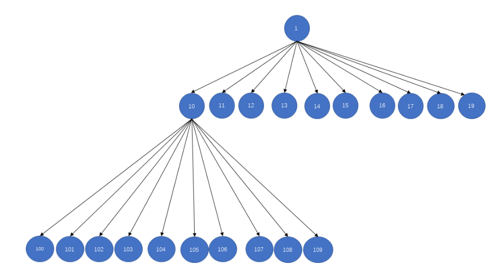

> 计算机真是奇妙又可气的东西, 功能写多了算法和数学就慢慢忘记，算法写多了业务又不熟练了。好的公司基本搞定中等题，稍微懂些困难题才比较稳。刷题数量感觉要400+


#### leetcode 600 不含连续1的非负整数

给定一个正整数 n，找出小于或等于 n 的非负整数中，其二进制表示不包含连续的1 的个数。

```
输入: 5
输出: 5
解释: 
下面是带有相应二进制表示的非负整数<= 5：
0 : 0
1 : 1
2 : 10
3 : 11
4 : 100
5 : 101
其中，只有整数3违反规则（有两个连续的1），其他5个满足规则。
```

* dfs的解法

dfs从1开始，按位增。如果当前结尾是1的话就补0； 如果是0的话就补0或者1；如果大于n就停止。

```cpp
class Solution {
public:
    int ans = 0;
    int g_n;
    int findIntegers(int n) {
        g_n = n;
        ans = 1;
        dfs(1);
        return ans;
    }

    /// 表示从1(01)开始填位
    void dfs(int cur){
        if(cur > g_n) return;

        /// 递归一次, 一次情况 +1
        ans++;
        /// 如果当前位1, 下一位只能选10
        if((cur & 1)){
            dfs(cur << 1);
        } 
        /// 当前位位0, 下一次可以是00,01两者
        else{
            dfs(cur << 1);
            dfs((cur << 1)+1);
        }
        return;
    }
};
```

这种按位决策的思路, 可以引申到动态规划中。

我们考虑从二进制高位到低位填数, 如果当前二进制数为1, 则如果填0则肯定小于这个数(例如`101`, 首位填0得到`0XX`肯定小于`101`), 当然可以填1, 填完1之后我们需要观察下一位进一步判断; 如果当前二进制数为0, 则必须填`0`, 然后看下一位。

```
对x的二进制分析
满足条件的数 res = 0

loop 
如果当前位是1，res += (当前位为0的所有情况), 判断下一位
如果当前位是0, 直接判断下一位 
```

因此我们需要一个备忘录记住(当前位位0的所有情况), 就可以直接查找了。可以记`f[i][j]`表示二进制位数位`i`, 最高位为`j`且不超`j11111`的满足要求数的个数, 即`f[2][0]`表示不超`01`的个数, `f[2][1]`表示不超`11`的个数，如`f[2][1] = 3`分别是,`00, 01,10` 有`f[i + 1][0] = f[i][1]; f[i + 1][1] = f[i][0] + f[i][1];`。

这样上述`当前位为0的所有情况`也就是`f[i][0]`, 也就是不超过`01111...`的个数。


```cpp
class Solution {
public:
/// 判断最高位为1
    int get_bina_len(int n) {
        for (int i = 31; i >= 0; i--) {
            /// n的二进制有多少位
            if ((n>>i) & 1 == 1)
                return i;
        }
    }

    int findIntegers(int n) {
        int len = get_bina_len(n);
        vector<vector<int>> dp(len+2, vector<int>(2,0));
        dp[1][0] = 1;
        dp[1][1] = 2;
        for (int i = 2; i <= len+1; i++) {
            dp[i][0] = dp[i-1][1];
            dp[i][1] = dp[i-1][0] + dp[i-1][1];
        }
        /// 从高到低
        int res = 0;
        int prev = 0;
        for (int i = len; i >= 0; i--) {
            /// 当前位数字
            int cur = (n>>i) &1;
            if (cur == 1)
                /// 当前放0的所有结果
                res += dp[i+1][0];
            /// 不能继续下去因为这里不能放1了
            if (prev == 1 && cur == 1) 
                break; 
            /// 如果没有连续的1说明这里可以继续放1
            prev = cur;
            /// 加一个当前的值
            if (i == 0) res++;

        }
        return res;
    }
};
```

* 01字典树+动态规划


由以上字典树, 我们可以看出, 路径可由若干以`0`为根节点的满二叉子树组成, 考虑用 `dp[k][t]` 表示根节点为 k，高度为 t 的满二叉树中，满足题意的路径数量。

如果根节点为0, 有`dp[0][t]=dp[0][t−1]+dp[1][t−1]`, 子节点可以为0也可以为1

如果根节点为1, 子节点只能为0, `dp[1][t]=dp[0][t−1]`

所以有`dp[0][t]=dp[0][t−1]+dp[1][t−1]=dp[0][t−1]+dp[0][t−2]`, 即`dp[t]= dp[t−1]+dp[t−2],t≥2; dp[1]=1`

如上对`110`，可以看成根为0,高为3的子树路径数量 + 根为0,高位2的路径数量。因此可以得到如下

```cpp
class Solution {
public:
    int findIntegers(int n) {
        // 预处理第 i 层满二叉树的路径数量
        vector<int> dp(31);
        dp[0] = dp[1] = 1;
        for (int i = 2; i < 31; ++i) {
            dp[i] = dp[i - 1] + dp[i - 2];
        }

        // pre 记录上一层的根节点值，res 记录最终路径数
        int pre = 0, res = 0;
        for (int i = 29; i >= 0; --i) {
            /// 从顶到底分析
            int val = 1 << i;
            // if 语句判断 当前子树是否有右子树, 如果为真, 左右子树高为i+1
            /// 当前位二进制值为1, 说明才有右子树
            if ((n & val) != 0) {
                // 有右子树
                n -= val;
                res += dp[i + 1]; // 先将左子树（满二叉树）的路径加到结果中

                // 处理右子树
                if (pre == 1) {
                    // 上一层为 1，之后要处理的右子树根节点肯定也为 1
                    // 此时连续两个 1，不满足题意，直接退出
                    break;
                }
                // 标记当前根节点为 1
                pre = 1;
            } else {
                // 无右子树，下一层再继续判断
                pre = 0;
            }

            if (i == 0) {
                ++res;
            }
        }

        return res;
    }
};
```

### leetcode 1755最接近目标值的子序列和

```cpp
给你一个整数数组 nums 和一个目标值 goal 。

你需要从 nums 中选出一个子序列，使子序列元素总和最接近 goal 。也就是说，如果子序列元素和为 sum ，你需要 最小化绝对差 abs(sum - goal) 。

返回 abs(sum - goal) 可能的 最小值 。

1 <= nums.length <= 40
-107 <= nums[i] <= 107
-109 <= goal <= 109
```

这种问题与前者，最后一块石头的重量，如果数组长度特别大，但是数组的和不大 (sum<=10^5)，我们可以使用背包问题的方式来解决，其中dp[i]表示是否能组成容量为 i 的背包。如果数组长度不大(n<=20)，但是数值特别大的话，使用枚举子集的方法。(如果数组长度大于20，例如 40，直接枚举子集2^40会超时,需要折半查找)

显然本题应该使用枚举子集的办法, 对于一个集合长度为n，其子集的数量为`2^n`。可以使用二进制作为枚举子集代表, 例如`1110`可以表示在长度为4的集合中选取前三个元素。

如果数组`nums[j]`, 长度为n ,那么可以构建一个长度为`2^n`的数组表示所有的挑选情况的序列和。这是一个动态规划的过程，例如`1101`可以表示挑选第1，3，4个元素，它可以简单由`1100`挑选第3，4个元素；以及挑选第1个元素个元素组成。

```cpp
    for (int i = 1; i < (1 << n); i++) {    /// 一共由1<<n种情况
        for (int j = 0; j < n; j++) {   /// 从低位第一个为1的位开始相当于动态规划，如果1101 = 1100 + 0001
            /// (i & (1 << j)) == 0
            /// 基于二进制的选择, 然后求和
            if ((i & (1 << j)) == 0) continue;  /// 第一个为1的位,例如1110, 
            lsum[i] = lsum[i-(1<<j)] + nums[j];
            break;
        }
    }
```

先以中间为界，等分为两个序列。同时使用两个大小为`2^half`的数组记录每个序列可能选取情况的和(一共有`2^half`个选取情况)

这样原数组的一个子序列和，必然为下列三者之一：
1. lsum 中的某个元素；
2. rsum 中的某个元素；
3. lsum 中的某个元素与 rsum 中的某个元素之和。这时候排序，使用二分查找得到。

```cpp
class Solution {
public:
    int minAbsDifference(vector<int>& nums, int goal) {
        int n = nums.size();
        int half = n / 2;
        int ls = half, rs = n - half;
        
        /// 所有的挑选情况， 集合
        vector<int> lsum(1 << ls, 0);
        for (int i = 1; i < (1 << ls); i++) {
            for (int j = 0; j < ls; j++) {
                /// (i & (1 << j)) == 0
                /// 基于二进制的选择, 然后求和
                if ((i & (1 << j)) == 0) continue;
                lsum[i] = lsum[i-(1<<j)] + nums[j];
                break;
            }
        }
        vector<int> rsum(1 << rs, 0);
        for (int i = 1; i < (1 << rs); i++) {
            for (int j = 0; j < rs; j++) {
                if ((i & (1 << j)) == 0) continue;
                rsum[i] = rsum[i-(1<<j)] + nums[ls+j];
                break;
            }
        }

        // 每个选择的求和排序
        sort(lsum.begin(), lsum.end());
        sort(rsum.begin(), rsum.end());
        
        /*
        原数组的一个子序列和，必然为下列三者之一：
        lsum 中的某个元素；
        rsum 中的某个元素；
        lsum 中的某个元素与 rsum 中的某个元素之和。
        */
        int ret = INT32_MAX;
        for (int x: lsum) {
            ret = min(ret, abs(goal - x));
        }
        for (int x: rsum) {
            ret = min(ret, abs(goal - x));
        }
        
        /// 同时处理两个数组
        int i = 0, j = rsum.size() - 1;
        while (i < lsum.size() && j >= 0) {
            /// 二分查找
            int s = lsum[i] + rsum[j];
            ret = min(ret, abs(goal - s));
            if (s > goal) {
                j--;
            } else {
                i++;
            }
        }
        return ret;
    }
};
```

同样的思路，使用2dfs。使用两个dfs, 先dfs前半段，再dfs后半段。时间复杂度从`2^n`变成了`2^(n/2)`。

给定数组长度`1 <= nums.length <= 40`。半段是`1 ~ 20`。一般在循环或递归十的九次方次左右就会超时, 直接递归2^40 = 10^12要超时，使用2dfs，2^20 = 10^6就能通过。

```cpp
// 2^20 < 2^10*2^10 = 1024*1024 < 2*1000*1000，所以数组大小开2e6
const int N = 2e6;
class Solution2 {
public:
    vector<int> q;

    int n,cnt,goal,res;
    /// dfs得到前半段的所有情况
    void dfs1(vector<int>& nums,int idx,int sum)
    {
        // 找到一个可行解
        if(idx==(n+1)/2)// n向上取整，前半部分为[0,n/2]
        {
            q[cnt++]=sum;
            return;
        }
        // 枚举两种情况，一种是选上第idx个元素，另一种是不选第idx个元素
        dfs1(nums,idx+1,sum);
        dfs1(nums,idx+1,sum+nums[idx]);
    } 

    void dfs2(vector<int>& nums,int idx,int sum)
    {
        // 找到一个可行解
        if(idx==n)// 后半部分为[n/2+1,n-1]
        {
            /// cnt是前半段所有情况的大小, 也就是2^half
            int l=0,r=cnt-1;
            // 二分查找再前半段q中找到使q[mid]+sum最逼近goal的位置(<= goal)
            while(l < r)
            {
                // 向上取整，避免 left 取不到 right 造成死循环
                int mid=(l+r+1)>>1;
                /// 当前的sum加前半段的值
                if(q[mid]+sum<=goal)l=mid;// mid满足check，向右逼近，mid可能就是目标值，所以l=mid
                else r=mid-1;// mid不满足check，向左逼近，mid不可能为目标值，所以r=mid-1
            }
            // 二分查找得到的r是<=goal下最逼近goal的位置
            res=min(res,abs(q[r]+sum-goal));
            // 若r有下一个元素，那么我们最近goal的元素要么在 <=goal 的最大位置产生，要么在 >goal 的最小位置产生
            // 所以每次更新res时，注意这两个位置
            if(r+1<cnt)
                res=min(res,abs(q[r+1]+sum-goal));
            return;
        }
        // 遍历后半段，枚举两种情况，一种是选上第idx个元素，另一种是不选第idx个元素
        dfs2(nums,idx+1,sum);
        dfs2(nums,idx+1,sum+nums[idx]);
    }
    
    // 题解：双向dfs，dfs1枚举2^20中选法，然后排序前半段得到的子序列和数组，然后再枚举后半段的子序列，二分前半段的子序列和数组，使得前半段的子序列和与后半段的子序列和相加的结果接近goal
    int minAbsDifference(vector<int>& nums, int _goal) {
        q.resize(N);
        n=nums.size(),cnt=0,goal=_goal,res=INT32_MAX;
        // 先搜索前一半，给搜索完的数组排个序，便于在搜索后一半数组的时候进行二分
        dfs1(nums,0,0);
        /// 排序
        sort(q.begin(),q.begin()+cnt);
        // 搜索后一半
        dfs2(nums,(n+1)/2,0);
        return res;
    }
};
```

### leetcode2035 将数组分成两个数组并最小化数组和的差

```
给你一个长度为 2 * n 的整数数组。你需要将nums 分成 两个 长度为 n 的数组，分别求出两个数组的和，并 最小化 两个数组和之差的绝对值。nums 中每个元素都需要放入两个数组之一。

请你返回最小的数组和之差。
```

该题和上面最接近目标值的子序列和的区别在于，设置子序列长度为n。处理方法是使用一个二维数组`vector<vector<int>>s`。第一个维度表示现在选取元素的个数，第二个维度是当前选取个数下的和。显然和是一个序列。

基于二进制的思想，遍历`int i=0; i<1<<n; i++`, 例如1110表示选取个数为3，选取的元素为第2，3，4个。递归的复杂度是指数的。

```cpp
class Solution {
public:
    int minimumDifference(vector<int>& nums) {
        int n = nums.size();
        n/=2;
        /// 需要用二维数组
        vector<vector<int>>s(n+1);
        
        int res = INT32_MAX;
        /// 是s[cnt]表示选择了cnt个数, 选择的数和不选择的数的差组成的序列
        /// 例如1110， 表示选择第2，3，4个数与不选第1个数，的差
        for(int i=0; i<1<<n; i++){
            int sum = 0, cnt = 0;
            for(int j=0; j<n; j++){
                if(i>>j&1){
                    sum+=nums[j];
                    cnt++;
                }else {
                    sum-=nums[j];
                }
            }
            s[cnt].push_back(sum);
        }
        
        /// 排序，对每一个选择了cnt的数排序
        for(int i=0; i<s.size(); i++)sort(s[i].begin(), s[i].end());

        /// 处理后半序列，共有1<<n种情况
        for(int i=0; i<1<<n; i++){
            int sum = 0, cnt = 0;
            for(int j = 0; j < n; j++){
                if(i>>j&1){
                    sum+=nums[n+j];
                    cnt++;
                }else {
                    sum-=nums[n+j];
                }
            }
            // 这里有cnt个正号，要到前面取n-cnt个正号的数组匹配 
            /// 从s[n-cnt]里找, s[n-cnt]存储的是选择和不选的差,sum也是选择和不选的差.
            /// 二分查找，找选择和不选差<=0的数
            int l = 0, r = s[n-cnt].size()-1;
            while(l<r){
                int mid = l+r+1>>1;
                /// mid可能是理想值
                if(s[n-cnt][mid] + sum<= 0 )l=mid;
                else r = mid-1;
            }
            /// 目标元素可能是s[n-cnt][mid]<= -sum的最大元素或s[n-cnt][mid]<= -sum的最小元素
            /// s[n-cnt][l]表示还有n-cnt个可以选的条件下的和
            res = min(res, abs(sum + s[n-cnt][l]));
            if(r<s[n-cnt].size()-1)res = min(res, abs(sum + s[n-cnt][r+1]));
        }
        return res;
    }
};
```

可以使用C++`lower_bound`的函数进行二分查找。

```cpp
 class Solution2 {
public:
    int minimumDifference(vector<int>& nums) {
        int n=nums.size()/2;
        /*
        首先，预处理前n个元素，有2的n次方种状态（即每个元素选或不选），用二进制位的1代表选，0代表不选。
        换句话说，用1代表元素归入第一个数组，用0代表归入第二个数组。
        这里用sum_pre表示前n个数，归为第一个数组的，和归为第二个数组的元素之差。
        */
        vector<int>pre[16];  //pre[i]表示选取i个元素时，和的集合
        for(int i=0;i<(1<<n);i++){
            int sum_pre=0,bit=0;
            for(int j=0;j<n;j++){
                if((i>>j)&1){
                    sum_pre+=nums[j];
                    bit++;
                }else{
                    sum_pre-=nums[j];
                }
            }
            pre[bit].push_back(sum_pre);
        }
        //排序，为了后面二分查找。顺便去重，也可以不去重
        for(int i=0;i<=n;i++){
            sort(pre[i].begin(),pre[i].end());

            /// unique用于去重，其中把重复的元素放到了后面。
            /// 执行完unique()：从容器的开始到返回的迭代器位置的元素是不重复的元素，而从返回的迭代器位置到vector.end()的元素都是没有意义的
            pre[i].erase(unique(pre[i].begin(),pre[i].end()),pre[i].end());
        }

        /*
        考虑后n个数。若后n个数选出bit个归入第一个数组，那么只需从前n个数中拿n-bit个归入第一个数组。
        选数的方式与上面相同，枚举2的n次方个状态。
        对于每个状态，利用二分查找从上面的数组pre[n-bit]中找到一个数k，使得k加上当前的sum_later尽量接近0
        记录下最小的差值即可。
        */
        int ans=1e9+7;
        for(int i=0;i<(1<<n);i++){
            int sum_later=0,bit=0;
            for(int j=0;j<n;j++){
                if((i>>j)&1){
                    sum_later+=nums[j+n];
                    bit++;
                }else{
                    sum_later-=nums[j+n];
                }
            }
            /// lower_bound( begin,end,num)：从pre[n-bit]数组的begin位置到end-1位置二分查找第一个大于或等于num的数字，找到返回该数字的地址
            /// n-bit表示还有n-bit可以选
            auto it=lower_bound(pre[n-bit].begin(),pre[n-bit].end(),-sum_later);
            if(it!=pre[n-bit].end())
                ans=min(ans,sum_later+*it);
        }
        return ans;
    }
};
```


### 约瑟夫环问题

约瑟夫问题是个著名的问题：N个人围成一圈，第一个人从1开始报数，报M的将被杀掉，下一个人接着从1开始报。如此反复，最后剩下一个，求最后的胜利者。

模拟整个游戏过程，时间复杂度为`O(nm)`
递推公式, 

首先 n 个人的编号依次是 0,1,..,n-1 ，然后踢掉了编号为 `k = (m-1)%n `的人(第m个人)，这时候剩下的人编号为 ` 0,1,..., k-1, k+1, ...,n-1`(k = m-1)。

计算下一个踢掉的人时, 从k+1开始计数，共n-1个人。我们可以做一个映射, 将k+1映射成编号为0的第一个人。如果映射后的编号为x, 那么映射前的编号为`(x+m)%n`。

因此，在人数为`n-1`以及位置映射条件下得到剩下人编号为x, 则n个人编号为`(x+m)%n`。`f(n) = (f(n-1) + m) % n`

从后向前递推，执行完毕之后最后的胜利者编号为0(第一个人), 且一共删除了n-1次。可以使用`(last += m) %= i`

```cpp
/// 从n个人中删除编号为m的数字
class Solution {
public:
    int lastRemaining(int n, int m) {
        int last = 0;
        for (int i = 2; i <= n; ++i) {
            (last += m) %= i;   // i为删除前元素数量
        }
        return last;
    }
};
```

基于编号映射可以解决约瑟夫环的变种问题。

leetcode 390消除游戏

```cpp
给定一个从1 到 n 排序的整数列表。
首先，从左到右，从第一个数字开始，每隔一个数字进行删除，直到列表的末尾。
第二步，在剩下的数字中，从右到左，从倒数第一个数字开始，每隔一个数字进行删除，直到列表开头。
我们不断重复这两步，从左到右和从右到左交替进行，直到只剩下一个数字。
返回长度为 n 的列表中，最后剩下的数字。
```


如果 n=2k ，那么如上图所示，第一轮消除完了之后，剩下的数字就是绿色的偶数部分。第二轮重新编号，就是蓝色部分。可以发现`f(2k)=2(k+1−f(k))`, 其中`f(2k)`表示初始2k个数字进行的编号。

如果n=2k+1, 也是`f(2k+1)=2(k+1−f(k))`, f(2k+1)表示有2k+1个数字。

显然最后一个剩下的数字编号一定为1，因此可以自顶向下的动态规划

```cpp
class Solution {
public:
    int lastRemaining(int n) {
        return n==1 ? 1 : 2*(n/2+1-lastRemaining(n/2));
    }
};

```

相比于自底向上的动态规划需要关系迭代了几次，自顶上下的递归只需要关系初值，不用关心迭代了几次，预先开辟多少空间。

### leetcode 440字典序的第K小数字

```
给定整数 n 和 k，返回  [1, n] 中字典序第 k 小的数字。

输入: n = 13, k = 2
输出: 10
解释: 字典序的排列是 [1, 10, 11, 12, 13, 2, 3, 4, 5, 6, 7, 8, 9]，所以第二小的数字是 10。
```

所谓字典序, 可以认为是sort对字符串排序的顺序, 换言之, 将所有的数字都转换成字符串，然后排序找到第 k 小的数字就是字典序。

考虑以下形式, 前序遍历这棵字典树, 结果为1,10,100,101,... 恰好就是字典序。



基于这棵树, 我们想到, 对于根节点1可以得到根节点下子树所有节点个数, 这些节点的字典序都会比根节点大。 我们可以计算某一个根节点子树的节点数, 如果k>节点数, 说明第k个字典序的节点不在根节点的子树中。

如果k<=节点数, 说明第k个节点在子树中, 则到子树中搜寻, 重复以上。

```cpp
class Solution {
public:
    // 以curr为根节点的子树个数
    int getSteps(int curr, long n) {
        int steps = 0;
        long first = curr;
        long last = curr;
        while (first <= n) {
            steps += min(last, n) - first + 1;
            first = first * 10; // curr下一层开始first值为first*10, last为last*10+9
            last = last * 10 + 9;
        }
        return steps;   // curr子树的节点数
    }

    int findKthNumber(int n, int k) {
        int curr = 1;
        k--;
        while (k > 0) {
            int steps = getSteps(curr, n);  // curr子树的节点数
            if (steps <= k) {   // k不位于curr子树中, 更新curr
                k -= steps;
                curr++;
            } else {    // k位于curr子树中, 下到下一层进行循环
                curr = curr*10;
                k--;
            }
        }
        return curr;
    }
};
```

### leetcode 10正则表达式匹配

```
给你一个字符串s和一个字符规律p，请你来实现一个支持 '.'和'*'的正则表达式匹配。

'.' 匹配任意单个字符
'*' 匹配零个或多个前面的那一个元素
所谓匹配，是要涵盖整个字符串s的，而不是部分字符串。
```

令 `f[i][j]` 表示 s 的前 i 个字符与 p 中的前 j 个字符是否能够匹配。如果不存在`*`, 我们只需要判断s[i]和p[j]是否相等, 如果相等, f[i][j] = f[i-1][j-1]。

当p 的第 j 个字符是 `*`，那么就表示我们可以对 p 的第 j-1 个字符匹配任意自然数次。

在匹配 0 次的情况下, 有`f[i][j]=f[i][j−2]`; 匹配 1,2,3,次的情况下，类似地有`f[i][j]=f[i−1][j−2]`, `
`f[i][j]=f[i−2][j−2]`。

我们可以考虑两种情况, 要么匹配 s 末尾的一个字符，将该字符扔掉，而该组合还可以继续进行匹配, 也就是f[i−1][j]; 要么不匹配字符，将该组合扔掉，不再进行匹配, 也就是f[i][j−2]

```cpp
class Solution {
public:
    bool isMatch(string s, string p) {
        int m = s.size();
        int n = p.size();

        auto matches = [&](int i, int j) {
            if (i == 0) {
                return false;
            }
            if (p[j - 1] == '.') {
                return true;
            }
            return s[i - 1] == p[j - 1];
        };

        vector<vector<int>> f(m + 1, vector<int>(n + 1));
        f[0][0] = true;
        for (int i = 0; i <= m; ++i) {  // 
            for (int j = 1; j <= n; ++j) {
                if (p[j - 1] == '*') {
                    f[i][j] |= f[i][j - 2];
                    if (matches(i, j - 1)) {
                        f[i][j] |= f[i - 1][j];
                    }
                }
                else {
                    if (matches(i, j)) {
                        f[i][j] |= f[i - 1][j - 1];
                    }
                }
            }
        }
        return f[m][n];
    }
};
```


