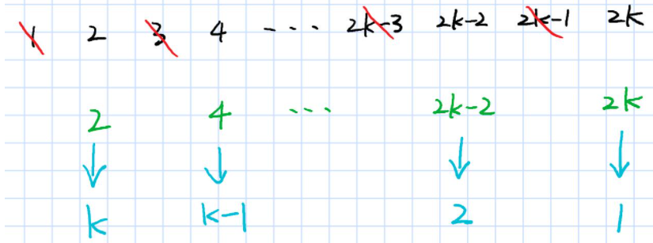
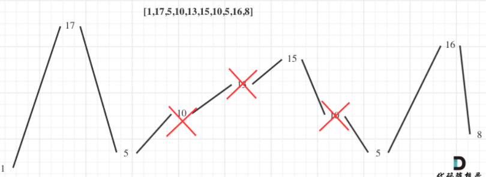

> 计算机真是奇妙又可气的东西, 功能写多了算法和数学就慢慢忘记，算法写多了业务又不熟练了。好的公司基本搞定中等题，稍微懂些困难题才比较稳。刷题数量感觉要400+

### 优先队列使用

```
给你一支股票价格的数据流。数据流中每一条记录包含一个 时间戳 和该时间点股票对应的 价格 。

不巧的是，由于股票市场内在的波动性，股票价格记录可能不是按时间顺序到来的。某些情况下，有的记录可能是错的。如果两个有相同时间戳的记录出现在数据流中，前一条记录视为错误记录，后出现的记录 更正 前一条错误的记录。

请你设计一个算法，实现：

更新 股票在某一时间戳的股票价格，如果有之前同一时间戳的价格，这一操作将 更正 之前的错误价格。
找到当前记录里 最新股票价格 。最新股票价格 定义为时间戳最晚的股票价格。
找到当前记录里股票的 最高价格 。
找到当前记录里股票的 最低价格 
```

* 优先队列存储最大值和最小值

* 基本思路, 使用两个优先队列维护最大值和最小值。使用map维护查询。

* 因为可能存在后来插入的覆盖前面插入的，因此这里使用`stocks[timestamp] = price;`起到覆盖作用, 而`stocks.insert({timestamp, price});`调用`unique_insert`不能起到覆盖的作用。
* 由于可能被覆盖，因此最大堆出队不一定是最大值，这时候需要判断该值是否已经被覆盖，判断的方法只需要判断该price值是否存在map中即可。

<!-- more -->

```cpp
class StockPrice {
public:
    StockPrice() {
       
    }
    /// 更新值
    void update(int timestamp, int price) {
        if (timestamp>=currentTime) { 
            currentPrice = price;
            currentTime = timestamp;
        }
        //stocks.insert({timestamp, price}); insert不会被覆盖
        stocks[timestamp] = price;
        minHeap.push({price, timestamp});   /// 插入{price, timestamp}, 会自动按照price排序得到最大堆或者最小堆
        maxHeap.push({price, timestamp});
        
    }
    
    int current() {
        return currentPrice;    /// 当前值(时间戳最大对应的price)
    }
    
    int maximum() {
        auto p = maxHeap.top();

        while (stocks[p.second] != p.first) {   /// 如果stocks[p.second] != p.first，说明该price被覆盖了
            maxHeap.pop();
            p = maxHeap.top();
        }
        return p.first;
    }
    
    int minimum() {
        auto p = minHeap.top();
        while (stocks[p.second] != p.first) {
            minHeap.pop();
            p = minHeap.top();
        }
        return p.first;
    }
private:
    int currentPrice;

    int currentTime;


    map<int, int> stocks;
    priority_queue<pair<int,int>, vector<pair<int, int>>, less<pair<int, int>>> maxHeap;
    priority_queue<pair<int, int>, vector<pair<int, int>>, greater<pair<int, int>>> minHeap;

};
```

### C/C++字符串转换

#### 整数转换成字符串

* C语言使用`sprintf`格式化成字符串, 注意这个办法不安全，因为有可能超出str的大小造成溢出。

```cpp
    int num = 123456;
    char str[16] = {0};
    int n = sprintf(str, " %d" , num);
    printf("数字：%d 转换后的字符串为：%s\n",num,str);
    printf("长度为: %d\n", strlen(str));
    printf("返回为: %d\n", n);

    return 0;
/// 输出
数字：123456 转换后的字符串为： 123456
长度为: 7
返回为7
```

进一步的使用
```cpp
#include<stdio.h>
#include<stdlib.h>
#include<time.h>
int main(void)
{
    char str[100];  /// 缓冲区大小为100
    int offset =0;
    int i=0;
    srand(time(0));  // *随机种子
    for(i = 0;i<10;i++)
    {
        offset+=sprintf(str+offset,"%d,",rand()%100);  // 格式化的数据写入字符串
    }
    str[offset-1]='\n';
    printf(str);
    return 0;
}
```

* C++ `to_string`函数进行字符串格式化

```
int	"%d"
float	"%f"
double	"%f
long	"%ld

string to_string (int val);
```

#### 字符串转换成整数

* 基于C语言的转换

```
i = atoi(str.c_str());
```

* C++11的转换

```
std::string str;
int i = std::stoi(str);
```

### 最后一块石头的重量，背包问题

```
有一堆石头，用整数数组 stones 表示。其中 stones[i] 表示第 i 块石头的重量。

每一回合，从中选出任意两块石头，然后将它们一起粉碎。假设石头的重量分别为 x 和 y，且 x <= y。那么粉碎的可能结果如下：

如果 x == y，那么两块石头都会被完全粉碎；
如果 x != y，那么重量为 x 的石头将会完全粉碎，而重量为 y 的石头新重量为 y-x。
最后，最多只会剩下一块 石头。返回此石头 最小的可能重量 。如果没有石头剩下，就返回 0。

```

* 分析，可以想象把石头分成两堆，这两堆石头依次进行粉碎。可想而知，最后剩下石头的最小重量，**目标可以是这两堆石头的重量相差最小**。
* 理想情况下两堆石头重量一致，石头没有剩下。当重量不一致时，重量较小的一堆石头重量小于`sum(stones)/2`。显然问题可以转化为，挑选石头，使在重量不高于`sum(stones)/2`时得到最大重量。

* 这道题于是变成了目标和问题，也是背包问题。假设`f[i][j]`为在抉择第i块石头，剩余重量为j 时的最大重量。这道题和leetcode 494目标和问题类似。

```
class Solution {
public:
    int lastStoneWeightII(vector<int>& stones) {
        /// 从stones中选择，凑成质量不超过sum(stones)/2的最大值

        int n = stones.size();
        int sum = 0;
        for (auto& stone : stones) {
            sum+= stone;
        }
        int target = sum/2;

        vector<vector<int>> f(n+1, vector<int>(target));

        for (int i = 1; i <= stones.size(); i++) {
            for (int j = 1; j <= target; j++) {
                //cout << f[i][j] << " ";
                f[i][j] = f[i-1][j];
                if (j >= stones[i-1]) {
                    f[i][j] = max(f[i-1][j], f[i-1][j-stones[i-1]]+stones[i-1]);
                }
            }
        }

        return sum - 2*f[n][target];
    }
};
```

### 最接近目标值的子序列和

这种问题与前者，最后一块石头的重要，类似。但是注意
* 如果数组长度特别大，但是数组的和不大 (sum<=10^5)，我们可以使用背包问题的方式来解决，其中dp[i]表示是否能组成容量为 i 的背包
* 如果数组长度不大(n<=20)，但是数值特别大的话，使用枚举子集的方法。(如果数组长度大于20，例如 40，直接枚举子集2^40会超时,需要折半查找)

```cpp
给你一个整数数组 nums 和一个目标值 goal 。

你需要从 nums 中选出一个子序列，使子序列元素总和最接近 goal 。也就是说，如果子序列元素和为 sum ，你需要 最小化绝对差 abs(sum - goal) 。

返回 abs(sum - goal) 可能的 最小值 。

注意，数组的子序列是通过移除原始数组中的某些元素（可能全部或无）而形成的数组。

1 <= nums.length <= 40
-10^7 <= nums[i] <= 10^7
-10^9 <= goal <= 10^9
```

显然本题使用枚举子集的办法, 对于一个集合长度为n，其子集的数量为`2^n`。可以使用二进制作为枚举子集代表, 例如`1110`可以表示在长度为4的集合中选取前三个元素。

如果数组`nums[j]`, 长度为n ,那么可以构建一个长度为`2^n`的数组表示所有的挑选情况的序列和。这是一个动态规划的过程，例如`1101`可以表示挑选第1，3，4个元素，它可以简单由`1100`挑选第3，4个元素；以及挑选第1个元素个元素组成。

```cpp
    for (int i = 1; i < (1 << n); i++) {    /// 一共由1<<n种情况
        for (int j = 0; j < n; j++) {   /// 从低位第一个为1的位开始相当于动态规划，如果1101 = 1100 + 0001
            /// (i & (1 << j)) == 0
            /// 基于二进制的选择, 然后求和
            if ((i & (1 << j)) == 0) continue;  /// 第一个为1的位,例如1110, 
            lsum[i] = lsum[i-(1<<j)] + nums[j];
            break;
        }
    }
```

* 先以中间为界，等分为两个序列。同时使用两个大小为`2^half`的数组记录每个序列可能选取情况的和(一共有`2^half`个选取情况)

这样原数组的一个子序列和，必然为下列三者之一：
* lsum 中的某个元素；
* rsum 中的某个元素；
* lsum 中的某个元素与 rsum 中的某个元素之和。这时候排序，使用二分查找得到。

```cpp
class Solution {
public:
    int minAbsDifference(vector<int>& nums, int goal) {
        int n = nums.size();
        int half = n / 2;
        int ls = half, rs = n - half;
        
        /// 所有的挑选情况， 集合
        vector<int> lsum(1 << ls, 0);
        for (int i = 1; i < (1 << ls); i++) {
            for (int j = 0; j < ls; j++) {
                /// (i & (1 << j)) == 0
                /// 基于二进制的选择, 然后求和
                if ((i & (1 << j)) == 0) continue;
                lsum[i] = lsum[i-(1<<j)] + nums[j];
                break;
            }
        }
        vector<int> rsum(1 << rs, 0);
        for (int i = 1; i < (1 << rs); i++) {
            for (int j = 0; j < rs; j++) {
                if ((i & (1 << j)) == 0) continue;
                rsum[i] = rsum[i-(1<<j)] + nums[ls+j];
                break;
            }
        }

        //// 每个选择的求和排序
        sort(lsum.begin(), lsum.end());
        sort(rsum.begin(), rsum.end());
        
        /*
        原数组的一个子序列和，必然为下列三者之一：
        lsum 中的某个元素；
        rsum 中的某个元素；
        lsum 中的某个元素与 rsum 中的某个元素之和。
        */
        int ret = INT32_MAX;
        for (int x: lsum) {
            ret = min(ret, abs(goal - x));
        }
        for (int x: rsum) {
            ret = min(ret, abs(goal - x));
        }
        
        /// 同时处理两个数组
        int i = 0, j = rsum.size() - 1;
        while (i < lsum.size() && j >= 0) {
            /// 二分查找
            int s = lsum[i] + rsum[j];
            ret = min(ret, abs(goal - s));
            if (s > goal) {
                j--;
            } else {
                i++;
            }
        }
        return ret;
    }
};
```

* 同样的思路，使用2dfs。使用两个dfs, 先dfs前半段，再dfs后半段。时间复杂度从`2^n`变成了`2^(n/2)`.
* 给定数组长度`1 <= nums.length <= 40`。半段是`1 ~ 20`。一般在循环或递归十的九次方次左右就会超时, 直接递归2^40 = 10^12要超时，使用2dfs，2^20 = 10^6就能通过。

```cpp
// 2^20 < 2^10*2^10 = 1024*1024 < 2*1000*1000，所以数组大小开2e6
const int N = 2e6;
class Solution2 {
public:
    vector<int> q;

    int n,cnt,goal,res;
    /// dfs得到前半段的所有情况
    void dfs1(vector<int>& nums,int idx,int sum)
    {
        // 找到一个可行解
        if(idx==(n+1)/2)// n向上取整，前半部分为[0,n/2]
        {
            q[cnt++]=sum;
            return;
        }
        // 枚举两种情况，一种是选上第idx个元素，另一种是不选第idx个元素
        dfs1(nums,idx+1,sum);
        dfs1(nums,idx+1,sum+nums[idx]);
    } 

    void dfs2(vector<int>& nums,int idx,int sum)
    {
        // 找到一个可行解
        if(idx==n)// 后半部分为[n/2+1,n-1]
        {
            /// cnt是前半段所有情况的大小, 也就是2^half
            int l=0,r=cnt-1;
            // 二分查找再前半段q中找到使q[mid]+sum最逼近goal的位置(<= goal)
            while(l < r)
            {
                // 向上取整，避免 left 取不到 right 造成死循环
                int mid=(l+r+1)>>1;
                /// 当前的sum加前半段的值
                if(q[mid]+sum<=goal)l=mid;// mid满足check，向右逼近，mid可能就是目标值，所以l=mid
                else r=mid-1;// mid不满足check，向左逼近，mid不可能为目标值，所以r=mid-1
            }
            // 二分查找得到的r是<=goal下最逼近goal的位置
            res=min(res,abs(q[r]+sum-goal));
            // 若r有下一个元素，那么我们最近goal的元素要么在 <=goal 的最大位置产生，要么在 >goal 的最小位置产生
            // 所以每次更新res时，注意这两个位置
            if(r+1<cnt)
                res=min(res,abs(q[r+1]+sum-goal));
            return;
        }
        // 遍历后半段，枚举两种情况，一种是选上第idx个元素，另一种是不选第idx个元素
        dfs2(nums,idx+1,sum);
        dfs2(nums,idx+1,sum+nums[idx]);
    }
    
    // 题解：双向dfs，dfs1枚举2^20中选法，然后排序前半段得到的子序列和数组，然后再枚举后半段的子序列，二分前半段的子序列和数组，使得前半段的子序列和与后半段的子序列和相加的结果接近goal
    int minAbsDifference(vector<int>& nums, int _goal) {
        q.resize(N);
        n=nums.size(),cnt=0,goal=_goal,res=INT32_MAX;
        // 先搜索前一半，给搜索完的数组排个序，便于在搜索后一半数组的时候进行二分
        dfs1(nums,0,0);
        /// 排序
        sort(q.begin(),q.begin()+cnt);
        // 搜索后一半
        dfs2(nums,(n+1)/2,0);
        return res;
    }
};
```

### 将数组分成两个数组并最小化数组和的差

```
给你一个长度为 2 * n 的整数数组。你需要将 nums 分成 两个 长度为 n 的数组，分别求出两个数组的和，并 最小化 两个数组和之 差的绝对值 。nums 中每个元素都需要放入两个数组之一。

请你返回 最小 的数组和之差。
```

* 该题和上面最接近目标值的子序列和的区别在于，设置子序列长度为n。处理方法是使用一个二维数组`vector<vector<int>>s`。第一个维度表示现在选取元素的个数，第二个维度是当前选取个数下的和。显然和是一个序列。
* 基于二进制的思想，遍历`int i=0; i<1<<n; i++`, 例如1110表示选取个数为3，选取的元素为第2，3，4个。递归的复杂度是指数的。

```cpp
class Solution {
public:
    int minimumDifference(vector<int>& nums) {
        int n = nums.size();
        n/=2;
        /// 需要用二维数组
        vector<vector<int>>s(n+1);
        
        int res = INT32_MAX;
        /// 是s[cnt]表示选择了cnt个数, 选择的数和不选择的数的差组成的序列
        /// 例如1110， 表示选择第2，3，4个数与不选第1个数，的差
        for(int i=0; i<1<<n; i++){
            int sum = 0, cnt = 0;
            for(int j=0; j<n; j++){
                if(i>>j&1){
                    sum+=nums[j];
                    cnt++;
                }else {
                    sum-=nums[j];
                }
            }
            s[cnt].push_back(sum);
        }
        
        /// 排序，对每一个选择了cnt的数排序
        for(int i=0; i<s.size(); i++)sort(s[i].begin(), s[i].end());

        /// 处理后半序列，共有1<<n种情况
        for(int i=0; i<1<<n; i++){
            int sum = 0, cnt = 0;
            for(int j = 0; j < n; j++){
                if(i>>j&1){
                    sum+=nums[n+j];
                    cnt++;
                }else {
                    sum-=nums[n+j];
                }
            }
            // 这里有cnt个正号，要到前面取n-cnt个正号的数组匹配 
            /// 从s[n-cnt]里找, s[n-cnt]存储的是选择和不选的差,sum也是选择和不选的差.
            /// 二分查找，找选择和不选差<=0的数
            int l = 0, r = s[n-cnt].size()-1;
            while(l<r){
                int mid = l+r+1>>1;
                /// mid可能是理想值
                if(s[n-cnt][mid] + sum<= 0 )l=mid;
                else r = mid-1;
            }
            /// 目标元素可能是s[n-cnt][mid]<= -sum的最大元素或s[n-cnt][mid]<= -sum的最小元素
            /// s[n-cnt][l]表示还有n-cnt个可以选的条件下的和
            res = min(res, abs(sum + s[n-cnt][l]));
            if(r<s[n-cnt].size()-1)res = min(res, abs(sum + s[n-cnt][r+1]));
        }
        return res;
    }
};
```

* 可以使用C++`lower_bound`的函数进行二分查找。

```cpp
 class Solution2 {
public:
    int minimumDifference(vector<int>& nums) {
        int n=nums.size()/2;
        /*
        首先，预处理前n个元素，有2的n次方种状态（即每个元素选或不选），用二进制位的1代表选，0代表不选。
        换句话说，用1代表元素归入第一个数组，用0代表归入第二个数组。
        这里用sum_pre表示前n个数，归为第一个数组的，和归为第二个数组的元素之差。
        */
        vector<int>pre[16];  //pre[i]表示选取i个元素时，和的集合
        for(int i=0;i<(1<<n);i++){
            int sum_pre=0,bit=0;
            for(int j=0;j<n;j++){
                if((i>>j)&1){
                    sum_pre+=nums[j];
                    bit++;
                }else{
                    sum_pre-=nums[j];
                }
            }
            pre[bit].push_back(sum_pre);
        }
        //排序，为了后面二分查找。顺便去重，也可以不去重
        for(int i=0;i<=n;i++){
            sort(pre[i].begin(),pre[i].end());

            /// unique用于去重，其中把重复的元素放到了后面。
            /// 执行完unique()：从容器的开始到返回的迭代器位置的元素是不重复的元素，而从返回的迭代器位置到vector.end()的元素都是没有意义的
            pre[i].erase(unique(pre[i].begin(),pre[i].end()),pre[i].end());
        }

        /*
        考虑后n个数。若后n个数选出bit个归入第一个数组，那么只需从前n个数中拿n-bit个归入第一个数组。
        选数的方式与上面相同，枚举2的n次方个状态。
        对于每个状态，利用二分查找从上面的数组pre[n-bit]中找到一个数k，使得k加上当前的sum_later尽量接近0
        记录下最小的差值即可。
        */
        int ans=1e9+7;
        for(int i=0;i<(1<<n);i++){
            int sum_later=0,bit=0;
            for(int j=0;j<n;j++){
                if((i>>j)&1){
                    sum_later+=nums[j+n];
                    bit++;
                }else{
                    sum_later-=nums[j+n];
                }
            }
            /// lower_bound( begin,end,num)：从pre[n-bit]数组的begin位置到end-1位置二分查找第一个大于或等于num的数字，找到返回该数字的地址
            /// n-bit表示还有n-bit可以选
            auto it=lower_bound(pre[n-bit].begin(),pre[n-bit].end(),-sum_later);
            if(it!=pre[n-bit].end())
                ans=min(ans,sum_later+*it);
        }
        return ans;
    }
};
```

### 火柴拼正方形

```
输入为小女孩拥有火柴的数目，每根火柴用其长度表示。输出即为是否能用所有的火柴拼成正方形。

示例 1:

输入: [1,1,2,2,2]
输出: true

解释: 能拼成一个边长为2的正方形，每边两根火柴。

给定的火柴长度和在 0 到 10^9之间。
火柴数组的长度不超过15。
```

* 对于每一个火柴，都有四种决策，正方形的第1,2,3,4个边。根据此，可以使用dfs搜索
* 稍微不同寻常的思路，但这里dfs实际就是二维的搜索，一个维度是决策，一个维度是数组元素。而在全排列这种递归，则更多是选择构建的决策树。
* dfs的原理就是遍历所有可能存在的情况。

```cpp
class Solution {
public:
    bool makesquare(vector<int>& matchsticks) {
        int sum=0;
        for(int num:matchsticks){
            sum+=num;   /// 求和
        }
        if(sum%4!=0)return false;

        vector<int>adds(4,0);   /// 记录每条边的长度
        sort(matchsticks.begin(),matchsticks.end(),greater<int>());     /// 从大到小排序
        return dfs(0,adds,matchsticks,sum);
    }
    bool dfs(int index,vector<int>&adds,vector<int>&matchsticks,int sum){
        if(*max_element(adds.begin(),adds.end()) > sum/4)return false;  /// 每条边长度不能超过sum/4
        if(index ==matchsticks.size()){
            /// 四条边一样
            if(adds[0]==adds[1]&&adds[1]==adds[2]&&adds[2]==adds[3]){
                return true;
            }
            else return false;
        }
        for(int i=0;i<4;i++){   /// 四条边选择火柴, 每个火柴有四种决策
            adds[i]+=matchsticks[index];  /// 选择火柴
            if(dfs(index+1,adds,matchsticks,sum))return true;
            adds[i]-=matchsticks[index];
        }
        return false;
    }
};
```


### 约瑟夫环问题

约瑟夫问题是个著名的问题：N个人围成一圈，第一个人从1开始报数，报M的将被杀掉，下一个人接着从1开始报。如此反复，最后剩下一个，求最后的胜利者。

模拟整个游戏过程，时间复杂度为`O(nm)`
递推公式, 

* 首先 n 个人的编号依次是 0,1,..,n-1 ，然后踢掉了编号为 `k = (m-1)%n `的人(第m个人)，这时候剩下的人编号为 ` 0,1,..., k-1, k+1, ...,n-1`(k = m-1)。
* 计算下一个踢掉的人时, 从k+1开始计数，共n-1个人。我们可以做一个映射, 将k+1映射成编号为0的第一个人。如果映射后的编号为x, 那么映射前的编号为`(x+m)%n`。
* 因此，在人数为`n-1`以及位置映射条件下得到剩下人编号为x, 则n个人编号为`(x+m)%n`。`f(n) = (f(n-1) + m) % n`

* 从后向前递推，执行完毕之后最后的胜利者编号为0(第一个人), 且一共删除了n-1次。可以使用`(last += m) %= i`

```cpp
/// 从n个人中删除编号为m的数字
class Solution {
public:
    int lastRemaining(int n, int m) {
        int last = 0;
        for (int i = 2; i <= n; ++i) {
            (last += m) %= i;   // i为删除前元素数量
        }
        return last;
    }
};
```

基于编号映射可以解决约瑟夫环的变种问题。

leetcode 390消除游戏
```cpp
给定一个从1 到 n 排序的整数列表。
首先，从左到右，从第一个数字开始，每隔一个数字进行删除，直到列表的末尾。
第二步，在剩下的数字中，从右到左，从倒数第一个数字开始，每隔一个数字进行删除，直到列表开头。
我们不断重复这两步，从左到右和从右到左交替进行，直到只剩下一个数字。
返回长度为 n 的列表中，最后剩下的数字。
```



* 如果 n=2k ，那么如上图所示，第一轮消除完了之后，剩下的数字就是绿色的偶数部分。第二轮重新编号，就是蓝色部分。可以发现`f(2k)=2(k+1−f(k))`, 其中`f(2k)`表示初始2k个数字进行的编号。

* 如果n=2k+1, 也是`f(2k+1)=2(k+1−f(k))`, f(2k+1)表示有2k+1个数字。

显然最后一个剩下的数字编号一定为1，因此可以自顶向下的动态规划

```cpp
class Solution {
public:
    int lastRemaining(int n) {
        return n==1 ? 1 : 2*(n/2+1-lastRemaining(n/2));
    }
};

```

* 相比于自底向上的动态规划需要关系迭代了几次，自顶上下的递归只需要关系初值，不用关心迭代了几次，预先开辟多少空间。


### 摆动序列

* 贪心算法不难，但在于怎么用

```
如果连续数字之间的差严格地在正数和负数之间交替，则数字序列称为 摆动序列 。第一个差（如果存在的话）可能是正数或负数。仅有一个元素或者含两个不等元素的序列也视作摆动序列。

例如， [1, 7, 4, 9, 2, 5] 是一个 摆动序列 ，因为差值 (6, -3, 5, -7, 3) 是正负交替出现的。

相反，[1, 4, 7, 2, 5] 和 [1, 7, 4, 5, 5] 不是摆动序列，第一个序列是因为它的前两个差值都是正数，第二个序列是因为它的最后一个差值为零。
子序列 可以通过从原始序列中删除一些（也可以不删除）元素来获得，剩下的元素保持其原始顺序。

给你一个整数数组 nums ，返回 nums 中作为 摆动序列 的 最长子序列的长度 。
```

用示例二来举例，如图所示：



* 删除单调坡度上的节点（不包括单调坡度两端的节点），那么这个坡度就可以有两个局部峰值。整个序列有最多的局部峰值，从而达到最长摆动序列。

* 实际操作上，其实连删除的操作都不用做, 只需要求**转弯的地方就可以**。例如1->17, 17->5, 5->10, 15->10...


```cpp
class Solution {
public:
    int wiggleMaxLength(vector<int>& nums) {
        if (nums.size() <= 1) 
            return nums.size();
        int curDiff = 0; // 当前一对差值
        int preDiff = 0; // 前一对差值

        int result = 0; 
        for (int i = 0; i < nums.size() - 1; i++) {
            curDiff = nums[i + 1] - nums[i];
            // 出现转弯的地方, 注意第一个元素也是转弯地方
            if ((curDiff > 0 && preDiff <= 0) || (preDiff >= 0 && curDiff < 0)) {
                result++;
                preDiff = curDiff;
            }
        }
        return result+1;
    }
};
```