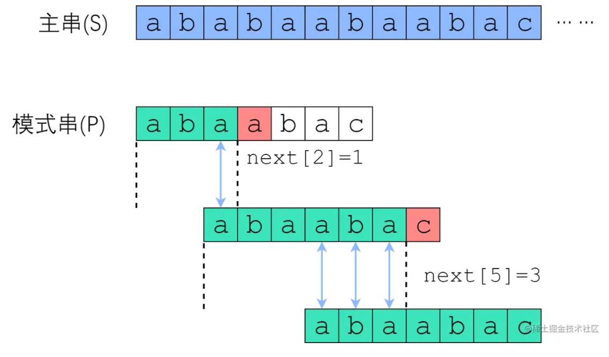
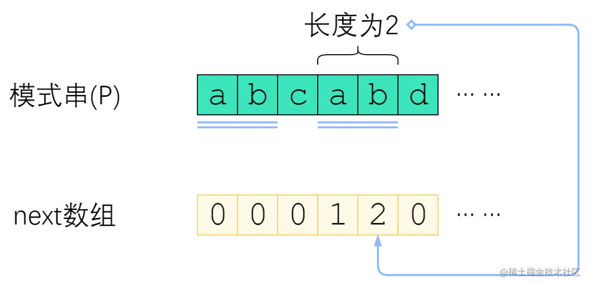
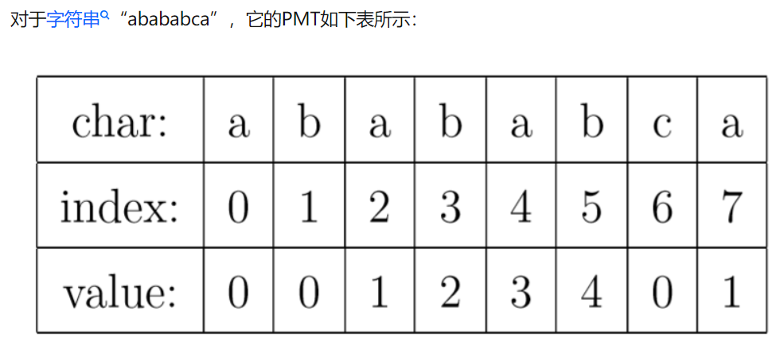

### 树状数组 Binary Indexed Tree
树状数组的主要目的是求范围, 概念有lowbit(二进制最低位1对应的值)。

基于lowbit, 可以方便求lowbit树孩子的父亲节点。基于lowbit可以得到树状数组的计算方法。

求数组arr前缀和转为计算树状数组, 这比按着加arr要快不少

区间查询, 等价于区间边界的两个前缀和作差。

更新arr的值同时要更新树状数组的值, 即调用update
#### lowbit

首先引入`lowbit`概念, `lowbit[x]` 等于 x 这个数的二进制表示下最低位 1 所对应的十进制数值。(x 默认为非负)
例如：`lowbit[44] = lowbit[(101100)2] = (100)2 = 4`

在计算机中, lowbit求解只需要`lowbit[x] = x & (~x + 1)`, 也就是`x & (-x)`

#### 排列规则

树状数组的排列规则可以说基于lowbit, 


如上可以得到, **求左孩子的父节点对应的 x 时，可以利用公式 x + `lowbit[x]`**，如 x=5 的父节点是 x+`lowbit[5]`=6 即 x=6 是其父节点。同理**右孩子的父节点是 x - `lowbit[x]`**。注意对于x = 3来说, 3+lowbit[3]=4, 此时3作为左孩子父亲是4, 作为右孩子父亲是2.

引入一个辅助数组c[i]，c[x] 值为下标是 i=x-lowbit[x]+1 递增到 x 的 a[i] 的和, 如下


有
```
C[1] = A[1];
C[2] = A[1] + A[2];
C[3] = A[3];
C[4] = A[1] + A[2] + A[3] + A[4];
```

<!-- more -->

初始化c[i]数组十分巧妙

```cpp
int n,m;
int a[50005],c[50005]; //对应原数组和树状数组

int lowbit(int x){
    return x&(-x);
}

// 更新树状数组c[]
void updata(int i,int k){    //在i位置加上k
    while(i <= n){  // i+=lowbit(i)的位置都应该加上k
        c[i] += k;
        i += lowbit(i);
    }
}

for(int i = 1; i <= n; i++){
    cin>>a[i];
    updata(i,a[i]);   //输入初值的时候，也相当于更新了值
}

修改 x 对应位置的值时，需要同时修改被其他（蓝色）区域覆盖的 c, 其实就是修改x作为左孩子的所有父亲(直接或间接)。坐标就是`i+=lowbit[i]`，直到 i 更新到数组最大值

求前缀和, 针对数组c,  循环加c[i]且执行`i = i - lowbit[i]`, 知道i为0。

注意树状数组下标从1开始存放, 即A[1],A[2]...A[n]。方便进行前缀和，区间和的求解,也就是任意两位之间的所有元素之和。时间复杂度为`log(n)`

```cpp
int n;
int a[1005],c[1005]; //对应原数组和树状数组

/// 求lowbit
int lowbit(int x){
    return x&(-x);
}

// 更新A[x], 同时更新树状数组c[x]
// 初始化的时候, 直接update(i, a[i])得到c
void updata(int i,int k){    //在i位置加上k
    while(i <= n){
        c[i] += k;
        i += lowbit(i);
    }
}

/// 求前缀和也就是A[1] 到A[i]的和, 转化为计算树状数组c[]
int getsum(int i){        
    int res = 0;
    while(i > 0){
        res += c[i];
        i -= lowbit(i);
    }
    return res;
}
```


```cpp
/*
(1) Add i j,i和j为正整数,表示第i个营地增加j个人（j不超过30）
(2)Sub i j ,i和j为正整数,表示第i个营地减少j个人（j不超过30）;
(3)Query i j ,i和j为正整数,i<=j，表示询问第i到第j个营地的总人数;

对于每个Query询问，输出一个整数并回车,表示询问的段中的总人数,这个数保持在int以内。
*/

#include <bits/stdc++.h>
using namespace std;

int n,m;
int a[50005],c[50005]; //对应原数组和树状数组

int lowbit(int x){
    return x&(-x);
}

void updata(int i,int k){    //在i位置加上k
    while(i <= n){
        c[i] += k;
        i += lowbit(i);
    }
}

int getsum(int i){        //求A[1 - i]的和
    int res = 0;
    while(i > 0){
        res += c[i];
        i -= lowbit(i);
    }
    return res;
}

int main(){
    int t;
    cin>>t;
    for(int tot = 1; tot <= t; tot++){
        cout << "Case " << tot << ":" << endl;
        memset(a, 0, sizeof a);
        memset(c, 0, sizeof c);
        cin>>n;
        for(int i = 1; i <= n; i++){
            cin>>a[i];
            updata(i,a[i]);   //输入初值的时候，也相当于更新了值
        }

        string s;
        int x,y;
        while(cin>>s && s[0] != 'E'){
            cin>>x>>y;
            if(s[0] == 'Q'){    //求和操作
                int sum = getsum(y) - getsum(x-1);    //x-y区间和也就等于1-y区间和减去1-(x-1)区间和
                cout << sum << endl;
            }
            else if(s[0] == 'A'){
                updata(x,y);
            }
            else if(s[0] == 'S'){
                updata(x,-y);    //减去操作，即为加上相反数
            }
        }

    }
    return 0;
}
```
### 线段树 segment tree

线段树支持对一个数列的求和、单点修改、求最值（最大、最小）, 区间修改。这几种操作，时间复杂度是（logn）级别的。

#### 结构

线段树是一种区间树, 是一种平衡二叉树。和堆一样, 这种二叉树结构可以用数组来表示


每个叶子结点的值就是数组的值，每个非叶子结点的度都为二，且左右两个孩子分别存储父亲一半的区间。**每个父亲的存储的值也就是两个孩子存储的值的最大值。**

由于线段树是平衡二叉树，可以用数组来存储线段树。也就是堆的结构，左孩子坐标为2k, 右孩子为2k+1.使用递归来构造树。`k<<1`表示`2*k`, `k<<1|1`表示`2*k+1`。

```cpp
const int maxn = 100005;
int a[maxn],t[maxn<<2];        //a为原来区间，t为线段树, 空间设置为maxn<<2

void Pushup(int k){        //更新函数，这里是实现最大值 ，同理可以变成，最小值，区间和等
    t[k] = max(t[k<<1],t[k<<1|1]);
}

//递归方式建树 build(1,1,n);
void build(int k,int l,int r){    //k为当前需要建立的结点，l为当前需要建立区间的左端点，r则为右端点
    if(l == r)    //左端点等于右端点，即为叶子节点，直接赋值即可
        t[k] = a[l];
    else{
        int m = l + ((r-l)>>1);    //m则为中间点，左儿子的结点区间为[l,m],右儿子的结点区间为[m+1,r]
        build(k<<1,l,m);    //递归构造左儿子结点
        build(k<<1|1,m+1,r);    //递归构造右儿子结点
        Pushup(k);    //更新父节点
    }
}
```

单点更新, 注意父节点存储最大值。叶子节点要更新, 父节点在叶子更新完判断是否需要更新

```cpp
//递归方式更新 updata(p,v,1,n,1);
void updata(int p,int v,int l,int r,int k){    //p为下标，v为要加上的值，l，r为结点区间，k为结点下标
    if(l == r)    //左端点等于右端点，即为叶子结点，直接加上v即可
        a[k] += v,t[k] += v;    //原数组和线段树数组都得到更新
    else{
        int m = l + ((r-l)>>1);    //m则为中间点，左儿子的结点区间为[l,m],右儿子的结点区间为[m+1,r]
        if(p <= m)    //如果需要更新的结点在左子树区间
            updata(p,v,l,m,k<<1);
        else    //如果需要更新的结点在右子树区间
            updata(p,v,m+1,r,k<<1|1);
        Pushup(k);    //更新父节点的值
    }
}
```

区间查询, 每个节点会储存一个区间的值, 例如查询一个区间的最大值,或者区间的和等。这个比较灵活,可以自定义区间信息,而不像树状数组只能求前缀和。

```cpp
//递归方式区间查询 query(L,R,1,n,1);
int query(int L,int R,int l,int r,int k){    //[L,R]即为要查询的区间，l，r为结点区间，k为结点下标
    if(L <= l && r <= R)    //如果当前结点的区间真包含于要查询的区间内，则返回结点信息且不需要往下递归
        return t[k];
    else{
        int res = -INF;    //返回值变量，根据具体线段树查询的什么而自定义
        int mid = l + ((r-l)>>1);    //m则为中间点，左儿子的结点区间为[l,m],右儿子的结点区间为[m+1,r]
        if(L <= m)    //如果左子树和需要查询的区间交集非空
            res = max(res, query(L,R,l,m,k<<1));
        if(R > m)    //如果右子树和需要查询的区间交集非空，注意这里不是else if，因为查询区间可能同时和左右区间都有交集
            res = max(res, query(L,R,m+1,r,k<<1|1));    ///求区间最大值。

        return res;    //返回当前结点得到的信息
    }
}
```

### 并查集

并查集是集合操作, 具体地, 

1. Find: 查找元素所属子集
2. Union：合并两个子集为一个新的集合

使用树这种数据结构来表示集合，不同的树就是不同的集合，并查集中包含了多棵树，表示并查集中不同的子集，树的集合是森林，所以并查集属于森林。

Find操作，我们只需要返回该元素所在树的根节点。所以，如果我们想要比较判断1和2是否在一个集合，只需要通过Find(1)和Find(2)返回各自的根节点比较是否相等。

```cpp
int find(int x)
{
    /// 根节点的parent[x]是自己
    return parent[x] == x ? x : find(parent[x]);
}
```

union操作, 只需要合并两棵树, 具体的, 设置其中一棵树的根节点的parent为另一棵树根节点.

```cpp
void to_union(int x1, int x2) 
{
    int p1 = find(x1);
    int p2 = find(x2);
    parent[p1] = p2;
}
```

路径压缩, 每次查找时，令查找路径上的每个节点都直接指向根节点。从而加速下次查找效率(树越深,效率越低)。因为并查集主要开销就是`find`函数

```cpp
int find(int x) {
    if (x != parent[x]) parent[x] = find(parent[x]);
    return parent[x];
}
```

#### 按秩合并

由于路径压缩只在查询时进行，也只压缩一条路径，所以并查集最终的结构仍然可能是比较复杂的。

用一个数组rank[]记录每个根节点对应的树的深度（如果不是根节点，其rank相当于以它作为根节点的子树的深度）。一开始，把所有元素的rank（秩）设为1。合并时比较两个根节点，把rank较小者往较大者上合并, 来降低并查集的深度

```cpp
#include <cstdio>
#define MAXN 5005
int fa[MAXN], rank[MAXN];
inline void init(int n)
{
    for (int i = 1; i <= n; ++i)
    {
        fa[i] = i;
        rank[i] = 1;
    }
}
int find(int x) // 找到x的父亲
{
    return x == fa[x] ? x : (fa[x] = find(fa[x]));
}
inline void merge(int i, int j)
{
    int x = find(i), y = find(j);
    if (rank[x] <= rank[y])
        fa[x] = y;
    else
        fa[y] = x;
    if (rank[x] == rank[y] && x != y)   // 如果两个子树深度相同, 合并会导致深度加1
        rank[y]++;  // y向x方向合并
}
int main()
{
    int n, m, p, x, y;
    scanf("%d%d%d", &n, &m, &p);
    init(n);
    for (int i = 0; i < m; ++i)
    {
        scanf("%d%d", &x, &y);
        merge(x, y);
    }
    for (int i = 0; i < p; ++i)
    {
        scanf("%d%d", &x, &y);
        printf("%s\n", find(x) == find(y) ? "Yes" : "No");
    }
    return 0;
}
```

### KMP算法

KMP 算法(Knuth-Morris-Pratt)是一个著名的字符串匹配算法, 可以通过自动机来进行理解。KMP本质是通过规则学习匹配的状态转换, 例如。


字符串匹配, 一般短的字符串称为模式串, 它可以被多个字符串匹配. KMP可以自动学习模式串，得到如上的转换图, 也就是状态1得到A,B,C等字符的状态转换。此后基于该模式串匹配任何字符串，都可以直接调用该模式转换图，模式转换图只与模式串有关。

所以KMP算法核心是建立模式转换图，也就是`dp[j][c]`。其中一维表示模式串字符;二维度大小为256,表示遇到的字符, 结果是模式串当前位置遇到c字符后跳转到哪里.KMP算法的核心就是建立dp[][]这个二维数组.

显然模式串当前位置j遇到匹配到正确的下一个字符, 位置会跳转到j+1, 问题在于匹配错了应该跳转到哪. 这里需要考虑的一点是, 如果模式串在j位置失配, 说明在[0~j-1]的位置都是匹配好的, 换言之在[0-j-1]位置模式串和文本串是相同的. 如果模式串某段前缀等于后缀, 那么模式串在前缀匹配失败后就可以直接跳转到后缀进行匹配. 如图中蓝色箭头所示，旧的后缀要与新的前缀一致, 对于模式串而言, 就是模式串前缀和后缀一致



这样就需要一个next数组额外记录前后缀信息, next数组是对于模式串而言的。P 的 next 数组定义为：next[i] 表示 P[0] ~ P[i] 这一个子串，使得 前k个字符恰等于后k个字符 的最大的k.



KMP 利用已匹配部分中相同的「前缀」和「后缀」来加速下一次的匹配, 这样失配后一次可以右移很多位置, 暴力算法失配后一次只能右移一位然后接着匹配
#### 快速求next数组

进一步的, 还可以优化的**检查已匹配部分的相同前缀和后缀**这一过程。即我们检查「前缀」和「后缀」的目的其实是为了确定匹配串中的下一段开始匹配的位置。

我们可以预处理出 next 数组，数组中每个位置的值就是该下标失配应该跳转的目标位置(next 点)。例如匹配串 abcabd 的字符 d 而言，由它发起的下一个匹配点跳转必然是字符 c 的位置。因为字符 d 位置的相同「前缀」和「后缀」字符 ab 的下一位置就是字符 c, 换言之, **ab作为相同前后缀已经匹配完了, 如果d位置失配, 就将该位置直接和c匹配, c再失配, 就只能和a从头开始了**.



PMT中的值是字符串的前缀集合与后缀集合的交集中最长元素的长度。例如，对于"aba"，它的前缀集合为{"a", "ab"}，后缀 集合为{"ba", "a"}。两个集合的交集为{"a"}，那么长度最长的元素就是字符串"a"了，长 度为1，所以对于"aba"而言，它在PMT表中对应的值就是1。再比如，对于字符串"ababa"，它的前缀集合为{"a", "ab", "aba", "abab"}，它的后缀集合为{"baba", "aba", "ba", "a"}， 两个集合的交集为{"a", "aba"}，其中最长的元素为"aba"，长度为3。


求next数组的过程完全可以看成字符串匹配的过程，即**以模式字符串为主字符串，以模式字符串的前缀为目标字符串，一旦字符串匹配成功，那么当前的next值就是匹配成功的字符串的长度**(即前缀长度)。

```cpp
class Solution {
public:
    int strStr(string haystack, string needle) {
        int m = haystack.size();
        int n = needle.size();  // 模式串
        if (n == 0) return 0;
        if (m < n) return -1;
        int* next = new int[n]();
        // 构造next 数组
        // 每次计算i要跳转的位置, 如果needle[i]==needle[k]则++k, next[i] = k. 这里相当于模式串和文本串都是needle.但是i作为文本串, k作为模式串
        // 如果needle[i]!==needle[k], k跳转到next[k-1]再次尝试与i匹配知道匹配成功或者k=0
        // 注意needle
        for (int i = 1, k = 0; i < n; ++i) { // k指向匹配串, 没有匹配成功k = next[k-1]
            while (k > 0 && needle[k] != needle[i]) k = next[k - 1];    // 应该返回k的前一个元素的next, 因为当前k是不匹配的
            if (needle[k] == needle[i]) ++k;
            next[i] = k;
        }
        // 进行匹配
        for (int i = 0, j = 0; i < m; ++i) {
            while (j > 0 && needle[j] != haystack[i]) j = next[j - 1];
            if (haystack[i] == needle[j]) ++j;
            if (j == n) return i - n + 1;   // 匹配成功
        }
        return -1;
    }
};

```


### 打表

```
如果整数 x 满足：对于每个数位d ，这个数位恰好 在 x 中出现 d 次。那么整数 x 就是一个 数值平衡数 。

给你一个整数 n ，请你返回 严格大于 n 的 最小数值平衡数 。

0 <= n <= 10^6
```

* 需要记录每个位数字出现的次数, 值得注意的是, 在`isBeautifulNumber`使用map记录是超时的, 但是在`check`使用数组纪录就不超时了。可以发现需要大量调用记录函数, 这时候`map`和`vector`耗时需要还是可观的。因此对于映射, 能用数组尽量用数组吧

```cpp
class Solution {
public:
    bool isBeautifulNumber(int n) {
        unordered_map<int ,int> map_;
        while (n) {
            int temp = n % 10;
            if (map_.count(temp))
                map_[temp]++;
            else
                map_[temp]  = 1;
            n /= 10;
        }
        for (auto& e : map_) {
            if (e.second != e.first)
                return false;
        }
        return true;
    }

    bool check(int num)
    {
        int xf[10];
        memset(xf, 0, sizeof(xf));
        while (num != 0)
        {
            int x = num % 10;
            xf[x] ++;
            num /= 10;
        }
        for (int x = 0; x < 10; x ++)
        {
            if (xf[x] != 0 && x != xf[x])
            {
                return false;
            }
        }
        return true;
    }
    int nextBeautifulNumber(int n) {
        string n_s = to_string(n);
        int n_bit = n_s.size();
        int n_max = 0;
        int time = 1;
        for (int i = 0; i < n_bit; i++) {
            n_max += n_bit * time;
            time *= 10;
        }
        int m;
        if (n < n_max) {
            m = n+1;
        }else {
            m = time;
        }

        while (!check(m)) {
            m++;
        }
        return m;
    }
};
```

另外什么是打表呢, 简单的就是暴力计算出所有可能结果(也就是1~10^6的所有平衡数), 在所有结果中二分查找就可。

```cpp
class Solution {
public:
	int nextBeautifulNumber(int n) {
		//二分查找
		int balance[] = {
			1,22,122,212,221,333,1333,3133,3313,3331,4444,14444,22333,23233,23323,23332,32233,32323,32332,33223,33232,33322,41444,44144,44414,44441,55555,122333,123233,123323,123332,132233,132323,132332,133223,133232,133322,155555,212333,213233,213323,213332,221333,223133,223313,223331,224444,231233,231323,231332,232133,232313,232331,233123,233132,233213,233231,233312,233321,242444,244244,244424,244442,312233,312323,312332,313223,313232,313322,321233,321323,321332,322133,322313,322331,323123,323132,323213,323231,323312,323321,331223,331232,331322,332123,332132,332213,332231,332312,332321,333122,333212,333221,422444,424244,424424,424442,442244,442424,442442,444224,444242,444422,515555,551555,555155,555515,555551,666666,1224444
		};
		int left = 0, right = 109;
		while (left <= right) {
			int mid = (left + right) >> 1;
			if (n >= balance[mid])
				left = mid + 1;
			else right = mid - 1;
		}
		return balance[left];
	}
};
```