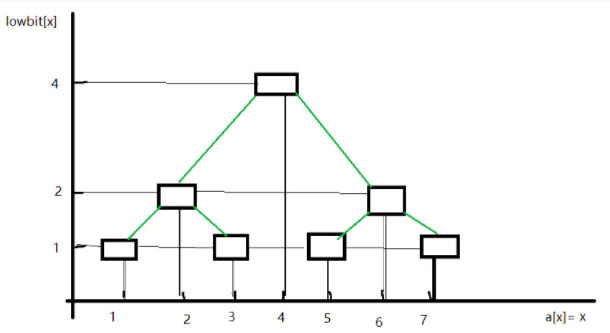
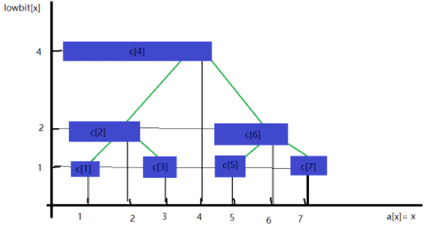
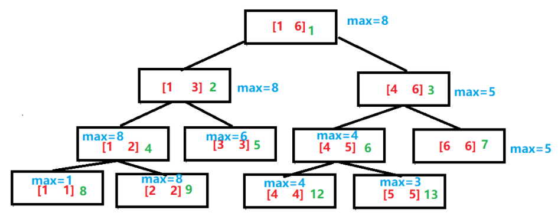
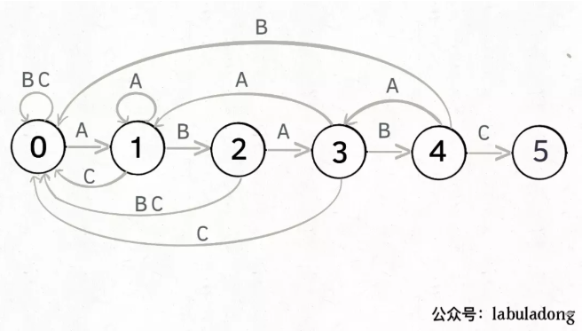

### 树状数组

#### lowbit

* 首先引入`lowbit`概念, `lowbit[x]` 等于 x 这个数的二进制表示下最低位 1 所对应的十进制数值。(x 默认为非负)
例如：`lowbit[44] = lowbit[(101100)2] = (100)2 = 4`
* 在计算机中, lowbit求解只需要`lowbit[x] = x & (~x + 1)`, 也就是`x & (-x)`

#### 排列规则

树状数组的排列规则可以说基于lowbit, 



如上可以得到, 求左孩子的父节点对应的 x 时，可以利用公式 **x + `lowbit[x]`**，如 x=5 的父节点是 x+`lowbit[5]`=6 即 x=6 是其父节点。同理右孩子的父节点是 **x - `lowbit[x]`**。注意对于x = 3来说, 3+lowbit[3]=4, 此时3作为左孩子父亲是4, 作为右孩子父亲是2.

接下来引入一个辅助数组c[i]，c[x] 值为下标是 i=x-lowbit[x]+1 递增到 x 的 a[i] 的和, 如下



有
```
C[1] = A[1];
C[2] = A[1] + A[2];
C[3] = A[3];
C[4] = A[1] + A[2] + A[3] + A[4];
```

<!-- more -->

* 修改 x 对应位置的值时，需要同时修改被其他（蓝色）区域覆盖的 c, 其实就是修改x作为左孩子的所有父亲(直接或间接)。坐标就是`i+=lowbit[i]`，直到 i 更新到数组最大值

* 求前缀和的办法, 针对数组c,  循环加c[i]且执行`i = i - lowbit[i]`, 知道i为0。

* 注意树状数组下标从1开始存放, 即A[1],A[2]...A[n]。方便进行前缀和，区间和的求解,也就是任意两位之间的所有元素之和。时间复杂度为`log(n)`

```cpp
int n;
int a[1005],c[1005]; //对应原数组和树状数组

/// 求lowbit
int lowbit(int x){
    return x&(-x);
}

/// 更新A[x], 同时更新c[x]
void updata(int i,int k){    //在i位置加上k
    while(i <= n){
        c[i] += k;
        i += lowbit(i);
    }
}

/// 求前缀和也就是A[1] 到A[i]的和
int getsum(int i){        
    int res = 0;
    while(i > 0){
        res += c[i];
        i -= lowbit(i);
    }
    return res;
}
```

### 线段树

* 线段树支持对一个数列的求和、单点修改、求最值（最大、最小）、区间修改。这几种操作，时间复杂度是（logn）级别的。

* 线段树是一种区间树, 是一种平衡二叉树。



* 每个叶子结点的值就是数组的值，每个非叶子结点的度都为二，且左右两个孩子分别存储父亲一半的区间。**每个父亲的存储的值也就是两个孩子存储的值的最大值。**

由于线段树是平衡二叉树，可以用数组来存储线段树。也就是堆的结构，左孩子坐标为2k, 右孩子为2k+1.使用递归来构造树。k<<1表示2*k, k<<1|1表示2*k+1。

```cpp
const int maxn = 100005;
int a[maxn],t[maxn<<2];        //a为原来区间，t为线段树, 空间设置为maxn<<2

void Pushup(int k){        //更新函数，这里是实现最大值 ，同理可以变成，最小值，区间和等
    t[k] = max(t[k<<1],t[k<<1|1]);
}

//递归方式建树 build(1,1,n);
void build(int k,int l,int r){    //k为当前需要建立的结点，l为当前需要建立区间的左端点，r则为右端点
    if(l == r)    //左端点等于右端点，即为叶子节点，直接赋值即可
        t[k] = a[l];
    else{
        int m = l + ((r-l)>>1);    //m则为中间点，左儿子的结点区间为[l,m],右儿子的结点区间为[m+1,r]
        build(k<<1,l,m);    //递归构造左儿子结点
        build(k<<1|1,m+1,r);    //递归构造右儿子结点
        Pushup(k);    //更新父节点
    }
}
```

* 单点更新, 注意父节点存储最大值。叶子节点要更新, 父节点在叶子更新完判断是否需要更新

```cpp
//递归方式更新 updata(p,v,1,n,1);
void updata(int p,int v,int l,int r,int k){    //p为下标，v为要加上的值，l，r为结点区间，k为结点下标
    if(l == r)    //左端点等于右端点，即为叶子结点，直接加上v即可
        a[k] += v,t[k] += v;    //原数组和线段树数组都得到更新
    else{
        int m = l + ((r-l)>>1);    //m则为中间点，左儿子的结点区间为[l,m],右儿子的结点区间为[m+1,r]
        if(p <= m)    //如果需要更新的结点在左子树区间
            updata(p,v,l,m,k<<1);
        else    //如果需要更新的结点在右子树区间
            updata(p,v,m+1,r,k<<1|1);
        Pushup(k);    //更新父节点的值
    }
}
```

* 区间查询, 每个节点会储存一个区间的值, 例如查询一个区间的最大值,或者区间的和等。这个比较灵活,可以自定义区间信息,而不像树状数组只能求前缀和。

```cpp
//递归方式区间查询 query(L,R,1,n,1);
int query(int L,int R,int l,int r,int k){    //[L,R]即为要查询的区间，l，r为结点区间，k为结点下标
    if(L <= l && r <= R)    //如果当前结点的区间真包含于要查询的区间内，则返回结点信息且不需要往下递归
        return t[k];
    else{
        int res = -INF;    //返回值变量，根据具体线段树查询的什么而自定义
        int mid = l + ((r-l)>>1);    //m则为中间点，左儿子的结点区间为[l,m],右儿子的结点区间为[m+1,r]
        if(L <= m)    //如果左子树和需要查询的区间交集非空
            res = max(res, query(L,R,l,m,k<<1));
        if(R > m)    //如果右子树和需要查询的区间交集非空，注意这里不是else if，因为查询区间可能同时和左右区间都有交集
            res = max(res, query(L,R,m+1,r,k<<1|1));    ///求区间最大值。

        return res;    //返回当前结点得到的信息
    }
}
```

### 并查集

并查集是集合操作, 具体地, 
* Find: 查找元素所属子集
* Union：合并两个子集为一个新的集合

使用树这种数据结构来表示集合，不同的树就是不同的集合，并查集中包含了多棵树，表示并查集中不同的子集，树的集合是森林，所以并查集属于森林。

* Find操作，我们只需要返回该元素所在树的根节点。所以，如果我们想要比较判断1和2是否在一个集合，只需要通过Find(1)和Find(2)返回各自的根节点比较是否相等。

```cpp
int find(int x)
{
    /// 根节点的parent[x]是自己
    return parent[x] == x ? x : find(parent[x]);
}
```

* union操作, 只需要合并两棵树, 具体的, 设置其中一棵树的根节点的parent为另一棵树根节点

```cpp
void to_union(int x1, int x2) 
{
    int p1 = find(x1);
    int p2 = find(x2);
    parent[p1] = p2;
}
```

* 路径压缩, 每次查找时，令查找路径上的每个节点都直接指向根节点。从而加速下次查找效率(树越深,效率越低)。因为并查集主要开销就是`find`函数

```cpp
int find(int x) {
    if (x != parent[x]) parent[x] = find(parent[x]);
    return parent[x];
}
```

### KMP算法

* KMP 算法（Knuth-Morris-Pratt 算法）是一个著名的字符串匹配算法, 可以通过自动机来进行理解。KMP本质是通过规则学习匹配的状态转换, 例如。



KMP可以自动学习模式串，得到如上的转换图, 也就是状态1得到A,B,C等字符的状态转换。此后基于该模式串匹配任何字符串，都可以直接调用该模式转换图，模式转换图只与模式串有关。

* 所以KMP算法核心是建立模式转换图，也就是`dp[j][c]`。其中一维度大小为模式串长度,也就是状态;二维度大小为256,也就是ascii码字符。

* **模式转换的核心是前缀相同**,例如ABAB遇到A会跳转到3状态，因为ABABA和ABA有相同最长前缀ABA。可以用一个状态X表示最长前缀状态, 例如pat在ABAB时X在AB(最长前缀), pat遇到A时同时X前进一步到达ABA。**X的状态就是pat没有得到匹配时需要转移的状态**
* X状态是pat最长前缀的状态, 显然当前pat已经计算过X了(其前缀计算过了),方式是前缀的前缀, 依次类推。
* 一共M+1个状态,`dp[M]`表示0~M-1共M个状态的转移情况,M状态不需要转移直接成功

```cpp
class KMP {
    vector<vector<int>> dp;
    string pat;
    void KMP(string pat) {
    /// 基于模式串得到转移dp
    /// 
        this->pat = pat;
        int M = pat.size();
        // dp[状态][字符] = 下个状态
        dp.resize(M, vector<int>(256, 0));
        // 初始化,状态0遇到pat[0]跳转到1, 其他还是0
        dp[0][pat[0]] = 1;  
        // 影子状态 X 初始为 0
        int X = 0;
        // 构建状态转移图
        for (int j = 1; j < M; j++) {
            for (int c = 0; c < 256; c++)
                /// 先设置匹配失败跳转到dp[X][c]
                dp[j][c] = dp[X][c];
            /// 匹配成功则跳转到j+1
            dp[j][pat[j]] = j + 1;
            // 更新影子状态
            /// X遇到pat[j]的状态,dp[X]已经计算过了
            X = dp[X][pat[j]];
        }
    }
    /// 基于模式串的匹配
    int search(string txt) {
        int M = pat.size();
        int N = txt.size();
        // pat 的初始态为 0
        int j = 0;
        /// 计算N次
        for (int i = 0; i < N; i++) {
            // 计算 pat 的下一个状态
            j = dp[j][txt[i]];
            // 到达终止态，返回结果
            if (j == M) return i - M + 1;
        }
        // 没到达终止态，匹配失败
        return -1;
    }
};
```

### 添加与搜索单词 - 数据结构设计

```
请你设计一个数据结构，支持 添加新单词 和 查找字符串是否与任何先前添加的字符串匹配 。

实现词典类 WordDictionary ：

WordDictionary() 初始化词典对象
void addWord(word) 将 word 添加到数据结构中，之后可以对它进行匹配
bool search(word) 如果数据结构中存在字符串与 word 匹配，则返回 true ；否则，返回  false 。word 中可能包含一些 '.' ，每个 . 都可以表示任何一个字母。
```

* 方便单词存储和搜索的数据结构是前缀树, 也就是Trie.Trie的构造就是基于26维的指针数组, 26维代表26个字母, 指针指向下一个节点
* 检索时有`.`通配符, 这样检索只能用dfs搜索了, 不能简单的通过是否有指针依次检索。检索复杂度是指数的。

```cpp
class TrieNode {
public:
    vector<TrieNode*> next;
    bool isend;
    TrieNode() :isend(false){
        next.resize(26, nullptr);
    }
};

class WordDictionary {
public:
    TrieNode* root;
    WordDictionary() {
        root = new TrieNode();
    }
    /// 通过前缀树添加
    void addWord(string word) {
        TrieNode* node = root;
        for (auto& w : word) {
            if (!node->next[w-'a'])
                node->next[w-'a'] = new TrieNode();
            node = node->next[w-'a'];
        }
        /// 单词结束标志
        node->isend = true;
    }
    
    /// 通过dfs检索单词
    bool search(string word) {
        return dfs(root, word, 0);
    }

    bool dfs(TrieNode* node, string word, int index) {
        if (index == word.size() && node->isend == true)
            return true;
        if (index == word.size() && node->isend == false)
            return false;
        
        bool flag = false;
        for (int i = 0; i < 26; i++) {
            if (node->next[i] && (word[index] == '.' || word[index]-'a'==i))
                flag = flag || dfs(node->next[i], word, index+1);
        }

        return flag;
    }
};
```

### 双向dfs

双向dfs是dfs在搜索方向的延申, 一般是检索满足要求最大值/最小值等。对于dfs用于回溯(例如全排列等)，一般不能用双向dfs优化。

* bfs,dfs进行图的搜索时时间复杂度为`O(E + V)`,并不是指数复杂度。dfs做回溯决策时为指数复杂度一般为指数

双向dfs的基本思路
* 第一个dfs先搜索前一半的空间，打表存储所有可达的值
* 第二个dfs搜索后一半的空间，然后查询是否在前一半空间中出现过

例题
```
一共准备了N个礼物，其中第i个礼物的重量是G[i]。
达达一次可以搬动重量之和不超过W的任意多个物品。达达希望一次搬掉尽量重的一些物品
请你告诉达达在他的力气范围内一次性能搬动的最大重量是多少。N~46
```

* 题意： 第一个dfs打表记录前n/2的所有可能和。第二个dfs找到小于等于w-sum的最大的那个

```cpp
int const N = 47;

/// cnt,w,n,k,ans
int a[N], cnt = 1, weight[1 << 25], w, n, k, ans;

void dfs1(int u, int sum) {
    if (u == k) {   /// 遍历到u
        weight[cnt++] = sum;    /// 记录在小于w时所有可能存在的sum
        return;
    }
    
    dfs1(u + 1, sum);  // 不选第u个
    if (sum + a[u] <= w) dfs1(u + 1, sum + a[u]);  // 选第u个
}

void dfs2(int u, int sum) {
    // 第二个dfs执行完后, 针对此时的sum, 二分查找小于等于w-s的最大值
    if (u >= n) {
        int l = 0, r = cnt - 1;
        while (l < r) {
            int mid = (l + r + 1) / 2;  /// 向上取整
            if (sum + weight[mid] <= w) l = mid;    ///mid可能是最终结果
            else r = mid - 1;
        }
        ans = max(ans, sum + weight[l]);
        return;
    }
    
    dfs2(u + 1, sum);  // 不选第u个
    if (sum + a[u] <= w) dfs2(u + 1, sum + a[u]);  // 选第u个
}

int main() {
    /// w是最大重量, n是礼物数量
    cin >> w >> n;
    int num = 0;
    for (int i = 0, t; i < n; ++i) {
        cin >> t;
        if (t <= w) a[num++] = t;
    }
    n = num;
    /// 在前k个里面选择
    k = n / 2;
    
    // 优先大的先搜索，从大到小排序
    sort(a, a + n);
    reverse(a, a + n);
    /// 前一半的dfs
    dfs1(0, 0);
    
    // 去重, cnt是weight数组的实际长度,这时候得到的weight是从小到大排序的
    sort(weight, weight + cnt);
    /// unique返回去重后重复元素的索引(尾部),减去weight表示元素大小
    cnt = unique(weight, weight + cnt) - weight;
    
    // 第二个dfs
    dfs2(k, 0);
    cout << ans;
    return 0;
}
```

### 双向bfs

* bfs用于搜索的扩展, 结点的扩展是按它们接近起始结点的程度依次进行的，因此**双向bfs一般也用于检索相等权重图的最小距离**。
* bfs中，要满足先生成的结点先扩展的原则，所以存储结点的表一般设计成队列的数据结构。
* bfs节点一般将先前访问过的节点出队, 这样队列才能在未来满足`Q.empty()`跳出循环，避免死循环。同时**入队时要仔细进行条件判定**，防止反复入队导致死循环。

leetcode 121 单词接龙
```
字典 wordList 中从单词 beginWord 和 endWord 的 转换序列 是一个按下述规格形成的序列：

序列中第一个单词是 beginWord 。
序列中最后一个单词是 endWord 。
每次转换只能改变一个字母。
转换过程中的中间单词必须是字典 wordList 中的单词。
给你两个单词 beginWord 和 endWord 和一个字典 wordList ，找到从 beginWord 到 endWord 的 最短转换序列 中的 单词数目 。如果不存在这样的转换序列，返回 0。

输入：beginWord = "hit", endWord = "cog", wordList = ["hot","dot","dog","lot","log","cog"]
输出：5
解释：一个最短转换序列是 "hit" -> "hot" -> "dot" -> "dog" -> "cog", 返回它的长度 5。
```

* 该题可以转化成图来解, 等价于相等权重下的最小距离,因此可以用bfs。


```cpp
class Solution {
public:
    int ladderLength(string beginWord, string endWord, vector<string>& wordList) {
        // vector转成unordered_set，提高查询速度
        unordered_set<string> wordSet(wordList.begin(), wordList.end());
        // 如果endWord没有在wordSet出现，那么不存在路径
        if (wordSet.find(endWord) == wordSet.end())         return 0;
        unordered_map<string, int> visitMap; // 存储一个pair, {word, 到word路径长度}
        // 初始化队列
        queue<string> que;
        que.push(beginWord);
        // 初始化visitMapbeginWord
        visitMap.insert(pair<string, int>(beginWord, 1));

        while(!que.empty()) {
            string word = que.front();
            que.pop();
            int path = visitMap[word]; // 转化成这个word的路径长度
            /// 从que中取出一个单词word,每个位置都可能转换成26个其他字母,这是个二重循环
            for (int i = 0; i < word.size(); i++) {
                string newWord = word; 
                for (int j = 0 ; j < 26; j++) {
                    newWord[i] = j + 'a';// 每次修改newWord的一个字母
                    if (newWord == endWord) return path + 1; // 找到了end，返回path+1
                    if (wordSet.find(newWord) != wordSet.end() /// wordSet中有newWOrd且visitMap中没有, 加入到visitMap中
                            && visitMap.find(newWord) == visitMap.end()) {
                        // 添加访问信息
                        visitMap.insert(pair<string, int>(newWord, path + 1));
                        /// 加入到队列中
                        que.push(newWord);
                    }
                    /// newWord如果wordSet不存在或者visitMap已经存在,不操作, 因为visitMap中存在的那个word转换量肯定比newWord少
                }
            }
        }
        return 0;
    }
};
```

双向bfs加速。
* 使用两个queue, 一个表示start的bfs访问, 一个表示end的dfs访问。同时使用两个map记录下start访问到的步数, end访问到的步数
* start每访问到一个word, 都使用map检验end是否已经访问了, end同理。如果对方访问了,说明已经有了路径，可以终止访问。

```cpp
class Solution {
public:
    string s, e;
    set<string> set_str;
    int ladderLength(string _s, string _e, vector<string> ws) {
        s = _s;
        e = _e;
        // 将所有 word 存入 set，如果目标单词不在 set 中，说明无解
        for (auto& w : ws) set_str.insert(w);
        if (!set_str.count(e)) return 0;
        int ans = bfs();
        return ans == -1 ? 0 : ans + 1;
    }

    int bfs() {
        // d1 代表从起点 beginWord 开始搜索（正向）
        // d2 代表从结尾 endWord 开始搜索（反向）
        queue<string> d1;
        queue<string> d2;
        /*
         * m1 和 m2 分别记录两个方向出现的单词是经过多少次转换而来
         * e.g. 
         * m1 = {"abc":1} 代表 abc 由 beginWord 替换 1 次字符而来
         * m2 = {"xyz":3} 代表 xyz 由 endWord 替换 3 次字符而来
         */
        map<string, int> m1, m2;
        d1.push(s);
        m1[s] = 0;
        d2.push(e);
        m2[e] = 0;
        
        /*
         * 只有两个队列都不空，才有必要继续往下搜索
         * 如果其中一个队列空了，说明从某个方向搜到底都搜不到该方向的目标节点
         * e.g. 
         * 例如，如果 d1 为空了，说明从 beginWord 搜索到底都搜索不到 endWord，反向搜索也没必要进行了
         */
        while (!d1.empty() && !d2.empty()) {
            int t = -1;
            // 为了让两个方向的搜索尽可能平均，优先拓展队列内元素少的方向
            if (d1.size() <= d2.size()) {
                t = update(d1, m1, m2);
            } else {
                t = update(d2, m2, m1);
            }
            if (t != -1) return t;
        }
        return -1;
    }

    // update 代表从 deque 中取出一个单词进行扩展，
    // cur 为当前方向的距离字典；other 为另外一个方向的距离字典
    int update(queue<string>& q, map<string, int>& cur, map<string, int>& other) {
        // 获取当前需要扩展的原字符串
        string str = q.front();
        q.pop();
        int n = str.size();

        // 枚举替换原字符串的哪个字符 i
        for (int i = 0; i < n; i++) {
            // 枚举将 i 替换成哪个小写字母
            string sub(str);
            for (int j = 0; j < 26; j++) {
                // 替换后的字符串
                sub[i] = 'a' + j;
                if (set_str.count(sub)) {
                    // 如果该字符串在「当前方向」被记录过（拓展过），跳过即可
                    if (cur.count(sub)) continue;

                    // 如果该字符串在「另一方向」出现过，说明找到了联通两个方向的最短路
                    if (other.count(sub)) {
                        return cur[str] + 1 + other[sub];
                    } else {
                        // 否则加入 deque 队列
                        q.push(sub);
                        cur[sub] = cur[str]+1;
                    }
                }
            }
        }
        return -1;
    }
};
```

