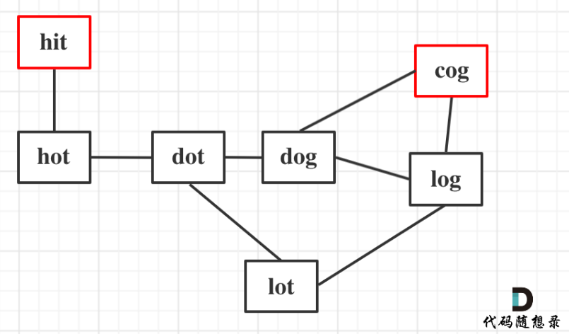
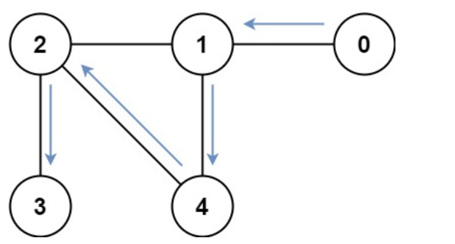
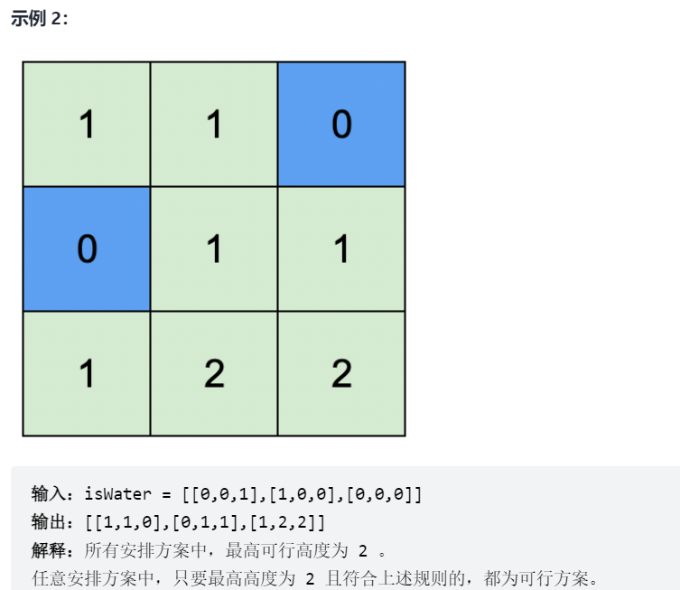

> bfs远比想象的广泛


### 算法题维护二叉树

leetcode 2049
```cpp
给你一棵根节点为 0 的 二叉树 ，它总共有 n 个节点，节点编号为 0 到 n - 1 。同时给你一个下标从 0 开始的整数数组 parents 表示这棵树，其中 parents[i] 是节点 i 的父节点。由于节点 0 是根，所以 parents[0] == -1 。

一个子树的 大小 为这个子树内节点的数目。每个节点都有一个与之关联的 分数 。求出某个节点分数的方法是，将这个节点和与它相连的边全部 删除 ，剩余部分是若干个 非空 子树，这个节点的 分数 为所有这些子树 大小的乘积 。

请你返回有 最高得分 节点的 数目 。
```

该题思路比较简单, 放上来是想规定下算法题维护二叉树的办法。简而言之, 1. 用图维护, 一般邻接表即可, `vector<vector>`。2. 树的节点只需要两种, 父节点和子节点(左右子节点可算一种), 没有父节点的是根节点。必要时只需要再加一个数组表示所有节点的父节点, 结合邻接表一起维护一棵树。

出现乘法, 例如本题所有子树大小的乘积, 将乘法结果用`long long`维护防止溢出。

```cpp
class Solution {
public:
    vector<vector<int>> graph;
    vector<int> weight;
    int countHighestScoreNodes(vector<int>& parents) {
        int num = parents.size();
        graph.resize(num);
        int root;
        for (int i = 0; i < num; i++) {
            if (parents[i] != -1) {
                graph[i].push_back(parents[i]);
                graph[parents[i]].push_back(i);
            }else{
                root = i;
            }
        }
        weight.resize(num); // 每个节点的权重(子树大小)

        dfs(root, -1);

        long long result = 0;  // 根节点权重
        int result_num = 0;

        for (int i = 0;i < num; i++) {
            int son_num = 0;
            int parent_num;
            long long node_value = 1;
            for (auto& son : graph[i]) {
                if (son != parents[i]) {
                    node_value*= weight[son];
                    son_num += weight[son];
                }
            }
            parent_num = num - 1 -son_num;
            if (parent_num > 0)
                node_value*=parent_num;
            if (node_value > result) {
                result_num = 1;
                result = node_value;
            }
            else if (node_value == result)
                result_num++;
        }

        return result_num;
    }

    int dfs(int node ,int fa) {
        
        int num_node = 0;
        for (auto& son : graph[node]) {
            if (son != fa) {
                num_node+= dfs(son, node);
            }
        }
        weight[node] = num_node+1;
        return num_node+1;
    }
};
```

#### 拓扑排序的正确姿势

使用队列维护拓扑排序, 不但可以进行拓扑排序, 还可以判断有向图是否有环

1. 定义一个队列Q，并**把所有入度为0的结点加入队列**
2. 取队首结点，访问，出队, 然后令队首节点可到达的顶点的入度减1，**同时判断如果某个顶点的入度减为0，则将其加入队列**。
3. 重复进行2操作，直到队列为空。
4. 如果队列为空时入过队的结点数恰好为N，说明拓扑排序成功，图G为有向无环图；否则，拓扑排序失败，图G有环。

以上通过使用队列的拓扑排序算法复杂度最低！

leetcode 2050
```cpp
给你一个整数 n ，表示有 n 节课，课程编号从 1 到 n 。同时给你一个二维整数数组 relations ，其中 relations[j] = [prevCoursej, nextCoursej] ，表示课程 prevCoursej 必须在课程 nextCoursej 之前 完成（先修课的关系）。同时给你一个下标从 0 开始的整数数组 time ，其中 time[i] 表示完成第 (i+1) 门课程需要花费的 月份 数。

请你根据以下规则算出完成所有课程所需要的 最少 月份数：

如果一门课的所有先修课都已经完成，你可以在 任意 时间开始这门课程。
你可以 同时 上 任意门课程 。
请你返回完成所有课程所需要的 最少 月份数。
```

使用拓扑排序, 同时访问到一个节点就判断到该节点花费的时间。
```cpp
class Solution {
public:
    int minimumTime(int n, vector<vector<int>>& relations, vector<int>& time) {
        vector<int> max_prev_cost(n+1);
        vector<int> in_degree(n+1);
        vector<vector<int>> to_node(n+1);
        vector<bool> visited(n+1);

        vector<int> node_time(n+1);
        for (int i = 0; i < n; i++) {
            node_time[i+1] = time[i];
        }

        int result = 0;

        for (auto& relation : relations) {
            in_degree[relation[1]] ++;
            to_node[relation[0]].push_back(relation[1]);
        }

        queue<int> q;   
        for (int i = 1; i <= n; i++)    // 入度为0的节点入队
            if (in_degree[i] == 0)
                q.push(i);

        while (!q.empty()) {
            int u = q.front();	
            q.pop();
            node_time[u] += max_prev_cost[u];    // 到节点i的最小花费
            result = max(node_time[u], result);
            for (auto& next : to_node[u]) {// i指向的地方
                max_prev_cost[next] = max(max_prev_cost[next], node_time[u]);   // 到达to节点的花费
                in_degree[next]--;			
                if (in_degree[next] == 0)		//顶点v的入度减为0则入队
                    q.push(next);
            }
        }
        return result;
    }
};
```

### BFS最短路径的转化

leetcode 2059
```
给你一个下标从 0 开始的整数数组 nums ，该数组由 互不相同 的数字组成。另给你两个整数 start 和 goal 。

整数 x 的值最开始设为 start ，你打算执行一些运算使 x 转化为 goal 。你可以对数字 x 重复执行下述运算：

如果 0 <= x <= 1000 ，那么，对于数组中的任一下标 i（0 <= i < nums.length），可以将 x 设为下述任一值：

x + nums[i]
x - nums[i]
x ^ nums[i]（按位异或 XOR）
注意，你可以按任意顺序使用每个 nums[i] 任意次。使 x 越过 0 <= x <= 1000 范围的运算同样可以生效，但该该运算执行后将不能执行其他运算。

返回将 x = start 转化为 goal 的最小操作数；如果无法完成转化，则返回 -1 。
```

但凡问题转化成无向图，同权图最小路径 问题，就容易用BFS求解。无向图可以描述状态的转变。

因此本题可以看成, 起始状态为start, 每次可以有三种状态可供转化(分别是+, -, ^), 能不能转化成终止状态goal。如果我们使用bfs, 可以保证每次出队列的都是队列中距离start最近的状态, 换言之, 如果一次出队列元素状态为goal, 该元素一定是从start转化的最小操作。

```cpp
    int minimumOperations(vector<int>& nums, int start, int goal) {
        int n = nums.size();

        auto op1 = [](int x, int y) -> int { return x + y; };   // 使用auto, 表征一个函数, 返回值为int
        auto op2 = [](int x, int y) -> int { return x - y; };
        auto op3 = [](int x, int y) -> int { return x ^ y; };

        vector<function<int(int, int)>> ops = {op1, op2, op3};  // vector是function的列表

        vector<int> vis(1001, 0);
        queue<pair<int, int>> q;
        q.emplace(start, 0);    // 从start开始, step = 0
        vis[start] = 1;
        while (!q.empty()) {
            auto [x, step] = q.front();
            q.pop();
            // 枚举数组中的元素, 出队的元素x可以和每个数组元素(n个)进行三种操作运算, 最多可以有3n中状态转化
            for (int i = 0; i < n; i++) {
                for (auto& op : ops) {  // 遍历所有操作数, 这可视为一个状态
                    int nx = op(x, nums[i]);    // 计算op(x和nums), 转化情况x->nx
                    if (nx == goal) {
                        return step+1;
                    }
                    // 如果nx越过0或1000, 不能继续执行运算, 因此不能加入队列。已经加入队列的元素也不能再次加入
                    if (nx >= 0 && nx <= 1000 && !vis[nx]) {
                        vis[nx] = 1;
                        q.emplace(nx, step+1);  // 加入队列, 使nx有机会继续状态转化
                    }
                }
            }
        }

        return -1;
    }
```

#### bfs次短路

leetcode 5905
```
城市用一个 双向连通 图表示，图中有 n 个节点，从 1 到 n 编号（包含 1 和 n）。图中的边用一个二维整数数组 edges 表示，其中每个 edges[i] = [ui, vi]表示一条节点ui 和节点vi 之间的双向连通边。每组节点对由 最多一条 边连通，顶点不存在连接到自身的边。穿过任意一条边的时间是 time分钟。

每个节点都有一个交通信号灯，每 change 分钟改变一次，从绿色变成红色，再由红色变成绿色，循环往复。所有信号灯都同时 改变。你可以在 任何时候 进入某个节点，但是 只能 在节点信号灯是绿色时 才能离开。如果信号灯是 绿色 ，你 不能 在节点等待，必须离开。

第二小的值 是严格大于 最小值的所有值中最小的值。

例如，[2, 3, 4] 中第二小的值是 3 ，而 [2, 2, 4] 中第二小的值是 4 。
给你 n、edges、time 和 change ，返回从节点 1 到节点 n 需要的 第二短时间 。

注意：

你可以 任意次 穿过任意顶点，包括 1 和 n 。
你可以假设在 启程时 ，所有信号灯刚刚变成 绿色 。
```

图可以看做边权相等的图，想到用Bfs求最短路或者次短路。

数据存储单位可以是pair, 分别表示该节点号和起始节点到该节点的用时。使用`make_pair`进行存储

处理红绿灯，如果`targetTime / change) % 2`为奇数，说明是红灯，需要等待一段时间

次短路，可以使用两个`map`，分别存储当前节点号和起始节点到该节点的用时, 分别是最短用时和次短用时。

最短用时和次短用时都会进入队列进行bfs, 由于bfs的特性，**到达n的最短用时一定会先出现**。所以只需要等到第二个访问n的就是次短用时。

```cpp
class Solution {
public:
/// 分别记录到达某点的最短路和次短路
    unordered_map<int, int> fast;
    unordered_map<int, int> second;
    int secondMinimum(int n, vector<vector<int>>& edges, int time, int change) {
        queue<pair<int, int>> Q; // (node, time)
        /// 记录node, time
        Q.push(make_pair(1, 0));

        /// 节点邻接表
        unordered_map<int, vector<int>> G;
        int first = -1;
        
        for (auto edge: edges) {
            if (G.find(edge[0]) == G.end()) G[edge[0]] = vector<int>(0);
            if (G.find(edge[1]) == G.end()) G[edge[1]] = vector<int>(0);
            /// G是邻接表
            G[edge[0]].push_back(edge[1]);
            G[edge[1]].push_back(edge[0]);
        }
        
        while(!Q.empty()) {
            pair<int, int> p = Q.front();
            Q.pop();
            int node = p.first;
            int curTime = p.second;
            /// 可以继续走的节点
            for (auto next: G[node]) {
                /// 边权相等,BFS先访问到n到达的一定是最短路, 第二次访问到的为次短路, 依次类推
                if (next == n) {
                    if (first == -1) {
                        first = curTime + time;
                    } else {
                        if (curTime + time > first) return curTime + time;
                    }
                }
                int targetTime = curTime + time;
                /// 等待红灯
                if ((targetTime / change) % 2 == 1) {
                    /// 向上取整乘change
                    targetTime = (targetTime / change + 1) * change;
                }
                /// 设置最短路, 并入队
                if (fast.find(next) == fast.end()) {
                    fast[next] = targetTime;
                    Q.push(make_pair(next, targetTime));                
                    continue;
                }
                /// 设置次短路
                if (second.find(next) == second.end() && fast[next] < targetTime) {
                    second[next] = targetTime;
                    Q.push(make_pair(next, targetTime));                
                    continue;
                }
            }
        }
        
        return -1;
    }
};
```

可以使用优先队列(小顶堆)记录最短距离。到每个点的用时实际上只与上一个点有关，图的问题基本是这样的。

BFS, DFS重要的是剪枝，BFS入队如果没有剪枝，队的大小越来越大，不可能出现`Q.empty()`，从而发生死循环。本题的剪枝起始就是选取适当的元素入队，换言之，最短距离和次短距离入队`if(dist[to]>len+1)`,`else if(dist[to]<len+1 && dist2[to]>len+1)` ，这两个条件使队列不会无限膨胀

`priority_queue`保证每次队中距离最小的点出队, 本身基于bfs的出队顺序也是距离从小到大的。**但优先队列可以使边权不一致时按照距离从小到达出队**

```cpp
class Solution {
public:
    typedef pair<int,int>PII;
    int secondMinimum(int n, vector<vector<int>>& edges, int time, int change) {
        // 1. 建图, 邻接表
        vector<int>G[10002];
        for(auto&e:edges){
            G[e[0]].push_back(e[1]);
            G[e[1]].push_back(e[0]);
        }
        
        // 2. 求最短路和次短路
        priority_queue<PII, vector<PII>, greater<PII>>Q;   /// 默认大顶堆
        int dist[10002],dist2[10002];   /// 储存最短路和次短路

        for(int i=1;i<=n;i++)dist[i]=dist2[i]=1e9;
        dist[1]=0;
        Q.push(PII(-dist[1], 1));
        while(!Q.empty()){
            int u=Q.top().second;
            int len=Q.top().first;
            Q.pop();    /// 统计过的出队，
            if(dist2[u]<len)continue;//比次短路还长的路，直接扔了

            for(auto&to:G[u]){
                if(dist[to]>len+1){
                    dist[to]=len+1; // 路径长度+1
                    Q.push(PII(dist[to],to));
                }else if(dist[to]<len+1 && dist2[to]>len+1){
                    dist2[to]=len+1;
                    Q.push(PII(dist2[to],to));
                }
            }
        }
        int second=dist2[n];//次短路
        
        // 3. 计算走second步的耗时
        int cost=0;
        for(int i=1;i<=second;i++){
            if((cost/change)&1)
                cost=(cost/change+1)*change;//遇到红灯，直接跳到绿灯起始时间。
            cost+=time;
        }
        return cost;
    }
};
```

#### 377. 组合总和 Ⅳ

```cpp
给你一个由 不同 整数组成的数组 nums ，和一个目标整数 target 。请你从 nums 中找出并返回总和为 target 的元素组合的个数。

题目数据保证答案符合 32 位整数范围。

输入：nums = [1,2,3], target = 4
输出：7
解释：
所有可能的组合为：
(1, 1, 1, 1)
(1, 1, 2)
(1, 2, 1)
(1, 3)
(2, 1, 1)
(2, 2)
(3, 1)
请注意，顺序不同的序列被视作不同的组合。
```

该题是从一个数组中选数字以组成target, 且可以选择多个。简单的思路就是通过递归。每次尝试从nums中选择一个数字, 如果数字和==target记录个数+1, 如果数字和<target则retur剪枝

```py
class Solution(object):
    def combinationSum4(self, nums, target):
        if target < 0:
            return 0
        if target == 0:
            return 1
        res = 0
        for num in nums:
            res += self.combinationSum4(nums, target - num)
        return res
```

既然使用了递归, 我们考虑记忆化搜索。假设g(x)表示target=x时的个数, 我们可以发现g(x)与g(x-nums[i])有关, 具体的g(x)=g(x-nums[i])+1

```py
    def combinationSum4V2(self, nums, target):
        self.dp = [-1] * (target + 1)
        self.dp[0] = 1  # 记忆
        return self.dfs(nums,target)
    
    def dfs(self, nums, target):
        if target < 0:
            return 0
        if self.dp[target] != -1:
            return self.dp[target]
        res = 0
        for num in nums:
            res += self.dfs(nums, target-num)
        self.dp[target] = res 
        return res
```

同样的, 自底向上的动态规划
```py
def combinationSum4V3(self, nums, target):
    self.dp = [0]*(target+1)
    self.dp[0] = 1
    res = 0
    
    for i in range(target+1):
        for num in nums:
            if i >= num:
                self.dp[i] += self.dp[i-num]
    return self.dp[target] 
```

### 双向bfs

* bfs用于搜索的扩展, 结点的扩展是按它们接近起始结点的程度依次进行的，因此**双向bfs一般也用于检索相等权重图的最小距离**。
* bfs中，要满足先生成的结点先扩展的原则，所以存储结点的表一般设计成队列的数据结构。
* bfs节点一般将先前访问过的节点出队, 这样队列才能在未来满足`Q.empty()`跳出循环，避免死循环。同时**入队时要仔细进行条件判定**，防止反复入队导致死循环。

leetcode 121 单词接龙
```
字典 wordList 中从单词 beginWord 和 endWord 的 转换序列 是一个按下述规格形成的序列：

序列中第一个单词是 beginWord 。
序列中最后一个单词是 endWord 。
每次转换只能改变一个字母。
转换过程中的中间单词必须是字典 wordList 中的单词。
给你两个单词 beginWord 和 endWord 和一个字典 wordList ，找到从 beginWord 到 endWord 的 最短转换序列 中的 单词数目 。如果不存在这样的转换序列，返回 0。

输入：beginWord = "hit", endWord = "cog", wordList = ["hot","dot","dog","lot","log","cog"]
输出：5
解释：一个最短转换序列是 "hit" -> "hot" -> "dot" -> "dog" -> "cog", 返回它的长度 5。
```

该题可以转化成图来解, 等价于相等权重下的最小距离,因此可以用bfs。



```cpp
class Solution {
public:
    int ladderLength(string beginWord, string endWord, vector<string>& wordList) {
        // vector转成unordered_set，提高查询速度
        unordered_set<string> wordSet(wordList.begin(), wordList.end());
        // 如果endWord没有在wordSet出现，那么不存在路径
        if (wordSet.find(endWord) == wordSet.end())         return 0;
        unordered_map<string, int> visitMap; // 存储一个pair, {word, 到word路径长度}
        // 初始化队列
        queue<string> que;
        que.push(beginWord);
        // 初始化visitMapbeginWord
        visitMap.insert(pair<string, int>(beginWord, 1));

        while(!que.empty()) {
            string word = que.front();
            que.pop();
            int path = visitMap[word]; // 转化成这个word的路径长度
            /// 从que中取出一个单词word,每个位置都可能转换成26个其他字母,这是个二重循环
            for (int i = 0; i < word.size(); i++) {
                string newWord = word; 
                for (int j = 0 ; j < 26; j++) {
                    newWord[i] = j + 'a';// 每次修改newWord的一个字母
                    if (newWord == endWord) return path + 1; // 找到了end，返回path+1
                    if (wordSet.find(newWord) != wordSet.end() /// wordSet中有newWOrd且visitMap中没有, 加入到visitMap中
                            && visitMap.find(newWord) == visitMap.end()) {
                        // 添加访问信息
                        visitMap.insert(pair<string, int>(newWord, path + 1));
                        /// 加入到队列中
                        que.push(newWord);
                    }
                    /// newWord如果wordSet不存在或者visitMap已经存在,不操作, 因为visitMap中存在的那个word转换量肯定比newWord少
                }
            }
        }
        return 0;
    }
};
```

双向bfs加速

使用两个queue, 一个表示start的bfs访问, 一个表示end的dfs访问。同时使用两个map记录下start访问到的步数, end访问到的步数

start每访问到一个word, 都使用map检验end是否已经访问了, end同理。如果对方访问了,说明已经有了路径，可以终止访问。

```cpp
class Solution {
public:
    string s, e;
    set<string> set_str;
    int ladderLength(string _s, string _e, vector<string> ws) {
        s = _s;
        e = _e;
        // 将所有 word 存入 set，如果目标单词不在 set 中，说明无解
        for (auto& w : ws) set_str.insert(w);
        if (!set_str.count(e)) return 0;
        int ans = bfs();
        return ans == -1 ? 0 : ans + 1;
    }

    int bfs() {
        // d1 代表从起点 beginWord 开始搜索（正向）
        // d2 代表从结尾 endWord 开始搜索（反向）
        queue<string> d1;
        queue<string> d2;
        /*
         * m1 和 m2 分别记录两个方向出现的单词是经过多少次转换而来
         * e.g. 
         * m1 = {"abc":1} 代表 abc 由 beginWord 替换 1 次字符而来
         * m2 = {"xyz":3} 代表 xyz 由 endWord 替换 3 次字符而来
         */
        map<string, int> m1, m2;
        d1.push(s);
        m1[s] = 0;
        d2.push(e);
        m2[e] = 0;
        
        /*
         * 只有两个队列都不空，才有必要继续往下搜索
         * 如果其中一个队列空了，说明从某个方向搜到底都搜不到该方向的目标节点
         * e.g. 
         * 例如，如果 d1 为空了，说明从 beginWord 搜索到底都搜索不到 endWord，反向搜索也没必要进行了
         */
        while (!d1.empty() && !d2.empty()) {
            int t = -1;
            // 为了让两个方向的搜索尽可能平均，优先拓展队列内元素少的方向
            if (d1.size() <= d2.size()) {
                t = update(d1, m1, m2);
            } else {
                t = update(d2, m2, m1);
            }
            if (t != -1) return t;
        }
        return -1;
    }

    // update 代表从 deque 中取出一个单词进行扩展，
    // cur 为当前方向的距离字典；other 为另外一个方向的距离字典
    int update(queue<string>& q, map<string, int>& cur, map<string, int>& other) {
        // 获取当前需要扩展的原字符串
        string str = q.front();
        q.pop();
        int n = str.size();

        // 枚举替换原字符串的哪个字符 i
        for (int i = 0; i < n; i++) {
            // 枚举将 i 替换成哪个小写字母
            string sub(str);
            for (int j = 0; j < 26; j++) {
                // 替换后的字符串
                sub[i] = 'a' + j;
                if (set_str.count(sub)) {
                    // 如果该字符串在「当前方向」被记录过（拓展过），跳过即可
                    if (cur.count(sub)) continue;

                    // 如果该字符串在「另一方向」出现过，说明找到了联通两个方向的最短路
                    if (other.count(sub)) {
                        return cur[str] + 1 + other[sub];
                    } else {
                        // 否则加入 deque 队列
                        q.push(sub);
                        cur[sub] = cur[str]+1;
                    }
                }
            }
        }
        return -1;
    }
};
```

### leetcode

#### leetcode847 访问所有节点的最短路径

访问所有节点的最短路径,

```
存在一个由 n 个节点组成的无向连通图，图中的节点按从 0 到 n - 1 编号。

给你一个数组 graph 表示这个图。其中，graph[i] 是一个列表，由所有与节点 i 直接相连的节点组成。

返回能够访问所有节点的最短路径的长度。你可以在任一节点开始和停止，也可以多次重访节点，并且可以重用边。
```

这道题有两个要求, 访问所有节点和最短路径。这道题的访问所有节点可以重访节点以及可以重用边, 并不像旅行商TSP问题的一笔画的形式。自然考虑使用广度优先搜索。

广度优先搜索，一般的形式是
```
void BFS(Graph G, int v){                  //从顶点V出发，广度优先遍历，借助一个辅助队列
	visit(v);
	visited[v] = TRUE;
	EnQueue(Q, v);  // 起始节点入队列

	while(!Empty(Q)){
		Dequeue(Q, v);

		for(w = FirstNeighbor(G, v); v > 0; w = NextNeighbor(G, v, w)){ // 邻居节点入队列
			if(!visited[w]){
				visited[w] = TRUE;
				EnQueue(Q, w);
			}
		}
	}
}
```
广度优先搜索是一种贪心的算法, 在求最短路径时。每次会将队头节点的邻居加入到队列中，这些邻居节点也就是已访问节点集合的相邻最近的节点。然后将队头节点出队，因为已经把队头节点的邻居加入到队列中了，剩余节点到这些邻居的距离肯定小于到队头节点距离，因此会将队头节点出队。

这道题还有个问题是访问全部节点，换言之我们的bfs可以保证每次访问的是最短路径, 但结束不能是`while (!Empty(Q))`, 而是如果访问了全部节点就退出。这里涉及的问题是怎样知道访问了所有节点呢。

使用的办法称为`状态压缩`, 也就是用二进制表示节点是否访问的状态, 例如101表示访问了第1,3节点, 而当值为111说明访问了全部节点, 也就是2^n-1。

我们用mask表示全部节点的状态,这时候
1. 访问第 i 个点的状态：`state=(1 << i) & mask`
2. 访问了第i个点然后更改第 i 个点状态为 1： `mask = mask | (1 << i)`
3. 当节点数量为n, 判断节点完全访问完`if(mask == (1 << n) - 1)`

如果没有规定起点, 可以预先把所有点存入队列, 同时访问通过节点id和mask标识. 很巧妙, 如果id和mask都相同, 说明经过路径也相同。


如上, 0为起点mask为00001, 1为起点为00010; 而当mask变为00011, 不论是从0起点还是1起点，已经经过路径0-1, 这时候起点不影响了，因为路径是一样的。
```cpp
class Solution {
public:
    int shortestPathLength(vector<vector<int>>& graph) {
        int n = graph.size();

        queue< tuple<int, int, int> > q; // 三个属性分别为 节点id, 所有节点状态mask, dist
        vector<vector<int>> vis(n, vector<int>(1 << n)); // 节点编号及当前状态
        for(int i = 0; i < n; i++) {
            q.push({i, 1 << i, 0}); // 存入起点 tuple, 每个点都可以是起点
            vis[i][1 << i] = 1;
        }

        // 开始搜索
        while(!q.empty()) {
            // auto [cur, mask, dist] = q.front(); // 弹出队头元素
            int cur = std::get<0>(q.front());
            int mask = std::get<1>(q.front());
            int dist = std::get<2>(q.front());
            q.pop();

            // 节点完全访问完毕
            if(mask == (1 << n) - 1) return dist;

            // 扩展
            for(int x : graph[cur]) {
                int nextmask = mask | (1 << x); // 访问了x节点
                if(!vis[x][nextmask]) {
                    q.push({x, nextmask, dist + 1});
                    vis[x][nextmask] = 1;
                }
            }
        }
        return 0;
    }
};
```


#### 地图中的最高点 多源bfs


```
给你一个大小为m x n的整数矩阵isWater，它代表了一个由 陆地和 水域单元格组成的地图。

如果isWater[i][j] == 0，格子(i, j)是一个 陆地格子。
如果isWater[i][j] == 1，格子(i, j)是一个 水域格子。
你需要按照如下规则给每个单元格安排高度：

每个格子的高度都必须是非负的。
如果一个格子是是 水域，那么它的高度必须为 0。
任意相邻的格子高度差 至多为 1。当两个格子在正东、南、西、北方向上相互紧挨着，就称它们为相邻的格子。(也就是说它们有一条公共边)
找到一种安排高度的方案，使得矩阵中的最高高度值最大。
```



如果多个点是水面, 这里我们可以从这些水面点同时向外进行扩散。

为了访问到重复的点，我们可以将result矩阵值初始化为-1, 访问到的点高度设置为>=0的正数, 因此我们可以通过正负判断节点是否访问过。

```cpp
const int dx[] = {-1, 1, 0, 0};
const int dy[] = {0, 0, -1, 1};
class Solution {
public:
    vector<vector<int>> highestPeak(vector<vector<int>>& isWater) {
        int row = isWater.size();
        int col = isWater[0].size();

        queue<pair<int,int>> waterqueue;
        vector<vector<int>> result(row, vector<int>(col));
        for (int i = 0; i < row; i++) {
            for (int j = 0; j < col; j++) {
                if (isWater[i][j] == 1)
                    waterqueue.push({i, j});
                else 
                    result[i][j] = -1;  // 表示没有访问的节点
            }
        }
        while (!waterqueue.empty()) {
            int x = waterqueue.front().first;
            int y = waterqueue.front().second;

            for (int i = 0; i < 4; i++) {
                int newx = x+dx[i];
                int newy = y+dy[i];

                if (newx < 0 || newx >= row || newy < 0 || newy >= col)  continue;
                if (result[newx][newy] >= 0)    continue; // 防止重复访问
                result[newx][newy] =result[x][y]+1;
                waterqueue.push({newx, newy});
            }
            waterqueue.pop();
        }
        return result;
    }
};
```