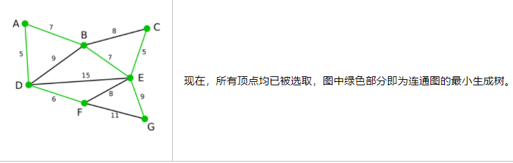
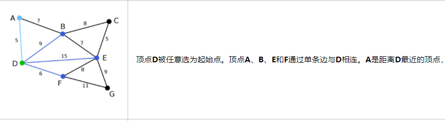
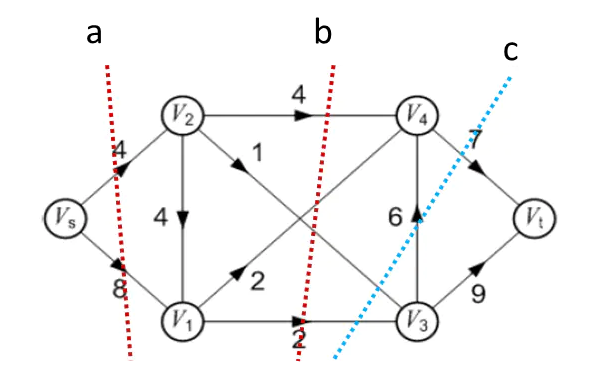
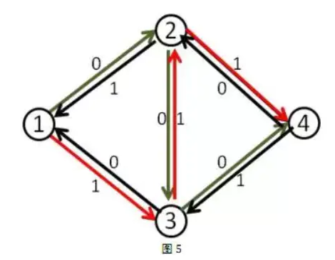
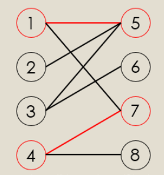
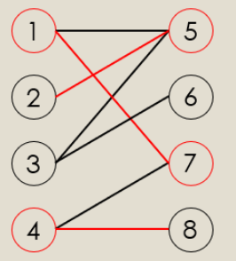

### 最小生成树

一个连通图的生成树是一个极小的连通子图，它包含图中全部的n个顶点，但只有构成一棵树的n-1条边。最小生成树也可以认为将带权连通图所有顶点相连且最小权值的路径方法。注意一张图可能有多种最小生成树的方法。

最小生成树是对于带权连通图说的, 对于带权图使用邻接矩阵更方便一些, 无权图使用邻接表更好一些。

#### prim 算法

输入一个加权连通图，其中顶点集合为V，边集合为E；

初始化集合`Vnew = {x}`，其中x为集合V中的任一节点（起始点），边集合Enew = {}为空; 重复下列操作，直到Vnew = V。边可以用`(起始点, 终止点, 权重)`来表示。

1. 在集合E中选取权值最小的边`<u, v>`，其中**u为集合Vnew**中的元素，而**v不在Vnew集合**当中，如果存在有多条满足前述条件即具有相同权值的边，则可任意选取其中之一）；

2. 将v加入集合Vnew中，将`<u, v>`边加入集合Enew中；

输出: 使用集合Vnew和Enew来描述所得到的最小生成树。

prim是基于从某个点出发, 加入距离已经添加点的距离最小的贪心算法, 相比之下, Kruskal基于加入边最小的算法。两者类似于Dijkstra和Floyd-Warshall, 一个是加入最近的点并更新距离数组; 一个是加入边,处理边的两个结点是否松弛。

prim程序**围绕着lowcost数组, 每次循环找到生成树节点外lowcost最小的id, 加入生成树, 基于这个MinId再更新lowcost**

<!-- more -->





```cpp
#include <iostream>
#include <fstream>
#include <vector>

using namespace std;

int Prim(const vector<vector<int>>& graph, int n, int start)  //从节点1开始的最小生成树
{
    vector<int> sta(n); // 存储最小生成树边, 当前节点的前一个节点

    vector<int> lowcost(n);
    int min,minid;    // min用来存放最小权值，minid用来存放权值最小的边所对应的终点
    int sum = 0;    // 最小生成树的权值和
    for (int i = 0; i < n; i++) {
        lowcost[i] = graph[start][i]; // 初始化lowcost[i]为从start开始的节点
        sta[i]=start;   //  起始点为start
    }

    sta[start]=0; //节点start进入最小生成树
    printf("%c", start+'A');
    for(int h = 1; h < n; h++)
    {
        min=INT32_MAX;
        for(int j=0; j < n; j++)   // 找lowcost的最小值的节点
        {
            if(lowcost[j] < min && lowcost[j] != 0)
            {    
                min=lowcost[j];
                minid=j;
            }
        }
        lowcost[minid] = 0;   // 选择midid为最小生成树选择的点，所以把值置为0。防止下次访问到
        printf("%c", minid+'A');

        sum += min; // mid为最短边

        for(int s= 0; s < n; s++)   // 通过minid更新lowcost, 生成树到其他点的距离
        {
            if(lowcost[s] > graph[minid][s])  //  已经找到midId了, 就要更新下到其他生成树外节点的距离
            {
                lowcost[s] = graph[minid][s];
                sta[s]=minid;
            }
        }
    }
    return sum;
}

int main()
{
    int num_vertex, num_edge;
    int x, y, w;
    int cost;
    vector<vector<int>> graph;
    ifstream in("/home/larry/programs/c++code/algorithm/graph.txt");
    cin.rdbuf(in.rdbuf());
    cin>>num_vertex >>num_edge;
    graph.resize(num_vertex, vector<int>(num_vertex, INT32_MAX));

    for (int i = 0; i < num_vertex; i++) {
        graph[i][i] = 0;
    }
    for (int i = 0; i < num_edge; i++) {
        cin >> x >> y >> w;
        graph[x][y] = w;
        graph[y][x] = w;
    }
    cost= Prim(graph, num_vertex, 3);
    cout<<cost<<endl;   // 最小生成树的权值
    return 0;
}

// 输出
DAFBECG
39

// graph.txt
7
11
0 1 7
0 3 5
1 3 9
2 3 8
2 4 5
1 4 7
3 4 15
3 5 6
5 6 11
4 5 8
4 6 9
```
Prim算法的时间复杂度为`O(n^2)`

#### Kruskal 算法

1. 对所有边进行从小到大的排序。
2. 遍历n条边, 每次选一条边(最小的边)，如果如果形成环，就不加入`(u,v)`中，否则加入。那么加入的`(u,v)`一定是最佳的。
3. 判断选择当前边是否会生成环可以使用并查集数据结构, 将目前最小生成树的点集合用并查集维护(即有一个特征点), 如果加入某条边时该边的两个结点都已经存在(两个节点特征点相同), 则说明不能加入该边, 因为将会形成环。并查集加速的办法有路径压缩, 按秩合并。

Kruskal算法是考虑边, 因此最好定义一个边结构体`struct edge`。
```cpp
#include <iostream>
#include <fstream>
#include <vector>
#include <algorithm>

using namespace std;

struct Edge
{
    int x,y;
    int w;
};

vector<int> fa;
vector<int> rank_set;

int sum;

void make_set(int x)    //初始化并查集节点
{
  fa[x]=x;
  rank_set[x]=0;    // rank表示以x为标志的节点个数, 两个集合合并时rank越大以x为标志合并的权重越大
}

int find(int x)
{
    if(x == fa[x])
        return x;
    else{
        fa[x] = find(fa[x]);  //父节点设为根节点, 路径压缩
        return fa[x];         //返回父节点
    }
}

void union_set(int x,int y,int w)//按秩合并节点
{
    if(rank_set[x] > rank_set[y])
    {
        fa[y]=x;
    }
    else if(rank_set[x] < rank_set[y])
    {
        fa[x]=y;
    }
    else   // 合并到x
    {
        rank_set[x]++;
        fa[y]=x;
    }
    sum += w; // 最小生成树总权值加上w
}

int main()
{
    int x,y,w;
    int num_vertex, num_edge;//n是点,m是边

    ifstream in("/home/larry/programs/c++code/algorithm/graph.txt");
    cin.rdbuf(in.rdbuf());
    cin>>num_vertex>>num_edge;

    vector<Edge> edges;
    edges.resize(num_edge);
    fa.resize(num_vertex);
    rank_set.resize(num_vertex);

    for(int i=0; i<num_edge; i++)
    {
        cin>>x>>y>>w;
        edges[i].x=x;
        edges[i].y=y;
        edges[i].w=w;

        make_set(x);    // 初始化节点
        make_set(y);
    }
    
    sort(edges.begin(),edges.end(),[](auto& lhs, auto& rhs) {
        return lhs.w < rhs.w;
    });    /// 根据边的权值排序

    sum=0;
    for(int i=0; i<num_edge; i++)    // 遍历n条边,每次拿最小的边
    {
        x=find(edges[i].x); // 找到x,y的标志(父接待你)
        y=find(edges[i].y);
        w=edges[i].w;   // 权值
        if(x!=y)    // 加入边e[i]不会形成环
        {
            union_set(x,y,w);
        }
    }
    cout<<sum<<endl;
    return 0;
}

输出
39
```

kruskal算法的时间复杂度, 把边集进行从小到大排序，这一步如果使用快速排序或者堆排序是`O(mlogm)`。使用并查集总的时间复杂度`O(n+mlogm)`。

### 最短路

最短路也是针对带权连通图而言的。无权连通图求最短路使用bfs搜索即可。

#### Dijkstra算法

```cpp
// 求1号点到n号点的最短路，如果不存在则返回-1
int dijkstra(const vector<vector<int>>& graph, int start, int end)
{
    int n = graph.size();
    vector<int> dist (n, 0x3f);
    for (int i = 0; i < n; i++) {
        dist[i] = graph[start][i];
    }
    vector<int> visited(n, 0);
    dist[start] = 0;

    for (int i = 0; i < n - 1; i ++ )   // 循环n-1次
    {
        int t = -1;     // 在还未确定最短路的点中，寻找距离最小的点
        for (int j = 0; j < n; j ++ )
            if (!visited[j] && (t == -1 || dist[t] > dist[j]))
                t = j;
        // 已经找到t为路径最短点
        // 用t更新其他点的距离
        for (int j = 0; j < n; j ++ )
            dist[j] = min(dist[j], dist[t] + graph[t][j]);

        visited[t] = 1;
    }

    if (dist[end] == 0x3f3f3f3f) return -1;
    return dist[end];
}

int main()
{
    int num_vertex, num_edge;
    int x, y, w;
    int cost;
    vector<vector<int>> graph;
    ifstream in("/home/larry/programs/c++code/algorithm/graph.txt");
    cin.rdbuf(in.rdbuf());
    cin>>num_vertex >>num_edge;
    graph.resize(num_vertex, vector<int>(num_vertex, 0x3f));

    for (int i = 0; i < num_vertex; i++) {
        graph[i][i] = 0;
    }
    for (int i = 0; i < num_edge; i++) {
        cin >> x >> y >> w;
        graph[x][y] = w;
        graph[y][x] = w;
    }
    cost= dijkstra(graph, 0, 3);
    cout<<cost<<endl;
    return 0;
}

// 输出
5
```

Dijkstra 算法最简单的实现方法是用一个数组来存储所有顶点的`dist[]`，所以搜索`dist[]`中最小元素的运算需要线性搜索 $O(n)$。这样的话算法的运行时间是 $O(n^2)$。

进一步, 可以将一个二叉堆用作优先队列来查找最小的顶点。当用到二叉堆的时候，算法所需的时间为 $O((m+n)logn)$。

Dijkstra 算法不能处理负权图。

#### Bellman-Ford算法

最差情况下, Ford算法的外层循环可以看成每次可以经过n个边到达的节点松弛, 同时可能提前找到最短路而终止。

```cpp
#include <iostream>
#include <fstream>
#include <vector>
#include <algorithm>

using namespace std;

struct Edge
{
    int x,y;
    int w;
};

// 求1到n的最短路距离，如果无法从1走到n，则返回-1。
int bellman_ford(vector<Edge>& edges, int n, int start, int end)
{
    vector<int> dist(n, 0x3f);
    dist[start] = 0;    // 初始化

    // 如果第n次迭代仍然会松弛三角不等式，就说明存在一条长度是n+1的最短路径，由抽屉原理，路径中至少存在两个相同的点，说明图中存在负权回路。
    for (int i = 0; i < n; i ++ )   // n个外层循环
    {
        for (int j = 0; j < edges.size(); j ++ )   // 遍历m条边
        {
            int a = edges[j].x, b = edges[j].y, w = edges[j].w;
            // 更新三角不等式, 用dist[a]+w来更新dist[b]
            if (dist[b] > dist[a] + w)
                dist[b] = dist[a] + w;
        }
    }

    if (dist[end] > 0x3f3f3f3f / 2) return -1;
    return dist[end];
}

int main()
{
    int x,y,w;
    int num_vertex, num_edge;//n是点,m是边

    ifstream in("/home/larry/programs/c++code/algorithm/graph.txt");
    cin.rdbuf(in.rdbuf());
    cin>>num_vertex>>num_edge;

    vector<Edge> edges;
    edges.resize(num_edge);

    for(int i=0; i<num_edge; i++)
    {
        cin>>x>>y>>w;
        edges[i].x=x;
        edges[i].y=y;
        edges[i].w=w;
    }

    cout << bellman_ford(edges, num_vertex, 0, 3) <<endl;
    return 0;
}

// 输出
5
```

Bellman-Ford 算法采用动态规划(Dynamic Programming)进行设计，实现的时间复杂度为 O(V*E)，其中 V 为顶点数量，E 为边的数量。

### 最大流和最小割

割点：如果去掉一个点以及与它连接的边，**该点原来所在的图被分成两部分(不连通)**，则称该点为割点。

割边：如果去掉一条边，**该边原来所在的图被分成两部分(不连通)**，则称该点为割边。



网络流只会从源点Vs所在的一侧流向目的地Vt所在一侧的划分线叫做网络的割线。割线有个非常重要的性质：割线上的流量是瓶颈，整张图上的最大流量不能超过任意一个割线上的流量。**整张图的流量等于割线上的最小流量。这就是最大流-最小割定理**。

几个重要概念
* 残留网络(residual capacity)：容量网络 - 流量网络 = 残留网络
* 增广路径(augmenting path): 这是一条不超过各边容量的从 s 到 t 的简单路径，向这个路径注入流量，可以增加整个网络的流量。

#### Ford-Fulkerson 算法

1. 开始，对于所有结点f(u, v) = 0，边的初始流值为0。

2. 在每一次迭代中，将图的流值增加，方法就是在残留网络中寻找一条增广路径(一般用 BFS 算法遍历残留网络中各个结点，以此寻找增广路径)，然后在增广路径中的每条边都增加等量的流值，这个流值的大小就是增广路径上的最大残余流量。注意寻找增广路径过程加上了反向边, 这样实际对于某条特定边来说，其流量可能增加，也可能减小。


如图已有的路径`1->2->3->4`中, 在包含反向边的残留网络中找到一个增广路径`1->3->2->4`。

3. 重复这一过程，直到残余网络中不再存在增广路径为止。最大流最小切割定理将说明在算法终结时，该算法获得一个最大流。

### 图的匹配和匈牙利算法

二分图, 如果节点可以被分为两组，并且使得所有边都跨越组的边界，则这就是一个二分图。准确地说：把一个图的顶点划分为两个不相交集 U

最大匹配问题: 一个图所有匹配中，所含匹配边数最多的匹配，称为这个图的最大匹配。

完美匹配问题: 如果一个图的某个匹配中, 所有的顶点都是匹配点, 那么它就是一个完美匹配。

注意一个节点可能和多个节点匹配。

#### 匈牙利算法

交替路：从一个未匹配的点出发，依次经过未匹配边、匹配边、未匹配边....这样的路叫做交替路。

增广路：从一个未匹配的点出发，走交替路，到达了一个未匹配过的点，这条路叫做增广路。



上图1、4、5、7是已经匹配的点，1->5,4->7是已经匹配的边，那么我们从8开始出发，8->4->7->1->5->2这条路就是一条增广路。

增广路有几个主要的特点：
1. 增广路有奇数条边 。
2. 路径上的点一定是一个在X边，一个在Y边，交错出现。
3. 起点和终点都是目前还没有配对的点。
4. 未匹配边的数量比匹配边的数量多1。

根据第四条, 我们将增广路的匹配边改为未匹配边，把未匹配边改为匹配边，这样我们就可以使总匹配边数+1。



上图匹配边数相较原先增加了1个。

```cpp
int n1, n2;     // n1表示第一个集合中的点数，n2表示第二个集合中的点数
int h[N], e[M], ne[M], idx;     // 邻接表存储所有边，匈牙利算法中只会用到从第一个集合指向第二个集合的边，所以这里只用存一个方向的边
int match[N];       // 存储第二个集合中的每个点当前匹配的第一个集合中的点是哪个
bool st[N];     // 表示第二个集合中的每个点是否已经被遍历过

bool find(int x)
{
    for (int i = h[x]; i != -1; i = ne[i])  // 遍历x的邻接点
    {
        int j = e[i];
        if (!st[j]) // 没有访问过第二个集合的点
        {
            st[j] = true;
            if (match[j] == 0 || find(match[j]))    // 重新从第一个集合点开始
            {
                match[j] = x;
                return true;
            }
        }
    }

    return false;
}

// 求最大匹配数，依次枚举第一个集合中的每个点能否匹配第二个集合中的点
int res = 0;
for (int i = 1; i <= n1; i ++ )
{
    memset(st, false, sizeof st);
    if (find(i)) res ++ ;
}
```

#### 染色法判断二分图

随意选取一个未染色的点进行染色，然后尝试将其相邻的点染成相反的颜色。

如果某邻接点已经被染色并且现有的染色与它应该被染的颜色不同，那么就说明不是二分图。而如果全部顺利染色完毕，则说明是二分图。

```cpp
int n;      // n表示点数
int h[N], e[M], ne[M], idx;     // 邻接表存储图
int color[N];       // 表示每个点的颜色，-1表示未染色，0表示白色，1表示黑色

// 参数：u表示当前节点，遍历其邻接表, c表示当前点的颜色
bool dfs(int u, int c)
{
    color[u] = c;
    for (int i = h[u]; i != -1; i = ne[i])  // 遍历u的邻接表
    {
        int j = e[i];
        if (color[j] == -1)
        {
            if (!dfs(j, !c)) return false;  // 尝试当前点染成!c的颜色
        }
        // 如果当前点颜色正是c, 染色失败
        else if (color[j] == c) return false;
    }

    return true;
}

bool check()
{
    memset(color, -1, sizeof color);
    bool flag = true;
    for (int i = 1; i <= n; i ++ )  // 遍历n个节点, 分别判断其邻接表可染色
        if (color[i] == -1)
            if (!dfs(i, 0))
            {
                flag = false;
                break;
            }
    return flag;
}
```
