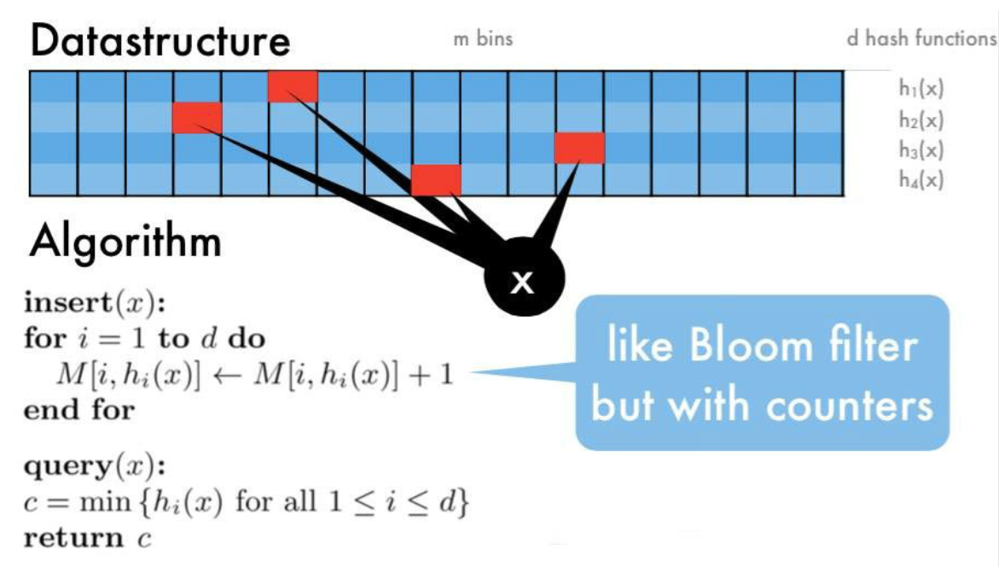

> https://soulmachine.gitbooks.io/system-design/content/cn/, https://zq99299.github.io/note-architect/hc/

#### 布隆过滤器

布隆过滤器(Bloom Filter)可以快速地解决项目中一些比较棘手的问题。如网页 URL 去重、垃圾邮件识别、大集合中重复元素的判断和缓存穿透等问题。布隆过滤器可以用于检索一个元素是否在一个集合中。它的优点是空间效率和查询时间都比一般的算法要好的多，缺点是有一定的误识别率和删除困难。

布隆过滤器就是一个0/1的数组, 初始化数组元素均为0. 当对一个字符串处理时
1. 通过K个哈希函数计算该数据，返回K个计算出的hash值
2. 这些K个hash值映射到对应的K个二进制的数组下标
3. 将K个下标对应的二进制数据改成1。

布隆过滤器主要作用就是查询一个数据，在不在这个二进制的集合中，查询过程如下：
1. 通过K个哈希函数计算该数据，对应计算出的K个hash值
2. 通过hash值找到对应的二进制的数组下标
3. 判断：如果存在一处位置的二进制数据是0，那么该数据不存在。如果都是1，该数据存在集合中。

显然由于hash碰撞, 有可能存在位置值为1而数据并不存在于二进制数组中, 因为可能是其他数据导致的这个位置值为1. 但是如果所有位置的二进制数均为0， 则可以保证该数据肯定不存在。

布隆过滤器的优点显而易见, 二进制状态压缩使占用空间很小, hash函数使得查询效率很高。缺点也显然, 存在误判且难以删除, 一旦添加了数据很难从布隆过滤器得二进制数组中删除。

缓存穿透是指查询一个根本不存在的数据，缓存层和存储层都不会命中。例如leveldb如果查询一个不存在的数据,需要从缓存跳跃表开始, 查到SST的最后一层, 是很耗时的。可以利用布隆过滤器把所有的key存放到一个二进制向量中, 判断key的存在性。结果是否则key不可能存在, 否则key有可能存在。 同样的还有redis, 先判断一下redis缓存中是否有这个key。

<!-- more -->

#### 腾讯赛马题

64匹马，8个跑道，问最少比赛多少场，可以选出跑得最快的4匹马; Assumptions：每场比赛每个跑道只允许一匹马，且不存在并列情形

1. 需8场比赛
首先把64匹马随机分为8组并标记组别，遍历组别，比赛8次，并记录每组赛马名次(eg：A1>A2>...>A7>A8), 直接剔除各组后四名赛马，剩余64-4*8=32匹赛马待定

2. 需1场比赛
选出每组排名第一的赛马进行一次比赛，记录结果，不失一般性地，记为：A1>B1>C1>D1>E1>F1>G1>H1; 根据这轮比赛结果，首先可以剔除E、F、G、H这四组所有赛马, 因为本组第一都未进入前4。

其次可以确定A1就是全场MVP，属全场N01，剩余15匹马待定.

由于A1>B1>C1>D1, 只能选四匹马。可以得到D组最多只有D1一个可能前四, D组2-4名赛马：D2>D3>D4，不可能是Top4，可剔除这3匹，剩余15-3=12匹赛马待定

C组最多两个是前四, 3-4名赛马:C3>C4，不可能是Top4，可剔除这2匹，剩余12-2=10匹赛马待定

B组最多三个前四, B4排除, 剩余9匹

3. 需1场or2场比赛

当前有九匹待定, A组四个, B组三个, C组两个, D组一个。且可以确定B1>C1>D1, A1肯定会入选。

挑选貌似最快的, 即A2>A3>A4,B1>B2>B3,C1>C2, 赛跑, 剩下D1。我们已知C1>D1

如果C1排名第三或者靠后, 直接得到三匹最快的, 外加A1, 四匹马。

如果C1排名第2, 还需要和D1赛马。B1>C1因此C1不可能是第一

总共10或11场比赛。

#### 分布式ID生成

现实中很多业务都有生成唯一ID的需求, 用户ID, 帖子ID等

这个ID往往会作为数据库主键，所以需要保证全局唯一。ID还要尽可能短，节省内存，让数据库索引效率更高。查询的时候，往往有分页或者排序的需求，所以需要给每条数据添加一个时间字段，如果能够让ID按照时间粗略有序，则可以省去这个时间字段。(分布式系统无法做到时间精确有序)

ID生成的三大核心需求, 全局唯一(unique), 按照时间粗略有序(sortable by time), 尽可能短

将ID分成若干bit区域, 例如41位表示时间戳，13位表示shard Id(一个shard Id对应一台PostgreSQL机器),最低10位表示自增ID

#### 频率估计

* hashmap
用一个HashMap记录每个元素的出现次数，每来一个元素，就把相应的计数器增1。这个方法在大数据的场景下不可行，因为元素太多，单机内存无法存下这个巨大的HashMap。

* 多机hashmap
一个很自然的改进就是使用多台机器。假设有8台机器，每台机器都有一个HashMap，第1台机器只处理hash(elem)%8==0的元素，第2台机器只处理hash(elem)%8==1的元素，以此类推。查询的时候，先计算这个元素在哪台机器上，然后去那台机器上的HashMap里取出计数器。

* Count-Min Sketch

类似布隆过滤器的思路, 选定d个hash函数，开一个长为m的二维整数数组作为哈希表

对于每个元素，分别使用d个hash函数计算相应的哈希值，并对m取余，然后在对应的位置上增1，二维数组中的每个整数称为sketch, d个hash值得到d个sketch

要查询某个元素的频率时，只需要取出d个sketch, 返回最小的那一个（其实d个sketch都是该元素的近似频率，返回任意一个都可以，该算法选择最小的那个）

显然哈希表长度越长, hash函数越多越准确

Count-Min Sketch算法对于低频的元素，结果不太准确，主要是因为hash冲突比较严重，产生了噪音, 因而可以基于消除噪音的思路进行优化



#### top-k频繁项问题

寻找数据流中出现最频繁的k个元素(find top k frequent items in a data stream)。这个问题也称为 Heavy Hitters。这题也是从实践中提炼而来的，例如搜索引擎的热搜榜，找出访问网站次数最多的前10个IP地址，等等。

用一个 HashMap<String, Long>，存放所有元素出现的次数，用一个小根堆，容量为k，存放目前出现过的最频繁的k个元素，

* HashMap + Heap

1. 每次从数据流来一个元素，如果在HashMap里已存在，则把对应的计数器增1，如果不存在，则插入，计数器初始化为1

2. 在堆里查找该元素，如果找到，把堆里的计数器也增1，并调整堆；如果没有找到，把这个元素的次数跟堆顶元素比较，如果大于堆顶元素的出现次数，则把堆顶元素替换为该元素，并调整堆

3. HashMap需要存放下所有元素，需要O(n)的空间，堆需要存放k个元素，需要O(k)的空间，跟O(n)相比可以忽略不急，总的时间复杂度是O(n)

每次来一个新元素，需要在HashMap里查找一下，需要O(1)的时间；然后要在堆里查找一下，O(k)的时间(顺序查找)，有可能需要调堆，又需要O(logk)的时间，总的时间复杂度是O(n(k+logk))，k是常量，所以可以看做是O(n)。

问题还是单机存不下

* 多机HashMap + Heap

思路还是mapreduce 

可以把数据进行分片。假设有8台机器，第1台机器只处理hash(elem)%8==0的元素，第2台机器只处理hash(elem)%8==1的元素，以此类推

把每台机器的Heap，通过网络汇总到一台机器上，将多个Heap合并成一个Heap，就可以计算出总的 top k 个元素了

* Count-Min Sketch + Heap

Count-Min的思路就是不管hash冲突, 只是一个线性数据, 同时使用多个hash函数来降低冲突存在时的值

每次来一个新元素，将相应的sketch增1，在堆中查找该元素，如果找到，把堆里的计数器也增1，并调整堆；如果没有找到，把这个元素的sketch作为钙元素的频率的近似值，跟堆顶元素比较，如果大于堆丁元素的频率，则把堆丁元素替换为该元素，并调整堆

#### 范围查询

给定一个无限的整数数据流，如何查询在某个范围内的元素出现的总次数？例如数据库常常需要SELECT count(v) WHERE v >= l AND v < u。这个经典的问题称为范围查询(Range Query)。

有一个简单方法，既然Count-Min Sketch可以计算每个元素的频率，那么我们把指定范围内所有元素的sketch加起来，不就是这个范围内元素出现的总数了吗？要注意，由于每个sketch都是近似值，多个近似值相加，误差会被放大，所以这个方法不可行。

使用多个分辨率不同的Count-Min Sketch。第1个sketch每个格子存放单个元素的频率，第2个sketch每个格子存放2个元素的频率（即0-1一块求频率, 2-3一块求频率, 做法很简答，把该元素的哈希值的最低位bit去掉，即右移一位，等价于除以2，再继续后续流程），第3个sketch每个格子存放每4个元素的频率（哈希值右移2位即可），以此类推，最后一个sketch有2个格子，每个格子存放一半元素的频率总数，即第1个格子存放最高bit为0的元素的总次数，第2个格子存放最高bit为1的元素的总次数。Sketch的个数约等于log(不同元素的总数)。

查询范围[l, u)时，从粗粒度到细粒度，找到多个区间，能够不重不漏完整覆盖区间[l, u)，将这些sketch的值加起来，就是该范围内的元素总数。举个例子，给定某个范围，如下图所示，最粗粒度的那个sketch里找不到一个格子，就往细粒度找，最后找到第1个sketch的2个格子，第2个sketch的1个格子和第3个sketch的1个格子，共4个格子

给定一个无限的数据流和一个有限集合，如何判断数据流中的元素是否在这个集合中？

在实践中，我们经常需要判断一个元素是否在一个集合中，例如垃圾邮件过滤，爬虫的网址去重，等等。这题也是一道很经典的题目，称为成员查询(Membership Query)。


### 搜索算法

#### PageRank

google提出的互联网网页排名的算法, 

#### A*算法

针对一个图, 某个节点下一步要怎么走, 基于公式。f(n)=g(n)+h(n)。A*算法在运算过程中，每次从优先队列中选取f(n)值最小的节点作为下一个待遍历的节点。

* f(n) 是节点n的综合优先级。当我们选择下一个要遍历的节点时，我们总会选取综合优先级最高（值最小）的节点。
* g(n) 是节点n距离起点的代价。
* h(n) 是节点n距离终点的预计代价，这也就是A*算法的启发函数。当h(n)=0, `A*`算法退化成Dijkstra算法。


A*算法使用两个集合来表示待遍历的节点，与已经遍历过的节点，这通常称之为open_set和close_set。
```
* 初始化open_set和close_set；
* 将起点加入open_set中，并设置优先级为0（优先级最高）；
* 如果open_set不为空，则从open_set中选取优先级最高的节点n：
    * 如果节点n为终点，则：
        * 从终点开始逐步追踪parent节点，一直达到起点；
        * 返回找到的结果路径，算法结束；
    * 如果节点n不是终点，则：
        * 将节点n从open_set中删除，并加入close_set中；
        * 遍历节点n所有的邻近节点：
            * 如果邻近节点m在close_set中，则：
                * 跳过，选取下一个邻近节点
            * 如果邻近节点m也不在open_set中，则：
                * 设置节点m的parent为节点n
                * 计算节点m的优先级
                * 将节点m加入open_set中
```

已知终点的坐标, 我们可以用欧氏距离或者曼哈顿距离来衡量到终点的代价h(n)