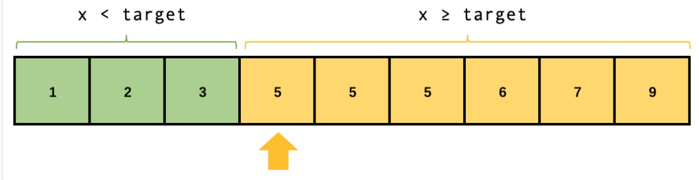

> 二分查找用到场景很广泛

### 二分查找

一般而言，当一个题目出现以下特性时，你就应该立即联想到它可能需要使用二分查找：

* 待查找的数组有序或者部分有序
* 要求时间复杂度低于O(n)，或者直接要求时间复杂度为O(log n)

#### 标准二分查找

```cpp
class BinarySearch {
    public int search(int[] nums, int target) {
        int left = 0;
        int right = nums.length - 1;
        while (left <= right) {
            int mid = left + ((right - left) >> 1);
            if (nums[mid] == target) return mid;
            else if (nums[mid] > target) {
                right = mid - 1;
            } else {
                left = mid + 1;
            }
        }
        return -1;
    }
}
```

采用`(left+right)/2`的方法计算mid, 这样mid对于长度为偶数的区间总是偏左的，所以当区间长度小于等于2时，mid 总是和 left在同一侧。

<!-- more -->

#### 第一个大于等于某个数的下标

给定一个升序排列的数组，我们将满足 x ≥ target 的第一个元素定义为「下界」, std::lower_bound()就实现了这一功能。从这个位置将数组分为左右两部分，左侧的元素都「小于」target，右侧的元素都「大于等于」target



令left为最后返回的索引, 我们得到如果`nums[mid]<target`, left=mid+1因为left应该指向nums[mid]>=target的第一个元素。对于`nums[mid]>target`, right=mid-1目的是缩小有边界。而`nums[mid]==target`, 考虑到可能有重复元素依然应该right=mid-1。

我们的目的是找到nums[mid]<target的后一个元素

```cpp
// 查找满足 x ≥ target 的下界的下标
func firstGreatOrEqual(nums []int, target int) int {
    left, right := 0, len(nums)-1
    for left <= right {
        mid := left + (right-left) >> 1
        if nums[mid] >= target { // 这里的比较运算符与题目要求一致
            right = mid - 1
        } else {
            left = mid + 1
        }
    }
    return left < nums.size() ? left : -1; // 返回下界的下标
}
```

#### 查找第一个小于等于某个数的下标

选定right作为要返回的元素, 则right应该是>target的前一个元素。当nums[mid] > target, right=mid-1; nums[mid] < target, left=mid+1, nums[mid]=target, left=mid+1(可能存在重复元素)。

和lower_bound唯一区别是处理nums[mid]==target, 目的是重复元素。显然当数组中二分查找找不到target时, left和high分别会指向`>target`和`<target`的元素。但是如果能够找到target且target不止一个, 因为要找第一个的缘故, 如果找第一个大于的就要固定左边界

```cpp

func firstSmallOrEqual(nums []int, target int) int {
    left, right := 0, len(nums)-1
    for left <= right {
        mid := left + (right-left) >> 1
        if nums[mid] <= target { // 这里的比较运算符与题目要求一致
            left = mid + 1
        } else {
            right = mid - 1
        }
    }
    return right >=0 ? right : -1; // 返回下界的下标
}
```

#### 查找第一个大于某个数的下标

需要考虑的是, 返回left, 如果nums[left]=target时, left=mid+1

```cpp

func firstGreat(nums []int, target int) int {
    left, right := 0, len(nums)-1
    for left <= right {
        mid := left + (right-left) >> 1
        if nums[mid] > target { // 这里的比较运算符与题目要求一致
            right = mid - 1
        } else {
            left = mid + 1
        }
    }
    return left < nums.size() ? left : -1; // 返回下界的下标
}

```

#### 查找第一个小于某个数的下标

需要考虑的是, 返回left, 如果nums[left]=target时, right=mid-1

```cpp
func firstGreat(nums []int, target int) int {
    left, right := 0, len(nums)-1
    for left <= right {
        mid := left + (right-left) >> 1
        if nums[mid] < target { // 这里的比较运算符与题目要求一致
            left = mid + 1
        } else {
            right = mid-1
        }
    }
     return right >=0 ? right : -1; // 返回下界的下标
}
```

* 总结

1. 无论什么情况下，二分查找的循环条件都是low<=high
2. nums[mid] > target，right=mid-1; nums[mid] < target, left=mid+1
3. 当求大于或者大于等于target时，left是最终解，求小于或者小于等于target时, right是最终解
4. 关键在于处理nums[mid]==target的情况


#### leetcode 300最长递增子序列

```
给你一个整数数组 nums ，找到其中最长严格递增子序列的长度。

子序列 是由数组派生而来的序列，删除（或不删除）数组中的元素而不改变其余元素的顺序。例如，[3,6,2,7] 是数组 [0,3,1,6,2,2,7] 的子序列。
```

使用贪心+二分法得到nlog(n)的最优解

1. 令数组dp记录最长递增子序列组成的数组,dp是递增的
2. 遍历nums, 如果当前nums[i] > dp[-1], 则将nums[i]加入dp; 反之, 则找到dp数组小于nums[i]的最大值索引t, 并令dp[t] = nums[i]。即t是dp数组中大于等于nums[i]的第一个元素 

```cpp
class Solution {
public:
    int lengthOfLIS(vector<int>& nums) {
        int n = nums.size();
        if (n == 1)
            return 1;
        vector<int> dp(n);
        dp[0] = nums[0];
        int maxlength= 0;

        for (int i = 1; i < n; i++) {
            if (dp[maxlength] < nums[i])
                dp[++maxlength] = nums[i];
            else {
                int idx = firstBigger(dp, maxlength, nums[i]);
                dp[idx+1] = nums[i];
            }
        }

        return maxlength+1;
    }

    int firstBigger(const vector<int>& nums, int right, int target) {
        int left = 0;

        while (left <= right) {
            int mid = left + (right-left)/2;
            if  (nums[mid] >= target) {
                right = mid-1;
            }else {
                left = mid+1;
            }
        }

        return right;
    } 
};
```


#### leetcode 540.有序数组中的单一元素

```

给你一个仅由整数组成的有序数组，其中每个元素都会出现两次，唯有一个数只会出现一次。

请你找出并返回只出现一次的那个数。

你设计的解决方案必须满足 O(log n) 时间复杂度和 O(1) 空间复杂度。

输入: nums = [1,1,2,3,3,4,4,8,8]
输出: 2
```

不难想到使用二分查找, 二分查找核心是, 对于target元素, 什么条件下mid在target左边, 这样我们要令start=mid+1; 而当mid在target右边时, 令end=mid-1; 关键是判断什么条件。

假设只出现一次的元素位于下标x, 可以判断下标x的左边和右边都有偶数个元素, 数组长度为奇数。

同时, 对x左边的下标y, 如果`nums[y] = nums[y+1]`, 则y为偶数(0,2,4...)
对x右边的下标z, 如果`nums[z]=nums[z+1]`, 则z为奇数(7, 9, 11)
x 是相同元素开始下标奇偶性的分界

二分查找时对于mid下标, 如果mid是偶数, 比较`nums[mid]`和`nums[mid+1]`是否相等
如果mid是奇数, 比较`nums[mid-1]`和`nums[mid]`是否相等

如果相等, 说明x在mid右边, low=mid+1
如果不等, 说明x在mid左边(x也可以等于mid), high=mid, 这个很关键, 说明这是第二种二分查找

迭代到最后剩下的数就是所求的数

```cpp
class Solution {
public:
    int singleNonDuplicate(vector<int>& nums) {
        if (nums.size() == 1)
            return nums[0];
        int start = 0;
        int end = nums.size()-1;

        while (start < end) {
            int mid = (start + end) >> 1;
            if (mid & 1) {  // 奇数
                if (nums[mid] == nums[mid-1]) {
                    start = mid+1;
                }else {
                    end = mid;
                }
            }else { // mid值为偶数
                if (nums[mid] == nums[mid+1]) {
                    start = mid+1;
                }else {
                    end = mid;
                }
            }
        }

        return nums[start];
    }
};
```

#### leetcode 33搜索旋转数组

```
整数数组 nums 按升序排列，数组中的值 互不相同 。

在传递给函数之前，nums 在预先未知的某个下标 k（0 <= k < nums.length）上进行了 旋转，使数组变为 [nums[k], nums[k+1], ..., nums[n-1], nums[0], nums[1], ..., nums[k-1]]（下标 从 0 开始 计数）。例如， [0,1,2,4,5,6,7] 在下标 3 处经旋转后可能变为 [4,5,6,7,0,1,2] 。

给你 旋转后 的数组 nums 和一个整数 target ，如果 nums 中存在这个目标值 target ，则返回它的下标，否则返回 -1 。

输入：nums = [4,5,6,7,0,1,2], target = 0
输出：4
```

对于二分首先得到mid, 可以确定如果target在mid左边那high=mid-1, 如果target在mid右边那么low=mid+1。

如何判断target在mid左边呢, 只有`nums[mid]>target`是不行的。这时候有`nums[0] < target < nums[mid]`那么target必然在Mid左边。其他情况target在mid的右边, 有可能target>nums[mid], 也可能`target<nums[mid] && target < nums[0]`。

二分查找核心是判断什么条件mid在target左边, 什么条件mid在target右边。

```cpp
class Solution {
public:
    int search(vector<int>& nums, int target) {
        int n = (int)nums.size();
        if (!n) {
            return -1;
        }
        if (n == 1) {
            return nums[0] == target ? 0 : -1;
        }
        int l = 0, r = n - 1;
        while (l <= r) {
            int mid = (l + r) / 2;
            if (nums[mid] == target) return mid;
            if (nums[0] <= nums[mid]) {
                if (nums[0] <= target && target < nums[mid]) {
                    r = mid - 1;    // target在mid左边
                } else {
                    l = mid + 1;    // target必然在mid右边
                }
            } else {
                if (nums[mid] < target && target <= nums[n - 1]) {
                    l = mid + 1;
                } else {
                    r = mid - 1;
                }
            }
        }
        return -1;
    }
};
```