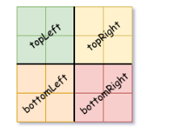
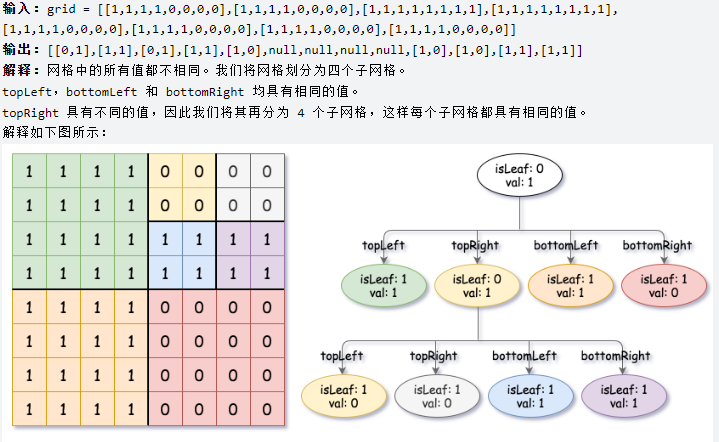
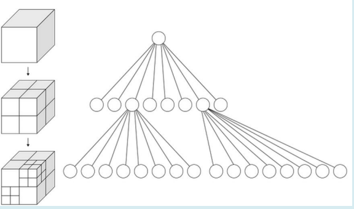
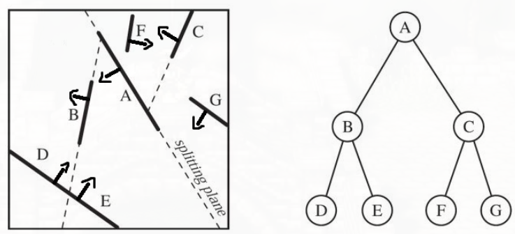
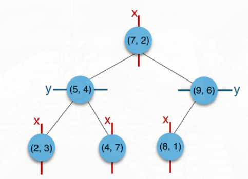
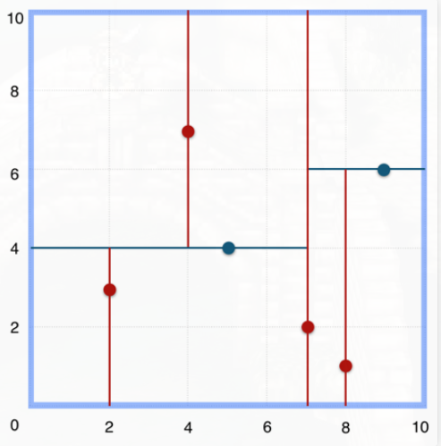

#### 建立四叉树

leetcode 427

```
给你一个 n * n 矩阵 grid ，矩阵由若干 0 和 1 组成。请你用四叉树表示该矩阵 grid 。

你需要返回能表示矩阵的 四叉树 的根结点。

四叉树数据结构中，每个内部节点只有四个子节点。此外，每个节点都有两个属性：

val：储存叶子结点所代表的区域的值。1 对应 True，0 对应 False；
isLeaf: 当这个节点是一个叶子结点时为 True，如果它有 4 个子节点则为 False 。

class Node {
    public boolean val;
    public boolean isLeaf;
    public Node topLeft;
    public Node topRight;
    public Node bottomLeft;
    public Node bottomRight;
}
```

<!-- more -->

可以按以下步骤为二维区域构建四叉树：

1. 如果当前网格的值相同（即，全为 0 或者全为 1），将 isLeaf 设为 True, 将 val 设为网格相应的值，并将四个子节点都设为 Null 然后停止。
2. 如果当前网格的值不同，将 isLeaf 设为 False， 将 val 设为任意值，然后如下图所示，将当前网格划分为四个子网格。
使用适当的子网格递归每个子节点。



* 四叉树的简要使用



维基百科的介绍, A quadtree is a tree data structure in which each internal node has exactly four children. Quadtrees are the two-dimensional analog of octrees and are most often used to partition a two-dimensional space by recursively subdividing it into four quadrants or regions. The data associated with a leaf cell varies by application, but the leaf cell represents a "unit of interesting spatial information". 四叉树是一种树结构, 每个内部节点拥有四个子孩子, 四叉树常用于二维空间的划分中, 四个子孩子分别对应四个区域。叶子单元通常代表和区域有关的信息。

应用,  四叉树是在二维图片中定位像素的唯一适合的算法, 例如在二维空间区域寻找某一物体(碰撞检测), 基于四叉树的二分查找可以避免使用遍历O(n^2)的复杂度。四叉树还可以用来在数据库中放置和定位文件（称作记录或键）。这一算法通过不停的把要查找的记录分成4部分来进行匹配查找直到仅剩下一条记录为止。最后四叉树也可用于图像压缩。

实现算法, 基本思路是对每个递归区域`[r0, r1),[c0,c1)`, 遍历之, 如果该区域所有元素为0或者1, `return new Node(grid[r0][c0], true);`

如果该区域并不全为0或1，需要对该区域拆分成四块, 分别赋予节点的topLeft, topRight, bottomLeft, bottomRight四个成份

```cpp
    return new Node(  // 返回根节点
            true,
            false,
            dfs(grid, r0, c0, (r0 + r1) / 2, (c0 + c1) / 2),
            dfs(grid, r0, (c0 + c1) / 2, (r0 + r1) / 2, c1),
            dfs(grid, (r0 + r1) / 2, c0, r1, (c0 + c1) / 2),
            dfs(grid, (r0 + r1) / 2, (c0 + c1) / 2, r1, c1)
    );
```

```cpp
// Definition for a QuadTree node.
class Node {
public:
    bool val;
    bool isLeaf;
    Node* topLeft;
    Node* topRight;
    Node* bottomLeft;
    Node* bottomRight;
    
    Node() {
        val = false;
        isLeaf = false;
        topLeft = NULL;
        topRight = NULL;
        bottomLeft = NULL;
        bottomRight = NULL;
    }
    
    Node(bool _val, bool _isLeaf) {
        val = _val;
        isLeaf = _isLeaf;
        topLeft = NULL;
        topRight = NULL;
        bottomLeft = NULL;
        bottomRight = NULL;
    }
    
    Node(bool _val, bool _isLeaf, Node* _topLeft, Node* _topRight, Node* _bottomLeft, Node* _bottomRight) {
        val = _val;
        isLeaf = _isLeaf;
        topLeft = _topLeft;
        topRight = _topRight;
        bottomLeft = _bottomLeft;
        bottomRight = _bottomRight;
    }
};

class Solution {
public:
    Node *construct(vector<vector<int>> &grid) {

        return dfs(grid, 0, 0, grid.size(), grid.size());
    }

    Node* dfs(const vector<vector<int>>& grid, int r0, int c0, int r1, int c1) {
        for (int i = r0; i < r1; ++i) {
            for (int j = c0; j < c1; ++j) {
                if (grid[i][j] != grid[r0][c0]) { // 不是叶节点
                    return new Node(
                            true,
                            false,
                            dfs(grid, r0, c0, (r0 + r1) / 2, (c0 + c1) / 2),
                            dfs(grid, r0, (c0 + c1) / 2, (r0 + r1) / 2, c1),
                            dfs(grid, (r0 + r1) / 2, c0, r1, (c0 + c1) / 2),
                            dfs(grid, (r0 + r1) / 2, (c0 + c1) / 2, r1, c1)
                    );
                }
            }
        }

        return new Node(grid[r0][c0], true);
    }
};
```


* 扩展, 八叉树

既然二维空间查找使用四叉树, 那自然的, 三维空间就使用八叉树了, 对应把一个立方体分成八块。



八叉树可用于三维数据查找, 三维碰撞检测, 光线追踪等

四叉树, 八叉树的一个局限性是数据分布可能不均, 即数据可能集中在一小块区域中, 造成树高度不平衡

* BSP树

Binary Space Partitioning Tree, 空间二分划分树, 因此BSP tree是一棵二叉树，其每个节点表示一个有向超平面形状，其代表的平面将当前空间划分为前向和背向两个子空间，分别对应左儿子和右儿子。

显然这种划分方法的优势是可以随机斜着划分, 而不必像四叉树只能二分垂直划分。因此在构建树时会比较复杂, 但是可以让划分后的区域数据分布比较均匀。2D空间下，BSP树每个节点则表示一条边，也可以将2D空间划分成前后两部分。3D空间下其每个节点表示一个平面，其代表的平面将当前空间划分为前向和背向两个子空间，分别对应左儿子和右儿子。



* k-d树 (k-dimensional tree)

k-d树就是一种特殊形式的BSP树(轴对齐的BSP树), 是一棵二叉树，其每个节点都代表一个 k维坐标点：
1. 树的每层都是对应一个划分维度（取决于你定义第i层是哪个维度）
2. 树的每个节点代表一个超平面，该超平面垂直于当前划分维度的坐标轴，并在该维度上将空间划分为两部分，一部分在其左子树，另一部分在其右子树

```cpp
//一种实现方式示例：二维k-d树节点
class KdTreeNode{
  Vector2 position;         //位置
  int dimension;            //当前所属层的维度
  KdTreeNode* children[2];  //两个子树
  //Data data;              //数据
};
```

举例, 一棵kd tree, 用来划分二维的空间


第一层划分维度为X，第二层为Y，第三层为X，


注意虽然k-d树也可以划分区域，但是k-d树的构建往往非常耗时，且不支持动态构建（即发生变化需要重新构建），因此目前游戏开发还是比较少用得上。
