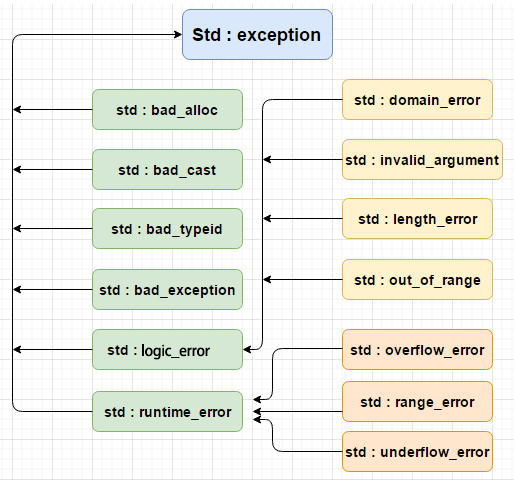

### 条款50 了解new和delete的合理替换时机

> 分配例程和归还例程(operator new和operator delete), 当operator new无法满足客户内存需求时调用的函数时new-handler

C++分配内存的new和delete实际上是调用class的`operator new`或`operator delete`操作符, 这和`operator()`, `operator[]`, `operator*`没有什么分别, class 可以通过重载`void* operator new`调整new操作的表现。

重载 operator new 需要注意以下几点：
1. 重载时，返回类型必须声明为void*
2. 重载时，第一个参数类型必须为表达要求分配空间的大小(字节)，类型为 size_t
3. 重载时，可以带其它参数

```cpp
class X{
public:
    X() { cout<<"constructor of X"<<endl; }
    ~X() { cout<<"destructor of X"<<endl;}

    void* operator new(size_t size,string str)
    {
        cout<<"operator new size "<<size<<" with string "<<str<<endl;
        return ::operator new(size);
    }
    void operator delete(void* pointee)
    {
        cout<<"operator delete"<<endl;
        ::operator delete(pointee);
    }

    int x;
private:
    int num;
};
int main(){
    X *px = new("A new class") X;   // 将调用上面的void* operator new(size_t size, string str)
    px->x = 1;
    cout << px->x<<endl;
    delete px;
    return 0;
}
```

替换默认的operator new和operator delete可能出自以下考虑
1. 检测运用的错误, 例如检测内存泄露, 在new时，将指针地址和申请内存发生的文件及行号保存在map中，在delete中利用指针地址进行擦除，最后map中保留的信息即为没有被释放的信息。
2. 强化效能, 满足分配大区块内存等要求
3. 收集内存使用上的统计数据。

<!-- more -->

```cpp
class MemoryLeakDetect{
public:
    static MemoryLeakDetect& instance(){
        static MemoryLeakDetect detect;
        return detect;
    }
    void insert(void* ptr, const char* file, int line){
        char ss[50];
        snprintf(ss,50, "%s%d", file, line);
        cout << ss<<endl;
        record[ptr] = ss;  // 放到记录中
    }
    void erase(void* ptr){
        record.erase(ptr);
    }
    void print(){
        for(auto pair : record){    // 剩余的记录为没有被free的内存
            cout<<pair.second<<" memory leakage"<<endl;
        }
    }
private:
    MemoryLeakDetect(){
    }
    map<void*, string> record;
};
void* operator new(std::size_t size, const char* file, int line) {
    cout<<"new"<<size<<endl;
    void* ptr = malloc(size);
    MemoryLeakDetect::instance().insert(ptr, file, line);
    return ptr;
}
void operator delete(void* ptr){
    free(ptr);
    MemoryLeakDetect::instance().erase(ptr);
    ptr = nullptr;
}

#define new new(__FILE__, __LINE__)

class A{
public:
    A(){
        cout<<"construct"<<endl;
    }
    ~A(){
        cout<<"destruct"<<endl;
    }
};
int main(){
    int* p1 = new int;
    A* a1 = new A;
    delete p1;
    delete a1;
    MemoryLeakDetect::instance().print();
    return 0;
}

输出
new4
mem_detect.cc63
new1
mem_detect.cc64
construct
destruct
```

此外, 一般的。
* operator new应该尝试分配内存, 如果不过无法满足内存需求, 就该调用new-handler
* operator delete应该在收到null指针时不做任何事, 反之则归还指针指向的内存。

### 条款52 写了placement new也要写placement delete

placement new 是重载operator new 的一个标准、全局的版本，它不能够被自定义的版本代替(不像普通版本的operator new和operator delete能够被替换)。和operator new相比, placement还将分配内存的地址输出。因此除了析构对象外, 还能手动清空地址保证内存不会泄露。

placement new 实现了在指定内存地址上用指定类型的构造函数来构造一个对象的功能，这块指定的地址既可以是栈，又可以是堆，placement 对此不加区分。

```cpp
// Default placement versions of operator new.
inline void* operator new(std::size_t, void* __p) _GLIBCXX_USE_NOEXCEPT
{ return __p; }
inline void* operator new[](std::size_t, void* __p) _GLIBCXX_USE_NOEXCEPT
{ return __p; }

// Default placement versions of operator delete.
inline void operator delete  (void*, void*) _GLIBCXX_USE_NOEXCEPT { }
inline void operator delete[](void*, void*) _GLIBCXX_USE_NOEXCEPT { }

//1.分配内存
char* buff = new char[ sizeof(Complex) * N ];
memset( buff, 0, sizeof(Foo)*N );
//2.构建对象
Complex* pc = new (buff)Complex;
//3.使用对象
pc->XXXXXX();
//4.析构对象，显式的调用类的析构函数
pc->~Complex();
//5.销毁内存
delete[] buff;

// 举例
char* buf = new char[sizeof(X)];
X *px = new(buf) X;
px->SetNum(10);
cout<<px->GetNum()<<endl;
px->~X();
delete []buf;
```

注意到缺省情况下C++在class作用域内会提供以下形式的operator new
```cpp
void* operator new(std::size_t) throw (std::bad_alloc); // normal new
void* operator new(std::size_t, void*) throw(); // placement new
void* operator new(std::size_t, const std::nothrow_t& ) throw;  // nothrow new
```

如果在class声明任何operator new, 就会掩盖上述标准形式, 也就是说编译期不会自动生成。因此class需要手动设置全部的new和delete(最好别这么干2333)
```cpp
class StandardNewDeleteForms {
 public:
    // normal new/delete
    static void* operator new(std::size_t size) throw(std::bad_alloc)
    {   return ::operator new(size); }
    static void* operator delete(void* pMemory) throw()
    {   return delete(pMemory); }
    // placement new/delete
    static void* operator new(std::size_t size, void* ptr) throw(std::bad_alloc)
    {   return ::operator new(size, ptr); }
    static void* operator delete(void* pMemory, ptr) throw()
    {   return delete(pMemory,ptr); }
    // nothrow new/delete
}
```

### 用智能指针处理异常导致的内存泄露

C++增加了exceptions性质后, 原始指针的使用成为一种高风险行为。资源泄露resource leaks的机会大增, 撰写符合期望的constructors和destructors的难度也大增。程序员必须考虑到程序在执行过程中突然中止的后果。

解决异常导致的内存泄露方法是通过智能指针将堆对象转为栈对象,这样即使构造失败发生异常也会被析构内存。

包括Pimpl成员

```cpp
class Image {
 public:
    Image(const string& imageDataFileName);
};

class AudioClip {
 public:
    AudioClip(const string& audioDataFileName);
};

class BookEntry {
 public:
  ...
 private:
  const auto_ptr<Image> theImage;   // 使用裸指针, 可能在构造函数分配对象时发生异常导致内存泄露。使用智能指针即使对象分配失败, auto_ptr析构时也会清除内部指向的内存。
  const auto_ptr<AudioClip> theAudio;
}

// 构造函数
BookEntry::BookEntry(const string& name, const string& address, const string& imageFileName, const sring& audioClipFileName)
    : theName(name), theAddress(address),
        theImage(imageFileName != ""? (new ImageFileName) : 0),
        theAudioClip(audioClipFileName != ""? (new audioClipFileName) : 0)
    {}
```

### try_catch捕获异常

有时候捕获异常是不可避免了, 因为进制异常流出destructor之外, 这时候智能使用`try catch`语法捕获异常了。

C++标准的异常如下


```
std::exception	该异常是所有标准 C++ 异常的父类。
std::bad_alloc	该异常可以通过 new 抛出。
std::bad_cast	该异常可以通过 dynamic_cast 抛出。
std::bad_exception	这在处理 C++ 程序中无法预期的异常时非常有用。
std::bad_typeid	该异常可以通过 typeid 抛出。
std::logic_error	理论上可以通过读取代码来检测到的异常。
std::domain_error	当使用了一个无效的数学域时，会抛出该异常。
std::invalid_argument	当使用了无效的参数时，会抛出该异常。
std::length_error	当创建了太长的 std::string 时，会抛出该异常。
std::out_of_range	该异常可以通过方法抛出，例如 std::vector 和 std::bitset<>::operator[]()。
std::runtime_error	理论上不可以通过读取代码来检测到的异常。
std::overflow_error	当发生数学上溢时，会抛出该异常。
std::range_error	当尝试存储超出范围的值时，会抛出该异常。
std::underflow_error	当发生数学下溢时，会抛出该异常。
```

以by refernce的方式捕捉exceptions, 
```cpp
void doSomething() {
    try {
        someFunction();
    }catch (exception& ex) {
        cerr << ex.what() <<endl;
    }
}
```

定义新异常
* 继承和重载 exception 类来定义新的异常。
* what() 是异常类提供的一个公共方法，它已被所有子异常类重载。这将返回异常产生的原因。
```cpp
struct MyException : public exception
{
  const char * what () const throw ()
  {
    return "C++ Exception";
  }
};
 
int main()
{
  try
  {
    throw MyException();
  }
  catch(MyException& e)
  {
    std::cout << "MyException caught" << std::endl;
    std::cout << e.what() << std::endl;
  }
  catch(std::exception& e)
  {
    //其他的错误
  }
}
```