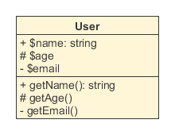
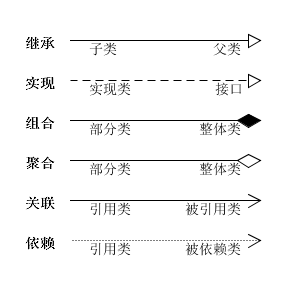
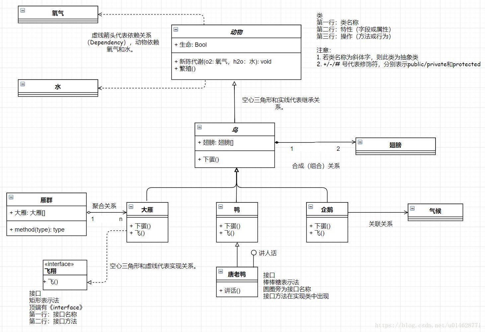
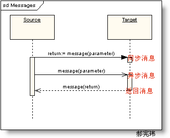
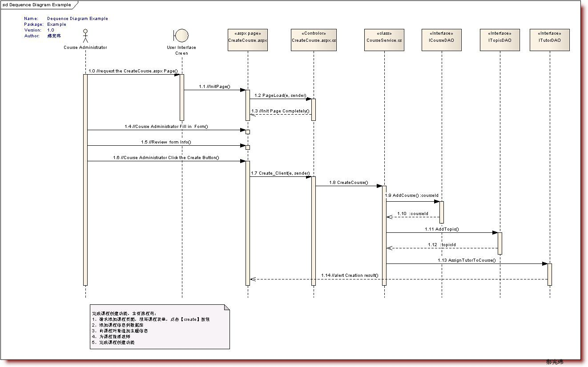

### 类图
UML类图是一种结构图，用于描述一个系统的静态结构。在系统设计阶段，类图直接引导面向对象的编程语言实现类

#### 结构
类的UML图中，使用长方形描述一个类的主要构成，长方形垂直地分为三层，以此放置类的名称、属性和方法。   
属性和方法都需要标注可见性符号，+代表public，#代表protected（friendly也归入这类），-代表private。

#### 关系
类与类之间的关系主要有六种：继承、实现、组合、聚合、关联和依赖，这六种关系的箭头表示如下

<!-- more -->

继承关系也称泛化关系（Generalization），用于描述父类与子类之间的关系。父类又称作基类，子类又称作派生类。
继承关系中，子类继承父类的所有功能，父类所具有的属性、方法，子类应该都有。子类中除了与父类一致的信息以外，还包括额外的信息。

* 实现关系（Implementation），主要用来规定接口和实现类的关系。
接口（包括抽象类）是方法的集合，在实现关系中，类实现了接口，类中的方法实现了接口声明的所有方法。

* 组合关系（Composition）：类整体与部分的关系，但是整体与部分不可以分开。contain

* 聚合关系（Aggregation）：类整体和部分的关系，整体与部分可以分开。例如公交车司机和工衣、工帽是整体与部分的关系，但是可以分开。 has-a

* 关联关系（Association）：关联关系是一种拥有的关系，它使一个类知道另一个类的属性和方法。譬如 开发工程师拥有一头乌黑的秀发

* 依赖关系（Dependence）：假设A类的变化引起了B类的变化，则说名B类依赖于A类。大多数情况下，依赖关系体现在某个类的方法使用另一个类的对象作为参数。

实线比虚线关系强
实心比空心关系强
三角最稳（泛化/实现） > 四边形（聚合/组合） > 箭头（关联/依赖）

画图网站(https://www.processon.com/)
(https://app.diagrams.net/)

### 时序图
时序图（Sequence Diagram）是显示对象之间交互的图，这些对象是按时间顺序排列的。顺序图中显示的是参与交互的对象及其对象之间消息交互的顺序。时序图中包括的建模元素主要有：对象（Actor）、生命线（Lifeline）、控制焦点（Focus of control）、消息（Message）等等。

控制焦点是顺序图中表示时间段的符号，在这个时间段内对象将执行相应的操作。用

消息一般分为同步消息(Synchronous Message)，异步消息（Asynchronous Message）和返回消息(Return Message)

