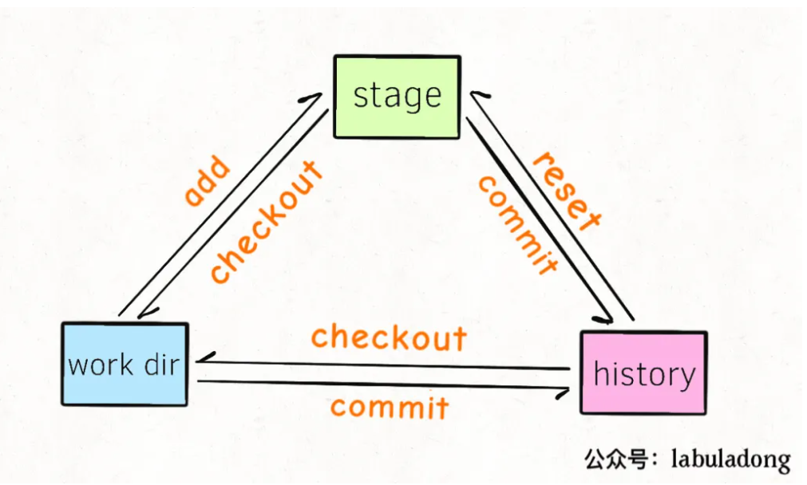
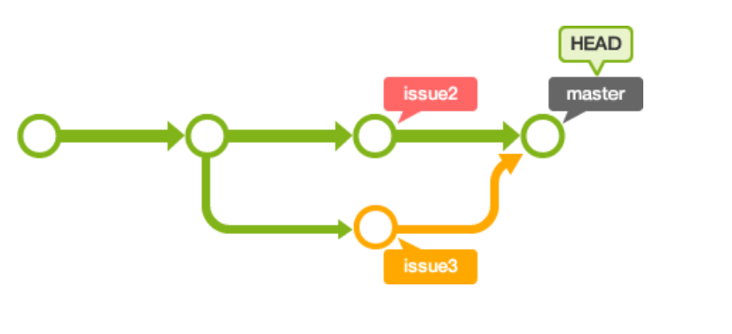

### 配置ssh

配置git 的user name和email
```
git config --global user.name "XXX"
git config --global user.email "XXX"
```

生成密钥,然后三个回车
```
ssh-keygen -t rsa -C "邮箱地址"
```

将~/.ssh/id_rsa.pub内容加入到github等仓库中

### 分区


本地 Git 的三个分区分别是：`working directory`, `stage/index area`, `commit history`

`working directory`是工作目录，也就是我们肉眼能够看到的文件

在`work dir`中执行`git add`相关命令后，就会把`work dir`中的修改添加到暂存区`stage area`（也叫`index area`）

当`stage`中存在修改时，我们使用`git commit`相关命令之后，就会把`stage`中的修改保存到提交历史commit history中，也就是`HEAD`指针指向的位置。

任何修改只要进入`commit history`，基本可以认为永远不会丢失了。每个`commit`都有一个唯一的 `Hash` 值，我们经常说的**HEAD或者master分支，都可以理解为一个指向某个commit的指针** 。

work dir和stage区域的状态，可以通过命令`git status`来查看，history区域的提交历史可以通过`git log`命令来查看。



<!-- more -->

### 移动

#### 把work dir中的修改加入stage。

使用 `git add`

#### 把stage中的修改还原到work dir中

即用stage中的文件来还原当前work dir的文件, 使用`git checkout $file`命令

```
$ touch a.txt
$ git add .
$ git status
On branch master
Changes to be committed:
    new file:   a.txt

$ git checkout a.txt
Updated 1 path from the index

```

**注意**, 在**work dir做出的「修改」会被stage覆盖，无法恢复**。所以使用该命令你应该确定work dir中的修改可以抛弃。

#### 将stage区的文件添加到history区

使用 `git commit`

会将stage区的修改加入history区并分配一个 Hash 值。只要不乱动本地的.git文件夹，进入history的修改就永远不会丢失。

#### 将history区的文件还原到stage区。

使用 `git reset` 命令, 实际是恢复到commit过去某个hash值时候的样子

```
git reset --mixed HEAD a.txt

回退指针到某个版本
git reset --hard 40a9a83  
```

这不改变work dir中的任何数据，将stage区域中的a.txt文件还原成**HEAD指向的commit history中的样子**。就相当于把**对a.txt的修改从stage区撤销，但依然保存在work dir中，变为unstage的状态**。

不会改变work dir中的数据，会改变stage区的数据，所以应确保stage中被改动数据是可以抛弃的。

#### 将work dir的修改提交到history区。

先git add然后git commit就行了，或者一个快捷方法是使用命令git commit -a。

#### 将history区的历史提交还原到work dir中。

```
$ git checkout HEAD .
Updated 12 paths from d480c4f
```

work dir和stage中所有的「修改」都会被撤销，恢复成HEAD指向的那个history commit。

这个操作会将指定文件在work dir的数据恢复成指定commit的样子，且会删除该文件在stage中的数据，都无法恢复，所以应该慎重使用。

#### 历史

git log可以显示所有提交过的版本信息

git reflog是显示所有的操作记录,  git reflog常用于恢复本地的错误操作。

### 分支和冲突

#### 分支

创建分支

```
git branch (branchname)
git checkout -b
```

切换分支

```
git checkout (branchname)
```

列出分支

```
git branch

git branch -a
```

删除分支

```git branch -d (branchname)`

合并分支,合并到当前分支
```
git merge (branchname)
```

#### 冲突

远程更新到本地

```
git fetch：这将更新git remote 中所有的远程仓库所包含分支的最新commit-id, 将其记录到.git/FETCH_HEAD文件中

git fetch origin master:temp
// 本地新建temp分支，并将远程origin master分支到temp分支中

git merge temp
// 将temp分支合并到当前分支

git pull是git fetch和git merge两个步骤的结合。

git pull origin master : master
```

合并冲突


冲突的文件在工作区修改, commit到提交区就可以了。这样master的HEAD就移动

```
$ git add myfile.txt
$ git commit -m "合并issue3分支"
# On branch master
nothing to commit (working directory clean)
```

### commit指针

git commit可以认为是一个有向无环图

HEAD指针指向commit id，HEAD所在的commit就是目前本地仓库的状态。
我们提交commit则是增加节点，同时HEAD指针后移

每个节点代表一个commit, 有固定hash表示, 因此查看历史只需要找到对应节点commit的hash进行reset即可。

commit之后不可修改, 也就是只能增加commit节点, 不能删除commit节点。


参考 https://git-scm.com/book/zh/v2


#### 子模块

clone子模块

```
git clone --recursive [address]
```

子模块初始化

```
git submodule update --init --recursive
```

git除了可以将本地代码托管到github外, 还可以使用github hooks建立一个服务器, 我们的代码照样使用`add`,`commit`,`push`, 但是代码push到了我们的服务器当中。而不再是github公有空间, 参考https://segmentfault.com/a/1190000039676421。