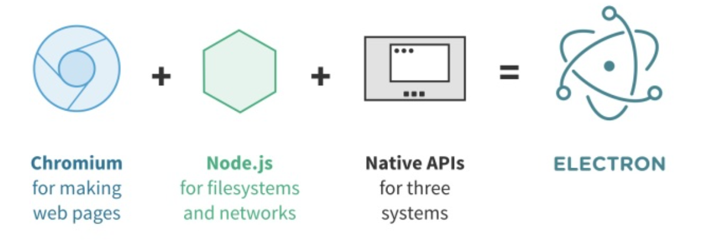
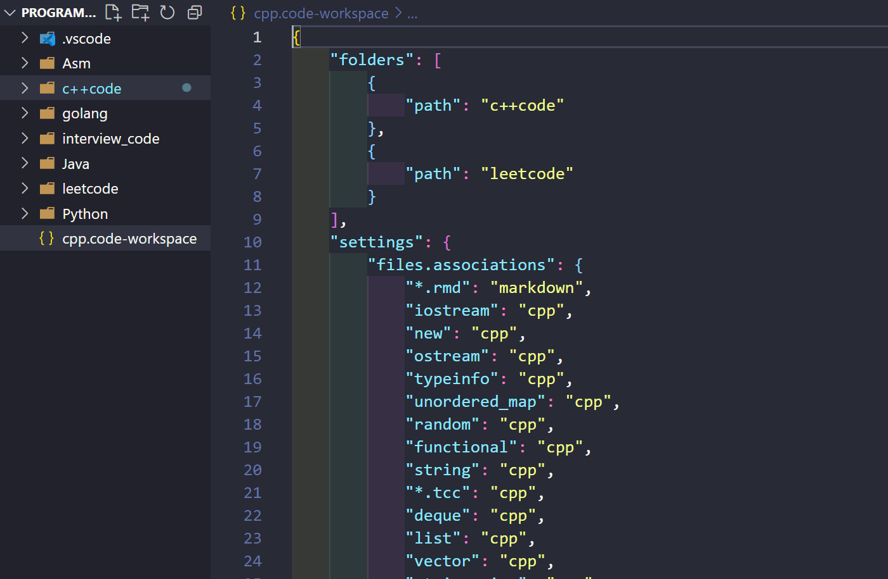
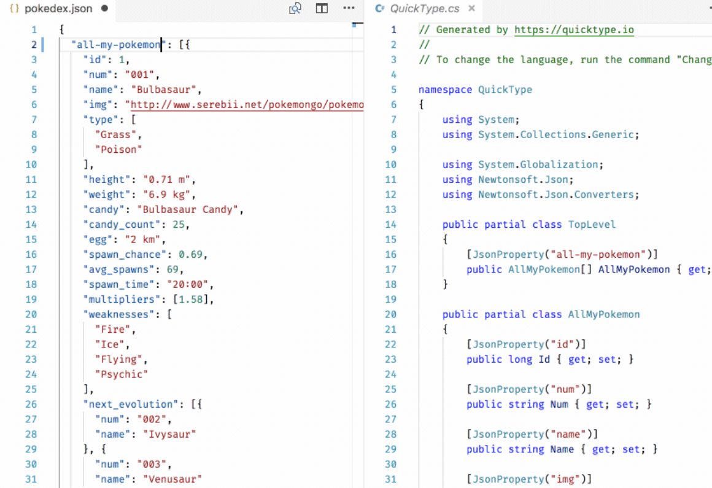
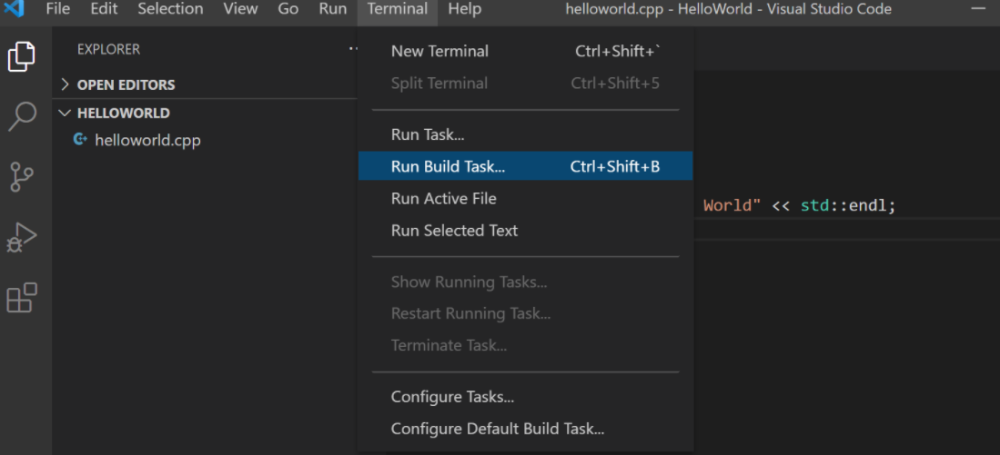
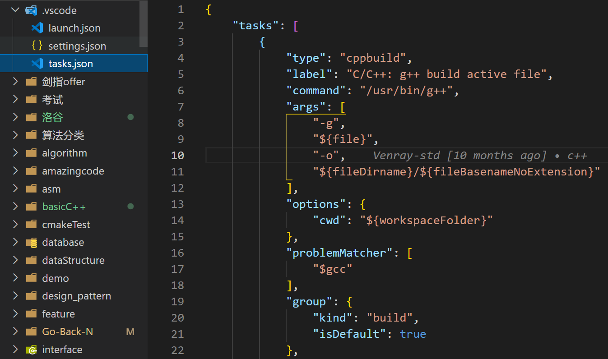
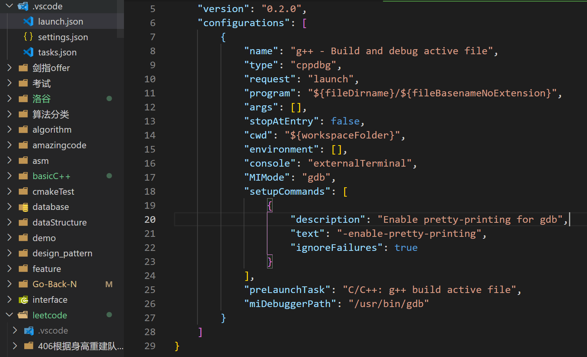
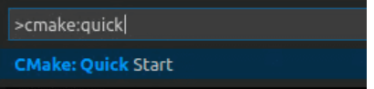
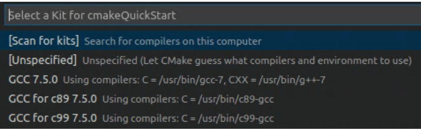
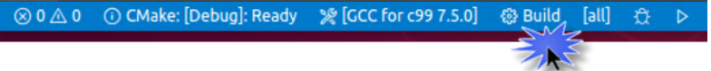
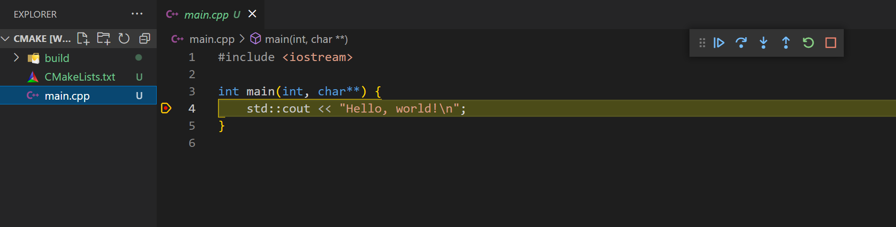

> vscode是编辑器, 这意味着我们需要把它弄透彻才可以提高生产效率


### 概念

用vscode写golang时候, 发现代码无法跳转, 准备吐槽vscode并打算用goland时, 想到了vscode是一个编辑器, 这意味着要不断配置加配置, 对使用和插件了如指掌。它不像idea那样的集成ide, 所有的东西都集成了不需要太多配置。我们甚至需要像了解liunx系统那样了解vscode。

了解vscode常用插件及配置, 并不是安了就完事了

#### 原理

vscode是用Typescript编写的brower项目, 用Electron支撑起了跨平台的桌面应用。Electron可以看成是使用Chromium的浏览器应用。


Electron简要的, 使用 Web 技术来编写 UI，用 chrome 浏览器内核来运行; 使用 NodeJS 来操作文件系统和发起网络请求; 使用 NodeJS C++ Addon 去调用操作系统的 native API

此外vscode一个比较特殊的是用了LSP(Language Server Protocol) 语言服务协议，该语言服务器提供了例如自动补全，转到定义，查找所有引用等的功能. 客户端通过json-rpc从服务器获取自动补全等服务。这个优势是保证开发工具在不同版本下功能的一致性。

vscode便可是做一个复杂的web应用, 不得不感慨前端最近5年发展的太快了, vscode算是前端跨平台应用的标杆了。但是得到Electron的优势且性能损失可控, 是大前端比较有挑战的。

#### workspace

需要理解vscode 工作区的概念, workspace层级在folder之上, 作用我觉得主要是配置文件跨文件夹有效, 

1. Configure settings that only apply to a specific folder or folders but not others. 也就是.settings.json配置在工作区内有效, 作用可以跨文件夹
2. Persist task and debugger launch configurations that are only valid in the context of that workspace. 除了setting.json, 还有task.json和launch.json

使用时, 如果我们的folder A已经配置好的setting.json文件, 如果想让folder B也能用到这个setting.json而不是新建, 我们可以将folder B加入到本工作区。即单击file->Add Folder to Workspace, 选择folder B即可。但是folderB不能是folder A的子文件夹。

如果我们想保存这个工作区, 可以单击file->Save workspace As, 保存下来的是一个json文件, 它记载了工作区所属文件的组织形式。

上图这个工作区包含c++code和leetcode 两个文件夹, 表示这俩是cpp写的, 用cpp对应的launch.json和task.json

<!-- more -->

#### Variables Reference

在vscode的json文件中可以使用Variables Reference, 类似CMakeLists.txt中的${PROJECT_BINARY_DIR}

常用的有
```
${workspaceFolder} - the path of the folder opened in VS Code, 当前打开文件夹的路线, 例如/home/your-username/your-project
${workspaceFolderBasename} - the name of the folder opened in VS Code without any slashes (/) 当前打开文件夹的名字， 例如your-project
${file} - the current opened file  当前看到的文件路径, 例如/home/your-username/your-project/folder/file.ext
${fileWorkspaceFolder} - the current opened file's workspace folder 当前打开的工作区的路径 /home/your-username/your-project
${fileBasename} - the current opened file's basename 当前打开文件的名字 file.ext
${fileBasenameNoExtension} - the current opened file's basename with no file extension 当前打开文件去掉后缀名 file
${fileDirname} - the current opened file's dirname 当前打开文件所属文件夹, 即上一级  /home/your-username/your-project/folder

${fileExtname} - the current opened file's extension 当前打开文件的后缀名 .ext

${lineNumber} - line number of the cursor 当前光标所处的行数
```

可以引用环境变量,  `${env:Name}`, 例如` ${env:gcc}`


### 全局插件

所有代码项目都会用到的插件

#### Visual Studio IntelliCode

The Visual Studio IntelliCode extension provides AI-assisted development features for Python, TypeScript/JavaScript and Java developers in Visual Studio Code, with insights based on understanding your code context combined with machine learning.

#### Paste JSON as Code

将json转为反序列化的对象代码, Supports TypeScript, Python, Go, Ruby, C#, Java, Swift, Rust, Kotlin, C++, Flow, Objective-C, JavaScript, Elm, and JSON Schema.


WOC

#### git相关

Git Graph 显示git的分支图

Git History 显示历史版本

Git History Diff

gitlen 可以跟踪代码显示的代码作者，提交搜索，历史记录和GitLens资源管理器, 很强大的工具

#### code runner

自动运行程序

```
设置执行指令
{
    "code-runner.executorMap": {
        "javascript": "node",
        "php": "C:\\php\\php.exe",
        "python": "python",
        "perl": "perl",
        "ruby": "C:\\Ruby23-x64\\bin\\ruby.exe",
        "go": "go run",
        "html": "\"C:\\Program Files (x86)\\Google\\Chrome\\Application\\chrome.exe\"",
        "java": "cd $dir && javac $fileName && java $fileNameWithoutExt",
        "c": "cd $dir && gcc $fileName -o $fileNameWithoutExt && $dir$fileNameWithoutExt"
    }
}

输出在终端
{
    "code-runner.runInTerminal": true
}
```

#### remote 远程

Remote - Containers 显示docker容器, 可以是本机也可以远程
Remote - SSH 远程ssh
Remote - WSL windows连wsl

#### 美观

vscode-fileheader, 使用ctrl+alt+i, 可以在文件头部生成注释

setting.json
```
fileheader.Author	设置用户名mikey.zhaopeng
fileheader.tpl	模板, 例如
/* * @Author: {author} * @Date: {createTime} * @Last Modified by: {lastModifiedBy} * @Last Modified time: {updateTime} */

fileheader.LastModifiedBy	By default, update file username.	mikey.zhaopeng
```


Bracket Pair Colorizer 配对括号
Indent Rainbow 彩虹缩进

Dracula Official 这个主题不错

因为美观, 不得不爱vscode

Rainbow CSV
Rainbow Brackets
Rainbow Tags


#### Settings Sync

同步配置文件, 可以用github账号登录, 保存当前vscode的配置文件, 换一个电脑可以直接下载配置


### C/C++插件

#### C/C++

这是微软官方的C/C++插件, 主要作用有

1. After you install the extension, when you open or create a *.cpp file, you will have syntax highlighting (colorization), smart completions and hovers (IntelliSense), and error checking. 具有代码高亮, 自动补全, 错误检查的功能。日常使用的定义跳转, 自动补全, 提示等都是这个插件提供的。内部应该是通过默认gcc的lib, 例如g++7是/usr/include/c++/7/bits, 找的。

2. 提供C/C++运行的功能, 使用的编译器是终端g++ -v显示的编辑器。



其执行的指令在./vscode/task.json中设置, command和args



3. 配置gdb debug, 也就是配置launch.json. The launch.json file is used to configure the debugger in Visual Studio Code.

program是需要debug的文件, args是传入的参数， cwd是current working directory

preLaunchTask是预先执行的任务, 也就是编译成可执行文件, miDebuggerPath是gdb的路径



4. setting一些自定义参数

可以使用.vscode/c_cpp_properties.json设置c++查询路径等一些参数
```cpp
C_Cpp.default.includePath                          : string[]
C_Cpp.default.defines                              : string[]
C_Cpp.default.compileCommands                      : string
C_Cpp.default.macFrameworkPath                     : string[]
C_Cpp.default.forcedInclude                        : string[]
C_Cpp.default.intelliSenseMode                     : string
C_Cpp.default.compilerPath                         : string
C_Cpp.default.cStandard                            : c89 | c99 | c11 | c17
C_Cpp.default.cppStandard                          : c++98 | c++03 | c++11 | c++14 | c++17 | c++20
C_Cpp.default.browse.path                          : string[]
C_Cpp.default.browse.databaseFilename              : string
C_Cpp.default.browse.limitSymbolsToIncludedHeaders : boolean

"configurations": [
    {
        "name": "Win32",
        "includePath": [
            "additional/paths",
            "${default}"
        ],
        "defines": [
            "${default}"
        ],
        "macFrameworkPath": [
            "${default}",
            "additional/paths"
        ],
        "forcedInclude": [
            "${default}",
            "additional/paths"
        ],
        "compileCommands": "${default}",
        "browse": {
            "limitSymbolsToIncludedHeaders": true,
            "databaseFilename": "${default}",
            "path": [
                "${default}",
                "additional/paths"
            ]
        },
        "intelliSenseMode": "${default}",
        "cStandard": "${default}",
        "cppStandard": "${default}",
        "compilerPath": "${default}"
    }
],
```

#### C/C++ Clang Command Adapter

补充了C/C++插件在Clang编译器上的不足, 主要是Clang自动补全, 定义跳转等。 效果比C/C++插件好, 因此Clang和这个插件能获得比gcc更好的体验(其实差不多)

例如
```
配置
clang.executable: Clang command or the path to the Clang executable (default: clang)
clang.cflags, clang.cxxflags, clang.objcflags: Compiler Options for C/C++/Objective-C

clang.completion.enable: Enable/disable completion feature (default: true)
clang.completion.maxBuffer: Tolerable size of clang output for completion (default: 8 * 1024 * 1024 bytes)
```

#### CMake

实现CMakeLists.txt文件的Colorization, Completion Lists, Code comments, Snippets。

可以配置path
```
{
    "cmake.cmakePath": "/path/to/cmake"
}
```

#### CMake Tools

CMake Tools provides the native developer a full-featured, convenient, and powerful workflow for CMake-based projects in Visual Studio Code.

Create a CMake project 创建CMake工程

Open the Command Palette (Ctrl+Shift+P) and run the CMake: Quick Start command:




选择编译器版本Kit

Open the Command Palette (Ctrl+Shift+P) and run CMake: Select a Kit. 


Configure, open the Command Palette (Ctrl+Shift+P) and run the CMake: Configure command to configure your project

build工程


甚至可以调试工程, To run and debug your project, open main.cpp and put a breakpoint on the std::cout line. Then open the Command Palette (Ctrl+Shift+P) and run CMake: Debug. The debugger will stop on the std::cout line:



这TM也威猛了。全程不用配置任何.json, 只需要配置好CMakeLists.txt文件就能运行，调试了

#### Doxygen Documentation Generator

用于C/C++自动生成头部, 注释等

对于`/*`注释形式可以自动生成注释, 演示最好看它提供的gif

#### 其他

Better C++ Syntax 使C++代码颜色更加合理，鲜明

vscode-proto3， 支持protobuf的proto3格式

### Go Python插件

vscode有不少方便java书写的插件, 但是java程序员适合倾向于把project下载下来直接导入到idea中然后自动运行, 不习惯vscode的各种配置。再加上我也不大写java, java的插件就不说了。js也是, 因为我也不大写前端。

于是乎就剩下了golang和python

#### Go

使用Go插件之前要安装一些工具, 也就是ctrl+shift+p输入Go: Install/Update Tools， 全选, 安装

This extension provides many features, including IntelliSense, code navigation, and code editing support. It also shows diagnostics as you work and provides enhanced support for testing and debugging your programs. 显然这个插件作用也是代码补全一些功能。

注意这个插件是go mod组织的, 如果代码不是go mod格式项目, 可能出现无法补全, 代码无法跳转的情况。

常用的配置, 在.setting.json
```
"go.autocompleteUnimportedPackages": false, 自动安装未导入的包, 我喜欢自己安2333

"go.useLanguageServer": false 从google那获取在线代码补全等服务, 因为连不上网

"go.docsTool": "gogetdoc", The gogetdoc tool aims to make it easier for editors to provide access to Go documentation. 相比于godoc
```

#### Python

Python的模块化做的很好, 以至于编辑器写Python和ide写python没有什么差别。

settings.json
```
python.defaultInterpreterPath, 解释器路径, 默认是python
```

Python Environment Manager 插件, 用来管理python的虚拟环境

Django插件, 方便Django项目, 尤其是Django-html文件格式

Python Indent插件, 保证python正确的缩进

Python Docstring Generator Python, `"""`自动注释生成


