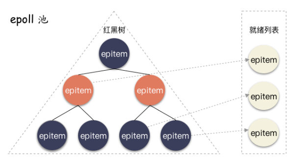
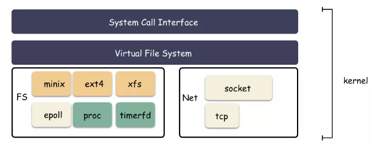

### IO多路复用

#### 五种IO模型

Unix提供了五种不同的IO模型, 阻塞式IO, 非阻塞式IO, IO复用, 信号驱动式IO, 异步IO

另有同步IO和异步IO的概念, 同步IO操作(synchronous IO)导致请求进程阻塞, 直到IO操作完成; 异步IO操作(asynchronous IO)不导致进程操作阻塞。前四种IO模型,  阻塞式IO, 非阻塞式IO, IO复用, 信号驱动式IO, 均为同步IO模型。

#### 信号驱动IO
信号驱动IO中, 当文件描述符可执行I/O操作时, 进程请求内核为自己发送一个信号。之后进程执行其他任务直到I/O就绪，此时内核发送信号给进程。

信号驱动IO提供的时边缘触发通知，意味着一旦进程被通知I/O就绪, 就应该尽可能多地执行I/O(因为是边缘触发).

#### IO复用

I/O多路复用同时检查多个文件描述符, 看它们是否准备好了执行I/O操作。 

多路是指多个业务方（句柄）并发下来的 IO 。复用是指复用这一个后台处理程序。文件描述符就绪状态的转化通过一些I/O事件来触发, 比如输入数据到达, 套接字连接建立完成等。

用少量线程处理大量的并发, 就算IO多路复用的目的。事实上, Go 里最核心的是 Goroutine ，也就是所谓的协程, 实现原理也类似。

#### 同步和阻塞

这里的同步是IO层面的，而不是多进程同步。同步和异步关注的是消息通信机制 (synchronous communication/ asynchronous communication)
所谓同步，就是在发出一个调用时，在没有得到结果之前，该调用就不返回。但是一旦调用返回，就得到返回值了。

异步则是相反，调用在发出之后，这个调用就直接返回了，所以没有返回结果。换句话说，当一个异步过程调用发出后，调用者不会立刻得到结果。而是在调用发出后，**被调用者通过状态、通知来通知调用者，或通过回调函数处理这个调用**。

同步和异步关注的层面较高, 而阻塞和非阻塞关注的是程序在等待调用结果(消息，返回值)时的状态。阻塞调用是指调用结果返回之前，当前线程会被挂起, 阻塞与系统调用 System Call 紧紧联系在一起的， 因为要让一个进程进入 等待的状态, 要么是它主动调用 wait() 或 sleep() 等挂起自己的操作。而非阻塞调用不会挂起调用程序, 而是会立即返回一个值， 表示有多少bytes 的数据被成功读取(或写入)。

注意一个非阻塞I/O 系统调用 read() 操作立即返回的是任何可以立即拿到的数据, 可以是完整的结果, 也可以是不完整的结果, 还可以是一个空值。
而异步I/O系统调用 read()结果必须是完整的, 但是这个操作完成的通知可以延迟到将来的一个时间点。

简而言之
1. 同步是用户线程发起I/O请求后需要等待或者轮询内核I/O操作完成后才能继续执行;异步是用户线程发起I/O请求后仍需要继续执行，当内核I/O操作完成后会通知用户线程，或者调用用户线程注册的回调函数

2. 阻塞是指I/O操作需要彻底完成后才能返回用户空间;非阻塞是指I/O操作被调用后立即返回一个状态值，无需等I/O操作彻底完成

#### 就绪事件

当满足以下四个条件的任何一个时, 一个socket准备好读
1. 套接字接收缓冲区中的数据字节数大于等于套接字接收缓冲区低水位标记的大小, UDP和TCP这个值默认为1, 可以用SO_REVLOWAT套接字选项设置
2. 该连接读半部关闭(接收了FIN的TCP连接), 这之后套接字的读操作将不加阻塞返回0(也就是EOF)
3. 套接字是一个监听套接字且已完成的连接数不为0, 这样的套接字的accept通常不会阻塞
4. 有一个套接字错误待处理, 这样的套接字读操作不阻塞并返回-1, 同时设置好errno

满足下面四个条件任一, 一个套接字准备好写
1. 该套接字发送缓冲区中的可用空间字节数大于等于套接字发送缓冲区低水位标记的当前大小, TCP还要要求套接字已连接。TCP和UDP套接字通常是2048
2. 该连接写半部关闭, 对这样的套接字写操作产生SIGPIPE信号
3. 使用非阻塞式connect已建立连接
4. 有一个套接字待处理, 对这样的套接字写操作不阻塞返回-1, 并设置errno

#### 文件描述符准备就绪的通知模式
水平触发level trigger通知, 如果文件描述符上可以非阻塞地执行I/O系统调用，认为已经就绪

边缘触发 edge trigger, 如果文件描述符自上次检查以来有新的IO活动(比如新的输入),则触发通知

水平触发可以认为文件描述符非阻塞执行时可多次触发, 而边缘触发只会在可非阻塞执行的开始时刻触发一次(效率高)。

对于水平触发,文件描述符处于就绪态时, 我们还可以重复检查文件描述符看看是否还处于就绪态, 一直到不处于就绪态说明文件读写完毕。而对于边缘触发, 我们只能一次尽可能多执行IO, 因为只会在开始触发一次, 直到产生另一个I/O事件为止,在此之前程序不会再收到通知了。

关于读事件，如果业务可以保证每次都可以读完，那就可以使用ET，否则使用LT。对于写事件，如果一次性可以写完那就可以使用LT，写完删除写事件就可以了；但是如果写的数据很大也不在意延迟，那么就可以使用ET，因为ET可以保证在发送缓冲区变为空时才再次通知(而LT则是发送缓冲区空之前就可以通知就绪，这样就每次触发就只能写一点点数据，内核切换开销以及内存拷贝开销过大)注意文件描述符需要设置成非阻塞模式。

#### select()系统调用

系统调用`select()`会一直阻塞, 直到一个或多个文件描述符集合成为就绪态。
```c
#include <sys/time.h>
#include <sys/select.h>

// 三种集合, 分别为fd_set* readfds, writefds, exceptfds
int select (int nfds, fd_set *readfds, fd_set *writefds, fd_set *exceptfds, struct timeval *timeout)

// returns number of ready file descriptors, 0 on timeout, or -1 on error
```

参数readfds, writefds, exceptfds分别用来检查输入是否就绪的文件描述符集合, 输出是否就绪的文件描述符集合, 异常情况是否发生的文件描述符集合。

<!-- more -->

对fd_set的操作都是通过四个宏来完成的
```c
#include <sys/select.h>

// fdset指向的集合初始化为空
void FD_ZERO(fd_set *fdset);
// 文件描述符fd添加到fdset指向的集合中
void FD_SET(int fd, fd_set *fdset);
// fd从fdset中移除
void FD_CLR(int fd, fd_set* fdset);
// fdset中是否存在fd
int FD_ISSET(int fd, fd_set* fdset);
```
文件描述符集合有最大容量限制,由FD_SETSIZE指定,默认1024。

每次使用select()对需要重新设置readfds, writefds, exceptfds

timeout参数控制select()的阻塞行为, 该参数可以指定为NULL, 此时select()会一直阻塞,直到readfds, writefds, exceptfds至少一个为就绪态, 或被信号阻断。

```c
struct timeval {
    time_t tv_sec;
    suseconds_t tv_usec;
};
```
如果结构体timeval的两个域都为0, 此时select()不会阻塞, 只是简单轮询文件描述符集合,有就绪的文件描述符旧立即返回。否则,timeout为select设置一个等待时间的上限值。

#### poll()系统调用

poll()和select()执行时很相似，区别主要在于如何指定待检查的文件描述符。select()中提供三个集合, 每个集合标明感兴趣的文件描述符; 在poll()中提供一列文件描述符结构体, 每个描述符结构体有感兴趣的事件, 事件可以认为是状态, 用状态压缩的位掩码表示。

```c
#include <poll.h>

int poll(struct pollfd fds[], nfds_t nfds, int timeout);

// returns number of ready file descriptors, 0 on timeout, or -1 on error
```
nfds为fds的元素个数, 参数fds列出需要检查的文件描述符
```c
struct pollfd {
    int fd;
    short events;
    short revents;
}
```
`events`和`revents`都是位掩码, 表示fd监听的事件类型。初始化event指定fd检查的事件(可读, 可写等), poll返回时, revents被设定表示文件描述符实际发生的事件。epoll的事件结构也是基本延续的poll。

位掩码表示的事件类型(即events, revents取值)
```
POLLIN 普通和优先级数据可读
POLLRDNORM 普通数据可读
POLLRDBAND 优先级数据可读
POLLPRI 高优先级数据可读

// 一般POLLIN | POLLPRI就可以表示所有数据可读

POLLOUT 普通数据可写
POLLWRNORM 等同于POLLOUT, 普通数据可写
POLLWRBAND 优先级数据可写

// 后面三者只能作为revents, 不能作为events
POLLERR 错误发生
POLLHUB 发生挂起
POLLNVAL 文件描述符未打开
```

poll识别三类数据: 普通(normal), 优先级带(priority band)和高优先级(high priority), POLLIN可以认为POLLRDNORM | POLLRDBAND

所有正常TCP和UDP数据认为是普通数据, 包括半连接的数据。

TCP连接存在错误可认为普通数据或者错误POLLERR, 无论哪种情况, 随后的读操作将返回-1,并设置errno。这可用来处于RST或超时等条件。

监听套接字右新的连接可用既可认为是普通数据, 也可认为是优先级数据, 大多数认为是普通数据。

非阻塞式connect的完成被认为是使响应套接字可写。
#### 比较select和poll

select()和poll()在套接字的行为表现, poll设置events字段制定了`POLLIN|POLLOUT|POLLPRI`标志位, select通过使用三种集合来发生事件的对应fd。

| socket事件 | selct() | poll()   |
|  ----  | ----  | --- |
| 有输入  | r | POLLIN |
| 可输出 | w |  POLLOUT|
| 监听套接字建立连接 | r | POLLIN |
| 关闭连接 | rw |   POLLIN\|POLLOUT\|POLLRDHUB |

可以使用宏将poll例程返回的信息转化为select()返回的与之对应的事件类型

```c
// Ready for reading
#define POLLIN_SET (POLLRDNORM | POLLRDBAND | POLLIN | POLLHUB | POLLERR)

// Ready for writing
#define POLLOUT_SET (POLLWRBAND | POLLWRNORM | POLLOUT | POLLERR

// Exceptional condition
#define POLLEX_SET(POLLPRI)
```

select对fd_set检查的文件描述符数量有上限,默认1024, poll无上限

当大量文件描述符检查且分布密集时, poll和select有相似的性能表现, 但如果分布稀疏, poll性能优于select。因为select必须遍历fd_set集合, poll可以指定检查感兴趣的文件描述符。

性能延展问题, 每次调用select或poll, 内核都必须传递一个表示所有需要被检查的fd的数据结构到内核,内核检查修改后传给程序。当文件描述符数量很大, 用户内核空间来回拷贝该数据结构占用大量cpu时间。

### epoll
epoll API既支持水平触发也支持边沿触发, 而select()和poll()只支持水平触发, 信号驱动I/O只支持边沿触发。当有大量文件描述符时，延展性比select() 和poll() 高很多。

epoll API由以下三个系统调用组成
`epoll_create()`创建一个epoll实例，也就是创建一个装fd的池子，返回代表该实例的文件描述符epfd,epfd唯一表示该epoll实例 

`epoll_ctl()`操作同epoll实例相关联的兴趣列表。通过`epoll_ctl`，可以增加新的描述符到列表中，将已有描述符移除，修改描述符上的位掩码等操作

`epoll_wait`返回就绪列表中的成员。检测到事件，将所有就绪的事件从内核事件表中复制到它的第二个参数events指向的数组中

```c
#include <sys/epoll.h>

int epoll_create(int size);
// 初始兴趣列表位空, 成功返回fd, 失败返回-1

int epoll_ctl(int epfd, int op, int fd, struct epoll_event* ev);
// 成功返回0， 不成功-1
// op 指定执行的操作
// 可以取值
// EPOLL_CTL_ADD 将fd添加到epoll实例epfd的兴趣列表
// EPOLL_CTL_MOD 修改fd设定的epoll_event
// EPOLL_CTL_DEL 将fd从epfd列表删除

// epoll_event时指向结构体epoll_event的指针
// 包含监听的事件event和epoll_data_t, epoll_data包含用户回调函数
struct epoll_event {
    uint32_t events;    // events (bit mask)
    epoll_data_t data;
};

typedef union epoll_data {
    void *ptr;  // pointer to user-defined data
    int fd; // fd
    uint32_t u32;
    uint64_t u64;
} epoll_data_t;

int epoll_wait(int epfd, struct epoll_event* evlist, int maxevents, int timeout);
// return numbers of ready file descriptors, 0 on timeout, or -1 on error
// timeout = -1会一直阻塞， 0不阻塞, >0 阻塞timeout ms、
// 返回就绪事件数量, 存储在evlist位置
```

epoll 事件 类型

| 位掩码 | 是否可作为epoll_ctl输入event | 是否可作为epoll_wait返回revent   | 描述 |
|  ----  | ----  | --- | --- |
| EPOLLIN  | 1 | 1 | 读取非高优先级数据 |
| EPOLLPRI | 1 | 1 | 读取高优先级数据|
| EPOLLRDHUB | 1 | 1 | 套接字对端关闭 |
| EPOLLOUT | 1 | 1 | 普通数据可写 |
| EPOLLET | 1 | 0 | 采用边缘触发通知 |
| EPOLLERR | 0 | 1 | 有错误发送 |

fd的读写事件都需要特定的epoll事件，也就是位掩码。

#### epoll 原理

当某一进程调用epoll_create方法时，Linux内核会创建一个eventpoll结构体。即在内核cache里建了个红黑树用于存储以后epoll_ctl传来的socket， 再建立一个rdllist双向链表，用于存储准备就绪的事件，当epoll_wait调用时，仅仅观察这个rdllist双向链表里有没有数据即可。有数据就返回，没有数据就sleep，等到timeout时间到后即使链表没数据也返回。

epoll_ctl使用的红黑树数据结构十分高效。Linux 内核对于 epoll 池的内部实现就是用红黑树的结构体来管理这些注册进程来的句柄 fd。红黑树是一种平衡二叉树，时间复杂度为 O(log n)，就算这个池子就算不断的增删改，也能保持非常稳定的查找性能。

回调的设置使epoll中的数据准备好之后可以立马感知。在 epoll_ctl 的内部实现中，除了把句柄结构用红黑树管理，另一个核心步骤就是设置 poll 回调。事实上,poll回调和`open`, `read`一样, 是linux内核支持的文件基本操作。通过 poll 机制让上层能直接告诉底层，fd 一旦读写就绪了，底层硬件（比如网卡）回调的时候应该自动把这个 fd 相关的结构体放到指定队列中，并且唤醒操作系统。实际上只是向底层函数加入了一个`函数类型`的回调函数指针, 一旦底层读写就绪, 将执行这个回调函数。


epoll会默认设置*poll将就绪的节点转移到就绪链表中。poll 函数就是把软中断回来的路上走一条捷径，只要读写事件触发的时候，就会立马通知到上层, 将这些事件节点移到就绪链表中(并未从红黑树中删除)。**poll 事件回调机制则是 epoll 高效最核心原理**。epoll只是应用的Linux内核的`poll`调用, 但如果文件所在的文件系统没有实现 poll 接口，那么就用不了 epoll 机制。
```cpp
// linux内部文件基本操作
struct file_operations {
    ssize_t (*read) (struct file *, char __user *, size_t, loff_t *);
    ssize_t (*write) (struct file *, const char __user *, size_t, loff_t *);
    __poll_t (*poll) (struct file *, struct poll_table_struct *);
    int (*open) (struct inode *, struct file *);
    int (*fsync) (struct file *, loff_t, loff_t, int datasync);
    // ....
};
```

eventpoll可以认为是epoll的控制器, 是epoll的核心数据结构
```cpp
int epoll_create(int size)；
int epoll_ctl(int epfd, int op, int fd, struct epoll_event *event)；
int epoll_wait(int epfd, struct epoll_event * events, int maxevents, int timeout);

struct epoll_event {
    __uint32_t events;
    epoll_data_t data;
};


struct eventpoll {
    spinlock_t lock;
    struct mutex mtx;

    wait_queue_head_t wq; //sys_epoll_wait（）使用的等待队列
    wait_queue_head_t poll_wait; //file->poll()使用的等待队列

    struct list_head rdllist; //所有准备就绪的文件描述符列表
    struct rb_root rbr; //用于储存已监控fd的红黑树根节点

    // 当正在向用户空间传递事件，则就绪事件会临时放到该队列，否则直接放到rdllist
    struct epitem *ovflist;
    struct wakeup_source *ws; // 当ep_scan_ready_list运行时使用wakeup_source
    struct user_struct *user; //创建eventpoll描述符的用户

    struct file *file;
    int visited;           //用于优化循环检测检查
    struct list_head visited_list_link;
};


// 在epoll中对于每一个事件都会建立一个epitem结构体
struct epitem {
    ...
　　//红黑树节点
    struct rb_node rbn;
　　//双向链表节点
    struct list_head rdllink;
　　//事件句柄等信息
    struct epoll_filefd ffd;
　　//指向其所属的eventepoll对象
    struct eventpoll *ep;
　　//期待的事件类型
    struct epoll_event event;
    ...
}; // 这里包含每一个事件对应着的信息。
```

epoll_create的实现
```cpp
SYSCALL_DEFINE1(epoll_create1, int, flags)
{
    int error, fd;
    struct eventpoll *ep = NULL;
    struct file *file;

    // 创建内部数据结构eventpoll
    error = ep_alloc(&ep);
    //查询未使用的fd
    fd = get_unused_fd_flags(O_RDWR | (flags & O_CLOEXEC));

    //创建file实例，以及匿名inode节点和dentry等数据结构
    file = anon_inode_getfile("[eventpoll]", &eventpoll_fops, ep,
                 O_RDWR | (flags & O_CLOEXEC));

    ep->file = file;
    fd_install(fd, file);  //建立fd和file的关联关系
    return fd;

out_free_fd:
    put_unused_fd(fd);
out_free_ep:
    ep_free(ep);
    return error;
}
```

添加到epoll中的事件都会与设备驱动程序建立回调关系，也就是说相应事件的发生时会调用这里的回调方法。这个回调方法在内核中叫做ep_poll_callback，回调方法会把发生的事件放到上面的rdllist双向链表中。



epoll_ctl函数的实现类似
```cpp
SYSCALL_DEFINE4(epoll_ctl, int, epfd, int, op, int, fd,
        struct epoll_event __user *, event)
{
    int error;
    int full_check = 0;
    struct fd f, tf;
    struct eventpoll *ep;    
    struct epitem *epi;       
    struct epoll_event epds;  
    struct eventpoll *tep = NULL;

    error = -EFAULT;
    //将用户空间的epoll_event 拷贝到内核
    if (ep_op_has_event(op) &&
        copy_from_user(&epds, event, sizeof(struct epoll_event)))

    f = fdget(epfd); //epfd对应的文件
    tf = fdget(fd); //fd对应的文件

    if (!tf.file->f_op->poll) //目标文件描述符必须支持poll
        goto error_tgt_fput;

    if (ep_op_has_event(op))   //检查是否允许EPOLLWAKEUP
        ep_take_care_of_epollwakeup(&epds);

    ep = f.file->private_data; // 取出epoll_create过程创建的ep

    mutex_lock_nested(&ep->mtx, 0);
    ...
    epi = ep_find(ep, tf.file, fd); //ep红黑树中查看该fd
    switch (op) {
    case EPOLL_CTL_ADD:
        if (!epi) {
            epds.events |= POLLERR | POLLHUP;
            error = ep_insert(ep, &epds, tf.file, fd, full_check); //插入到红黑树
        }
        if (full_check)
            clear_tfile_check_list();
        break;
    case EPOLL_CTL_DEL:
        if (epi)
            error = ep_remove(ep, epi); //见【小节3.3】
        break;
    case EPOLL_CTL_MOD:
        if (epi) {
            epds.events |= POLLERR | POLLHUP;
            error = ep_modify(ep, epi, &epds); //见【小节3.4】
        }
        break;
    }
    mutex_unlock(&ep->mtx);
    fdput(tf);
    fdput(f);
    ...
    return error;
}
```
调用epoll_wait检查是否有发生事件的连接时，只是检查eventpoll对象中的rdllist双向链表是否有epitem元素而已，如果rdllist链表不为空，则这里的事件复制到用户态内存。epoll_ctl在向epoll对象中添加、修改、删除事件时，从rbr红黑树中查找事件也非常快。

```cpp
SYSCALL_DEFINE4(epoll_wait, int, epfd, struct epoll_event __user *, events,
        int, maxevents, int, timeout)
{
    int error;
    struct fd f;
    struct eventpoll *ep;

    //检测参数
    if (maxevents <= 0 || maxevents > EP_MAX_EVENTS)
        return -EINVAL;

    //检查用户空间传递的内存是否可写
    if (!access_ok(VERIFY_WRITE, events, maxevents * sizeof(struct epoll_event)))
        return -EFAULT;

    f = fdget(epfd);  //获取eventpoll文件
    ep = f.file->private_data;

    error = ep_poll(ep, events, maxevents, timeout);

error_fput:
    fdput(f);
    return error;
}

static int ep_poll(struct eventpoll *ep, struct epoll_event __user *events,
           int maxevents, long timeout)
{
    int res = 0, eavail, timed_out = 0;
    unsigned long flags;
    long slack = 0;
    wait_queue_t wait;
    ktime_t expires, *to = NULL;

    if (timeout > 0) { //超时设置
        struct timespec end_time = ep_set_mstimeout(timeout);
        slack = select_estimate_accuracy(&end_time);
        to = &expires;
        *to = timespec_to_ktime(end_time);
    } else if (timeout == 0) {
        //timeout等于0为非阻塞操作，此处避免不必要的等待队列循环
        timed_out = 1;
        spin_lock_irqsave(&ep->lock, flags);
        goto check_events;
    }

fetch_events:
    spin_lock_irqsave(&ep->lock, flags);

    if (!ep_events_available(ep)) {
        //没有事件就绪则进入睡眠状态，当事件就绪后可通过ep_poll_callback()来唤醒
        //将当前进程放入wait等待队列
        init_waitqueue_entry(&wait, current);
        //将当前进程加入eventpoll等待队列，等待文件就绪、超时或中断信号
        __add_wait_queue_exclusive(&ep->wq, &wait);

        for (;;) {
            set_current_state(TASK_INTERRUPTIBLE);
            if (ep_events_available(ep) || timed_out) //就绪队列不为空 或者超时，则跳出循环
                break;
            if (signal_pending(current)) { //有待处理信号，则跳出循环
                res = -EINTR;
                break;
            }

            spin_unlock_irqrestore(&ep->lock, flags);
            //主动出让CPU，从这里开始进入睡眠状态
            if (!freezable_schedule_hrtimeout_range(to, slack,
                                HRTIMER_MODE_ABS))
                timed_out = 1;

            spin_lock_irqsave(&ep->lock, flags);
        }
        __remove_wait_queue(&ep->wq, &wait); //从队列中移除wait
        set_current_state(TASK_RUNNING);
    }
check_events:
    eavail = ep_events_available(ep);
    spin_unlock_irqrestore(&ep->lock, flags);

    //尝试传输就绪事件到用户空间，如果没有获取就绪事件，但还剩下超时，则会再次retry
    if (!res && eavail &&
        !(res = ep_send_events(ep, events, maxevents)) && !timed_out)
        goto fetch_events;

    return res;
}
```

####  哪些fd 可以用 epoll 来管理

类似 ext2，ext4，xfs 这种常规的文件系统是没有实现poll，换句话说，**最常见的、真的是文件的文件系统**反倒是用不了 epoll 机制的。

1. 最常见支持的的就是网络套接字：socket 。网络也是 epoll 池最常见的应用地点

```cpp
static const struct file_operations socket_file_ops = {
    .read_iter =    sock_read_iter,
    .write_iter =   sock_write_iter,
    .poll =     sock_poll,
    // ...
};
```
2. eventfd：eventfd 实现非常简单，故名思义就是专门用来做事件通知用的。使用系统调用 eventfd 创建，这种文件 fd 无法传输数据，只用来传输事件，常常用于生产消费者模式的事件实现；

3. timerfd：这是一种定时器 fd，使用 timerfd_create 创建，到时间点触发可读事件




#### epoll和poll, select

1. select和poll并不会明确指出是哪些文件描述符就绪，而epoll会。造成的区别就是，系统调用返回后，调用select和poll的程序需要遍历监听的整个文件描述符找到是谁处于就绪，而epoll则直接处理即可。

2. select, poll都需要将有关文件描述符的数据结构拷贝进内核(用户区创建, 系统调用需要拷贝到内核)，最后再拷贝出来。而epoll创建的有关文件描述符的数据结构本身就存于内核态中，系统调用返回时利用mmap()文件映射内存加速与内核空间的消息传递。

3. select, poll采用轮询的方式来检查文件描述符是否处于就绪态，而epoll采用回调机制。造成的结果就是，随着fd的增加，select和poll的效率会线性降低，而epoll不会受到太大影响，除非活跃的socket很多。
4. epoll的边缘触发模式处理连接效率高，系统不会充斥大量不关心的就绪文件描述符。但如果fd的数据量大线程会阻塞较长时间, 边缘促发适合连接数量大但数据量少的情况。

5. 虽然epoll的性能最好，但是在连接数少并且连接都十分活跃的情况下，select和poll的性能可能比epoll好，毕竟epoll的通知机制需要很多函数回调。
#### Epoll事件的变化, 水平触发和边沿触发

一次循环, 触发epoll的读事件


二次, 触发epoll的写事件


显然, 触发读事件时(`EPOLLIN`, 就是`0001`), 执行读取数据处理放到缓冲区。触发写事件, 将缓冲区的数据发送给客户端(`EPOLLOUT`, 就是`0100`)

额以上的原因时, 在读取完毕设置可写, 从而触发`EPOLLOUT`, 把写到缓冲区`write_buf`的数据发送回去。


可以体会到epoll的`LT`和`ET`两种模式

socket 的读事件为例，对于水平模式，只要 socket 上有未读完的数据，就会一直产生 EPOLLIN 事件；而对于边缘模式，socket 上每新来一次数据就会触发一次，如果上一次触发后，未将 socket 上的数据读完，也不会再触发，除非再新来一次数据。对于 socket 写事件，如果 socket 的 TCP 窗口一直不饱和，会一直触发 EPOLLOUT 事件；而对于边缘模式，只会触发一次，除非 TCP 窗口由不饱和变成饱和再一次变成不饱和，才会再次触发 EPOLLOUT 事件。

#### EPOLLIN和EPOLLOUT的触发条件

EPOLLIN事件产生的原因是：
1. 有新数据到达，socket可读。
2. 对方关闭了连接或只关闭了SEND_SHUTDOWN，导致我们关闭了RCV_SHUTDOWN。

EPOLLOUT产生的原因：
1. 建立TCP连接
2. 一直write，直到返回EAGAIN，然后等到write的数据发送完到一定程度后(会再次触发可写)。

#### LT模式(水平触发 Level Trigger)

EPOLLIN触发条件：
1. 处于可读状态(一直触发)。
2. 从不可读状态变为可读状态。(从没有数据到有数据就会触发)

EPOLLOUT触发条件:

1. 处于可写状态。(一直触发)
2. 从不可写状态变为可写状态。(从没空间写到有空间写就会触发EPOLLOUT)

#### ET模式

EPOLLIN触发条件：
1. 从不可读状态变为可读状态。(从没有数据到有数据就会触发)
2. 内核接收到新发来的数据。(socket又新来一次数据)

EPOLLOUT触发条件：

1. 从不可写状态变为可写状态。(从没空间写到有空间写就会触发EPOLLOUT)
2. 只要同时注册了`EPOLLIN`和`EPOLLOUT`事件，当对端发数据来的时候，如果此时是可写状态，epoll会同时触发`EPOLLIN`和`EPOLLOUT`事件。
3. 接受连接后，只要注册了`EPOLLOUT`事件，那么就会马上触发`EPOLLOUT`事件。
#### Reactor和Proactor模式

Reactor模式和Proactor模式都是是event-driven architecture（事件驱动模型）的实现方式, 当连接到来, 消息到来等会触发事件(一般就是读写事件), 通过监听事件和处理事件实现服务端的通信。读写数据一般都是非阻塞。Reactor模型一般是同步非阻塞IO, Proactor一般是异步非阻塞。

所谓的Reactor模式, 就是监听-分发的过程。单线程Reactor模式是监听连接，处理连接全部在一个线程中, 同时使用I/O多路复用监听多个套接字事件。例如redis实现的是单线程reactor模式, 但是I/O和非I/O的业务操作都在单个线程上进行处理，这可能会大大延迟I/O请求的响应。

另外常见的是多线程Reactor模式, 将Reactor拆分为两部分：mainReactor和subReactor, mainReactor负责监听server socket，用来处理网络新连接的建立，将建立的socketChannel指定注册给subReactor，通常使用一个线程作为mainReactor; subReactor维护自己的selector, 基于mainReactor 注册的socketChannel多路分离I/O读写事件，读写网络数据，通常使用多线程实现subReactor。这也就是`one thread one loop`, muduo使用的这种模式。

在Reactor模式中, 由于是同步模型, 线程需要等待数据到来, 而Proactor模式下线程不必等待数据到来。线程初始化一个异步读取操作，注册相应的事件处理器(select, poll)，此时事件处理器不关注读取就绪事件，而是关注读取完成事件，这是区别于Reactor的关键。

这时候事件分离器等待读取操作完成事件, 而用户线程可以做的别的事情。当读取事件到来时，操作系统调用内核线程完成读取操作(异步IO都是操作系统负责将数据读写到应用传递进来的缓冲区供应用程序操作)，并将读取的内容放入用户传递过来的缓存区中。

当事件分离器捕获到读取完成事件后，激活应用程序注册的事件处理器，事件处理器直接从缓存区读取数据，而不需要进行实际的读取操作。显然用户线程被触发时数据已经读取到缓冲区了, 它不需要关心数据到来和数据读取。

但是需要注意Proactor依赖操作系统对事件进行读取操作, 操作系统不是万能的, 高并发条件下可能也顶不住，况且不是操作系统提供的就好, 协程就是一个例子。从消耗系统资源来看, 两者是一样的, 只不过Proactor变成了操作系统线程等待, 因此主流还是使用Reactor模式。但是Proactor是异步模型在IO的应用, 随着协程等技术的应用, Proactor不用再依赖内核的调用而是用户态自身的调度, 将会大大发挥其作用。