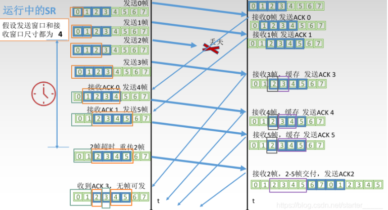
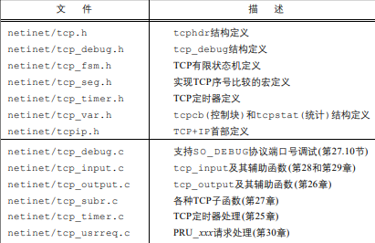
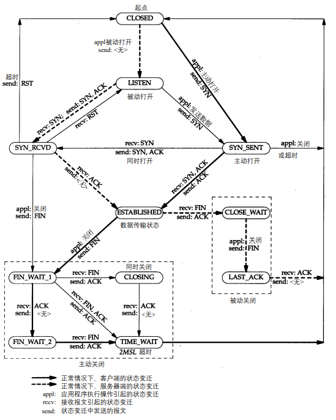
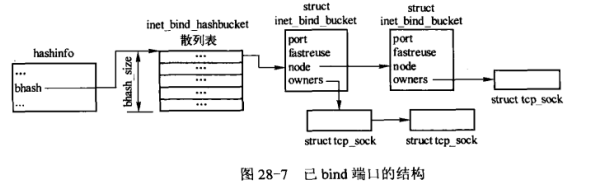
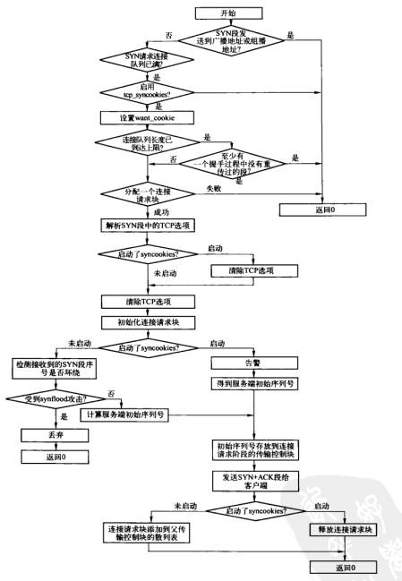
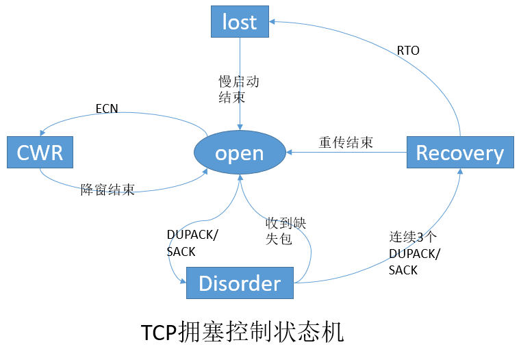
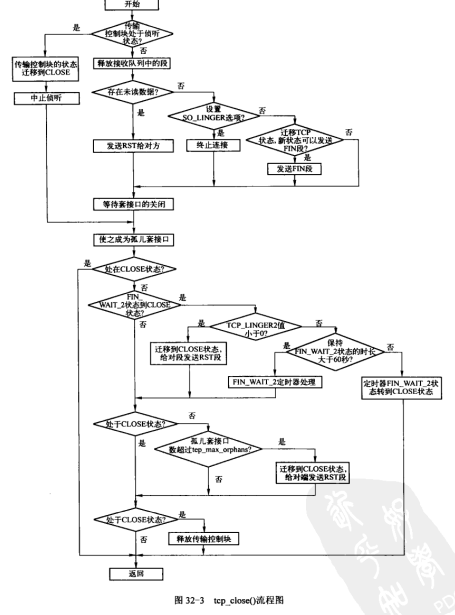
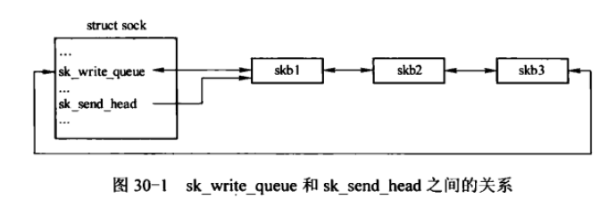
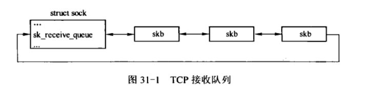

### TCP

传输控制协议, 即TCP, 是一种面向连接的传输协议, 对两端的应用程序提供可靠的端到端的数据流传输服务。它完全不同于无连接的, 提供不可靠的数据报传输服务的UDP协议。

#### 头部


注意标志位主要是有, ACK, PSH, SYN, FIN。用来标志报文的属性, 例如SYN说明报文是用来建立连接的, FIN说明报文是用来断开连接的, ACK是用来确认受到报文标志的。而32位序列化表示报文的唯一id, 32确认号表示确定收到报文, 以及说明想收到的下个报文号。

```cpp
struct tcphdr {
    __u16   source;   // 源端口
    __u16   dest;     // 目的端口
    __u32   seq;      // 序列号
    __u32   ack_seq;  // 确认号
    __u16   doff:4,   // 头部长度
            res1:4,   // 保留
            res2:2,   // 保留
            urg:1,    // 是否包含紧急数据
            ack:1,    // 是否ACK包, 表示确认标志
            psh:1,    // 是否Push包, 表示尽快送到
            rst:1,    // 是否Reset包
            syn:1,    // 是否SYN包, 连接时使用
            fin:1;    // 是否FIN包, 断开连接时使用
    __u16   window;   // 滑动窗口
    __u16   check;    // 校验和
    __u16   urg_ptr;  // 紧急指针
};
```

#### 连接


TCP 三次建立连接过程如下：

1. 客户端需要发送一个 SYN包 到服务端(包含了客户端初始化序列号)，并且将连接状态设置为 SYN_SENT。

2. 服务端接收到客户端的 SYN包 后，需要回复一个 SYN+ACK包 给客户端（包含了服务端初始化序列号），并且设置连接状态为 SYN_RCVD。

3. 客户端接收到服务端的 SYN+ACK包 后，设置连接状态为 `ESTABLISHED`（表示连接已经建立），并且回复一个 ACK包 给服务端。

4. 服务端接收到客户端的 ACK包 后，将连接状态设置为 `ESTABLISHED`（表示连接已经建立）。

```
int connect(int sockfd, const struct sockaddr *addr, socklen_t addrlen);

sockfd：由 socket() 系统调用创建的文件句柄。
addr：指定要连接的远端 IP 地址和端口。
addrlen：指定参数 addr 的长度。
```

当客户端调用 connect() 函数时，会触发内核调用 `sys_connect()` 内核函数

```
sys_connect() 内核函数主要完成 3 个步骤：

调用 sockfd_lookup() 函数获取 fd 文件句柄对应的 socket 对象。
调用 move_addr_to_kernel() 函数从用户空间复制要连接的远端 IP 地址和端口信息。
调用 inet_stream_connect() 函数完成连接操作。
```

Linux 内核通过 tcp_established_hash 哈希表来保存所有的 TCP 连接 socket 对象，而哈希表的键值就是连接的 IP 和端口，所以可以通过连接的 IP 和端口从 tcp_established_hash 哈希表中快速找到对应的 socket 连接。

#### 状态

CLOSED: 表示初始状态, 可用状态

LISTEN: 表示服务器端的某个 SOCKET 处于监听状态，可以接收连接了。

SYN_RCVD: **这个状态表示(服务端)接收到了 SYN 报文**，在正常情况下，这个状态是服务器端的SOCKET 在建立 TCP 连接时的三次握手会话过程中的一个中间状态，很短暂，基本上用 netstat 你是很难看到这种状态的，除非你特意写了一个客户端测试程序，故意将三次 TCP 握手过程中最后一个 ACK 报文不予发送。因此这种状态时，当收到客户端的 ACK 报文后，它会进入到 ESTABLISHED 状态。

SYN_SENT: 这个状态与 SYN_RCVD 相呼应，当客户端 SOCKET 执行 CONNECT 连接时，它首先发送 SYN 报文，因此也随即它会进入到了 SYN_SENT 状态，并等待服务端的发送三次握手中的第 2 个报文。**SYN_SENT 状态表示客户端已发送 SYN 报文**。

ESTABLISHED：这个容易理解了，表示连接已经建立了。

FIN_WAIT_1: FIN_WAIT_1 和 FIN_WAIT_2 状态的真正含义都是表示等待对方的 FIN 报文。而这两种状态的区别是：FIN_WAIT_1 状态实际上是当 **SOCKET 在 ESTABLISHED 状态时，它想主动关闭连接，向对方发送了 FIN 报文，此时该 SOCKET 即进入到 FIN_WAIT_1 状态。而当对方回应 ACK 报文后，则进入到 FIN_WAIT_2 状态**，当然在实际的正常情况下，无论对方何种情况下，都应该马 上回应 ACK 报文，所以 FIN_WAIT_1 状态一般是比较难见到的，而 FIN_WAIT_2 状态还有时常常可以用 netstat 看到。

<!-- more -->

FIN_WAIT_2：上面已经详细解释了这种状态，实际上 **FIN_WAIT_2 状态下的 SOCKET，表示半连接**，也即有一方要求 close 连接，但另外还告诉对方，我暂时还有点数据需要传送给你，稍后再关闭连接。

TIME_WAIT: 表示客户端收到了服务端的 FIN 报文，并发送出了 ACK 报文，就**等 2MSL 后即可回到 CLOSED 可用状态了**。如果 FIN_WAIT_1 状态下，收到了对方同时带 FIN 标志和ACK 标志的报文时，可以直接进入到 TIME_WAIT 状态，而无须经过 FIN_WAIT_2 状态。


CLOSE_WAIT: 这种状态的含义其实是表示在等待关闭。当对方 close 一个 SOCKET 后发送 FIN 报文给自己，你系统毫无疑问地会回应一个 ACK 报文给对方，此时则进入到 CLOSE_WAIT 状态。接下来呢，实际上你真正需要考虑的事情是**察看你是否还有数据发送给对方，如果没有的话，那么你也就可以 close 这个 SOCKET**，发送 FIN 报文给对方，也即关闭连接。所以你在 CLOSE_WAIT 状态下，需要完成的事情是等待你去关闭连接。

LAST_ACK: 这个状态还是比较容易好理解的，它是**被动关闭一方在发送 FIN 报文后，最后等待对方的 ACK 报文**。当收到 ACK 报文后，也即可以进入到 CLOSED 可用状态了。

#### 可靠数据传输

ARQ协议, 自动重传请求（Automatic Repeat-reQuest，ARQ）是OSI模型中数据链路层和传输层的错误纠正协议之一。它通过使用确认和超时这两个机制，在不可靠服务的基础上实现可靠的信息传输。如果发送方在发送后一段时间之内没有收到确认帧，它通常会重新发送。ARQ包括停止等待ARQ协议和连续ARQ协议。


发送方维持一个发送窗口，凡位于发送窗口内的分组可以连续发送出去，而不需要等待对方确认。接收方一般采用累计确认，对按序到达的最后一个分组发送确认，表明到这个分组为止的所有分组都已经正确收到了。

比如， 发送方发送了 5条 消息，中间第三条丢失（3号），这时接收方只能对前两个发送确认。发送方无法知道后三个分组的下落，而只好把后三个全部重传一次。这也叫 Go-Back-N（回退 N），表示需要退回来重传已经发送过的 N 个消息。

选择重传协议(SR)可以克服GBN重传N个消息的效率低下问题, 通过发送方和接收方都维护一个滑动窗口, 下面的图表示了它的运行结果。


#### 流量控制和拥塞控制

流量控制是为了控制发送方发送速率，保证接收方来得及接收。接收方发送的确认报文中的窗口字段可以用来控制发送方窗口大小，从而影响发送方的发送速率。

为了进行拥塞控制，TCP 发送方要维持一个拥塞窗口(cwnd)的状态变量。TCP的拥塞控制采用了四种算法，即慢开始、拥塞避免、快重传和快恢复。在网络层也可以使路由器采用适当的分组丢弃策略（如主动队列管理 AQM），以减少网络拥塞的发生。当然为了减少发包数量,ACK可能和PUSH等一起发送。这就是Nagle算法, 这种算法下, 主机甚至会暂时等待一段时间看是否有数据要发送给对方, 以便能随发送数据一起反馈ACK, 节省一个数据包的通信量。

#### wireshark

用wireshark抓包可以测试, 使用wireshark应该注意
当下大多数网站都是https, wireshark默认情况下不能解密https, 显示的都是密文。对于https的处理, 在http专栏里会有。

使用测试服务器在云上, 云服务器的ip地址比较多, 使用ssh可以连接的那个。


从图中可以看出, 开始tcp三次握手, 分别
1. seq = 0
2. seq = 0, ack = 1
3. seq = 1, ack = 1

此外, 当服务器发送完消息后, 会向客户端发送一个`FIN`消息

第四次连接就解析成http协议, 因此这个报文包括了http/tcp/ip等五层下信息, 因此该连接是http连接, 同时也是tcp连接。

TCP用以下标志表示状态, 标志只能取0或1
```
SYN 表示建立连接，
FIN 表示关闭连接，
ACK 表示响应，
PSH 表示有 DATA数据传输，
RST 表示连接重置。
```


连接关闭时, **主动关闭方**在收到被动关闭方的FIN包后并返回ACK后，会进入TIME_WAIT状态。具体的

1. 当客户端没有待发送的数据时，它会向服务端发送 FIN 消息，发送消息后会进入 `FIN_WAIT_1` 状态；
2. 服务端接收到客户端的 FIN 消息后，会进入 `CLOSE_WAIT` 状态并向客户端发送 ACK 消息，客户端接收到 ACK 消息时会进入 `FIN_WAIT_2` 状态；
3. 当服务端没有待发送的数据时，服务端会向客户端发送 FIN 消息；

4. 客户端接收到 FIN 消息后，会进入 `TIME_WAIT` 状态并向服务端发送 ACK 消息，服务端收到后会进入 CLOSED 状态；这时候服务器关闭
5. 客户端在TIME_WAIT状态会存在较长时间, 具体的是等待两个最大数据段生命周期(Maximum segment lifetime，MSL)*2的时间后也会进入 `CLOSED` 状态。这样可以防止新连接创建数据包和老链接数据包错乱, 相当于禁止客户端创建新连接一段时间(直到老链接数据包丢弃完毕)。

处于`Time_wait`会对客户端产生较大影响, 占用该端口连接不释放。在高并发场景下, 很多机器既是服务器又是客户端, 也会对服务器产生影响。

### TCP深入

Tcp实现代码包括7个头文件


位于tcp.h的tcphdr结构体定义了tcp的首部
```cpp
struct tcphdr {
	__be16	source; // 16位端口号
	__be16	dest;
	__be32	seq;  // 32位序列号
	__be32	ack_seq;  // 32位确认号
#if defined(__LITTLE_ENDIAN_BITFIELD)
	__u16	res1:4,
		doff:4,
		fin:1,
		syn:1,
		rst:1,
		psh:1,
		ack:1,
		urg:1,
		ece:1,
		cwr:1;
#elif defined(__BIG_ENDIAN_BITFIELD)
	__u16	doff:4,
		res1:4,
		cwr:1,
		ece:1,
		urg:1,
		ack:1,
		psh:1,
		rst:1,
		syn:1,
		fin:1;
#else
#error	"Adjust your <asm/byteorder.h> defines"
#endif	
	__be16	window; // 16位滑动窗口大小标识位
// 这个用来标识当前滑动窗口多少字节, 最大可标识2^16=65535 个字节 
	__sum16	check;  // 16位TCP检验和
	__be16	urg_ptr;  // 16位紧急数据偏移量
};
```

这里有字节序的概念，计算机电路先处理低位字节，效率比较高，因为计算都是从低位开始的。所以，计算机的内部处理都是小端字节序。在计算机内部，小端序被广泛应用于现代 CPU 内部存储数据；而在其他场景，比如网络传输和文件存储则使用大端序, 因为大端序适合人类读取。例如数字`123`, 人习惯从左往右读, 但计算从低位开始比较方便。

TCP的状态变迁图


```cpp
enum {
	TCPF_ESTABLISHED = (1 << 1),  // 连接建立
	TCPF_SYN_SENT	 = (1 << 2),  // 已发送SYN, 主动打开
	TCPF_SYN_RECV	 = (1 << 3),// 已发送并接收SYN,等待ACK
	TCPF_FIN_WAIT1	 = (1 << 4), // 已关闭,发送FIN,等待ACK和FIN
	TCPF_FIN_WAIT2	 = (1 << 5), // 已关闭,等待FIN
	TCPF_TIME_WAIT	 = (1 << 6), // 主动关闭后处于2ML等待
	TCPF_CLOSE	 = (1 << 7), // 关闭
	TCPF_CLOSE_WAIT	 = (1 << 8), // 已收到FIN,等待应用程序关闭
	TCPF_LAST_ACK	 = (1 << 9), // 收到FIN已关闭, 等待ACK
	TCPF_LISTEN	 = (1 << 10), // 监听连接请求(被动打开)
	TCPF_CLOSING	 = (1 << 11) // 同时关闭,等待ACK
};
```

TCP连接是双工的, 每一端都必须位两个方向上的数据流维护序号, TCP控制块有13个序号,8个用于数据发送序号空间, 5个用于接收数据序号空间。

#### tcp的定时器

TCP为每条连接建立了七个定时器, 分别为
1. 连接建立(connection establishment), 定时器在发送SYN报文段建立一条新连接时启动,如果75s没有响应连接建立将终止。
2. 重传(retransmission) 发送数据时设定，如果超时TCP将重传数据。该计时动态计算，取决于TCP为该连接测量的往返时间与该报文段已被重传的次数
3. 延迟ACK(delayed ACK) 对于无需马上确认的数据, TCP等待200ms后发送确认回应.如果这200ms有数据要在连接上发送，延迟ACK可以捎带确认。
4. 持续(persist), 在对方通告接收窗口为0无法发送时设定, 超时后发送一字节数据判断对方接收窗口是否打开
5. 保活 keepalive, 连接空闲2小时之后才会发送探测报文段判断是否正常。
6. FIN_WAIT_2定时器, 这里涉及socket关闭close(fd)和shutdown(fd), 前者close只是关闭本线程的连接(其他线程还可以使用该fd和该连接),关闭双向连接, shutdown(fd)直接是中断连接,但可以决定关闭单向连接。该定时器表示从FIN_WAIT_1转到FIN_WAIT_2(这意味着进程调用了close而不是shutdown, 关闭单向连接), 该定时器设置为10分钟超时，超时连接被关闭，防止对端一直不发送FIN而一直处于FIN_WAIT_2状态

7. TIME_WAIT定时器, 2MSL定时器， 默认MSL为30s, 2MSL就是一分钟。超时后TCP控制块和Internet PCB被删除, 端口号可以重新使用

TCP为每条连接维护两个RTT估计器:已平滑的RTT估计器和已平滑的RTT平均误差估计器。

* close和shutdown

如果有多个进程共享一个套接字，close每被调用一次，计数减1，直到计数为0时，也就是所用进程都调用了close，套接字将被释放。只要TCP栈的读缓冲里还有未读取（read）数据，则调用close时会直接向对端发送RST。

close 会关闭fd，而shutdown不会；因此一般shutdown之后再调用一次close(fd)

在使用了shutdown SHUT_RDWR 后，仍然需要close来关闭这个文件描述符close 在fd被多进程持有或被复制时，不会立马关闭连接；shutdown会直接关闭连接（发送FIN），而无论是否有其他打开的文件描述符指向套接字

shutdown可以设置三种参数SHUT_RD 拒绝对端发送, SHUT_WR 拒绝本端发送, SHUT_RDWR 拒绝本端发送和对端发送。因此shutdown可以提供更细粒度的控制，比如只关一边。因此一般用shutdown关闭连接, close关闭套接字。

在client端调用close() 函数后，如果server 端没有调用 close()函数，四次挥手就会无法完成。此时client端 socket 会进入 TIME_WAIT 状态，直到时间耗尽才会回收socket分配的资源，而server端在此后继续发送消息会触发 SINGLE_PIPE 信号，如果这个信号没有被 服务端进程处理的话，默认会导致服务端进程退出。

TCP连接正常关闭时, 向对端发送FIN, 并等待4次报文交换过程结束。它被丢弃时，只需发送RST。

#### TCP连接的建立

TCP连接建立从listen系统调用说起, listen系统调用不仅使TCP进入LISTEN状态, 同时还为保存SYN_RECV状态的请求连接控制块分配空间。

经过listen, socket可以接受新的连接了。当客户端发送SYN请求连接时,如果SYN合法, 会为该连接创建连接请求块。同时发送SYN+ACK作为回应。当服务端再次接收到客户端发送的ACK, 这时才会真正为连接创建一个TCP传输控制块。

accept系统调用将获得创建的TCP控制块, 并释放连接请求块。

TCP使用inet_bind_hashbucket散列表来管理已绑定端口, bind端口实例通过node成员连接在散列表中。



tcp_v4_conn_request()是服务器用来处于客户端连接请求的函数. 在服务器第一次握手接收到SYN时调用。



接下来就是服务器第二次握手, 构造并发送SYN+ACK段并构造数据报发送给客户端。这会调用tcp_v4_send_synack()。第三次握手接收客户端的ACK段。完成三次握手后，为新连接创建一个传输控制块。

#### TCP拥塞控制的实现

确认到达时, TCP发送方由一种确定发送方行为的状态机来管理。


open状态时常态, 当网络中没有发生丢包，也就不需要重传，sender按照正常的流程处理到来的ACK。当ACK到达时, 发送方根据拥塞窗口小于还是大于慢启动阈值按慢启动或拥塞避免来增大拥塞窗口。

Disorder状态, 当发送方检测到DACK(重复确认)或者SACK(选择性确认), 将转变为Disorder状态，该状态下拥塞窗口不作调整,而是没有一个新到的段会触发一个新数据段的发送, 这时包守恒原则。即一个新包只有在老的包离开网络才发送

CWR状态, TCP发送方可以从显示通知, 或者本地设备处得到拥塞通知。当接收到拥塞通知, 发送方不立刻减小拥塞窗口, 每收到两个ACK才将cwnd减一，直到减为之前的一半。该状态就叫CWR(Congestion Window Reduced，拥塞窗口减少)状态

Recover状态, 接受到三个连续重复ACK, 发送方重传第一个没有被确认的段, 拥塞窗口大小每隔一个新到的ACK减少1, 直到拥塞窗口大小等于ssthresh(即Recover开始的一半)

Loss状态, 当一个RTO超时, TCP sender进入Loss状态，所有在网络中的包被标记为lost，cwnd重置为1，通过slow start重新增加cwnd，Loss与Recovery状态的不同点在于，cwnd会重置为1，但是Recovery状态不会，它会降到之前的一半。

#### TCP连接的终止

TIME_WAIT状态也称为2MSL等待状态, TCP必须选择一个段最大生存时间MSL, 即任何段被丢弃前在网络内逗留的最长时间。在TCP连接处于2MSL等待时, 此时接到的段都会被对齐。 服务器通常执行被动关闭, 不会进入TIME_WAIT状态。这意味对于进入TIME_WAIT的客户端, 如果终止一个进程又重启这个程序, 新客户端进程不能重用相同的本地端口的。但是客户端connect端口是随机分配的, 因此客户端也不需要担心这一点。

由于TCP是双工的, 客户端处于FIN_WAIT_2状态时已经发出了FIN,且另一端也已对齐确认。当全关闭时, 对方也会向本端发一个FIN段来关闭令一端的连接, 这样两端连接都已关闭。客户端会从FIN_WAIT_2进入TIME_WAIT状态, 服务端状态先变成CLOSE_WAIT(很短),然后发送FIN变成LAST_ACK。但是如果对方并不打算关闭连接, 连接变成半关闭的, 客户端可能永远处于FIN_WAIT_2状态, 服务端也一直处于CLOSE_WAIT。但注意如果客户端调用close(fd)关闭双向连接, 会有一个FIN_WAIT_2定时器, 超时自动关闭连接防止对端迟迟不发FIN。

close(fd)用来彻底关闭tcp连接, 包括执行Time wait定时, 释放传输控制块等。内部由tcp_close()系统调用实现。注意当存在未读数据关闭套接字时, 将发送RST而不是FIN给对方, 因为FIN表示正常断开连接。


当TCP连接断开处于FIN_WAIT_2状态后, 包括TIME_WAIT状态, 此时不需要处理TCP段的数据了, 从效率和资源节省角度看, 用一个较小的TIME_WAIT控制块来替代正常的TCP传输控制块。

#### TCP的发送
TCP传输控制块中的sk_write_queue字段存储的时发送队列双向链表的链表头, 而sk_send_head成员指向发送队列下一个要发送的数据包。


TCP提供的是面向连接的, 可靠的字节流服务。一种可靠的措施是MSS, 最大段长度(Maximum Segment Size), 通过MSS, 数据被分割成TCP认为适合发送的数据块, 即segment。与此相关的是MTU最大传输单元(Maximum Transmission Unit), TCP握手时双方会告知最大传输单元时多少。

发送是位于发送队列的segment, 需要检查拥塞窗口和发送窗口。 如果拥塞窗口大小为0则说明拥塞窗口已满, 目前不能发送。检查当前segment是否玩去哪处于发送窗口内, 如果是可以发送, 否则目前不能发送。

ACK机制与数据传输也密切相关, 通过ACK可以使发送方计算数据往返时间; ACK段携带接收方的通告窗口, 因此接收方能接收的数据为通告窗口大小, 接收到ACK后正常情况下会引发下一个segment的发送; 从接收ACK可以判断评估当前网络情况, 从而调整拥塞窗口。

TCP发送方将段发送出去后会跟踪它们, 直到得到接收方的确认为止。这也是tcping等一些工具执行的原理。

#### TCP的接收

sock结构中的sk_receive_queue成员就是TCP的接收队列, 通常情况下, 接收的TCP段都缓存在这里, 等待用户进程主动读取。


当IP层接收到报文, 或由多个分片组装成一个完整的IP数据报之后, 会调用对应的传输层接收函数tcp_v2_rcv()传递给传输层处理。

接受到预期的段, 可以缓存到接收队列或者直接复制到用户空间; 如果不是预期接收的段, 则必定是乱序的段。乱序的段如果在接收窗口之内可暂时缓存, 如果在接收窗口之外, 则丢弃。