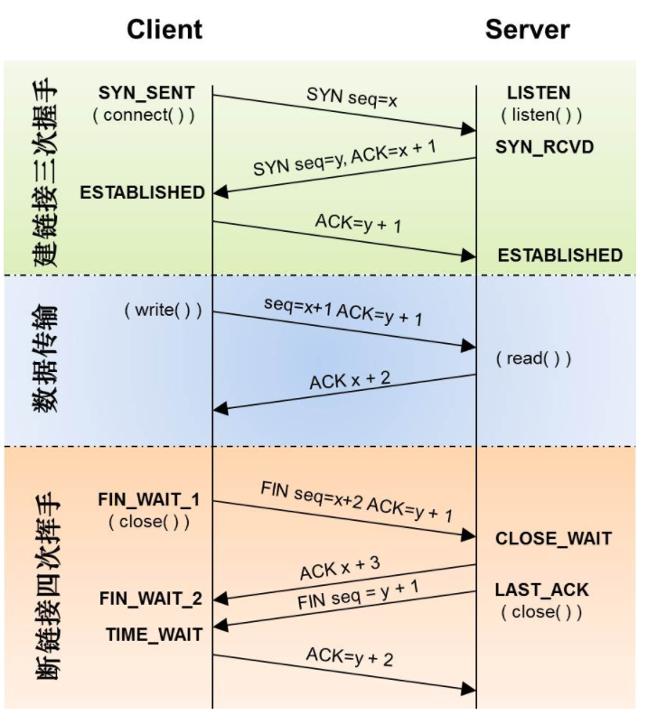
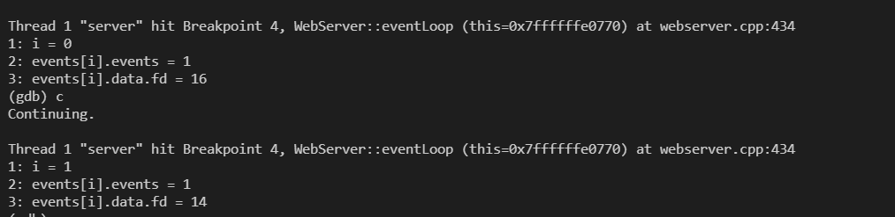
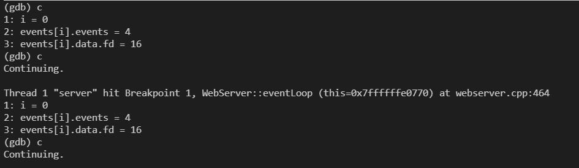
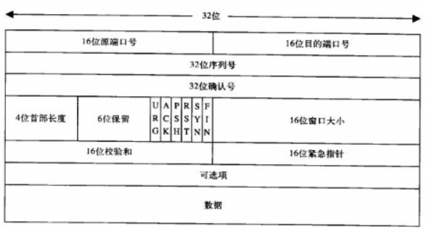
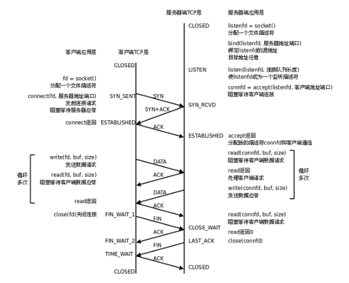

> http协议也许是使用最广泛的应用层协议

### HTTP报文
#### 请求报文

一个HTTP请求报文由请求行(request line)、请求头部(header)、空行和请求数据4个部分组成


get请求举例

```
GET /favicon.ico HTTP/1.1\r\nHost: 172.20.109.213:9006\r\nConnection: keep-alive\r\nPragma: no-cache\r\nCache-Control: no-cache\r\nUser-Agent: Mozilla/5.0 (Windows NT 10.0; Win64; x64) AppleWebKit/537.36 (KHTML, like Gecko) Chrome/93.0.4577.82 Safari/537.36\r\nAccept: image/avif,image/webp,image/apng,image/svg+xml,image/*,*/*;q=0.8\r\nReferer: http://172.20.109.213:9006/5\r\nAccept-Encoding: gzip, deflate\r\nAccept-Language: en,zh-CN;q=0.9,zh;q=0.8,bs;q=0.7,zh-TW;q=0.6\r\n\r\n
```

post请求举例
```
"POST /3CGISQL.cgi HTTP/1.1\r\nHost: 172.20.109.213:9006\r\nConnection: keep-alive\r\nContent-Length: 21\r\nCache-Control: max-age=0\r\nUpgrade-Insecure-Requests: 1\r\nOrigin: http://172.20.109.213:9006\r\nContent-Type: application/x-www-form-urlencoded\r\nUser-Agent: Mozilla/5.0 (Windows NT 10.0; Win64; x64) AppleWebKit/537.36 (KHTML, like Gecko) Chrome/93.0.4577.82 Safari/537.36\r\nAccept: text/html,application/xhtml+xml,application/xml;q=0.9,image/avif,image/webp,image/apng,*/*;q=0.8,application/signed-exchange;v=b3;q=0.9\r\nReferer: http://172.20.109.213:9006/0\r\nAccept-Encoding: gzip, deflate\r\nAccept-Language: en,zh-CN;q=0.6\r\n\r\nuser=test&password=go"
```
解析http协议的过程就是一个解析字符串的过程, 具体的

1. 请求数据和请求头部的区分边界在`\r\n\r\n`
2. 第一个`\r\n`前面的是请求行; 中间的是请求头部, 请求头部每一行都是`字段名:值`的形式
3. POST方法将请求参数封装在HTTP请求数据中，以名称/值的形式出现，可以传输大量数据，这样POST方式对传送的数据大小没有限制，而且也不会显示在URL中。
4. **请求数据不在GET方法中使用，而是在POST方法中使用**。Get方法的请求body是空的, POST方法适用于需要客户填写表单的场合。与请求数据相关的最常使用的请求头是Content-Type和Content-Length。

#### 响应报文

HTTP响应也由三个部分组成，分别是：状态行、消息报头、响应正文。

状态行格式如下：
```
HTTP-Version Status-Code Reason-Phrase CRLF
```
其中，HTTP-Version表示服务器HTTP协议的版本；Status-Code表示服务器发回的响应状态代码；Reason-Phrase表示状态代码的文本描述。状态代码由三位数字组成，第一个数字定义了响应的类别，且有五种可能取值。

* 1xx：指示信息--表示请求已接收，继续处理。
* 2xx：成功--表示请求已被成功接收、理解、接受。
* 3xx：重定向--要完成请求必须进行更进一步的操作。
* 4xx：客户端错误--请求有语法错误或请求无法实现。
* 5xx：服务器端错误--服务器未能实现合法的请求。

常见状态代码、状态描述的说明如下。
```
200 OK：客户端请求成功。
400 Bad Request：客户端请求有语法错误，不能被服务器所理解。
401 Unauthorized：请求未经授权，这个状态代码必须和WWW-Authenticate报头域一起使用。
403 Forbidden：服务器收到请求，但是拒绝提供服务。
404 Not Found：请求资源不存在，举个例子：输入了错误的URL。
500 Internal Server Error：服务器发生不可预期的错误。
503 Server Unavailable：服务器当前不能处理客户端的请求，一段时间后可能恢复正常
```

<!-- more -->
### 进一步理解

#### TCP和HTTP的keep alive

TCP的KeepAlive机制意图在于检测连接错误(默认两小时)。一方会不定期发送心跳包给另一方，当一方断掉的时候，没有断掉的定时发送几次心跳包，如果间隔发送几次，对方都返回的是RST，而不是ACK，那么就释放当前链接。

HTTP的keep-alive意图在于短时间内连接复用，希望可以短时间内在同一个连接上进行多次请求/响应。普通的http连接是客户端连接上服务端，然后结束请求后，由客户端或者服务端进行http连接的关闭。减少新建和断开TCP连接的消耗。

TCP的keepalive是在ESTABLISH状态的时候，双方如何检测连接的可用行。而http的keep-alive说的是如何避免进行重复的TCP三次握手和四次挥手的环节。

#### wireshark

用wireshark抓包可以测试, 使用wireshark应该注意
当下大多数网站都是https, wireshark默认情况下不能解密https, 因此不会显示

使用测试服务器在云上, 云服务器的ip地址比较多, 使用ssh可以连接的那个。


从图中可以看出, 开始tcp三次握手, 分别
1. seq = 0
2. seq = 0, ack = 1
3. seq = 1, ack = 1

此外, 当服务器发送完消息后, 会向客户端发送一个`FIN`消息

第四次连接就解析成http协议, 因此这个报文包括了http/tcp/ip等五层下信息, 因此该连接是http连接, 同时也是tcp连接。

TCP用以下标志表示状态, 标志只能取0或1
```
SYN 表示建立连接，
FIN 表示关闭连接，
ACK 表示响应，
PSH 表示有 DATA数据传输，
RST 表示连接重置。
```


连接关闭时, **主动关闭方**在收到被动关闭方的FIN包后并返回ACK后，会进入TIME_WAIT状态。具体的

1. 当客户端没有待发送的数据时，它会向服务端发送 FIN 消息，发送消息后会进入 `FIN_WAIT_1` 状态；
2. 服务端接收到客户端的 FIN 消息后，会进入 `CLOSE_WAIT` 状态并向客户端发送 ACK 消息，客户端接收到 ACK 消息时会进入 `FIN_WAIT_2` 状态；
3. 当服务端没有待发送的数据时，服务端会向客户端发送 FIN 消息；

4. 客户端接收到 FIN 消息后，会进入 `TIME_WAIT` 状态并向服务端发送 ACK 消息，服务端收到后会进入 CLOSED 状态；这时候服务器关闭
5. 客户端在TIME_WAIT状态会存在较长时间, 具体的是等待两个最大数据段生命周期(Maximum segment lifetime，MSL)*2的时间后也会进入 `CLOSED` 状态。这样可以防止新连接创建数据包和老链接数据包错乱, 相当于禁止客户端创建新连接一段时间(直到老链接数据包丢弃完毕)。

处于`Time_wait`会对客户端产生较大影响, 占用该端口连接不释放。在高并发场景下, 很多机器既是服务器又是客户端, 也会对服务器产生影响。

### Epoll触发
#### Epoll事件的变化, 水平触发和边沿触发

一次循环, 触发epoll的读事件


二次, 触发epoll的写事件


显然, 触发读事件时(`EPOLLIN`, 就是`0001`), 执行读取数据处理放到缓冲区。触发写事件, 将缓冲区的数据发送给客户端(`EPOLLOUT`, 就是`0100`)

额以上的原因时, 在读取完毕设置可写, 从而触发`EPOLLOUT`, 把写到缓冲区`write_buf`的数据发送回去。


可以体会到epoll的`LT`和`ET`两种模式

socket 的读事件为例，对于水平模式，只要 socket 上有未读完的数据，就会一直产生 EPOLLIN 事件；而对于边缘模式，socket 上每新来一次数据就会触发一次，如果上一次触发后，未将 socket 上的数据读完，也不会再触发，除非再新来一次数据。对于 socket 写事件，如果 socket 的 TCP 窗口一直不饱和，会一直触发 EPOLLOUT 事件；而对于边缘模式，只会触发一次，除非 TCP 窗口由不饱和变成饱和再一次变成不饱和，才会再次触发 EPOLLOUT 事件。

#### EPOLLIN和EPOLLOUT的触发条件

EPOLLIN事件产生的原因是：
1. 有新数据到达，socket可读。
2. 对方关闭了连接或只关闭了SEND_SHUTDOWN，导致我们关闭了RCV_SHUTDOWN。

EPOLLOUT产生的原因：
1. 建立TCP连接
2. 一直write，直到返回EAGAIN，然后等到write的数据发送完到一定程度后(会再次触发可写)。

#### LT模式(水平触发 Level Trigger)

EPOLLIN触发条件：
1. 处于可读状态(一直触发)。
2. 从不可读状态变为可读状态。(从没有数据到有数据就会触发)

EPOLLOUT触发条件:

1. 处于可写状态。(一直触发)
2. 从不可写状态变为可写状态。(从没空间写到有空间写就会触发EPOLLOUT)

#### ET模式

EPOLLIN触发条件：
1. 从不可读状态变为可读状态。(从没有数据到有数据就会触发)
2. 内核接收到新发来的数据。(socket又新来一次数据)

EPOLLOUT触发条件：

1. 从不可写状态变为可写状态。(从没空间写到有空间写就会触发EPOLLOUT)
2. 只要同时注册了`EPOLLIN`和`EPOLLOUT`事件，当对端发数据来的时候，如果此时是可写状态，epoll会同时触发`EPOLLIN`和`EPOLLOUT`事件。
3. 接受连接后，只要注册了`EPOLLOUT`事件，那么就会马上触发`EPOLLOUT`事件。

#### 同步和阻塞

这里的同步是IO层面的，而不是多进程同步。同步和异步关注的是消息通信机制 (synchronous communication/ asynchronous communication)
所谓同步，就是在发出一个调用时，在没有得到结果之前，该调用就不返回。但是一旦调用返回，就得到返回值了。

异步则是相反，调用在发出之后，这个调用就直接返回了，所以没有返回结果。换句话说，当一个异步过程调用发出后，调用者不会立刻得到结果。而是在调用发出后，**被调用者通过状态、通知来通知调用者，或通过回调函数处理这个调用**。

同步和异步关注的层面较高, 而阻塞和非阻塞关注的是程序在等待调用结果(消息，返回值)时的状态。阻塞调用是指调用结果返回之前，当前线程会被挂起, 阻塞与系统调用 System Call 紧紧联系在一起的， 因为要让一个进程进入 等待的状态, 要么是它主动调用 wait() 或 sleep() 等挂起自己的操作。而非阻塞调用不会挂起调用程序, 而是会立即返回一个值， 表示有多少bytes 的数据被成功读取(或写入)。

注意一个非阻塞I/O 系统调用 read() 操作立即返回的是任何可以立即拿到的数据, 可以是完整的结果, 也可以是不完整的结果, 还可以是一个空值。
而异步I/O系统调用 read()结果必须是完整的, 但是这个操作完成的通知可以延迟到将来的一个时间点。

简而言之
1. 同步是用户线程发起I/O请求后需要等待或者轮询内核I/O操作完成后才能继续执行;异步是用户线程发起I/O请求后仍需要继续执行，当内核I/O操作完成后会通知用户线程，或者调用用户线程注册的回调函数

2. 阻塞是指I/O操作需要彻底完成后才能返回用户空间;非阻塞是指I/O操作被调用后立即返回一个状态值，无需等I/O操作彻底完成

#### IO多路复用

IO多路复用是常用的IO模型, 它是同步非阻塞, 事件驱动的IO模型。

epoll 这个系统调用，是同步的，也就是必须等待操作系统返回值。而底层用了 epoll 的封装后的框架，可以是异步的，只要你暴露给外部的接口，无需等待你的返回值即可。

epoll 这个系统调用的底层内核设计里，每个 IO 事件的通知等待，是异步的。但这不影响，epoll 这个系统调用对外部来说，是一个同步的接口。

IO多路复用同步非阻塞对应的是同步阻塞, 它用一个线程监听多个文件描述符, 同步阻塞的方法往往是开多个线程每个监听一个连接。原因在于同步下数据没有执行完线程不能离开, 但可以让这个线程监听多个socket, 哪里有数据就读一些(不必全读完), 因为使用了非阻塞可以实现复用。

1. 在阻塞方式下，若设备不可读写，则该进程休眠，释放CPU资源；若设备文件可读写，则对设备文件进行读写。在非阻塞方式(socket文件描述符有 O_NONBLOCK标志)下，若设备不可读写，进程放弃读写，继续向下执行；若设备文件可读写，则对设备文件进行读写。非阻塞需要结合IO多路复用多次触发可读写, 当然也会定时轮询判断能不能写。
2. read 没有一点数据可读或 write 没有一点空间可以写入，如果`disable O_NONBLOCK` 则会阻塞，如果enable O_NONBLOCK 则会返回-1，`errno = EAGAIN | EWOULDBLOCK` 错误。

#### Reactor模式

Reactor模式和Proactor模式都是是event-driven architecture（事件驱动模型）的实现方式, 当连接到来, 消息到来等会触发事件(一般就是读写事件), 通过监听事件和处理事件实现服务端的通信。读写数据一般都是非阻塞。Reactor模型一般是同步非阻塞IO, Proactor一般是异步非阻塞。

所谓的Reactor模式, 就是监听-分发的过程。单线程Reactor模式是监听连接，处理连接全部在一个线程中, 同时使用I/O多路复用监听多个套接字事件。例如redis实现的是单线程reactor模式, 但是I/O和非I/O的业务操作都在单个线程上进行处理，这可能会大大延迟I/O请求的响应。

另外常见的是多线程Reactor模式, 将Reactor拆分为两部分：mainReactor和subReactor, mainReactor负责监听server socket，用来处理网络新连接的建立，将建立的socketChannel指定注册给subReactor，通常使用一个线程作为mainReactor; subReactor维护自己的selector, 基于mainReactor 注册的socketChannel多路分离I/O读写事件，读写网络数据，通常使用多线程实现subReactor。这也就是`one thread one loop`, muduo使用的这种模式。

在Reactor模式中, 由于是同步模型, 线程需要等待数据到来, 而Proactor模式下线程不必等待数据到来。线程初始化一个异步读取操作，注册相应的事件处理器(select, poll)，此时事件处理器不关注读取就绪事件，而是关注读取完成事件，这是区别于Reactor的关键。

这时候事件分离器等待读取操作完成事件, 而用户线程可以做的别的事情。当读取事件到来时，操作系统调用内核线程完成读取操作(异步IO都是操作系统负责将数据读写到应用传递进来的缓冲区供应用程序操作)，并将读取的内容放入用户传递过来的缓存区中。

当事件分离器捕获到读取完成事件后，激活应用程序注册的事件处理器，事件处理器直接从缓存区读取数据，而不需要进行实际的读取操作。显然用户线程被触发时数据已经读取到缓冲区了, 它不需要关心数据到来和数据读取。

但是需要注意Proactor依赖操作系统对事件进行读取操作, 操作系统不是万能的, 高并发条件下可能也顶不住，况且不是操作系统提供的就好, 协程就是一个例子。从消耗系统资源来看, 两者是一样的, 只不过Proactor变成了操作系统线程等待, 因此主流还是使用Reactor模式。

### TCP

#### 头部



```cpp
struct tcphdr {
    __u16   source;   // 源端口
    __u16   dest;     // 目的端口
    __u32   seq;      // 序列号
    __u32   ack_seq;  // 确认号
    __u16   doff:4,   // 头部长度
            res1:4,   // 保留
            res2:2,   // 保留
            urg:1,    // 是否包含紧急数据
            ack:1,    // 是否ACK包, 表示确认标志
            psh:1,    // 是否Push包, 表示尽快送到
            rst:1,    // 是否Reset包
            syn:1,    // 是否SYN包, 连接时使用
            fin:1;    // 是否FIN包, 断开连接时使用
    __u16   window;   // 滑动窗口
    __u16   check;    // 校验和
    __u16   urg_ptr;  // 紧急指针
};
```

#### 连接



TCP 建立连接过程如下：

1. 客户端需要发送一个 SYN包 到服务端（包含了客户端初始化序列号），并且将连接状态设置为 SYN_SENT。
2. 服务端接收到客户端的 SYN包 后，需要回复一个 SYN+ACK包 给客户端（包含了服务端初始化序列号），并且设置连接状态为 SYN_RCVD。
3. 客户端接收到服务端的 SYN+ACK包 后，设置连接状态为 `ESTABLISHED`（表示连接已经建立），并且回复一个 ACK包 给服务端。
4. 服务端接收到客户端的 ACK包 后，将连接状态设置为 `ESTABLISHED`（表示连接已经建立）。

```
int connect(int sockfd, const struct sockaddr *addr, socklen_t addrlen);

sockfd：由 socket() 系统调用创建的文件句柄。
addr：指定要连接的远端 IP 地址和端口。
addrlen：指定参数 addr 的长度。
```

当客户端调用 connect() 函数时，会触发内核调用 `sys_connect()` 内核函数

```
sys_connect() 内核函数主要完成 3 个步骤：

调用 sockfd_lookup() 函数获取 fd 文件句柄对应的 socket 对象。
调用 move_addr_to_kernel() 函数从用户空间复制要连接的远端 IP 地址和端口信息。
调用 inet_stream_connect() 函数完成连接操作。
```

Linux 内核通过 tcp_established_hash 哈希表来保存所有的 TCP 连接 socket 对象，而哈希表的键值就是连接的 IP 和端口，所以可以通过连接的 IP 和端口从 tcp_established_hash 哈希表中快速找到对应的 socket 连接。


#### 状态

CLOSED: 表示初始状态, 可用状态

LISTEN: 表示服务器端的某个 SOCKET 处于监听状态，可以接收连接了。

SYN_RCVD: **这个状态表示(服务端)接收到了 SYN 报文**，在正常情况下，这个状态是服务器端的SOCKET 在建立 TCP 连接时的三次握手会话过程中的一个中间状态，很短暂，基本上用 netstat 你是很难看到这种状态的，除非你特意写了一个客户端测试程序，故意将三次 TCP 握手过程中最后一个 ACK 报文不予发送。因此这种状态时，当收到客户端的 ACK 报文后，它会进入到 ESTABLISHED 状态。

SYN_SENT: 这个状态与 SYN_RCVD 相呼应，当客户端 SOCKET 执行 CONNECT 连接时，它首先发送 SYN 报文，因此也随即它会进入到了 SYN_SENT 状态，并等待服务端的发送三次握手中的第 2 个报文。**SYN_SENT 状态表示客户端已发送 SYN 报文**。

ESTABLISHED：这个容易理解了，表示连接已经建立了。

FIN_WAIT_1: FIN_WAIT_1 和 FIN_WAIT_2 状态的真正含义都是表示等待对方的 FIN 报文。而这两种状态的区别是：FIN_WAIT_1 状态实际上是当 **SOCKET 在 ESTABLISHED 状态时，它想主动关闭连接，向对方发送了 FIN 报文，此时该 SOCKET 即进入到 FIN_WAIT_1 状态。而当对方回应 ACK 报文后，则进入到 FIN_WAIT_2 状态**，当然在实际的正常情况下，无论对方何种情况下，都应该马 上回应 ACK 报文，所以 FIN_WAIT_1 状态一般是比较难见到的，而 FIN_WAIT_2 状态还有时常常可以用 netstat 看到。

FIN_WAIT_2：上面已经详细解释了这种状态，实际上 **FIN_WAIT_2 状态下的 SOCKET，表示半连接**，也即有一方要求 close 连接，但另外还告诉对方，我暂时还有点数据需要传送给你，稍后再关闭连接。

TIME_WAIT: 表示客户端收到了服务端的 FIN 报文，并发送出了 ACK 报文，就**等 2MSL 后即可回到 CLOSED 可用状态了**。如果 FIN_WAIT_1 状态下，收到了对方同时带 FIN 标志和ACK 标志的报文时，可以直接进入到 TIME_WAIT 状态，而无须经过 FIN_WAIT_2 状态。


CLOSE_WAIT: 这种状态的含义其实是表示在等待关闭。当对方 close 一个 SOCKET 后发送 FIN 报文给自己，你系统毫无疑问地会回应一个 ACK 报文给对方，此时则进入到 CLOSE_WAIT 状态。接下来呢，实际上你真正需要考虑的事情是**察看你是否还有数据发送给对方，如果没有的话，那么你也就可以 close 这个 SOCKET**，发送 FIN 报文给对方，也即关闭连接。所以你在 CLOSE_WAIT 状态下，需要完成的事情是等待你去关闭连接。

LAST_ACK: 这个状态还是比较容易好理解的，它是**被动关闭一方在发送 FIN 报文后，最后等待对方的 ACK 报文**。当收到 ACK 报文后，也即可以进入到 CLOSED 可用状态了。
