### linux内核和进程

#### 进程

调度器在进程之间切换时, 必须知道系统每个进程的状态。其中处于运行状态的进程正在运行, 处于等待状态的进程调度器可以在下一个任务切换时选择该进程, 处于睡眠状态的进程调度器无法选择。但如果一个进程等待外来的数据, 调度器职责是一旦数据到达就将进程的状态由等待改为可运行。

除用户进程之外, Unix系统害包括几个内核线程(kernel thread)的特权进程, 也成为守护线程。它们有以下特点
1. 它们以内核态运行在内核地址空间
2. 它们不与用户直接交互, 也不需要中断设备
3. 它们通常在系统启动时创建, 然后一直处于活跃状态直到系统关闭

两种守护线程1. 启动后一直等待知道内核请求线程执行某操作 2. 线程启动后周期性间隔运行，检测特定资源使用并采取行动

有几种方式激活内核例程
1. 进程调用系统调用
2. 正在执行进程的CPU发出一个异常(exception)信号, 异常是一些反常情况, 例如一个无效的指令。内核代替产生异常的进程处理异常。
3. 外围设备向CPU发出一个中断(interrupt)信号以通知一个事件的发生, 如一个要求注意的请求, 一个状态的变化, 一个I/O操作的完成等。每个中断信号都是由内核中的中断处理程序(interrupt handler)来处理的, 中断在不可预知的时间发生。
4. 内核线程被执行, 因为内核线程运行在内核态。

内核为了管理进程, 每个进程由一个进程描述符(process descriptor)表示, 这个描述符包含有关进程当前状态的信息。当内核暂停一个进程的执行时, 就把几个相关处理器寄存器的内容保存在进程描述符中。这些寄存器包括
1. 程序计数器PC和栈指针SP寄存器
2. 通用寄存器
3. 浮点寄存器
4. 包含CPU状态信息的处理器控制寄存器
5. 用来跟踪进程对RAM访问的内存管理寄存器

当内核恢复一个进程时, 它用进程描述符中合适的字段来装载CPU寄存器, 因为程序计数器中所存的值指向下一条将要执行的指令, 所以进程从它上次执行停止的地方恢复执行。

当一个进程不在CPU上执行时, 它正在等待某一事件。Unix内核可以区分很多等待状态, 这些等待状态通常由进程描述符队列实现, 每个队列对应一组等待特定事件的进程。

#### 可重入的控制路径
最简单情况下, CPU从第一条指令到最后一条指令顺序地执行内核控制路径。然而, 当下述事件之一发生时, CPU交错执行内核控制路径。
1. 运行在用户态地进程调用一个系统调用, 响应地内核控制路径证实这个请求无法立即得到满足; 这样第一个内核路径没完成, 调度程序选择一个新的进程路径执行
2. 运行一个内核控制路径是, CPU检测到一个异常(例如访问不在RAM的页), 第一个控制路径被挂起, CPU执行其他合适的进程。
3. CPU运行一个中断的控制路径时, 又一个硬件中断完成, CPU区执行新的中断路径。
4. 在支持抢占调度的内核中, CPU正在运行, 而一个更高优先级的进程加入就绪队列, 则中断发生。这种情况下第一个内核控制路径还没有执行完, CPU又去执行高优先级的进程控制路径。

可见切换内核控制路径的原因是异常或者中断, 对应的是异常处理程序和中断处理程序。几个内核控制路径(每个都与不同的进程相关)可以轮流执行, 说明内核是可重入的。

一般的, 每个内核控制路径都引用进程自己的私有内核栈, 但有时进程也共享部分地址空间。

#### 同步和临界区

以上, 可重入使进程执行路径可能没有执行完就被挂起, 这时候其他的内核控制路径不应该对共享数据结构操作, 否则产生竞争问题。

非抢占性内核表示进程在内核态执行时, 不能被任意挂起, 也不能被另一个进程代替。当然内核态的进程可以自愿放弃CPU, 但是它必须确保所有的数据结构都处于一致性状态。在非抢占式内核下内核访问是安全的，但是非抢占性在多处理器系统上是抵消的。

广泛使用的一种机制是信号量(semaphore), 心好累仅仅是与数据结构相关的计数器, 所有内核线程试图访问这个数据结构之前都要检查这个信号量。信号量可以认为由一个整数变量, 一个等待进程的链表, 以及两个原子方法down()和up()组成。每个要保护的数据结构都有它的信号量, 初始值为1, 当试图访问这个数据结构时, down()方法把信号量减1, 如果信号量当前值不是负数则允许访问这个数据结构，否则加入到信号量链表阻塞等待; 当进程执行完共享变量的访问调用up()将信号量加1。

如果某些数据结构访问频繁且短暂, 信号量可能比较低效, 因为它要检查信号量并插入到链表中挂起, 此时内核控制路径可能释放了信号量。此外如果信号量较多, 可能因为循环等待而陷入死锁。Linux通过通过规定的顺序请求信号量来避免思索。

操作系统还可以使用自旋锁(spin lock), 当一个进程发现锁被另一个进程锁着, 它会不停的执行一个紧凑的循环指令自旋, 直到锁打开。

#### 信号和共享内存

Unix信号(signal)提供了把系统事件报告给进程的一种机制, 每种事件都有自己的信号编号, 通常用符号常量表示, 例如SIGTERM。有两种系统事件
1. 异步通告。例如用户按下中断键(CRTRL-C), 即向前台进程发出中断信号SIGINT
2. 同步错误或异常, 例如进程访问内存非法地址时, 内核向这个进程发送SIGSEGV信号。

进程可能对接收的信号做出的反应
1. 忽略
2. 终止进程
3. 将执行上下文和进程地址空间的内容写入一个文件(核心转储: core dump), 并终止进程
4. 忽略信号
5. 挂起进程
6. 如果进程被暂停. 恢复它的执行

共享内存为进程之间交换和共享数据提供了最快的方式, 通过shmget()系统调用来创建一个新的共享内存, 共享内存的实现依赖于内核对进程地址空间的实现。
### 进程和线程

#### fork

来自头文件`#include <unistd.h>`, `pid_t fork(void)`。 fork函数被调用一次, 返回两次。子进程的返回值为0, 父进程返回值是子进程的进程id, 子进程和父进程继续执行fork调用之后的指令。子进程获得父进程的数据空间, 堆栈的副本, 但不共享空间。

```cpp
#include <stdio.h>
#include <stdlib.h>
#include <sys/types.h>
#include <unistd.h>
#include<sys/syscall.h>

pid_t gettid()
{
    return syscall(SYS_gettid);
}
int main(void)
{
    int count = 1;
    int child;

    child = fork( );

    if(child < 0)
    {
        perror("fork error : ");
    }
    else if(child == 0)     //  fork return 0 in the child process because child can get hid PID by getpid( )
    {
        printf("This is son, his count is: %d (%p). and his pid is: %d the tid is:%d \n", ++count, &count, getpid(), gettid());
    }
    else                    //  the PID of the child process is returned in the parents thread of execution
    {
        printf("This is father, his count is: %d (%p), his pid is: %d the tid is:%d \n", count, &count, getpid(), gettid());
    }

    return EXIT_SUCCESS;
}

输出
This is father, his count is: 1 (0x7ffdf3c9c6a0), his pid is: 19542 the tid is:19542 
This is son, his count is: 2 (0x7ffdf3c9c6a0). and his pid is: 19543 the tid is:19543 
```

注意子进程获得父进程副本使用**写入时复制(Copy-on-write)**, 父子进程会指向相同的资源,该资源设置为只读,如果某个进程尝试修改资源时(也就是上面调用count++)，只为修改区域的内存制作一个副本。如果子进程并没有修改该资源，就不会有副本复制。因此如果只读不写, fork的效率还是很高的。

<!-- more -->

由于fork之后往往跟随`exec`, `int execl(const char *pathname， const char *arg0`。由于`copy on write`因此往往没有执行父进程资源的完全复制开销, 而是直接创建进程空间然后将pathname指向的可执行文件加载到进程空间中。因此fork的效率是不低的。

#### vfork

vfork创建的子进程共享的父进程的空间, 子进程修改变量，父进程的变量同样受到了影响。

vfork()保证子进程先运行，在子进程调用exec或_exit之后父进程才可能被调度运行。父进程在等待子进程, 如果子进程依赖于父进程的进一步动作，会导致死锁。

vfork()调用之后执行`exec`才有意义, 因为当进程调用一种exec函数时，该进程完全由新程序代换(非共享父进程空间, 父进程变量子进程这时候不存在了)。父进程然后正常执行。

#### clone

clone()是更强大的创建进程的方法, 因为可以指定进程堆栈空间。共享部分存储空间的进程可以认为是线程, 因此`pthread_create_t`底层用的是clone创建。
`int clone(int (*fn)(void *), void *stack, int flags, void *arg, ...`, fn是函数指针, stack是子进程使用的堆栈的位置, 后面的参数表示和父进程共享的资源。

```cpp
flag可以设置的参数
CLONE_PARENT	创建的子进程的父进程是调用者的父进程，新进程与创建它的进程成了“兄弟”而不是“父子”
CLONE_FS	子进程与父进程共享相同的文件系统，包括root、当前目录、umask
CLONE_FILES	子进程与父进程共享相同的文件描述符（file descriptor）表
CLONE_NEWNS	在新的namespace启动子进程，namespace描述了进程的文件hierarchy
CLONE_SIGHAND	子进程与父进程共享相同的信号处理（signal handler）表
CLONE_PTRACE	若父进程被trace，子进程也被trace
CLONE_VFORK	父进程被挂起，直至子进程释放虚拟内存资源
CLONE_VM	子进程与父进程运行于相同的内存空间
CLONE_THREAD	Linux 2.4中增加以支持POSIX线程标准，子进程与父进程共享相同的线程群

#define _GNU_SOURCE             /* See feature_test_macros(7) */
#include <sched.h>
#include <stdio.h>
#include <sys/types.h>
#include <fcntl.h>
#include <stdlib.h>
#include <string.h>
#include <unistd.h>
#include <sys/wait.h>
#include <sys/mman.h>
#include <errno.h>
#include <sys/stat.h>
#include<sys/syscall.h>

pid_t gettid()
{
    return syscall(SYS_gettid);
}


#define FIBER_STACK 8192
int a;
void * stack;

int do_something()
{
    printf("This is son, the pid is:%d, the tid is:%d, the a is: %d\n", getpid(),gettid(), ++a);
    free(stack);
    exit(1);
}

int main()
{
    void * stack;
    a = 1;
    stack = malloc(FIBER_STACK);//为子进程申请系统堆栈

    if(!stack)
    {
        printf("The stack failed\n");
        exit(0);
    }
    printf("creating son thread!!!\n");

    clone(&do_something, (char *)stack + FIBER_STACK, CLONE_VM|CLONE_SIGHAND|CLONE_THREAD, 0); //创建子线程

    printf("This is father, my pid is: %d, the tid is:%d, the a is: %d\n", getpid(),gettid(), a);
    exit(1);
}

输出
creating son thread!!!
This is father, my pid is: 23733, the tid is:23733, the a is: 1
This is father, my pid is: 23733, the tid is:23733, the a is: 1
This is son, the pid is:23733, the tid is:23734, the a is: 2
```

由此可见`pthread_t`原理和上面类似, 我们可以分析以下。
```cpp
#include <stdio.h>
#include <stdlib.h>
#include <unistd.h>
#include <pthread.h>

#include<sys/syscall.h>

pid_t gettid()
{
    return syscall(SYS_gettid);
}
void thread(void)
{
    int i;
    printf("This is son, the pid is:%d, the tid is:%d\n", getpid(),gettid());

    sleep(3);
}

int main(int argc,char **argv)
{
    pthread_t id;
    int i,ret;
    ret=pthread_create(&id,NULL,(void *) thread,NULL);
    if(ret!=0){
        printf ("Create pthread error!\n");
        exit (1);
    }
    printf("This is master, the pid is:%d, the tid is:%d\n", getpid(),gettid());
    pthread_join(id,NULL);
    return 0;
}

输出
This is master, the pid is:24026, the tid is:24026
This is son, the pid is:24026, the tid is:24027
```

用`strace ./pthread_1`打印堆栈, 可以发现其内部是先用brk分配堆内存, 然后调用clone创建线程。


`clone()`,`fork()`,`vfork`系统调用底层是`do_fork`函数。而`vfork`相当于设置了`CLONE_VFORK`标志, 将父进程插入等待队列挂起, 直到子进程释放自己的内存空间(子进程结束或者执行新的程序)

显然所有内存都是运行时期开辟的(因为进程都是运行时候开辟的), 只是进程栈内存由于编译器在编译期就要知道大小, 出栈时自动释放; 而堆上的内存可以根据用户输入调整大小(比如运行着不够用了可以再扩充大小), 因此堆的内存大小是不固定的, 有可能运行着变大了, 栈则是从开始到结束都按照编译的分配那么大内存。

编译器在编译完会把编译期断定的信息放在表上, 比如栈上要多少内存, 编译期信息就是指那张表上有没有这个信息, 没有的就是运行期信息。malloc分配内存比栈慢更多的原因是堆内存分配逻辑复杂, 涉及内存池分配等, 同时还可能因mmap涉及到换页造成效率低下。

当进程调用exec()类系统调用开始某个程序的执行时, 内核分配给进程的虚拟地址空间由以下内存区组成
* 程序的可执行代码
* 程序的初始化数据
* 程序的未初始化数据
* 初始程序栈(用户态栈)
* 所需共享库的可执行代码和数据
* 堆

现代Unix操作系统采用了请求调页(demand paging)的内存分配逻辑, 进程可以在页还没有在内存时就开始执行。当进程访问不存在的页时, MMU(内存管理单元Memory Management Unit)产生一个异常, 进程挂起, 异常处理程序找到受影响的内存区分配一个空闲的页并初始化。同理对于malloc(),brk()系统调用期间请求内存时, 内核仅仅修改进程的堆内存区的大小, 只有试图引用进程的虚拟内存地址产生异常时才给进程分配页框。

### 进程结构task_struct

从内核来看, 进程就是担当分配系统资源(CPU时间, 内存等)的实体。

当运行一个程序时, linux系统最先创建的是进程结构, 之后才是进程的堆栈数据区等内存的分配。进程结构在linux系统中以进程描述符呈现。进程是操作系统任务调度的基本单位, cpu执行的对象是进程。


task_struct主要包括进程标识,进程状态,thread_info进程空间, ptrace信息, 父进程和子进程链表, 上下文切换计数, 进程uid/gid等身份, 文件系统信息, 打开文件信息, 命名空间, 信号处理程序, 日志文件系统信息, 虚拟内存状态等

基于task_struct可以主要获知进程的相关信息, 例如包含的文件描述符, 接收的信号, 内存区描述符。内存区描述符包含进程的堆栈信息, 文件描述符包含进程的IO设备信息。

#### thread_info进程空间

从进程内存区也可以得到进程描述符的信息, 这也是运行时获得进程pid的原理。因为CPU执行的指令存储在进程的内存区空间, 内存区可以链接到进程描述符(例如某寄存器存储进程描述符相关的地址)使运行时可以得到进程的信息。

以上策略基于task_info, 这个结构可以通过 task 字段指向具体某个进程描述符。


如上表示两页的空间, 可以解释为什么一页是4kb, 16^3 = 4096 = 4kb, 这样地址0x015fa000 + 4kb = 0x015fb000 这样方便表示。可见thread_info结构和堆栈公用8kb的空间, 且thread_info通过task成员指向进程描述符。

thread_info结构和堆栈共用空间, 可用union来构建。什么时候用共用体, 在某段空间(8k)两个结构共同使用。
```cpp
union thread_union {
  struct thread_info thread_info;
  unsigned long stack[2048];  // long为4byte, 2048*4 = 8k
}
```

这样由于程序运行时寄存器esp指向栈顶, 因此可以通过esp寄存器推导出thread_info的地址，方式是屏蔽esp的低13有效位。

```
movl $0xffffe000, %ecx
andl %esp, %ecx
movl %ecx p
```
task在thread_info中偏移量为0, 因此p就是task的地址, 也就是进程描述符的地址。

#### 命名空间

本质上命名空间建立了系统的不同视图, 在命名空间下进程pid可以出现多次。子系统不了解系统的其他容器, 但父容器知道子命名空间的存在

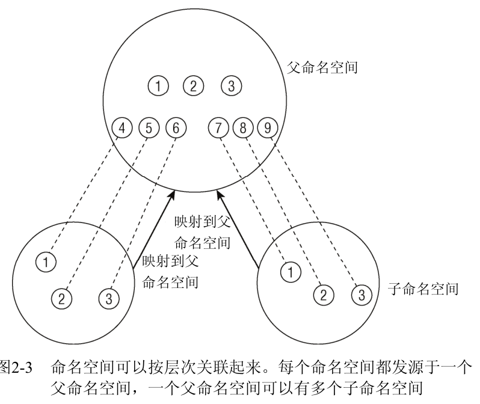

#### 进程的组织

可以通过pid直接检索到进程描述符, 方法自然是hash表, 以及开链法(双向链表)解决hash冲突。


对于线程来说, 它的pid和父线程相同, 但tid不同。考虑到线程, 进程结构在用pid检索时的组织如下。


一般的，进程以链式队列的形式等待CPU的执行。等待队列由双向链表实现, 其元素包括指向进程描述符的指针。注意到等待队列有单独的队头结构和元素结构。队头元素既有队头结构, 也有元素结构。

等待队列队头结构
```cpp
struct _wait_queue_head {
  spinlock_t lock;
  struct list_head task_list;
};
```
`task_list`是进程链表的头,也就是每个pid的进程链表头(pid_list)。`lock`是自旋锁, 中断函数和内核等处理队头进程时需要加锁防止修改。

自旋锁相对于互斥锁优势是互斥锁等待资源需要切换上下文进程挂起, 有切换开销, 自旋锁一直等着不需要切换上下文。

等待队列元素结构
```cpp
struct _wait_queue {
  unsigned int flags;
  struct task_struct* task;
  wait_queue_func_t func;
  struct list_head task_list;
};
```

等待队列链表的元素可代表睡眠进程, flags表示两种睡眠进程。一种事件发生时就会唤醒, 例如等待临界资源的进程; 一种事件发生也要被规律调度唤醒, 防止某时刻大量线程被唤醒来不及处理。func表示唤醒的执行函数。 task表示task_struct进程控制块。task_list这里指链接等待相同事件的进程链表。

父进程和子进程的关系
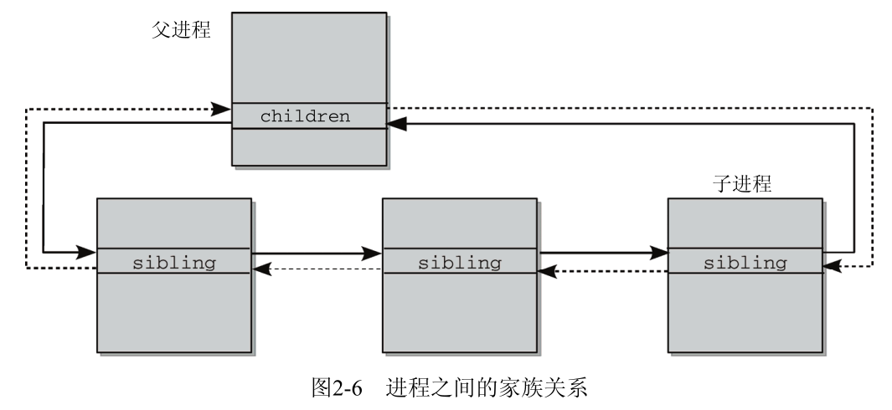

#### 线程

Linux 中刚开始是不支持线程的，自 Linux 2.6 以来，Linux 中使用的就是新的线程库，NPTL(Native POSIX Thread Library)。

NPTL 中线程的创建也是通过 clone 实现的，并且通过以下的参数表明了线程的特征：
```
CLONE_VM | CLONE_FILES | CLONE_FS | CLONE_SIGHAND | CLONE_THREAD | CLONE_SETTLS | 
CLONE_PARENT_SETTID | CLONE_CHILD_CLEARTID | CLONE_SYSVSEM

CLONE_VM：所有线程都共享同一个进程地址空间
CLONE_FILES：所有线程都共享进程的文件描述符列表
CLONE_THREAD：所有线程都共享同一个进程 ID 以及 父进程 ID
```

NPTL 所实现的线程库是 1:1 的从用户线程映射到内核线程，并且内核为了实现 POSIX 的线程标准也做了一些改动，比如对于信号的处理等。所以说 Linux 内核完全不区分进程和线程，甚至不知道线程的存在这种说法现在是不准确的。

线程间共享内容包括
1. 进程代码段
2. 进程的公有数据(利用这些共享的数据，线程很容易的实现相互之间的通讯)
3. 进程打开的文件描述符、信号的处理器、进程的当前目录和进程用户ID与进程组ID。

线程私有的部分有以下内容：

1. 线程 ID
2. 寄存器
3. 错误码（errno）
4. 栈
5. 信号屏蔽


#### 进程切换

每个进程描述符(进程控制块, task_struct)包含一个类型为thread_struct的thread字段，当进程被切换, 内核把硬件上下文保存在这个数据结构中, 这个数据结构包含了大多寄存器的字段, 但不包含eax,ebx这些通用寄存器, 它们的值保存在内核堆栈中。

内核栈是属于操作系统空间的一块固定区域, 可以用于保存中断现场、保存操作系统子程序间相互调用的参数、返回值等。用户栈是属于用户进程空间的一块区域, 用户保存用户进程子程序间的相互调用的参数、返回值等。进程陷入内核态的时候,需要内核栈来支持内核函数调用。当系统收到中断事件后, 进行中断处理的时候, 需要中断栈来支持函数调用。

所有进程的终止都是do_exit()函数处理, 这个函数会从内核数据结构(比如内核栈)删除对终止进程的大部分引用。最后释放进程描述符以及thread_info描述符和内核态堆栈占用的内容区域。进程结束后，进程的所有内存都将被释放，包括堆上的内存泄露的内存(部分内核级程序可能没有释放, 这时候一般问题比较大)。


#### 进程调度

Linux的调度基于分时(time sharing)技术, 多个进程以时间多路复用方式运行。同时进程的优先级是动态的, 调度程序跟踪进程在做什么, 并周期的调整它们的优先级。在较长时间间隔内没有使用CPU的进程, 通过动态增加它们的优先级来提升它们。

Linux的进程是抢占性的, 如果进程进入TASK_RUNNING状态, 内核检查它的动态优先级是否大于当前正运行进程的优先级。如果是, current的执行被中断, 并调用调度程序选择另一个进程执行(通常是刚刚变为可运行的进程), 同样在时间片到期时进程也会被抢占。
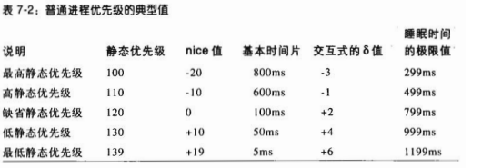

每个task_struct结构包含一个list_head类型的tasks字段, 所有进程的这个字段链接成为进程链表。此外还有一个list_head类型的run_list字段, 可运行进程的这个字段链接成为运行队列链表(TASK_RUNNING), 类似的, 还有等待队列链表的`task_list`。

CPU维护的运行队列是`runqueue`, 其中元素与可运行进程链表相关。每个CPU会维护一个`runqueue`, 每个可运行进程只可能属于一个运行队列。

`try_to_wake_up()`函数通过把进程状态设置为`TASK_RUNNING`, 并把该进程插入本地CPU的运行队列来唤醒睡眠或停止的进程。

`schedule()`函数实现调度程序, 负责从运行队列的链表中找到一个优先级最大的可运行进程, 并随后将CPU分配给这个进程。

`pthread_mutex_t`,先使用copy and write`_lock`, 判断其是否占用，若未占用，直接返回。否则，通过`__lll_lock_wait_private`调用SYS_futex系统调用迫使线程等待队列睡眠。


`pthread_cond_wait`函数需要传入mutex用于保护条件，
如果没有传入mutex的条件, 可能发生条件变量改变了但线程还没有放到等待队列上, 无法唤醒。传入mutex条件可以保证线程进入等待队列后条件变量才可能发生改变。因为把线程放进阻塞队列后，会自动对mutex进行解锁, 当pthread_cond_wait返回的时候又自动给mutex加锁。

CAS是一个原子指令，CAS用于检查一个内存位置是否包含预期值，如果包含(说明没有人修改过)，则把新值复赋值到内存位置(赋值过程是原子的, 不会被修改)。成功返回true，失败返回false。。CAS的实现依赖于硬件支持，需要所在的CPU暂时锁住内存总线，不让其他CPU访问内存。相比于mutex效率更高。
#### linux进程信息

Linux 内核提供了一种通过 proc 文件系统，在运行时访问内核内部数据结构、改变内核设置的机制。proc 文件系统是一个伪文件系统，它只存在内存当中，而不占用外存空间。它以文件系统的方式为访问系统内核数据的操作提供接口。用户或应用程序读取 proc 文件时，proc 文件系统是动态从系统内核读出所需信息并提交的。

对每一个运行的进程, 用户都可以通过`cat /proc/[pid]/status`获得pid进程的状态, 对于当前进程, 可以使用`/proc/self/status`。同理对于线程状态, 使用`/proc/self/task/tid/stat`。

#### 内核同步

1. 每CPU变量

将内核变量声明为每CPU变量(per-cpu variable), 这样这个数据只能被这个CPU访问。注意每CPU变量为来自不同CPU的并发访问提供保护, 但对于来自异步函数(中断处理程序和可延迟函数)的访问不提供保护, 需要寻找其他同步原语。

2. 原子操作

用单个指令执行"读-修改-些"的操作, 中间不能中断, 且避免其他CPU访问同一存储单元。

3. 优化和内存屏障

内存屏障(memory barrier)原语确保, 在原语之后的操作执行之前, 原语之前的操作已经完成, 从而有happen-before语言。

4. 自旋锁

自旋锁spin lock的循环指令表示忙等, 即使等待的内核控制路径无事可做它也会在CPU上保持运行, 直到它获取锁访问共享变量。自旋锁通常非常方便，因为很多内核资源只锁1ms时间片段, 因此自旋锁不会消耗多少时间。

5. 读/写自旋锁

读/写自旋锁为了增加内核的并发能力。如果一个内核控制路径想对这个结构进行写操作, 那么它必须要首先获取读/写锁的写锁。而读是可以并发的, 这可以提高系统性能。

6. 顺序锁

顺序锁seqlock和读/写自旋锁非常相似, 只是它为写赋予了较高的优先级: 即使读的时候也允许写继续执行, 这种策略使写不会等待(除非另外一个写着在写), 缺点是有时候读者不得不反复读相同数据直到读到有效的版本。

显然不是所有情况下都能使用顺序锁, 看使用场景。

7. 信号量

Linux提供两种信号量, 内核信号量由内核控制路径使用; System V IPC信号量, 由用户态进程使用。

### 中断和异常

#### 简述
中断(interrupt)通常被定义为一个事件, 该事件改变处理执行的指令顺序, 这样的事件与CPU芯片内外部硬件电路产生的电信号相对应。

中断通常分为同步(synchronous)中断和异步(asynchronous)中断。同步中断是当指令执行时由CPU控制单元产生的, 称为同步因为只有再一条指令终止执行后CPU才会发出中断; 异步中断是其他硬件设备按照CPU时钟信号随机产生的。同步中断和异步中断也分别成为异常(exception)和中断(interrupt)

中断信号是以一种特殊的方式, 使处理器转而去运行正常控制流之外的代码。当中断信号到达时，CPU必须停止它正在做的事情, 切换到一个新的活动。为了做到这一点, 就要在内核态堆栈保存程序计数器的当前值(即eip和cs寄存器), 并把与中断类型相关的一个地址放进程序计数器。

中断或异常处理程序不是一个进程, 它的上下文很少, 建立或终止中断处理需要的时间很少。中断 处理必须满足以下约束
1. 内核响应中断需要处理的操作分为两部分, 关键而紧急的部分内核立即执行; 其余推迟的部分内核随后执行。
2. 中断处理必须能以嵌套的方式执行, 最后一个中断路径终止时, 内核必须能恢复被中断进程的执行。
3. 再内核代码的临界区中, 中断必须被禁止。且必须尽可能限制这样的临界区。


#### 中断和异常分类
Intel将中断和异常分为以下几类

中断
1. 可屏蔽中断(maskable interrupt), I/O设备发出的所有请求(IRQ)都可产生可屏蔽中断, 可屏蔽中断可以处于两种状态: 屏蔽的(masked)或非屏蔽的(unmasked), 处于屏蔽状态时控制单元就忽略它
2. 非屏蔽中断, 只有几个危急事件, 如硬件故障, 才引起非屏蔽中断。非屏蔽中断由CPU辨认。

* 异常

1. 故障(fault), 通常可以纠正, 保存在eip(存储CPU要读取指令的地址)中的值时引起故障的指令地址, 然后进行异常处理。当异常处理程序终止时, 保存在eip的那条指令会被重新执行。
2. 陷阱(trap), 保存在eip的值是随后要执行的指令地址, 与故障最大的区别是陷阱没有必要执行异常的指令。陷阱的主要用途是为了调试程序。这种情况下中断信号的作用是通知调试程序一条特殊的指令已被执行(例如到了断点), 用户可以要求调试程序继续执行下一条指令。
3. 异常终止(abort), 发送严重的错误, 不能在eip寄存器中保存引起异常指令的确切位置。这个异常中止程序只能强制受影响的进程中止。
4. 编程异常, 由int或int3指令触发, into(检查溢出)和bound(检查地址出界)等会引起编程异常, 控制单元将编程异常作为陷阱处理, 编程异常也叫做软中断主要用来执行软中断或给调试程序同胞一个事件。

80X86微处理器发布了大约20种不同的异常, 内核必须为每种异常提供一个专门的异常处理程序
```
0 Divide error 故障 当一个程序试图执行被0除操作产生
1 Debug 陷阱或故障 产生于debug设置eflags的TF标志
2 未使用
3 Breakpoint 陷阱 由int3(断点)指令引起
4 Overflow 陷阱 当eflags的OF标志设置, into(检查溢出)指令被执行
5 Bounds check 故障 对于有效地址范围之外的操作数bound指令执行
6 Invalid opcode 故障 CPU执行单元检测到无效的操作码(机器指令)
7 Device not avaliable 故障 
8 Double fault 异常终止 嵌套处理异常失败触发
9 Coprocessor segment overrun 异常终止
10 Invalid TSS 故障 CPU试图让一个上下文切换到有无效TSS的进程
11 Segment not present 故障 引用一个不存在的内存段
12 Stack segment fault 故障 试图超过栈段界限的指令
13 General protection 故障 违反80X86保护模式下的规则
14 Page fault 故障 寻址的页不在内存
15 Intel保留
16 Floating point error 故障 继承到CPU芯片的浮点运算单元错误, 如数字溢出, 被0除
17 Alignment check 故障 操作数的地址没有正确对齐
18 Machine check 异常中止 检查到CPU或者总线错误
19 SIMD floating point exception 故障 SSE单元对浮点操作报告错误
```

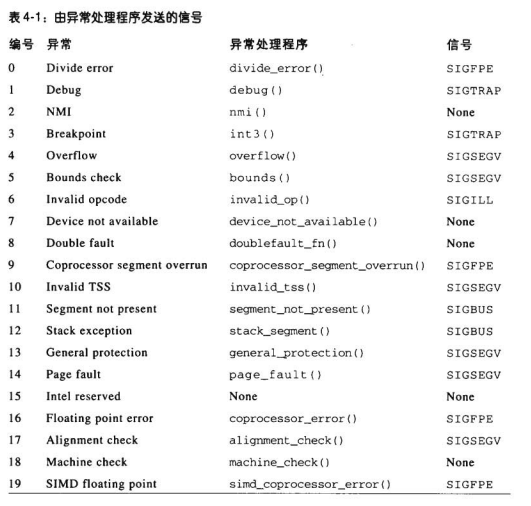

#### 中断描述符表
中断描述符表(Interrupt Descriptor Table, IDT)是一个系统表, 它与每一个中断或者异常相联系, 每个相邻在表中有响应的中断或异常处理程序的入口地址。

中断处理程序既可以抢占其他的中断处理程序, 也可以抢占异常处理程序, 而异常处理程序从不抢占中断处理程序。内核态唯一能触发的异常就是缺页异常, 但是中断处理程序从不执行可以导致缺页(意味着进程切换)的操作。

Linux中根据中断, 陷阱等有不同的中断描述符表处理
1. 中断门 用户态的进程不能访问的一个Intel中断门, 所有的Linux中断处理程序都通过中断门激活, 并全部限制在内核态
2. 系统门 用户态的进程可以访问, 通过系统们来激活三个Linux异常处理程序, 向量4,5,128. 用户态下, 可以发布int, bound, int $0x80 三条汇编语言指令
3. 系统中断门, 能被用户态进程访问的一个Intel中断门, 与向量3相关的异常处理程序由系统中断门激活, 用户态可以使用汇编指令int 3
4. 陷阱门 用户态不能访问, 大部分Linux异常处理程序通过陷阱门激活
5. 任务门 不能被用户态访问, Linux对Double fault异常处理程序通过任务门激活


#### 异常和中断处理
当异常发生时, 内核就向引起异常的进程发送一个信号通知它一个反向条件, 例如进程执行被0除的操作, CPU产生一个Divide error异常, 然后由对应的异常处理程序向当前进程发送一个SIGFPE的信号。异常处理程序页需要先在内核堆栈保存大多数寄存器内容, 然后调用高级C函数处理异常, 最后通过ret_from_exception()函数从异常处理程序退出。

内核只要给引起异常的进程发送一个Unix信号, 就能处理大部分异常。但这种办法不适用于中断, 因为可能一个进程挂起很久(例如等待数据传输)中断才到达, 这时候这个进程并没有在运行, 当前运行的进程很可能是别的进程，给当前进程发送信号是无意义的。

每个能够发出中断请求的硬件设备控制器都有IRQ(Interrupt Request)的输出线, IRQ线在硬件上都与一个可编程中断控制器的硬件电路输入引脚相连, 该可编程中断控制器用来监视IRQ线和将接收的引发信号转为对应的向量, 发送到处理器的INTR引脚产生一个中断。

三种主要的中断类型是I/O中断, 时钟中断, 处理器间中断(一个CPU给另一个CPU发出中断)。不管引起中断的电路种类如何, 所有的I/O中断处理程序都执行四个相同的基本操作。
1. 内核态堆栈保存IRQ的值和寄存器的内容
2. 为正在给IRQ线服务的PIC发送一个应答, 这将允许PIC进一步发出中断
3. 执行共享这个IRQ的所有设备的中断处理例程(ISR)
4. 跳到ret_from_intr()的地址后终止。

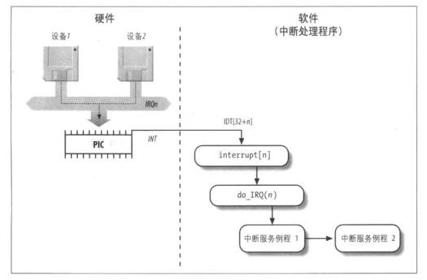

Linux使用中断向量标志中断, 其中中断号128(0x80)标识系统调用

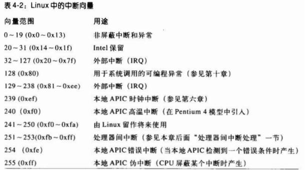

I/O设备的IRQ和中断向量

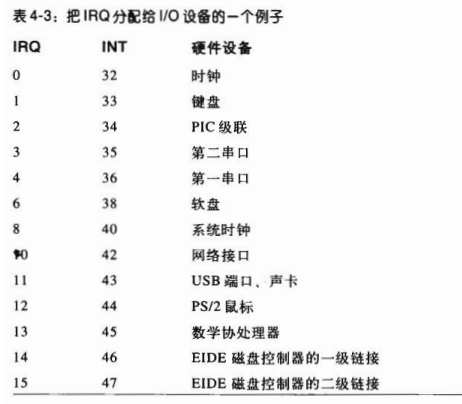

内核使用三种类型的内核栈来处理中断
1. 异常栈 用来处理异常,包括系统调用。这个栈包含在每个进程的thread_union数据结构中, 因此对于不同的进程有不同的异常栈
2. 硬中断请求栈, 用来处理中断。系统的每个CPU会有个硬中断请求栈
3. 软中断请求栈, 用来处理可延迟的函数, 每个CPU有一个软中断请求栈。

处理中断和系统调用, 函数调用类似。第一步是保存寄存器到对应的栈
```
push %es
push %ds
pushl %eax
pushl %ebp
...
```
接下来调用与中断相关的中断服务例程, 最后出栈数据到寄存器, 恢复原进程的执行。

#### 系统调用

Unix系统通过向内核发出系统调用(system call)实现了用户态进程和硬件设备之间的大部分接口。注意POSIX标准针对API而不针对系统调用，判断一个系统是否与POSIX兼容要看它是否提供了一组合适的应用程序接口, 而不管对应的函数如何实现的。从编程者观点看, API和系统调用之间的差别不大, 唯一相关的就是函数名, 参数类型及返回代码的含义。但从内核角度看, 系统调用属于内核而用户态的库函数不属于内核。系统调用返回正数或0表示成功结束, 而负数则表示出错, libc顶一个errno变量包含系统调用特定的出错码。

进程必须传递一个名为系统调用号(system call number)的参数来识别所需的系统调用, eax寄存器就用作此目的。系统调用处理程序和中断/异常处理相似
1. 在内核态栈保存大多数寄存器的内容
2. 调用名为系统调用服务例程(system call service routine)的相应的C函数来处理系统调用
3. 退出系统调用处理程序: 用保存在内核栈的值加载寄存器, CPU从内核态切换回用户态(也就是从执行内核态指令改为执行用户态指令)

内核利用系统调用分派表(dispatch table)把系统调用号与相应的服务例程关联起来, 这个表存放在sys_call_table数组中。第n个表现包含系统调用号为n个服务例程的地址。

系统调用可认为是一种中断, 利用`int $0x80`软中断指令或者stsenter汇编指令, 可以调用系统调用。对应的是iret或sysexit指令从系统调用退出。

* 进入系统调用

1. 标准库的封装例程把系统调用号装入eax寄存器, 并调用__kernel_vsystemcall()函数
2. 函数__kernel_vsystemcall()把ebp, edx和ecx的内容保存到用户态堆栈中, 把用户栈指针拷贝到ebp中, 然后执行sysenter指令
3. CPU从用户态切换到内核态, 内核开始执行sysenter_entry()函数。该函数负责, 1建立内核堆栈指针; 2将用户段的段选择符, 当前用户栈指针,以及系统调用退出要执行的指令地址保存在内核堆栈中;3把原来由封装例程传递的寄存器恢复到ebp中
4. 最后执行int $0x80指令发出系统调用, 对应于向量128的中断描述符表项, CPU开始从地址system_call处开始执行指令
5. system_call()首先把CPU寄存器保存在内核栈, 但不包含之前保存的cs, eip和esp等, 然后调用与eax中所包含的系统调用号对应的特定服务例程。

系统调用服务例程会频繁读写进程地址空间的数据, Linux包含的一组宏使访问更加容易。访问进程地址空间可能导致缺页异常, 这时候把访问进程地址空间的每条内核指令放到一个异常表中。当发生缺页异常时, do_page_fault()处理程序会检查异常表, 判断是否包含异常指令地址，

#### 信号

信号是很短的消息, 可以被发送到一个进程或一组进程。发送给进程的唯一信息通常是一个数, 用来标识信号。名称前缀为SIG的一组宏用来标识信号。例如当某一子进程终止时, SIGCHLD宏产生发送给父进程的信号标识符, 当一个进程引用无效内存时, SIGSEGV宏产生发送给进程的信号标识符。信号的主要目的是让进程知道已经发生的一个特定的事件, 并执行信号处理程序

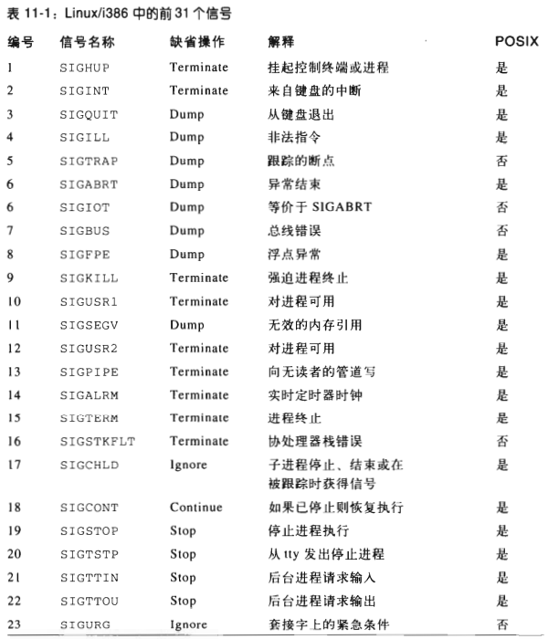

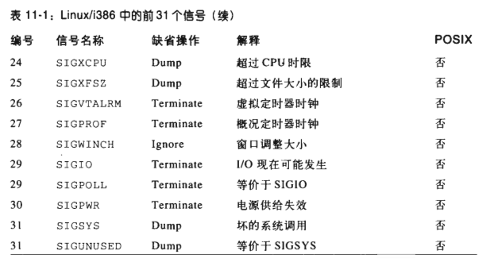

与信号相关的系统调用包括

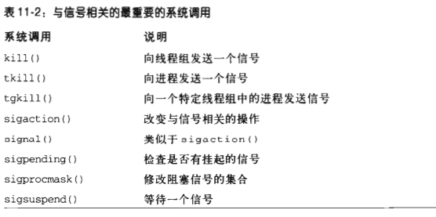

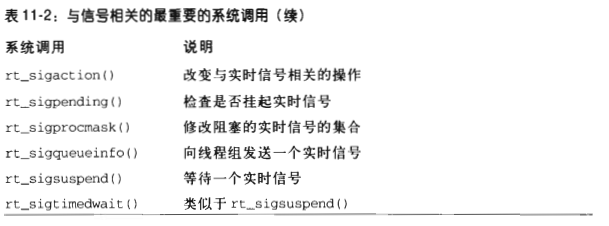

信号一个重要特点是他们可以随时发送给状态不可预知的进程, 发送给非运行状态进程的信号必须由内核保存, 知道进程恢复执行。已经产生但没有传递的信号称为挂起信号pending signal, 一个进程仅存在给定类型的一个挂起信号, 同一进程同种类型的信号不被排队, 多余的被丢弃。

信号通常只被当前正在运行的进程传递, 并且进程可以选择性阻塞信号及取消阻塞前进程不接收这个信号。进程通常以三种方式对信号应答
1. 显示忽略信号
2. 执行与信号相关的缺省操作, 可以是Terminate进程被终止, Dump进程被终止但如果可能创建上下文的核心转储文件 Ignore信号被忽略 Stop进程被停止(设置为TASK_STOPPED状态) Continue 进程如果处理停止状态则设置为TASK_RUNNING状态
3. 调用响应的信号处理函数捕捉信号

信号相关的数据结构
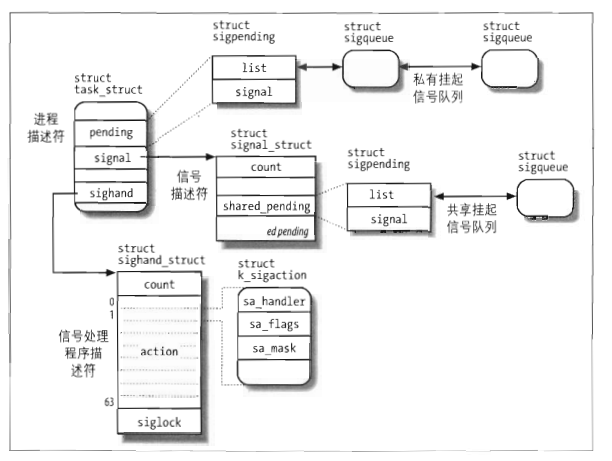

进程描述符的signal字段指向信号描述符(signal descriptor, 一个signal_struct类型的结构)。除了信号描述符, 每个进程还引用一个信号处理程序描述符(signad handler descriptor, sighand_struct类型的结构), 描述每个信号怎样被线程组处理。信号处理描述符可以被多个进程共享, count字段表示共享结构的进程个数。最后内核把两个挂起信号队列与每个进程相关联
1. 共享挂起信号队列, 位于信号描述符的shared_pending字段，存放整个线程组的挂起信号
2. 私有挂起信号队列, 它位于进程描述符的Pending字段, 存放特定进程(轻量级进程, 线程)的挂起信号、

如果信号到达进程不在CPU上运行,内核就延迟传递信号的任务。为了确保进程的挂起信号得到处理, 内核允许进程恢复用户态下的执行之前, 检查进程TIF_SIGPENDING标志的值, 每当内核处理完一个中断或者异常时, 就检查进程是否存在挂起信号。当信号处理函数执行完, 就应该是进程恢复用户上下文在用户态执行的了，

如果用户定义了捕获处理信号的用户态程序, 这意味着进程必须执行用户态的信号处理程序, 需要从内核态转用户态, 转换时内核态堆栈都被清空。Linux采用的办法是把保存在内核态的堆栈中的硬件上下文拷贝到当前进程的用户态堆栈, 当信号处理程序终止时调用sigreturn()系统调用把硬件上下文拷贝回内核态堆栈中, 并恢复用户态堆栈原来的内容。
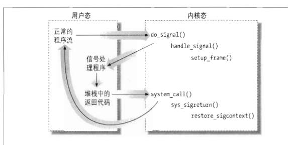
