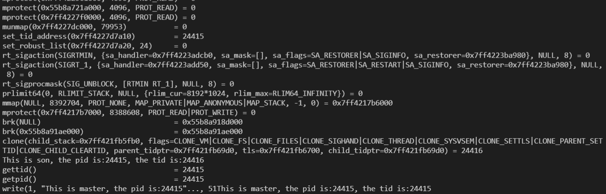
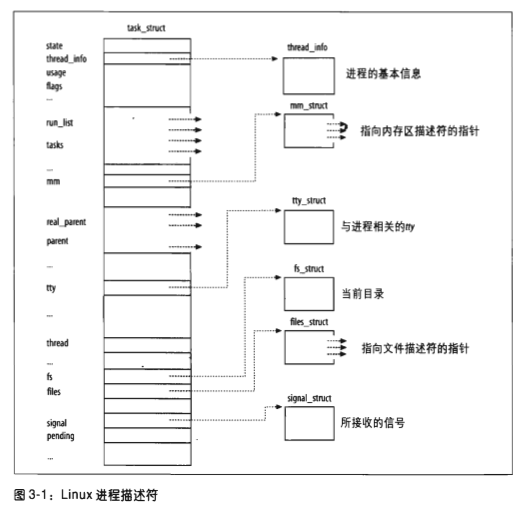
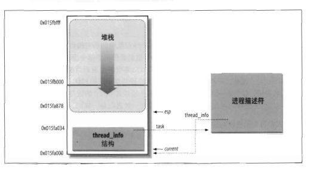
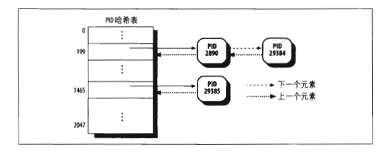
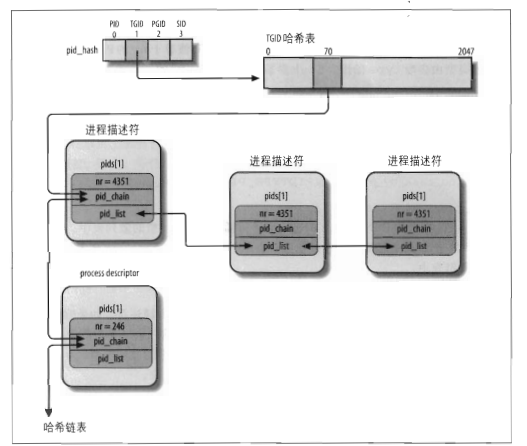

### 进程和线程创建

#### fork

来自头文件`#include <unistd.h>`, `pid_t fork(void)`。 fork函数被调用一次, 返回两次。子进程的返回值为0, 父进程返回值是子进程的进程id, 子进程和父进程继续执行fork调用之后的指令。子进程获得父进程的数据空间, 堆栈的副本, 但不共享空间。

```cpp
#include <stdio.h>
#include <stdlib.h>
#include <sys/types.h>
#include <unistd.h>
#include<sys/syscall.h>

pid_t gettid()
{
    return syscall(SYS_gettid);
}
int main(void)
{
    int count = 1;
    int child;

    child = fork( );

    if(child < 0)
    {
        perror("fork error : ");
    }
    else if(child == 0)     //  fork return 0 in the child process because child can get hid PID by getpid( )
    {
        printf("This is son, his count is: %d (%p). and his pid is: %d the tid is:%d \n", ++count, &count, getpid(), gettid());
    }
    else                    //  the PID of the child process is returned in the parent’s thread of execution
    {
        printf("This is father, his count is: %d (%p), his pid is: %d the tid is:%d \n", count, &count, getpid(), gettid());
    }

    return EXIT_SUCCESS;
}

输出
This is father, his count is: 1 (0x7ffdf3c9c6a0), his pid is: 19542 the tid is:19542 
This is son, his count is: 2 (0x7ffdf3c9c6a0). and his pid is: 19543 the tid is:19543 
```

注意子进程获得父进程副本使用**写入时复制(Copy-on-write)**, 父子进程会指向相同的资源,该资源设置为只读,如果某个进程尝试修改资源时(也就是上面调用count++)，只为修改区域的内存制作一个副本。如果子进程并没有修改该资源，就不会有副本复制。因此如果只读不写, fork的效率还是很高的。

<!-- more -->

由于fork之后往往跟随`exec`, `int execl(const char *pathname， const char *arg0`。由于`copy on write`因此往往没有执行父进程资源的完全复制开销, 而是直接创建进程空间然后将pathname指向的可执行文件加载到进程空间中。因此fork的效率是不低的。

#### vfork

vfork创建的子进程共享的父进程的空间, 子进程修改变量，父进程的变量同样受到了影响。

vfork()保证子进程先运行，在子进程调用exec或_exit之后父进程才可能被调度运行。父进程在等待子进程, 如果子进程依赖于父进程的进一步动作，会导致死锁。

vfork()调用之后执行`exec`才有意义, 因为当进程调用一种exec函数时，该进程完全由新程序代换(非共享父进程空间, 父进程变量子进程这时候不存在了)。父进程然后正常执行。

#### clone

clone()是更强大的创建进程的方法, 因为可以指定进程堆栈空间。共享部分存储空间的进程可以认为是线程, 因此`pthread_create_t`底层用的是clone创建。
`int clone(int (*fn)(void *), void *stack, int flags, void *arg, ...`, fn是函数指针, stack是子进程使用的堆栈的位置, 后面的参数表示和父进程共享的资源。

```cpp
flag可以设置的参数
CLONE_PARENT	创建的子进程的父进程是调用者的父进程，新进程与创建它的进程成了“兄弟”而不是“父子”
CLONE_FS	子进程与父进程共享相同的文件系统，包括root、当前目录、umask
CLONE_FILES	子进程与父进程共享相同的文件描述符（file descriptor）表
CLONE_NEWNS	在新的namespace启动子进程，namespace描述了进程的文件hierarchy
CLONE_SIGHAND	子进程与父进程共享相同的信号处理（signal handler）表
CLONE_PTRACE	若父进程被trace，子进程也被trace
CLONE_VFORK	父进程被挂起，直至子进程释放虚拟内存资源
CLONE_VM	子进程与父进程运行于相同的内存空间
CLONE_THREAD	Linux 2.4中增加以支持POSIX线程标准，子进程与父进程共享相同的线程群

#define _GNU_SOURCE             /* See feature_test_macros(7) */
#include <sched.h>
#include <stdio.h>
#include <sys/types.h>
#include <fcntl.h>
#include <stdlib.h>
#include <string.h>
#include <unistd.h>
#include <sys/wait.h>
#include <sys/mman.h>
#include <errno.h>
#include <sys/stat.h>
#include<sys/syscall.h>

pid_t gettid()
{
    return syscall(SYS_gettid);
}


#define FIBER_STACK 8192
int a;
void * stack;

int do_something()
{
    printf("This is son, the pid is:%d, the tid is:%d, the a is: %d\n", getpid(),gettid(), ++a);
    free(stack);
    exit(1);
}

int main()
{
    void * stack;
    a = 1;
    stack = malloc(FIBER_STACK);//为子进程申请系统堆栈

    if(!stack)
    {
        printf("The stack failed\n");
        exit(0);
    }
    printf("creating son thread!!!\n");

    clone(&do_something, (char *)stack + FIBER_STACK, CLONE_VM|CLONE_SIGHAND|CLONE_THREAD, 0); //创建子线程

    printf("This is father, my pid is: %d, the tid is:%d, the a is: %d\n", getpid(),gettid(), a);
    exit(1);
}

输出
creating son thread!!!
This is father, my pid is: 23733, the tid is:23733, the a is: 1
This is father, my pid is: 23733, the tid is:23733, the a is: 1
This is son, the pid is:23733, the tid is:23734, the a is: 2
```

由此可见`pthread_t`原理和上面类似, 我们可以分析以下。
```cpp
#include <stdio.h>
#include <stdlib.h>
#include <unistd.h>
#include <pthread.h>

#include<sys/syscall.h>

pid_t gettid()
{
    return syscall(SYS_gettid);
}
void thread(void)
{
    int i;
    printf("This is son, the pid is:%d, the tid is:%d\n", getpid(),gettid());

    sleep(3);
}

int main(int argc,char **argv)
{
    pthread_t id;
    int i,ret;
    ret=pthread_create(&id,NULL,(void *) thread,NULL);
    if(ret!=0){
        printf ("Create pthread error!\n");
        exit (1);
    }
    printf("This is master, the pid is:%d, the tid is:%d\n", getpid(),gettid());
    pthread_join(id,NULL);
    return 0;
}

输出
This is master, the pid is:24026, the tid is:24026
This is son, the pid is:24026, the tid is:24027
```

用`strace ./pthread_1`打印堆栈, 可以发现其内部是先用brk分配堆内存, 然后调用clone创建线程。



`clone()`,`fork()`,`vfork`系统调用底层是`do_fork`函数。而`vfork`相当于设置了`CLONE_VFORK`标志, 将父进程插入等待队列挂起, 直到子进程释放自己的内存空间(子进程结束或者执行新的程序)

显然所有内存都是运行时期开辟的(因为进程都是运行时候开辟的), 只是进程栈内存由于编译器在编译期就要知道大小, 出栈时自动释放; 而堆上的内存可以根据用户输入调整大小(比如运行着不够用了可以再扩充大小), 因此堆的内存大小是不固定的, 有可能运行着变大了, 栈则是从开始到结束都按照编译的分配那么大内存。

编译器在编译完会把编译期断定的信息放在表上, 比如栈上要多少内存, 编译期信息就是指那张表上有没有这个信息, 没有的就是运行期信息。

### 进程的存在

从内核来看, 进程就是担当分配系统资源(CPU时间, 内存等)的实体。

当运行一个程序时, linux系统最先创建的是进程结构, 之后才是进程的堆栈数据区等内存的分配。进程结构在linux系统中以进程描述符呈现。进程是操作系统任务调度的基本单位, cpu执行的对象是进程。



基于task_struct可以获知进程的相关信息, 例如包含的文件描述符, 接收的信号, 内存区描述符。内存区描述符包含进程的堆栈信息, 文件描述符包含进程的IO设备信息。

#### thread_info
从进程内存区也可以得到进程描述符的信息, 这也是运行时获得进程pid的原理。因为CPU执行的指令存储在进程的内存区空间, 内存区可以链接到进程描述符(例如某寄存器存储进程描述符相关的地址)使运行时可以得到进程的信息。

以上策略基于task_info, 这个结构可以通过 task 字段指向具体某个进程描述符。


如上表示两页的空间, 可以解释为什么一页是4kb, 16^3 = 4096 = 4kb, 这样地址0x015fa000 + 4kb = 0x015fb000 这样方便表示。可见thread_info结构和堆栈公用8kb的空间, 且thread_info通过task成员指向进程描述符。


thread_info结构和堆栈共用空间, 可用union来构建。什么时候用共用体, 在某段空间(8k)两个结构共同使用。
```cpp
union thread_union {
  struct thread_info thread_info;
  unsigned long stack[2048];  // long为4byte, 2048*4 = 8k
}
```

这样由于程序运行时寄存器esp指向栈顶, 因此可以通过esp寄存器推导出thread_info的地址，方式是屏蔽esp的低13有效位。

```
movl $0xffffe000, %ecx
andl %esp, %ecx
movl %ecx p
```
task在thread_info中偏移量为0, 因此p就是task的地址, 也就是进程描述符的地址。

#### 进程的组织

可以通过pid直接检索到进程描述符, 方法自然是hash表, 以及开链法(双向链表)解决hash冲突。



对于线程来说, 它的pid和父线程相同, 但tid不同。考虑到线程, 进程结构在用pid检索时的组织如下。



一般的，进程以链式队列的形式等待CPU的执行。等待队列由双向链表实现, 其元素包括指向进程描述符的指针。注意到等待队列有单独的队头结构和元素结构。队头元素既有队头结构, 也有元素结构。

等待队列队头结构
```cpp
struct _wait_queue_head {
  spinlock_t lock;
  struct list_head task_list;
};
```
`task_list`是进程链表的头,也就是每个pid的进程链表头(pid_list)。`lock`是自旋锁, 中断函数和内核等处理队头进程时需要加锁防止修改。

自旋锁相对于互斥锁优势是互斥锁等待资源需要切换上下文进程挂起, 有切换开销, 自旋锁一直等着不需要切换上下文。

等待队列元素结构
```cpp
struct _wait_queue {
  unsigned int flags;
  struct task_struct* task;
  wait_queue_func_t func;
  struct list_head task_list;
};
```

等待队列链表的元素可代表睡眠进程, flags表示两种睡眠进程。一种事件发生时就会唤醒, 例如等待临界资源的进程; 一种事件发生也要被规律调度唤醒, 防止某时刻大量线程被唤醒来不及处理。func表示唤醒的执行函数。 task表示task_struct进程控制块。task_list这里指链接等待相同事件的进程链表。

#### 进程切换

每个进程描述符(进程控制块, task_struct)包含一个类型为thread_struct的thread字段，当进程被切换, 内核把硬件上下文保存在这个数据结构中, 这个数据结构包含了大多寄存器的字段, 但不包含eax,ebx这些通用寄存器, 它们的值保存在内核堆栈中。

内核栈是属于操作系统空间的一块固定区域, 可以用于保存中断现场、保存操作系统子程序间相互调用的参数、返回值等。用户栈是属于用户进程空间的一块区域, 用户保存用户进程子程序间的相互调用的参数、返回值等。进程陷入内核态的时候,需要内核栈来支持内核函数调用。当系统收到中断事件后, 进行中断处理的时候, 需要中断栈来支持函数调用。

所有进程的终止都是do_exit()函数处理, 这个函数会从内核数据结构(比如内核栈)删除对终止进程的大部分引用。最后释放进程描述符以及thread_info描述符和内核态堆栈占用的内容区域。进程结束后，进程的所有内存都将被释放，包括堆上的内存泄露的内存(部分内核级程序可能没有释放, 这时候一般问题比较大)。


#### 进程调度

每个task_struct结构包含一个list_head类型的tasks字段, 这个字段链接成为进程链表。此外还有一个list_head类型的run_list字段, 这个字段链接成为运行队列链表(TASK_RUNNING), 类似的, 还有等待队列链表的`task_list`。

CPU维护的运行队列是`runqueue`, 其中元素与可运行进程链表相关, 每个CPU会维护一个`runqueue`, 每个可运行进程只可能属于一个运行队列。

`try_to_wake_up()`函数通过把进程状态设置为`TASK_RUNNING`, 并把该进程插入本地CPU的运行队列来唤醒睡眠或停止的进程。

`schedule()`函数实现调度程序, 负责从运行队列的链表中找到一个进程, 并随后将CPU分配给这个进程。

`pthread_mutex_t`,先使用copy and write`_lock`, 判断其是否占用，若未占用，直接返回。否则，通过`__lll_lock_wait_private`调用SYS_futex系统调用迫使线程等待队列睡眠。


`pthread_cond_wait`函数需要传入mutex用于保护条件，
如果没有传入mutex的条件, 可能发生条件变量改变了但线程还没有放到等待队列上, 无法唤醒。传入mutex条件可以保证线程进入等待队列后条件变量才可能发生改变。因为把线程放进阻塞队列后，会自动对mutex进行解锁, 当pthread_cond_wait返回的时候又自动给mutex加锁。

CAS是一个原子指令，CAS用于检查一个内存位置是否包含预期值，如果包含(说明没有人修改过)，则把新值复赋值到内存位置(赋值过程是原子的, 不会被修改)。成功返回true，失败返回false。。CAS的实现依赖于硬件支持，需要所在的CPU暂时锁住内存总线，不让其他CPU访问内存。相比于mutex效率更高。

### linux进程信息

Linux 内核提供了一种通过 proc 文件系统，在运行时访问内核内部数据结构、改变内核设置的机制。proc 文件系统是一个伪文件系统，它只存在内存当中，而不占用外存空间。它以文件系统的方式为访问系统内核数据的操作提供接口。用户或应用程序读取 proc 文件时，proc 文件系统是动态从系统内核读出所需信息并提交的。

对每一个运行的进程, 用户都可以通过`cat /proc/[pid]/status`获得pid进程的状态, 对于当前进程, 可以使用`/proc/self/status`。同理对于线程状态, 使用`/proc/self/task/tid/stat`。

