### 内存寻址

#### 分段

三种不同的地址

* 逻辑地址logical address, 每一个逻辑地址都由一个段segment和偏移量offset组成, 偏移量指明了从段开始的地方到实际地址之间的距离。
* 线性地址/虚拟地址 linear address/virtual address, 32位整数可以表示4GB的地址, 即4 292 967 296 10^10级别。线性地址通常由16进制表示, 范围可从0x00000000 到0xffffffff。
* 物理地址 physical address, 用于内存芯片级内存寻址, 从微处理器的地址引脚发送到内存总线的电信号对应。通常由32位或36位无符号整数表示。

内存控制单元MMU通过分段党员的硬件电路将逻辑地址转为线性地址, 通过分页单元将线性地址转为一个物理地址。

Intel处理器以两种不同的方式执行地址转换, 分别是实模式(real mode)和保护模式(protected mode)。实模式和保护模式都是CPU的工作模式，而CPU的工作模式是指CPU的寻址方式、寄存器大小等用来反应CPU在该环境下如何工作的概念。

实模式出现于早期8088CPU时期, 因为早期的8086处理器性能有限，一共只有20位地址线(所以地址空间只有1MB)，以及8个16位的通用寄存器，以及4个16位的段寄存器。所以为了能够通过这些16位的寄存器去构成20位的主存地址，必须采取一种特殊的方式。也就是 物理地址 = 段基址 << 4 + 段内偏移

两个 16 位的寄存器合在一起，宽度便成了 20 位。例如段寄存器中的值是0xff00，段偏移量为0x0110。则这个地址对应的真实物理地址是 0xff00<<4 + 0x0110 = 0xff110。在实模式下，段寄存器直接存放的就是段基址，比如 CPU 中用来存放当前指令地址的 CS：IP 寄存器，CS 中存放的便是代码段的基址, IP就是偏移地址。实模式不安全，因为程序可以随意访问任何物理地址。

随着CPU的发展, CPU的地址线的个数从原来的20根变为现在的32根，可以访问的内存空间也从1MB变为现在4GB，寄存器的位数也变为32位。在保护模式下，CPU的32条地址线全部有效，可寻址高达4G字节的物理地址空间; 内存寻址方式变成了段选择符和偏移量。

段描述符放在全局描述符表中, 为了方便找到段选择符, 处理器提供段寄存器用来存放段选择符。寄存器可用来进行进程上下文切换的恢复(即代码段执行到一半继续执行的恢复)。
```
cs 代码段寄存器, 指向包含程序指令的段。同时标注了当前CPU的特权级, 0级或者3级别, 分别表示内核态和用户态。
ss 栈段寄存器, 指向包含当前程序栈的段
ds 数据段寄存器 指向包含静态数据或者全局数据段
```

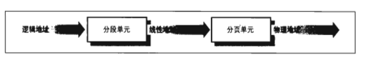

<!-- more -->

分段可以给进程分配不同的线性地址空间, 分页可以把同一个线性地址空间映射到不同的物理空间。Linux更喜欢分页方式, 因为所有进程使用相同段寄存器值时可以让内存管理更简单, 且RSIC体系结构对分段支持有限。一般Linux只有在X86结构下才使用分段。

四个主要的Linux段的段描述符
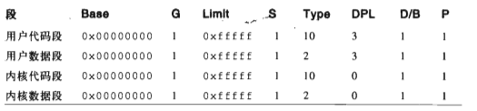

#### 分页

线性地址被分成以固定长度为单位的组, 称为页。通过C语言&取得地址是以CS 的段基址为基址的逻辑地址。而不是线性地址(虚拟地址)， 更不是物理地址。

分页单元把所有RAM分成固定长度得页框(page frame), 每个页框包含一个页。页可以看成一个数据块, 可以存放在任何页框和硬盘中。分页单元一般处理4kb的页。

32位得线性地址是页包含字节的地址, 分为3个部分, 假设进程要读线性地址0x20021406的字节, 首先Directory字段0x200表示选择目录项, 此目录指向相关的页表。Table字段用于选择页表, 表项包含所需页的页框; 最后Offset字段用于在目标页框读偏移量中的字节。

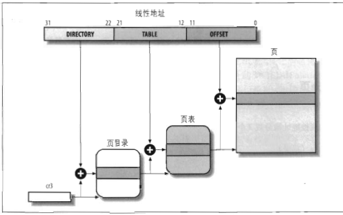

段得存取权限有三种, 读, 写, 执行; 页得存取权限只有读, 写两种。

另外可以设置寻找页表的多级目录, 称之为多级页表。

进程的线性地址空间可以分为两部分,
* 从0x00000000到0xbfffffff的线性地址, 共3GB, 无论进程在用户态还是内核态都可以寻址
* 从0xc0000000到0xffffffff的线性地址, 共1GB, 只有内核态的进程才能寻址。

此外, 内核还维护着一组自己使用的页表。RAM的某些部分永久分配给内核, 用来存放内核代码和静态内核数据结构。其他的内存称为动态内存, 内存管理的目标就是尽量做到动态内存需要时分配, 不需要时释放。

内核必须记录每个页框当前的状态, 例如内核必须能区分哪些页框包含的是属于进程的页, 哪些页框是内核代码或数据的页。类似的内核必须能确定动态内存中的页框是否空闲。页框的状态信息保存在类型为page的页描述符中, 所有的页描述符存放在mem_map数组中。
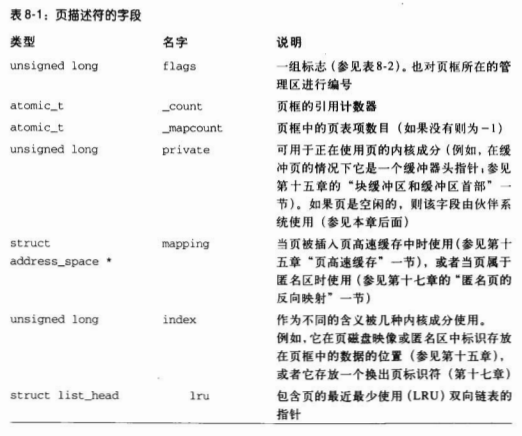
以上_count, 页的引用计数器如果为-1则页框空闲。_count+1表示引用进程的数目。

在页框之上, 内核可以采用三种不同的机制将页框映射到高端内存, 分别叫永久内核映射, 临时内核映射, 及非连续内存分配。page_address()函数返回页框对应的线性地址, 如果页框在高端内存中并且没有被映射则返回NULL, 函数接收一个页描述符指针page作为参数。

#### buddy 伙伴系统算法

内核需要记录页框的状态, 例如分清属于进程的页, 属于内核代码数据的页, 页框是否空闲等信息。这些信息保存在类型为page的页描述符中, 所有的页描述符保存在mem_map数组中。每个页描述符大小为32字节。

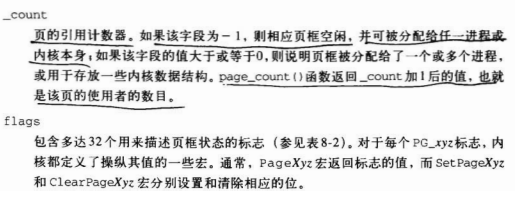

Linux2.6将物理内存划分为三个管理区, 原因在于
1. ISA总线的直接内存存取DMA处理器只能对RAM的前16MB内存寻址
2. 现代32位处理器, CPU不能直接访问所有物理内存, 因为线性地址太小。

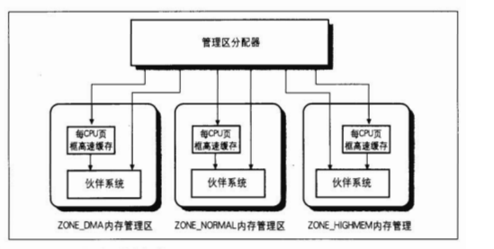

页块分配时, 如果有足够的空闲内存可用, 请求会被立刻满足; 否则必须回收一些内存, 将发出请求的内核控制路径阻塞, 知道有内存被释放。但一些控制路径不能阻塞, 比如原子请求只会分配成功和分配失败。因此, 内核为原子请求保留一个页框池, 在内存不足时使用。

频繁请求和释放不同大小的一组连续页框, 必然导致在已分配页框的块内分散了小块的空闲页框。本质上避免连续页框的方法有两种。

1. 利用分页单元把一组非连续页框映射到连续的地址空间
2. 记录现存空闲连续页框块的情况, 尽量避免小块请求分割大内存块的情况。

基于以下原因, 内核首选第一种办法
1. 某些情况下连续的页框确实是必要的, 例如I/O操作传输硬盘数据时, DMA忽略分页直接访问地址总线, 这样请求的缓冲区必须位于连续的页框中。
2. 频繁访问页表会导致平均访存次数的增加

Linux采用伙伴系统(buddy system)算法解决外部碎片问题。类似于MYSQL, 把所有的空闲页分组为11个块链表, 每个包含块大小为1,2,4,8,16,32,64,128,256,512,1024个连续的页框。1个块对应4kb内存, 1024个块对应4MB大小的RAM块。且每个块的第一个页框地址是该块大小的整数倍。例如大小为16个页框的块, 大小16*2^12(2^12为4kb一个页)的整数倍。

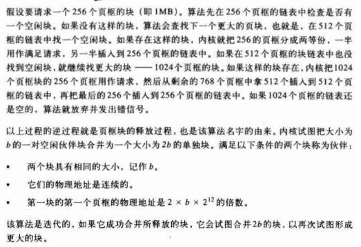

rmqueue()函数用来在管理区找到一个空闲块, 如果页框被成功分配, 函数返回第一个被分配页框的页描述符, 否则返回NULL. free_pages_bulk()函数按照伙伴系统的策略释放页框, 它使用3个基本输入参数。页框描述符地址page, 管理区描述符地址zone order块大小的对数

#### 二级分配slab 算法

基于页的伙伴分配算法采用页框作为基本内存区, 但最小的页块也是4kb; 但对于几十几百字节的小内存区用页框分配是一种浪费, 这种请求内存大小和分配给它大小不匹配造成的是内部碎片internal fragmentation。

一种小内存的二级分配办法是slab分配器。
1. slab算法将内存区看作对象, 且有构造函数初始化内存区, 析构函数回收内存区.slab算法提供小你内存块

2. 释放对象后会保留内存, 以后请求新的对象是可以直接从这块内存获取而不用直接初始化。对于进程也是这样, 因为进程的创建和撤销十分频繁, slab可以把经常分配和释放的页框保存在高速缓存中并重新使用它们, 不用把时间浪费在反复分配和回收进程同一内存区的页框上。

3. slab将对象分组在高速缓存, 高速缓存位于CPU与内存之间的临时存储器，它的容量比内存小的多但是交换速度却比内存要快得多。高速缓存可以划分为若干slab, 每个slab由一个或多个页框组成。页框中包含已分配的对象, 也包含未分配的对象。

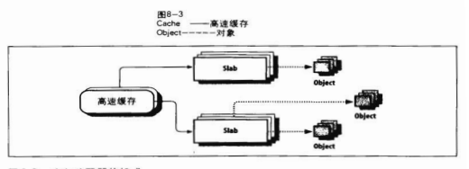

cache中的内存分配以slab为单位的, slab分配器管理的对象可以在内存中对齐, 通常是2的倍数。slab系统与buddy系统所要解决的问题是互补的，一个解决外部碎片一个解决内部碎片, slab在新建cache时同样需要用到buddy来为之分配页框，而在释放cache时也需要buddy来回收这此页面。也就是说，slab事实上是依赖buddy系统的。

在linux中, 获取动态内存是以下函数达到的。`_get_free_pages()`或`alloc_pages()`从分区分配器中获得页框。`kmem_cache_alloc()`或`kmalloc()`使用slab分配器为对象分配块, `vmalloc()`则获得一块非连续的内存区。如果分配成功, 这些函数都返回一个页描述符地址或线性地址。

内核经常请求和释放单个页框, 为了提升性能, 每个内存管理区定义了每CPU页框高速缓存, 它包含一些预先分配的页框, 用于满足本地CPU发出的单一内存请求。包含高速缓存的主内存区被划分为多个slab, 每个slab由一个或多个连续的页框组成。这些页框既包含已分配的对象, 也包含空闲的对象。

slab分配器管理的对象可以在内存中进行对齐, 这样存放它们的内存单元的起始物理地址是一个给定常量的倍数(通常为2的倍数)。

#### 内存分配

vmalloc是一个接口函数, 用来分配虚拟内存中连续但物理内存不一定连续的内存, 内核用一个链表维护vmalloc区域哪些子区域被使用, 哪些子区域空闲，vmalloc目的是分配大内存块且有大量内存碎片下系统仍能工作
```cpp
<vmalloc.h>
void *vmalloc (unsigned long size);
```

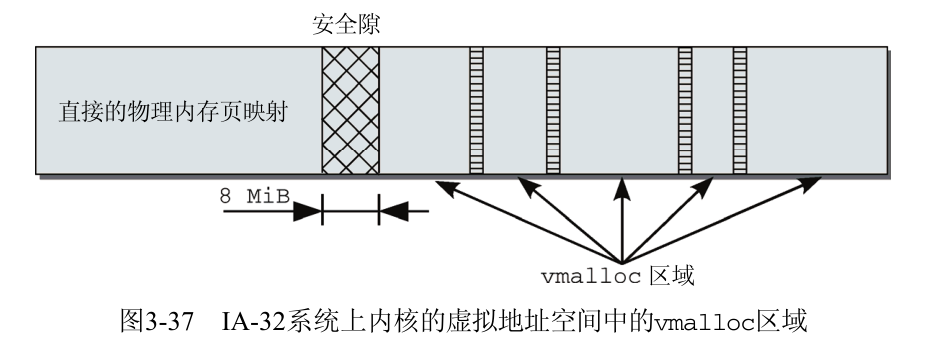
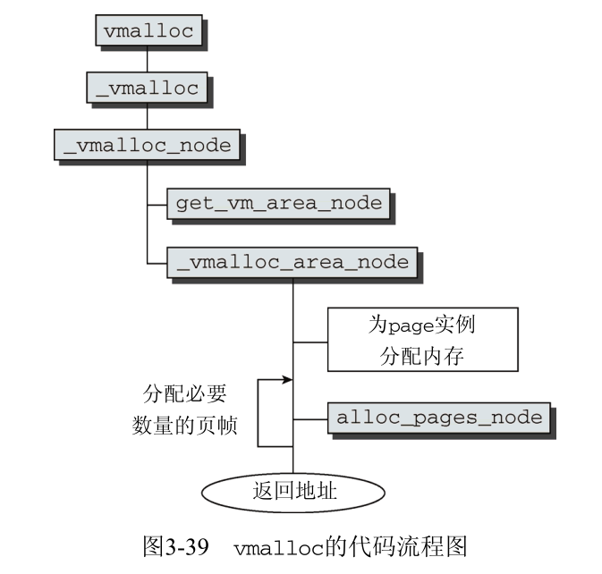

#### 进程地址空间

对内核进程的空间分配是即时的, 首先内核时操作系统优先级最高的成分, 内核请求空间必然会执行; 其次内核信任自己, 不需要错误处理。但是, 对于用户进程空间的分配却类似一个错误处理的过程。主要由两个原则。
1. 用户进程分配尽量推迟, 例如进程调用malloc请求动态内存时不意味着进程很快访问所获得的内存, 内核会尽量推迟给用户态分配内存.
2. 用户进程是不可信任的, 分配空间之前必须保证用户进程请求地址等是正确无误的, 否则不予分配内存直接报错。

用户进程获得新空间大致可能有以下几种情况
1. 用户输入命令, shell进程会创建一个子进程来执行这个命令, 一个线性区分配给了新进程
2. 该进程可能装入一个新的程序(用户自己写的程序), 这样新的线性区被写入。
3. 正在运行的进程可能对文件执行内存映射
4. 进程可能持续向用户态退栈增加数据, 导致堆栈用完, 可能要扩展堆栈大小
5. 进程可能创建IPC共享线性区和其他进程共享数据
6. 进程可能通过malloc这种函数扩展用户态的堆区。

常见的系统调用
```
brk() 改变进程堆的大小
execve() 装入新的可执行文件到进程地址空间
_exit() 结束当前进程并撤销地址空间
fork() 创建新进程, 并创建新的地址空间
mmap() 为文件创建一个内存映射, 扩大内存地址空间
mremap() 扩大或缩小线性区
remap_file_pages()  文件创建非线性映射
munmap() 撤销对文件的内存映射, 缩小内存地址空间
shmat() 创建一个共享线性区
shmdt() 撤销一个共享线性区
```

注意一般用户线程是由shell线程创建的。

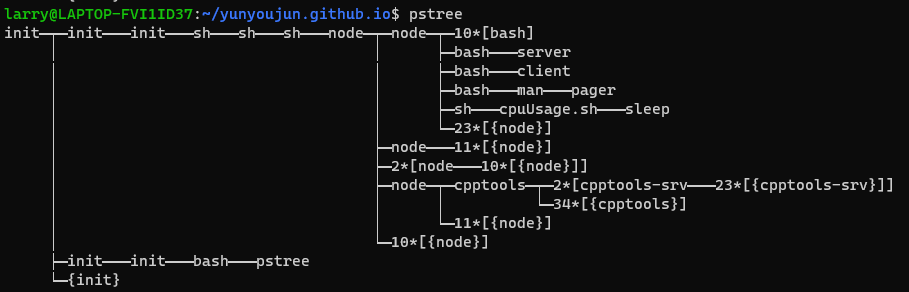

#### 内存描述符
与进程地址空间的全部信息包含在内存描述符memory descriptor的数据结构中, 即mm_struct。

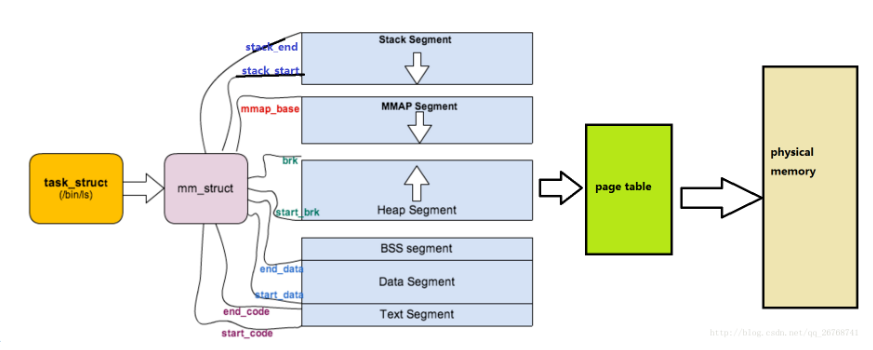

所有的内存描述符放在一个双向链表中, 链表的第一个元素是初始化阶段进程0的内存描述符, mmlist_lock自旋锁保护多处理器系统对链表的同时访问。注意到引用计数在内核中使用十分广泛, 如果没有用户使用内存描述符就解除它。

mm_struct有字段指向线性区链表的头, 说明进程内存空间由若干线性区组成, 这些线性区构成一个链表, 且按照地址大小排序。进程拥有的线性区不会重叠, 并且尽力将新分配的线性区和现有的线性区进行合并。当新的线性区加入到进程地址空间时, 内核检索现存的线性区是否可以扩大, 不能再创建新的线性区。

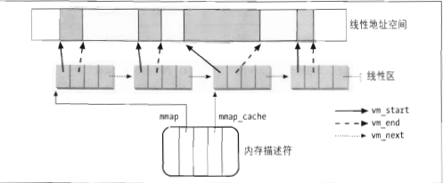

内核频繁执行的一个操作就是查找包含指定线性地址的线性区, 由于链表经过排序, 可以使用二分快速查找。对于一些进程, 例如面向对象的数据库可能会有成百上千线性区, 这时候线性区描述符将用红黑树进行维护方便查找。

`do_map`函数可为当前进程创建并初始化一个新的线性区, `do_munmap()`函数从当前进程地址空间删除一个线性地址空间。线性区和线性区的页框会有flag表示当前页面读写权限等信息

#### 缺页异常处理

Linux的缺页异常处理程序必须区分编程错误引起的异常, 还是由于引用属于进程地址空间但还未分配物理页框引起的异常。缺页异常可能被各种条件触发
1. 内核程序设计错误访问不正确地址, 这是错误但应该永远不会发生
2. 内核通过用户空间传递的系统调用参数, 访问了无效地址
3. 访问使用vmalloc分配的区域, 触发缺页异常


do_page_fault()函数是80X86上的缺页中断服务程序, 它把引起缺页的线性地址和当前进程的线性区比较, 基于线性区描述符便利地知道怎样处理。如果由于内核试图访问不存在地页框引起的异常, 跳转去执行vmalloc_fault。如果address不属于进程的地址空间, 且错误发生在用户态, 则发送一个SIGSEGV信号给current进程。如果错误在内核态, 则需要判断是否是内核缺陷, 如果是则把CPU寄存器和内核态堆栈全部转储打印到控制台, 然后调用函数do_exit()杀死当前进程。

如果address属于进程的地址空间, 则判断被访问的页是否存在。如果不存在, 也就是这个页还没有存放在任何一个页框中, 那么内核分配一个新的页框并初始化, 称之为**请求调页(demand paging)**; 如果访问的页已经存在但标记为只读, 也就是说已经分配在页框中(父进程的页框其实是)。这时候,内存分配新的页框, 把就页框的数据拷贝到新页框来初始化内容, 称之为**写时复制(copy on write)**

由于所有进程都是由父进程创建的(一般是shell进程), 请求调页一般发生在fork()函数时, 缺页处理程序为进程分配新的页框。这个页被标记为不可写的, 子进程这时候读父进程的信息。当进程试图写这个页, 也就是调用exec时, 写时复制被激活, 对进程这个页执行写操作。这种方式原因是如果直接就写, 可能进程用不到这个页, 且这种行为非常耗时。

创建一个进程时内核调用`copy_mm()`函数, 通过建立新进程的所有页表和内存描述符来创建进程的地址空间。传统进程继承父进程地址空间, 只要页框是只读的, 就依然共享, 直到进程对某个页执行写时这个页被复制一份给自己的页框。进程结束时`exit_mm()`释放进程的地址空间。

* 堆的管理

```
malloc(size) 请求size字节的动态内存, 分配成功返回分配单元的第一个字节的地址
calloc(n, size) 请求连续含有n个大小为size的元素的数组, 返回第一个元素地址
realloc(ptr, size) 修改malloc, calloc分配的大小
free(addr) 释放malloc或calloc分配的线性区
brk(addr) 直接修改堆的大小, addr指定current->mm->brk的新值, 返回线性区结束地址
sbrk(incr) incr参数指定增加还是减小以字节为单位的堆大小
```

brk()是系统调用函数, 其他函数都是使用`brk()`和`nmap()`系统调用实现的C库函数。用户态进程调用`brk()`系统调用时, 内核执行`sys_brk(addr)`函数。如果是缩小堆, `sys_brk()`调用`do_munmap()`函数完成; 如果请求扩大堆, `sys_brk()`首先检测是否合法, 合法则调用`do_brk()`函数, 如果返回oldbrk说明分配成功返回addr的值。

### I/O

#### 设备

Linux中，设备类型可以分为：字符设备、块设备和网络设备。

字符设备提供连续的数据流，应用程序可以顺序读取，通常不支持随机存取。相反，此类设备支持按字节/字符来读写数据。举例来说，键盘、串口、调制解调器都是典型的字符设备

块设备可以随机访问数据，程序可自行确定读取数据的位置。硬盘、软盘、CD-ROM驱动器和闪存都是典型的块设备, 数据的读写只能以块(通常是512B)的倍数进行。

网络设备是特殊设备的驱动，它负责接收和发送帧数据，可能是物理帧，也可能是ip数据包，这些特性都有网络驱动决定。
