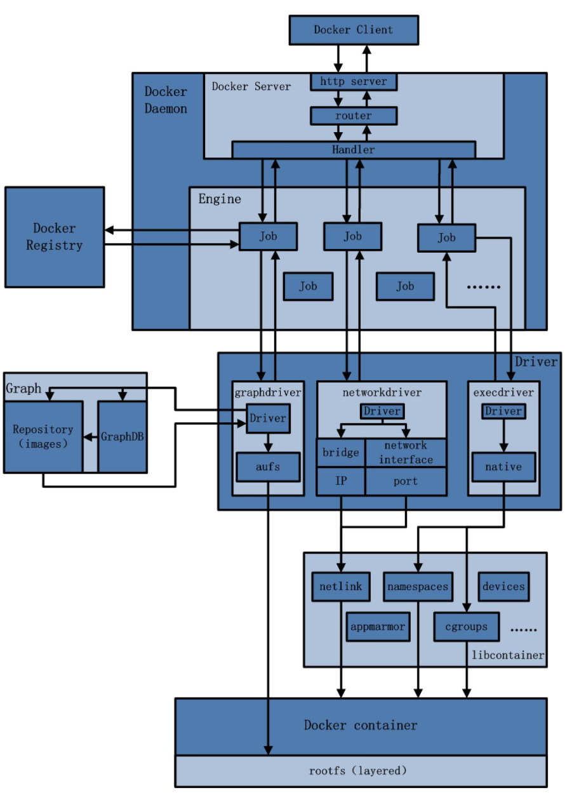
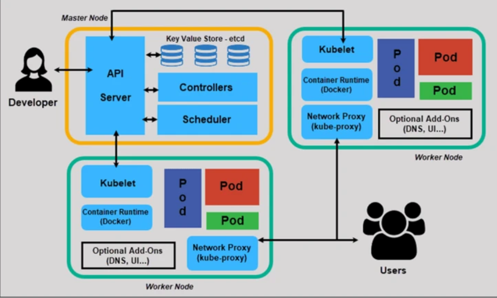
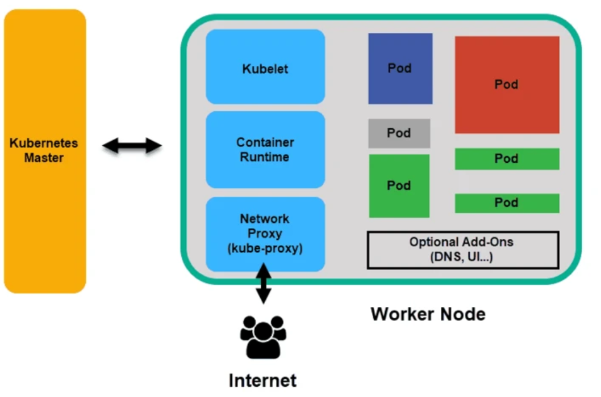
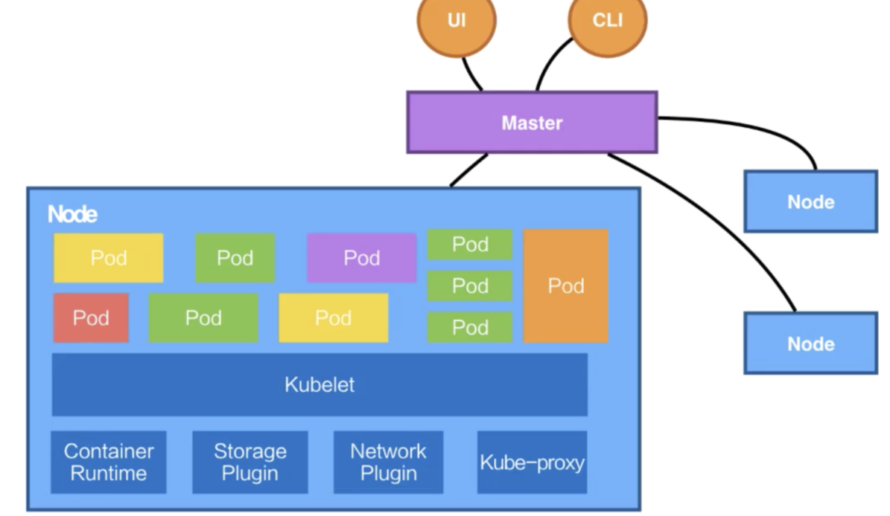
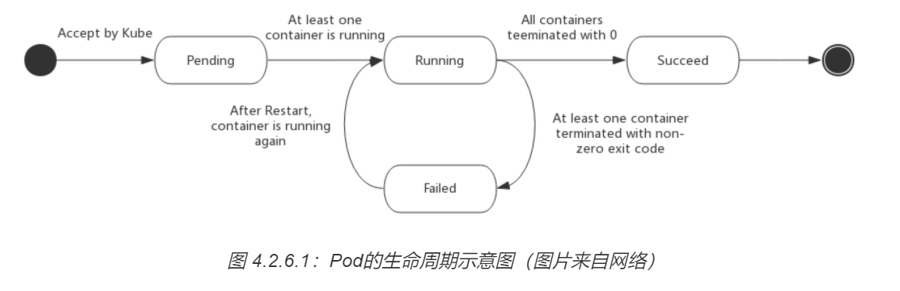
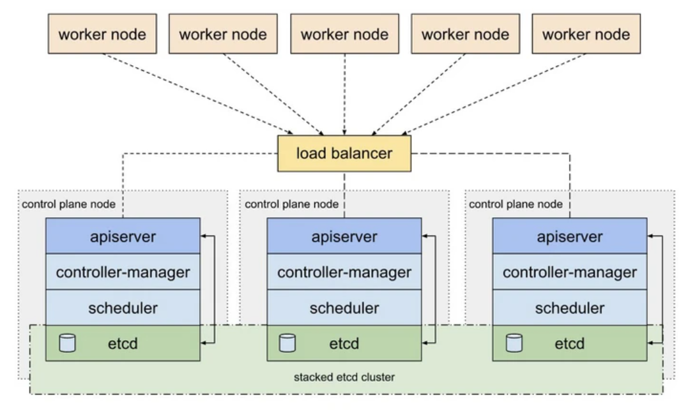
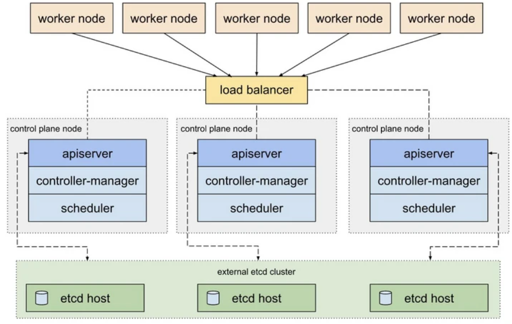
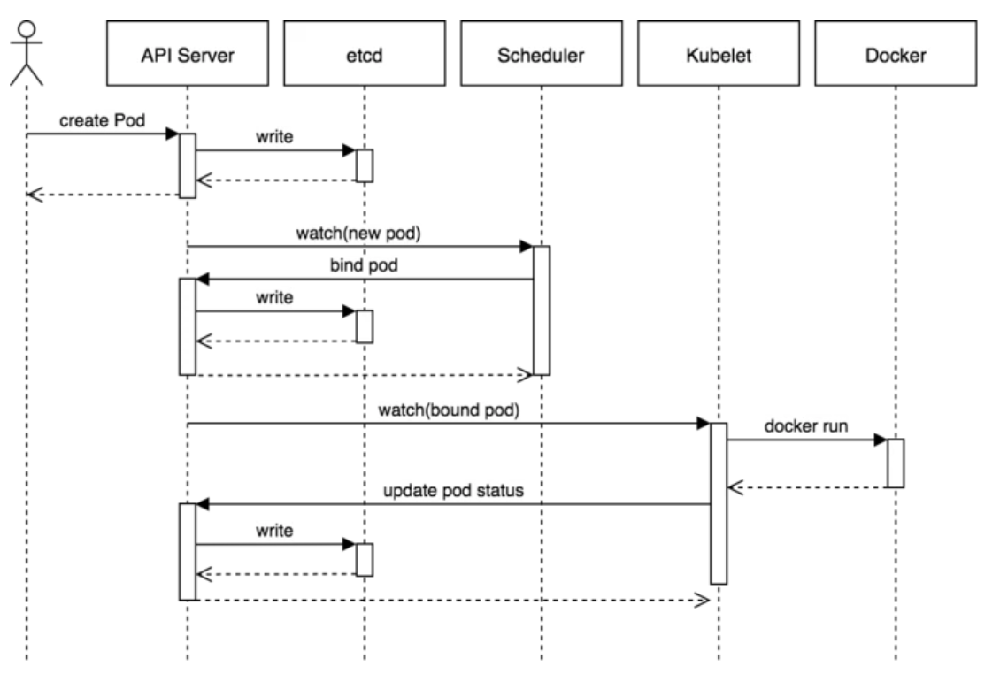
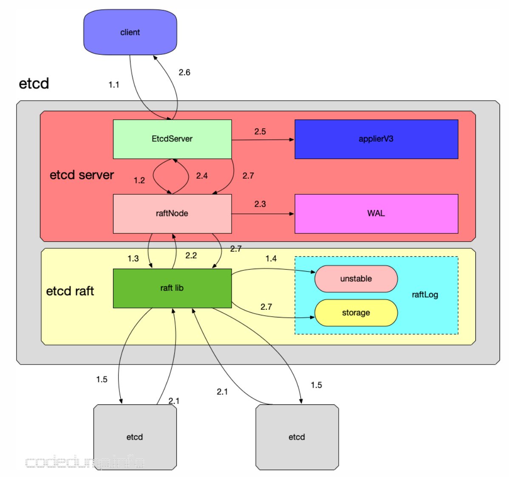

> 参考https://jimmysong.io/kubernetes-handbook

### 云计算

#### 云计算模型

基础设施即服务 (IaaS), 包含云 IT 的基本构建块，通常提供对联网功能、计算机（虚拟或专用硬件）以及数据存储空间的访问。一般IaaS公司会提供场外服务器，存储和网络硬件，你可以租用。

平台即服务 (PaaS), 平台即服务消除了组织对底层基础设施（一般是硬件和操作系统）的管理需要，让您可以将更多精力放在应用程序的部署和管理上面。PaaS层服务一般提供是资源的调度, 管理, 包括各种框架, CI工具, 开发者可以直接在上面编写程序(某种意义上微信小程序开发就是PaaS层服务)

软件即服务 (SaaS), 软件即服务提供了一种完善的产品，其运行和管理皆由服务提供商负责。这作为消费者的服务, 所有网络服务器都可进行服务

kubernetes是管理container的工具，openstack是管理VM的工具。container可以运行在物理机上，也可以运行在VM上。所以kubernetes不是需要openstack的支持。但对于云计算来说，很多IasS都通过openstack来管理虚拟机。然后用户可以在这些虚拟机上运行docker，可以通过kubernetes进行管理。
### docker

#### 架构



1. 用户是使用Docker Client与Docker Daemon建立通信，并发送请求给后者。
2. Docker Daemon作为Docker架构中的主体部分, 首先提供Server的功能使其可以接受Docker Client的请求；
3. Engine执行Docker内部的一系列工作，每一项工作都是以一个Job的形式的存在。
4. Job的运行过程中，当需要容器镜像时，则从Docker Registry中下载镜像，并通过镜像管理驱动graphdriver将下载镜像以Graph的形式存储；
5. Driver用作Job执行, 上面的graphdriver用于获取docker镜像, networkdriver用来完成Docker容器网络环境的配置; execdriver作为Docker容器的执行驱动, 负责创建容器运行命名空间, 负责容器内部进程的真正运行等。

层次: client->http server->router->Handler->Job->driver

Docker前台的逻辑并不复杂, 可以理解为C/S模式的调度模式。Docker image存储在Graph图数据库中, 它实现了节点的命名以及节点之间关联关系的记录。对应的是graphdriver用于, 完成容器镜像的管理，包括存储与获取。docker一般是点对点的, docker server和docker client和mysql server和mysql client概念类似, docker的driver可以进一步抽象成执行任务的进程, 例如web服务, 数据库等

以上整体作为一个container发布, 由此可以看出docker container可以认为是一种服务器, 它拥有的资源在linux中是相互隔离的。它可以接受用户的命令并交由linux内核执行, container的资源不用担心被其他影响。

#### 资源隔离

linux系统许多设计都十分超前, namespace就是一个例子。linux内将系统资源放在不同的Namespace中，来实现资源隔离的目的。namespace存在于linux每个进程之中用于进程的隔离, 根据资源不同, linux的namespace大致可以分为以下六类

```
Mount: 隔离文件系统挂载点
UTS: 隔离主机名和域名信息
IPC: 隔离进程间通信
PID: 隔离进程的ID
Network: 隔离网络资源
User: 隔离用户和用户组的ID
```

可以用`clone`在创建进程时设置进程的namespace, 从而将进程资源隔离。pthread_create, fork等内部都是clone()来创建进程

```cpp
int clone(int (*child_func)(void *), void *child_stack, int flags, void *arg);

flags = CLONE_NEWNS | CLONE_NEWUTS | CLONE_NEWIPC;

//传入这个flags那么新创建的进程将同时拥有独立的Mount Namespace、UTS Namespace和IPC Namespace。
```

UTS namespace提供了主机名和域名的隔离，这样每一个容器就可以拥有独立的主机名和域名，在网络上可以被视为一个独立的节点, 虽然实际上是进程。

IPC Namespace提供了进程通信的隔离, 容器中进程间的通信采用的方式包括: 信号量，消息队列和共享内存。在同一个IPC namespace下的进程彼此可见，而与其他的IPC namespace下的进程则互相不可见。

PID namespace实现进程PID的隔离, 使两个不同的namespace下的进程可以拥有同一个PID。PID namespace形成层级的体系。父节点可以看到子节点中的进程，并可以通过信号等方式对子节点中的进程产生影响。而子节点不能看到父节点PID namespace中的任何内容。

Mount namespace通过隔离文件系统挂载点对隔离文件系统提供支持。一个namespace的进程修改了文件系统, 其他namespace的进程不受印象

Net namespace主要提供关于网络资源的隔离，包括网络设备IPv4和IPv6协议栈，IP路由表，防火墙等。

User namespace主要隔离了安全相关的标识符和属性，包括用户ID,用户组ID,root目录等。这种隔离实现了普通用户在容器内可以作为root用户存在, 可以以root身份访问容器进程所属的资源, 这个技术为容器提供了极大的自由。

<!--more -->

### kubernetes

docker在云原生中以进程簇构成的容器提供了计算, 资源; kubernetes作用是管理调度docker容器, 起到集群操作系统的作用。



初始化过程

* 管理员创建应用程序的所需状态并将其放入清单文件manifest.yml中。
* Kubernetes将清单文件（描述了应用程序的期望状态）存储在称为键值存储(etcd)的数据库中。
* Kubernetes随后在集群内的所有相关应用程序上实现所需的状态, Kubernetes持续监控集群的元素，以确保应用程序的当前状态不会与所需状态有所不同。

#### 主节点

Kubernetes的主节点通过API从CLI（命令行界面）或UI（用户界面）接收输入。这些是你提供给Kubernetes的命令。可以定义想要让Kubernetes维护的Pod，副本集和Service。例如，要使用的容器镜像，要公开的端口以及要运行的Pod副本数量。还可以为该集群中运行的应用程序提供"所需状态"的参数。

API Server是Kubernetes控制程序的前端，也是用户唯一可以直接进行交互的Kubernetes组件，内部系统组件以及外部用户组件均通过相同的API进行通信。

键值存储etcd

etcd是Kubernetes用来备份所有集群数据的数据库, 是一种分布式数据库。它存储集群的整个配置和状态。主节点查询etcd以检索节点，容器和容器的状态参数。

Controller

控制器的作用是从API Server获得所需状态。它检查要控制的节点的当前状态，确定是否与所需状态存在任何差异

Scheduler

调度程序会监视来自API Server的新请求，并将其分配给运行状况良好的节点。它对节点的质量进行排名，并将Pod部署到最适合的节点。如果没有合适的节点，则将Pod置于挂起状态，直到出现合适的节点。

#### 工作节点

工作节点监听API Server发送过来的新的工作分配；他们会执行分配给他们的工作，然后将结果报告给Kubernetes主节点。



Kubelet

kubelet在群集中的每个节点上运行。它是Kubernetes内部的主要代理。通过安装kubelet，节点的CPU，RAM和存储成为所处集群的一部分。它监视从API Server发送来的任务，执行任务，并报告给主节点。它还会监视Pod，如果Pod不能完全正常运行，则会向控制程序报告。

Container Runtime

容器运行时从容器镜像库中拉取镜像，然后启动和停止容器。容器运行时由第三方软件或插件（例如Docker）担当。

Kube-proxy

kube-proxy确保每个节点都获得其IP地址，实现本地iptables和规则以处理路由和流量负载均衡。

Pod

在Kubernetes中，Pod是调度的最小元素。没有它，容器就不能成为集群的一部分。如果你需要扩展应用程序，则只能通过添加或删除Pod来实现。

Pod是Kubernetes中一个抽象化概念，由一个或多个容器组合在一起得共享资源。根据资源的可用性，主节点会把Pod调度到特定工作节点上，并与容器运行时协调以启动容器。

在Pod意外无法执行任务的情况下，Kubernetes不会尝试修复它们。相反，它会在其位置创建并启动一个新Pod。这个新Pod是原来的副本，除了DNS和IP地址都和以前的Pod一样。由于Kubernetes架构的灵活性，不再需要将应用程序绑定到Pod的特定实例。取而代之的是，需要对应用程序进行设计，以便在集群内任何位置创建的全新Pod可以无缝取代旧Pod。Kubernetes会使用Service来协助此过程。


综上

1. API Server： 顾名思义是用来处理 API 操作的，Kubernetes 中所有的组件都会和 API Server 进行连接，组件与组件之间一般不进行独立的连接，都依赖于 API Server 进行消息的传送；
2. Controller： 是控制器，它用来完成对集群状态的一些管理。比如刚刚我们提到的两个例子之中，第一个自动对容器进行修复、第二个自动进行水平扩张，都是由 Kubernetes 中的 Controller 来进行完成的；
3. Scheduler： 是调度器, 即就是完成调度的操作, 分布式锁的作用
4. etcd： 是一个分布式的一个存储系统，API Server 中所需要的这些元信息都被放置在 etcd 中，etcd 本身是一个高可用系统，**通过 etcd 保证整个 Kubernetes 的 Master 组件的高可用性**。
6. Pod是Kubernetes中能够创建和部署的最小单元，是Kubernetes集群中的一个应用实例，部署在同一个节点Node上。 Pod中包含了一个或多个容器，还包括了存储、网络等各个容器共享的资源。 



#### Pod

Pob可能的状态

挂起（Pending）：Pod 已被 Kubernetes 系统接受，但有一个或者多个容器镜像尚未创建。等待时间包括调度 Pod 的时间和通过网络下载镜像的时间，这可能需要花点时间。

运行中（Running）：该 Pod 已经绑定到了一个节点上，Pod 中所有的容器都已被创建。至少有一个容器正在运行，或者正处于启动或重启状态。

成功（Succeeded）：Pod 中的所有容器都被成功终止，并且不会再重启。

失败（Failed）：Pod 中的所有容器都已终止了，并且至少有一个容器是因为失败终止。也就是说，容器以非0状态退出或者被系统终止。

未知（Unknown）：因为某些原因无法取得 Pod 的状态，通常是因为与 Pod 所在主机通信失败。



Pod 能够具有多个容器，应用运行在容器里面，但是它也可能有一个或多个先于应用容器启动的 Init 容器。

Pod 中共享的环境包括 Linux 的 namespace、cgroup 和其他可能的隔绝环境，这一点跟 Docker 容器一致。在 Pod 的环境中，每个容器中可能还有更小的子隔离环境。

Pod 中的容器共享 IP 地址和端口号，它们之间可以通过 localhost 互相发现。它们之间可以通过进程间通信，例如 SystemV 信号或者 POSIX 共享内存。不同 Pod 之间的容器具有不同的 IP 地址，不能直接通过 IPC 通信。
### etcd

在Kubernetes世界中，etcd用作服务发现的后端，并存储集群的状态及其配置。Etcd被定义为分布式，可靠的键值存储，用于分布式系统中最关键的数据。

Etcd被部署为一个集群，几个节点的通信由Raft算法处理。在生产环境中，集群包含奇数个节点，并且至少需要三个。

在Kubernetes集群的上下文中，etcd实例可以作为Pod部署在master节点上, 维护master节点在元数据上的一致性



为了增加安全性和弹性，etcd也可以将其部署为外部集群。


etcd更多意义上是维持master节点的一致性

#### 架构

Etcd 是K8S必不可少的键值元存储系统, 是一个高可用的分布式键值(key-value)数据库。etcd内部采用raft协议作为一致性算法，基于Go语言实现。etcd在使用场景上和zookeeper类似, 但作为后起之秀, 其性能, 应用上强于zookeeper。


上面这张图可以看到etcd的基本架构和处理过程, 当leader 节点接受到请求时

1. etcd server收到客户端请求。
2. etcd server内部有一个raftnode对象, raftnode可以通过go channel来与raft lib模块信息交互, 后者用于执行raft协议的一致性策略。
2. raft lib可以通过rpc和外界raft lib交互, 以复制日志的信息, 这里遵循raft协议。raft模块会首先保存到raftLog的unstable存储部分。

读操作不需要走Leader的raft共识算法，直接通过读事务读取存储层的KV(或者通过负载均衡到某个follower上读); 写操作首先需要通过raft集群的共识算法，共识算法达成一致之后，leader和follower会apply写操作日志，然后向上进入etcd的KV存储层进行写操作。这样保证了leader和follower节点数据的一致性。

某种程度上etcd认为是httpserver, grpc, raft, 存储模块的融合。raft协议细节可以参考博文`分布式系统基础理论`。

etcd server和raft server用go channel来进行数据的交互
```go
for {
  select {
    case m := <-propc:
        r.Step(m)
    case m := <-n.recvc:
        r.Step(m)
    case cc := <-n.confc:
        // Add/remove/update node according to cc.Type
    case <-n.tickc:
        r.tick()
    case readyc <- rd:
        // Cleaning after result is consumed by application
    case <-advancec:
        // Stablize logs
    case c := <-n.status:
        // Update status
    case <-n.stop:
        close(n.done)
        return
    }
}
```

#### Rpc的内容

raft进行一致性通信时使用的是grpc, 同时使用了protobuf进行序列化。序列化的内容主要有下

Entry是构造日志的条目, 主要的内容就是Term和Index, 分别表示当前leader处于的任期(递增的), 当前entry在整个raft日志中的位置索引。Data表示一个被序列化后的byte数组，代表当前entry真正要执行的操作。

Term和Index可以唯一标志一个log entry。
```go
type Entry struct {
    Term             uint64
    Index            uint64
    Type             EntryType
    Data             []byte
}
```

Message则是rpc传输的信息, 也就是leader向follower发送的命令, 内部包含了Entry; 
```go
type Message struct {
    Type             MessageType
    To               uint64
    From             uint64
    Term             uint64
    LogTerm          uint64
    Index            uint64
    Entries          []Entry
    Commit           uint64
    Snapshot         Snapshot
    Reject           bool
    RejectHint       uint64
    Context          []byte
}
// To, From分别代表了这个消息的接受者和发送者。
// Term：这个消息发出时整个集群所处的任期。
// LogTerm：消息发出者所保存的日志中最后一条的任期号
// Index：日志索引号。它跟LogTerm一起代表这个candidate所拥有的最新日志信息，从而可以比较自己的日志是不是比candidata的日志要新，从而决定是否投票。
// Entries：需要存储的日志, follower如果不一样会强制复制
// Commit：已经提交的日志的索引值，用来向别人同步日志的提交信息
```

#### log

log遵循两阶段提交, 一条日志数据，对于leader来说先会被提交(committed)，接着进行一致性协调, 成功之后才能被应用(applied)到状态机中。

log在物理上也分为内存的数据和持久化的数据, unstable数据结构用于位于内存还未持久化的数据。而持久化的数据etcd实际上只给出了`Storage`接口要用户实现。

```go
type Storage interface {
	// InitialState returns the saved HardState and ConfState information.
	InitialState() (pb.HardState, pb.ConfState, error)
	// Entries returns a slice of log entries in the range [lo,hi).
	// MaxSize limits the total size of the log entries returned, but
	// Entries returns at least one entry if any.
	Entries(lo, hi, maxSize uint64) ([]pb.Entry, error)
	// Term returns the term of entry i, which must be in the range
	// [FirstIndex()-1, LastIndex()]. The term of the entry before
	// FirstIndex is retained for matching purposes even though the
	// rest of that entry may not be available.
	Term(i uint64) (uint64, error)
	// LastIndex returns the index of the last entry in the log.
	LastIndex() (uint64, error)
	// FirstIndex returns the index of the first log entry that is
	// possibly available via Entries (older entries have been incorporated
	// into the latest Snapshot; if storage only contains the dummy entry the
	// first log entry is not available).
	FirstIndex() (uint64, error)
	// Snapshot returns the most recent snapshot.
	// If snapshot is temporarily unavailable, it should return ErrSnapshotTemporarilyUnavailable,
	// so raft state machine could know that Storage needs some time to prepare
	// snapshot and call Snapshot later.
	Snapshot() (pb.Snapshot, error)
}
```

为了防止log内容过多, 实现了log compaction通过snapshot来清理log。即把状态机的当前状态写入 snapshot 中，然后清理相应的 log。同时需要记录 snapshot 中最后一个 entry 的 index 和 term , 用于 AppendEntries 的 check 和 snapshot 与 log 的比较。


除了raft用于一致性协调的复制日志外, 还有一种日志是在etcd server和raft server通信产生的。raft server在向etcd回复应答数据之前，raft server会首先将这些数据写入WAL日志中防止数据丢失
```go
type storage struct {
	*wal.WAL
	*snap.Snapshotter
}
```

除了WAL日志数据的存储、raft日志的存储, 剩下的存储就是key-value数据的存储。称之为backend store。etcd默认使用BoltDB来作为存储引擎, 这是一个用B+树组织,go实现的key-value数据库。

#### leader选举

Election timeout, 超时会调用选举逻辑, 通过一个tick, 如果调用 tick 的次数超过指定次数时触发超时事件

```go
func (r *raft) tickElection() {
	r.electionElapsed++

	if r.promotable() && r.pastElectionTimeout() {
		r.electionElapsed = 0
		r.Step(pb.Message{From: r.id, Type: pb.MsgHup}) // 表示发送需要选举的rpc, 这是follower唯一能发送的rpc
	}
}
```

然后超时的节点会调用becomeCandidate把自己切换到candidate模式，并递增Term值。然后再将自己的Term及日志信息发送给其他的节点，请求投票。注意不超时节点尚在follower状态, 这避免了同时刻出现大量candidate使投票不过半。
```go
func (r *raft) campaign(t CampaignType) {
    //...
    r.becomeCandidate()
    // Get peer id from progress
    for id := range r.prs {
        //...
        r.send(pb.Message{Term: term, To: id, Type: voteMsg, Index: r.raftLog.lastIndex(), LogTerm: r.raftLog.lastTerm(), Context: ctx})
    }
}
```

其他节点在接受到这个请求后，会首先比较接收到的Term是不是比自己的大，以及接受到的日志信息是不是比自己的要新，从而决定是否投票。如果大量节点不能投票, 会慢慢继续有超时的节点申请称为candidate, 直到某个candidate被投票称为leader。

```go
func (r *raft) Step(m pb.Message) error {
    //...
    switch m.Type {
    case pb.MsgVote, pb.MsgPreVote:
        // We can vote if this is a repeat of a vote we've already cast...
        canVote := r.Vote == m.From ||
            // ...we haven't voted and we don't think there's a leader yet in this term...
            (r.Vote == None && r.lead == None) ||
            // ...or this is a PreVote for a future term...
            (m.Type == pb.MsgPreVote && m.Term > r.Term)
        // ...and we believe the candidate is up to date.
        if canVote && r.raftLog.isUpToDate(m.Index, m.LogTerm) {
            r.send(pb.Message{To: m.From, Term: m.Term, Type: voteRespMsgType(m.Type)})
        } else {
            r.send(pb.Message{To: m.From, Term: r.Term, Type: voteRespMsgType(m.Type), Reject: true})
        }
    }
}
```

当candidate节点收到投票回复后，就会计算收到的选票数目是否大于所有节点数的一半，如果大于则自己成为leader，并昭告天下，否则将自己置为follow
```go
func (r *raft) Step(m pb.Message) error {
    //...
    switch m.Type {
    case myVoteRespType:
        gr := r.poll(m.From, m.Type, !m.Reject)
        switch r.quorum() {
        case gr:
            if r.state == StatePreCandidate {
                r.campaign(campaignElection)
            } else {
                r.becomeLeader()
                r.bcastAppend()
            }
        case len(r.votes) - gr:
            r.becomeFollower(r.Term, None)
    }
}
```

#### 写操作的执行过程

如果当前server是follower，那它会把这个消息转发给leader。
```cpp
func stepFollower(r *raft, m pb.Message) error {
    switch m.Type {
    case pb.MsgProp:
        //...
        m.To = r.lead
        r.send(m)
    }
}
```

Leader收到这个消息后（不管是follower转发过来的还是自己内部产生的）会有两步操作：
1. 将这个消息添加到自己的log里
2. 向其他follower广播这个消息
```go
func stepLeader(r *raft, m pb.Message) error {
    switch m.Type {
    case pb.MsgProp:
        //...
        if !r.appendEntry(m.Entries...) {
            return ErrProposalDropped
        }
        r.bcastAppend()
        return nil
    }
}
```

在follower接受完这个log后，会返回一个MsgAppResp消息。

当leader确认已经有足够多的follower接受了这个log后，它首先会commit这个log，然后再广播一次，告诉别人它的commit状态。一旦leader将自己的log提交到状态机就是不可变的, 这意味着leader和follower在log上具有了一致性。但是注意只是对当前提交的entry具有一致性, 过去提交的可能否。因此Leader崩掉, **follower得选择term,index比自己大的当leader。因为有可能崩掉的leader存在日志尚未提交而follower日志处于不一致**, raft保证term,index比自己大的节点肯定包含自己的日志, 不论是否提交。

如果在提交状态机时发生信息丢失, 会通过 WAL 日志恢复。如果leader挂掉, 会重新选举leader。

```go
func stepLeader(r *raft, m pb.Message) error {
    switch m.Type {
    case pb.MsgAppResp:
        //...
        if r.maybeCommit() {
            r.bcastAppend()
        }
    }
}

// maybeCommit attempts to advance the commit index. Returns true if
// the commit index changed (in which case the caller should call
// r.bcastAppend).
func (r *raft) maybeCommit() bool {
    //...
    mis := r.matchBuf[:len(r.prs)]
    idx := 0
    for _, p := range r.prs {
        mis[idx] = p.Match
        idx++
    }
    sort.Sort(mis)
    mci := mis[len(mis)-r.quorum()]
    return r.raftLog.maybeCommit(mci, r.Term)
}
```