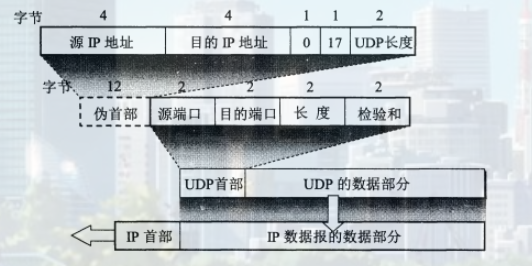
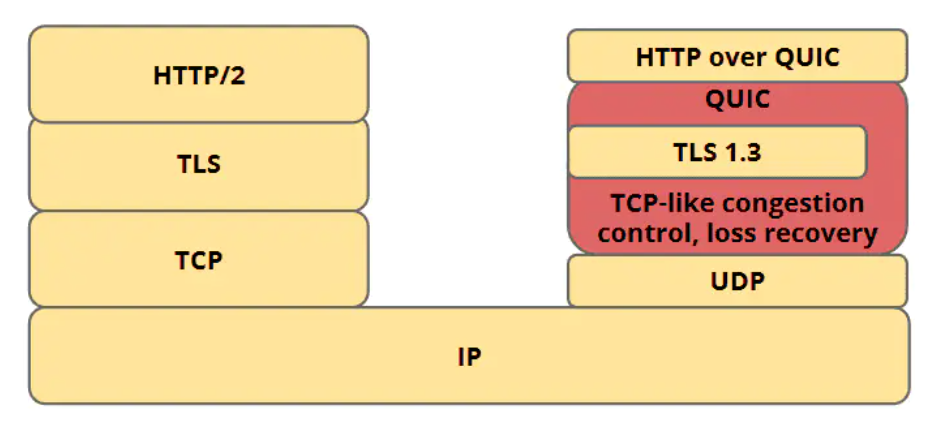
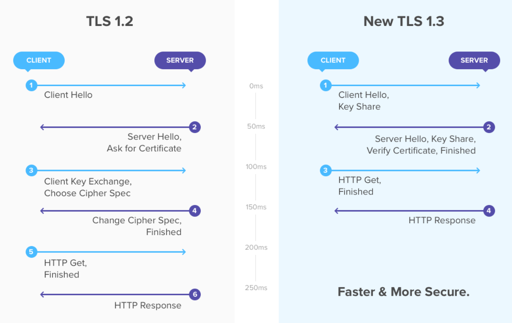
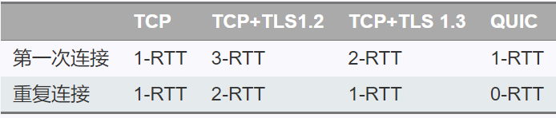
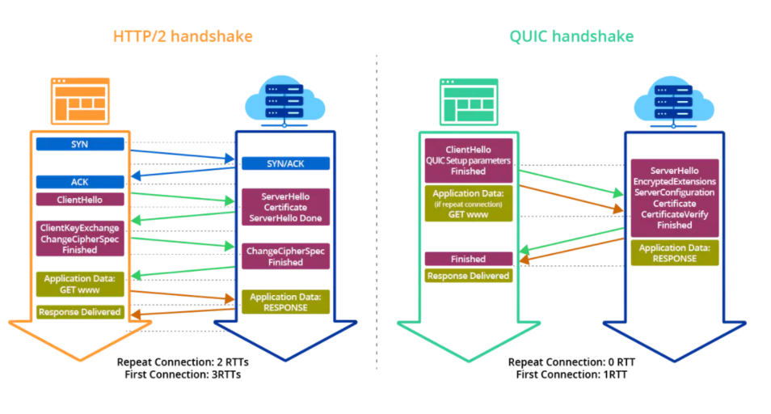
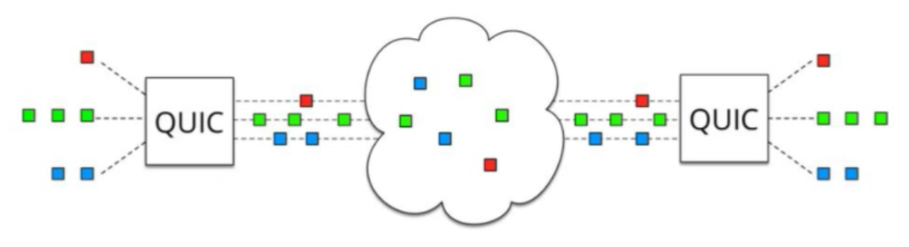

> 新兴的网络协议主要是4G时代发挥作用的可靠UDP协议和视频传输协议

### 可靠UDP

流传输协议, 例如TCP, 对于发送方多次发送的包都是可靠的，有序的，和流水顺序一样。

包传输协议, 例如UDP, 发送发多次发送的包，无序，有可能确实, 相邻之间没有关联。

#### 可靠协议

实现可靠传输一般有两种途径，一是基于ARQ（Automatic Repeat reQuest）的确认和重传机制，二是使用前向纠错（FEC）。

FEC是纠删码在通信中的应用，一般在链路层用的比较多，特别是无线通信中（包括WiFi，移动通信、卫星通信等）。可靠UDP传输主要还是依靠重传机制，个别协议会用FEC作为辅助手段.

ARQ包括停等式、回退N帧、选择重传等机制。由于停等式的效率太低, TCP和可靠UDP协议一般使用的是基于回退N帧机制和滑动窗口协议的连续式ARQ，TCP后来也引入了SACK，以提高性能。

滑动窗口是一种流量控制技术，接收方可以通过反馈来指示发送方调节数据发送的速度。TCP中使用滑动窗口协议来控制发送的数据量，达到理想的传输速度。

拥塞算法主要是计算和调整接收窗口、发送窗口、拥塞窗口的大小，从而控制传输速度, 既充分利用带宽, 又避免网络出现拥塞。拥塞算法的核心机制有: 

慢启动, 拥塞避免, 快重传(收到连续3次重复的ACK确认，就认为出现了丢包), 快恢复(Tahoe检测到丢包后，会回到初始状态，然后进入慢启动阶段，导致传输效率太低。Reno对此作了改进，在检测到丢包后，直接进入拥塞回避阶段，将窗口大小调整为原来的一半，避免了慢启动的开销。)

拥塞算法的思想是, 基于丢包, 基于超时, 显式拥塞通知。

#### UDP协议

UDP有两个字段：数据字段和首部字段。首部字段很简单，只有8个字节，由4个字段组成，每个字段的长度都是两个字节。
1. 源端口：源端口号。在需要对方回信时选用。不需要时可用全0。
2. 目的端口：目的端口号。这在终点交付报文时必须要使用到。
3. 长度： UDP用户数据报的长度，其最小值是8（仅有首部），发送一个带0字节数据的UDP数据报是允许的。
4. 校验和：检测UDP用户数据报在传输中是否有错。有错就丢弃。

如果接收方 UDP发现报文中的目的端口号不正确（即不存在对应于该端口号的应用进程），就丢弃该报文，并由网际控制报文协议 ICMP 发送"端口不可达"差错报文给发送方。

UDP是无连接的, 也没有拥塞控制, 流量控制, 可靠传输等特性。

1. UDP 是无连接的，即发送数据之前不需要建立连接，因此减少了开销和发送数据之前的时延。
2. UDP 使用尽最大努力交付，即不保证可靠交付，因此主机不需要维持复杂的连接状态表。
3. UDP 是面向报文的。发送方的UDP对应用程序交下来的报文，在添加首部后就向下交付IP层。UDP对应用层交下来的报文，既不合并，也不拆分，而是保留这些报文的边界。因此，应用程序必须选择合适大小的报文。
4. UDP 没有拥塞控制，因此网络出现的拥塞不会使源主机的发送速率降低。很多的实时应用（如IP电话、实时视频会议等）要去源主机以恒定的速率发送数据，并且允许在网络发生拥塞时丢失一些数据，但却不允许数据有太多的时延。UDP正好符合这种要求。
5. UDP 支持一对一、一对多、多对一和多对多的交互通信。
6. UDP 的首部开销小，只有8个字节，比TCP的20个字节的首部要短。

应用进程可以在不影响应用的实时性的前提下,增加些提高可靠性的措施,如采用前向纠错或重传已丢失的报文。同时增加简单拥塞控制的功能, 因为不使用拥塞控制功能的UDP有可能会引起网络产生严重的拥塞问题。

#### UDT

UDP-based Data Transfer Protocol，简称UDT, UDT的主要目的是支持高速广域网上的海量数据传输，而互联网上的标准数据传输协议TCP在高带宽长距离网络上性能很差。 顾名思义，UDT建于UDP之上，并引入新的拥塞控制和数据可靠性控制机制。UDT是面向连接的双向的应用层协议。它同时支持可靠的数据流传输和部分可靠的数据报传输。 

面向连接的协议, 面向连接意味着两个使用协议的应用在彼此交换数据之前必须先建立一个连接，UDT是逻辑上存在的连接通道。这种连接的维护是基于握手、Keep-alive（保活）以及关闭连接。

可靠的协议, 依靠包序号机制、接收者的ACK响应和丢包报告、ACK序号机制、重传机制(基于丢包报告和超时处理)来实现数据传输的可靠性。

双工的协议, 每个UDT实例包含发送端和接收端的信息。

新的拥塞算法, 不同于基于窗口的TCP拥塞控制算法(慢启动和拥塞避免)，是混合的基于窗口的、基于速率的拥塞控制算法。网络带宽是指在单位时间（一般指的是1秒钟）内能传输的数据量。发送者根据流量控制和速率控制来发送（和重传）应用程序数据。接收者接收数据包和控制包，并根据接收到的包发送控制包。

使用定时器触发不同的事件, 四种定时器, rate control, ACK, NAK and retransmission timer. Rate control and ACK are triggered periodically, NAK timer is used to resend loss information if retransmission is not received 

#### UTP

μTP（Micro Transport Protocol）是一个由BitTorrent公司开发的协议。它在UDP之上实现可靠传输与拥塞控制等特性。μTP的拥塞控制算法，Ledbat，能 在缩短网络延迟和减少拥塞的同时最大化网络吞吐量。

µTP 通过将 modem 的缓冲队列的大小作为一个控制因子来调整发送速率，当队列过大时，将会放慢发送速度。这种策略使得 BT 在没有竞争的情况下可以充分利用上传带宽，在有大量其他流量的情况下则放慢发送速率。

<!--more -->

### QUIC协议

quick udp internet connection, QUIC, 由google 提出的使用 udp 进行多路并发传输的协议。QUIC协议是一系列协议的集合，主要包括, 传输协议(Transport), 丢包检测与拥塞控制(Recovery), 安全传输协议(TLS), HTTP3协议, HTTP头部压缩协议(QPACK), 负载均衡协议(Load Balance)

QUIC是在UDP的基础上，构建类似TCP的可靠传输协议。HTTP3则在QUIC基础上完成HTTP事务, 可以分为以下几层
1. UDP层: 在UDP层传输的是UDP报文，此处关注的是UDP报文荷载内容是什么，以及如何高效发送UDP报文
2. Connection层: Connection通过CID来确认唯一连接，connection对packet进行可靠传输和安全传输
3. Stream层: Stream在相应的Connection中，通过StreamID进行唯一流确认，stream对stream frame进行传输管理
4. HTTP3层：HTTP3建立在QUIC Stream的基础上，相对于HTTP1.1和HTTP2.0，HTTP3提供更有效率的HTTP事务传输。

#### TCP的问题

1. 多次握手：TCP 协议需要三次握手建立连接，而如果需要 TLS 证书的交换，那么则需要更多次的握手才能建立可靠连接，这在如今长肥网络的趋势下是一个巨大的痛点
2. 队头阻塞：TCP 协议下，如果出现丢包，则一条连接将一直被阻塞等待该包的重传，即使后来的数据包可以被缓存，但也无法被递交给应用层去处理。
3. 无法判断一个 ACK 是重传包的 ACK 还是原本包的 ACK：比如 一个包 seq=1, 超时重传的包同样是 seq=1，这样在收到一个 ack=1 之后，我们无法判断这个 ack 是对之前的包的 ack 还是对重传包的 ack，这会导致我们对 RTT 的估计出现误差，无法提供更准确的拥塞控制
4. 无法进行连接迁移：一条连接由一个四元组标识，在当今移动互联网的时代，如果一台手机从一个 wifi 环境切换到另一个 wifi 环境，ip 发生变化，那么连接必须重新建立，inflight 的包全部丢失。

因此QUIC的实现目标包括
1. 更好的连接建立方式
2. 更好的拥塞控制
3. 没有队头阻塞的多路复用
4. 前向纠错
5. 连接迁移

#### 连接建立

TLS 1.2 的情况下，一个连接的建立需要经过这样几个过程：

TCP 三次握手 (1-RTT)

建立 TLS 1.2 安全连接 (2-RTT)
1. client 发送 client hello 包给 server, 包含了一个随机数 R1, 其支持的加密套件, 其他各种首选项
2. server 接收到 client hello 后，发送 server hello，包含了一个随机数 R2, 又发送 certificate 证书，包含了 RSA 加密的公钥，可选发送一个 ServerKeyExchange (仅在 Certificate 不足够使 client 交换 预主密钥 时发送)，全部发送完之后最后发送一个 ServerHelloDone。
3. 到client 接收 server 发送的全部信息，以上过程花费 1-RTT，现在 client 有两个随机数 R1, R2, 证书及公钥，约定的加密算法信息等首选项；server 也有两个随机数 R1, R2，也知道约定的加密算法等信息
4. client 验证证书合法性，包括有效期、证书链可信性、域名是否和证书匹配等。验证通过之后使用证书携带的公钥加密一个随机数 R3，形成预主密钥，发送给 server，然后由 R1, R2 和预主密钥，计算出协商的对称加密密钥，用于之后信息交换的加密
5. server 通过自身的 RSA 私钥解密出预主密钥，此时也有 R1, R2 和预主密钥，通过同样的加密算法，计算出相同的对称加密密钥，给 client 发送一个 Finished 包
6. client 接收到 Finished 后便可以通过对称密钥来加密HTTP请求的消息了，以上过程又花费 1-RTT，此时才开始发送有效载荷

TLS 1.3 相对于 TLS 1.2 的巨大改进就在于，它只需要 1-RTT 就可以建立安全连接

QUIC 协议借助 TLS 1.3 来完成握手，使得 QUIC + TLS 1.3 的延迟只有 1-RTT, 因为QUIC没有使用TCP建立连接

#### 改进的拥塞控制

目前的 QUIC 的拥塞控制主要实现了 TCP 的慢启动，拥塞避免，快重传，快恢复。在这些拥塞控制算法的基础上，再进行改进。

比如单调递增的 Packet Number。TCP 使用了基于字节序号 Sequence Number 和 ACK 来保证消息的有序到达。但是 Sequence Number 在重传的时候有二义性。你不知道下一个 ACK 是上一次请求的响应还是这次重传的响应。而单调递增的 Packet Number 可以避免这个问题，保证采样 RTT 的准确。

1. 可插拔。应用程序层面就能实现不同的拥塞控制算法，不需要操作系统或内核支持。且拥塞算法是可配置的, 类似Nginx的nginx.conf
2. 单调递增的Packet Number QUIC并没有使用TCP的基于字节序号及ACK来确认消息的有序到达，QUIC使用的是Packet Number，每个Packet Number严格递增，所以如果Packet N丢失了，重传Packet N的Packet Number已不是N，而是一个大于N的值。 这样就很容易解决TCP的重传歧义问题。
3. 更多的ACK块 QUIC ACK帧支持256个ACK块，相比TCP的SACK在TCP选项中实现，有长度限制，最多只支持3个ACK块
4. QUIC ACK包同时携带了从收到包到回复ACK的延时，这样结合递增的包序号，能够精确的计算RTT。
#### 没有队头阻塞的多路复用

QUIC 避开了 TCP， 他设计 connection 和 stream 的概念，一个 connection 可以复用传输多个 stream，每个 stream 之间都是独立的，单一一个 stream 丢包并不会影响到其他资源处理。

在 tcp 协议中，假如中间有丢包，即使是缓存下来之后到达的数据，用户层也无法读取这个数据，因为整个数据队列就阻塞在丢包的包的位置, 且TCP是基于流的。这就是**队头阻塞**, 但在 QUIC 协议中，通过多路复用在同一条连接上标识不同的stream，则当一个包丢失了，只会阻塞该包所在的流，不会影响其他的流。

#### 自动错误修正

这里的错误指的是某个包丢了。当某个 packet 丢失的时候，QUIC 能够通过已经接收到的其他包对资源进行修复。

这意味着，实际上每个 packet 都携带着多余的信息，通过这些信息，QUIC 能够重组对应资源，而无需进行重传。

目前大概每 10 个包能修复一个 packet。

#### 连接迁移

TCP 是按照 4-要素（客户端IP、端口, 服务器IP、端口） 要确定一个连接的，当这4个要素其中一个发生变化的时候，连接就需要重新建立。而在移动端，我们经常会切换 4G/wifi 使用，每一次切换，我们只能重新建立连接。

在 QUIC 中，连接是由其维护的。 于是 QUIC 通过生成客户端生成一个 Connection ID (64位)的东西来区别不同连接，只要生成的 UUID 不变， 连接就不需要重新建立，即便是客户端的网络发生变化。

### 流媒体协议

常用的流媒体协议主要有HTTP渐进下载和基于RTSP/RTP的实时流媒体协议两类。在流式传输的实现方案中，一般采用HTTP/TCP来传输控制信息，而用RTP/UDP来传输实时多媒体数据。

#### 实时传输协议RTP与RTCP

RTP(Real-time Transport Protocol)是用于Internet上针对多媒体数据流的一种传输协议。RTP由两个紧密链接部分组成:RTP----传送具有实时属性的数据；RTP控制协议(RTCP)监控服务质量并传送正在进行的会话参与者的相关信息。

RTP协议是建立在UDP协议上的。RTP并不保证传送或防止无序传送，也不确定底层网络的可靠性。RTP实行有序传送，RTP中的序列号允许接收方重组发送方的包序列，同时序列号也能用于决定适当的包位置.

实时传输控制协议（Real-time Transport Control Protocol,RTCP）是实时传输协议（RTP）的一个姐妹协议。RTCP为RTP媒体流提供信道外控制。RTCP定期在流多媒体会话参加者之间传输控制数据。RTCP的主要功能是为RTP所提供的服务质量提供反馈。RTCP收集相关媒体连接的统计信息，例如：传输字节数，传输分组数，丢失分组数，时延抖动，单向和双向网络延迟等等。

#### 实时流协议RTSP

RTSP协议定义了一对多应用程序如何有效通过IP网络传送多媒体数据。RTSP在体系结构上位于RTP和RTCP之上，它使用TCP或RTP完成数据传输。RTSP可以是双向的，即客户机和服务器都可以发出请求。

#### 实时消息传输协议RTMP

RTMP协议是采用实时的流式传输，所以不会缓存文件到客户端，这种特性说明用户想下载RTMP协议下的视频是比较难的；

视频流可以随便拖动，既可以从任意时间点向服务器发送请求进行播放，并不需要视频有关键帧。相比而言，HTTP协议下视频需要有关键帧才可以随意拖动。

RTMP协议支持点播/回放（通俗点将就是支持把flv,f4v,mp4文件放在RTMP服务器，客户端可以直接播放），直播（边录制视频边播放）。

#### HLS

HTTP Live Streaming(HLS)是苹果公司实现的基于HTTP的流媒体传输协议，可实现流媒体的直播和点播，主要应用于iOS系统。HLS协议在服务器端将直播数据流存储为连续的、很短时长的媒体文件（MPEG-TS格式），而客户端则不断的下载并播放这些小文件，因为服务器总是会将最新的直播数据生成新的小文件，这样客户端只要不停的按顺序播放从服务器获取到的文件，就实现了直播。由此可见，基本上可以认为，HLS是以点播的技术方式实现直播。

HTTP传输一般需要 2-3 个通道，命令和数据通道分离。