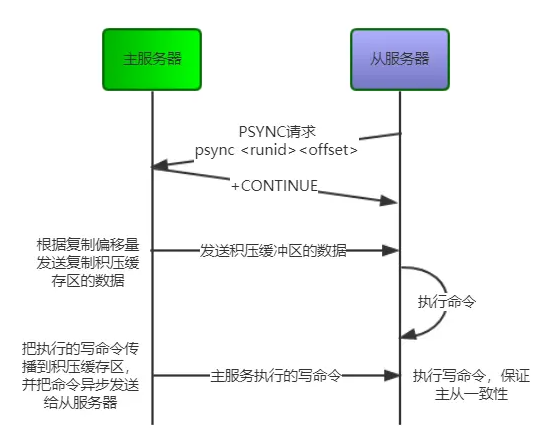
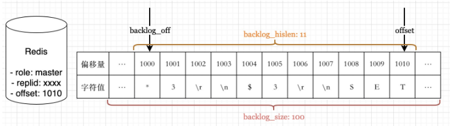
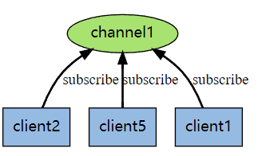
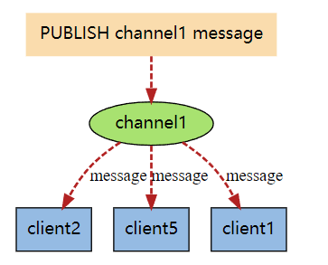
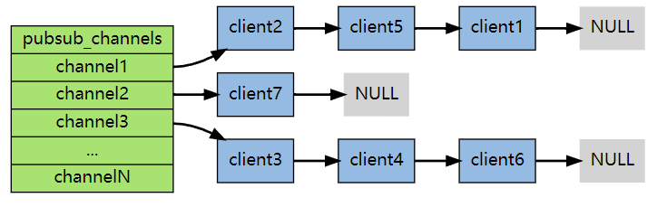

> Redis高级架构包括多机复制, 哨兵, 事务, 发布订阅等

### 主从复制 同步和一致性

同步的目的是多机系统中节点的数据保持一致, 主从复制的目的也是保证节点的数据一致。Redis主从复制，以一主多从的模式建立的分布式系统，是Redis搭建高可用集群(哨兵模式、Cluster模式)的基础，为容错、故障转移提供强有力的支撑。使用redis-cli客户端连接到redis服务，执行`replicaof <masterip> <masterport>`命令, 该客户机将于master建立起主从关系。

#### 复制原理

Redis2.8之前的旧版主从复制采用的是"全量同步+命令传播"机制完成主从数据同步，这里的硬伤是从机重连后，哪怕主从之间只有少量的数据不一致，也要执行一个耗时、耗资源的全量同步操作来达到数据一致。Redis2.8之后的版本主从复制机制包含三个部分：全量同步、部分同步、命令传播。

* 全量同步：master节点创建全量数据的RDB快照文件，通过网络连接发送给slave节点，slave节点加载快照文件恢复数据; 然后master再向slave节点发送缓冲区内新增的命令，slave再执行, master和slave达到数据一致状态。

* 命令传播：master节点会持续向slave节点发送命令流，以保证某时间段内master节点发生的改变同样作用在slave节点上，这些命令包含：客户端写请求、key过期、数据淘汰以及其他所有引起数据集变更的操作。

主从复制模式下，Redis使用一对Replicaion ID, offset来唯一识别Master节点数据的版本
* Replication ID(复制ID)：每个Redis的主节点都用一个随机生成的字符串来表示在某时刻其内部存储数据的状态
* offset(复制偏移量)：主从模式下，主节点会持续不断的向从节点传播引起数据集更改的命令，offset所表示的是主节点向从节点传递命令字节总数。
* backlog(复制积压缓冲区)：它是一个环形缓冲区，用来存储主节点向从节点传递的命令，它的大小是固定的，可存储的命令有限，超出部分将会被删除。

全量同步过程

旧版同步只有全量同步过程, 对应的命令是`SYNC`
1. 从服务器向主服务器发送SYNC命令
2. master服务器执行BGSAVE命令, 后台生成RDB, 并用缓冲区记录从现在开始执行的所有写命令
3. master将生成的RDB文件发送给follower, folllower载入RDB,更新
4. master将记录在缓冲区的所有写命令发送给follower,follower执行这些命令更新状态。

增量同步过程

新版复制用PSYNC代替了SYNC, 具有完整重同步和部分重同步两种模式, 完整重同步用于初次复制, 和SYNC步骤基本一样。部分重同步用于处理断线后重复制, 基本原理就是主从服务器的复制偏移量(replication offset), 复制积压缓冲区(replication backlog), 服务器运行id。

复制积压缓冲区是master维护的固定长度(fixed size)的先进先出(FIFO)的队列, 默认大小为1MB。当master进行命令传播时, 不仅将写命令发送给follower, 还会写入复制积压缓冲区中。

部分同步就是把缓存在backlog的命令传送给follower, 由于backlog过期的数据会删除, 如果需要删除的数据, 只能进行全量同步了。如下, backlog_off之前的数据被删除, 只有同步数据的范围位于backlog_off和offset之间才能使用增量同步, 否则就是全量同步


以上是同步过程, 接下来的命令传播十分简单, 也就是是动态自动触发。 当master执行完新的写命令后，master会将写命令发送给follower, 同时也会把该命令追加至复制积压缓冲区。follower接收命令并执行，同时更新follower维护的复制偏移量offset。这样就可以保证任意时刻主从服务器的一致性了。

为了确保follower收到命令并执行, 每隔一秒，follower节点向master节点发送一次心跳信息确认，命令格式为`REPLCONF ACK <offset>`。心跳确认作用主要有三, 检测主从服务器的网络连接状态; 辅助实现min-slaves选项; 检测命令丢失。

<!-- more -->
### 哨兵机制

主从复制保证了数据的一致性, 但一个大问题是, master崩了怎么办。Redis Sentinel作用是故障处理, 其实保证master的可用性。sentinel通过监听master节点，当集群中的master失效之后，sentinel可以选举出一个新的master用于自动接替master的工作

#### 定时监控
sentinel有3个定时任务

1. Sentinel默认每10s一次的频率, 向被监视的主服务器发送INFO命令, 通过分析回复获取主服务器的当前信息。当Sentinel发现主服务器有新的从服务器出现时, Sentinel会创建和从服务器的命令连接, 也以10s一次的频率向从 服务器发送INFO命令。INFO的作用是获取主从服务器的基本信息。

2. 默认下Sentinel会以2s一次的频率通过命令连接向所有被监听的主服务器和从服务器发送`PUBLISH __sentinel__:hello...`, 这里是建立一个订阅模型Pub/Sub. 通过发布/订阅, 对于监听同一个服务器的多个Sentinel来说, 一个Sentinel发送的信息会被其他Sentinel接收到。 从而让所有Sentinel达成共识。

3. 每1秒每个sentinel对其他sentinel和redis节点执行ping操作，这个其实是一个心跳检测，是下线判定的依据。

Sentinel对服务器下线(不可用)有两种看法，主观下线(SDOWN),客观下线(ODOWN)。Ping命令Ping超时, 就认为发生了SDOWN。之后如果一个sentinel收到了足够多的sentinel的消息说明master节点已经down掉了，SDOWN状态就会变成ODOWN状态。ODOWN状态只适用于master, slave只有主观下线。

#### 选举领头sentinel

值得注意的是redis sentinel选举算法就是raft leader的选举算法, 参见https://larrystd.site/computerbase/2022-01-01-docker,%20k8s/, 但是raft利用复制日志保证一致性, redis没有使用, 而是通过上述的主从复制保证一致性。此外只有sentinel具有选举的权利(slave节点果然是slave啊,没有选举权)

* 选举流程

某个Sentinel认定监听的master客观下线的节点后，该Sentinel会先看看自己有没有投过票, 如果自己已经投过票给其他Sentinel了, 在2倍故障转移的超时时间自己就不会成为Leader。相当于它是一个Follower。如果该Sentinel还没投过票，那么它就成为Candidate。

和Raft协议描述的一样，成为Candidate，Sentinel需要完成几件事情。
1. 更新故障转移状态为start
2. 当前epoch加1，相当于进入一个新term，在Sentinel中epoch就是Raft协议中的term。
3. 更新自己的超时时间为当前时间随机加上一段时间，随机时间为1s内的随机毫秒数。
4. 向其他节点发送is-master-down-by-addr命令请求投票。命令会带上自己的epoch。
5. 给自己投一票，在Sentinel中，投票的方式是把自己master结构体里的leader和leader_epoch改成投给的Sentinel和它的epoch。

其他Sentinel会收到Candidate的is-master-down-by-addr命令。如果Sentinel当前epoch和Candidate传给他的epoch一样，说明他已经把自己master结构体里的leader和leader_epoch改成其他Candidate，相当于把票投给了其他Candidate。投过票给别的Sentinel后，在当前epoch内自己就只能成为Follower。

Candidate会不断的统计自己的票数，直到他发现认同他成为Leader的票数超过一半而且超过它配置的quorum。Sentinel比Raft协议增加了quorum，这样一个Sentinel能否当选Leader还取决于它配置的quorum。

如果在一个选举时间内，Candidate没有获得超过一半且超过它配置的quorum的票数，自己的这次选举就失败了。如果在一个epoch内，没有一个Candidate获得更多的票数。那么等待超过2倍故障转移的超时时间后，Candidate增加epoch重新投票。

如果某个Candidate获得超过一半且超过它配置的quorum的票数，那么它就成为了Leader。

与Raft协议不同，Leader并不会把自己成为Leader的消息发给其他Sentinel。其他Sentinel等待Leader从slave选出master后，检测到新的master正常工作后，就会去掉客观下线的标识，从而不需要进入故障转移流程。

任何一个想成为 Leader 的哨兵，要满足两个条件: 拿到半数以上的赞成票; 拿到的票数同时还需要大于等于哨兵配置文件中的 quorum 值。

选举出领头sentinel之后, 最后进行的就是故障的迁移。

1. leader通过向其他slave节点发送`slave of <new master address>`来重新配置master，也是通过info命令的探测来其他节点的配置是否已经配置完成。
2. 当slaves的节点构建完成，leader开始更新master的结构，重新建立slaves dict，并重置master的sentinelRedisInstance。
3. 其他sentinel节点在leader完成了故障转移后，通过订阅了的channel，可以收到leader广播的hello msg而更新自身的master结构数据。

### 相关独立功能

#### 发布与订阅, 信息传递

Redis 发布订阅(pub/sub)是一种消息通信模式：发送者(pub)发送消息，订阅者(sub)接收消息。

订阅的对象是Channel, Redis 的 SUBSCRIBE 命令可以让客户端订阅任意数量的Channel， 每当有新信息发送到被订阅的Channel时， 信息就会被发送给所有订阅指定频道的客户端。



同样的, 可以通过PUBLISH 命令将小新发送给channel， 这个消息就会自动发送给订阅它的客户端：



Channel底层是通过dict实现的, dict的键为被订阅的channel， 字典的值是一个链表， 链表中保存了所有订阅这个频道的客户端。



#### 事务 transaction

Redis 事务的本质是一组命令的集合。事务支持一次执行多个命令，一个事务中所有命令都会被序列化。redis事务就是一次性、顺序性、排他性的执行一个队列中的一系列命令。

```
MULTI ：开启事务，redis会将后续的命令逐个放入队列中，然后使用EXEC命令来原子化执行这个命令系列。
EXEC：执行事务中的所有操作命令。 
DISCARD：取消事务，放弃执行事务块中的所有命令。 
WATCH：监视一个或多个key,如果事务在执行前，这个key(或多个key)被其他命令修改，则事务被中断，不会执行事务中的任何命令。 
UNWATCH：取消WATCH对所有key的监视。 

127.0.0.1:6379> set k1 v1
OK
127.0.0.1:6379> set k2 v2
OK
127.0.0.1:6379> MULTI
OK
127.0.0.1:6379> set k1 11
QUEUED
127.0.0.1:6379> set k2 22
QUEUED
127.0.0.1:6379> EXEC
OK
2OK
```

watch是乐观锁的实现方式, 当使用多个线程时, 如果某线程watch某个key, 当这个key被其他线程改动了, 该线程执行的事务就会被取消, 这是CAS compare and swap的思想。程序需要做的， 就是不断重试这个操作， 直到watch没有发生碰撞为止。watch其实保证了多线程读写的happen-before语义。


### 缓存问题

#### 缓存穿透
缓存穿透是指缓存和数据库中都没有的数据，而用户不断发起请求。由于缓存是不命中时被动写的，并且出于容错考虑，如果从存储层查不到数据则不写入缓存，这将导致这个不存在的数据每次请求都要到存储层去查询，失去了缓存的意义。 在流量大时，可能DB就挂掉了，要是有人利用不存在的key频繁攻击我们的应用，这就是漏洞。 如发起为id为"-1"的数据或id为特别大不存在的数据。这时的用户很可能是攻击者，攻击会导致数据库压力过大。 

解决方案 
1. 接口层增加校验，如用户鉴权校验，id做基础校验，id<=0的直接拦截； 
2. 从缓存取不到的数据，在数据库中也没有取到，这时也可以将key-value对写为key-null，缓存有效时间可以设置短点，如30秒（设置太长会导致正常情况也没法使用）。这样可以防止攻击用户反复用同一个id暴力攻击 
3. 布隆过滤器。bloomfilter就类似于一个hash set，用于快速判某个元素是否存在于集合中，其典型的应用场景就是快速判断一个key是否存在于某容器，不存在就直接返回。布隆过滤器的关键就在于hash算法和容器大小

#### 缓存击穿

缓存击穿是指缓存中没有但数据库中有的数据（一般是缓存时间到期），这时由于并发用户特别多，同时读缓存没读到数据，又同时去数据库去取数据，引起数据库压力瞬间增大，造成过大压力。 

解决方案 
1. 设置热点数据永远不过期。 
2. 接口限流与熔断，降级。重要的接口一定要做好限流策略，防止用户恶意刷接口，同时要降级准备，当接口中的某些 服务  不可用时候，进行熔断，失败快速返回机制。 
3. 加互斥锁

#### 缓存雪崩 
缓存雪崩是指缓存中数据大批量到过期时间，而查询数据量巨大，引起数据库压力过大甚至down机。和缓存击穿不同的是，缓存击穿指并发查同一条数据，缓存雪崩是不同数据都过期了，很多数据都查不到从而查数据库。 

解决方案 
1. 缓存数据的过期时间设置随机，防止同一时间大量数据过期现象发生。 
2. 如果缓存数据库是分布式部署，将热点数据均匀分布在不同的缓存数据库中。 
3. 设置热点数据永远不过期。
