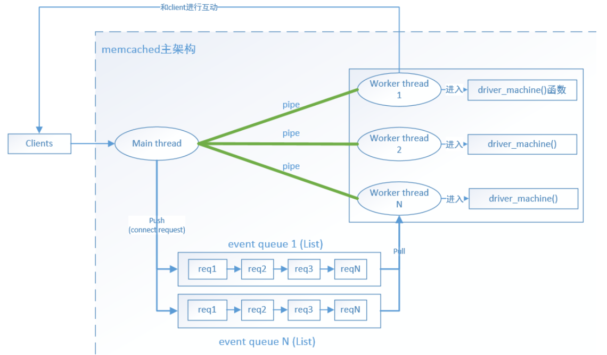
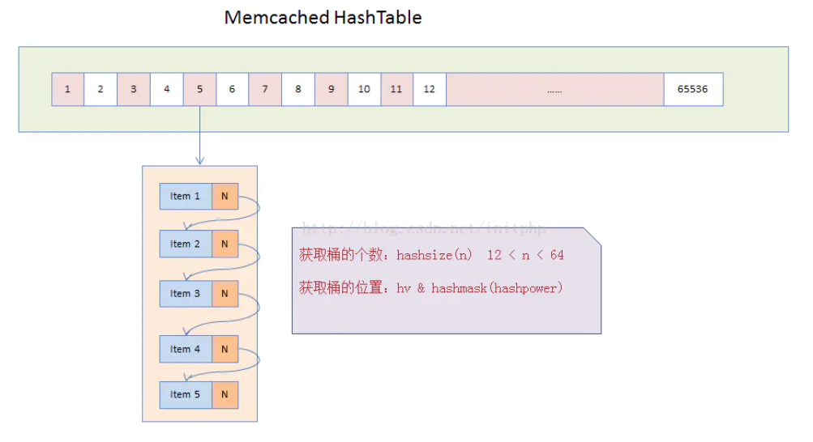
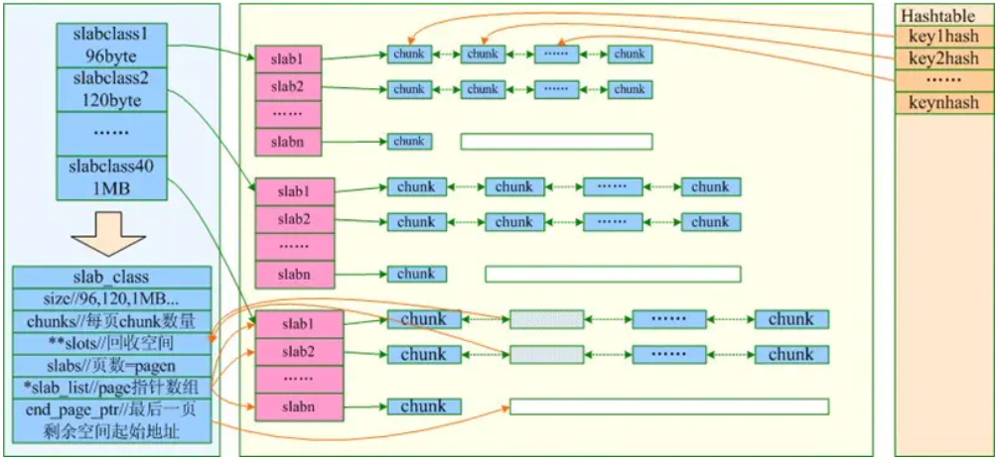

### 参数解析

一些参数
```
"a:" //unix socket的权限位信息，unix socket的权限位信息和普通文件的权限位信息一样
"p:" //memcached监听的TCP端口值，默认是11211
"s:" //unix socket监听的socket文件路径
"U:" //memcached监听的UDP端口值，默认是11211
"m:" //memcached使用的最大内存值，默认是64M
"M"  //当memcached的内存使用完时，不进行LRU淘汰数据，直接返回错误，该选项就是关闭LRU
"c:" //memcached的最大连接数,如果不指定，按系统的最大值进行
"k"  //是否锁定memcached所持有的内存，如果锁定了内存，其他业务持有的内存就会减小
"hi" //帮助信息
...
```

这些参数在内部通过struct setting来维护
```cpp
struct settings {
    size_t     maxbytes;
    int        maxconns;
    int        port;
    int        udpport;
    char*      inter;
    int        verbose;
    rel_time_t oldest_live; /* ignore existing items older than this */
    int        evict_to_free;
    char*      socketpath; /* path to unix socket if using local socket */
    int        access;  /* access mask (a la chmod) for unix domain socket */
    double     factor; /* chunk size growth factor */
    int        chunk_size;
    int        num_threads; /* number of worker (without dispatcher) libevent threads to run */
    ...
}
```

<!-- more -->

设置参数
```cpp
case 'a':
    //修改unix socket的权限位信息
    settings.access = strtol(optarg, NULL, 8);
    break;
case 'U':
    //udp端口信息
    settings.udpport = atoi(optarg);
    udp_specified = true;
    break;
case 'p':
     //tcp端口信息
     settings.port = atoi(optarg);
     tcp_specified = true;
     break;
```

### 网络模型

Memcached主要是基于Libevent 网络事件库进行开发的。

Memcached的网络模型分为两部分：主线程和工作线程。主线程主要用来接收客户端的连接信息；工作线程主要用来接管客户端连接，处理具体的业务逻辑。默认情况下会开启8个工作线程。

主线程和工作线程之间主要是通过pipe管道来进行通信。当主线程接收到客户端的连接的时候，会通过轮询的方式选择一个工作线程，然后向该工作线程的管道pipe写数据。工作线程监听到管道中有数据写入的时候，就会触发代码逻辑去接管客户端的连接。

每个工作线程也是基于Libevent的事件机制，当客户端有数据写入的时候，就会触发读取的操作。



socket的相关初始化过程，主要是指设置socket相关的一些参数；进行socket的bind操作；通过方法conn_new关联socket和libevent当中。
```cpp
static int server_sockets(int port, enum network_transport transport,
                          FILE *portnumber_file) {
    if (settings.inter == NULL) {
        return server_socket(settings.inter, port, transport, portnumber_file);
    } else {
        // tokenize them and bind to each one of them..
        char *b;
        int ret = 0;
        char *list = strdup(settings.inter);
        for (char *p = strtok_r(list, ";,", &b);
            ret |= server_socket(p, the_port, transport, portnumber_file);
        }
        free(list);
        return ret;
    }

static int server_socket(const char *interface,
                         int port,
                         enum network_transport transport,
                         FILE *portnumber_file) {
    int sfd;
    struct linger ling = {0, 0};
    struct addrinfo *ai;
    struct addrinfo *next;
    struct addrinfo hints = { .ai_flags = AI_PASSIVE,
                              .ai_family = AF_UNSPEC };
    char port_buf[NI_MAXSERV];
    int error;
    int success = 0;
    int flags =1;

    for (next= ai; next; next= next->ai_next) {
        conn *listen_conn_add;
        if ((sfd = new_socket(next)) == -1) {
            continue;
        }

        //todo 设置socket相关的属性，这里省略相关代码

        // 绑定socket，省略相关代码
        if (bind(sfd, next->ai_addr, next->ai_addrlen) == -1) {}

        // 暂时只关心TCP协议的，忽略UDP协议实现
        if (IS_UDP(transport)) {
        } else {
            if (!(listen_conn_add = conn_new(sfd, conn_listening,
                                             EV_READ | EV_PERSIST, 1,
                                             transport, main_base))) {
                fprintf(stderr, "failed to create listening connection\n");
                exit(EXIT_FAILURE);
            }
            listen_conn_add->next = listen_conn;
            listen_conn = listen_conn_add;
        }
    }

    freeaddrinfo(ai);

    /* Return zero iff we detected no errors in starting up connections */
    return success == 0;
}
```

memcached_thread_init主要用于工作线程worker的初始化，核心的三个操作主要是：

初始化master线程和worker线程通信的pipe管道，pipe(fds)。

setup_thread，主要用于设置工作线程libevent相关的参数。

create_worker，主要是启动工作线程开始循环处理工作。

```cpp
void memcached_thread_init(int nthreads, void *arg) {
    int         i;
    
    // 初始化所有工作线程的pipe的fds
    for (i = 0; i < nthreads; i++) {
        int fds[2];
        if (pipe(fds)) {}
        threads[i].notify_receive_fd = fds[0];
        threads[i].notify_send_fd = fds[1];
        threads[i].storage = arg;

        // 初始化线程对应的libevent事件
        setup_thread(&threads[i]);
        stats_state.reserved_fds += 5;
    }

    // 每个线程进入libevent的事件循环当中
    for (i = 0; i < nthreads; i++) {
        create_worker(worker_libevent, &threads[i]);
    }
}
```

thread_libevent_process用于接收到master线程分发的新连接并进行处理，新的连接到来以后通过conn_new来处理新到来的连接。
```cpp
static void thread_libevent_process(int fd, short which, void *arg) {
    LIBEVENT_THREAD *me = arg;
    CQ_ITEM *item;
    char buf[1];
    conn *c;
    unsigned int timeout_fd;

    if (read(fd, buf, 1) != 1) {
        if (settings.verbose > 0)
            fprintf(stderr, "Can't read from libevent pipe\n");
        return;
    }

    switch (buf[0]) {
    case 'c':
        item = cq_pop(me->new_conn_queue);

        if (NULL == item) {
            break;
        }
        switch (item->mode) {
            case queue_new_conn:
                c = conn_new(item->sfd, item->init_state, item->event_flags,
                                   item->read_buffer_size, item->transport,
                                   me->base);
                if (c == NULL) {
                } else {
                    c->thread = me;
                }
                break;

            case queue_redispatch:
                conn_worker_readd(item->c);
                break;
        }
}
```

### 数据存储

Memcached在启动的时候，会默认初始化一个HashTable，这个table的默认长度为65536。



assoc_init负责初始化hashtable数据结构，通过初始化hashsize(hashpower)大小的数组指针，默认应该是2*16次方大小的数组。
```cpp
#define HASHPOWER_DEFAULT 16
unsigned int hashpower = HASHPOWER_DEFAULT;
#define hashsize(n) ((ub4)1<<(n))
#define hashmask(n) (hashsize(n)-1)

void assoc_init(const int hashtable_init) {
    if (hashtable_init) {
        hashpower = hashtable_init;
    }
    primary_hashtable = calloc(hashsize(hashpower), sizeof(void *));
    if (! primary_hashtable) {
        fprintf(stderr, "Failed to init hashtable.\n");
        exit(EXIT_FAILURE);
    }
    STATS_LOCK();
    stats_state.hash_power_level = hashpower;
    stats_state.hash_bytes = hashsize(hashpower) * sizeof(void *);
    STATS_UNLOCK();
}
```

Memcached存储数据结构item定义，item的结构分两部分, 第一部分定义 item 结构的属性，第二部分是 item 的数据。
```cpp
/**
 * Structure for storing items within memcached.
 */
typedef struct _stritem {
    /* Protected by LRU locks LRU双向链表*/
    struct _stritem *next;
    struct _stritem *prev;
    /* Rest are protected by an item lock */
    struct _stritem *h_next;    /* hash chain next */
    rel_time_t      time;       /* least recent access */
    rel_time_t      exptime;    /* expire time */
    int             nbytes;     /* size of data */
    unsigned short  refcount;
    uint8_t         nsuffix;    /* length of flags-and-length string */
    uint8_t         it_flags;   /* ITEM_* above */
    uint8_t         slabs_clsid;/* which slab class we're in */
    uint8_t         nkey;       /* key length, w/terminating null and padding */
    /* this odd type prevents type-punning issues when we do
     * the little shuffle to save space when not using CAS. */
    union {
        uint64_t cas;
        char end;
    } data[];
    /* if it_flags & ITEM_CAS we have 8 bytes CAS */
    /* then null-terminated key */
    /* then " flags length\r\n" (no terminating null) */
    /* then data with terminating \r\n (no terminating null; it's binary!) */
} item;
```

key的类型是`char *key`, value的类型是`struct item`

### 数据操作

* 数据查询

先通过key的hash值hv找到对应的桶，区分是否在扩容。 primary_hashtable[hv & hashmask(hashpower)];

然后遍历桶的单链表，比较key值并找到对应item。
```cpp
item *assoc_find(const char *key, const size_t nkey, const uint32_t hv) {
    item *it;
    unsigned int oldbucket;

    if (expanding &&
        (oldbucket = (hv & hashmask(hashpower - 1))) >= expand_bucket)
    {
        it = old_hashtable[oldbucket];
    } else {
        it = primary_hashtable[hv & hashmask(hashpower)];
    }

    item *ret = NULL;
    int depth = 0;
    while (it) {
        if ((nkey == it->nkey) && (memcmp(key, ITEM_key(it), nkey) == 0)) {
            ret = it;
            break;
        }
        it = it->h_next;
        ++depth;
    }
    MEMCACHED_ASSOC_FIND(key, nkey, depth);
    return ret;
}
```

* 数据插入

首先通过key的hash值hv找到对应的桶。然后将item放到对应桶的单链表的头部

* 数据扩容

数据扩容过程是由一个单独线程在检测是否需要扩容，扩容的前提条件是curr_items > (hashsize(hashpower) * 3) / 2，也就是说数据量是原来的1.5倍。

检测需要扩容后通过信号通知pthread_cond_signal(&maintenance_cond)开始执行扩容。

以2倍的扩容速度进行扩容，primary_hashtable = calloc(hashsize(hashpower + 1), sizeof(void *))。

移过程是一个逐步迁移过程，每次都只迁移一个桶里面的Item数据。


### 内存管理slab

Memcached的内存分配是以slab为单位的。默认情况下，每个slab大小为1M。

Memcached在启动的时候，会初始化一个slabclass数组，该数组用于存储最大63个slabclass_t的数据结构体。每个slabclass_t，都只存储一定大小范围的数据。memcached默认情况下一个slabclass_t存储数据的最大值为前一个的1.25倍

slabclass数组初始化的时候，每个slabclass_t都会分配一个1M大小的slab。当某个slabclass_t结构上的内存不够的时候（freelist空闲列表为空），则会分配一个slab给这个slabclass_t结构。

slab会被切分为N个小的内存块，这个小的内存块的大小取决于slabclass_t结构上的size的大小。例如slabclass[0]上的size为103，则每个小的内存块大小为103byte。

chunk也就是item之间是连续的一块内存分配的。



### memcached和redis

1. memecache 把数据全部存在内存之中，断电后会挂掉，数据不能超过内存大小; redis有部份存在硬盘上，这样能保证数据的持久性，支持数据的持久化（有快照和AOF日志两种持久化方式，在实际应用的时候，要特别注意配置文件快照参数，要不就很有可能服务器频繁满载做dump）。如果Redis发现内存的使用量超过了某一个阀值，将触发swap的操作，Redis根据“swappability = age*log(size_in_memory)”计算出哪些key对应的value需要swap到磁盘。

2. Memcached仅支持简单的key-value结构的数据记录(可理解为只支持pair类型, 其中key为char*, value为struct item), Redis支持的数据类型要丰富得多。最为常用的数据类型主要由五种：String、Hash、List、Set和Sorted Set。value的类型是Object

3. Memcached本身并不支持分布式，因此只能在客户端通过像一致性哈希这样的分布式算法来实现Memcached的分布式存储。Redis可以在服务器端构建分布式存储。

对于像Redis和Memcached这种基于内存的数据库系统来说，内存管理的效率高低是影响系统性能的关键因素。传统C语言中的malloc/free函数是最常用的分配和释放内存的方法，但是这种方法存在着很大的缺陷：首先，对于开发人员来说不匹配的malloc和free容易造成内存泄露；其次频繁调用会造成大量内存碎片无法回收重新利用，降低内存利用率；最后作为系统调用，其系统开销远远大于一般函数调用。所以，为了提高内存的管理效率，高效的内存管理方案都不会直接使用malloc/free调用。Redis和Memcached均使用了自身设计的内存管理机制。

Memcached默认使用Slab Allocation机制管理内存，其主要思想是按照预先规定的大小，将分配的内存分割成特定长度的块以存储相应长度的key-value数据记录，以完全解决内存碎片问题。基本思想是内存池

Redis并没有自己实现内存池，利用了系统内存分配器，所以系统内存分配器的性能及碎片率会对Redis造成一些性能上的影响。Redis在编译时便会指定内存分配器；内存分配器可以是 libc 、jemalloc或者tcmalloc，默认是jemalloc。内存分配器内部实现了内存池, 多线程下效率也很高, 只是内存碎片可能会带来影响。


