> Redis高级架构包括多机复制, 哨兵, 事务, 发布订阅等

### 复制 同步和一致性

同步的目的是多机系统中节点的数据保持一致, 主从复制的目的也是保证节点的数据一致。Redis主从复制，以一主多从的模式建立的分布式系统，是Redis搭建高可用集群(哨兵模式、Cluster模式)的基础，为容错、故障转移提供强有力的支撑。使用redis-cli客户端连接到redis服务，执行`replicaof <masterip> <masterport>`命令, 该客户机将于master建立起主从关系。

```
// 当前服务器向远程127.0.0.1:6379发送以下命令
127.0.0.1:12345> SLAVEOF 127.0.0.1 6379
```
那么远程服务器127.0.0.1:12345将成为127.0.0.1:6379的从服务器, 主从服务器自动执行复制操作, 且之后双方的数据库将自动保存相同的数据
```
// 主服务器执行
127.0.0.1:6379> SET msg "hello world"
Ok
127.0.0.1:6379> GET msg
"hello world"
// 在从服务器也可以获取msg的值
127.0.0.1:12345> GET msg
"hello world"

// 同样的, 如果主服务器删除了键msg, 从服务器上也会被删除
```

#### 主从复制

Redis主从复制采用的是"同步+命令传播"机制完成主从数据同步。同步操作用于将从服务器的数据库状态更新至主服务器所处的数据库状态, 命令传播操作保证实时下主服务器的数据库状态一致。Redis使用PSYNC命令执行复制时的同步操作

PSYNC命令具有完整重同步(full resynchronization)和部分重同步(partial resynchronization)两种模式。完整重同步用于处理初次复制的情况, 它通过让主服务器创建并发送RDB文件, 以及向从服务器发送保存在缓冲区里的写命令来进行同步。需要注意完整或部分重同步两者只会选择一种执行

* 完整重同步

1. 从服务器向主服务器发送SYNC命令
2. 收到命令的主服务器执行BGSAVE, 后台生成一个RDB文件, 建立一个积压缓冲区记录从现在开始的所有写命令
3. 主服务器将生成的RDB文件发送给从服务器, 从服务器载入文件将状态恢复到主服务器执行BGSAVE命令前的状态
4. 主服务器将缓冲区的所有写命令发送给从服务器, 从服务器执行, 从而和主服务器保持一致
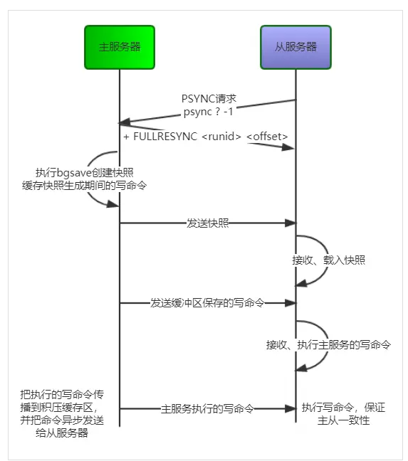

<!-- more -->

* 部分重同步

完整重同步的硬伤是从机重连后，哪怕主从之间只有少量的数据不一致，也要执行一个写完整RDB文件的全量同步操作来达到数据一致。部分重同步功能由以下三个部分构成, 主服务器的复制偏移量replication offset, 主服务器的复制积压缓冲区replication backlog, 服务器的运行ID

执行复制的双方, 主服务器和从服务器会分别维护一个复制偏移量, 相当于TCP的滑动窗口。主服务器每次传播N个字节就把自己的偏移量增加N, 从服务器每次收到N个字节就把自己偏移量增加N。如果主从服务器处于一致状态, 他们的偏移量应该是相同的, 如果偏移量不同说明他们不处于一致状态(有可能因为网络断线), 这种情况需要主服务器向从服务器执行复制操作

复制积压缓冲区是由主服务器维护一个固定长度先进先出FIFO的队列, 默认1MB。当主服务器进行命令传播时, 它除了将写命令发送给从服务器, 还会把写命令写入复制积压缓冲区。

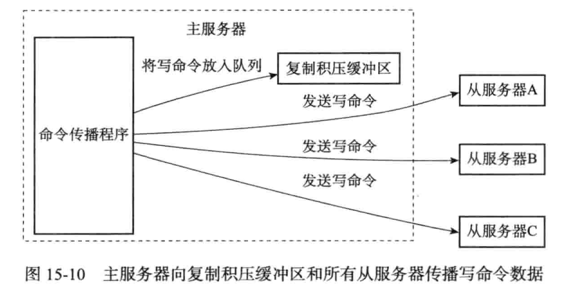

如果从服务器offset偏移量之后的数据仍然存在复制积压缓冲区中, 因为同步的数据范围[从服务器offset, 主服务offset], 可以使用部分重同步。如果从服务器offset不存在复制积压缓冲区, 使用完整重同步。

服务器运行ID, 每个Redis服务器, 不论主从都有自己的运行ID, 由40个随机的16进制数字组成。如果从服务器保存的运行ID和当前连接的一样, 表示断线前后都是这台主服务器, 可以尝试部分重同步; 如果不相同, 则执行完整重同步。

PSYNC命令的执行

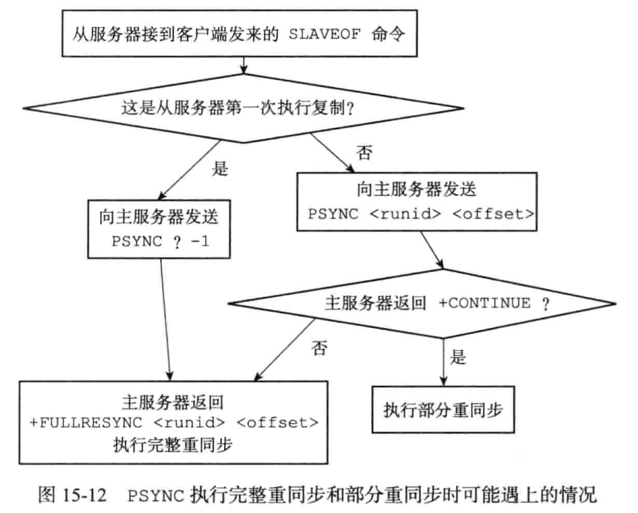

#### 复制的完整实现

1. 设置主服务器的地址和端口, 保存在redisServer中

```
SLAVEOF 127.0.0.1 6379

struct redisServer {
  char *masterhost; // 主服务器地址
  int masterport; // 主服务器端口
}
```

2. 建立套接字连接, 从服务器相当于主服务器的客户端, 从服务器向主服务器发送命令请求, 主服务器向从服务器返回回复

3. 发送PING命令, 作用是检测连接, 读写是否正常, 主服务器将返回PONG

4. 身份验证, 是否设置密码等

5. 发送端口信息, 向主服务器发送从服务器的监听端口号。主服务器会在redisClient结构体的slave_listening_port中记录

6. 记录, 从服务器向主服务器发送PSYNC命令, 执行同步操作, 将自己的数据库更新至主服务器当前状态

7. 命令传播, 完成同步之后, 主服务器会将自己执行的写命令一直发送给从服务器, 从而使主从服务器接下来一直保持同步

命令传播阶段, 从服务器默认以每秒一次的频率向主服务器发送命令`REPLCONF ACK <replication_offset>`, replication_offset是复制偏移量, 作用有三。

检测主从服务器的网络连接状态, 如果主服务器超过1s没有收到从服务器发来的REPLCONF ACK命令, 主服务器就直到主从服务器之间的连接出现问题了

辅助实现min-slaves配置选项,该选项可以防止主服务区在不安全情况下执行命令。例如从服务器数量小于3个, 或者延迟超过10s, 主服务器拒绝执行写命令

检测命令丢失, 当主服务器发觉从服务器复制偏移量小于自己, 会根据从服务器的复制偏移量, 将复制积压缓冲区缺少的数据发给从服务器

<!-- more -->
### 哨兵Sentinel机制, 容错和可用性

主从复制保证了数据的一致性, 但一个大问题是, master崩了怎么办。Redis Sentinel哨兵作用是故障处理, 高可用性的解决方案。Sentinel系统可以监视多个主服务器, 以及这些主服务器下的所有从服务器。被监视的主服务器下线时自动将下线主服务器的某个从服务器升级为新的主服务器, 原先的主服务器降级为从服务器。

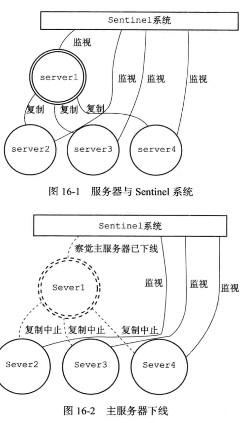

#### Sentinel相关数据结构
Sentinel本质上是运行在特殊模式下的Redis服务器 因此启动Sentinel的第一步是初始化一个普通的Redis server。 但初始化Sentinel还是有一些不同,例如不会加载RDB/AOF, 同时还初始化一个Sentinel状态结构
```cpp
struct sentinelState {
  uint64_t current_epoch; // 当前epoch, 用于实现故障转移
  dict *masters;  // 保存了监视的主服务器, 字典键是主服务器名字, 值是指向sentinelRedisInstance的指针
  int tilt; // 是否TILT模式
  int running_scripts;  // 目前执行脚本数量
  mstime_t  tilt_start_time;  // 进入TILT模式的时间
  mstime_t  previous_time;  // 最后一次执行时间处理器的时间
  list *scripts_queue;  // 一个FIFO队列, 包含要执行的用户脚本
} sentinel;
```

初始化Sentinel的masters属性, masters是一个字典, 值是sentinelRedisInstance结构, 即对主服务器的抽象结构
```cpp
typedef struct sentinelRedisInstance {
  int flags;  // 标识值
  char* name;
  char* runid;  //实例的运行ID
  uint64_t configure_epoch; // 用于故障转移
  sentinelAddr* addr; // 实例的地址

  mstime_t down_after_period; // 无响应多少秒之后才会被判断主观下线
  int quorun; // 判断这个实例为客观下线需要的投票数

  int parallel_syncs; // 执行故障转移操作时, 可以同时对新的服务器进行同步的从服务器数量
  mstime_t  failover_fimeout; // 刷新故障迁移状态的最大时限
  // ..
} sentinelRedisInstance;

// 实例地址结构
typedef struct sentinelAddr {
  char* ip;
  int port;
} sentinelAddr;
```

Sentinel状态结构
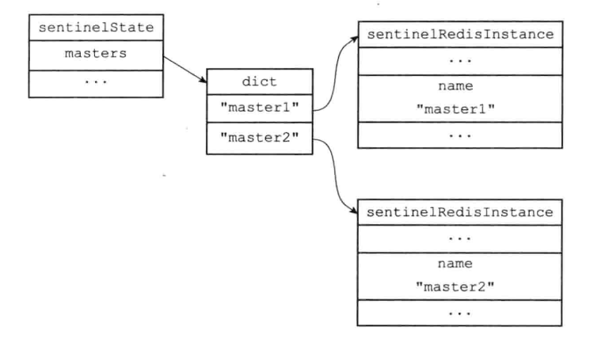

初始化Sentinel的最后一步是创建连向被监视主服务器的网络连接, Sentinel成为主服务器的客户端, 它可以发送命令并得到回复。它会创建两个和主服务器的连接, 一个是命令连接发送命令, 另一个是订阅连接订阅主服务器的__sentinel__:hello频道

#### 监视命令
* INFO命令

Sentinel默认以每10秒一次的频率, 通过命令连接向被监视的主服务器发送INFO命令, 获取主服务器的当前信息。回复包括主服务器本身信息, 包括run_id等, 以及主服务器下所有从服务器的信息
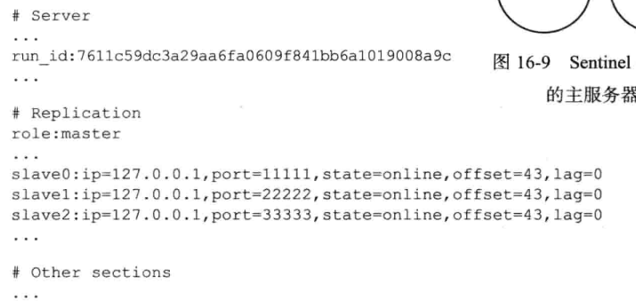

主服务器和从服务器将被组织成以下结构
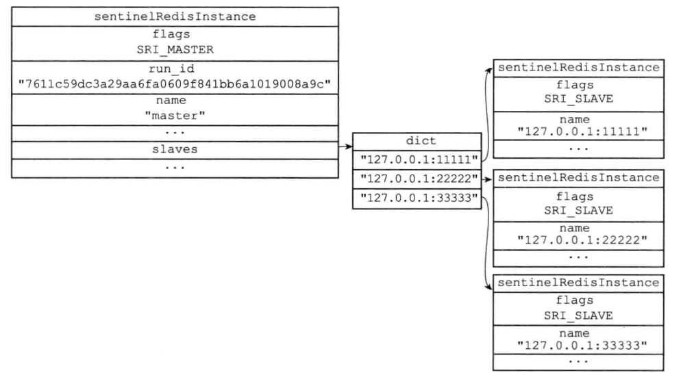

当Sentinel发现主服务器有新的从服务器时, Sentinel会为这个从服务器创建相应的实例结构, 以及命令连接和订阅连接。并以10s一次的频率向从服务器发送INFO命令, 获得以下内容的回复。
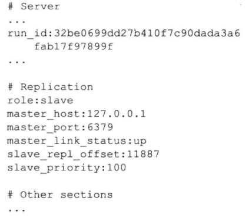

* 发送信息

默认情况下, Sentinel会以两秒一次频率通过命令连接向所有被监视的主服务器和从服务器发送以下格式的命令。这条命令向服务器的__sentinel__:hello频道发送了一条信息
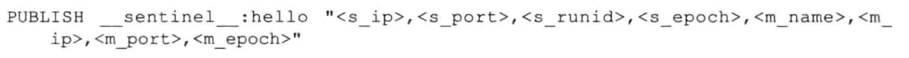

* 接收服务器的频道信息

当Sentinel与主从服务器建立起订阅连接之后, Sentinel会通过订阅连接向服务器发送`SUBSCRIBE __sentinel__:hello`命令。Sentinel对__sentinel__:hello频道的订阅持续到Sentinel和服务器的连接断开, 这样Sentinel会通过命令连接向服务器的__sentinel__:hello发送消息, 又通过订阅连接从服务器的__sentinel__:hello频道接收信息

对于监视同一个服务器的多个Sentinel来说, 一个Sentinel发送的信息会被其他Sentinel接收到, 这些信息被用于更新对监视服务器的认知, 此外还会获取监视主服务器的所有的sentinel, 保存在sentinels字典中
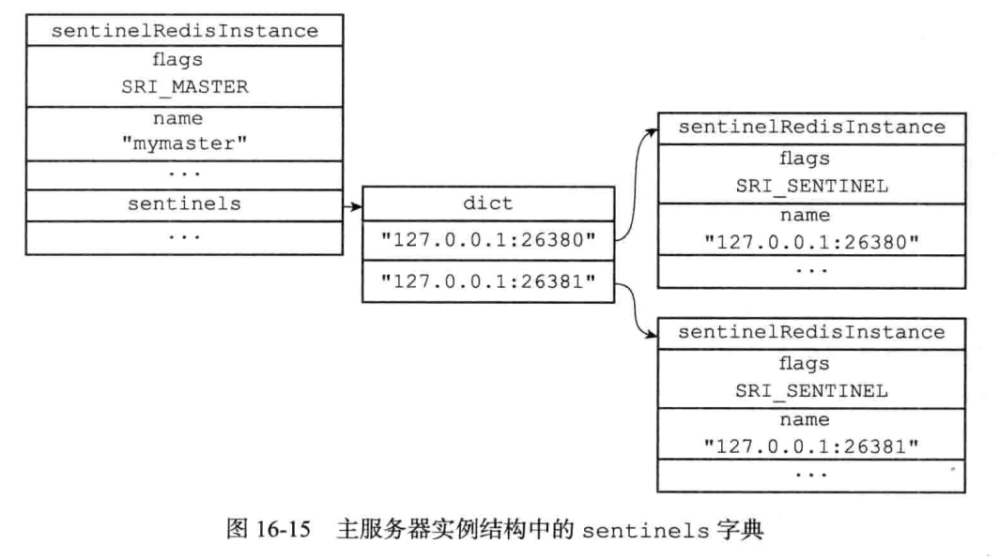

Sentinel还会和其他Sentinel创建命令连接, 但不会创建订阅连接。

#### 下线判定

* 检测主观下线

默认情况下, Sentinel会以每秒一次频率向所有和他创建命令连接的实例(包括主服务器, 从服务器, 其他Sentinel)发送PING命令, 并根据回复判断是否在线。如果超过50000ms没有有效回复, 则判断这个实例主观下线

* 检查客观下线

当Sentinel判断一个主服务器主观下线后, 它会向同样监视该主服务器的其他Sentinel询问, 是否进入下线状态。使用命令`SENTINEL is-master-down-by-addr <ip> <port> <current_epoch> <runid>`, 当该数量达到配置判断客观下线的数量时, Sentinel会将主服务器实例结构flags属性的SRI_O_DOWN标识打开, 表示主服务器进入客观下线状态

#### 选举领头Sentinel和故障转移

当一个主服务器判断为客观下线时, 监视这个下线主服务器的各个Sentinel会协商选出一个领头Sentinel, 并由领头Sentinel对下线主服务器执行故障转移操作。领头Sentinel选举算法是Raft选举。

1. 所谓的configure_epoch, 也就是raft的term, 每次进行选举后, configure_epoch会递增一次
2. 每个发现主服务器进入客观下线的Sentinel会要求其他Sentinel将自己设为领头Sentinel, 每个Sentinel只会投一票且先到先投, 之后拒绝投票请求。
3. 源Sentinel接收到其他Sentinel的回复之后, 会先检查configure_epoch是否和自己一致, 然后取出leader_runid参数判断是否投票给自己。如果某个Sentinel统计有半数Sentinel把票给了自己, 他就会成为领头Sentinel。
4. 如果给定时限内没有Sentinel被选为领头Sentinel, 那么将在一段时间之后再次进行选举, 直到选出领头Sentinel

选举处领头Sentinel后, 领头Sentinel将对下线的故障服务器进行故障转移操作。

1. 在已下线主服务器的所有从服务器中,选择最近通信的从服务器, 发送命令到从服务器并发送INFO, 从服务器会转为主服务器并INFO回复给领头Sentinel
2. 领头服务器向其他从服务器发送SLAVEOF命令, 使这些服务器的master设置为新主服务器, 并通过复制使数据库状态和新主服务器一样; 将旧的主服务器变为从服务器
3. 当slaves的节点构建完成，领头Sentinel更新master的结构，重新建立slaves dict; 其他sentinel通过订阅了的channel，可以收到leader广播的hello msg而更新自身的master结构数据。

### 集群

Redis集群是Redis提供的分布式数据库解决方案, 集群通过分片(sharding)来进行数据共享, 并提供复制和故障转移功能。

#### 节点

一个redis集群由多个节点组成, 开始需要将各个独立的节点连接起来。通过`CLUSTER MEET <ip> <port>`可以将指定ip, port的节点加入到当前的集群中。当在集群模式中, 节点会用clusterNode, clusterLink, clusterState描述集群模式用到的结构。

```cpp
struct clusterNode {
  mstime_t ctime; // 节点创建时间
  char name[REDIS_CLUSTER_NAMELEN];
  int flags;  // 标识, 记录节点角色, 状态
  uint64_t configEpoch; // 节点当前配置单元, 故障转移
  char ip[REDIS_IP_SRE_LEN];  // 节点IP地址
  int port; // 节点端口号
  clusterLink *link;  // 保存连接节点所需的有关信息
};

// clusterLink结构保存了连接的信息, 例如fd, 输入输出缓冲区
typedef struct clusterLink {
  mstime_t  ctime;  // 连接创建时间
  int fd;
  sds sndbuf;
  sds rcvbuf;
  struct clusterNode* node; // 与这个连接关联的节点
} clusterLink;

// clisterState结构, 记录当前节点视角下集群处的状态
typedef struct clusterState {
  clusterNode* myself;  // 指向当前节点的指针
  uint64_t  currentEpoch; // 集群当前的epoch
  int state;  // 集群状态, 上线还是下线
  int size; // 集群中至少处理一个槽的节点数量
  dict *nodes;  // 集群节点名单
  ...
}clusterState;
```

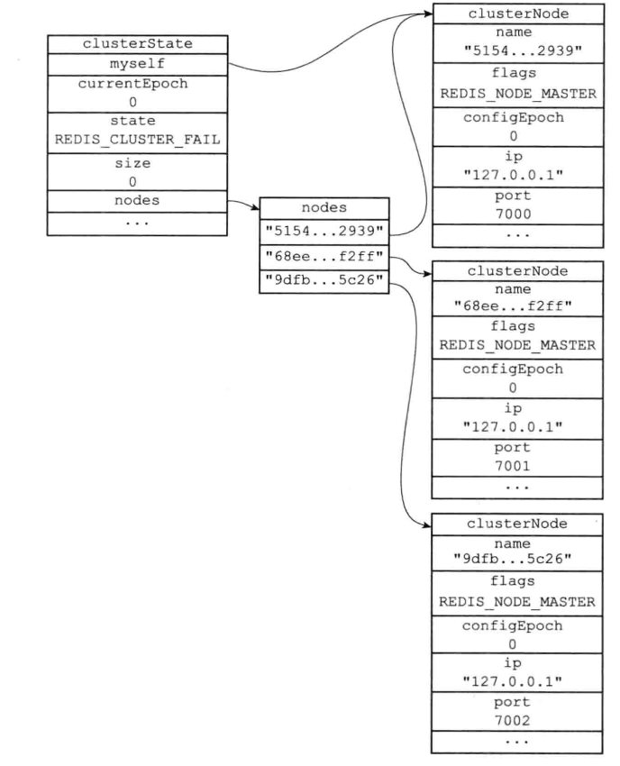

执行CLUSTER MEET时, 两个节点会进行握手连接, 成功后互相为对方创建一个clusterNode结构, 并添加到clusterState.nodes字典中。一切顺利后互相发送PING请求, 并响应PONG。之后节点会将新节点通过Gossip协议传播给集群其他节点, 其他节点也与新节点握手, 一段时间后新节点被集群所有节点认识。

#### 槽指派和分片

Redis集群通过分片的方式保存数据库中的键值对, 集群的整个数据库被分为16384个槽slot, 数据库的每个键都位于这16384个slot中的一个。集群的节点可以处理0~16384个槽。当集群的16384个槽都有节点处理, 集群处于上线状态; 如果有一个槽没有得到处理, 则集群处于下线状态。

可以将槽指定给节点处理, `CLUSTER ADDSLOTS <slot>`, 则将槽指定给当前节点处理。clusterNode结构的slots属性和numslot属性记录节点处理哪些槽, slots是一个二进制位数组, 共16384个位, 第i个位为1表示节点处理槽i
```cpp
struct clusterNode {
  unsigned char slots[16384/8];
  int numslots;
}
```

节点会把自己slots数组通过消息发送给集群其他节点, 告诉其他节点自己处理哪些槽。集群里的所有节点都知道16384个槽的分配情况, clusterState.slots是有16384项的指针, 表示16384个slot分配给了哪些节点

```cpp
typedef struct clusterState {
  ...
  clusterNode *slots[16384];
} clusterState;
```

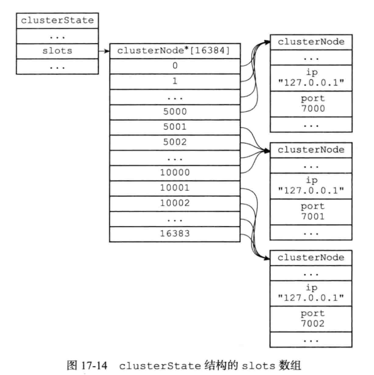

在集群中执行命令
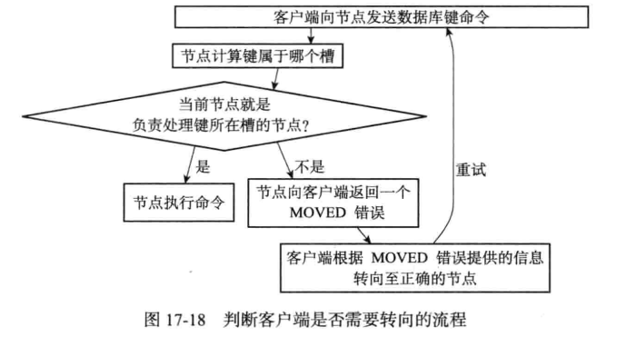

计算键属于哪个槽通过`CRC16(key) & 16383`; 如果clusterState.slot[i]等于clusterState.myself, 说明槽i由当前节点负责, 否则节点根据clusterState.slot[i]向客户端返回MOVED错误, 并指引客户端转向正确的槽。当客户端收到MOVED错误会根据IP和端口自动转向正确槽所在节点

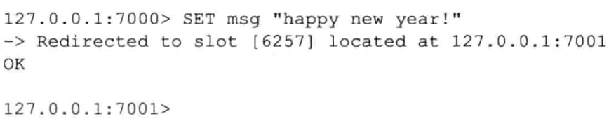

节点还会用clusterState中的slots_to_keys跳跃表保存槽和键的关系, 显然一个槽将包含多个键, slot_to_keys跳跃表相当于映射, score是槽号, value则是数据库键.

Redis可以将指派给某节点的槽转而指派给另外节点, 即把源节点所指槽的键值对迁移到目标节点, 称为重新分片。如果一个节点收到一个关于键key的命令请求, 并且键key所属的槽i正好指派给了这个节点, 节点会尝试在自己的数据库中查找key, 如果该键已经被迁移走, 源节点向客户端返回一个ACK错误, 指引客户端转向导入槽的节点

#### 复制和故障转移
Redis集群中的节点分为主节点和从节点, 其中主节点用于处理slot, 从节点则用于复制某个主节点, 主节点下线时可以代替主节点

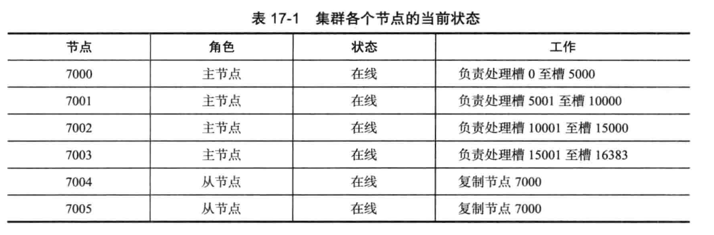

主节点的clusterNode结构的slaves属性和numslaves记录了复制这个主节点的从节点
```cpp
struct clusterNode {
  int numslaves;  // 主节点的从节点数量
  struct clusterNode **slaves;  // 指针数组, 指向从节点
  ...
};
```
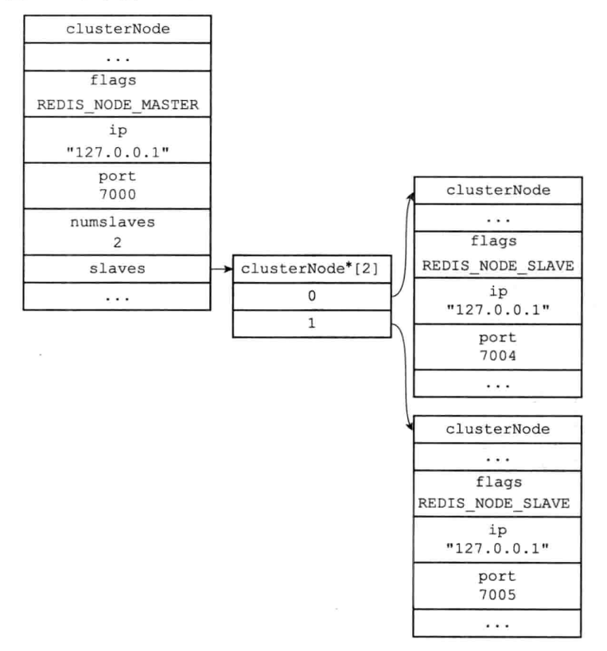

集群中的每个节点都会定期向其他节点发送PING消息, 检测对方是否在线。当一个主节点认为某个主节点处于疑似下线状态或者被通知某个主节点疑似下线, 主节点会在自己的clusterState.nodes节点找到其对应的clusterNode结构, 并将下线报告添加到fail_reports链表中

如果一个集群里半数以上负责处理槽的主节点将某个主节点判定为疑似下线, 则该主节点被标记为下线, 标记主节点的节点会向集群广播。当一个从节点发现所属的主节点进入已下线状态, 从节点将对下线主节点进行故障转移。从节点选举算法和选举领头Sentinel算法非常相似, 都是Raft的领头选举方法。被选举的从节点成为新的主节点, 新主节点将下线主节点的槽指派给自己, 并且广播一条PONG信息说明自己成为新主节点。


#### 消息

集群中的各个节点通过发送和接收消息来进行通信, 节点发送的消息主要有五种

1. MEET消息, 当发送者接到客户端发送的CLUSTER MEET命令, 发送者发送MEET消息, 请求接收者加入集群
2. PING消息, 集群里的每个节点默认每隔一秒从节点列表选出5个节点, 发送PING消息检测是否在线
3. PONG消息, 接收者接收到MEET或者PING, 发送PONG消息确认收到。同时节点可以通过广播PONG消息让其他节点刷新该节点的身份, 例如故障转移时从节点转为主节点
4. FAIL消息, 当主节点判断另一个主节点进入FAIL状态, 会广播FAIL消息，收到该消息的节点将B标记为下线
5. PUBLISH消息, 当节点接收到PUBLISH命令时, 节点执行命令, 并且向集群广播一条关于节点B的FAIL消息, 接收到这条消息的节点会执行同样的命令

消息由消息头header和正文data组成,消息头
```cpp
typedef struct {
  uint32_t  totlen; // 消息长度(头部长度+正文长度)
  uint16_t  type; // 消息类型
  uint16_t  count;  // 消息正文包含节点数量, 只有MEET, PING, PONG使用
  uint64_t  currentEpoch; // 发送者所处的epoch
  uint64_t  configEpoch;  // 发送者为从节点则表示其主节点所处的epoch
  char sender[REDIS_CLUSTER_NAMELEN0]; // 发送者的名字
  unsigned char myslots[REDIS_CLUSTER_SLOTS/8]; // 发送者目前的槽指派信息

  char slaveof[REDIS_CLUSTER_NAMELEN];  // 发送者是主节点,记录其从节点信息; 发送者为从节点则为空
  uint16_t  port;
  uint16_t  flags;
  unsigned char state;  // 发送者所处的集群状态
  union clusterMsgData data;  // 消息正文
} clusterMsg;

union clusterMsgData {
  struct {
    clusterMsgDataGossip gossip[1];
  } ping; 
  // FAIL消息的正文
  struct {
    clusterMsgDataFail  about;
  } fail;
  ...
};
```

当客户端向集群中的某个节点发送PUBLISH命令, 接收命令的节点会广播一条PUBLISH消息, PUBLISH消息的格式
```cpp
typedef struct {
  uint32_t  channel_len;
  uint32_t  message_len;

  unsigned char bulk_data[8]; // 为了对齐其他消息结构, 实际长度可能超过8字节
} clusterMsgDataPublish;
```

例如命令`PUBLISH "news.it" "hello"`
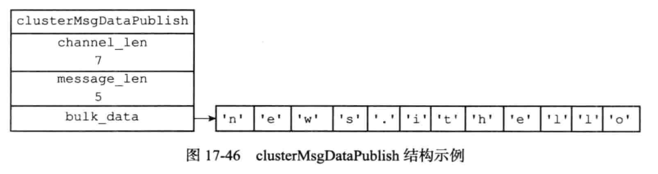

### 相关独立功能

#### 发布与订阅, 信息传递

Redis 发布订阅(pub/sub)是一种消息通信模式：发送者(pub)发送消息，订阅者(sub)接收消息。由`PUBLISH`, `SUBSCRIBE`, `PSUBSCRIBE`等命令组成。

订阅的对象是Channel, SUBSCRIBE 命令可以让客户端订阅Channel， 每当其他客户端向Channel发送信息时，channel的所有订阅者都会收到信息。可见channel这是起到信息搜集和分发的功能。
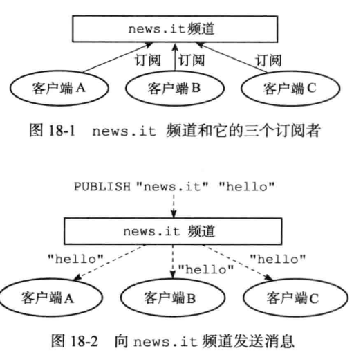

Redis将订阅关系保存在redisServer的pubsub_channel字典中, 字典键是某个被订阅的频道, 值是一个链表, 链表元素是所有订阅该频道的客户端。显然订阅推订转化为对dict和list的操作

```cpp
struct redisServer {
  ...
  dict *pubsub_channels;
};
```

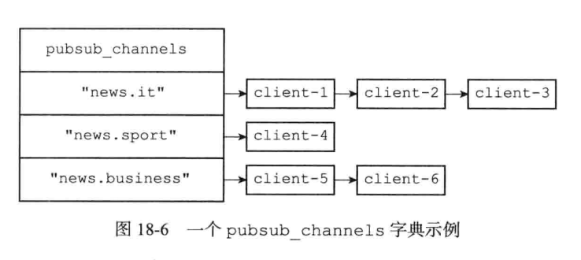

当客户端执行`PUBLISH <channel> <message>`将消息message发送给频道channel时, 服务器执行1. 把message发送给channel的订阅者 2. 如果有一个或多个模式和channel匹配, 同样发给pattern模式的订阅者。


#### 事务 transaction

Redis 事务的本质是一组命令的集合。事务支持一次执行多个命令，一个事务中所有命令都会被序列化。redis事务就是一次性、顺序性、排他性的执行一个队列中的一系列命令, 事务执行期间服务器不会中断事务转而执行其他命令, 必须等到命令执行完毕。Redis通过MULTI, EXEC, WATCH等命令来实现事务transaction功能

```
MULTI ：开启事务，redis会将后续的命令逐个放入队列中，然后使用EXEC命令来原子化执行这个命令系列。
EXEC：执行事务中的所有操作命令。 
DISCARD：取消事务，放弃执行事务块中的所有命令。 
WATCH：监视一个或多个key, 如果事务在执行前，这个key(或多个key)被其他命令修改，则事务被中断，不会执行事务中的任何命令。 
UNWATCH：取消WATCH对所有key的监视。 

127.0.0.1:6379> set k1 v1
OK
127.0.0.1:6379> set k2 v2
OK
127.0.0.1:6379> MULTI
OK
127.0.0.1:6379> set k1 11
QUEUED
127.0.0.1:6379> set k2 22
QUEUED
127.0.0.1:6379> EXEC
OK
2OK
```

每隔redisClient都有自己的事务状态, 事务状态包含一个事务队列, 以及一个已入队命令的计数器, 事务队列包含已入队命令的相关信息, 包括指向命令实现函数的指针, 参数
```cpp
typedef struct redisClient {
  multiState mstate;
} redisClient;

typedef struct multiState {
  multiCmd *commands; // 事务队列, FIFO
  int count;  // 已入队命令计数
} multiState;

typedef struct mutiCmd {
  robj **argv;
  int argc;
  struct reidsCommand *cmd;// 命令指针
} multiCmd;
```

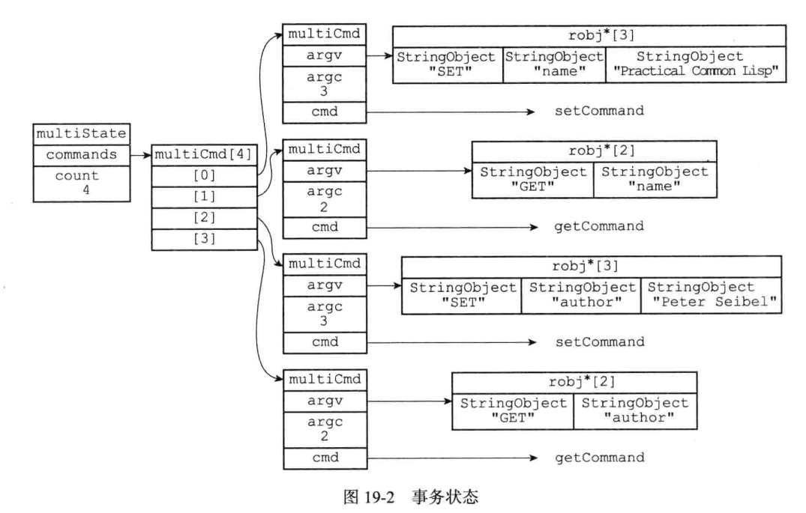

WATCH命令是一个乐观锁(optimistic locking), 它可以在EXEC命令执行之前监视任意数量的数据库键, 并在EXEC命令执行时检查被监视的键是否修改过了, 如果是则服务器拒绝执行事务, 返回执行失败。watch其实保证了多线程读写的happen-before语义。
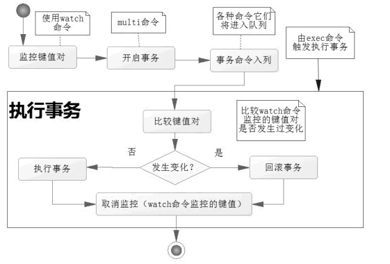

每隔redisDb会有一个字典表示监视的键, 字典的value是一个链表, 链表记录了监视数据库键对应的客户端。这样服务器知道哪些键被监视, 以及监视这些键的客户端。

所有对数据库修改的命令, 如SET, LPUSH, SADD, DEL等在执行之后都会调用touchWatchKey对watched_keys字典进行检查, 是否有客户端监视被修改过的键, 如果有该函数将修改客户端的REDIS_DIRTY_CAS标识, 表示该客户端安全性被破坏。如果客户端的REDIS_DIRTY_CAS标识被打开, 说明客户端提交的事务不再安全, 服务器拒绝执行该事务
```cpp
typedef struct redisDb {
  dict *watched_keys;// 正在被WATCH监视的键
} redisDb;
```

事务的ACID性质, 原子性atomicity, 一致性consistency, 隔离性isolation, 持久性durablity。

#### 缓存穿透
缓存穿透是指缓存和数据库中都没有的数据，而用户不断发起请求。由于缓存是不命中时被动写的，并且出于容错考虑，如果从存储层查不到数据则不写入缓存，这将导致这个不存在的数据每次请求都要到存储层去查询，失去了缓存的意义。 在流量大时，可能DB就挂掉了，要是有人利用不存在的key频繁攻击我们的应用，这就是漏洞。 如发起为id为"-1"的数据或id为特别大不存在的数据。这时的用户很可能是攻击者，攻击会导致数据库压力过大。 

解决方案 
1. 接口层增加校验，如用户鉴权校验，id做基础校验，id<=0的直接拦截； 
2. 从缓存取不到的数据，在数据库中也没有取到，这时也可以将key-value对写为key-null，缓存有效时间可以设置短点，如30秒（设置太长会导致正常情况也没法使用）。这样可以防止攻击用户反复用同一个id暴力攻击 
3. 布隆过滤器。bloomfilter就类似于一个hash set，用于快速判某个元素是否存在于集合中，其典型的应用场景就是快速判断一个key是否存在于某容器，不存在就直接返回。布隆过滤器的关键就在于hash算法和容器大小

#### 缓存击穿

缓存击穿是指缓存中没有但数据库中有的数据（一般是缓存时间到期），这时由于并发用户特别多，同时读缓存没读到数据，又同时去数据库去取数据，引起数据库压力瞬间增大，造成过大压力。 

解决方案 
1. 设置热点数据永远不过期。 
2. 接口限流与熔断，降级。重要的接口一定要做好限流策略，防止用户恶意刷接口，同时要降级准备，当接口中的某些 服务  不可用时候，进行熔断，失败快速返回机制。 
3. 加互斥锁

#### 缓存雪崩 
缓存雪崩是指缓存中数据大批量到过期时间，而查询数据量巨大，引起数据库压力过大甚至down机。和缓存击穿不同的是，缓存击穿指并发查同一条数据，缓存雪崩是不同数据都过期了，很多数据都查不到从而查数据库。 

解决方案 
1. 缓存数据的过期时间设置随机，防止同一时间大量数据过期现象发生。 
2. 如果缓存数据库是分布式部署，将热点数据均匀分布在不同的缓存数据库中。 
3. 设置热点数据永远不过期。
