> http协议也许是使用最广泛的应用层协议, https是http和tls的层叠, 值得品味

### HTTP报文

#### 请求报文

一个HTTP请求报文由请求行(request line)、请求头部(header)、空行和请求数据4个部分组成

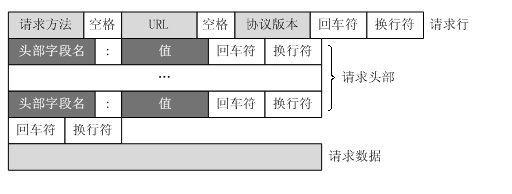

get请求举例

```
GET /favicon.ico HTTP/1.1\r\nHost: 172.20.109.213:9006\r\nConnection: keep-alive\r\nPragma: no-cache\r\nCache-Control: no-cache\r\nUser-Agent: Mozilla/5.0 (Windows NT 10.0; Win64; x64) AppleWebKit/537.36 (KHTML, like Gecko) Chrome/93.0.4577.82 Safari/537.36\r\nAccept: image/avif,image/webp,image/apng,image/svg+xml,image/*,*/*;q=0.8\r\nReferer: http://172.20.109.213:9006/5\r\nAccept-Encoding: gzip, deflate\r\nAccept-Language: en,zh-CN;q=0.9,zh;q=0.8,bs;q=0.7,zh-TW;q=0.6\r\n\r\n
```

post请求举例
```
"POST /3CGISQL.cgi HTTP/1.1\r\nHost: 172.20.109.213:9006\r\nConnection: keep-alive\r\nContent-Length: 21\r\nCache-Control: max-age=0\r\nUpgrade-Insecure-Requests: 1\r\nOrigin: http://172.20.109.213:9006\r\nContent-Type: application/x-www-form-urlencoded\r\nUser-Agent: Mozilla/5.0 (Windows NT 10.0; Win64; x64) AppleWebKit/537.36 (KHTML, like Gecko) Chrome/93.0.4577.82 Safari/537.36\r\nAccept: text/html,application/xhtml+xml,application/xml;q=0.9,image/avif,image/webp,image/apng,*/*;q=0.8,application/signed-exchange;v=b3;q=0.9\r\nReferer: http://172.20.109.213:9006/0\r\nAccept-Encoding: gzip, deflate\r\nAccept-Language: en,zh-CN;q=0.6\r\n\r\nuser=test&password=go"
```
解析http协议的过程就是一个解析字符串的过程, 具体的

1. 请求数据和请求头部的区分边界在`\r\n\r\n`
2. 第一个`\r\n`前面的是请求行; 中间的是请求头部, 请求头部每一行都是`字段名:值`的形式
3. POST方法将请求参数封装在HTTP请求数据中，以名称/值的形式出现，可以传输大量数据，这样POST方式对传送的数据大小没有限制，而且也不会显示在URL中。
4. **请求数据不在GET方法中使用，而是在POST方法中使用**。Get方法的请求body是空的, POST方法适用于需要客户填写表单的场合。与请求数据相关的最常使用的请求头是Content-Type和Content-Length。

#### 响应报文

HTTP响应也由三个部分组成，分别是：状态行、消息报头、响应正文。

状态行格式如下：
```
HTTP-Version Status-Code Reason-Phrase CRLF
```
其中，HTTP-Version表示服务器HTTP协议的版本；Status-Code表示服务器发回的响应状态代码；Reason-Phrase表示状态代码的文本描述。状态代码由三位数字组成，第一个数字定义了响应的类别，且有五种可能取值。

* 1xx：指示信息--表示请求已接收，继续处理。
* 2xx：成功--表示请求已被成功接收、理解、接受。
* 3xx：重定向--要完成请求必须进行更进一步的操作。
* 4xx：客户端错误--请求有语法错误或请求无法实现。
* 5xx：服务器端错误--服务器未能实现合法的请求。

常见状态代码、状态描述的说明如下。
```
200 OK：客户端请求成功。
400 Bad Request：客户端请求有语法错误，不能被服务器所理解。
401 Unauthorized：请求未经授权，这个状态代码必须和WWW-Authenticate报头域一起使用。
403 Forbidden：服务器收到请求，但是拒绝提供服务。
404 Not Found：请求资源不存在，举个例子：输入了错误的URL。
500 Internal Server Error：服务器发生不可预期的错误。
503 Server Unavailable：服务器当前不能处理客户端的请求，一段时间后可能恢复正常
```
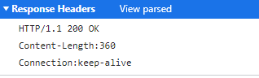

#### TCP和HTTP的keep alive

TCP的KeepAlive机制意图在于检测连接错误(默认两小时)。一方会不定期发送心跳包给另一方，当一方断掉的时候，没有断掉的定时发送几次心跳包，如果间隔发送几次，对方都返回的是RST，而不是ACK，那么就释放当前链接。

HTTP的keep-alive意图在于短时间内连接复用，希望可以短时间内在同一个连接上进行多次请求/响应。普通的http连接是客户端连接上服务端，然后结束请求后，由客户端或者服务端进行http连接的关闭。减少新建和断开TCP连接的消耗。

TCP的keepalive是在ESTABLISH状态的时候，双方如何检测连接的可用行。而http的keep-alive说的是如何避免进行重复的TCP三次握手和四次挥手的环节。

<!-- more -->

#### http1.0和http1.1

HTTP历史进程

1. HTTP 0.9(1991年)只支持get方法不支持请求头；
2. HTTP 1.0(1996年)基本成型，支持请求头、富文本、状态码、缓存、连接无法复用；
3. HTTP 1.1(1999年)支持连接复用、分块发送、断点续传；
4. HTTP 2.0(2015年)二进制分帧传输、多路复用、头部压缩、服务器推送等；
5. HTTP 3.0(2018年)QUIC 于2013年实现；2018年10月，IETF的HTTP工作组和QUIC工作组共同决定将QUIC上的HTTP映射称为 "HTTP/3"，以提前使其成为全球标准。

HTTP1.0 和 HTTP1.1

HTTP 1.0：仅支持保持短暂的 TCP 连接（连接无法复用）；不支持断点续传；前一个请求响应到达之后下一个请求才能发送，存在队头阻塞; HTTP 1.1：默认支持长连接（请求可复用TCP连接）；支持断点续传（通过在 Header 设置参数）；优化了缓存控制策略；管道化，可以一次发送多个请求，但是响应仍是顺序返回，仍然无法解决队头阻塞的问题; 新增错误状态码通知；请求消息和响应消息都支持Host头域。

* 优化缓存处理

HTTP1.0 中主要使用 header 里的 If-Modified-Since(比较资源最后的更新时间是否一致),Expires(资源的过期时间, 取决于客户端本地时间)) 来做为缓存判断的标准。

HTTP1.1 则引入了更多的缓存控制策略, Entity tag：资源的匹配信息; If-Unmodified-Since：比较资源最后的更新时间是否不一致; If-Match：比较 ETag 是否一致; If-None-Match：比较 ETag 是否不一致

* 带宽优化

HTTP1.0 中，存在一些浪费带宽的现象，例如客户端只是需要某个对象的一部分，而服务器却将整个对象送过来了，并且不支持断点续传功能。HTTP 1.1默认支持断点续传。

* host字段

HTTP1.0 中认为每台服务器都绑定一个唯一的 IP 地址，请求消息中的 URL 并没有传递主机名(hostname)。但随着虚拟主机技术的发展，在一台物理服务器上可以存在多个虚拟主机，并且它们共享一个 IP 地址。HTTP1.1 的请求消息和响应消息都应支持 Host 头域，且请求消息中如果没有 Host 头域会报告一个错误(400 Bad Request)。

* 长连接

HTTP1.0 需要使用keep-alive参数来告知服务器端要建立一个长连接，而 HTTP1.1 默认支持长连接。使用长连接的情况下，当一个网页打开完成后, 客户端和服务器之间用于传输HTTP数据的 TCP连接不会关闭, 如果客户端再次访问这个服务器上的网页, 会继续使用这一条已经建立的连接。Keep-Alive不会永久保持连接, 它有一个保持时间

* 错误通知

HTTP1.1 中新增了 24 个错误状态响应码，如 409（Conflict）表示请求的资源与资源的当前状态发生冲突；410（Gone）表示服务器上的某个资源被永久性的删除。

http1.1协议新增, PUT：请求服务器存储一个资源; DELETE：请求服务器删除标识的资源; OPTIONS：请求查询服务器的性能，或者查询与资源相关的选项和需求; CONNECT：保留请求以供将来使用; TRACE：请求服务器回送收到的请求信息，主要用于测试或诊断

### ASCII码和Base64


ASCII码(American Standard Code for Information Interchange, 美国信息互换标准代码) 是基于拉丁字母的一套电脑编码系统, 每个字符由一个字节组成也就是8bit, 为了能表示中文字符等, 延申出了Unicode, UTF8等编码, UTF-8 最大的特点是变长的编码方式, 可以使用1~4个字节表示一个符号，根据不同的符号而变化字节长度。这些编码的作用都是为了能够显示文本符号, 因为计算机内部都是二进制表示的, 人类能理解的字母, 数字都必须通过转码。

但是我们能理解的不全是文本, ASCII码存在不可见符号例如\n,\r, 空格等为了显示文本的结果。但对于图像我们不需要用这些不可见符号, 因此如果用ASCII码编码图像就会浪费资源。Base64 是一种基于 64 个可打印字符来表示二进制数据的表示方法, 即A-Z, a-z, +, - 共64个符号, 所以需要6个bit编码(2^6=64)。这样对于任何文本或者图像都可以编码成一个字符序列, 例如`a29uZ3J1aQ==`。用base64编码图像不会造成资源的浪费, 因为它等价于二进制但能通过可见字符序列让我们看到, 因此常用来表示嵌入到网页的图片. 此外, base64还用于二进制文本的网络传输.注意base64编码后的长度需要是4个字符的倍数，如果不是4的倍数需要在结尾加上=

### https协议

https协议离不开TLS/SSL两个协议。

SSL (Secure Sockets Layer）安全套接层。是由Netscape公司于1990年开发，用于保障Word Wide Web（WWW）通讯的安全。主要任务是提供私密性，信息完整性和身份认证。

TLS(Transport Layer Security）安全传输层协议,）用于在两个通信应用程序之间提供保密性和数据完整性。该标准协议是由IETF于1999年颁布，整体来说TLS非常类似SSLv3，只是对SSLv3做了些增加和修改。

现在一般使用TLS协议, SSL也被包含了进来。

#### SSL协议

SSL位于TCP/IP协议与各种应用层协议之间，为数据通信提高安全支持。

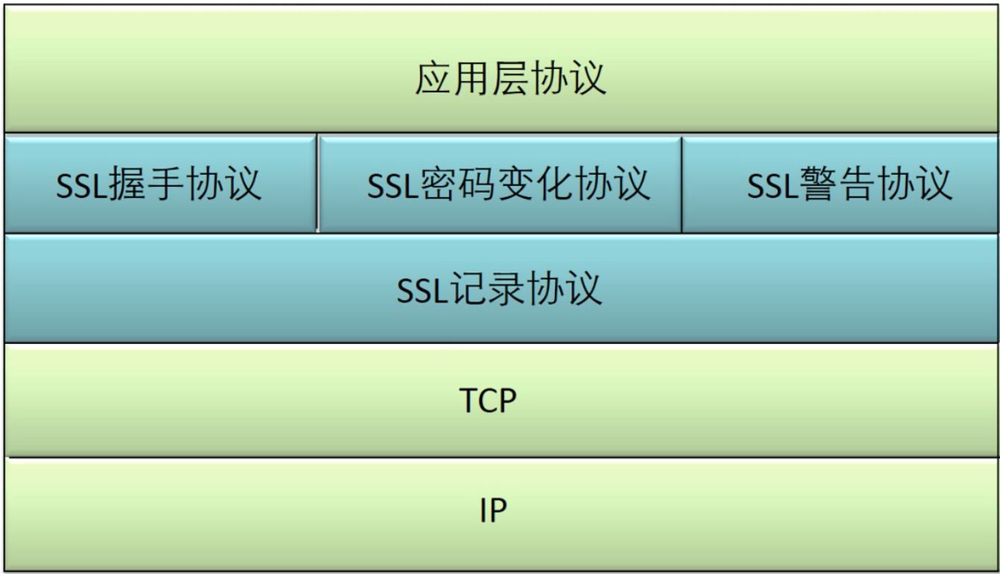

SSL的体系结构中包含两个协议子层，其中底层是SSL记录协议层（SSL Record Protocol Layer）；高层是SSL握手协议层（SSL HandShake Protocol Layer）。

1. SSL记录协议建立在可靠的传输（如TCP）之上，为高层协议提供数据封装、压缩、加密等基本功能。
2. SSL握手协议：它建立在SSL记录协议之上，用于在实际的数据传输开始之前，通讯双方进行身份认证、协商加密算法、交换加密密钥等。

SSL的建立大致可以分为两个阶段,

第一阶段：Handshake phase（握手阶段）, 包括协商加密算法,认证服务器,建立用于加密和MAC（Message Authentication Code）用的密钥

第二阶段：Secure data transfer phase（安全的数据传输阶段）, 在已经建立的SSL连接里安全的传输数据。

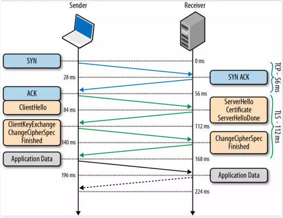
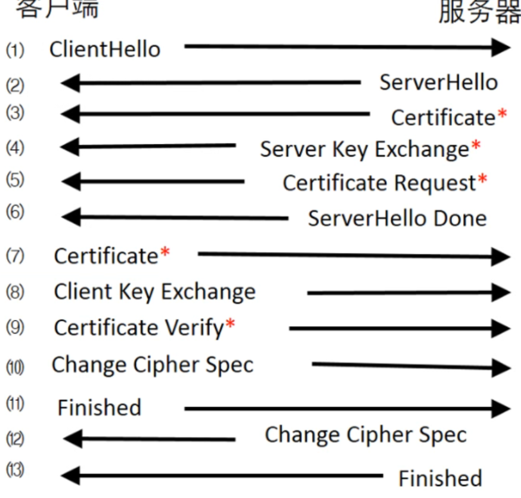

以下是SSL建立连接的过程, 也是https建立连接的过程。

https的加密层也是在tcp之上的。也就是说要先发SYN 通过三次握手发起TCP连接。

1. ClientHello, 客户端首先发起clientHello消息。包含一个客户端随机生成的random1 数字，客户端支持的加密算法，以及SSL信息。

2. ServerHello, 服务端会从 Client Hello 传过来的 Support Ciphers 里确定一份加密套件，这个套件决定了后续加密和生成摘要时具体使用哪些算法，另外还会生成一份随机数 Random2。至此客户端和服务端都拥有了两个随机数(Random1, Random2)和协商好的加密套件。

3. 接下来服务器将发送数字证书：服务器将数字证书和到根CA整个链发给客户端，使客户端能用服务器证书中的服务器公钥认证服务器。这意味着ServerHello的结束。

4. 客户端收到服务端传来的证书后，先从 CA 验证该证书的合法性，验证通过后取出证书中的服务端公钥，再生成一个随机数 Random3，用服务端公钥非对称加密 Random3 生成 PreMaster Key。并将PreMaster Key发送到服务端(公钥的作用是加密传输Random3)。Random3使用了非对称加密, 保证了安全性。服务端证书保证了服务端不会欺骗客户端, 有时候服务端会要求客户端发送证书保证客户端不会欺骗服务端。

5. 服务端通过私钥将PreMaster Key解密获取到Random3,此时客户端和服务器都持有三个随机数Random1 Random2 Random3,双方在通过这三个随即书生成一个对称加密的密钥。注意到Random1, Random2可能在发送过程中泄露，但Random3是绝密的, 因此密钥也是绝密的。双方根据这三个随机数经过相同的算法生成一个密钥(主要Random3是保密的),而以后应用层传输的数据都使用这套密钥进行加密(这是对称加密)。

6. 客户端和服务端都发送Change Cipher Spec消息和Finished消息给对方, 这一项同时也是前面发送的所有内容的hash值，用来供对方校验。如果客户端和服务端都能对Finish信息进行正常加解密且消息正确的被验证，则说明握手通道已经建立成功，接下来，双方可以使用上面产生的Session Secret对数据进行加密传输了。

可以看出HTTPS核心是对称加密数据，以及非对称加密进行密钥交换。

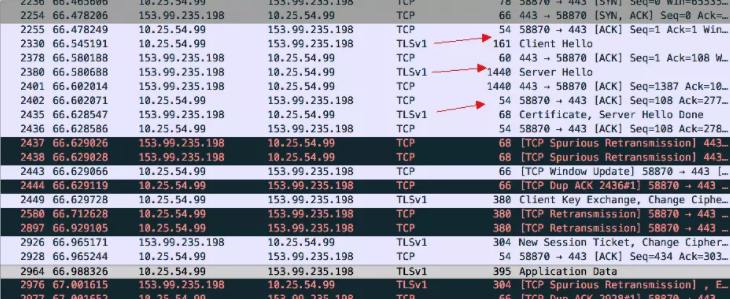

注意到TLS和SSL相比过程基本是相同的, TLS相当于SSL加密算法的升级, 使SSL更安全。它们关系是并列的，不能同时使用。

#### 证书

一般的, https常见的证书是服务器证书，用来验证服务器的身份。证书一般由权威机构签发，一般是CA证书。服务器事先注册自己的身份到CA,获得一个证书, 客户端根据服务器传来的证书向CA验证服务器的身份。如果遇到中间人攻击，由于中间人不可能伪造CA证书, 客户端很容易发现对方不是正确的服务器，避免被欺骗。

中间人不可伪造CA证书的原理是非对称加密, 服务器自己持有私钥, 私钥只有服务器自己知道, 别人不可伪造。服务器向CA提交公钥、组织信息、个人信息(域名)等信息并申请认证, 但不提交私钥，私钥只有服务器掌握。

服务器向客户端发送的证书包含了服务器公钥+申请者与颁发者信息+签名, 客户端会首先向CA验证服务器公钥的有效性。这杜绝了第三方伪造公钥的可能性, 因为第三方不知道服务器的私钥, 因此它的公钥也必然和服务器的公钥不同，因此必然无效。这一步防止身份伪装。

验证有效后利用对应 CA 的公钥解密签名数据，对比证书的信息摘要，这一步是防止数据被篡改。如果一致，则可以确认证书的合法性，即公钥合法；

另外，也有场景需要服务端验证客户端的合法性，常见的是金融机构，比如支付宝、银行客户端都需要安装证书。

证书实际是就是公钥, 它可以解密服务器私钥加密的数据。另外这个公钥由CA保证它和服务器身份是一一对应的，不会被其他人伪造。而CA是绝对信任的, 例如你信任CA的公钥是111, 别的公钥你都认为是假的，因此它不可被伪造。如果你信任错了那没辙，但是不可能所有人都信任错误的CA, 这是由法律政府保证的。

#### openssl生成证书
我们可以通过openssl生成证书。常见的x509证书

x509证书一般会用到三类文件，key，csr，crt。
1. key是私钥，openssl格式，通常是rsa算法。
2. csr是证书请求文件，用于申请证书。含有公钥信息，certificate signing request的缩写
3. crt certificate是CA认证后的证书文件

.pem格式：用于导出，导入证书时候的证书的格式。

证书的类别可以有三种
1. 根证书 生成服务器证书，客户端证书的基础。
2. 服务器证书 由根证书签发。配置在服务器上。
3. 客户端证书 由根证书签发。配置在服务器上，并发送给客户，让客户安装在浏览器里。

一般使用证书时, 首先要有一个 CA 根证书，然后用 CA 根证书来签发用户证书。用户进行证书申请：一般先生成一个私钥，然后用私钥生成证书请求（证书请求里应含有公钥信息），再利用证书服务器的 CA 根证书来签发证书。因此一般根证书来自权威机构。但你可以认为某个CA是权威的(虽然它压根不权威)，因此在使用时，我们可以自己产生根证书，并让浏览器信任这个"CA", 我们的CA就能用了。但真正的权威机构显然是被所有人信任的，默认配置。

生成根证书(CA)
```
# Generate CA private key (制作ca.key 私钥)
openssl genrsa -out ca.key 2048

# Generate CSR 
openssl req -new -key ca.key -out ca.csr

#OpenSSL创建的自签名证书在chrome端无法信任，需要添加如下
echo "subjectAltName=DNS:rojao.test.com,IP:10.10.2.137" > cert_extensions

# Generate Self Signed certificate（CA 根证书）用key和csr验证的证书ca.crt
openssl x509 -req -days 365 -in ca.csr -signkey ca.key -extfile cert_extensions -out ca.crt
```

服务端证书
```
# private key
openssl genrsa -des3 -out server.key 2048 

# generate csr
openssl req -new -key server.key -out server.csr

#OpenSSL创建的自签名证书在chrome端无法信任，需要添加如下
echo "subjectAltName=DNS:rojao.test.com,IP:10.10.2.137" > cert_extensions

# generate certificate, 基于ca.crt签发和server.csr得到server.crt, 不需要server.key
openssl ca -in server.csr -out server.crt  -extfile cert_extensions -cert ca.crt -keyfile ca.key
```

客户端证书
```
openssl genrsa -des3 -out client.key 1024 

openssl req -new -key client.key -out client.csr

openssl ca -in client.csr -out client.crt -cert ca.crt -keyfile ca.key
```

导出为pem格式证书
```
cat client.crt client.key> client.pem 

cat server.crt server.key > server.pem
```

CA的信任链条, 根CA是无条件信任的。
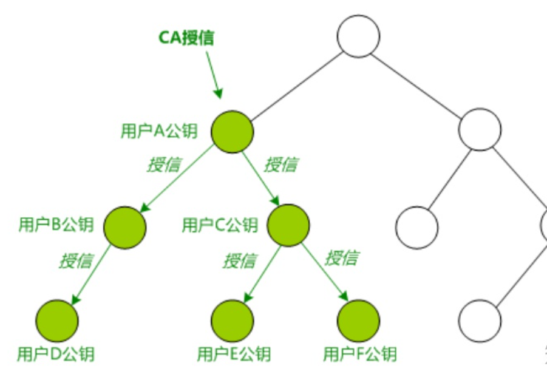

### 用wireshark分析https协议

我们可以直接在chrome访问网页, 例如www.baidu.com, 利用wireshark抓包来分析Https协议。但是可能因为例如缓存等一些其他配置影响wireshark显示的结果。因此我选择利用nginx配置的这个博客网站`https://larrystd.com`, 来进行Https的抓包分析。注意每次抓包前重启浏览器, 因为有可能长连接而不用建立连接。

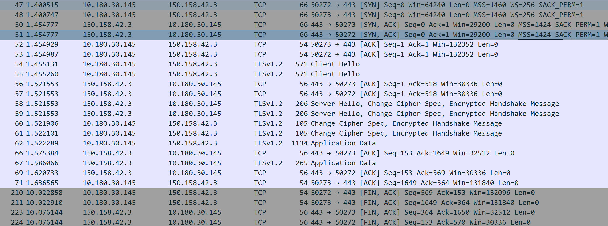

由上图可以看出, 前三个TCP包用来进行TCP三次握手连接。

接着是client Hello, Server Hello, Change Cipher spec。其中client, server hello会交换密钥, 加密方法等。Change Cipher spec是对之前内容的校验。在Application Data部分可以发送加密后的数据了。
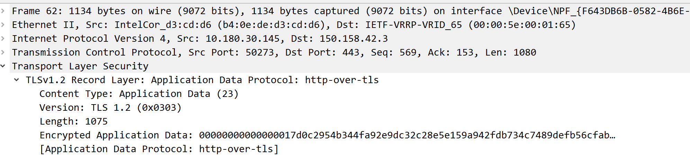

我们自然想查看解密后的结构

#### (Pre)-Master-Secret的keylog查看加密

这个原理在于 firefox 和 chrome 在运行时会检测环境变量SSLKEYLOGFILE, 它指向一个文件, firefox会把 DH 密钥交换的密钥保存到这个文件里面。因此我们设置环境变量SSLKEYLOGFILE指向一个文件, 然后令wireshark处理这个文件就能获得加密的密钥, 从而解密TLS。

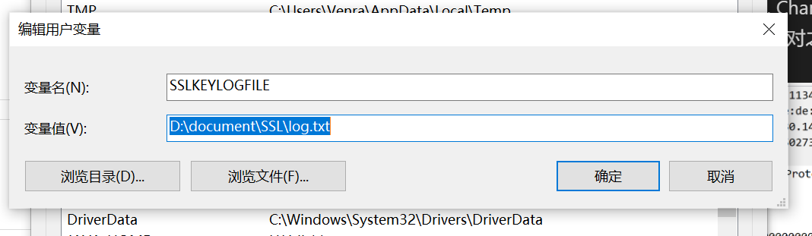

然后在TLS下设置Pre-Master-Secret log filename是这个文件
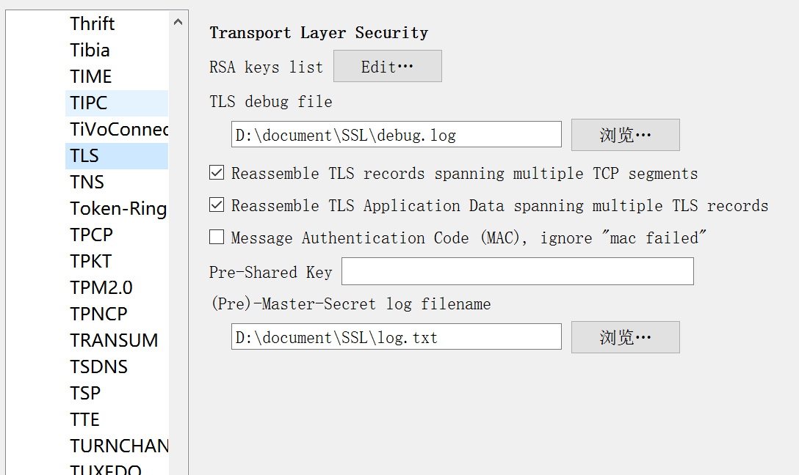

这样我们发现解密了原先的Application Data, 成为了应用层的HTTP协议
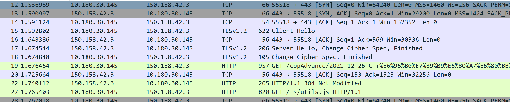

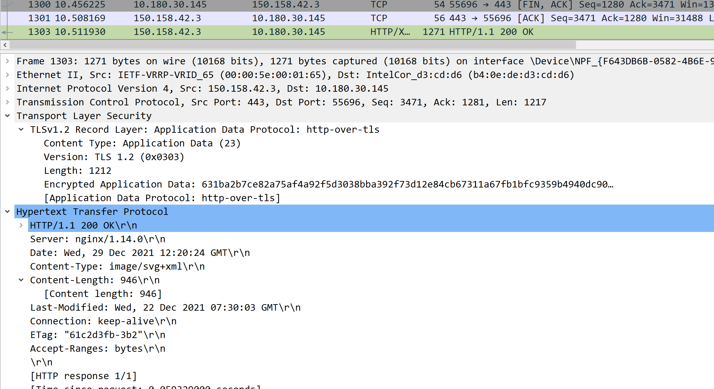

但是这种办法依赖于浏览器, 但也说明了在https实现自动化抓包也是可能的, 只需要获得DH密钥交换得到的密钥即可.HTTPS协议避免的是中间人攻击, 对正常的CS网络交互影响不大.但对于直播流这种大量数据传输的应用可能还是有影响的, 而事实上直播,视频采用的协议并非http协议.

例如bilibili使用UDP+DTLS,后者是UDP上的加密协议.而斗鱼, 西瓜视频似乎是直接的TCP协议.

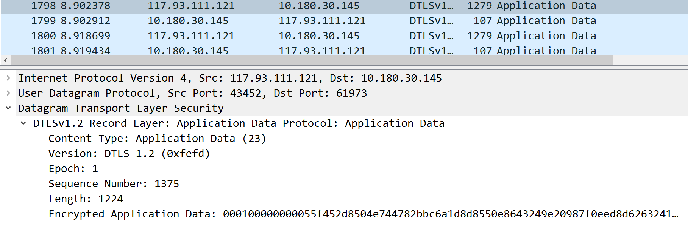

另外一种办法是得到服务器的密钥, 如cert.key文件.这种办法一般不常用, 因为很难拿到服务器的私钥.如果是大规模抓包分析, 一般采用自行搭建中间代理服务器的办法. 但大型互联网公司为了保护服务器接口, 一般会让app在发送请求之前做一些处理比如签名, 这样只有它的app可以正常连接服务器并得到信息, 而我们在手动抓包时因为只是代理, 尽管解密了https信息但仍不足以得到数据, 因为它的app做了处理(签名). 这样就有了app逆向, js逆向等技术来破解app内部处理办法从而获取正确的数据. 这种抓包或者说爬虫到这种程度已经成为门槛很高的学问了.

以上可以说明http+tls = https, https并没有多么神秘.另外tcp+tls协议也可以直接使用, 使用socket编程+openssl库我们可以抓到类似https的包

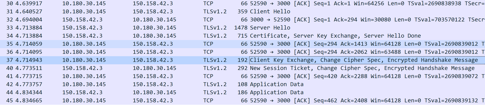

### 使用openssl处理tls层


初始化OpenSSL, 在建立SSL连接之前，要为Client和Server分别指定本次连接采用的协议及其版本，目前能够使用的协议版本包括SSLv2、SSLv3、SSLv2/v3和TLSv1.0。SSL连接若要正常建立，则要求Client和Server必须使用相互兼容的协议。
```cpp
  OPENSSL_config(NULL);

  SSL_library_init();         // 初始化SSL算法库函数( 加载要用到的算法 )，调用SSL函数之前必须调用此函数
  SSL_load_error_strings();   // 错误信息的初始化

  OpenSSL_add_all_algorithms();
```

创建CTX, CTX是SSL会话环境.
```cpp
//客户端、服务端都需要调用
SSL_CTX_new();                       //申请SSL会话环境

//若有验证对方证书的需求，则需调用
SSL_CTX_set_verify();                //指定证书验证方式
SSL_CTX_load_verify_location();      //为SSL会话环境加载本应用所信任的CA证书列表

//若有加载证书的需求，则需调用
int SSL_CTX_use_certificate_file();      //为SSL会话加载本应用的证书
int SSL_CTX_use_certificate_chain_file();//为SSL会话加载本应用的证书所属的证书链
int SSL_CTX_use_PrivateKey_file();       //为SSL会话加载本应用的私钥
int SSL_CTX_check_private_key();         //验证所加载的私钥和证书是否相匹配 
```

创建SSL套接字, 注意在之前要先创建Socket套接字，建立TCP连接。
```cpp
SSL *SSl_new(SSL_CTX *ctx);          //创建一个SSL套接字
int SSL_set_fd(SSL *ssl, int fd);     //以读写模式绑定流套接字
int SSL_set_rfd(SSL *ssl, int fd);    //以只读模式绑定流套接字
int SSL_set_wfd(SSL *ssl, int fd);    //以只写模式绑定流套接字
```

完成SSL握手, 这一步，我们需要在普通TCP连接的基础上，建立SSL连接。相当于再connect, accept一次, 只是不是tcp, 而是ssl.
```cpp
int SSL_connect(SSL *ssl);
int SSL_accept(SSL *ssl);
```

握手过程完成之后，Client通常会要求Server发送证书信息，以便对Server进行鉴别。CA证书就是X509
```cpp
X509 *SSL_get_peer_certificate(SSL *ssl);  //从SSL套接字中获取对方的证书信息
X509_NAME *X509_get_subject_name(X509 *a); //得到证书所用者的名字
```

接下来就是数据传输了, 数据传输阶段，需要使用SSL_read( )和SSL_write( )来代替普通流套接字所使用的read( )和write( )函数，以此完成对SSL套接字的读写操作
```cpp
int SSL_read(SSL *ssl,void *buf,int num);            //从SSL套接字读取数据
int SSL_write(SSL *ssl,const void *buf,int num);     //向SSL套接字写入数据
```

Client和Server之间的通信过程完成后，就使用以下函数来释放前面过程中申请的SSL资源
```cpp
int SSL_shutdown(SSL *ssl);       //关闭SSL套接字
void SSl_free(SSL *ssl);          //释放SSL套接字
void SSL_CTX_free(SSL_CTX *ctx);  //释放SSL会话环境
```

#### openssl

在构建SSL协议时需要使用openssl生成数字证书. 生成证书总共三步, 分别是生成key,csr, crt. 这里只是对服务器生成证书, 但调试时可以使用自签名的证书.也就是服务器用自己的私钥,给自己签发证书, 不需要第三方CA机构

csr, certificate signing request

crt, certificate

TLS：传输层安全协议 Transport Layer Security

SSL：安全套接字层 Secure Socket Layer

一般只会用到.key和.crt两个文件

首先第一步生成私钥, server.key
```
openssl genrsa -des3 -passout pass:ABCD -out server.pass.key 2048
openssl rsa -passin pass:ABCD -in server.pass.key -out server.key
```

然后根据公钥生成证书请求文件server.csr
```
openssl req -new -key server.key -out server.csr
```

用自己的私钥server.key签发证书server.crt
```
openssl x509 -req -sha256 -days 365 -in server.csr -signkey server.key -out server.crt
```

全部代码
```cpp
#include <openssl/bio.h>
#include <openssl/err.h>
#include <openssl/pem.h>
#include <openssl/ssl.h>

#include <arpa/inet.h>
#include <poll.h>
#include <stdio.h>
#include <stdlib.h>
#include <sys/socket.h>
#include <sys/types.h>
#include <unistd.h>
#include <string.h>

/* Global SSL context */
SSL_CTX *ctx;

#define DEFAULT_BUF_SIZE 64

void handle_error(const char *file, int lineno, const char *msg) {
  fprintf(stderr, "** %s:%i %s\n", file, lineno, msg);
  ERR_print_errors_fp(stderr);
  exit(-1);
}

#define int_error(msg) handle_error(__FILE__, __LINE__, msg)

void die(const char *msg) {
  perror(msg);
  exit(1);
}

void print_unencrypted_data(char *buf, size_t len) {
  printf("%.*s", (int)len, buf);
}

/* An instance of this object is created each time a client connection is
 * accepted. It stores the client file descriptor, the SSL objects, and data
 * which is waiting to be either written to socket or encrypted. */
struct ssl_client
{
  int fd;

  SSL *ssl;

  BIO *rbio; /* SSL reads from, we write to. */
  BIO *wbio; /* SSL writes to, we read from. */

  /* Bytes waiting to be written to socket. This is data that has been generated
   * by the SSL object, either due to encryption of user input, or, writes
   * requires due to peer-requested SSL renegotiation. */
  char* write_buf;
  size_t write_len;

  /* Bytes waiting to be encrypted by the SSL object. */
  char* encrypt_buf;
  size_t encrypt_len;

  /* Method to invoke when unencrypted bytes are available. */
  void (*io_on_read)(char *buf, size_t len);
} client;

/* This enum contols whether the SSL connection needs to initiate the SSL
 * handshake. */
enum ssl_mode { SSLMODE_SERVER, SSLMODE_CLIENT };

void ssl_client_init(struct ssl_client *p,
                     int fd,
                     enum ssl_mode mode)
{
  memset(p, 0, sizeof(struct ssl_client));

  p->fd = fd;

  p->rbio = BIO_new(BIO_s_mem());
  p->wbio = BIO_new(BIO_s_mem());
  p->ssl = SSL_new(ctx);

  if (mode == SSLMODE_SERVER)
    SSL_set_accept_state(p->ssl);  /* ssl server mode */
  else if (mode == SSLMODE_CLIENT)
    SSL_set_connect_state(p->ssl); /* ssl client mode */

  SSL_set_bio(p->ssl, p->rbio, p->wbio);

  p->io_on_read = print_unencrypted_data;
}

void ssl_client_cleanup(struct ssl_client *p)
{
  SSL_free(p->ssl);   /* free the SSL object and its BIO's */
  free(p->write_buf);
  free(p->encrypt_buf);
}

int ssl_client_want_write(struct ssl_client *cp) {
  return (cp->write_len>0);
}

/* Obtain the return value of an SSL operation and convert into a simplified
 * error code, which is easier to examine for failure. */
enum sslstatus { SSLSTATUS_OK, SSLSTATUS_WANT_IO, SSLSTATUS_FAIL};

static enum sslstatus get_sslstatus(SSL* ssl, int n)
{
  switch (SSL_get_error(ssl, n))
  {
    case SSL_ERROR_NONE:
      return SSLSTATUS_OK;
    case SSL_ERROR_WANT_WRITE:
    case SSL_ERROR_WANT_READ:
      return SSLSTATUS_WANT_IO;
    case SSL_ERROR_ZERO_RETURN:
    case SSL_ERROR_SYSCALL:
    default:
      return SSLSTATUS_FAIL;
  }
}

/* Handle request to send unencrypted data to the SSL.  All we do here is just
 * queue the data into the encrypt_buf for later processing by the SSL
 * object. */
void send_unencrypted_bytes(const char *buf, size_t len)
{
  client.encrypt_buf = (char*)realloc(client.encrypt_buf, client.encrypt_len + len);
  memcpy(client.encrypt_buf+client.encrypt_len, buf, len);
  client.encrypt_len += len;
}

/* Queue encrypted bytes. Should only be used when the SSL object has requested a
 * write operation. */
void queue_encrypted_bytes(const char *buf, size_t len)
{
  client.write_buf = (char*)realloc(client.write_buf, client.write_len + len);
  memcpy(client.write_buf+client.write_len, buf, len);
  client.write_len += len;
}

enum sslstatus do_ssl_handshake()
{
  char buf[DEFAULT_BUF_SIZE];
  enum sslstatus status;

  int n = SSL_do_handshake(client.ssl);
  status = get_sslstatus(client.ssl, n);

  /* Did SSL request to write bytes? */
  if (status == SSLSTATUS_WANT_IO)
    do {
      n = BIO_read(client.wbio, buf, sizeof(buf));
      if (n > 0)
        queue_encrypted_bytes(buf, n);
      else if (!BIO_should_retry(client.wbio))
        return SSLSTATUS_FAIL;
    } while (n>0);

  return status;
}

/* Process SSL bytes received from the peer. The data needs to be fed into the
   SSL object to be unencrypted.  On success, returns 0, on SSL error -1. */
   // 被监听的回调函数
int on_read_cb(char* src, size_t len)
{
  char buf[DEFAULT_BUF_SIZE];
  enum sslstatus status;
  int n;

  while (len > 0) {
    n = BIO_write(client.rbio, src, len);

    if (n<=0)
      return -1; /* assume bio write failure is unrecoverable */

    src += n;
    len -= n;

    if (!SSL_is_init_finished(client.ssl)) {
      if (do_ssl_handshake() == SSLSTATUS_FAIL)
        return -1;
      if (!SSL_is_init_finished(client.ssl))
        return 0;
    }

    /* The encrypted data is now in the input bio so now we can perform actual
     * read of unencrypted data. */

    do {
      n = SSL_read(client.ssl, buf, sizeof(buf));
      if (n > 0)
        client.io_on_read(buf, (size_t)n);
    } while (n > 0);

    status = get_sslstatus(client.ssl, n);

    /* Did SSL request to write bytes? This can happen if peer has requested SSL
     * renegotiation. */
    if (status == SSLSTATUS_WANT_IO)
      do {
        n = BIO_read(client.wbio, buf, sizeof(buf));
        if (n > 0)
          queue_encrypted_bytes(buf, n);
        else if (!BIO_should_retry(client.wbio))
          return -1;
      } while (n>0);

    if (status == SSLSTATUS_FAIL)
      return -1;
  }

  return 0;
}

/* Process outbound unencrypted data that is waiting to be encrypted.  The
 * waiting data resides in encrypt_buf.  It needs to be passed into the SSL
 * object for encryption, which in turn generates the encrypted bytes that then
 * will be queued for later socket write. */
int do_encrypt()
{
  char buf[DEFAULT_BUF_SIZE];
  enum sslstatus status;

  if (!SSL_is_init_finished(client.ssl))
    return 0;

  while (client.encrypt_len>0) {
    int n = SSL_write(client.ssl, client.encrypt_buf, client.encrypt_len);
    status = get_sslstatus(client.ssl, n);

    if (n>0) {
      /* consume the waiting bytes that have been used by SSL */
      if ((size_t)n<client.encrypt_len)
        memmove(client.encrypt_buf, client.encrypt_buf+n, client.encrypt_len-n);
      client.encrypt_len -= n;
      client.encrypt_buf = (char*)realloc(client.encrypt_buf, client.encrypt_len);

      /* take the output of the SSL object and queue it for socket write */
      do {
        n = BIO_read(client.wbio, buf, sizeof(buf));
        if (n > 0)
          queue_encrypted_bytes(buf, n);
        else if (!BIO_should_retry(client.wbio))
          return -1;
      } while (n>0);
    }

    if (status == SSLSTATUS_FAIL)
      return -1;

    if (n==0)
      break;
  }
  return 0;
}

/* Read bytes from stdin and queue for later encryption. */
void do_stdin_read()
{
  char buf[DEFAULT_BUF_SIZE];
  ssize_t n = read(STDIN_FILENO, buf, sizeof(buf));
  if (n>0)
    send_unencrypted_bytes(buf, (size_t)n);
}

/* Read encrypted bytes from socket. */
int do_sock_read()
{
  char buf[DEFAULT_BUF_SIZE];
  ssize_t n = read(client.fd, buf, sizeof(buf));

  if (n>0)
    return on_read_cb(buf, (size_t)n);
  else
    return -1;
}

/* Write encrypted bytes to the socket. */
int do_sock_write()
{
  ssize_t n = write(client.fd, client.write_buf, client.write_len);
  if (n>0) {
    if ((size_t)n<client.write_len)
      memmove(client.write_buf, client.write_buf+n, client.write_len-n);
    client.write_len -= n;
    client.write_buf = (char*)realloc(client.write_buf, client.write_len);
    return 0;
  }
  else
    return -1;
}

void ssl_init(const char * certfile, const char* keyfile)
{
  printf("initialising SSL\n");

  /* SSL library initialisation */
  SSL_library_init();
  OpenSSL_add_all_algorithms();
  SSL_load_error_strings();
  ERR_load_BIO_strings();
  ERR_load_crypto_strings();

  /* create the SSL server context */
  ctx = SSL_CTX_new(SSLv23_method());
  if (!ctx)
    die("SSL_CTX_new()");

  /* Load certificate and private key files, and check consistency */
  if (certfile && keyfile) {
    if (SSL_CTX_use_certificate_file(ctx, certfile,  SSL_FILETYPE_PEM) != 1)
      int_error("SSL_CTX_use_certificate_file failed");

    if (SSL_CTX_use_PrivateKey_file(ctx, keyfile, SSL_FILETYPE_PEM) != 1)
      int_error("SSL_CTX_use_PrivateKey_file failed");

    /* Make sure the key and certificate file match. */
    if (SSL_CTX_check_private_key(ctx) != 1)
      int_error("SSL_CTX_check_private_key failed");
    else
      printf("certificate and private key loaded and verified\n");
  }

  /* Recommended to avoid SSLv2 & SSLv3 */
  SSL_CTX_set_options(ctx, SSL_OP_ALL|SSL_OP_NO_SSLv2|SSL_OP_NO_SSLv3);
}
```

server.c
```cpp

#include "common.h"

int main(int argc, char **argv)
{
  char str[INET_ADDRSTRLEN];
  int port = (argc>1)? atoi(argv[1]):55555;

  int servfd = socket(AF_INET, SOCK_STREAM, 0); // 创建sockfd
  if (servfd < 0)
    die("socket()");

  int enable = 1;
  if (setsockopt(servfd, SOL_SOCKET, SO_REUSEADDR, &enable, sizeof(enable)) < 0)  // 设置sockfd一些属性
    die("setsockopt(SO_REUSEADDR)");

  /* Specify socket address */
  struct sockaddr_in servaddr;
  memset(&servaddr, 0, sizeof(servaddr)); // 设置addr
  servaddr.sin_family = AF_INET;
  servaddr.sin_addr.s_addr = htonl(INADDR_ANY);
  servaddr.sin_port = htons(port);

  if (bind(servfd, (struct sockaddr *)&servaddr, sizeof(servaddr)) < 0)
    die("bind()");

  if (listen(servfd, 128) < 0)  // 设置sockfd可监听
    die("listen()");

  int clientfd;
  struct sockaddr_in peeraddr;
  socklen_t peeraddr_len = sizeof(peeraddr);

  struct pollfd fdset[2];
  memset(&fdset, 0, sizeof(fdset));

  fdset[0].fd = STDIN_FILENO;
  fdset[0].events = POLLIN;

  ssl_init("server.crt", "server.key"); // see README to create these files

  while (1) {
    printf("waiting for next connection on port %d\n", port);

    clientfd = accept(servfd, (struct sockaddr *)&peeraddr, &peeraddr_len); // 接受client连接的fd
    if (clientfd < 0)
      die("accept()");

    ssl_client_init(&client, clientfd, SSLMODE_SERVER); // 初始化ssl_client

    inet_ntop(peeraddr.sin_family, &peeraddr.sin_addr, str, INET_ADDRSTRLEN);
    printf("new connection from %s:%d\n", str, ntohs(peeraddr.sin_port));

    fdset[1].fd = clientfd;

    /* event loop */

    fdset[1].events = POLLERR | POLLHUP | POLLNVAL | POLLIN;
#ifdef POLLRDHUP
    fdset[1].events |= POLLRDHUP;
#endif

    while (1) {
      fdset[1].events &= ~POLLOUT;
      fdset[1].events |= (ssl_client_want_write(&client)? POLLOUT : 0);

      int nready = poll(&fdset[0], 2, -1);

      if (nready == 0)
        continue; /* no fd ready */

      int revents = fdset[1].revents;
      if (revents & POLLIN)
        if (do_sock_read() == -1)
          break;
      if (revents & POLLOUT)
        if (do_sock_write() == -1)
          break;
      if (revents & (POLLERR | POLLHUP | POLLNVAL))
        break;
#ifdef POLLRDHUP
      if (revents & POLLRDHUP)
        break;
#endif
      if (fdset[0].revents & POLLIN)
        do_stdin_read();
      if (client.encrypt_len>0)
        do_encrypt();
    }

    close(fdset[1].fd);
    ssl_client_cleanup(&client);
  }

  return 0;
}
```

client.c
```cpp

#include "common.h"

int main(int argc, char **argv)
{
  int port = argc>1? atoi(argv[1]):55555;
  char* host="150.158.42.3";

  int sockfd = socket(AF_INET, SOCK_STREAM, 0);
  if (sockfd < 0)
    die("socket()");

  /* Specify socket address */
  struct sockaddr_in addr;
  memset(&addr, 0, sizeof(addr));
  addr.sin_family = AF_INET;
  addr.sin_port = htons(port);
  if (inet_pton(AF_INET, host, &(addr.sin_addr)) <= 0)
    die("inet_pton()");

  if (connect(sockfd, (struct sockaddr*) &addr, sizeof(addr)) < 0)  // 发起连接请求
    die("connect()");

  // TCP连接成功
  struct pollfd fdset[2];
  memset(&fdset, 0, sizeof(fdset));

  fdset[0].fd = STDIN_FILENO;
  fdset[0].events = POLLIN;

  ssl_init(0,0);
  ssl_client_init(&client, sockfd, SSLMODE_CLIENT);

  fdset[1].fd = sockfd;
  fdset[1].events = POLLERR | POLLHUP | POLLNVAL | POLLIN;
#ifdef POLLRDHUP
  fdset[1].events |= POLLRDHUP;
#endif

  /* event loop */

  do_ssl_handshake();

  while (1) {
    fdset[1].events &= ~POLLOUT;
    fdset[1].events |= ssl_client_want_write(&client)? POLLOUT:0;

    int nready = poll(&fdset[0], 2, -1);

    if (nready == 0)
      continue; /* no fd ready */

    int revents = fdset[1].revents;
    if (revents & POLLIN)
      if (do_sock_read() == -1)
        break;
    if (revents & POLLOUT)
      if (do_sock_write() == -1)
        break;
    if (revents & (POLLERR | POLLHUP | POLLNVAL))
      break;
#ifdef POLLRDHUP
    if (revents & POLLRDHUP)
      break;
#endif
    if (fdset[0].revents & POLLIN)
      do_stdin_read();
    if (client.encrypt_len>0)
      do_encrypt();
  }

  close(fdset[1].fd);
  ssl_client_cleanup(&client);

  return 0;
}
```

抓包结果
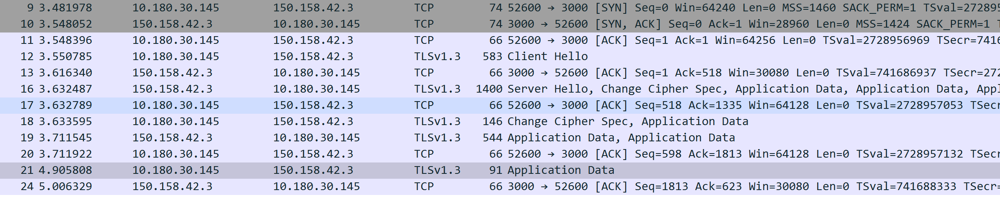