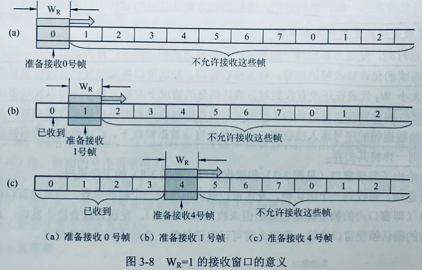
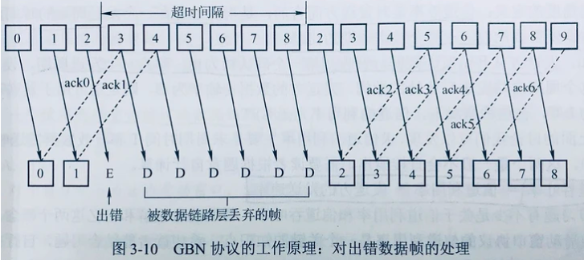
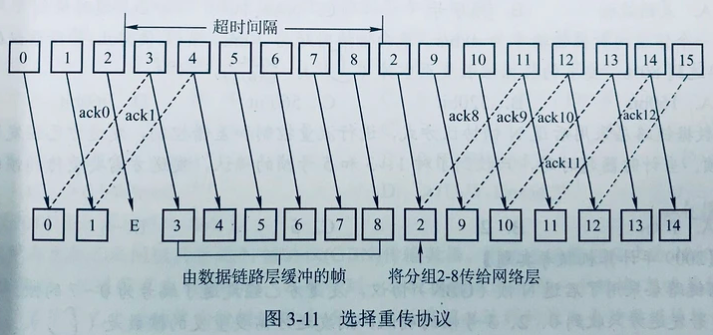
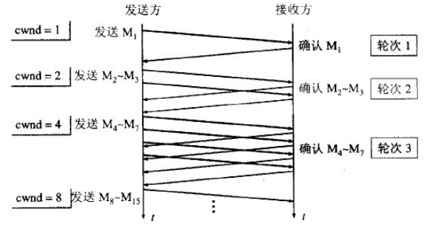
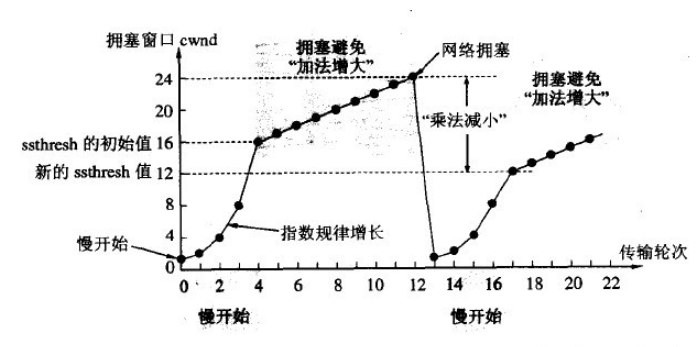
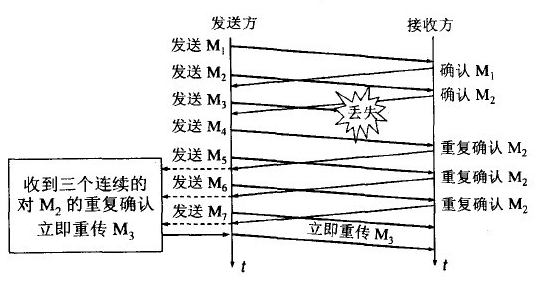
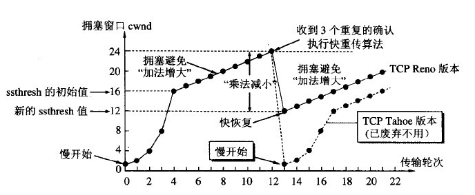

### 链路层传输协议

流量控制涉及对链路上的帧的发送速率的控制 ，以使接收方有足够的缓冲空间来接收每一个帧。流量控制的基本方法是由接收方控制发送方发送数据的速率 ，常见的方式有两种 ： 停止-等待协议和滑动窗口协议。

#### 停止等待协议

发送方每发送一帧，都要等待接收方应答信号，之后才能发送下一帧；接收方每接收一帧，都要反馈一个应答信号，表示可以接收下一帧，如果接收方不反馈应答信号，则发送发必须一直等待。每次只允许发送一帧，然后就陷入等待接收对方确认信号的过程中，因而传输效率很低。

#### 滑动窗口协议

在任意时刻，发送方都维持一组连续的允许发送的帧的序号，称为发送窗口；同时接收方也维持一组连续的允许接收的序号，称为接收窗口。对于发送方, 只有收到确认帧才发送窗口才向前滑动。接收方只有收到当前数据帧的序号落入接收窗口内才允许将该数据帧收下，若接收的数据帧落在接收窗口之外，则一律将其丢弃。

#### 可靠传输
数据链路层(和传输层)的可靠传输通常使用确认帧和超市重传两种机制来完成。
确认帧是一种无数据的控制帧，这种控制帧使得接收方可以让发送方知道哪些内容被正确接收。有些情况下为了提高传输效率。将确认帧捎带在一个回复帧中，成为捎带确认。

超时重传是指发送方在发送某一个数据帧以后就开始一个计时器，在一定时间内如果没有得到发送的数据帧的确认帧，那么就重新发送该数据帧，直到发送成功为止。



#### 后退N帧协议(GBN)

停止-等待协议通信信道的利用率很低 。为了克服这一缺点 ，就产生了另外两种协议 ，即后退 N帧协议和选择重传协议。

停止等待协议：发送窗口大小=1，接收窗口大小=1；
后退N帧协议：发送窗口大小>1，接收窗口大小=1；
选择重传协议：发送窗口大小>1，就收窗口大小>1;

对于GBN协议, 当发送方发送了N个帧后，若发现该N个帧的前一个帧被判为出错或丢失，此时发送方就不得不重传该出错帧及随后的N个帧。后退N帧协议的接收窗口为1，可以保证按序接收数据帧。



#### 选择重传协议（SR）

只重传出现差错的数据帧或者是计数器超时的数据帧。

在选择重传协议中，每一个发送缓冲区对应一个计时器，当计时器超时时，缓冲区的帧就会重传。一旦接收方怀疑帧出错，就会发送一个否定帧NAK给发送方，要求发送方对NAK中指定的帧进行重传。

选择重传协议的接收窗口尺寸 Wr 和发送窗口尺寸 Wt 都大于1，一次可以发送或接收多个帧。



### TCP 流量控制和拥塞控制

#### 流量控制

TCP使用滑动窗口的算法进行流量控制, 接收方每次收到数据包，可以在发送确定报文的时候，同时告诉发送方自己的缓存区还剩余多少是空闲的，我们也把缓存区的剩余大小称之为接收窗口大小，用变量win来表示接收窗口的大小。

发送方收到之后，便会调整自己的发送速率，也就是调整自己发送窗口的大小，当发送方收到接收窗口的大小为0时，发送方就会停止发送数据，防止出现大量丢包情况的发生。

当发送方收到接受窗口 win = 0 时，这时发送方停止发送报文，并且同时开启一个定时器，每隔一段时间就发个测试报文去询问接收方，打听是否可以继续发送数据了，如果可以，接收方就告诉他此时接受窗口的大小；如果接受窗口大小还是为0，则发送方再次刷新启动定时器。

<!-- more -->

#### 拥塞控制

拥塞控制也使用一个滑动窗口, 不过这个滑动窗口叫拥塞窗口cwnd(congestion window)。拥塞窗口的大小取决于网络的拥塞程度，并且动态地在变化。发送方让自己的发送窗口等于拥塞窗口。发送方控制拥塞窗口的原则是：只要网络没有出现拥塞，拥塞窗口就再增大一些，以便把更多的分组发送出去。但只要网络出现拥塞，拥塞窗口就减小一些，以减少注入到网络中的分组数。

* 慢开始

从上图可以看到，一个传输轮次所经历的时间其实就是往返时间RTT，每经过一个传输轮次(transmission round)，拥塞窗口cwnd就加倍。

为了防止cwnd增长过大引起网络拥塞，还需设置一个慢开始门限ssthresh状态变量。当`cwnd<ssthresh`时，使用慢开始算法。当cwnd>ssthresh时，改用拥塞避免算法。当cwnd=ssthresh时，慢开始与拥塞避免算法任意



* 拥塞避免

拥塞避免算法让拥塞窗口缓慢增长，即每经过一个往返时间RTT就把发送方的拥塞窗口cwnd线性增加，而不是加倍。

无论是在慢开始阶段还是在拥塞避免阶段，只要发送方判断网络出现拥塞（其根据就是没有按时收到确认，虽然没有收到确认可能是其他原因的分组丢失，但是因为无法判定，所以都当做拥塞来处理），就把慢开始门限ssthresh设置为出现拥塞时的发送窗口大小的一半（但不能小于2）。然后把拥塞窗口cwnd重新设置为1，执行慢开始算法。这样做的目的就是要迅速减少主机发送到网络中的分组数，使得发生拥塞的路由器有足够时间把队列中积压的分组处理完毕。



#### 丢包处理

如果发生了拥塞, 意味着很有可能发生了丢包,丢包处理有快重传和快恢复。

快重传要求**接收方在收到一个失序的报文段后就立即发出重复确认**。发送方只要一连收到三个重复确认就应当立即重传对方尚未收到的报文段，而不必继续等待设置的重传计时器时间到期。



快重传配合使用的还有快恢复算法，有以下两个要点:

1. 当发送方连续收到三个重复确认时，就执行乘法减小，把ssthresh门限减半。但是接下去并不执行慢开始算法。

2. 考虑到如果网络出现拥塞的话就不会收到好几个重复的确认，所以发送方现在认为网络可能没有出现拥塞。所以此时不执行慢开始算法，而是将cwnd设置为ssthresh的大小，然后执行拥塞避免算法。



### DNS协议

DNS协议亦即DNS解析协议, 也就是将域名解析成IP地址。

步骤
1. 首先搜索浏览器的 DNS 缓存，缓存中维护一张域名与 IP 地址的对应表；

2. 若没有命中，则继续搜索操作系统的 DNS 缓存；

3. 若仍然没有命中，则操作系统将域名发送至本地域名服务器，本地域名服务器查询自己的 DNS 缓存，查找成功则返回结果（注意：主机和本地域名服务器之间的查询方式是递归查询）；

4. 若本地域名服务器的 DNS 缓存没有命中，则本地域名服务器向上级域名服务器进行查询，通过以下方式进行迭代查询(注意：本地域名服务器和其他域名服务器之间的查询方式是迭代查询，防止根域名服务器压力过大)：

首先本地域名服务器向根域名服务器发起请求，根域名服务器是最高层次的，它并不会直接指明这个域名对应的 IP 地址，而是返回顶级域名服务器的地址，也就是说给本地域名服务器指明一条道路，让他去这里寻找答案

本地域名服务器拿到这个顶级域名服务器的地址后，就向其发起请求，获取权限域名服务器的地址

本地域名服务器根据权限域名服务器的地址向其发起请求，最终得到该域名对应的 IP 地址

5. 本地域名服务器将得到的 IP 地址返回给操作系统，同时自己将 IP 地址缓存起来

6. 操作系统将 IP 地址返回给浏览器，同时自己也将 IP 地址缓存起来

7. 至此，浏览器就得到了域名对应的 IP 地址，并将 IP 地址缓存起来

### 路由选择算法


### 使用wireshark分析计算机网络所有层


前三行表示三次握手。第一次握手：客户端发送syn包(syn=j)到服务器，并进入`SYN_SEND`状态，等待服务器确认;第二次握手：服务器收到syn包，必须确认客户的syn(ack=j+1)，同时自己也发送一个SYN包(syn=k)，即SYN+ACK包，此时服务器进入`SYN_RECV`状态；第三次握手：客户端收到服务器的SYN+ACK包，向服务器发送确认包ACK(ack=k+1, 下一个ACK为对方发送的SYN+1)，此包发送完毕，客户端和服务器进入`ESTABLISHED`状态，完成三次握手。

注意连接时服务器进入`SYN_RECV`状态时，服务器发送SYN+ACK进入`SYN_RECV`状态，会临时开放一个端口并在一段时间内等待客户端的第三次握手。这时候如果恶意客户端短时间内发送大量恶意SYN, 将消耗服务器端口等资源使服务器无法服务其他的连接，这就是SYN flood攻击。这是利用tcp三次握手的缺陷进行的。

* TCP sequence number seq序列号占4个字节, 当某端开启一个TCP会话时，他的初始序列号(seq)是随机的，可能是0和4,294,967,295(2^32-1)之间的任意值,序号的生成也是随机的，通常是一个很大的数值。像Wireshark这种工具，通常显示的都是**相对序列号/确认号**, wireshark中一般初始SYN和ACK都为0, 比起真实序列号/确认号，跟踪更小的相对序列号/确认号会相对容易一些。序列号表示某端packet的数据部分的第一位应该在整个data stream中所在的位置, 可以认为是一共发了多少字节的数据。例如No23的seq=18, 原因是客户端上一次发送No19时seq=1, 而No19一共发送了17字节的数据, 所有No23的seq=1+17=18

* TCP acknowledge number ack确认号也占四个字节：表示的是期望的对方(接收方)的下一次sequence number是多少。显然因为No23的seq为18, 所以No21,No22的ACK都是18, 因为它们期望的下一个seq,也就是No23的seq, 是18。

连接建立后，客户端和服务器就可以开始进行数据传输。第四行就是数据传输了, 具体的, 第四行客户端向服务端发送数据(17字节), 第5行服务器表示收到并想接收seq=18(ACK=18), 第6行服务器向客户端发送处理好的数据, 第7行客户端表示收到(ACK), 想接收服务器seq=18(ack=18)。准确收到了数据会发送ACK=1确认, 发送数据时会发送PSH=1。没有用到的URG和RST， URG表示要紧急处理, 接收方收到URH标志有效的数据报时，回去检测TCP 报头中的16 位字段紧急指针。 该字段指示从第一个字节计数的段中的数据时多少紧急处理的。rst段标识复位，用来异常的关闭连接。发送rst段关闭连接时，不必等缓冲区的数据都发送出去，直接丢弃缓冲区中的数据。而接收端收到rst段后，也不必发送ack来确认。例如连接一个未监听的端口, 服务器会发送rst=1.


第8行(No 32) 客户端请求关闭连接发送[FIN,ACK], 第11行服务器发送ACK确认表示想接受下一个seq为19(表示同意)。服务器经短暂CLOSE_WAIT接着发送[FIN,ACK]请求断开连接, 进入LAST_ACK状态。客户端最后发送[ACK]确认服务器连接关闭。客户端进入`TIME_WAIT`阶段如果等待2MSL的时间后依然没有收到回复，证明Server端已正常关闭，Client端关闭连接了。

* 链路Ethernet层
此外, 我们还可以分析数据包各部分的大小。
EthernetII以太网帧报头为14字节, 由6字节的目的MAC地址, 6字节的MAC源地址, 2字节的IP类型


* 网络IP层

IPV4的数据报头为20字节, 注意2个字节存储数据报长度, 1byte的生存时间, 1byte的传输层协议, 2字节首部校验和, 4字节源地址(32位), 4字节目的地址。


TCP报头固定部分为20字节, 包括2字节的源端口, 2字节的目的端口, 4字节的seq, 4字节ack, 半字节首部长度。SYN, FIN, ACK等只有一位。注意ack number用于正常通信, 期待下一个seq值, ACK用于三次握手。即客户端SYN=1->服务端SYN=1,ACK=1 ->客户端ACK=1。FIN用于四次挥手, 即客户端FIN=1,ACK=1 -> 服务端ACK=1 -> 

2字节的滑动窗口(拥塞控制, 窗口大小表示在确认了字节之后还可以发送多少个字节),2字节检验和。但是**TCP报头选项部分字节不一, 因此无法确定TCP报头的字节数**。例如下图选项部分为12字节。


最后是17字节的数据, 前面的总计14+20+20+12 = 66字节, 因此包大小总计66+17=83字节。


#### TIME_WAIT和CLOSE_WAIT

区分这两个状态的原因, 是在四次挥手过程中两个状态分别存在于两端中, 主动释放进入TIME_WAIT状态, 被动释放者进入CLOSE_WAIT状态。TIME_WAIT和CLOSE_WAIT两种状态如果一直被保持，意味着对应数目的通道就一直被占着，一旦达到句柄数上限，新的请求就无法被处理了。

* TIME_WAIT防止FIN发送时丢包，如果新连接建立后上一个包又出现了, 会影响新连接。(经过2MSL，上一次连接中所有的重复包都会消失)。主动断开者发送FIN之后会进入`TIME_WAIT`状态, 一般服务器不要是主动断开的发起者(除非是爬虫服务器)。如果有一直处于TIME_WAIT的风险, 修改`/etc/sysctl.conf`文件，服务器能够快速回收和重用那些TIME_WAIT的资源。


```cpp
#表示开启SYN Cookies。当出现SYN等待队列溢出时，启用cookies来处理，可防范少量SYN攻击，默认为0，表示关闭    
net.ipv4.tcp_syncookies = 1    
#表示开启重用。允许将TIME-WAIT sockets重新用于新的TCP连接，默认为0，表示关闭    
net.ipv4.tcp_tw_reuse = 1    
#表示开启TCP连接中TIME-WAIT sockets的快速回收，默认为0，表示关闭    
net.ipv4.tcp_tw_recycle = 1  
#表示如果套接字由本端要求关闭，这个参数决定了它保持在FIN-WAIT-2状态的时间    
net.ipv4.tcp_fin_timeout=30  

cat /proc/sys/net/ipv4/tcp_fin_timeout
```

* 长时间处于`CLOSE_WAIT`的原因是服务器在客户端发送断开请求时没有及时向客户端发送断开的信息, 因为正常情况下`CLOSE_WAIT`存在时间很短。这样往往是程序的问题, 比如服务端没有执行`close(fd)`。
* **在网络编程中尽量让客户端先释放连接(防止服务端进入TIME_WAIT), 客户端释放连接后服务端应该优先处理(防止服务端进入CLOSE_WAIT)**

客户端


测试代码
server.c
```cpp
/// server.c
#include <stdio.h>
#include <unistd.h>
#include <sys/socket.h>		// socket header
#include <stdlib.h>
#include <arpa/inet.h>
#include <ctype.h>
#include <strings.h>

//#define IP "127.0.0.1"	// IP  address
#define IP "1.15.92.55"
#define PORT 5000		// port number

int main(int argc, char *argv[])
{
	int lfd, cfd;		// lfd is socket descriptor
	struct sockaddr_in serv_addr, clie_addr;
	socklen_t clie_addr_len;
	char buf[BUFSIZ], clie_ip[BUFSIZ];	//  #define 8192 bytes
	int n, i, ret;

	lfd = socket(AF_INET, SOCK_STREAM, 0);	// SOCK_STREAM means tcp protocol		/* Sequenced, reliable, connection-based byte streams.  */
	if (lfd == -1)
	{
		perror("socket error");
		exit(1);
	}

	/// Construct client address IP+port 127.0.0.1+5000
	bzero(&serv_addr, sizeof(serv_addr));	/// set serv_addr = 0
	serv_addr.sin_family = AF_INET;			// AF_INET means Ipv4 /* IP protocol family.  */
	serv_addr.sin_port = htons(PORT);	// PORT
	serv_addr.sin_addr.s_addr = htonl(INADDR_ANY);	// can accept all local ip

	/// bind serv_addr(ip+port) to socket fd
	ret = bind(lfd, (struct sockaddr *)&serv_addr, sizeof(serv_addr));	
	if (ret == -1)
	{
		perror("bind error");
		exit(1);
	}
	while (1) {


		ret = listen(lfd, 128);		/// listen client connection
		if (ret == -1)
		{
			perror("listen error");
			exit(1);
		}

		clie_addr_len = sizeof(clie_addr);
		/// establish connection
		cfd = accept(lfd, (struct sockaddr *)&clie_addr, &clie_addr_len);		/// when client connection, three-way handshake to establish a connection
		/// cfd is connection fd
		printf("client IP: %s, client port: %d\n", 
				inet_ntop(AF_INET, &clie_addr.sin_addr.s_addr, clie_ip, sizeof(clie_ip)),
				ntohs(clie_addr.sin_port));

		/// The following is the data transmission process after the connection is established

		n = read(cfd, buf,  sizeof(buf));		/// read data from client
		for (i = 0; i < n; ++i)
			buf[i] = toupper(buf[i]);	/// Capitalize the input characters
		write(cfd, buf, n);		/// write to client
		// 保证客户端先关闭连接
		sleep(1);
		close(cfd);	// 关闭连接, 不然服务器CLOSE_WAIT
	}
	/// close cfd, four waves to terminate the connection

	close(lfd);
	return 0;
}
```

client.c
```cpp
#include <stdio.h>
#include <unistd.h>
#include <sys/socket.h>
#include <stdlib.h>
#include <string.h>
#include <arpa/inet.h>

/// client application port number is 5000
#define SERV_PORT 5000

int main(int argc, char *argv[])
{
	int cfd;
	struct sockaddr_in serv_addr;
	// socklen_t serv_addr_len;
	char buf[BUFSIZ];
	int n;
    /// cfd
	cfd = socket(AF_INET, SOCK_STREAM, 0);

    /// Construct server address IP+por
	memset(&serv_addr, 0, sizeof(serv_addr));
	serv_addr.sin_family = AF_INET;
	serv_addr.sin_port = htons(SERV_PORT);
    /// 127.0.0.1+5000, to connect
	printf("%s\n", argv[1]);
	inet_pton(AF_INET, argv[1], &serv_addr.sin_addr.s_addr);
    /// Send a connection request to the server, a three-way handshake, and return the correct status code after the connection is successful

	connect(cfd, (struct sockaddr *)&serv_addr, sizeof(serv_addr));

    /// The following is the data transmission process after the connection is established
	do
	{
		fgets(buf, sizeof(buf), stdin);
		write(cfd, buf, strlen(buf));
		n = read(cfd, buf, sizeof(buf));
		write(STDOUT_FILENO, buf, n);
	}while(0);	// 执行一次
    /// Send a connection termination request to the server
	close(cfd);

	return 0;
}
```