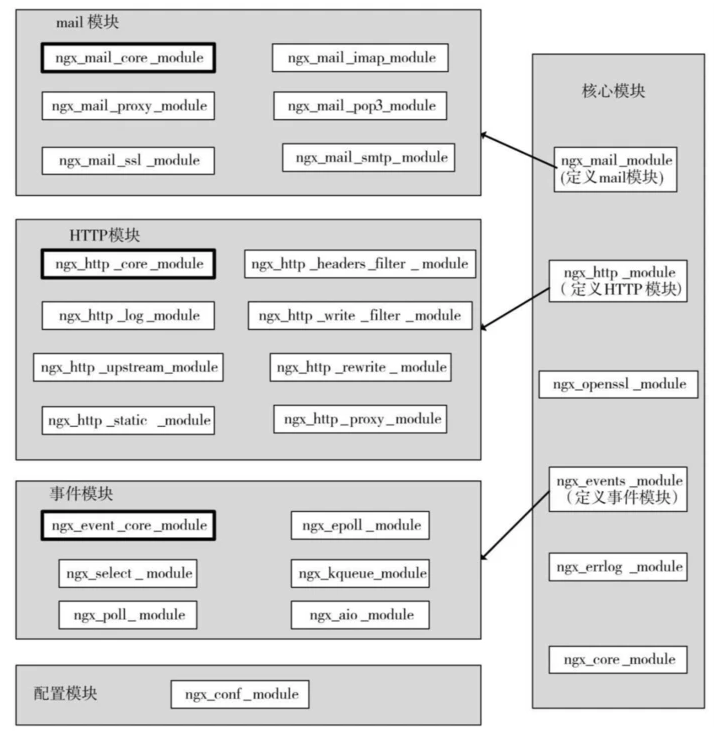
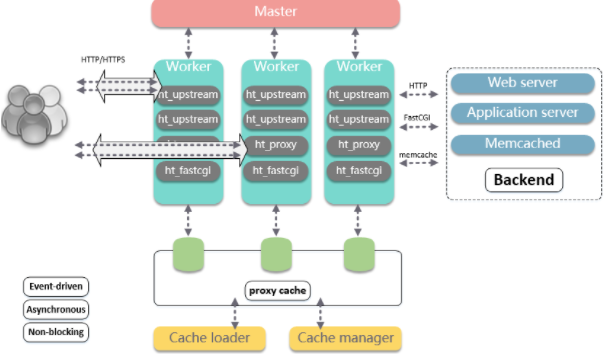
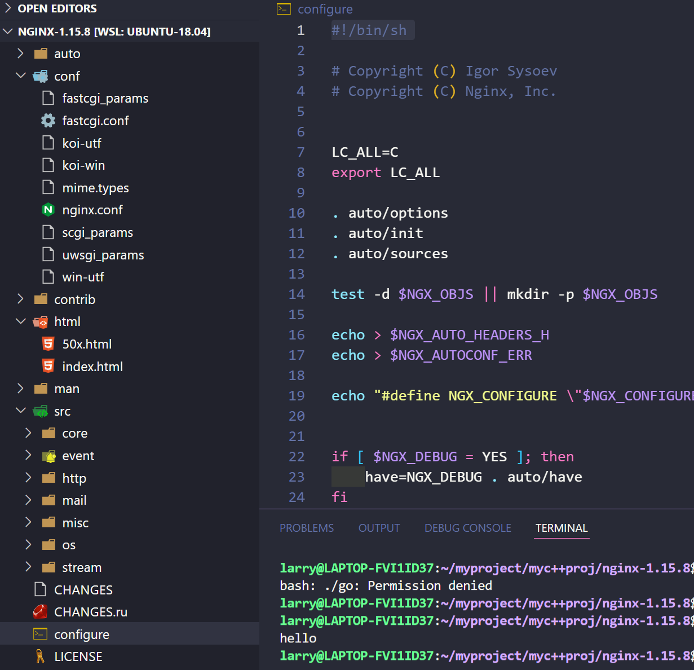
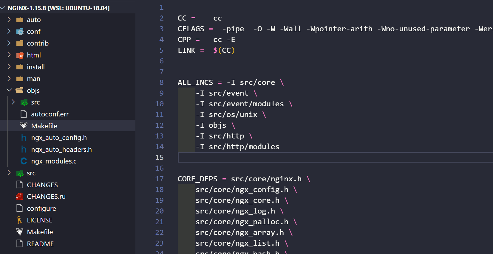
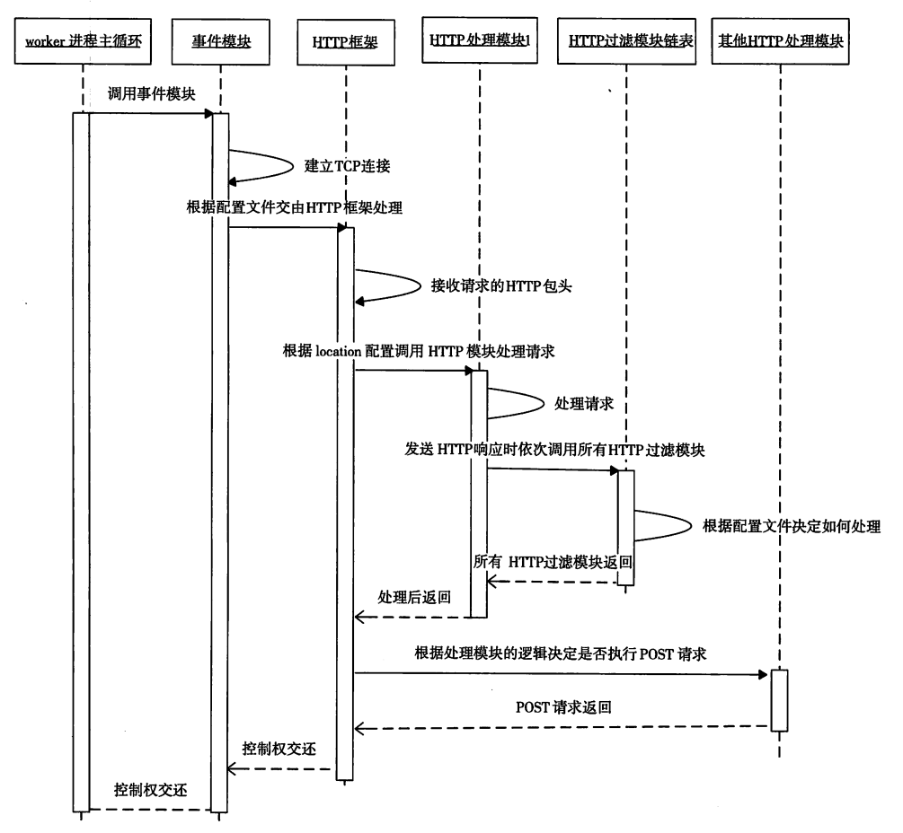
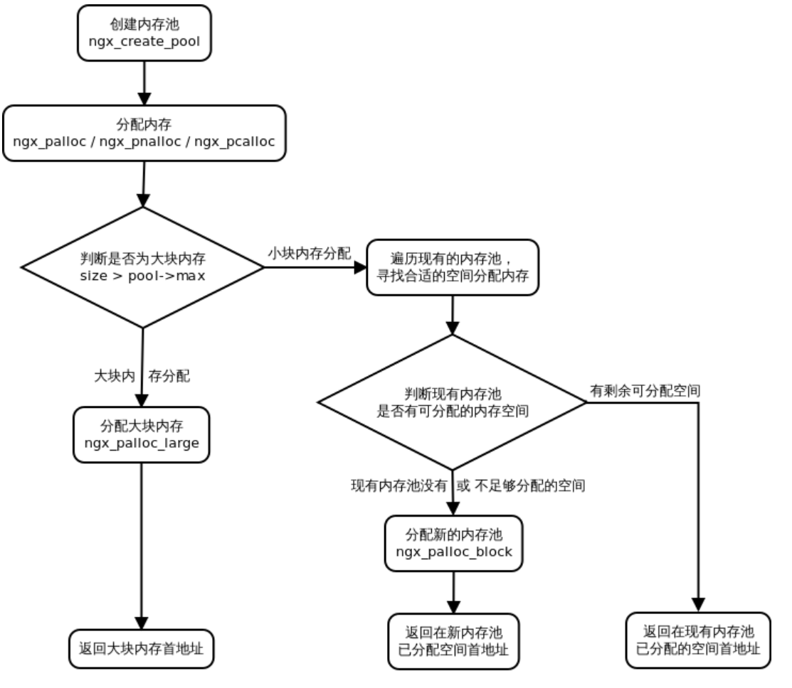
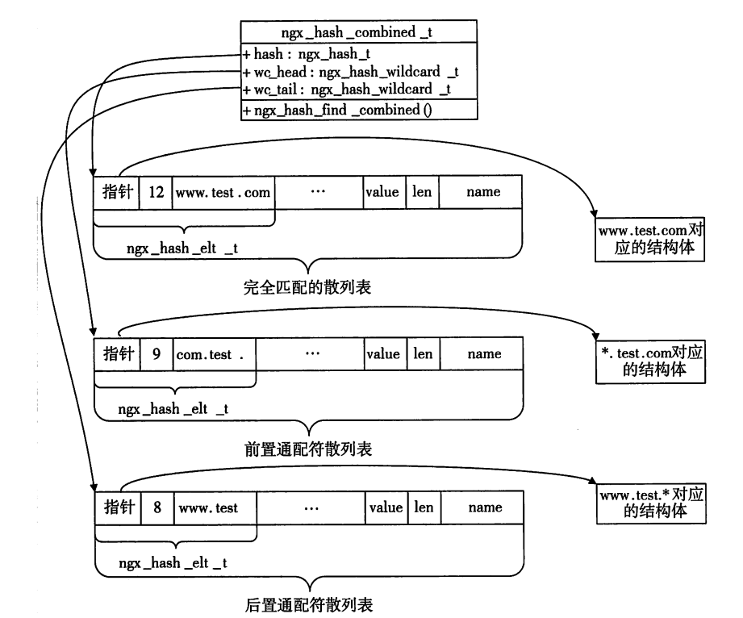

> nginx是优秀的静态资源服务器

### 架构
在我看来，Nginx大体可分为三部分，配置解析，处理逻辑，模块化。模块化是将配置解析和处理逻辑联系起来。

高度模块化的设计是 Nginx 的架构基础。在 Nginx 中，除了少量的核心代码，其他一切皆为模块。所有模块间是分层次、分类别的，Nginx 官方共有五大类型的模块：核心模块、配置模块、事件模块、HTTP 模块、mail 模块。配置模块和核心模块是与 Nginx 框架密切相关的。而事件模块是 HTTP 模块和 mail 模块的基础。HTTP 模块和 mail 模块更关注于应用层面。

dns解析域名得到的ip往往是nginx层，也就是反向代理; nginx将传过来的ip地址转发, 如果请求静态资源直接映射到静态资源的path返回, 对于动态逻辑则转发到内部的服务中对数据进行处理。这样外部客户端只知道nginx的地址, 而与内部服务器隔离。



Nginx在启动后，在unix系统中会以daemon的方式在后台运行，后台进程包含一个master进程和多个worker进程。主进程主要用来管理worker进程，包含：接收来自外界的信号，向各worker进程发送信号，监控worker进程的运行状态，当worker进程退出后(异常情况下)，会自动重新启动新的worker进程。而基本的网络事件，则是放在worker进程中来处理。包括重启，关闭nginx的信号, 也是通过master进程接收进行处理。

对于一个基本的web服务器来说，事件通常有三种类型，网络事件、信号、定时器。Nginx 采用的是多 Reactor 多进程的模式，具体表现为主进程中仅仅创建了监听端口，而由子进程的 Reactor 来accept连接，通过锁来控制一次只有一个子进程进行accept，子进程accept新连接后就放到自己的 Reactor 进行处理，不会再分配给其他子进程。加上epoll回调的高效率, 实现了Nginx网络事件处理的高效率。

定时器的处理和redis类似,epoll_wait等函数在调用设置一个超时时间，nginx里面的定时器事件是放在一颗维护定时器的红黑树里面，每次在进入epoll_wait前，先从该红黑树里面拿到所有定时器事件的最小时间，计算出epoll_wait的超时时间后进入epoll_wait。所以，当没有网络事件产生，也没有中断信号时，定时器时间会导致epoll_wait会超时。这时，nginx会检查所有的超时定时器事件，处理之。

Master负责管理worker进程，worker进程负责处理网络事件。整个框架被设计为一种依赖事件驱动、异步、非阻塞的模式。



<!-- more -->

### 编译
nginx的编译使用configure脚本, configure文件实际上shell写的脚本。
```
./configure \
--prefix=/usr/local/nginx \
--with-http_ssl_module \
--with-http_stub_status_module \
--with-http_realip_module \
--with-threads
```

执行configure之前的目录


configure之后主要，生成makefile和objs目录


注意configure之后还生成了重要的ngx_modules.c文件。核心是两个数组的定义
```cpp
ngx_module_t *ngx_modules[] = {
    &ngx_core_module,
    &ngx_errlog_module,
    &ngx_conf_module,
    &ngx_regex_module,
    &ngx_events_module,
    &ngx_event_core_module,
    &ngx_epoll_module,
    &ngx_http_module,
    &ngx_http_core_module,

char *ngx_module_names[] = {
    "ngx_core_module",
    "ngx_errlog_module",
    "ngx_conf_module",
    "ngx_regex_module",
    "ngx_events_module",
    "ngx_event_core_module",
    "ngx_epoll_module",
    "ngx_http_module",
    "ngx_http_core_module",
    "ngx_http_log_module",
```

我们看到ngx_modules是ngx_module_t类型的数组指针, ngx_module_t是重要的模块类型
```cpp
typedef struct ngx_module_s ngx_module_t;

struct ngx_module_s
{
    // 当前模块在ngx_modules数组中的序号
    ngx_uint_t          index;
    // 模块版本, 默认1
    ngx_uint_t          version;
    // 指向一类模块的结构体, 例如http模块ctx需要指向ngx_http_module_t结构体
    void                *ctx;
    // 处理nginx.conf的配置项
    ngx_command_t       *commands;
    // type是模块类型, 如NGX_CORE_MODULE
    ngx_uint_t          type;
    // 一些回调方法
    ngx_int_t           (*init_master)(ngx_cycle_t* log);
    ngx_int_t           (*init_module)(ngx_cycle_t* log);
    ...
};
```

ngx_command_t用来将模块参数和nginx.conf文件联系起来
```cpp
typedef struct ngx_command_s ngx_command_t;
struct ngx_command_s
{
    ngx_str_t           name;
    // 表示可以使用的配置项
    ngx_uint_t          type;
    // 处理配置项的方法
    char                *(*set)(ngx_conf_t *cf, ngx_command_t* cmd, void* conf);
    // 在配置文件中的偏移量
    ngx_uint_t          conf;
    ngx_uint_t          offset;
    // 读取后的处理方法
    void                *post;
};

// 定义示例
ngx_command_t   ngx_http_mytest_commands[] = 
{
    {
        ngx_string("mytest"),
        NGX_HTTP_MAIN_CONF|NGX_HTTP_SRV_CONF..,
        ngx_http_mytest,
        NGX_HTTP_LOC_CONF_OFFSET,
        0,
        NULL
    },
    ngx_null_command;   // 表示ngx_command_t数组末尾
}
```

然后执行make命令即可。

常用的文件是可执行文件nginx和配置文件conf/nginx.conf, 常用的命令包括
```
nginx -t  # 现实要载入nginx.con的位置
nginx       # 直接启动nginx
nginx -s reload                  # 修改配置后重新加载生效
nginx -s reopen                  # 重新打开日志文件
nginx -s stop                    # 快速停止nginx
nginx -s quit                    # 完整有序的停止nginx
nginx -t                         # 测试当前配置文件是否正确
nginx -t -c /path/to/nginx.conf  # 测试特定的nginx配置文件是否正确
```

### 配置解析

Nginx的主配置文件是nginx.conf，这个配置文件一共由三部分组成，分别为全局块、events块和http块。在http块中，又包含http全局块、多个server块。每个server块中，可以包含server全局块和多个location块。
#### 基本配置

基本配置内容如下, 
```
# 是否以守护进程运行Nginx
daemon on | off;
默认on

# error日志设置
error_log /path/file level;
默认: logs/error.log level;

# coredump文件目录设置和限制大小
worker_rimit_core size;
working_directory path;

# work进程可以打开的最大fd个数
worker_rlimit_nofile limit;

# worker进程个数(一般设置为CPU核数)
worker_process number;

# 是否打开accept_mutex(Nginx的负载均衡锁)
accept_mutext on;

# lock文件的路径，accept锁可能需要这个lock文件
lock_file path/file
默认 logs/nginx.lock

# 选择事件模型
use [kqueue|epoll|select|poll|eventport]

# 每个worker的最大连接数
worker_connections number;

# 监听端口
listen 80;

# 主机名, ip相同主机名可能不同
server_name *.testweb.com

# location
location = ..

# 文件路径, root设置basepath
root path
location /download {
    root /opt/web/html;
}

# 根据HTTP返回码重定向页面
error_page 404 /404.html

# 存储http头部的内存buffer大小
client_header_buffer_size 1k;

# 存储HTTP包体内存buffer大小
client_body_buffer_size 8k;

# 每个tcp连接的内存池大小, 内存池用于减少小块内存的分配次数
connection_pool_size 256;

# 每个请求的内存池，减少小块内存的分配次数
request_pool_size 4k;

# 读取http头部的超时时间
client_header_timeout 60;

# 读取http包体的超时时间
client_body_timeout 60;

# keepalive超时时间, keepalive可以让多个请求复用一个HTTP长连接
keepalive_timeout time;

# 一个keepalive连接允许承载请求的最大数
keepalive_requests 100;

# 负载均衡名
upstream backend

# server name指定一台上游服务器的名字
server 127.0.0.1:8080

# 反向代理服务器地址
proxy pass http://localhost:8000/uri/;
```


配置示例
```
#全局块
#user  nobody;
worker_processes  1;

#event块
events {
    worker_connections  1024;
}

#http块
http {
    include       mime.types;
    default_type  application/octet-stream;
    # 日志格式
    log_format  main  '$remote_addr - $remote_user [$time_local] "$request" '
                      '$status $body_bytes_sent "$http_referer" '
                      '"$http_user_agent" "$http_x_forwarded_for"';

    #access_log  logs/access.log  main;
    sendfile        on;
    #tcp_nopush     on;

    #keepalive_timeout  0;
    keepalive_timeout  65;
    #gzip  on;
    server {
        listen       80;
        server_name  localhost;

        #charset koi8-r;

        access_log  logs/host.access.log  main;

        location / {
            root   html;
            index  index.html index.htm;
        }
        location /custom/
        {
                proxy_pass   http://150.158.42.3:8000/;
        }

        #error_page  404              /404.html;

        # redirect server error pages to the static page /50x.html
        #
        error_page   500 502 503 504  /50x.html;
        location = /50x.html {
            root   html;
        }
    # https
    server {
        listen  443;
        server_name larrystd.site;
        location /custom/
        {
                proxy_pass   http://150.158.42.3:8000/;
        }

        error_page   500 502 503 504  /50x.html;
        location = /50x.html {
            root   html;
        }
    }
}
```

一个配置文件的例子
```
# 定义Nginx运行的用户和用户组
user www www;

# nginx进程数，建议设置为等于CPU总核心数。
worker_processes 8;
 
# 全局错误日志定义类型，[ debug | info | notice | warn | error | crit ]
error_log /usr/local/nginx/logs/error.log info;

# 进程pid文件
pid /usr/local/nginx/logs/nginx.pid;

# 指定进程可以打开的最大描述符：数目
# 这个指令是指当一个nginx进程打开的最多文件描述符数目，理论值应该是最多打开文件数（ulimit -n）与nginx进程数相除，但是nginx分配请求并不是那么均匀，所以最好与ulimit -n 的值保持一致。现在在linux 2.6内核下开启文件打开数为65535，worker_rlimit_nofile就相应应该填写65535。
#这是因为nginx调度时分配请求到进程并不是那么的均衡，所以假如填写10240，总并发量达到3-4万时就有进程可能超过10240了，这时会返回502错误。
worker_rlimit_nofile 65535;

events
{
    # 事件模型，use [ kqueue | rtsig | epoll | /dev/poll | select | poll ]; epoll模型
    # 是Linux 2.6以上版本内核中的高性能网络I/O模型，linux建议epoll，如果跑在FreeBSD上面，就用kqueue模型。

    use epoll;

    # 单个进程最大连接数（最大连接数=连接数*进程数）
    # 根据硬件调整，和前面工作进程配合起来用，尽量大，吞吐量大, 但是别把cpu跑到100%就行。每个进程允许的最多连接数，理论上每台nginx服务器的最大连接数为。

    worker_connections 65535;

    # keepalive超时时间。
    keepalive_timeout 60;

    # 客户端请求头部的缓冲区大小。这个可以根据你的系统分页大小来设置，一般一个请求头的大小不会超过1k，不过由于一般系统分页都要大于1k，所以这里设置为分页大小。
    
    client_header_buffer_size 4k;

    # 这个将为打开文件指定缓存，默认是没有启用的，max指定缓存数量，建议和打开文件数一致，inactive是指经过多长时间文件没被请求后删除缓存。
    open_file_cache max=65535 inactive=60s;

    # 这个是指多长时间检查一次缓存的有效信息。
    open_file_cache_valid 80s;
}
 
 
 
#设定http服务器，利用它的反向代理功能提供负载均衡支持
http
{
    # 文件扩展名与文件类型映射表
    include mime.types;

    # 默认文件类型
    default_type application/octet-stream;

    # 默认编码
    #charset utf-8;

    # 服务器名字的hash表大小
    server_names_hash_bucket_size 128;

    # 客户端请求头部的缓冲区大小。这个可以根据你的系统分页大小来设置，一般一个请求的头部大小不会超过1k，不过由于一般系统分页都要大于1k，所以这里设置为分页大小。分页大小可以用命令getconf PAGESIZE取得。
    client_header_buffer_size 32k;

    # 客户请求头缓冲大小。nginx默认会用client_header_buffer_size这个buffer来读取header值，如果header过大，它会使用large_client_header_buffers来读取。
    large_client_header_buffers 4 64k;

    # 设定通过nginx上传文件的大小
    client_max_body_size 8m;

    # 开启高效文件传输模式，sendfile指令指定nginx是否调用sendfile函数来输出文件，对于普通应用设为 on，如果用来进行下载等应用磁盘IO重负载应用，可设置为off，以平衡磁盘与网络I/O处理速度，降低系统的负载。注意：如果图片显示不正常把这个改成off。
    sendfile on;

    # 开启目录列表访问，合适下载服务器，默认关闭。
    autoindex on;

    # 此选项允许或禁止使用socke的TCP_CORK的选项，此选项仅在使用sendfile的时候使用
    tcp_nopush on;
     
    tcp_nodelay on;

    # 长连接超时时间，单位是秒
    keepalive_timeout 120;

    # FastCGI相关参数是为了改善网站的性能：减少资源占用，提高访问速度。下面参数看字面意思都能理解。
    fastcgi_connect_timeout 300;
    fastcgi_send_timeout 300;
    fastcgi_read_timeout 300;
    fastcgi_buffer_size 64k;
    fastcgi_buffers 4 64k;
    fastcgi_busy_buffers_size 128k;
    fastcgi_temp_file_write_size 128k;

    # gzip模块设置
    gzip on; #开启gzip压缩输出
    gzip_min_length 1k;    #最小压缩文件大小
    gzip_buffers 4 16k;    #压缩缓冲区
    gzip_http_version 1.0;    #压缩版本（默认1.1，前端如果是squid2.5请使用1.0）

    # 开启限制IP连接数的时候需要使用
    #limit_zone crawler $binary_remote_addr 10m;

    # 负载均衡配置， upstream
    # 注意负载均衡和反向代理是两个配置
    upstream jh.w3cschool.cn {
     
        # upstream的负载均衡，weight是权重，可以根据机器配置定义权重。weigth参数表示权值，权值越高被分配到的几率越大。
        server 192.168.80.121:80 weight=3;
        server 192.168.80.122:80 weight=2;
        server 192.168.80.123:80 weight=3;

        # nginx的upstream目前支持4种方式的分配
        #1、轮询（默认）
        #每个请求按时间顺序逐一分配到不同的后端服务器，如果后端服务器down掉，能自动剔除。
        #2、weight
        #指定轮询几率，weight和访问比率成正比，用于后端服务器性能不均的情况。
        #例如：
        #upstream bakend {
        #    server 192.168.0.14 weight=10;
        #    server 192.168.0.15 weight=10;
        #}
        #2、ip_hash
        #每个请求按访问ip的hash结果分配，这样每个访客固定访问一个后端服务器，可以解决session的问题。
        #例如：
        #upstream bakend {
        #    ip_hash;
        #    server 192.168.0.14:88;
        #    server 192.168.0.15:80;
        #}
        #3、fair（第三方）
        #按后端服务器的响应时间来分配请求，响应时间短的优先分配。
        #upstream backend {
        #    server server1;
        #    server server2;
        #    fair;
        #}
        #4、url_hash（第三方）
        #按访问url的hash结果来分配请求，使每个url定向到同一个后端服务器，后端服务器为缓存时比较有效。
        #例：在upstream中加入hash语句，server语句中不能写入weight等其他的参数，hash_method是使用的hash算法
        #upstream backend {
        #    server squid1:3128;
        #    server squid2:3128;
        #    hash $request_uri;
        #    hash_method crc32;
        #}

        #tips:
        #upstream bakend{#定义负载均衡设备的Ip及设备状态}{
        #    ip_hash;
        #    server 127.0.0.1:9090 down;
        #    server 127.0.0.1:8080 weight=2;
        #    server 127.0.0.1:6060;
        #    server 127.0.0.1:7070 backup;
        #}
        #在需要使用负载均衡的server中增加 proxy_pass http://bakend/;

        #每个设备的状态设置为:
        #1.down表示单前的server暂时不参与负载
        #2.weight为weight越大，负载的权重就越大。
        #3.max_fails：允许请求失败的次数默认为1.当超过最大次数时，返回proxy_next_upstream模块定义的错误
        #4.fail_timeout:max_fails次失败后，暂停的时间。
        #5.backup： 其它所有的非backup机器down或者忙的时候，请求backup机器。所以这台机器压力会最轻。

        #nginx支持同时设置多组的负载均衡，用来给不用的server来使用。
        #client_body_in_file_only设置为On 可以讲client post过来的数据记录到文件中用来做debug
        #client_body_temp_path设置记录文件的目录 可以设置最多3层目录
        #location对URL进行匹配.可以进行重定向或者进行新的代理 负载均衡
    }
     
    # 虚拟主机的配置
    server
    {
        # 监听端口
        listen 80;

        # 域名可以有多个，用空格隔开
        server_name www.w3cschool.cn w3cschool.cn;
        index index.html index.htm index.php;
        root /data/www/w3cschool;

        # 对******进行负载均衡
        location ~ .*.(php|php5)?$
        {
            fastcgi_pass 127.0.0.1:9000;
            fastcgi_index index.php;
            include fastcgi.conf;
        }
         
        # 图片缓存时间设置
        location ~ .*.(gif|jpg|jpeg|png|bmp|swf)$
        {
            expires 10d;
        }
         
        # JS和CSS缓存时间设置
        location ~ .*.(js|css)?$
        {
            expires 1h;
        }
         
        # 日志格式设定
        #$remote_addr与$http_x_forwarded_for用以记录客户端的ip地址；
        #$remote_user：用来记录客户端用户名称；
        #$time_local： 用来记录访问时间与时区；
        #$request： 用来记录请求的url与http协议；
        #$status： 用来记录请求状态；成功是200，
        #$body_bytes_sent ：记录发送给客户端文件主体内容大小；
        #$http_referer：用来记录从那个页面链接访问过来的；
        #$http_user_agent：记录客户浏览器的相关信息；
        log_format access '$remote_addr - $remote_user [$time_local] "$request" '
        '$status $body_bytes_sent "$http_referer" '
        '"$http_user_agent" $http_x_forwarded_for';
         
        # 定义本虚拟主机的访问日志
        access_log  /usr/local/nginx/logs/host.access.log  main;
        access_log  /usr/local/nginx/logs/host.access.404.log  log404;
         
        # 对 "/" 启用反向代理
        location / {
            proxy_pass http://127.0.0.1:88;
            proxy_redirect off;
            proxy_set_header X-Real-IP $remote_addr;
             
            #后端的Web服务器可以通过X-Forwarded-For获取用户真实IP
            proxy_set_header X-Forwarded-For $proxy_add_x_forwarded_for;
             
            #以下是一些反向代理的配置，可选。
            proxy_set_header Host $host;

            #允许客户端请求的最大单文件字节数
            client_max_body_size 10m;

            # 缓冲区代理缓冲用户端请求的最大字节数，
            # 如果把它设置为比较大的数值，例如256k，那么，无论使用firefox还是IE浏览器，来提交任意小于256k的图片，都很正常。如果注释该指令，使用默认的client_body_buffer_size设置，也就是操作系统页面大小的两倍，8k或者16k，问题就出现了。
            client_body_buffer_size 128k;

            #表示使nginx阻止HTTP应答代码为400或者更高的应答。
            proxy_intercept_errors on;

            # 后端服务器连接的超时时间_发起握手等候响应超时时间
            #nginx跟后端服务器连接超时时间(代理连接超时)
            proxy_connect_timeout 90;

            # 后端服务器数据回传时间(代理发送超时)
            # 后端服务器数据回传时间_就是在规定时间之内后端服务器必须传完所有的数据
            proxy_send_timeout 90;

            # 连接成功后，后端服务器响应时间(代理接收超时)
            # 连接成功后_等候后端服务器响应时间_其实已经进入后端的排队之中等候处理（也可以说是后端服务器处理请求的时间）
            proxy_read_timeout 90;

            # 设置代理服务器（nginx）保存用户头信息的缓冲区大小
            # 设置从被代理服务器读取的第一部分应答的缓冲区大小，通常情况下这部分应答中包含一个小的应答头，默认情况下这个值的大小为指令proxy_buffers中指定的一个缓冲区的大小，不过可以将其设置为更小
            proxy_buffer_size 4k;

            # proxy_buffers缓冲区，网页平均在32k以下的设置
            # 设置用于读取应答（来自被代理服务器）的缓冲区数目和大小，默认情况也为分页大小，根据操作系统的不同可能是4k或者8k
            proxy_buffers 4 32k;

            # 高负荷下缓冲大小（proxy_buffers*2）
            proxy_busy_buffers_size 64k;

            # 设置在写入proxy_temp_path时数据的大小，预防一个工作进程在传递文件时阻塞太长
            # 设定缓存文件夹大小，大于这个值，将从upstream服务器传
            proxy_temp_file_write_size 64k;
        }
         
         
        # 设定查看Nginx状态的地址
        location /NginxStatus {
            stub_status on;
            access_log on;
            auth_basic "NginxStatus";
            auth_basic_user_file confpasswd;
            #htpasswd文件的内容可以用apache提供的htpasswd工具来产生。
        }
         
        # 本地动静分离反向代理配置
        # 所有jsp的页面均交由tomcat或resin处理
        location ~ .(jsp|jspx|do)?$ {
            proxy_set_header Host $host;
            proxy_set_header X-Real-IP $remote_addr;
            proxy_set_header X-Forwarded-For $proxy_add_x_forwarded_for;
            proxy_pass http://127.0.0.1:8080;
        }
    }
}
```

### HTTP模块

http处理流程图


运行时HTTP框架会接收完毕HTTP请求的头部后，将请求的URI与配置文件中所有location进行匹配(优先匹配虚拟主机), 然后根据location{}内的配置项选择HTTP模块调用。

#### 相关数据结构封装

整型, ngx_int_t表示有符号整型, ngx_uint_t封装无符号整型
```cpp
typedef intptr_t    ngx_int_t;
typedef uintptr_t   ngx_uint_t;
```

ngx_str_t数据结构
```cpp
typedef struct 
{
    size_t  len;
    u_char  *data;
} ngx_str_t;
```

ngx_list_t单向链表, 例如HTTP的头部就是用ngx_list_t存储的
```cpp
typedef struct ngx_list_part_s ngx_list_part_t;

struct ngx_list_part_s
{
    void            *elts;
    ngx_uint_t      nelts;
    ngx_list_part_t *next;
};

typedef struct
{
    ngx_list_part_t         *last;
    ngx_list_part_t         part;
    size_t                  size;
    ngx_uint_t              nalloc;
    ngx_pool_t              *pool;
} ngx_list_t;
```

ngx_table_elt_t 表示键值对key/value
```cpp
typedef struct
{
    ngx_uint_t              hash;
    ngx_str_t               key;
    ngx_str_t               value;
    u_char                  *lowcase_key;
}ngx_table_elt_t;
```


ngx_buf_t结构，封装组织大量数据
```cpp
typedef struct ngx_buf_s ngx_buf_t;
typedef void*            ngx_buf_tag_t;

struct ngx_buf_s
{
    // pos表示处理数据的起始位置
    u_char          *pos;
    u_char          *last;
    // 处理文件时的开始结尾
    off_t           file_pos;
    off_t           file_last;
    // 内存起始结束地址
    u_char          *start;
    u_char          *end;
    // 缓冲区类型
    ngx_buf_tag_t   tag;
    // 引用的文件
    ngx_file_t      *file;
    // 标志位, 为1表示内存可修改 冒号表示位域长度。也就是只占一位(大小与类型无关了)
    unsigned        temporary:1;
    unsigned        memory:1;       // 为1表示内存不可修改
    unsigned        recycled:1;     // 1表示可回收
    unsigned        isfile:1;       // 1表示这段缓冲区是文件不是内存
    unsigned        flush:1;        // 1表示要flush
    unsigned        last_buf;       // 1表示为最后一块缓冲区
};
```

ngx_buf_t可用ngx_chain_t串联起来
```cpp
typedef struct  ngx_chain_t;
struct ngx_chain_s
{
    ngx_buf_t   *buf;
    ngx_chain_t *next;
}
```

#### http模块的一些函数

ngx_http_request_t 记录http请求的相关参数
```cpp
struct ngx_http_request_s 
{
    ...
    ngx_uint_t              method;
    ngx_uint_t              http_version;
    ngx_str_t               request_line;
    ngx_str_t               uri;
    ngx_str_t               http_protocol;
    ...
    ngx_buf_t               *header_in;     // 头部
    ngx_http_headers_in_t   headers_in;
};

// 方法名宏定义
#define     NGX_HTTP_UNKNOWN        0x0001
#define     NGX_HTTP_GET            0x0002
...
```

获取HTTP头部时, 直接r->header_in的响应成员即可
```cpp
typedef struct
{
    ngx_list_t          headers;
    ngx_table_elt_t     *host;
    ngx_table_elt_t     *connection;
    ...
}
```

HTTP框架提供了异步方法来接收请求体
```cpp
ngx_int_t   ngx_http_read_client_request_body(ngx_http_request_t* r, ngx_http_client_body_handler_pt post_handler);

// 发送HTTP头部
ngx_int_t   ngx_http_send_header(ngx_http_header_t *r);

// 将内存中的字符串作为包体发送
ngx_int_t   ngx_http_output_filter(ngx_http_request_t *r, ngx_chain_t* in);
```

内存池(内存预先分配)
```cpp
struct ngx_http_request_s
{
    ...
    ngx_pool_t* pool;
    ...
};
// 从pool内存池拿到size字节的数据返回起始地址
void* ngx_palloc(ngx_pool_t* pool, size_t size);  
```

Nginx 使用内存池对内存进行管理，把内存分配归结为大内存分配和小内存分配。若申请的内存大小比同页的内存池最大值 max 还大，则是大内存分配，否则为小内存分配。



HTTP框架定义了三个级别的配置main, srv, loc分别表示直接出现在http{}, server{}, location{}块内的配置项。即遇到conf中配置块就调用相应的模块进行解析。
```cpp
typedef struct
{
    // 指针数组, 数组元素是create_main_conf方法产生的结构体
    void **main_conf;
    // 同理
    void **srv_conf;
    void **loc_conf;
} ngx_http_conf_ctx_t;
```
配置文件解析器处理完所有配置项后会告诉Nginx主循环配置项解析完毕, 这时Nginx才会解析Web服务器

#### Nginx提供的高级数据结构

### 高级数据结构

Nginx有两个特点, 跨平台, 用C实现。这两个特点导致Nginx不宜使用一些第三方中间件提供的容器和算法。

ngx_queue_t双向链表是Nginx提供的轻量级链表容器, 将已经分配好内存的元素用指针连接起来。ngx_queue_t还实现了排序功能
```cpp
typedef struct ngx_queue_s ngx_queue_t;
struct ngx_queue_s
{
    ngx_queue_t *prev;
    ngx_queue_t *next;
};
```

ngx_array_t动态数组, 类似vector, 可以在达到容量最大值时自动扩容。
```cpp
typedef struct ngx_array_s ngx_array_t;
struct ngx_array_s
{
    // 指向数组的首地址
    void        *elts;
    ngx_uint_t  nelts;
    size_t      size;
    ngx_uint_t  nalloc;
    ngx_pool_t  *pool;
};
```

ngx_list_t单向链表, 原理是将单链表将多段内存块连接起来, 可以负责容器内元素内存分配。

* ngx_rbtree_t红黑树

ngx_rbtree_t红黑树在检索，插入，删除元素方面非常高效; ngx_radix_tree_t基数树要求整形数据为关键字, 且插入删除元素时不需要做旋转操作。

红黑树特性
1. 节点是红色或者黑色
2. 根节点是黑色
3. 叶子节点是黑色. 且为NIL节点(哨兵)
4. 红色节点的两个子节点为黑色
5. 从任一节点到叶子节点的简单路径包含相同数目的黑色节点。

通过4,5看出从根到叶子最短路径是全部黑色，最长是红黑交错且黑色数量相同，因此最长的路径不会超过最短路径长度的两倍。

* ngx_hash_t散列表

对于散列表, nginx使用ngx_hash_t
```cpp
typedef struct
{
    ngx_hash_elt_t** buckets;
    ngx_uint_t       size;
} ngx_hash_t;

typedef struct
{
    void*       value;
    u_short     len;
    u_char      name[1];
} ngx_hash_elt_t;
```

Nginx实现了常用的散列表和支持通配符的散列表, 例如www.test.*。通配符匹配某种意义上可以看作范围查询。首先确定范围。通配符只接受前缀通配符或者后缀通配符。

方法是用空间换时间，准备查询前置和后置通配符的散列表
```cpp
ngx_hash_t          hash;
ngx_hash_wildcard_t *wc_head;
ngx_hash_wildcard_t *wc_tail;
```



