> 新兴的网络协议主要是4G时代发挥作用的可靠UDP协议和视频传输协议

### 可靠UDP

流传输协议, 例如TCP, 对于发送方多次发送的包都是可靠的，有序的，和流水顺序一样。

包传输协议, 例如UDP, 发送发多次发送的包，无序，有可能确实, 相邻之间没有关联。

#### 可靠协议

实现可靠传输一般有两种途径，一是基于ARQ（Automatic Repeat reQuest）的确认和重传机制，二是使用前向纠错（FEC）。

FEC是纠删码在通信中的应用，一般在链路层用的比较多，特别是无线通信中（包括WiFi，移动通信、卫星通信等）。可靠UDP传输主要还是依靠重传机制，个别协议会用FEC作为辅助手段.

ARQ包括停等式、回退N帧、选择重传等机制。由于停等式的效率太低, TCP和可靠UDP协议一般使用的是基于回退N帧机制和滑动窗口协议的连续式ARQ，TCP后来也引入了SACK，以提高性能。

滑动窗口是一种流量控制技术，接收方可以通过反馈来指示发送方调节数据发送的速度。TCP中使用滑动窗口协议来控制发送的数据量，达到理想的传输速度。

拥塞算法主要是计算和调整接收窗口、发送窗口、拥塞窗口的大小，从而控制传输速度, 既充分利用带宽, 又避免网络出现拥塞。拥塞算法的核心机制有: 

慢启动, 拥塞避免, 快重传(收到连续3次重复的ACK确认，就认为出现了丢包), 快恢复(Tahoe检测到丢包后，会回到初始状态，然后进入慢启动阶段，导致传输效率太低。Reno对此作了改进，在检测到丢包后，直接进入拥塞回避阶段，将窗口大小调整为原来的一半，避免了慢启动的开销。)

拥塞算法的思想是, 基于丢包, 基于超时, 显式拥塞通知。

#### UDP协议

UDP有两个字段：数据字段和首部字段。首部字段很简单，只有8个字节，由4个字段组成，每个字段的长度都是两个字节。
1. 源端口：源端口号。在需要对方回信时选用。不需要时可用全0。
2. 目的端口：目的端口号。这在终点交付报文时必须要使用到。
3. 长度： UDP用户数据报的长度，其最小值是8（仅有首部），发送一个带0字节数据的UDP数据报是允许的。
4. 校验和：检测UDP用户数据报在传输中是否有错。有错就丢弃。

如果接收方 UDP发现报文中的目的端口号不正确（即不存在对应于该端口号的应用进程），就丢弃该报文，并由网际控制报文协议 ICMP 发送"端口不可达"差错报文给发送方。

UDP是无连接的, 也没有拥塞控制, 流量控制, 可靠传输等特性。


1. UDP 是无连接的，即发送数据之前不需要建立连接，因此减少了开销和发送数据之前的时延。
2. UDP 使用尽最大努力交付，即不保证可靠交付，因此主机不需要维持复杂的连接状态表。
3. UDP 是面向报文的。发送方的UDP对应用程序交下来的报文，在添加首部后就向下交付IP层。UDP对应用层交下来的报文，既不合并，也不拆分，而是保留这些报文的边界。因此，应用程序必须选择合适大小的报文。
4. UDP 没有拥塞控制，因此网络出现的拥塞不会使源主机的发送速率降低。很多的实时应用（如IP电话、实时视频会议等）要去源主机以恒定的速率发送数据，并且允许在网络发生拥塞时丢失一些数据，但却不允许数据有太多的时延。UDP正好符合这种要求。
5. UDP 支持一对一、一对多、多对一和多对多的交互通信。
6. UDP 的首部开销小，只有8个字节，比TCP的20个字节的首部要短。

应用进程可以在不影响应用的实时性的前提下,增加些提高可靠性的措施,如采用前向纠错或重传已丢失的报文。同时增加简单拥塞控制的功能, 因为不使用拥塞控制功能的UDP有可能会引起网络产生严重的拥塞问题。

#### UDT

UDP-based Data Transfer Protocol，简称UDT, UDT的主要目的是支持高速广域网上的海量数据传输，而互联网上的标准数据传输协议TCP在高带宽长距离网络上性能很差。 顾名思义，UDT建于UDP之上，并引入新的拥塞控制和数据可靠性控制机制。UDT是面向连接的双向的应用层协议。它同时支持可靠的数据流传输和部分可靠的数据报传输。 

面向连接的协议, 面向连接意味着两个使用协议的应用在彼此交换数据之前必须先建立一个连接，UDT是逻辑上存在的连接通道。这种连接的维护是基于握手、Keep-alive（保活）以及关闭连接。

可靠的协议, 依靠包序号机制、接收者的ACK响应和丢包报告、ACK序号机制、重传机制(基于丢包报告和超时处理)来实现数据传输的可靠性。

双工的协议, 每个UDT实例包含发送端和接收端的信息。

新的拥塞算法, 不同于基于窗口的TCP拥塞控制算法(慢启动和拥塞避免)，是混合的基于窗口的、基于速率的拥塞控制算法。网络带宽是指在单位时间（一般指的是1秒钟）内能传输的数据量。发送者根据流量控制和速率控制来发送（和重传）应用程序数据。接收者接收数据包和控制包，并根据接收到的包发送控制包。

使用定时器触发不同的事件, 四种定时器, rate control, ACK, NAK and retransmission timer. Rate control and ACK are triggered periodically, NAK timer is used to resend loss information if retransmission is not received 

#### UTP

μTP（Micro Transport Protocol）是一个由BitTorrent公司开发的协议。它在UDP之上实现可靠传输与拥塞控制等特性。μTP的拥塞控制算法，Ledbat，能 在缩短网络延迟和减少拥塞的同时最大化网络吞吐量。

µTP 通过将 modem 的缓冲队列的大小作为一个控制因子来调整发送速率，当队列过大时，将会放慢发送速度。这种策略使得 BT 在没有竞争的情况下可以充分利用上传带宽，在有大量其他流量的情况下则放慢发送速率。

<!--more -->

#### HTTP2
主要改进包括1. header压缩传输 2.stream复用TCP连接, 降低http1.1的阻塞问题 3. 服务器支持主动推送资源, 不再是仅仅的客户端问服务器答

但是解决不了底层  TCP 协议层面上的队头阻塞问题。

* 二进制分帧传输

HTTP1.x 的解析是基于文本。基于文本协议的格式解析存在天然缺陷, 文本的表现形式有多样性, 要做到健壮性考虑的场景必然很多,二进制则不同, 只认 0 和 1 的组合。

HTTP2.0 在 应用层(HTTP2.0)和传输层(TCP/UDP)之间增加一个二进制分帧层。在不改动 HTTP1.X 的语义、方法、状态码、URI 以及首部字段的情况下, 解决了 HTTP1.1 的性能限制，改进传输性能，实现低延迟和高吞吐量。在二进制分帧层中，HTTP2.0 会将所有传输的信息分割为更小的消息和帧(frame),并对它们采用二进制格式的编码, 其中 HTTP1.X 的首部信息会被封装到 HEADER frame,而相应的 Request Body 则封装到 DATA frame 里面。

* 多路复用(MultiPlexing)

HTTP2.0的请求和响应等消息由一个或多个帧组成。流作为连接中的若干虚拟通道, 每个流都有一个唯一的整数 ID。

多路复用允许同时通过单一的 HTTP2.0 连接发起多重的请求-响应消息, 即一个TCP连接可以发送多个reqeust, 实现多流并行而不用依赖建立多个 TCP 连接。HTTP1.1 协议中浏览器客户端在同一时间，针对同一域名下的请求有一定数量限制。超过限制数目的请求会被阻塞。

* header 首部压缩HPACK

HTTP1.x 的 header 带有大量信息，而且每次都要重复发送，HTTP2.0 使用 HPACK 算法对 header 的数据进行压缩，减少需要传输的 header 大小，通讯双方各自 cache 一份 header fields 表，差量更新 HTTP 头部，既避免了重复 header 的传输，又减小了需要传输的大小。

* 服务端推送（server push）

服务端可以在发送页面 HTML 时主动推送其它资源，而不用等到浏览器解析到相应位置，发起请求再响应。例如服务端可以主动把 JS 和 CSS 文件推送给客户端，而不需要客户端解析 HTML 时再发送这些请求。

缺点, HTTP 2 中，多个request依赖于一条 TCP 连接中，如果该条TCP连接出现了丢包等问题，HTTP 2 的表现反倒不如 HTTP 1.1 。因为 TCP 为了保证可靠传输，有丢包重传机制，丢失的包必须要等待重新传输确认，HTTP 2 出现丢包时，整个 TCP 都要开始等待重传，那么就会阻塞该 TCP 连接中的所有请求。而对于 HTTP 1.1 来说，可以开启多个  TCP 连接，出现这种情况反倒只会影响其中一个连接，剩余的 TCP 连接还可以正常传输数据。

http2.0中connection, stream, frame,的关系

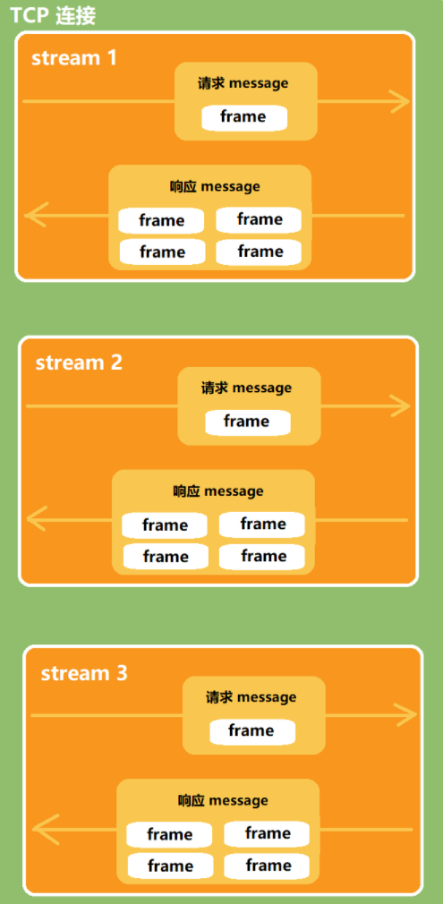

#### http3.0

http3.0即HTTP Over QUIC, Quick UDP Internet Connections, 即基于UDP协议的QUIC协议。

### hpack

http2.0针对header使用hpack进行压缩, HPACK包含两个压缩模块：Indexs Table索引表和Static Huffman Encoding静态霍夫曼编码。实际上http2.0的数据帧 Frame以二进制压缩格式存放 HTTP/1 中的内容。


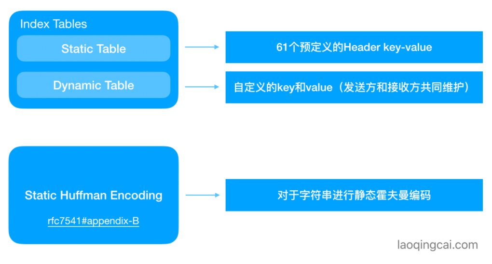

#### Indexs Table 索引表

索引表分为静态索引表和动态索引表, 静态表即61个预定义的key value，动态表包含自定义的key value。

静态索引表的61个key-value, 其中包含GET, POST, / 等常用符号的编码
```
          +-------+-----------------------------+---------------+
          | Index | Header Name                 | Header Value  |
          +-------+-----------------------------+---------------+
          | 1     | :authority                  |               |
          | 2     | :method                     | GET           |
          | 3     | :method                     | POST          |
          | 4     | :path                       | /             |
          | 5     | :path                       | /index.html   |
          | 6     | :scheme                     | http          |
          | 7     | :scheme                     | https         |
          | 8     | :status                     | 200           |
          | 9     | :status                     | 204           |
          | 10    | :status                     | 206           |
          | 11    | :status                     | 304           |
          | 12    | :status                     | 400           |
          | 13    | :status                     | 404           |
          | 14    | :status                     | 500           |
          | 15    | accept-charset              |               |
          ...太多了，省略掉了
          | 58    | user-agent                  |               |
          | 59    | vary                        |               |
          | 60    | via                         |               |
          | 61    | www-authenticate            |               |
          +-------+-----------------------------+---------------+

:method GET = 2 = 00000010
:method POST = 3 = 00000011
:path / = 4 = 00000100
:path /index.html = 5 = 00000101
:scheme https = 7 = 00000111
```

对于静态索引表中没有的key, 可以采用动态索引表。根据实际的字符串, key从62开始。例如对
```
:authority www.laoqingcai.com
:token 123456789
```

存在62~64的key
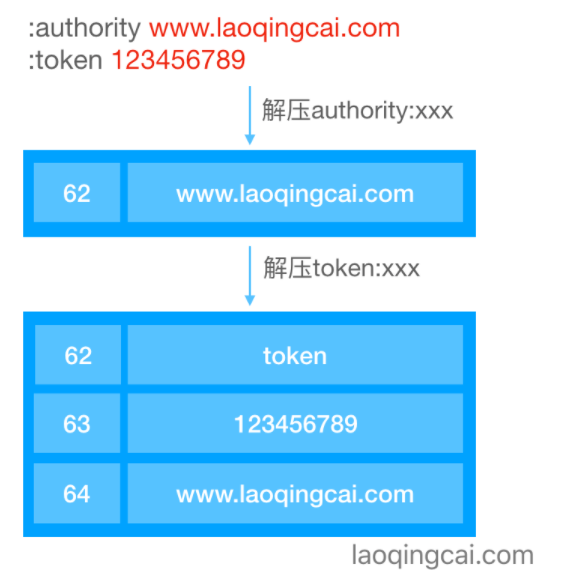

注意动态表组成一个定长队列, 如果新条目的 size 小于或等于最大 size，则会将该条目添加到表中, 而对应的条目移除动态表, 保证动态表的大小。 

HTTP/2 提倡使用尽可能少的连接数，头部压缩是其中一个重要的原因：在同一个连接上产生的请求和响应越多，动态字典累积的越全，头部压缩的效果就越好。

#### Static Huffman Encoding 静态哈夫曼编码

为了防止动态无限增大, HTTP/2.0还支持对String的Key Value进行静态编码，一方面减少了传输字符串的体积，另一方面相当于加密了传书内容。

哈夫曼对基于出现字符频率而对字符编码的一种办法, 如下得到A,B,C,D字符的编码
```
A:0
B:10
C:110
D:111
```
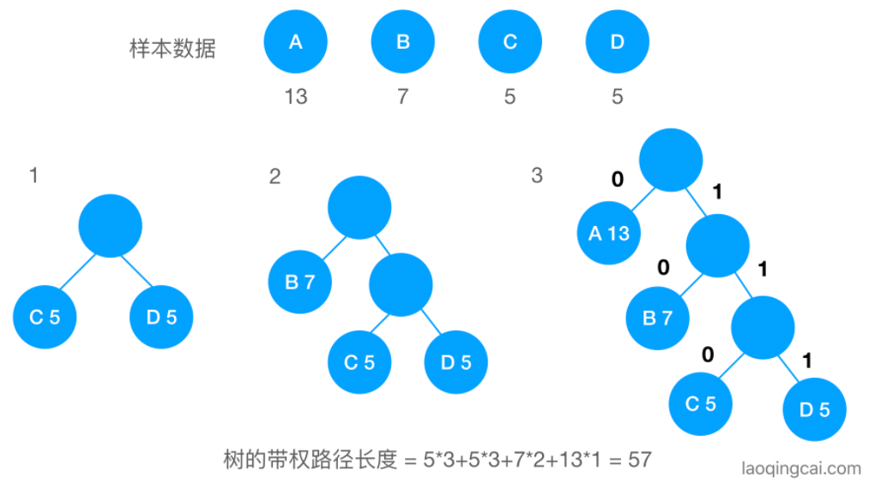
静态哈夫曼编码也是一种静态索引表, 其通过大量HTTP Header数据样本，分析出来每个字符出现的频率，根据频率生成霍夫曼树，最后得出静态霍夫曼编码表。注意不压缩一个字符用1字节也就是8bit存储, 压缩后<8bit
```
    ...省略部分内容
   'B' ( 66)  |1011101                                      5d  [ 7]
   'C' ( 67)  |1011110                                      5e  [ 7]
   'D' ( 68)  |1011111                                      5f  [ 7]
   'E' ( 69)  |1100000                                      60  [ 7]
   'F' ( 70)  |1100001                                      61  [ 7]
   'G' ( 71)  |1100010                                      62  [ 7]
    ...省略部分内容
   'd' (100)  |100100                                       24  [ 6]
   'e' (101)  |00101                                         5  [ 5]
   'f' (102)  |100101                                       25  [ 6]
   'g' (103)  |100110                                       26  [ 6]
   'h' (104)  |100111                                       27  [ 6]
   'i' (105)  |00110                                         6  [ 5]
   'j' (106)  |1110100                                      74  [ 7]
   'k' (107)  |1110101                                      75  [ 7]
   'l' (108)  |101000                                       28  [ 6]
   'm' (109)  |101001                                       29  [ 6]
```

#### 实际编码

实际编码中分为以下几种情况

* Indexed Name New Value

即Name位于索引表, Value不知道
```
     0   1   2   3   4   5   6   7
   +---+---+---+---+---+---+---+---+
   | 0 | 0 | 0 | 1 |  Index (4+)   |
   +---+---+-----------------------+
   | H |     Value Length (7+)     |
   +---+---------------------------+
   | Value String (Length octets)  |
   +-------------------------------+
0001:索引头开始位。
Index:Name索引。
H:Value是否使用静态霍夫曼编码。
Value Length:7bit的Value长度，后面跟Value内容。
```

* New Name New Value

```
     0   1   2   3   4   5   6   7
   +---+---+---+---+---+---+---+---+
   | 0 | 0 | 0 | 1 |       0       |
   +---+---+-----------------------+
   | H |     Name Length (7+)      |
   +---+---------------------------+
   |  Name String (Length octets)  |
   +---+---------------------------+
   | H |     Value Length (7+)     |
   +---+---------------------------+
   | Value String (Length octets)  |
   +-------------------------------+
0001:索引头开始位，后面4bit全跟0。
H:Name是否使用静态霍夫曼编码。
Name Length:7bit的Name长度，后面跟Name内容。
H:Value是否使用静态霍夫曼编码。
Value Length:7bit的Value长度，后面跟Value内容。
```

### http2.0的frame

HTTP/2是基于二进制"帧"的协议，HTTP/1.1是基于"文本分割"解析的协议。

HTTP/1.1发送请求消息的文本格式：以换行符分割每一条key:value的内容，解析这种数据往往速度慢且容易出错。"服务端"需要不断的读入字节，直到遇到分隔符(这里指换行符，代码中可能使用/n或者/r/n表示).

HTTP/2设计是基于"二进制帧"可以实现一切可控, 一切可预知。frame的格式前9个字节(Length3, Type1, Flags1, streamIdentifier4)。对于每个帧都是一致的，服务器解析HTTP/2的数据帧时只需要解析这些字节。Http2.0发送帧如同TCP发送报文一样, 每个stream内部要求有序, 但stream之外是可以复用的。

通过HEADERS帧和PRIORITY帧，客户端可以明确的告诉服务端它最需要什么，从而声明服务优先级

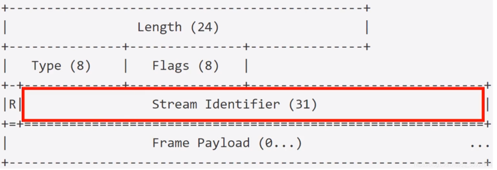

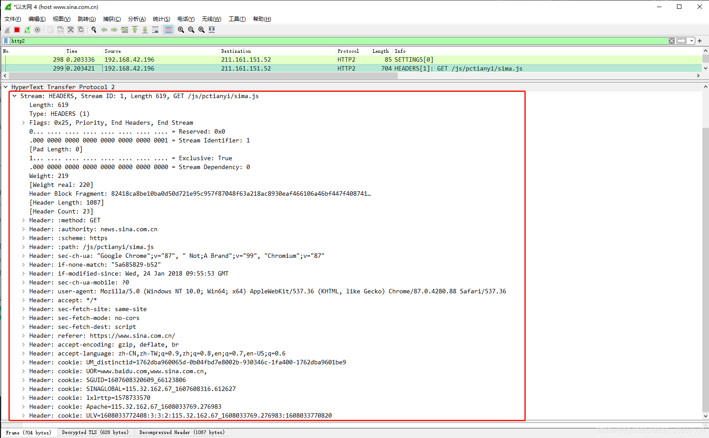

由客户端建立的 Stream ID 必须是奇数; 由服务端建立的 Stream ID 必须是偶数; Stream ID 为 0 的流仅用于传输控制帧。

同一 Stream 内的 frame 必须是有序的,接收端的实现可据此并发组装消息

新建立的 Stream ID 必须大于曾经建立过的状态为 opened 或 reserved 的 Stream ID。

帧类型

```
帧类型type	类型编码	含义

DATA	0x0	传递 HTTP 包体
HEADERS	0x1	传递 HTTP 头部
PRIORITY	0x2	指定 Stream 流的优先级
RST_STREAM	0x3	终止 Stream 流
SETTINGS	0x4	修改连接或者 Stream 流的配置
PUSH_PROMISE	0x5	服务端推送资源时描述请求的帧
PING	0x6	心跳检测，兼具计算 RTT 往返时间的功能
GOAWAY	0x7	优雅的终止连接或者通知错误
WINDOW UPDATE	0x8	实现流量控制
CONTINUATION	0x9	传递较大 HTTP 头部时的持续帧
```

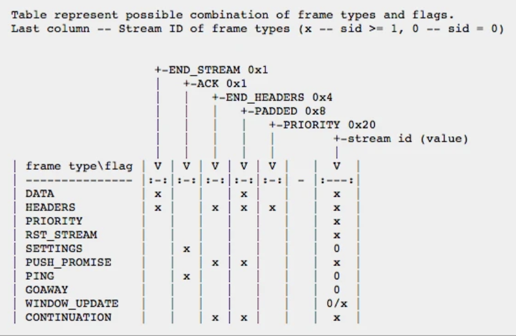

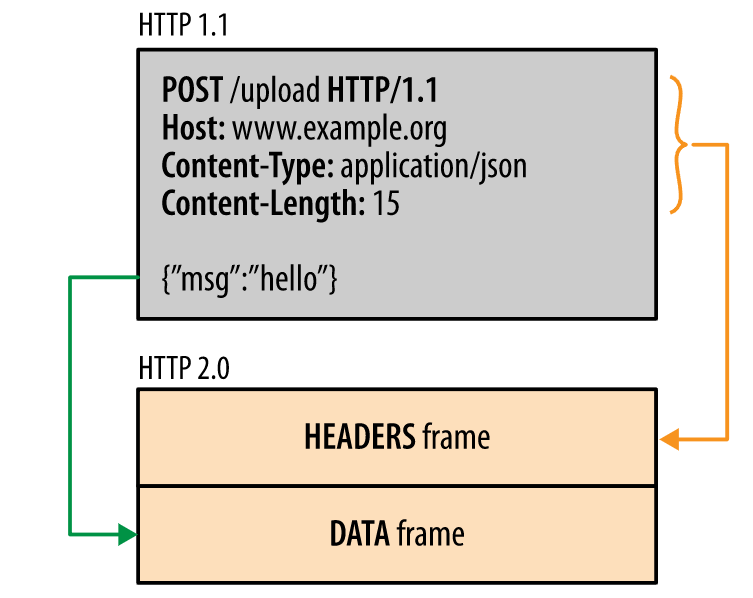

* DATA frame

DATA 帧(类型 = 0x0)可以传输与流相关联的任意可变长度的八位字节序列。DATA 帧包含以下几个字段:Pad Length:一个 8 位字段，包含以八位字节为单位的帧填充长度, 注意http2的每个帧都会标明length

```
    +---------------+
    |Pad Length? (8)|
    +---------------+-----------------------------------------------+
    |                            Data (*)                         ...
    +---------------------------------------------------------------+
    |                           Padding (*)                       ...
    +---------------------------------------------------------------+
```

DATA 帧定义 flag 标识：END_STREAM (0x1):
设置这个字段的时候，位 0 表示该帧是端点为将要发送的标识流的最后一帧。设置此标志会导致流进入"半关闭"状态或者"关闭"状态; PADDED (0x8):
设置这个字段的时候，位 3 表示存在 Pad Length 字段及其描述的任何填充。

DATA 帧会受到流量控制

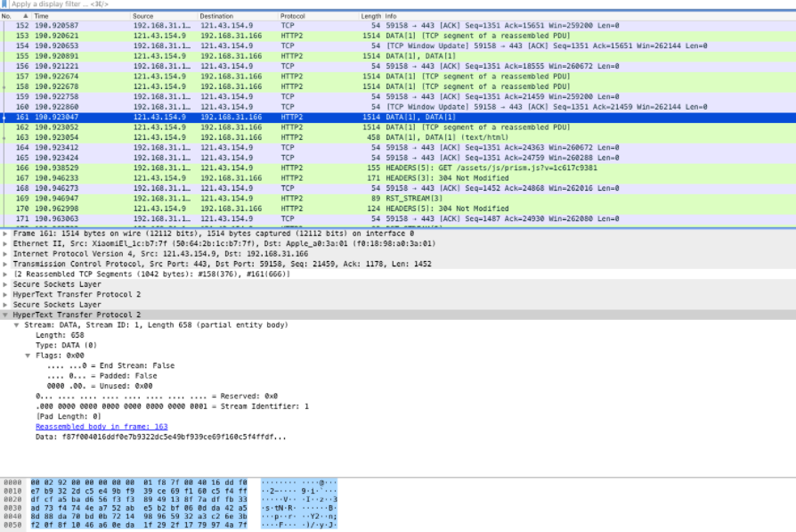

* PUSH_PROMISE帧

PUSH_PROMISE帧(类型 = 0x5) 用于在发送方打算发起的流之前提前通知对端。该帧保存有重要的请求行信息, 且包括标识Promised Stream ID:无符号的 31 位整数，用于标识 PUSH_PROMISE 保留的流, 客户端会从 1 开始设置 stream ID，之后每开启一个流，都会增加 2，并且之后一直用奇数。服务器开启在 PUSH_PROMISE 中标明的流时，设置的 stream ID 从 2 开始，并且之后一直用偶数。这样设计避免了客户端和服务器之间的 stream ID 冲突。

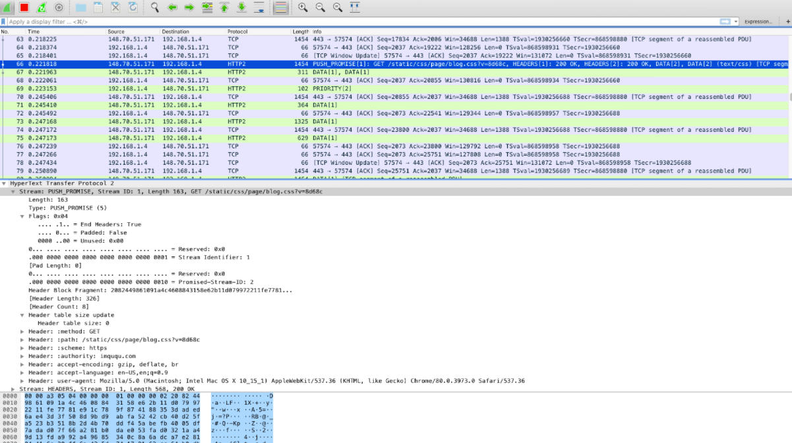

* HEADERS frame

HEADERS 帧 (类型 = 0x1) 用于打开一个流, Stream Dependency:
此流所依赖的流的 31 位流标识符; Weight:一个无符号的 8 位整数，表示流的优先级权重; 定义标识,END_STREAM (0x1): END_HEADERS (0x4)。主要保存了请求头部的内容。

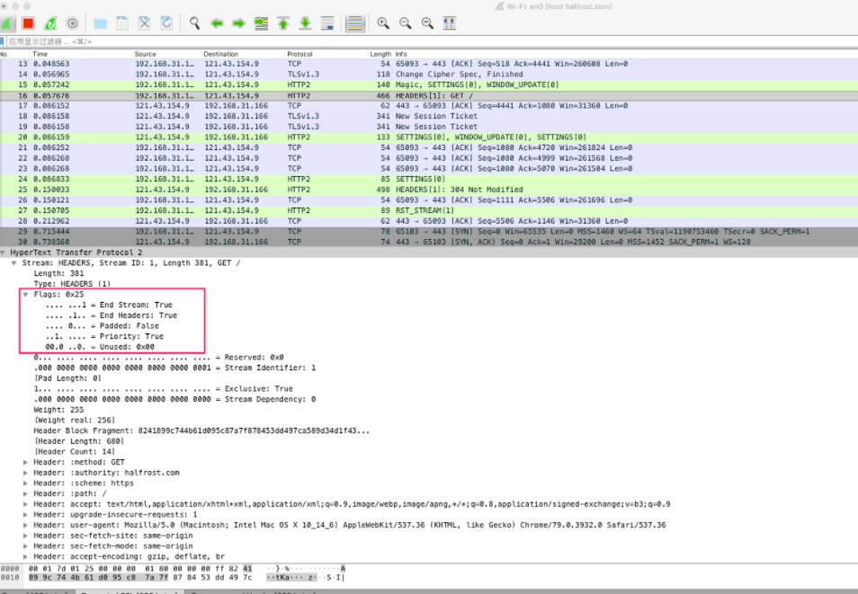

* PRIORITY frame

PRIORITY 帧(类型 = 0x2)指定了 stream 流的发送方的建议优先级, 具有无符号的 8 位整数，表示流的优先级权重。这个值代表获得 1 到 256 之间的权重。默认权重 16。

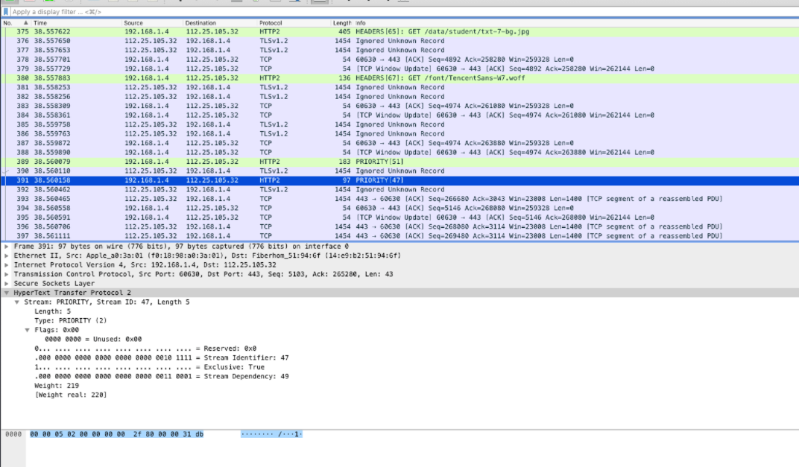

* SETTINGS frame

SETTINGS 帧(类型 = 0x4)传递影响端点通信方式的配置参数，为了提供这样的同步时间点，其中未设置 ACK 标志的 SETTINGS 帧的接收者必须在接收时尽快使更新的参数生效。

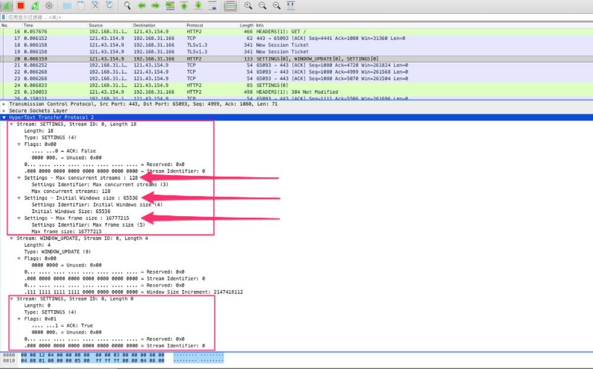

SETTINGS 帧始终适用于连接，而不是作用于单个流。SETTINGS 帧的流标识符必须为零(0x0)。如果端点收到其流标识符字段不是 0x0 的 SETTINGS 帧

* PRIORITY frame

PRIORITY 帧(类型 = 0x2)指定了 stream 流的发送方的建议优先级

* PING 帧

PING 帧(类型 = 0x6)是用于测量来自发送方的最小往返时间以及确定空闲连接是否仍然起作用的机制。 PING 帧可以从任何端点发送。可用作心跳检测，兼具计算 RTT 往返时间的功能。PING帧常常定时发送

* WINDOW_UPDATE

WINDOW_UPDATE帧(类型 = 0x8) 用于实现流量控制。流量控制基于 WINDOW_UPDATE 帧。接收者通告他们准备在 stream 流以及整个连接上接收多少个八位字节。只有 DATA 帧受流量控制；所有其他帧类型在广播其流量控制窗口的时候，不占用空间。这确保了重要的控制帧不会被流量控制阻挡。流量控制窗口的初始值为 65,535 个八位字节。

HTTP/2 中的流量控制是通过每个流上每个发送者保留一个窗口来实现的。流量控制窗口是一个简单的整数值，表示允许发送方传输多少个八位字节的数据。希望使用比当前大小更小的流量控制窗口的接收方可以发送新的 SETTINGS 帧。显然window帧只用于确定窗口大小, 真正修改窗口还得用settings

流量控制仅针对直接建立 TCP 连接的两端。如果对端是代理服务器，代理服务器不需要向上游转发 WINDOW_UPDATE 帧。不过接收端缩小流量控制的窗口会最终传递到源发送端。


### http2.0执行步骤

1. 客户端和服务器建立TCP连接后, 客户端发起http连接时将自动将该连接抽象成stream结构。它会向server发送开场白，并发送一些初始化数据帧。例如""PRI * HTTP/2.0\r\n\r\nSM\r\n\r\n"

2. 发送完开场白后，client向server发送SETTINGS数据帧。包括告知server客户端是否开启push功能; 告知server客户端可接受的最大数据窗口是http2transportDefaultStreamFlow(4M);server此连接可接受的最大数据窗口为http2transportDefaultConnFlow(1G)。

3. 调用cc.newStream()在连接上创建一个数据流, , 因为是多个请求共享一个连接，那么向连接写入数据帧时需要加锁，比如加锁写入请求头。

一般的首先确认client和server都支持http2协议，并构建一个http2的连接，同时开启该连接的读循环。然后通过http2连接池获取一个http2连接，并发送请求和读取响应。

HTTP2通信的最小单位是数据帧，每一个帧都包含两部分：帧头和Payload。不同数据流的帧可以交错发送但同一个数据流的帧必须顺序发送，然后再根据每个帧头的数据流标识符重新组装。只需要解析帧头部分,payload部分直接无脑复制即可

4. 接收到HeadersFrame, WindowUpdateFrame, FrameSettings, DataFrame等不同的帧对应不同的处理函数。由于每个流内的帧必须严格按照顺序, 因此不会出现乱序不需要使用ACK确认号。此外header帧是重点要解析的, 由于使用了hpack压缩有效降低了资源使用, 数据帧直接写入缓冲区


#### 客户端建立连接

http2ClientConn结构
```go
cc := &http2ClientConn{
    t:                     t,
    tconn:                 c,
    readerDone:            make(chan struct{}),
    nextStreamID:          1,
    maxFrameSize:          16 << 10,           // spec default
    initialWindowSize:     65535,              // spec default 初始化窗口大小为65535
    maxConcurrentStreams:  1000,               // "infinite", per spec. 1000 seems good enough. 每个连接上允许最多有多少个数据流同时传输数据。
    peerMaxHeaderListSize: 0xffffffffffffffff, // "infinite", per spec. Use 2^64-1 instead. 
    streams:               make(map[uint32]*http2clientStream), // 当前连接上的数据流。
    singleUse:             singleUse,
    wantSettingsAck:       true,
    pings:                 make(map[[8]byte]chan struct{}),
}
```

条件锁并且新建Writer&Reader。
```go
cc.cond = sync.NewCond(&cc.mu)
cc.flow.add(int32(http2initialWindowSize))
cc.bw = bufio.NewWriter(http2stickyErrWriter{c, &cc.werr})
cc.br = bufio.NewReader(c)
```

读写数据帧的Framer。
```go
cc.fr = http2NewFramer(cc.bw, cc.br)
cc.fr.ReadMetaHeaders = hpack.NewDecoder(http2initialHeaderTableSize, nil)
cc.fr.MaxHeaderListSize = t.maxHeaderListSize()
```
向server发送开场白，并发送一些初始化数据帧。
```go
initialSettings := []http2Setting{
    {ID: http2SettingEnablePush, Val: 0},
    {ID: http2SettingInitialWindowSize, Val: http2transportDefaultStreamFlow},
}
if max := t.maxHeaderListSize(); max != 0 {
    initialSettings = append(initialSettings, http2Setting{ID: http2SettingMaxHeaderListSize, Val: max})
}

cc.bw.Write(http2clientPreface)
cc.fr.WriteSettings(initialSettings...)
cc.fr.WriteWindowUpdate(0, http2transportDefaultConnFlow)
cc.inflow.add(http2transportDefaultConnFlow + http2initialWindowSize)
cc.bw.Flush()

// 开场白内容
const (
    // client首先想server发送以PRI开头的一串字符串。
    http2ClientPreface = "PRI * HTTP/2.0\r\n\r\nSM\r\n\r\n"
)
var (
    http2clientPreface = []byte(http2ClientPreface)
)
```

发送完开场白后，client向server发送SETTINGS数据帧。发送完SETTINGS数据帧后，发送WINDOW_UPDATE数据帧, 因为第一个参数为0即streamID为0，则是告知server此连接可接受的最大数据窗口为http2transportDefaultConnFlow（1G）。发送完WINDOW_UPDATE数据帧后，将client的可读流控制窗口大小设置为http2transportDefaultConnFlow + http2initialWindowSize。

开启读循环并返回`go cc.readLoop()`

以下几点均为true时，才代表当前连接能够处理新的请求

* 连接状态正常，即未关闭并且不处于正在关闭的状态。
* 当前连接正在处理的数据流小于maxConcurrentStreams。
* 下一个要处理的数据流 + 当前连接处于等待状态的请求*2 < math.MaxInt32。
* 当前连接没有长时间处于空闲状态（主要通过cc.tooIdleLocked()判断）。

客户端是有连接池的, 从连接池成功获取到一个可以处理请求的连接，就可以和server进行数据交互，以上是客户端建立连接的过程

客户端对服务器连接执行一个请求意味着是一个数据流，而请求内容以帧的形式组织。换言之一个stream相当于一个http request或者http response, 这样的好处是防止一个http请求解析失误阻塞整个连接, 在http2.0中一个stream不会阻塞连接

#### 客户端处理请求, 建立stream

在真正开始处理请求前，还要进行header检查。如果当前连接处理的数据流确实已经达到上限，则开始进入等待流程。

调用cc.newStream()在连接上创建一个数据流（创建数据流是线程安全的，因为源码中在调用awaitOpenSlotForRequest之前先加锁，直到写入请求的header之后才释放锁）。
```go
func (cc *http2ClientConn) newStream() *http2clientStream {
    cs := &http2clientStream{
        cc:        cc,
        ID:        cc.nextStreamID,
        resc:      make(chan http2resAndError, 1),
        peerReset: make(chan struct{}),
        done:      make(chan struct{}),
    }
    cs.flow.add(int32(cc.initialWindowSize))
    cs.flow.setConnFlow(&cc.flow)
    cs.inflow.add(http2transportDefaultStreamFlow)
    cs.inflow.setConnFlow(&cc.inflow)
    cc.nextStreamID += 2
    cc.streams[cs.ID] = cs
    return cs
}

/*
新建一个http2clientStream，数据流ID为cc.nextStreamID，新建数据流后，cc.nextStreamID +=2。
数据流通过http2resAndError管道接收请求的响应。
初始化当前数据流的可写流控制窗口大小为cc.initialWindowSize，并保存连接的可写流控制指针。
初始化当前数据流的可读流控制窗口大小为http2transportDefaultStreamFlow，并保存连接的可读流控制指针。
最后将新建的数据流注册到当前连接中。
*/
```

调用(*http2ClientConn).newStream方法会创建一个数据流，那这个数据流什么时候结束呢，这就是http2FlagDataEndStream的作用。当client收到有响应body的响应时（HEAD请求无响应body，301，302等响应也无响应body），一直读到http2FrameData数据帧的标识符为http2FlagDataEndStream则意味着本次请求结束可以关闭当前数据流。(超时关闭, 定时器)

http2FlagHeadersEndStream：如果读到的http2FrameHeaders数据帧有此标识符也意味着本次请求结束。

http2FlagSettingsAck：该标示符意味着对方确认收到http2FrameSettings数据帧。

因为是多个请求(多个stream)共享一个连接，那么向连接写入数据帧时需要加锁，比如加锁写入请求头。

http2.0可以处理http1.1格式的请求, 也就是请求行, 请求头, 请求体。调用cc.t.getBodyWriterState(cs, body)会返回一个http2bodyWriterState结构体。通过该结构体可以知道请求body是否发送成功。数据流对象主要包括id, 控制流大小, 


#### 数据帧
类型帧

```cpp
const (
	http2FrameData         http2FrameType = 0x0
	http2FrameHeaders      http2FrameType = 0x1
	http2FramePriority     http2FrameType = 0x2
	http2FrameRSTStream    http2FrameType = 0x3
	http2FrameSettings     http2FrameType = 0x4
	http2FramePushPromise  http2FrameType = 0x5
	http2FramePing         http2FrameType = 0x6
	http2FrameGoAway       http2FrameType = 0x7
	http2FrameWindowUpdate http2FrameType = 0x8
	http2FrameContinuation http2FrameType = 0x9
)

// 帧flags
const (
	// Data Frame
	http2FlagDataEndStream http2Flags = 0x1
  
  // Headers Frame
	http2FlagHeadersEndStream  http2Flags = 0x1
  
  // Settings Frame
	http2FlagSettingsAck http2Flags = 0x1
	// 此处省略定义其他数据帧标识符的代码
)
```

流控制是一种阻止发送方向接收方发送大量数据的机制，以免超出后者的需求或处理能力。Go中HTTP2通过http2flow结构体进行流控制：
```go
type http2flow struct {
	// n is the number of DATA bytes we're allowed to send.
	// A flow is kept both on a conn and a per-stream.
	n int32

	// conn points to the shared connection-level flow that is
	// shared by all streams on that conn. It is nil for the flow
	// that's on the conn directly.
	conn *http2flow
}
```

`(*http2ClientConn)`.readLoop读循环, `(*http2clientConnReadLoop).run`的核心逻辑是读取数据帧然后对不同的数据帧进行不同的处理。`cc.fr.ReadFrame()`会根据前面介绍的数据帧格式读出数据帧。

```go
func (cc *http2ClientConn) readLoop() {
	rl := &http2clientConnReadLoop{cc: cc}
	defer rl.cleanup()
	cc.readerErr = rl.run()
	if ce, ok := cc.readerErr.(http2ConnectionError); ok {
		cc.wmu.Lock()
		cc.fr.WriteGoAway(0, http2ErrCode(ce), nil)
		cc.wmu.Unlock()
	}
}

func (rl *http2clientConnReadLoop) run() error {
	cc := rl.cc
	rl.closeWhenIdle = cc.t.disableKeepAlives() || cc.singleUse
	gotReply := false // ever saw a HEADERS reply
	gotSettings := false
	for {
		f, err := cc.fr.ReadFrame()
    // 此处省略代码
		maybeIdle := false // whether frame might transition us to idle

		switch f := f.(type) {
		case *http2MetaHeadersFrame:
			err = rl.processHeaders(f)
			maybeIdle = true
			gotReply = true
		case *http2DataFrame:
			err = rl.processData(f)
			maybeIdle = true
		case *http2GoAwayFrame:
			err = rl.processGoAway(f)
			maybeIdle = true
		case *http2RSTStreamFrame:
			err = rl.processResetStream(f)
			maybeIdle = true
		case *http2SettingsFrame:
			err = rl.processSettings(f)
		case *http2PushPromiseFrame:
			err = rl.processPushPromise(f)
		case *http2WindowUpdateFrame:
			err = rl.processWindowUpdate(f)
		case *http2PingFrame:
			err = rl.processPing(f)
		default:
			cc.logf("Transport: unhandled response frame type %T", f)
		}
		if err != nil {
			if http2VerboseLogs {
				cc.vlogf("http2: Transport conn %p received error from processing frame %v: %v", cc, http2summarizeFrame(f), err)
			}
			return err
		}
		if rl.closeWhenIdle && gotReply && maybeIdle {
			cc.closeIfIdle()
		}
	}
}
```

http2FrameSettings数据帧读循环会最先读到。读到该数据帧后会调用(*http2clientConnReadLoop).processSettings方法。

http2FrameHeaders数据帧，会调用(*http2Framer).readMetaFrame对读取到的数据帧解码

收到http2DataFrame数据帧,意味着我们开始接收真实的响应，即平常开发中需要处理的业务数据。此数据帧对应的处理函数为(*http2clientConnReadLoop).processData。

(*http2clientStream).writeRequestBody不停的读取请求body然后将读取的内容通过 cc.fr.WriteData转为http2FrameData数据帧发送给server，直到请求body读完为止。其中和流控制有关的方法是awaitFlowControl

```go
func (cs *http2clientStream) writeRequestBody(body io.Reader, bodyCloser io.Closer) (err error) {
	cc := cs.cc
	sentEnd := false // whether we sent the final DATA frame w/ END_STREAM
  // 此处省略代码
	req := cs.req
	hasTrailers := req.Trailer != nil
	remainLen := http2actualContentLength(req)
	hasContentLen := remainLen != -1

	var sawEOF bool
	for !sawEOF {
		n, err := body.Read(buf[:len(buf)-1])
    // 此处省略代码
		remain := buf[:n]
		for len(remain) > 0 && err == nil {
			var allowed int32
			allowed, err = cs.awaitFlowControl(len(remain))
			switch {
			case err == http2errStopReqBodyWrite:
				return err
			case err == http2errStopReqBodyWriteAndCancel:
				cc.writeStreamReset(cs.ID, http2ErrCodeCancel, nil)
				return err
			case err != nil:
				return err
			}
			cc.wmu.Lock()
			data := remain[:allowed]
			remain = remain[allowed:]
			sentEnd = sawEOF && len(remain) == 0 && !hasTrailers
			err = cc.fr.WriteData(cs.ID, sentEnd, data)
			if err == nil {
				err = cc.bw.Flush()
			}
			cc.wmu.Unlock()
		}
		if err != nil {
			return err
		}
	}
  // 此处省略代码
	return err
}
```

#### 读取数据帧

`(*http2ClientConn).readLoop`方法中提到了`ReadFrame()`方法，该方法会读取数据帧，如果是`http2FrameHeaders`数据帧，会调用`(*http2Framer).readMetaFrame`对读取到的数据帧解码

HTTP2使用 HPACK 压缩格式压缩请求和响应标头元数据，这种格式采用下面两种技术压缩：

* 通过静态哈夫曼代码对传输的标头字段进行编码，从而减小数据传输的大小。
* 单个连接中，client和server共同维护一个相同的标头字段索引列表（笔者称为HPACK索引列表），此列表在之后的传输中用作编解码的参考。

HPACK索引列表
```go
type headerFieldTable struct {
    // As in hpack, unique ids  are 1-based. The unique id for ents[k] is k + evictCount + 1.
    ents       []HeaderField
    evictCount uint64

    // byName maps a HeaderField name to the unique id of the newest entry with the same name.
    byName map[string]uint64

    // byNameValue maps a HeaderField name/value pair to the unique id of the newest
    byNameValue map[pairNameValue]uint64
}
```

静态和动态索引表
```go
var staticTable = newStaticTable()
func newStaticTable() *headerFieldTable {
    t := &headerFieldTable{}
    t.init()
    for _, e := range staticTableEntries[:] {
        t.addEntry(e)
    }
    return t
}
var staticTableEntries = [...]HeaderField{
    {Name: ":authority"},
    {Name: ":method", Value: "GET"},
    {Name: ":method", Value: "POST"},
  // 此处省略代码
    {Name: "www-authenticate"},
}

// 动态
type dynamicTable struct {
    // http://http2.github.io/http2-spec/compression.html#rfc.section.2.3.2
    table          headerFieldTable
    size           uint32 // in bytes
    maxSize        uint32 // current maxSize
    allowedMaxSize uint32 // maxSize may go up to this, inclusive
}
```

HPACK编解码, 编码直接将http1.1的报文处理编码, 而解码会有标识符, 例如。由于stream中的frame是有序的, 因此挨个解码即可。
```
     0   1   2   3   4   5   6   7
   +---+---+---+---+---+---+---+---+
   | 0 | 0 | 0 | 1 |  Index (4+)   |
   +---+---+-----------------------+
   | H |     Value Length (7+)     |
   +---+---------------------------+
   | Value String (Length octets)  |
   +-------------------------------+
0001:索引头开始位。
Index:Name索引。
H:Value是否使用静态霍夫曼编码。
Value Length:7bit的Value长度，后面跟Value内容。

编码数据的十六进制表示：
400a 6375 7374 6f6d 2d6b 6579 0d63 7573 | @.custom-key.cus
746f 6d2d 6865 6164 6572                | tom-header

解码过程：

40                               | == Literal indexed ==   （01000000表示要追加到表中）
0a                               |   Literal name (len = 10) （得到key长度）
6375 7374 6f6d 2d6b 6579         | custom-key         
0d                               |   Literal value (len = 13) （得到value长度）
6375 7374 6f6d 2d68 6561 6465 72 | custom-header           （一个key:value 读取完毕）
                                                                    
解码结果可得header：     custom-key:custom-header  
并将其加入动态表，下次直接只传index  
```

处理帧和处理http1.1的文本字符没有太大区别, 只是多了一个判别帧类型, 解码的过程, 发送数据也类似, 增加了计算量。而当epoll监听到数据到来时, 需要判断是否应该建立一个流对象, 流对象中维护了帧的情况。注意帧大小不是定长的, 而类似内存的逻辑分段

```go
    cs := &http2clientStream{
        cc:        cc,
        ID:        cc.nextStreamID,
        resc:      make(chan http2resAndError, 1),
        peerReset: make(chan struct{}),
        done:      make(chan struct{}),
    }
    cs.flow.add(int32(cc.initialWindowSize))
    cs.flow.setConnFlow(&cc.flow)
    cs.inflow.add(http2transportDefaultStreamFlow)
    cs.inflow.setConnFlow(&cc.inflow)
```
数据流对象有一些方法, 通过http2resAndError管道接收请求的响应。初始化当前数据流的可写流控制窗口大小为cc.initialWindowSize

创建好了流对象就从TcpConnection缓冲区中读取字符流并根据特点解码封装成frame对象, 同时调用流对象的流量控制观察是否需要排队等待, 处理frame对象和处理报文是一样的, 关键就是header, 一般信息header中都能够包含(nheader即包括http请求的请求行和q请求头), 除了post请求

```
GET /favicon.ico HTTP/1.1\r\nHost: 172.20.109.213:9006\r\nConnection: keep-alive\r\nPragma: no-cache\r\nCache-Control: no-cache\r\nUser-Agent: Mozilla/5.0 (Windows NT 10.0; Win64; x64) AppleWebKit/537.36 (KHTML, like Gecko) Chrome/93.0.4577.82 Safari/537.36\r\nAccept: image/avif,image/webp,image/apng,image/svg+xml,image/*,*/*;q=0.8\r\nReferer: http://172.20.109.213:9006/5\r\nAccept-Encoding: gzip, deflate\r\nAccept-Language: en,zh-CN;q=0.9,zh;q=0.8,bs;q=0.7,zh-TW;q=0.6\r\n\r\n
```

protobuf以对象的形式序列化对象, 进行网络传输, 而过程存储在对象的成员函数中。http2.0直接将序列化内容放在FrameData中用于传输使用

使用ngxhttp2调试http2流量

```
nghttp -nvu http://nghttp2.org

[  0.147] Connected
[  0.147] HTTP Upgrade request
GET / HTTP/1.1
host: nghttp2.org
connection: Upgrade, HTTP2-Settings
upgrade: h2c
http2-settings: AAMAAABkAAQAAP__
accept: */*
user-agent: nghttp2/1.9.0-DEV

[  0.291] HTTP Upgrade response
HTTP/1.1 101 Switching Protocols
Connection: Upgrade
Upgrade: h2c

[  0.291] HTTP Upgrade success
[  0.291] recv SETTINGS frame <length=12, flags=0x00, stream_id=0>
          (niv=2)
          [SETTINGS_MAX_CONCURRENT_STREAMS(0x03):100]
          [SETTINGS_INITIAL_WINDOW_SIZE(0x04):65535]
[  0.291] send SETTINGS frame <length=12, flags=0x00, stream_id=0>
          (niv=2)
          [SETTINGS_MAX_CONCURRENT_STREAMS(0x03):100]
          [SETTINGS_INITIAL_WINDOW_SIZE(0x04):65535]
[  0.291] send SETTINGS frame <length=0, flags=0x01, stream_id=0>
          ; ACK
          (niv=0)
[  0.291] send PRIORITY frame <length=5, flags=0x00, stream_id=3>
          (dep_stream_id=0, weight=201, exclusive=0)
[  0.291] send PRIORITY frame <length=5, flags=0x00, stream_id=5>
          (dep_stream_id=0, weight=101, exclusive=0)
[  0.291] send PRIORITY frame <length=5, flags=0x00, stream_id=7>
          (dep_stream_id=0, weight=1, exclusive=0)
[  0.291] send PRIORITY frame <length=5, flags=0x00, stream_id=9>
          (dep_stream_id=7, weight=1, exclusive=0)
[  0.291] send PRIORITY frame <length=5, flags=0x00, stream_id=11>
          (dep_stream_id=3, weight=1, exclusive=0)
[  0.291] send PRIORITY frame <length=5, flags=0x00, stream_id=1>
          (dep_stream_id=11, weight=16, exclusive=0)
[  0.291] recv (stream_id=1) :method: GET
[  0.291] recv (stream_id=1) :scheme: http
[  0.291] recv (stream_id=1) :path: /stylesheets/screen.css
[  0.291] recv (stream_id=1) :authority: nghttp2.org
[  0.291] recv (stream_id=1) host: nghttp2.org
[  0.291] recv (stream_id=1) user-agent: nghttp2/1.9.0-DEV
[  0.291] recv PUSH_PROMISE frame <length=59, flags=0x04, stream_id=1>
          ; END_HEADERS
          (padlen=0, promised_stream_id=2)
[  0.291] recv (stream_id=1) :status: 200
[  0.291] recv (stream_id=1) date: Mon, 07 Mar 2016 13:02:35 GMT
[  0.291] recv (stream_id=1) content-type: text/html
[  0.291] recv (stream_id=1) content-length: 6654
[  0.291] recv (stream_id=1) last-modified: Mon, 29 Feb 2016 15:38:08 GMT
[  0.291] recv (stream_id=1) etag: "56d465e0-19fe"
[  0.291] recv (stream_id=1) link: </stylesheets/screen.css>; rel=preload; as=stylesheet
[  0.291] recv (stream_id=1) accept-ranges: bytes
[  0.291] recv (stream_id=1) x-backend-header-rtt: 0.00093
[  0.291] recv (stream_id=1) server: nghttpx nghttp2/1.9.0-DEV
[  0.291] recv (stream_id=1) via: 2 nghttpx
[  0.291] recv (stream_id=1) x-frame-options: SAMEORIGIN
[  0.291] recv (stream_id=1) x-xss-protection: 1; mode=block
[  0.291] recv (stream_id=1) x-content-type-options: nosniff
[  0.291] recv HEADERS frame <length=251, flags=0x04, stream_id=1>
          ; END_HEADERS
          (padlen=0)
          ; First response header
[  0.471] recv DATA frame <length=6654, flags=0x01, stream_id=1>
          ; END_STREAM
[  0.471] recv (stream_id=2) :status: 200
[  0.471] recv (stream_id=2) date: Mon, 07 Mar 2016 13:02:35 GMT
[  0.471] recv (stream_id=2) content-type: text/css
[  0.471] recv (stream_id=2) content-length: 39082
[  0.471] recv (stream_id=2) last-modified: Mon, 29 Feb 2016 15:38:08 GMT
[  0.471] recv (stream_id=2) etag: "56d465e0-98aa"
[  0.471] recv (stream_id=2) accept-ranges: bytes
[  0.471] recv (stream_id=2) x-backend-header-rtt: 0.000479
[  0.471] recv (stream_id=2) server: nghttpx nghttp2/1.9.0-DEV
[  0.471] recv (stream_id=2) via: 2 nghttpx
[  0.471] recv (stream_id=2) x-frame-options: SAMEORIGIN
[  0.471] recv (stream_id=2) x-xss-protection: 1; mode=block
[  0.471] recv (stream_id=2) x-content-type-options: nosniff
[  0.471] recv (stream_id=2) x-http2-push: 1
[  0.471] recv HEADERS frame <length=61, flags=0x04, stream_id=2>
          ; END_HEADERS
          (padlen=0)
          ; First push response header
[  0.964] recv DATA frame <length=16384, flags=0x00, stream_id=2>
[  0.964] recv DATA frame <length=16384, flags=0x00, stream_id=2>
[  0.964] send WINDOW_UPDATE frame <length=4, flags=0x00, stream_id=0>
          (window_size_increment=37620)
[  0.964] send WINDOW_UPDATE frame <length=4, flags=0x00, stream_id=2>
          (window_size_increment=32768)
[  1.538] recv DATA frame <length=6314, flags=0x01, stream_id=2>
          ; END_STREAM
[  1.538] recv SETTINGS frame <length=0, flags=0x01, stream_id=0>
          ; ACK
          (niv=0)
[  1.538] send GOAWAY frame <length=8, flags=0x00, stream_id=0>
          (last_stream_id=2, error_code=NO_ERROR(0x00), opaque_data(0)=[])
```

顺序
1. recv SETTINGS frame, send SETTINGS frame
2. send PRIORITY frame, 
3. recv HEADERS frame <length=251, flags=0x04, stream_id=1>; END_HEADERS
4. recv DATA frame <length=6654, flags=0x01, stream_id=1>; END_STREAM

### http3.0和QUIC协议

quick udp internet connection, QUIC, 由google 提出的使用 udp 进行多路并发传输的协议。QUIC协议是一系列协议的集合，主要包括, 传输协议(Transport), 丢包检测与拥塞控制(Recovery), 安全传输协议(TLS), HTTP3协议, HTTP头部压缩协议(QPACK), 负载均衡协议(Load Balance)。

QUIC协议改进1. 降低了队头阻塞, 从传输层协议解决 2. 优化连接建立, 解决了传统tcp三次握手+tls握手的繁琐, 且连接可复用 3. 支持用户可配置的拥塞控制算法 4. 自动错误纠正

QUIC是在UDP的基础上，构建类似TCP的可靠传输协议。HTTP3则在QUIC基础上完成HTTP事务, 可以分为以下几层
1. UDP层: 在UDP层传输的是UDP报文，此处关注的是UDP报文荷载内容是什么，以及如何高效发送UDP报文
2. Connection层: Connection通过CID来确认唯一连接，connection对packet进行可靠传输和安全传输
3. Stream层: Stream在相应的Connection中，通过StreamID进行唯一流确认，stream对stream frame进行传输管理
4. HTTP3层：HTTP3建立在QUIC Stream的基础上，相对于HTTP1.1和HTTP2.0，HTTP3提供更有效率的HTTP事务传输。

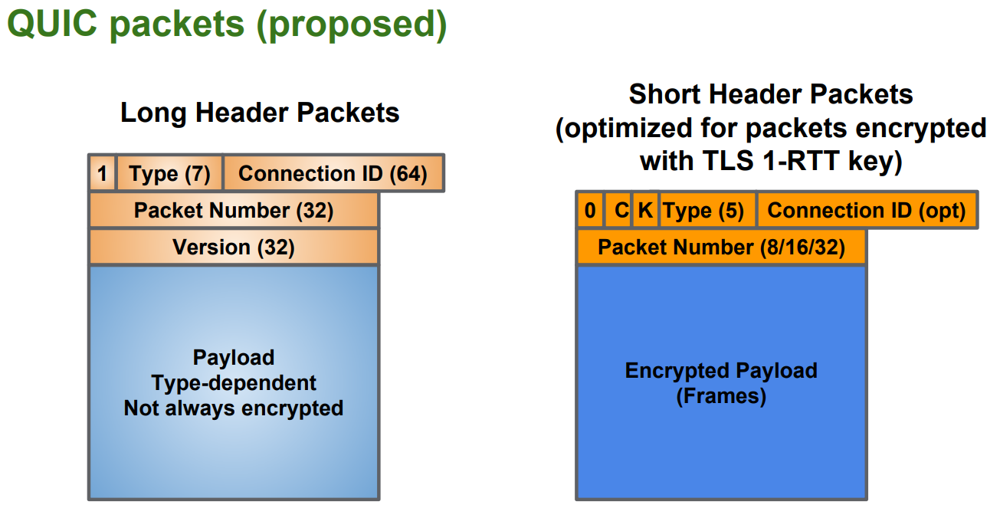

#### TCP的问题

1. 多次握手：TCP 协议需要三次握手建立连接，而如果需要 TLS 证书的交换，那么则需要更多次的握手才能建立可靠连接，这在如今长肥网络的趋势下是一个巨大的痛点
2. 队头阻塞：TCP 协议下，如果出现丢包，则一条连接将一直被阻塞等待该包的重传，即使后来的数据包可以被缓存，但也无法被递交给应用层去处理。
3. 无法判断一个 ACK 是重传包的 ACK 还是原本包的 ACK：比如 一个包 seq=1, 超时重传的包同样是 seq=1，这样在收到一个 ack=1 之后，我们无法判断这个 ack 是对之前的包的 ack 还是对重传包的 ack，这会导致我们对 RTT 的估计出现误差，无法提供更准确的拥塞控制
4. 无法进行连接迁移：一条连接由一个四元组标识，在当今移动互联网的时代，如果一台手机从一个 wifi 环境切换到另一个 wifi 环境，ip 发生变化，那么连接必须重新建立，inflight 的包全部丢失。

因此QUIC的实现目标包括
1. 更好的连接建立方式
2. 更好的拥塞控制
3. 没有队头阻塞的多路复用
4. 前向纠错
5. 连接迁移


#### 数据包格式

一个QUIC 数据包由 header 和 data 两部分组成。header 是明文的，包含 4 个字段：Flags、Connection ID、QUIC Version、Packet Number, data 是加密的，可以包含 1 个或多个 frame，每个 frame 又分为 type 和 payload，其中 payload 就是应用数据

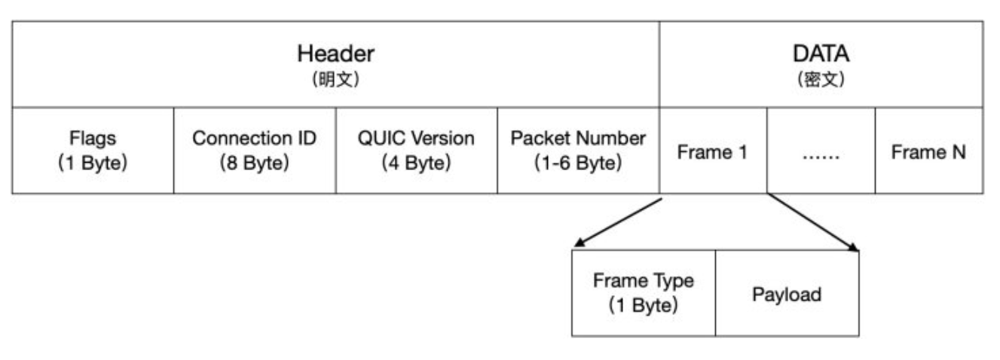

#### 连接建立

TLS 1.2 的情况下，一个连接的建立需要经过这样几个过程：

TCP 三次握手 (1-RTT)

建立 TLS 1.2 安全连接 (2-RTT)
1. client 发送 client hello 包给 server, 包含了一个随机数 R1, 其支持的加密套件, 其他各种首选项
2. server 接收到 client hello 后，发送 server hello，包含了一个随机数 R2, 又发送 certificate 证书，包含了 RSA 加密的公钥，可选发送一个 ServerKeyExchange (仅在 Certificate 不足够使 client 交换 预主密钥 时发送)，全部发送完之后最后发送一个 ServerHelloDone。
3. 到client 接收 server 发送的全部信息，以上过程花费 1-RTT，现在 client 有两个随机数 R1, R2, 证书及公钥，约定的加密算法信息等首选项；server 也有两个随机数 R1, R2，也知道约定的加密算法等信息
4. client 验证证书合法性，包括有效期、证书链可信性、域名是否和证书匹配等。验证通过之后使用证书携带的公钥加密一个随机数 R3，形成预主密钥，发送给 server，然后由 R1, R2 和预主密钥，计算出协商的对称加密密钥，用于之后信息交换的加密
5. server 通过自身的 RSA 私钥解密出预主密钥，此时也有 R1, R2 和预主密钥，通过同样的加密算法，计算出相同的对称加密密钥，给 client 发送一个 Finished 包
6. client 接收到 Finished 后便可以通过对称密钥来加密HTTP请求的消息了，以上过程又花费 1-RTT，此时才开始发送有效载荷

TLS 1.3 相对于 TLS 1.2 的巨大改进就在于，它只需要 1-RTT 就可以建立安全连接


1. 客户端：生成随机数 a，选择公开的大数 G 和 P，计算 `A=a*G%P`，将 A 和 G 发送给服务器，也就是 Client Hello 消息
2. 服务器：生成随机数 b，计算 `B=b*G%P`，将 B 发送给客户端，也就是 Server Hello 消息
3. 客户端：使用 ECDH 算法生成通信密钥 `KEY = aB = ab*G%P`; 服务器：使用 ECDH 算法生成通信密钥 `KEY = bA = ba*G%P`, 密钥交换算法


QUIC 协议借助 TLS 1.3 来完成握手，使得 QUIC + TLS 1.3 的延迟只有 1-RTT, 因为QUIC没有使用TCP建立连接


这样一般的https需要3-RTT才建立连接, 而QUIC只需要一次RTT。当重复连接时, 客户端缓存了 ServerConfig(B=b*G%P)，直接使用缓存数据计算通信密钥.
1. 客户端：生成随机数 c，选择公开的大数 G 和 P，计算 `A=c*G%P`，将 A 和 G 发送给服务器，也就是 Client Hello 消息; 客户端：客户端直接使用缓存的 ServerConfig 计算通信密钥 `KEY = cB = cb*G%P`，加密发送应用数据
2. 服务器：根据 Client Hello 消息计算通信密钥 `KEY = bA = bc*G%P`, 这样相当于不用握手就可以建立连接


#### 可靠传输

可靠传输有 2 个重要特点：
1. 完整性：发送端发出的数据包，接收端都能收到
2. 有序性：接收端能按序组装数据包，解码得到有效的数据

通过包号（PKN）和确认应答（SACK）可以保证完整性和有序性。包号都是单调递增的, 之前发送的包和重传的包的包号也是不同的。但每个数据包都有一个 offset 字段，表示在整个数据中的偏移量, 用来保证有序性

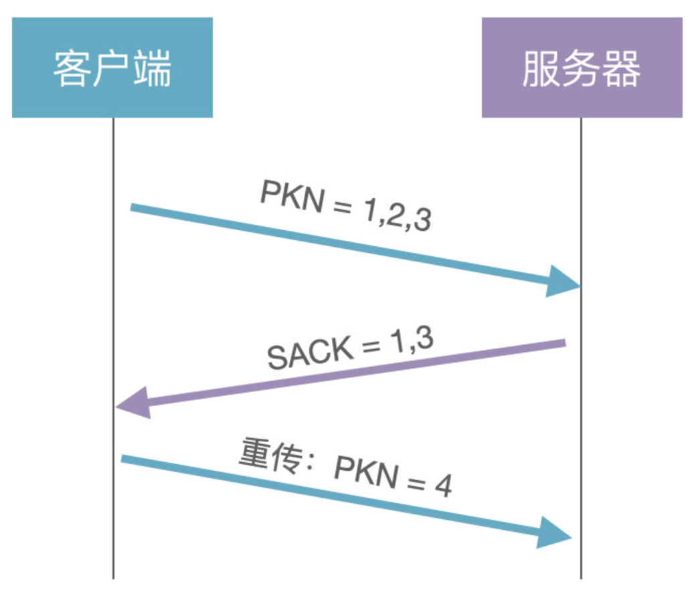

在TCP中原始包和重传包的序列号是一样的，客户端不知道服务器返回的 ACK 包到底是原始包的，还是重传包的。但 QUIC 的原始包和重传包的序列号是不同的，也就可以判断 ACK 包的归属。stream起到的作用类似TCP, 传输的单位故可称为packet

#### 改进的拥塞控制

目前的 QUIC 的拥塞控制主要实现了 TCP 的慢启动，拥塞避免，快重传，快恢复。在这些拥塞控制算法的基础上，再进行改进。

比如单调递增的 Packet Number。TCP 使用了基于字节序号 Sequence Number 和 ACK 来保证消息的有序到达。但是 Sequence Number 在重传的时候有二义性。你不知道下一个 ACK 是上一次请求的响应还是这次重传的响应。而单调递增的 Packet Number 可以避免这个问题，保证采样 RTT 的准确。

1. 可插拔。应用程序层面就能实现不同的拥塞控制算法，不需要操作系统或内核支持。且拥塞算法是可配置的, 类似Nginx的nginx.conf
2. 单调递增的Packet Number QUIC并没有使用TCP的基于字节序号及ACK来确认消息的有序到达，QUIC使用的是Packet Number，每个Packet Number严格递增，所以如果Packet N丢失了，重传Packet N的Packet Number已不是N，而是一个大于N的值。 这样就很容易解决TCP的重传歧义问题。
3. 更多的ACK块 QUIC ACK帧支持256个ACK块，相比TCP的SACK在TCP选项中实现，有长度限制，最多只支持3个ACK块
4. QUIC ACK包同时携带了从收到包到回复ACK的延时，这样结合递增的包序号，能够精确的计算RTT。

#### 没有队头阻塞的多路复用

QUIC 避开了 TCP， 他设计 connection 和 stream 的概念，一个 connection 可以复用传输多个 stream，每个 stream 之间都是独立的，单一一个 stream 丢包并不会影响到其他资源处理。丢包只会针对stream而不是connection, 这就避免了TCP那种丢包连接重置的问题, QUIC连接一旦建立, 除非断网基本不会删除, 且QUIC连接的开销也大大小于TCP+TLS

在 tcp 协议中，假如中间有丢包，即使是缓存下来之后到达的数据，用户层也无法读取这个数据，因为整个数据队列就阻塞在丢包的包的位置, 且TCP是基于流的。这就是**队头阻塞**, 但在 QUIC 协议中，通过多路复用在同一条连接上标识不同的stream，则当一个包丢失了，只会阻塞该包所在的流，不会影响其他的流。


#### 自动错误修正

这里的错误指的是某个包丢了。当某个 packet 丢失的时候，QUIC 能够通过已经接收到的其他包对资源进行修复。

这意味着，实际上每个 packet 都携带着多余的信息，通过这些信息，QUIC 能够重组对应资源，而无需进行重传。

目前大概每 10 个包能修复一个 packet。

#### 连接迁移

TCP 是按照 4-要素（客户端IP、端口, 服务器IP、端口） 要确定一个连接的，当这4个要素其中一个发生变化的时候，连接就需要重新建立。而在移动端，我们经常会切换 4G/wifi 使用，每一次切换，我们只能重新建立连接。

在 QUIC 中，连接是由其维护的。 于是 QUIC 通过生成客户端生成一个 Connection ID (64位)的东西来区别不同连接，只要生成的 UUID 不变， 连接就不需要重新建立，即便是客户端的网络发生变化。

### 流媒体协议

常用的流媒体协议主要有HTTP渐进下载和基于RTSP/RTP的实时流媒体协议两类。在流式传输的实现方案中，一般采用HTTP/TCP来传输控制信息，而用RTP/UDP来传输实时多媒体数据。

#### 实时传输协议RTP与RTCP

RTP(Real-time Transport Protocol)是用于Internet上针对多媒体数据流的一种传输协议。RTP由两个紧密链接部分组成:RTP----传送具有实时属性的数据；RTP控制协议(RTCP)监控服务质量并传送正在进行的会话参与者的相关信息。

RTP协议是建立在UDP协议上的。RTP并不保证传送或防止无序传送，也不确定底层网络的可靠性。RTP实行有序传送，RTP中的序列号允许接收方重组发送方的包序列，同时序列号也能用于决定适当的包位置.

实时传输控制协议（Real-time Transport Control Protocol,RTCP）是实时传输协议（RTP）的一个姐妹协议。RTCP为RTP媒体流提供信道外控制。RTCP定期在流多媒体会话参加者之间传输控制数据。RTCP的主要功能是为RTP所提供的服务质量提供反馈。RTCP收集相关媒体连接的统计信息，例如：传输字节数，传输分组数，丢失分组数，时延抖动，单向和双向网络延迟等等。

#### 实时流协议RTSP

RTSP协议定义了一对多应用程序如何有效通过IP网络传送多媒体数据。RTSP在体系结构上位于RTP和RTCP之上，它使用TCP或RTP完成数据传输。RTSP可以是双向的，即客户机和服务器都可以发出请求。

#### 实时消息传输协议RTMP

RTMP协议是采用实时的流式传输，所以不会缓存文件到客户端，这种特性说明用户想下载RTMP协议下的视频是比较难的；

视频流可以随便拖动，既可以从任意时间点向服务器发送请求进行播放，并不需要视频有关键帧。相比而言，HTTP协议下视频需要有关键帧才可以随意拖动。

RTMP协议支持点播/回放（通俗点将就是支持把flv,f4v,mp4文件放在RTMP服务器，客户端可以直接播放），直播（边录制视频边播放）。

#### HLS

HTTP Live Streaming(HLS)是苹果公司实现的基于HTTP的流媒体传输协议，可实现流媒体的直播和点播，主要应用于iOS系统。HLS协议在服务器端将直播数据流存储为连续的、很短时长的媒体文件（MPEG-TS格式），而客户端则不断的下载并播放这些小文件，因为服务器总是会将最新的直播数据生成新的小文件，这样客户端只要不停的按顺序播放从服务器获取到的文件，就实现了直播。由此可见，基本上可以认为，HLS是以点播的技术方式实现直播。

HTTP传输一般需要 2-3 个通道，命令和数据通道分离。