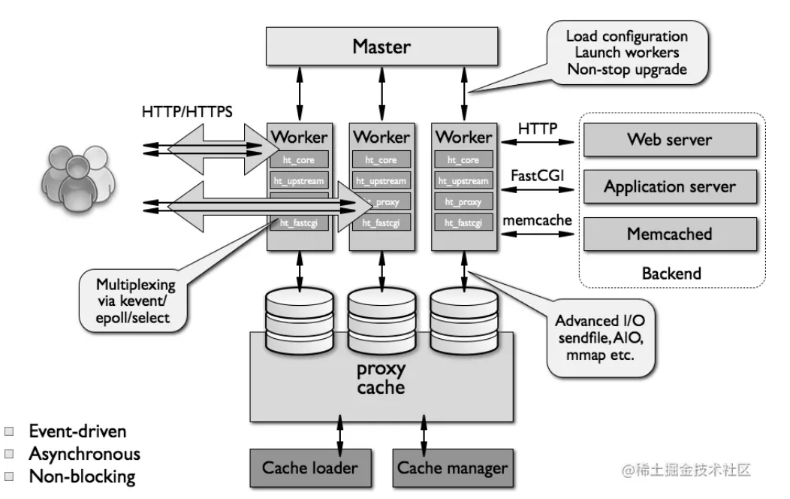
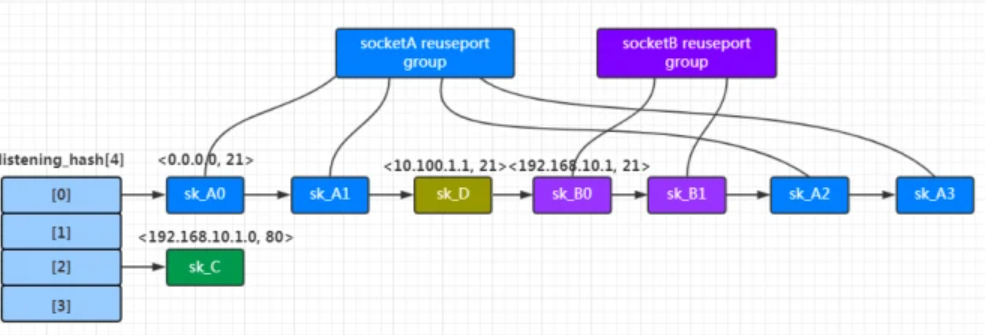
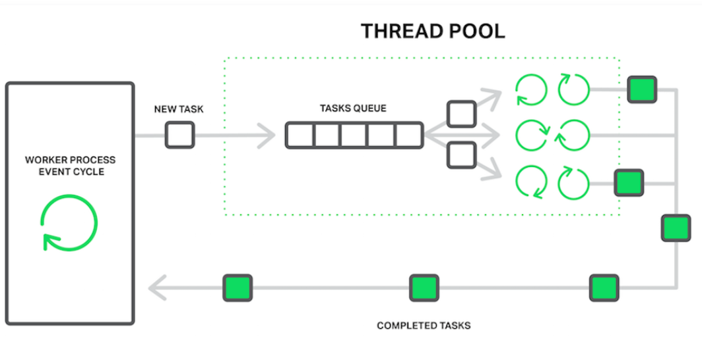
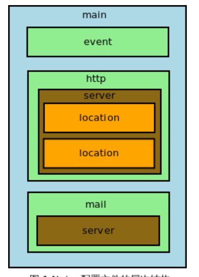

> 参考https://www.kancloud.cn/digest/understandingnginx/202586

### 架构

为了让进程占用CPU的全部计算力，Nginx充分利用了分时操作系统的特点，比如增加CPU时间片(通过设置进程优先级)、提高CPU二级缓存命中率(通过设置绑定CPU, 自然命中缓存变多)、用异步IO和线程池的方式回避磁盘的阻塞读操作

#### 整体架构

Nginx 启动时，会生成两种类型进程，主进程(master)，一个或多个工作进程(worker)。主进程 并不处理网络请求，主要负责 调度工作进程，也就是图示的 3 项：加载配置、启动工作进程 及 非停升级。所以，Nginx 启动以后，查看操作系统的进程列表，我们就能看到 至少有两个 Nginx 进程。



Nginx 的 worker 进程，包括 核心 和 功能性模块，核心模块 负责维持一个 运行循环（run-loop），执行网络请求处理的 不同阶段 的模块功能，比如：网络读写、存储读写、内容传输、外出过滤，以及 将请求发往上游服务器 等。


#### 请求方式处理

Nginx 是一个 高性能 的 Web 服务器，能够同时处理 大量的并发请求。它结合 多进程机制 和 异步机制，异步机制使用的是 异步非阻塞方式。Nginx 的 异步非阻塞机制 中，工作进程 在调用 IO 后，就去处理其他的请求，当 IO 调用返回后，会 通知 该 工作进程。即I/O多路复用。

所有 worker 进程的 listenfd 会在 新连接 到来时变得 可读，为保证只有一个进程处理该连接，所有 worker 进程在注册 listenfd 读事件 前 抢占 accept_mutex，抢到 互斥锁 的那个进程 注册 listenfd 读事件，在 读事件 里调用 accept 接受该连接。在 Nginx 服务器的运行过程中，主进程 和 工作进程 需要进程交互。交互依赖于 Socket 实现的 管道 来实现。

处理惊群效应, 1.11.3版本后，Nginx默认关闭了accept_mutex锁，这是因为操作系统提供了reuseport（Linux3.9版本后才提供这一功能）这个更好的解决方案。内核为每个Worker进程都建立了独立的ACCEPT队列，由内核将建立好的连接按负载分发到各队列中，SO_REUSEPORT选项在Linux 3.9被引入内核。 基于此linux不存在accept连接上的惊群问题了

* SO_REUSEPORT

TCP/UDP用五元组唯一标识一个连接。任何时候，两条连接的五元组都不能完全相同，否则当收到一个报文时，协议栈没办法判断它是属于哪个连接的。SO_REUSEPORT就很好理解了，它让两个socket可以绑定完全相同的<IP:Port>。

```
SO_REUSEPORT       socketA        socketB       Result
---------------------------------------------------------------------
    ON         192.168.0.1:21   192.168.0.1:21    OK
```

Client的SYN报文到达时，Server会首先根据本地端口(SYN报文的<dport>)计算出一条hash冲突链，然后遍历该链表上的所有Socket，根据四元组匹配程度进行打分;如果使能了reuseport，那么可能有多个Socket都将拿到最高分，此时内核将随机选择一个进行后续处理。



<!-- more -->

#### 文件I/O阻塞问题

阻塞操作是指任何导致事件处理循环显著停止一段时间的操作。比如说，NGINX可能忙于处理冗长的CPU密集型处理，或者可能需要等待访问资源（例如硬盘驱动器，或一个库函数以同步方式从数据库获取响应）。NGINX当中，一个进程读一个没有缓存在内存中的文件而不得不去访问硬盘的时候。硬盘驱动器很慢（特别是机械硬盘），而等待队列中的其他请求可能不需要访问驱动器，所以它们也是被迫等待的。 因此，延迟增加，系统资源未得到充分利用。

一些操作系统提供用于读取和发送文件的异步接口, 


为解决I/O阻塞的问题NGINX 1.7.11和NGINX Plus Release 7中引入了线程池。当一个工作进程需要做一个潜在的长时间操作时，它不会自己处理这个操作，而是将一个任务放在线程池的队列中，任何空闲的线程都可以从中进行处理。这个线程池是运行在Worker进程中的，并通过一个任务队列(max_queue设置了队列的最大长度)，以生产者/消费者模型与主线程交换数据



#### 服务器设计

性能这个概念主要是从网络角度出发。网络性能指在不同负载下, Web服务在网络通信上的吞吐量, 带宽指特定的网络连接上可以达到的最大吞吐量。因此网络性能肯定受制于带宽, 当然更多受制于Web服务的软件架构。

大多数场景下, 随着服务器并发连接数的增加, 网络性能都会下降。目前我们在谈网络性能时, 更多对应于高并发场景。例如, 在几万或者几十万并发连接下, 要求我们的服务器仍然可以保持较高的网络吞吐量, 而不是当并发连接数达到一定数量时, 服务器的CPU等资源大都浪费在进程间切换, 休眠, 等待等活动上, 导致吞吐量大幅下降。

延迟性指服务器初次接收到一个用户请求直至返回响应之间的持续时间, 服务器在高并发和低并发连接数量下单个请求的平均延迟时间肯定是不同的, Nginxz在设计时更应该考虑的是在高并发下如何保持平均时延性, 使其不要上升的太快。

另外可以考虑使用长连接keepalive代替短连接以减少建立、关闭连接带来的网络交互, 使用压缩算法增加相同吞吐量下的信息携带量, 使用缓存减少网络交互次数等, 从网络层面提高性能。

可伸缩性指架构可以通过添加组件来提升服务, 或者允许组件之间具有交互功能。一般可以通过简化组件, 降低组件的耦合度，将服务分散到许多组件等方法来改善可伸缩性。


#### 架构

nginx优秀的模块化设计，所有模块都遵循同样的ngx_module_t接口设计规范, 该接口有一个ctx成员void*指针, 指向的数据实现了具体的模块。


官方Nginx共有五大类型的模块, 核心模块, 配置模块, 事件模块, HTTP模块, mail模块。配置模块是所有模块的基础, 它实现了最基本的配置项解析功能(即解析nginx.conf)。事件模块中, ngx_event_core_module是其他所有事件模块的基础, 在HTTP模块中ngx_http_core_module模块是其他所有HTTP模块的基础。

Nginx采用完全的事件驱动架构来处理业务, 传统服务器在连接建立之后执行顺序的批处理模式 这样每个请求在连接建立之后都将始终占用着系统资源, 直到连接关闭才会释放资源。这造成了服务器资源的极大浪费, 影响了系统可以处理并发连接数。

Nginx不使用进程和线程作为事件消费者, 所谓的事件消费者只是某个模块而不是进程, 只有事件收集, 分发器才有资格占用进程资源, 他们会分发调度模块占用资源。这个问题在于, 必须保证每个事件消费者不能有阻塞行为, 不然该模块将长时间占用事件分发进程而导致其他事件得不到及时响应。这种调度线程的逻辑很像golang的goroutine

```
阶段  触发的事件
建立TCP连接   接受到TCP的SYN包
开始接收用户请求  接受到TCP的ACK包表示连接建立成功
接收到用户请求并分析已接收的请求是否完整  接受到用户的数据包
对于非keep-alive请求, 在发送完静态文件后主动关闭连接 接受到TCP中的ACK包表示用户已接收到之前发送的所有数据包
由于用户关闭连接而结束请求  接收到TCP中的FIN包
```

异步处理和多阶段是相辅相成的, 当一个事件被分发到事件消费者中处理时, 只相当于处理完一个请求的某个阶段。至于下一个阶段还需要等待内核的通知, 例如下一次事件出现时epoll等事件分发器将会获取到通知, 在调用时间消费者处理。这种请求的多阶段异步处理，将使得每个进程都能全力运转，尽量少的出现进程休眠状况。

* 划分请求的阶段

将本身可能导致进程休眠的方法或者系统调用, 分解为多个更小的方法, 这些调用间用事件触发关联。也就是将进程等待转为阻塞完后唤醒进程。例如非阻塞socket, 调用send发送数据后进程不会进入休眠, 而可以执行别的任务。当数据到来再触发进程执行。总之高并发原则是创建少量的进程执行多的任务, 尽力避免进程休眠。

如果没有网咯事件, 可以设置简单的定时器再某个时间点调用下一个阶段。为了保证事件时间可控, 可以分解长时间任务。例如读取10MB的文件分解成读取若干10kb的文件, 防止进程阻塞过长。如果阻塞方法无法划分, 则必须使用独立的进程执行这个阻塞方法, 防止影响其他任务的执行

Nginx采用一个master管理进程, 多个worker工作进程的设计方式。多个worker进程可以多核系统的并发处理能力, 同时可以做负载均衡。管理进程会负责监控工作进程的状态。

同时为了避免出现内存碎片, Nginx设计了简单的内存池。该内存池可以把多次向系统申请内存的操作整合成一次，这大大减少了CPU的消耗和碎片。

### 内存池

Nginx 使用内存池对内存进行管理，把内存分配归结为大内存分配和小内存分配。若申请的内存大小比同页的内存池最大值 max 还大，则是大内存分配，否则为小内存分配。


### 数据结构

Nginx封装，定义了一些基本的数据结构。由于Nginx对内存分配只保证低内存消耗, 以实现十万甚至百万级别的同时并发连接数, 所以这些Nginx数据结构都是尽可能的少占用内存。

* ngx_int_t

Nginx使用ngx_int_t封装有符号整型
```cpp
typedef intptr_t	ngx_int_t;
typedef uintptr_t	ngx_uint_t;
```

* ngx_str_t

字符串用ngx_str_t类型表示
```cpp
typedef struct {
	size_t	len;
	u_char	*data;
} ngx_str_t;
```

* ngx_list_t

ngx_list_t是Nginx封装的链表容器, 它在Nginx中用的很频繁, 例如HTTP的头部就是用ngx_list_t来存储的
```cpp
typedef struct ngx_list_part_s	ngx_list_part_t;

struct ngx_list_part_s {
	void	*elts;
	ngx_uint_t	nelts;
	ngx_list_part_t	*next;
};

typedef struct {
	ngx_list_part_t	*last;
	ngx_list_part_t	part;
	size_t	size;
	ngx_uint_t 	nalloc;
	ngx_pool_t	*pool;
} ngx_list_t;

// ngx_list_t可以看成链表的控制块
part	链表的首个数组元素
last	指向链表的最后一个数组元素
size	链表元素类型ngx_list_part_t是一个数组, 而该元素大小需要<=size
nalloc	最多存储多少数据
pool	管理内存分配的内存池对象

ngx_list_part_t是一个数组类型,
elts 指向数组的起始地址
nelts	表示数组中已经使用了多少元素
next	下一个链表元素ngx_list_part_t的地址

```

<!-- more -->

简单使用
```cpp
ngx_list_t* testlist = ngx_list_create(r->pool, 4, sizeof(ngx_str_t));	// 创建链表
if (testlist == NULL) {
	return NGX_ERROR;
}

ngx_str_t* str = ngx_list_push(testlist);	// 添加新元素, 一般调用之返回新元素地址, 再对地址进行赋值
if (str == NULL) {
	return NGX_ERROR;
}
str->len = sizeof("Hello World");
str->value = "Hello world";

// 遍历链表中的元素
ngx_list_part_t* part = &testlist.part;
ngx_str_t* str = part->elts;
for (int i = 0; i ++) {
	if (i >= part->nelts)	// 元素数量
	{
		if (part->next == NULL) {
			break;
		}
		// 访问下一个ngx_list_part_t
		part=part->next;
		header = part->elts;

		i = 0;
	}
	printf("list element: %*s\n", str[i].len, str[i].data);
}
```

* ngx_table_elt_t

ngx_table_elt_t数据结构如下所示
```cpp
typedef struct {
	ngx_uint_t	hash;
	ngx_str_t	key;
	ngx_str_t 	value;
	u_char	*lowcase_key;
} ngx_table_elt_t;
```

ngx_table_elt_t实际是一个key/value对。一般的, key用于存储http头部名称, value存储对应的值, hash用于快速检索头部。

* ngx_buf_t

缓冲区是Nginx处理大数据的关键数据结构, 既应用于内存数据也应用于磁盘数据。表征一块内存的基本情况。
```cpp
typedef struct ngx_buf_s ngx_buf_t;
typedef void*	ngx_buf_tag_t;

struct ngx_buf_s {
	u_char	*pos;	// 通常表示从这个位置处理内存中的数据
	u_char	*last; 	// 通常表示有效内容结尾地址
	off_t	file_pos;	// 处理文件时, 表示文件内容开始和结尾
	off_t	file_last;

	u_char	*start;	// 内存起始地址和结尾
	u_char	*end;
	ngx_buf_tag_t	tag;	// 当前缓冲区的类型
	ngx_file_t	*file;	// 引用的文件
	...
};

//ngx_charin_t是与ngx_buf_t配合使用的链表,

typedef struct ngx_chain_s	ngx_chain_t;
struct ngx_chain_s {
	ngx_buf_t	*buf;	// 指向缓冲块区域
	ngx_chain_t	*next;	// 指向下一个ngx_chain_t
};
```

### http处理模块

Nginx可以将用户自定义的http处理模块编译到服务器程序中, 实现自定义的应用逻辑。例如经典Hello World

```cpp
static ngx_int_t ngx_http_mytest_handler(ngx_http_request_t* r) {	// ngx_http_request_t可以获取到请求的http头部
	// 必须是GET或者HEAD方法
	if (!(r->method & (NGX_HTTP_GET | NGX_HTTP_HEAD))) {
		return NGX_HTTP_NOT_ALLOWED;
	}

	ngx_int_t rc = ngx_http_discard_request_body(r);
	if (rc != NGX_OK) {
		return rc;
	}

	ngx_str_t type = ngx_string("text/plain");
	ngx_str_t response = ngx_string("Hello World");
	r->headers_out.status = NGX_HTTP_OK;
	r->headers_out.content_length_n = response.len;
	r->headers_out.content_type = type;

	rc = ngx_http_send_header(r); // 发送http头部
	if (rc == NGX_ERROR || rc > NGX_OK || r->header_only) {
		return rc;
	}

	ngx_buf_t *b;	// 构建ngx_buf_t结构体
	b = ngx_create_temp_buf(r->pool, response.len);
	if (b == NULL) {
		return NGX_HTTP_INTERNAL_SERVER_ERROR;
	}
	// 用b->pos指向response.data的位置
	ngx_memory(b->pos, response.data, response.len);
	b->last = b->pos + response.len;
	b->last_buf = 1;

	ngx_chain_t out;	// out用来存储http包体
	out.buf = b;
	out.next = NULL;

	// 发送http包体
	return ngx_http_output_filter(r, &out);
}
```
以上是将内存的数据作为包体发送给客户端, 但如果发送文件使用这种办法会导致因不阻塞Nginx每次只能读取并发送磁盘的少量数据, 效率低下。Nginx可以利用Linux上高效的sendfile系统调用不需要先把磁盘的数据读取到用户态内存再发送。

```cpp
ngx_buf_t *b;
b = ngx_palloc(r->pool, sizeof(ngx_buf_t));

u_char* filename = (u_char*)"/tmp/test.txt";
b->in_file = 1;
b->file = ngx_pcalloc(r->pool, sizeof(ngx_file_t));
b->file->fd = ngx_open_file(filename, NGX_FILE_RDONLY|NGX_FILE_NONBLOCK, NGX_FILE_OPEN, 0);
b->file->log = r->connection->log;
b->file->name.data = filename;
b->file->name.len = sizeof(filename)-1;

if (b->file->fd <= 0) {
	return NGX_HTTP_NOT_FOUND;
}
```

### 配置文件

Nginx为用户提供了强大的配置项解析机制, 同时还支持`-s reload`命令, 在不重启服务的情况下使配置生效。通过多样化修改nginx.conf文件中的配置项, http{...}内的配置项最为复杂, 在http配置块内还有server块, location块等。



```
http {
	test_str main
	server {
		listen 80;
		test_str server80;
		location /url1 {
			mytest;
			test_str loc1;
		}
		location /url2 {
			mytest;
			test_str loc2;
		}
	}
	server {
		listen 8080;
		test_str server8080;
		location /url3 {
			mytest;
			test_str loc3;
		}
	}
}
```

Nginx将在每一个http块, server块或location块下, 生成独立的数据结构来存放配置项.

当Nginx检测到http{...}这个关键配置项时, HTTP配置模型就启动了, 这时会首先建立一个ngx_http_conf_ctx_t结构。事实上Nginx进程主循环发现配置文件中含有http{}关键字时, HTTP框架才会启动。然后调用配置文件解析器解析配置项, 当解析完毕之后Nginx才会启动Web服务器。

```cpp
typedef struct {
	void **main_conf;	// 指针数组, 数组每个元素只想create_main_conf方法产生的结构体
	void **srv_conf;
	void **loc_conf;
}ngx_http_conf_ctx_t;
```

HTTP框架为HTTP请求的处理过程定义了11个阶段, 
```cpp
typedef enum {
	NGX_HTTP_POST_READ_PHASE = 0,
	NGX_HTTP_SERVER_REWRITE_PHASE,
	NGX_HTTP_FIND_CONFIG_PHASE,
	NGX_HTTP_REWRITE_PHASE,
	NGX_HTTP_POST_REWRITE_PHASE,
	NGX_HTTP_ACCESS_PHASE,
	NGX_HTTP_POST_ACCESS_PHASE,
	NGX_HTTP_TRY_FILES_PHASE,
	NGX_HTTP_CONTENT_PHASE,
	NGX_HTTP_LOG_PHASE
} ngx_http_phases;
```

ginx的各个模块组合，每个模块只实现一个特定的功能。比如限流功能由模块ngx_http_limit_conn_module或者模块实现ngx_http_limit_req_module；fastcgi转发功能由模块ngx_http_fastcgi_module实现；proxy转发功能由ngx_http_proxy_module(当然转发功能的实现还必须有模块ngx_http_upstream_module)。每个模块都有一个commands数组，存储该模块可以解析的所有配置指令。指令结构体由ngx_command_t定义：
```cpp
struct ngx_command_s {
    ngx_str_t             name;
    ngx_uint_t            type;
    char               *(*set)(ngx_conf_t *cf, ngx_command_t *cmd, void *conf);
    ngx_uint_t            conf;
    ngx_uint_t            offset;
    void                 *post;
};
```

每个模块都应该有个可以存储配置的结构体，该结构体通过模块上下文结构体的函数create_conf，create_main_conf，create_srv_conf或者create_loc_conf创建。这几个存储上下文结构体的模块是有互相联系的


将配置文件包含的称之为指令, 配置文件可以包含多条指令, 指令块同样可以包含多条指令。一些指令可以同时出现在http指令块、server指令块和location指令块。这样可以用|来表示, 即http块中的指令类型可以是NGX_HTTP_MAIN_CONF，也可以是NGX_HTTP_MAIN_CONF|NGX_HTTP_SRV_CONF。

解析配置的入口函数是ngx_conf_parse(ngx_conf_t cf, ngx_str_t filename)，其输入参数filename表示配置文件路径，如果为NULL表明此时解析的是指令块。
```cpp
struct ngx_conf_s {
    char                 *name; //当前读取到的指令名称
    ngx_array_t          *args; //当前读取到的指令参数
 
    ngx_cycle_t          *cycle; //指向全局cycle
    ngx_pool_t           *pool;  //内存池
    ngx_conf_file_t      *conf_file; //配置文件
 
    void                 *ctx;   //上下文
    ngx_uint_t            module_type; //模块类型
    ngx_uint_t            cmd_type;   //指令类型
 
    ngx_conf_handler_pt   handler; //一般都是NULL，暂时不管
};
```

函数ngx_init_cycle会调用ngx_conf_parse开始配置文件的解析。解析配置文件首先需要创建配置文件上下文，并初始化结构体ngx_conf_t；

ngx_events_module模块（核心模块）中定义了events指令结构
```cpp
{ ngx_string("events"),
  NGX_MAIN_CONF|NGX_CONF_BLOCK|NGX_CONF_NOARGS,
  ngx_events_block,
  0,
  0,
  NULL }
```

函数ngx_events_block主要需要处理3件事: 1创建events_ctx上下文; 2调用所有事件模块的create_conf方法创建配置结构; 3修改cf->ctx(注意解析events块时配置上下文会发生改变), cf->module_type 和cf->cmd_type 并调用ngx_conf_parse函数解析events块中的配置

### 高级数据结构

Nginx有两个特点, 跨平台, 用C实现。这两个特点导致Nginx不宜使用一些第三方中间件提供的容器和算法。

ngx_queue_t双向链表是Nginx提供的轻量级链表容器, 将已经分配好内存的元素用指针连接起来。

ngx_array_t动态数组, 类似vector, 可以在达到容量最大值时自动扩容。

ngx_list_t单向链表, 原理是将单链表将多段内存块连接起来, 可以负责容器内元素内存分配。

ngx_rbtree_t红黑树在检索，插入，删除元素方面非常高效; ngx_radix_tree_t基数树要求整形数据为关键字, 且插入删除元素时不需要做旋转操作。

Nginx实现了常用的散列表和支持通配符的散列表, 例如www.test.*

### 进程管理

每个worker进程都是从master进程fork过来，在master进程里面，先建立好需要listen的socket（listenfd）之后，然后再fork出多个worker进程。

为保证只有一个进程处理该连接，所有worker进程在注册listenfd读事件前抢accept_mutex，抢到互斥锁的那个进程注册listenfd读事件，在读事件里调用accept接受该连接。(现在已经不采用了, 因为linux自行提供了防止连接惊群的机制)
