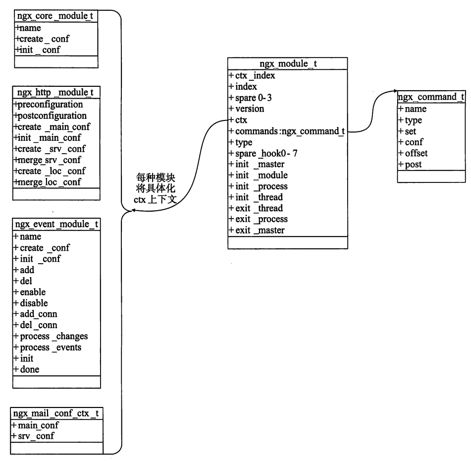
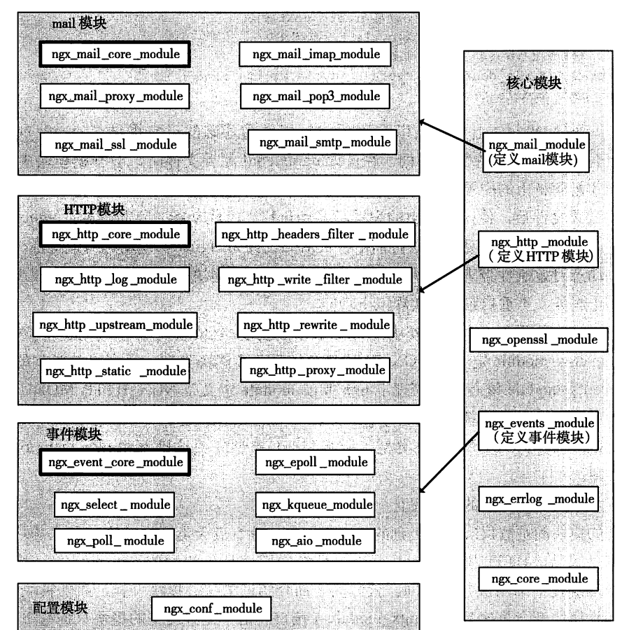
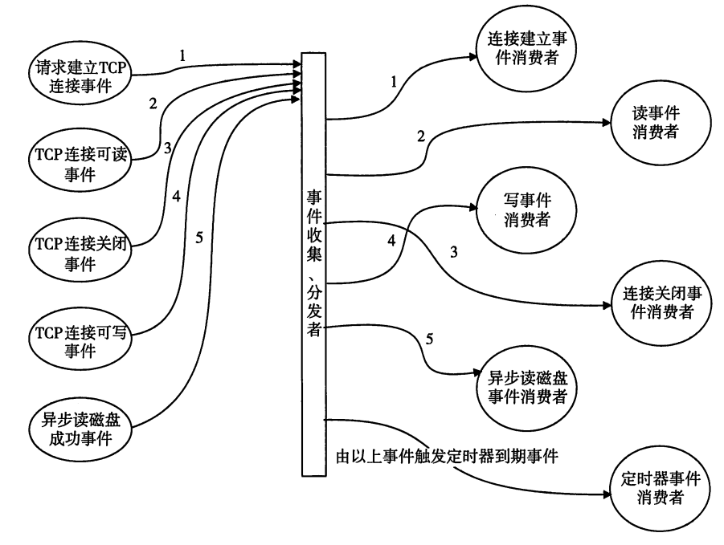
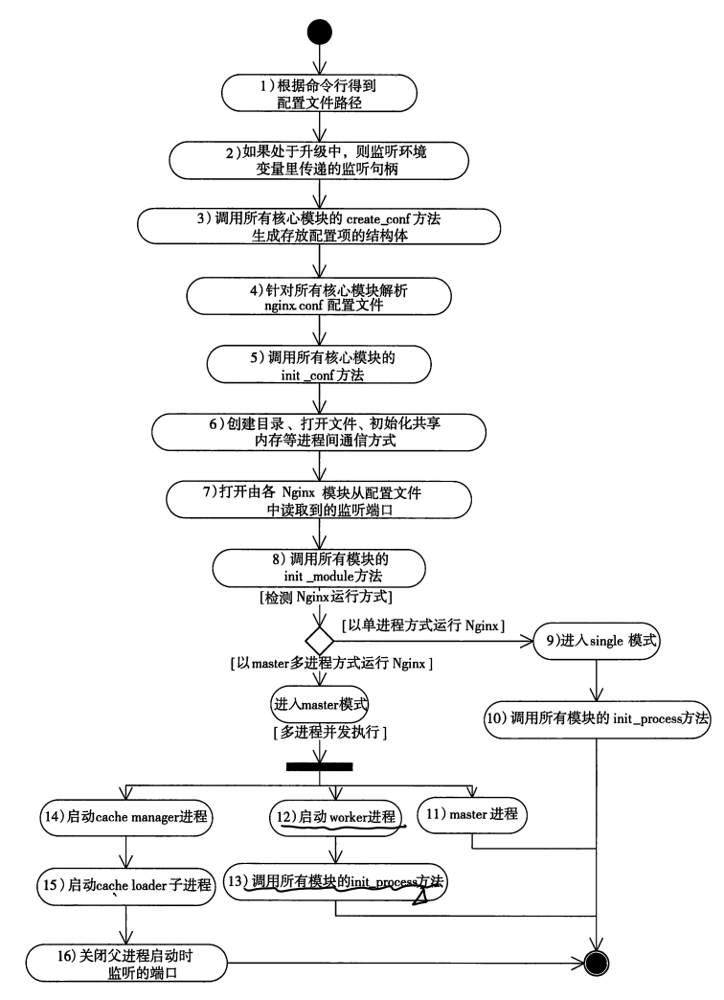
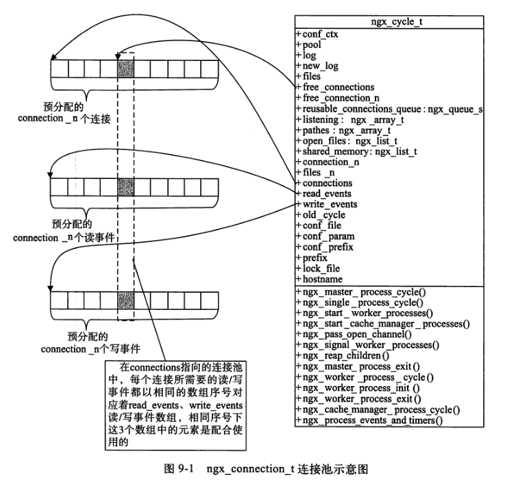
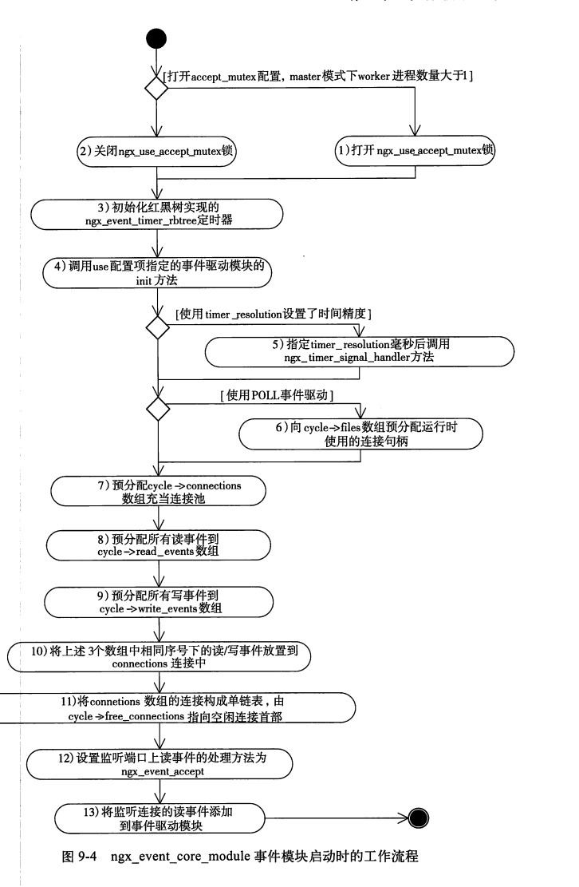
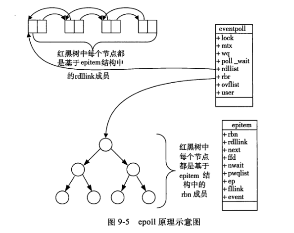
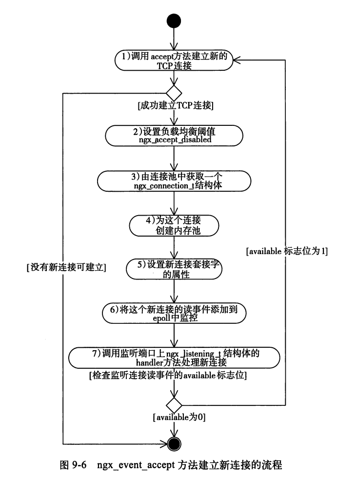
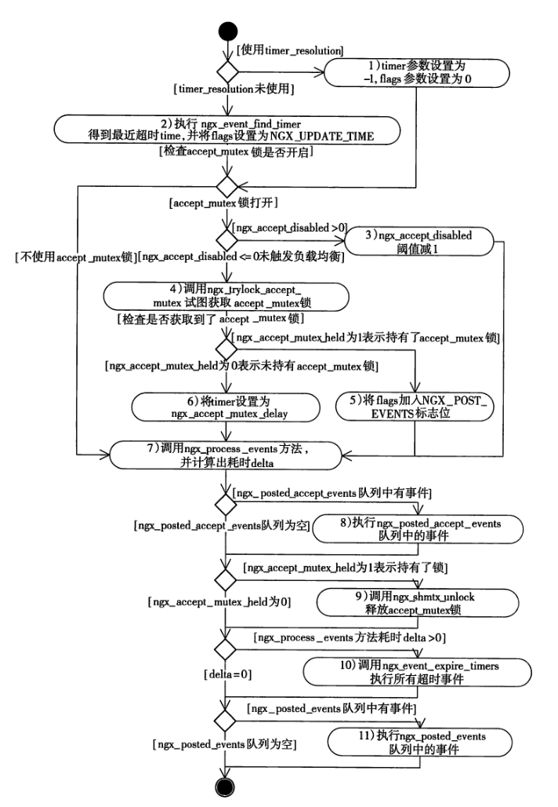

### 基础架构

性能
1. 网络性能, 更多是高并发, 例如几万几十万连接下，保证较高的吞吐量
2. 延迟性能, ms
3. 网络效率, 例如长连接

可伸缩性, 降低组件之间的耦合度, 服务分散到多个组件

可见性, 一些关键组件运行可被监控

可靠性, 避免单点故障

#### 模块化

模块由ngx_module_t组织, 其在configure下生成


<!-- more -->

六个官方具体/核心模块
1. ngx_core_module
2. ngx_errorlog_module
3. ngx_events_module
4. ngx_openssl_module
5. ngx_http_module
6. ngx_mail_module

ngx_core_module模块的接口
```cpp
typedef struct 
{
  ngx_str_t     name;
  void* (*create_conf) (ngx_cycle_t *cycle);
  char* (*init_conf)(ngx_cycle_t  *cycle, void *conf);
} ngx_core_module_t;
```

除了核心模块(6个)，还有四类模块, 配置模块, 事件模块, HTTP模块, mail模块


事件驱动架构, 一般的一个连接对应一个fd, 一个连接对应多种事件。这可能存在一个问题, 例如同一个连接三个事件, 第一个事件回调函数关闭了连接, 那执行第二个事件时需要发现该事件应该是过期的。

另外引用连接重用可能也出现问题, 例如同一个连接三个事件, 第一个事件释放连接, 第二个事件又把刚刚释放的连接从连接池中拿出给了别人，那第三个事件虽然存在fd的值但应该被发现是过期的。解决办法可以是通过设置连接重用标志位, 如果某个事件的连接被发现是重用的, 那这个事件应该就是过期的。

把请求分成多个阶段, 进行异步处理。异步处理前提是能拆分成多个阶段。



#### 核心结构体ngx_cycle_t

master管理进程, worker工作进程等, 每个进程都拥有唯一的ngx_cycle_t结构体。下面是它的结构
```cpp
typedef struct ngx_cycle_s ngx_cycle_t;
/* ngx_cycle_t 全局变量数据结构 */
struct ngx_cycle_s {
    /*
     * 保存所有模块配置项的结构体指针，该数组每个成员又是一个指针，
     * 这个指针又指向存储指针的数组
     */
    void                  **conf_ctx; /* 所有模块配置上下文的数组 */
    ngx_pool_t               *pool;     /* 内存池 */
    ngx_log_t                *log;      /* 日志 */
    ngx_log_t                 new_log;
    ngx_uint_t                log_use_stderr;  /* unsigned  log_use_stderr:1; */
    ngx_connection_t        **files;    /* 连接文件 */
    ngx_connection_t         *free_connections; /* 空闲连接 */
    ngx_uint_t                free_connection_n;/* 空闲连接的个数 */
    /* 可再利用的连接队列 */
    ngx_queue_t               reusable_connections_queue;
    ngx_array_t               listening;    /* 监听数组 */
    ngx_array_t               paths;        /* 路径数组 */
    ngx_list_t                open_files;   /* 已打开文件的链表 */
    ngx_list_t                shared_memory;/* 共享内存链表 */
    ngx_uint_t                connection_n; /* 已连接个数 */
    ngx_uint_t                files_n;      /* 已打开文件的个数 */
    ngx_connection_t         *connections;  /* 连接 */
    ngx_event_t              *read_events;  /* 读事件 */
    ngx_event_t              *write_events; /* 写事件 */
    /* old 的 ngx_cycle_t 对象，用于引用前一个 ngx_cycle_t 对象的成员 */
    ngx_cycle_t              *old_cycle;
    ngx_str_t                 conf_file;    /* nginx 配置文件 */
    ngx_str_t                 conf_param;   /* nginx 处理配置文件时需要特殊处理的，在命令行携带的参数 */
    ngx_str_t                 conf_prefix;  /* nginx 配置文件的路径 */
    ngx_str_t                 prefix;       /* nginx 安装路径 */
    ngx_str_t                 lock_file;    /* 加锁文件 */
    ngx_str_t                 hostname;     /* 主机名 */
};

typedef struct ngx_listening_s ngx_listening_t;
struct ngx_listening_s {
  ngx_socket_t fd;  // 套接字
  struct sockaddr *sockaddr;
  socklen_t socklen;
  int type; // 套接字类型,
  int backlog;  // TCP监听的backlog队列, 表示正在连接进程的最大个数
  int rcvbuf; // 接收缓冲区大小
  int sndbuf;

  ngx_connection_handler_pt nandler;  // 新的TCP连接成功建立后的处理方法

  size_t pool_size; // 内存池初始大小
  ngx_mesc_t  post_accept_timeout;  // 连接建立post_accept_timeout仍然没有收到用户数据, 则内核丢弃连接

  ngx_listening_t *previous;  // 由previous指针组成单向链表
  ngx_connection_t *connection; // 当前监听句柄对应着的ngx_connection_t结构体
  ...
};

// 连接建立成功回调方法handler
typedef void (*ngx_connection_handler_pt) (ngx_connection_t *c);
```



1. 在Nginx启动时, 首先会解析命令行, 处理各种参数。根据配置文件nginx.conf, 这时候会创建临时的ngx_cycle_t类型变量, 用它的成员储存配置文件路径
2. 调用核心模块的init_conf方法, 调用所有模块的init_process方法启动相应的进程执行。
3. 调用所有模块的init_module方法, init_process方法。master进程启动工作完成. worker进程进入ngx_worker_process_cycle工作循环。


Nginx框架是围绕着ngx_cycle_t结构体来控制进程运行的, ngx_cycle_t结构体的prefix, conf_prefix, conf_file等成员保存Nginx配置文件的路径。Nginx的可配置性完全依赖于nginx.conf文件。有了配置文件, Nginx框架会根据配置项来加载所有的模块, 这一步骤会在ngx_init_cycle方法中进行。


### 事件模块

网络事件驱动与操作系统有关, 为了跨平台, Nginx做法如下
1. 定义了一个核心模块ngx_events_module, Nginx在启动时调用ngx_init_cycle方法解析配置项, 一旦在nginx.conf配置文件中找到ngx_events_module感兴趣的events{}配置项, ngx_events_module开始工作, 它的作用就是为事件模块解析events{}的配置项, 管理储存配置项的结构体。
2. Nginx定义了重要的事件模块ngx_event_core_module, 这个模块决定使用哪种事件驱动机制, 以及如何管理事件。
3. 最后定义了一系列(9个)运行在不同操作系统的事件驱动模块, 包括ngx_epoll_module, mgx_kqueue_module等, ngx_event_core_module将选择一个作用Nginx进程的事件驱动模块。

事件模型实现的是网络事件驱动, 处理网络通信。事件模块的接口是ngx_event_module_t
```cpp
typedef struct 
{
  ngx_str_t   *name;
  // 解析配置项前, 用于创建存储配置项参数的结构体
  void *(*create_conf)(ngx_cycle_t *cycle);
  char *(*init_conf)(ngx_cycle_t  *cycle, void *conf);

  // action成员是定义事件驱动的核心方法
  ngx_event_actions_t actions;
} ngx_event_module_t;


typedef struct
{
  // 添加一个事件到事件驱动
  ngx_int_t  (*add)(ngx_event_t* ev, ngx_int_t event, ngx_uint_t flags);
  ngx_int_t  (*del)(ngx_event_t* ev, ngx_int_t event, ngx_uint_t flags);
  // 向事件驱动机制添加新的连接，该连接上所有读写事件都添加到事件驱动机制中
  ngx_int_t   (*add_conn)(ngx_connection_t* c);
  ngx_int_t   (*del_conn)(ngx_connection_t* c, ngx_uint_t flags);
  // 调用process_event处理，分发事件
  ngx_int_t   (*process_events) (ngx_cycle_t* cycle, ngx_msec_t timer, ngx_uint_t flags);
  // 初始化事件驱动模块
  ngx_int_t   (*init)(ngx_cycle_t* cycle, ngx_msec_t timer);
  // 退出事件驱动的办法
  void (*done) (ngx_cycle_t *cycle);  
} ngx_event_actions_t;
```


每个事件由ngx_event_t表示
```cpp
typedef struct ngx_event_s ngx_event_t;
struct ngx_event_s {
  void    *data;  // 事件相关的对象, 通常data都是指向ngx_connection_连接对象
  unsigned write:1; // 1表示事件可写
  unsigned accept:1; // 为1表示此事件可以建立新的连接
  unsigned instance:1; // 事件是否为过期的
  unsigned active:1; // 是否活跃事件
  unsigned disabled:1; // 是否禁用事件
  unsigned ready:1; // 1表示就绪事件
  unsigned eof:1; // 为1表示当前处理的字符流结束
  unsigned error:1; // 1表示事件处理过程出现错误
  unsigned timeout:1; // 为1表示超时
  unsigned timer_set:1; // 1表示事件存在于定时器中

  ngx_event_handler_pt handler; // 事件发生时的处理方法, 每个事件消费模块都会重新实现它

  ngx_log_t *log; // 可用于记录error_log日志的ngx_log_t对象
  ngx_rbtree_node_t timer;  // 定时器节点, 用于定时器红黑树中

  ngx_event_t *next;
  ngx_event_t **prev;
};

typedef void (*ngx_event_handler_pt) (ngx_event_t* ev);
// 读写回调
ngx_int_t ngx_handler_read_event(ngx_event_t* rev, ngx_uint_t flags);
ngx_int_t ngx_handler_write_event(ngx_event_t* wev, size_t lowat);
```

每个事件最核心的是handler回调方法


#### 连接connection

连接默认为客户端发起, 服务端被动接受的连接, 使用ngx_connection_t结构体

当Nginx主动向其他上游服务器建立连接并试图通信, 这样的连接用ngx_peer_connection_t表示主动连接。主义连接结构体封装了fd和读写事件

```cpp
typedef struct ngx_connection_s ngx_connection_t;
struct ngx_connection_s {
  void  *data; // 连接未使用时data充当空闲链表的next指针; 连接被使用时意义与模块有关, 例如http框架中data指向ngx_http_request_t
  // 连接对应的读事件
  ngx_event_t *read;  
  // 连接对应的写事件
  ngx_event_t *write; 
  // 套接字句柄
  ngx_socket_t fd;  

  ngx_recv_pt recv; // 接收网络字符流
  ngx_send_pt send; // 发送网络字符流

  ngx_listening_t *listening; // 指向ngx_listening_t监听对象
  off_t send; // 连接上已经发送出去的字节数
  ngx_log_t *log; // 可以记录日志的ngx_log_t对象
  // 内存池, 一般accept一个新连接时会创建一个内存池, 连接结束时会销毁内存池
  ngx_pool_t *pool; 
  // 连接客户端的sockaddr结构体
  struct sockaddr *sockaddr;  
  socklen_t socklen;  // sockaddr结构体的长度

  ngx_buf_t *buffer;  // 接收, 缓存客户端发来的字符流
  ngx_queue_t queue; // 将当前连接以双向链表元素形式添加到ngx_cycle_t核心结构体双向链表中
  ngx_atomic_uint_t number; // 连接使用次数
  ngx_uint_t requests;  // 处理的请求次数

  // 缓存的业务类型
  #define NGX_SSL_BUFFERED  0x01;
  #define NGX_HTTP_LOWLEVEL_BUFFERED  0xf0;
  #define NGX_HTTP_WRITE_BUFFERED 0x10;
  #define NGX_HTTP_GZIP_BUFFERED 0x20;
  ...

  // 记录日志的级别
  typedef enum {
    NGX_ERROR_ALERT = 0,
    NGX_ERROR_ERR,
    NGX_ERROR_INFO,
    NGX_ERROR_IGNORE_ECONNRESET,
    NGX_ERROR_IGNORE_EINVAL
  } ngx_connection_log_error_e;

  unsigned error:1; // 1表示连接处理过程出现错误
  unsigned close:1;
};

typedef ssize_t (*ngx_recv_pt) (ngx_connection_t *c, u_char *buf, size_t size);
typedef ssize_t (*ngx_send_pt) (ngx_connection_t *c, u_char *buf, size_t size);
```

主动连接用ngx_peer_connection_t 结构体表示
```cpp
typedef struct ngx_peer_connection_s ngx_peer_connection_t;

typedef ngx_int_t (*ngx_event_get_peer_pt) (ngx_peer_connection_t *pc, void *data); // 使用长连接与上游服务器通信时用该方法获取一个新连接

typedef void (*ngx_event_free_peer_pt) (ngx_peer_connection_t *pc, void *data, ngx_uint_t state); // 将使用完毕的连接释放给连接词

struct ngx_peer_connection_s {
  // 具有ngx_connection_t的大部分成员
  ngx_connection_t *connection; 
  // 远端服务器的socket地址
  struct sockaddr *sockaddr;  
  socklen_t socklen;
  // 远端服务器名称
  ngx_str_t *name; 
  ngx_uint_t tries; // 最多失败次数

  ngx_event_get_peer_pt get; // 获取连接的方法,
  ngx_event_free_peer_t free; // 释放连接的办法
  void *data; // 用于传递参数

  ngx_addr_t *local; // 本机地址信息
  int rcvbuf; // 套接字接收缓冲区大小
  ngx_log_t *log; // 记录日志的ngx_log_t对象
};
```

* 连接池

Nginx接受客户端连接时, 所使用ngx_connection_t结构体在启动阶段就预分配好的, 使用时直接从连接池中获取即可。

在ngx_cycle_t中的connections和free_connections构成了一个连接池, connection指向连接池数组的首部, free_connections指向第一个ngx_connection_t空闲连接。空闲连接串联成一个单链表, 这样可以轻易获取到空闲连接。


#### ngx_event_module核心模块

定义一个Nginx模块就是在实现ngx_module_t结构体, ngx_events_commands数组决定了ngx_events_module模块如何根据conf内容定制。ngx_command_t俗称配置项解析数组
```cpp
static ngx_command_t ngx_events_commands[] = {
  {
    ngx_string("events"),
    NGX_MAIN_CONF|NGX_CONF_BLOCK|NGX_CONF_NOARGS,
    ngx_events_block,
    0,
    0,
    NULL
  },
  ngx_null_command
};
```

可见, ngx_events_module针对conf中的events{}配置项感兴趣。

#### ngx_event_core_module事件核心模块

ngx_event_core_module是一个事件类型模块, 它在所有事件类型模块中的顺序是第一位, 优于其他事件模块之前执行。ngx_event_core_module需要涉及的配置项

```cpp
static ngx_command_t ngx_events_core_commands[] = {
  {
    ngx_string("worker_connections"),
    NGX_MAIN_CONF|NGX_CONF_TASK1,
    ngx_events_connections,
    0,
    0,
    NULL
  },
  // 选择的事件模块
  {
    ngx_string("use"),
    NGX_MAIN_CONF|NGX_CONF_TASK1,
    ngx_events_use,
    0,
    0,
    NULL
  },
  ...
  ngx_null_command
};
```

执行ngx_event_core_module模块启动会解析配置项, 然后预分配一些内容到ngx_cycle_t中。(这还是在准备过程), 事件模块很重要的作用是预分配一些对象，例如读写事件，连接。


#### epoll

有100万个用户同时与一个进程保持着TCP连接, 但每个时刻只有几十个或几百个TCP连接是活跃的(接收到TCP包), 同一时刻, 进程只需要处理者100万连接中的一小部分连接。epoll的事件驱动可以支持这样的场景, 因为它不需要遍历这100万个连接, 相比之下select和poll只能处理几千个连接。

某进程调用epoll_create方法时, Linux内核会创建一个eventpoll结构体, 这个结构体有两个成员密切相关
```cpp
struct eventpoll {
  struct rb_root rbr; // 红黑树根节点, 存储所有添加到epoll的事件
  struct list_head rdllist; // 双向链表保存通过epoll_wait返回给用户满足条件的事件
}
```



所有添加到epoll中的事件都会与设备驱动程序建立回调关系, 回调方法在内核中称为ep_poll_callback, 它会满足条件的事件放到上面的rdllist双向链表中。在epoll中每个事件会建立一个epitem结构体
```cpp
struct epitem {
  struct rb_node rbn; // 红黑树节点
  struct list_head rdllink; // 双向链表节点
  struct epoll_filefd ffd;  // 事件句柄信息
  struct eventpoll *ep; // 指向所属的eventpoll对象
  struct epoll_event event; // 期待的事件类型
};
```

当调用epoll_wait检查是否有发生事件的连接时, 只是检查eventpoll对象中的rdllist双向链表是否有epitem元素而已, 如果rdllist不为空, 则把这里的事件复制到用户态内存中, 同时将事件数量返回给用户。因为使用epoll_wait监听事件效率特别高。而使用epoll_ctl向红黑树添加，修改，删除事件时，从rbr红黑树查找事件也非常快。

使用epoll
```cpp
int epoll_create(int size); // 返回一个句柄, 之后epoll的使用都依靠这个句柄来标识, size没有意义
int epoll_ctl(int epfd, int op, int fd, struct epoll_event* event

int epoll_wait(int epfd, struct epoll_event* events, int maxevents, int timeout);
// maxevents可以返回的最大事件个数
```

epoll_ctl添加, 修改或删除感兴趣的事件, 返回0表示成功,-1表示失败(根据errno判断错误类型)。op参数的意义如下
```
op的取值    意义
EPOLL_CTL_ADD   添加新的事件到epoll中
EPOLL_CTL_MOD   修改epoll中的事件
EPOLL_CTL_DEL   删除epoll中的事件
```
fd是连接套接字, event表示一个感兴趣的事件，它用到了epoll_event结构体。上文提到epoll为每个事件创建epitem结构体,而epitem中有一个epoll_event类型的event成员
```cpp
struct epoll_event {
  __uint32_t events;
  epoll_data_t data;
};
```

events的取值
```
EPOLLIN 表示对应的连接有数据可读, 也可表示远端主动关闭连接因为需要处理FIN包

EPOLLOUT 表示对应的连接可以可以写入数据发送, 主动发起非阻塞的TCP连接, 连接建立成功也相当于可写事件

EPOLLRDHUP  表示TCP连接的远端关闭或半关闭事件

EPOLLPRI  表示对应的连接上有紧急数据需要读

EPOLLERR  对应的连接发生错误

EPOLLHUP  对应的连接被挂起

EPOLLET 将触发方式设置为边缘触发ET, 系统默认为水平触发
```

data成员是一个epoll_data联合体, 可以有不同使用方式。例如ngx_epoll_mudule模块只使用了联合体的ptr成员, 作为指向ngx_connection_t连接的指针
```cpp
typedef union epoll_data {
  void  *ptr;
  int fd;
  uint32_t u32;
  uint64_t u64;
} epoll_data_t;
```

epoll有两种工作模式,LT和ET, 默认是LT模式, 可以处理阻塞和非阻塞套接字。ET效率比LT高, 但只支持非阻塞套接字。ET模式下如果没有彻底地将换冲突数据处理完, 会导致缓冲区的用户请求得不到响应。默认情况下Nginx通过ET模式使用epoll

#### ngx_epoll_module

ngx_epoll_module对哪些配置项感兴趣
```cpp
static ngx_command_t ngx_epoll_commands[] = {
  {
    // 对epoll_events配置项感兴趣
    ngx_string("epoll_events"), // 一次性最多返回多少事件
    NGX_EVENT_CONF|NGX_CONF_TAKE1,
    ngx_conf_set_num_slot,
    0,
    offsetof(ngx_epoll_conf_t, events),
    NULL
  }
};

// 存储配置项的结构体
typedef struct {
  ngx_uint_t events;
  ngx_uint_t aio_requests;
} ngx_epoll_conf_t;
```

epoll如何定义ngx_event_module_t事件模块接口的
```cpp
static ngx_str_t epoll_name = ngx_string("epoll");

ngx_event_module_t ngx_epoll_module_ctx = {
  &epoll_name,
  ngx_epoll_create_conf,
  ngx_epoll_init_conf,
  {
    ngx_epoll_add_event,  // 对应ngx_event_actions_t的add方法
    ngx_epoll_del_event,  
    ...
    ngx_epoll_process_events,
    ngx_epoll_init,
    ngx_epoll_done,
  }
};
```

ngx_epoll_init方法主要做了两件事
1. 调用epoll_create方法创建epoll对象, 
2. 创建event_list数组, 用于进行epoll_wait调用时传递内核态的事件

```cpp
static int ep = -1;
static struct epoll_event *event_list;
static ngx_uint_t nevents;  // 最大返回的事件数

static ngx_int_t ngx_epoll_init(ngx_cycle_t *cycle, ngx_msec_t timer) {
  ngx_epoll_conf_t  *epcf;
  epcf = ngx_event_get_conf(cycle->conf_ctx, ngx_epoll_module);

  if (ep == -1) {
    ep = epoll_create(cycle->connection_n/2);  // 用cycle可以得到模块的参数
    if (ep == -1)
      ...
  }
  if (nevents < epcf->events) {
    if (event_list) {
      ngx_free(event_list);
    }
    event_list = ngx_alloc(sizeof(struct epoll_event) * epcf->events, cycle->log);
    if (event_list == NULL)
      return NGX_ERROR;
  }

  nevents = epcf->events;
  ...
  return NGX_OK;
}

static ngx_int_t ngx_epoll_add(ngx_event_t *ev, ngx_int_t event, ngx_uint_t flags) {
  int   op;
  uint32_t  events, prev;
  ngx_event_t *e;
  ngx_connection_t  *c;
  struct epoll_event  ee;

  c = ev->data;
  events = (uint32_t) event;

  if (e->active) {
    op = EPOLL_CTL_MOD;
  } else {
    op = EPOLL_CTL_ADD;
  }

  ee.events = events | (uint32_t) flags;
  ee.data.ptr = (void* ) ((uintptr_t) c | ev->instance);

  if (epoll_ctl(ep, op, c->fd, &ee) == -1) {
    ngx_log_error(NGX_LOG_ALERT, ev->log, ngx_errno, "epoll_ctl(%d, %d) failed", op, c->fd);
    return NGX_ERROR;
  }

  ev->active = 1;
  return NGX_OK;
}

static ngx_int_t ngx_epoll_process_events(ngx_cycle_t* cycle, ngx_msec_t timer, ngx_uint_t flags) {
  int events;
  uint32_t  revents;
  ngx_int_t instance, t;
  ngx_event_t *rev, *wev, **queue;
  ngx_connection_t *c;

  events = epoll_wait(ep, event_list, (int)nevents, timer);

  if (flag & NGX_UPDATE_TIME || ngx_event_timer_alarm) {
    ngx_time_update();  // 要更新时间
  }

  for (i = 0; i < events; i++) {
    c = events_list[i].data.pre;
    instance = (uintptr_t) c & 1;

    rev = c->read;  // 去除读事件
    if (c->fd == -1 || rev->instance != instance) { // rev->instance != instance说明事件过期了
        continue;
    }
    revent = event_list[i].events;  //事件类型
    if ((revent & EPOLLIN) && rev.active) { // 读事件且活跃
      if (flag & NGX_POST_EVENTS) {
        queue = (ngx_event_t **) (rev->accept ? &ngx_posted_accept_events : &ngx_posted_events);
        ngx_locked_post_event(rev, queue);  // 将这个事件添加到相应的延后执行队列中
      } else {
        rev->handler(rev);  // 立即调用读事件的回调方法处理这个事件
      }
    }
    
    wev = c->write; // 取出写事件
    ...
  }
  return NGX_OK;
}
```

* 过期事件问题

过期事件, 例如epoll_wait返回三个事件, 在处理第一个事件时关闭了一个连接, 该连接对应第三个事件, 因此第三个事件就是过期事件了。注意不能用fd来确定过期事件, 因此有可能新建了一个连接占用了原来关闭连接的fd, 这时候如果将第三个事件按照fd则归属于新建的连接了, 发生错误。Nginx解决办法是通过instance标志位, 当调用ngx_get_connection从连接池中获取新连接时instance标志位会置反, 这样如果发生连接复用, 前后连接的标志位是不同的(尽管fd相同)。而新连接产生的事件标志位和新连接是相同的。

#### 定时器事件

定时器完全由Nginx实现, 与内核无关。Nginx的每个进程都会单独的管理当前时间
```cpp
typedef struct {
  time_t sec; // 格林威治时间, 从1970/1/1/0:0:0到现在的秒数
  ngx_uint_t msec;
  ngx_int_t gmtoff;
} ngx_time_t;
```


定时器是通过一棵红黑树实现的, 只需要将当前时间和红黑树第一个节点比较就能直到有没有触发超时, 如果没有也会直到最少还要多少毫秒触发超时。
```cpp
ngx_thread_volatile ngx_rbtree_t ngx_event_timer_rbtree;
static ngx_rbtree_node_t ngx_event_timer_sentinel;
```

#### 事件驱动的处理流程

建立新连接, 内有负载均衡阈值
```cpp
void ngx_event_accept(ngx_event_t *ev);
```




#### 惊群问题

惊群问题出现在多线程等待事件的过程, 例如多线程等待accept, 多线程等待epoll_wait。惊群, 惊的是"线程群"

* accept惊群

许多操作系统在内核上解决了监听端口的惊群问题, Nginx也在应用层较好解决了这个问题。所谓惊群问题，就是一堆线程在阻塞等待, 当事件发生时大量线程被触发, 其中只有一个线程能获得资源其他线程返回失败。惊群问题会大量消耗资源, 因为我们只想唤醒一个线程。

Linux3.9有了SO_REUSEPORT后，每个进程可以自己创建socket、bind、listen、accept相同的地址和端口，各自是独立平等的。让多进程监听同一个端口，各个进程中`accept socket fd`不一样，有新连接建立时，内核基于hash负载均衡只会唤醒一个进程来accept，并且保证唤醒的均衡性。

所谓SO_REUSEPORT, 就是两个socket绑定相同的IP+PORT, 这是成功的。多个socket共享一个port自然是互斥的, 因此内部一定实现了锁。当连接建立时, 通过hash将该连接分配给一个socket处理, 以后该连接读写都应该由该socket处理。
```
SO_REUSEPORT       socketA        socketB       Result
---------------------------------------------------------------------
    ON         192.168.0.1:21   192.168.0.1:21    OK
```

* epoll惊群

除了阻塞在accept()中, 服务器还会阻塞在select、poll或epoll_wait，这种情况下的“惊群”。相比于accept, 内核确信只有一个线程处理, 可以实现机制确保accept被执行。但epoll内核是不能确保epoll事件只有一个进程执行的, 因此内核对epoll惊群能做的很少。此外, accept事件一般也注册到epoll中, 事件只是一般的可读事件(SYN+ACK)。这让accept过程中也是可能发生惊群的(大量进程epoll_wait同时被唤醒, 但只有一个能顺利执行事件回调函数)。Nginx通过accept_mutex解决的是accept过程出现epoll惊群的问题。

配置文件中没有开启 accept_mutex，则所有的监听套接字都加入到每子个进程的 epoll 中(大量进程监听了同一个fd)，这样当一个新的连接来到时，所有的 worker 子进程都会惊醒。如果配置文件中开启了 accept_mutex，则只有一个子进程会将监听套接字添加到 epoll 中(通过ngx_try_lock)，这样当一个新的连接来到时，当然就只有一个 worker 子进程会被唤醒了。

那么如何解决长时间占用ngx_accept_mutex的问题? 准备两个队列, 将新连接事件放到ngx_posted_accept_events队列, 普通事件放入ngx_posted_accept_event队列。优先处理新连接队列的事件, 处理完后释放ngx_accept_mutex锁(给其他线程一些机会)。

当Nginx的worker子进程间的负载均衡仅在worker进程处理连接数达到最大连接数的7/8才会触发, 此时该进程不会调用ngx_trylock_accept_mutex试图获取锁处理新连接(负载均衡很优雅啊)。

两个post事件队列, 双向链表的形式
```cpp
ngx_thread_volatile ngx_event_t *ngx_posted_accept_events;
ngx_thread_volatile ngx_event_t *ngx_posted_events;
```

循环调用`ngx_process_events_and_timers`方法就是处理所有的事件, 这是事件驱动的核心。该方法主要有三个功能
1. 调用process_events方法处理网络事件 
2. 处理两个post事件队列, post队列允许事件延后执行 
3. 处理定时器事件ngx_event_expire_timer()

```cpp
void ngx_process_events_and_timers(ngx_cycle_t* cycle);
```



#### 文件异步IO

Linux内核实现了文件异步I/O, 这时候在内核中成功地完成了磁盘操作, 内核才会通知进程, 进而使得磁盘文件的处理与网络事件的处理同样高效。一般的通知办法可以是像信号一样, 回调函数写到主进程的一个任务队列里(类似epoll的就绪队列), 主进程定期扫描该任务队列判断是否磁盘读写是否完成。

注意如果用户请求对文件的操作落到文件缓存而不是磁盘中, 不要使用异步I/O。因此目前Nginx只支持读取文件时使用异步I/O, 因为正常写入文件往往是写入到缓存中效率很高。


### 总结

ngx_cycle_t, 每个master进程或者worker进程都有一个唯一的ngx_cycle_t。ngx_cycle_t作用是记录运行的核心信息, 包括ngx_pool_t, ngx_log_t, ngx_connnection_t, 读写事件, 主机名等。ngx_cycle_t一个重要作用是作为处理文件的参数来存储配置信息

Nginx启动时, 首先会解析命令行, 解析配置文件创建ngx_cycle_t储存配置信息。然后调用核心模块init_conf和其他模块的init_module, worker进程进入处理工作循环。

epoll也是作为一个模块设置, 其配置信息, ngx_string作用是根据名称
```cpp
static ngx_command_t ngx_epoll_commands[] = {
  {
    // 对epoll_events配置项感兴趣
    ngx_string("epoll_events"), // 一次性最多返回多少事件
    NGX_EVENT_CONF|NGX_CONF_TAKE1,
    ngx_conf_set_num_slot,
    0,
    offsetof(ngx_epoll_conf_t, events),
    NULL
  }
};
