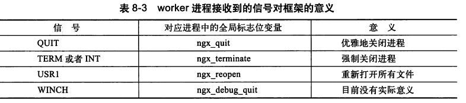
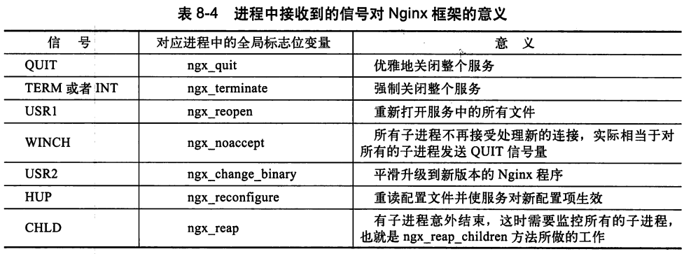
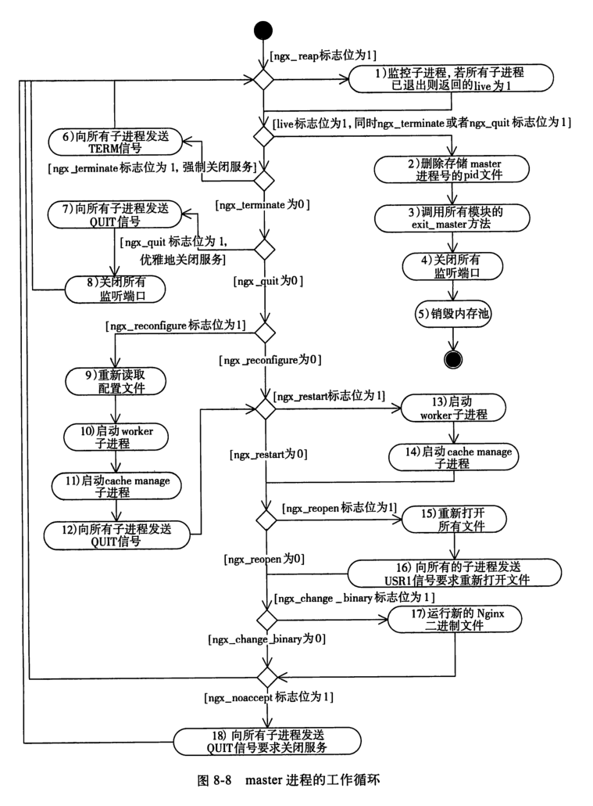
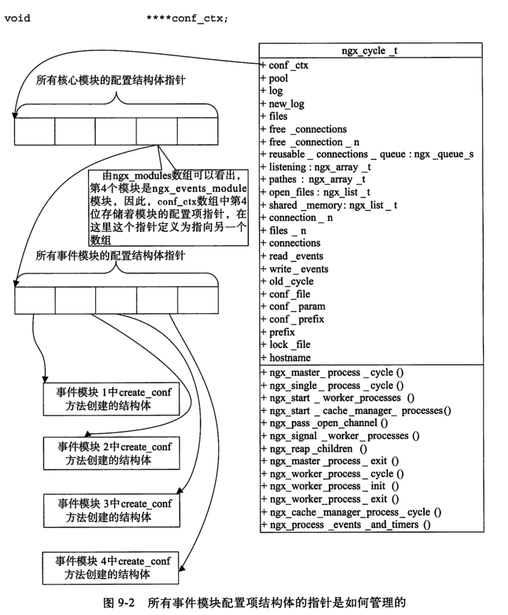
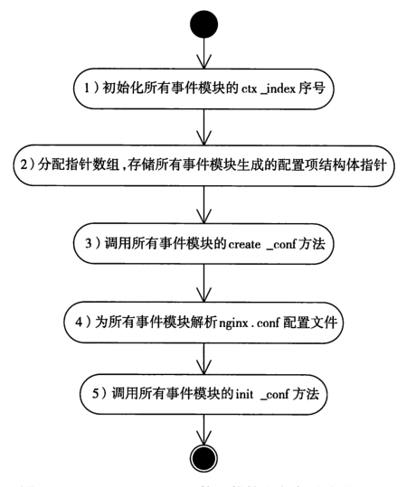
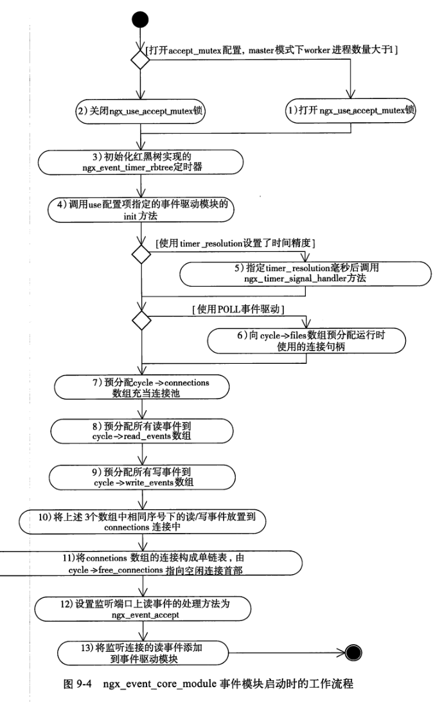
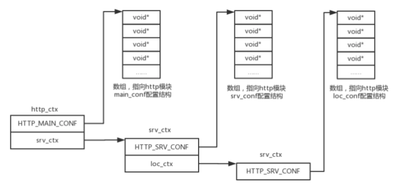

### Nginx启动

1. 调用 ngx_get_options() 解析命令参数；
2. 调用 ngx_time_init() 初始化并更新时间；
3. 调用 ngx_log_init() 初始化日志；
4. 创建全局变量 init_cycle 的内存池 pool；
5. 调用 ngx_save_argv() 保存命令行参数至全局变量ngx_os_argv、ngx_argc、ngx_argv 中；
6. 调用 ngx_process_options() 初始化 init_cycle 的 prefix, conf_prefix, conf_file, conf_param 等字段；
7. 调用 ngx_os_init() 初始化系统相关变量；
8. 调用 ngx_crc32_table_init() 初始化CRC表；
9. 调用 ngx_add_inherited_sockets() 继承 sockets；
10. 通过环境变量 NGINX 完成 socket 的继承，将其保存在全局变量 init_cycle 的 listening 数组中；
11. 初始化每个模块 module 的index，并计算 ngx_max_module；
12. 调用 ngx_init_cycle() 进行初始化全局变量 init_cycle，这个步骤非常重要；
13. 调用 ngx_signal_process() 处理进程信号；
14. 调用 ngx_init_signals() 注册相关信号；
15. 调用 ngx_create_pidfile() 创建进程 ID 记录文件；
16. 进入进程处理：单进程工作模式；多进程工作模式，即 master-worker 多进程工作模式；

#### Nginx的核心结构体ngx_cycle_t

Nginx核心的结构体是ngx_cycle_t, master管理进程, worker工作进程都拥有一个ngx_cycle_t结构体。服务在初始化时就以ngx_cycle_t对象为中心提供服务, 正常运行时仍然以ngx_cycle_t对象为中心。

ngx_cycle_t 结构全局变量初始化过程如下：
1. 更新时区与时间；
2. 创建内存池；
3. 分配 ngx_cycle_t 结构体内存，创建该结构的变量 cycle 并初始化；
4. 遍历所有 core模块，并调用该模块的 create_conf() 函数；
5. 配置文件解析；
6. 遍历所有core模块，并调用core模块的init_conf()函数；
7. 遍历 open_files 链表中的每一个文件并打开；
8. 创建新的共享内存并初始化；
9. 遍历 listening 数组并打开所有侦听；
10. 提交新的 cycle 配置，并调用所有模块的init_module；
11. 关闭或删除不被使用的在 old_cycle 中的资源：
12. 释放多余的共享内存；
13. 关闭多余的侦听 sockets；关闭多余的打开文件；

ngx_listening_t存储监听有关的信息，ngx_connection_t存储连接有关的信息和读写事件，而ngx_cycle_t这个结构体是核心结构体

ngx_cycle_t对象中有个动态成员叫做listening, 它的每个数组元素都是ngx_listening_t结构体, 每个ngx_listening_t结构体代表着Nginx服务器监听的一个端口

<!-- more -->

```cpp
typedef struct ngx_listening_s ngx_listening_t;
struct ngx_listening_s {
  ngx_socket_t fd;  // 套接字
  struct sockaddr *sockaddr;
  socklen_t socklen;
  int type; // 套接字类型,
  int backlog;  // TCP监听的backlog队列, 表示正在连接进程的最大个数
  int rcvbuf; // 接收缓冲区大小
  int sndbuf;

  ngx_connection_handler_pt nandler;  // 新的TCP连接成功建立后的处理方法

  size_t pool_size; // 内存池初始大小
  ngx_mesc_t  post_accept_timeout;  // 连接建立post_accept_timeout仍然没有收到用户数据, 则内核丢弃连接

  ngx_listening_t *previous;  // 由previous指针组成单向链表
  ngx_connection_t *connection; // 当前监听句柄对应着的ngx_connection_t结构体
  ...
};

// 连接建立成功回调方法handler
typedef void (*ngx_connection_handler_pt) (ngx_connection_t *c);
```

Nginx框架是围绕着ngx_cycle_t结构体来控制进程运行的, ngx_cycle_t结构体的prefix, conf_prefix, conf_file等成员保存Nginx配置文件的路径。Nginx的可配置性完全依赖于nginx.conf文件。有了配置文件, Nginx框架会根据配置项来加载所有的模块, 这一步骤会在ngx_init_cycle方法中进行。
```cpp
typedef struct ngx_cycle_s ngx_cycle_t;
/* ngx_cycle_t 全局变量数据结构 */
struct ngx_cycle_s {
    /*
     * 保存所有模块配置项的结构体指针，该数组每个成员又是一个指针，
     * 这个指针又指向存储指针的数组
     */
    void                  **conf_ctx; /* 所有模块配置上下文的数组 */
    ngx_pool_t               *pool;     /* 内存池 */

    ngx_log_t                *log;      /* 日志 */
    ngx_log_t                 new_log;

    ngx_uint_t                log_use_stderr;  /* unsigned  log_use_stderr:1; */

    ngx_connection_t        **files;    /* 连接文件 */
    ngx_connection_t         *free_connections; /* 空闲连接 */
    ngx_uint_t                free_connection_n;/* 空闲连接的个数 */

    /* 可再利用的连接队列 */
    ngx_queue_t               reusable_connections_queue;

    ngx_array_t               listening;    /* 监听数组 */
    ngx_array_t               paths;        /* 路径数组 */
    ngx_list_t                open_files;   /* 已打开文件的链表 */
    ngx_list_t                shared_memory;/* 共享内存链表 */

    ngx_uint_t                connection_n; /* 已连接个数 */
    ngx_uint_t                files_n;      /* 已打开文件的个数 */

    ngx_connection_t         *connections;  /* 连接 */
    ngx_event_t              *read_events;  /* 读事件 */
    ngx_event_t              *write_events; /* 写事件 */

    /* old 的 ngx_cycle_t 对象，用于引用前一个 ngx_cycle_t 对象的成员 */
    ngx_cycle_t              *old_cycle;

    ngx_str_t                 conf_file;    /* nginx 配置文件 */
    ngx_str_t                 conf_param;   /* nginx 处理配置文件时需要特殊处理的，在命令行携带的参数 */
    ngx_str_t                 conf_prefix;  /* nginx 配置文件的路径 */
    ngx_str_t                 prefix;       /* nginx 安装路径 */
    ngx_str_t                 lock_file;    /* 加锁文件 */
    ngx_str_t                 hostname;     /* 主机名 */
};
```


1. 在Nginx启动时, 首先会解析命令行, 处理各种参数。根据配置文件nginx.conf, 这时候会创建临时的ngx_cycle_t类型变量, 用它的成员储存配置文件路径
2. 调用核心模块的init_conf方法, 调用所有模块的init_process方法启动相应的进程执行。
3. 调用所有模块的init_module方法, init_process方法。master进程启动工作完成. worker进程进入ngx_worker_process_cycle工作循环。

#### 配置解析

配置解析接口大概可分为两个阶段：准备数据阶段和配置解析阶段.

准备数据阶段包括：准备内存；准备错误日志；准备所需数据结构。配置解析阶段是调用函数
```cpp
/* 配置文件解析 */  
if (ngx_conf_param(&conf) != NGX_CONF_OK) {/* 带有命令行参数'-g' 加入的配置 */  
    environ = senv;  
    ngx_destroy_cycle_pools(&conf);  
    return NULL;  
}  

if (ngx_conf_parse(&conf, &cycle->conf_file) != NGX_CONF_OK) {/* 解析配置文件*/  
    environ = senv;  
    ngx_destroy_cycle_pools(&conf);  
    return NULL;  
}  
```

ngx_conf_t 结构体用于 Nginx 在解析配置文件时描述每个指令的属性
```cpp
/* 解析配置时所使用的结构体 */
struct ngx_conf_s {
    char                 *name;     /* 当前解析到的指令 */
    ngx_array_t          *args;     /* 当前指令所包含的所有参数 */

    ngx_cycle_t          *cycle;    /* 待解析的全局变量ngx_cycle_t */
    ngx_pool_t           *pool;     /* 内存池 */
    ngx_pool_t           *temp_pool;/* 临时内存池，分配一些临时数组或变量 */
    ngx_conf_file_t      *conf_file;/* 待解析的配置文件 */
    ngx_log_t            *log;      /* 日志信息 */

    void                 *ctx;      /* 描述指令的上下文 */
    ngx_uint_t            module_type;/* 当前解析的指令的模块类型 */
    ngx_uint_t            cmd_type; /* 当前解析的指令的指令类型 */

    ngx_conf_handler_pt   handler;  /* 模块自定义的handler，即指令自定义的处理函数 */
    char                 *handler_conf;/* 自定义处理函数需要的相关配置 */
};
```

解析函数分为两个阶段：语法分析和 指令解析。语法分析由 ngx_conf_read_token()函数完成。指令解析有两种方式：一种是Nginx 内建的指令解析机制；另一种是自定义的指令解析机制。


#### worker和master进程工作

master控制worker进程的进程间通信方式, 例如通知worker进程停止服务或者更换日志文件。Nginx采用的是信号。worker进程会有ngx_singal_handler方法处理信号。
```cpp
void ngx_signal_handler(int signo);
// 会关注以下4个全局标志位
sig_atomic_t ngx_terminate
sig_atomic_t ngx_quit
ngx_uint_t ngx_exiting
sig_atomic_t ngx_reopen
```




master进程不需要处理网络事件, 它不负责业务的执行, 只会通过管理worker等子进程实现重启服务, 平滑升级, 配置文件实时生效等功能。

它会通过检查7个标志位来决定ngx_master_process_cycle方法的运行
```cpp
sig_atomic_t ngx_reap;
sig_atomic_t ngx_terminate;
sig_atomic_t ngx_quit;
sig_atomic_t ngx_reconfigure;
sig_atomic_t ngx_reopen;
sig_atomic_t ngx_change_binary;
sig_atomic_t ngx_noaccept;
```



master进程管理子进程的数据结构是一个ngx_processes数组
```cpp
#define NGX_MAX_PROCESSES 1024
ngx_int_t ngx_process_slot; // 当前操作的进程在ngx_processes数组的下标
ngx_int_t ngx_last_process;
ngx_process_t ngx_processes[NGX_MAX_PROCESSES];

typedef struct {
  ngx_pid_t pid;
  int status;
  ngx_socket_t channel[2]; // 该socket句柄用于master和worker通信
  ngx_spawn_process_pt proc; // 父进程生成子进程时使用
  void *data;
  char* name; // 操作系统显示的进程名称

  unsigned respawn:1; // 标志位, 为1表示在重新生成子进程
  unsigned detached:1; // 标志位, 为1表示在进行父, 子进程分离
  unsigned exiting:1; // 标志位, 为1表示进程正在退出
  unsigned exited:1; // 标志位, 为1表示进程已经退出
} ngx_process_t;
```

spawn_process方法封装了fork系统调用, 并且会从ngx_processes数组中选择一个还未使用的ngx_process_t元素存储这个子进程的相关信息。
```cpp
ngx_pid_t ngx_spawn_process(ngx_cycle_t *cycle, ngx_spawn_proc_pt proc, void *data, char *name, ngx_int_t respawn)

// ngx_spawn_proc_pt的定义
typedef void (*ngx_spawn_proc_pt) (ngx_cycle_t *cycle, void *data);
```

上面proc函数指针就是子进程中将要进行的工作循环



### 事件模块

事件处理框架所要解决的问题是如何收集, 管理, 分发事件。这里的事件主要以网络事件和定时器事件为主, 网络事件又以TCP网络事件为主。

由于网络事件驱动与操作系统有关, 为了跨平台, Nginx做法如下
1. 定义了一个核心模块ngx_events_module, Nginx在启动时调用ngx_init_cycle方法解析配置项, 一旦在nginx.conf配置文件中找到ngx_events_module感兴趣的events{}配置项, ngx_events_module开始工作, 它的作用就是为事件模块解析events{}的配置项, 管理储存配置项的结构体。
2. Nginx定义了重要的事件模块ngx_event_core_module, 这个模块决定使用哪种事件驱动机制, 以及如何管理事件。
3. 最后定义了一系列(9个)运行在不同操作系统的事件驱动模块, 包括ngx_epoll_module, mgx_kqueue_module等, ngx_event_core_module将选择一个作用Nginx进程的事件驱动模块。

事件模块的通用接口是ngx_event_module_t结构体
```cpp
typedef struct {
  ngx_str_t *name;
  void *(*create_conf)(ngx_cycle_t *cycle); // 创建存储配置项参数的结构体, 返回值为void*
  char* (*init_conf) (ngx_cycle_t *cycle, void* conf); // 解析配置项完成后init_conf被调用综合处理
  ngx_event_action_t  actions;  // 对于事件驱动机制, 每个事件模块都要实现的10个抽象方法
} ngx_event_module_t;
```

ngx_event_action_t类型的10个抽象方法
```cpp
typedef struct {
  ngx_int_t (*add) (ngx_event_t* ev, ngx_int_t event, ngx_uint_t flags); //添加事件方法
  ngx_int_t (*del) (ngx_event_t* ev, ngx_int_t event, ngx_uint_t flags);  // 删除事件方法

  ngx_int_t (*add_conn) (ngx_connection_t* c);  // 向事件驱动机制添加新连接, 说明连接上的读写事件, fd都添加到事件驱动机制中
  ngx_int_t (*del_conn) (ngx_connection_t *c, ngx_uint_t flags);

  ngx_int_t (*process_events) (ngx_cycle_t* cycle, ngx_msec_t timer, ngx_uint_t flags); // 正常工作循环中将调用process_events方法处理事件

  ngx_int_t (*init) (ngx_cycle_t* cycle, ngx_msec_t timer); // 初始化事件驱动办法
  void (*done) (ngx_cycle_t *cycle);  // 退出事件驱动的办法
} ngx_event_actions_t;
```


#### 事件
事件结构体ngx_event_t定义了事件
```cpp
typedef struct ngx_event_s ngx_event_t;
struct ngx_event_s {
  void *data;  // 事件相关的对象, 通常data都是指向ngx_connection_连接对象
  unsigned write:1; // 1表示事件可写
  unsigned accept:1; // 为1表示此事件可以建立新的连接
  unsigned instance:1; // 事件是否为过期的
  unsigned active:1; // 是否活跃事件
  unsigned disabled:1; // 是否禁用事件
  unsigned ready:1; // 1表示就绪事件
  unsigned eof:1; // 为1表示当前处理的字符流结束
  unsigned error:1; // 1表示事件处理过程出现错误
  unsigned timeout:1; // 为1表示超时
  unsigned timer_set:1; // 1表示事件存在于定时器中

  ngx_event_handler_pt handler; // 事件发生时的处理方法, 每个事件消费模块都会重新实现它

  ngx_log_t *log; // 可用于记录error_log日志的ngx_log_t对象
  ngx_rbtree_node_t timer;  // 定时器节点, 用于定时器红黑树中

  ngx_event_t *next;
  ngx_event_t **prev;
};
```

ngx_handle_read_event方法会将读事件添加到事件驱动模块中, 这样该事件对应的TCP连接一旦出现可读事件(如接收到TCP连接另一端发送来的字符流)就会回调事件的handler方法。(相当于epoll_ctl了)。同样的ngx_handle_write_event会将写事件添加到事件驱动模块(epoll)中。
```cpp
ngx_int_t ngx_handle_read_event(ngx_event_t *rev, ngx_uint_t flags);
// rev是要操作的事件, flags指定驱动方式, 0表示边缘触发, NGX_CLOSE_EVENT表示LT
```

#### 连接connection
作为Web服务器, 每一个用户请求至少对应着一个TCP连接, 为了及时处理这个连接, 至少需要一个读事件和一个写事件, 使得epoll可以有效地根据触发地事件调度响应模块读取请求或者发送响应。Nginx定义了ngx_connection_t表示连接, 这个连接表示是客户端主动发起的, Nginx服务器被动接受的TCP连接, 可以称之为被动连接。

当Nginx主动向其他上游服务器建立连接并试图通信, 这样的连接用ngx_peer_connection_t表示主动连接。主义连接结构体封装了fd和读写事件

```cpp
typedef struct ngx_connection_s ngx_connection_t;
struct ngx_connection_s {
  void  *data; // 连接未使用时data充当空闲链表的next指针; 连接被使用时意义与模块有关, 例如http框架中data指向ngx_http_request_t

  ngx_event_t *read;  // 连接对应的读事件
  ngx_event_t *write; // 连接对应的写事件

  ngx_socket_t fd;  // 套接字句柄

  ngx_recv_pt recv; // 接收网络字符流
  ngx_send_pt send; // 发送网络字符流

  ngx_listening_t *listening; // 指向ngx_listening_t监听对象
  off_t send; // 连接上已经发送出去的字节数
  ngx_log_t *log; // 可以记录日志的ngx_log_t对象

  ngx_pool_t *pool; // 内存池, 一般accept一个新连接时会创建一个内存池, 连接结束时会销毁内存池
  
  struct sockaddr *sockaddr;  // 连接客户端的sockaddr结构体
  socklen_t socklen;  // sockaddr结构体的长度

  ngx_buf_t *buffer;  // 接收, 缓存客户端发来的字符流
  ngx_queue_t queue; // 将当前连接以双向链表元素形式添加到ngx_cycle_t核心结构体双向链表中

  ngx_atomic_uint_t number; // 连接使用次数
  ngx_uint_t requests;  // 处理的请求次数

  // 缓存的业务类型
  #define NGX_SSL_BUFFERED  0x01;
  #define NGX_HTTP_LOWLEVEL_BUFFERED  0xf0;
  #define NGX_HTTP_WRITE_BUFFERED 0x10;
  #define NGX_HTTP_GZIP_BUFFERED 0x20;
  ...

  // 记录日志的级别
  typedef enum {
    NGX_ERROR_ALERT = 0,
    NGX_ERROR_ERR,
    NGX_ERROR_INFO,
    NGX_ERROR_IGNORE_ECONNRESET,
    NGX_ERROR_IGNORE_EINVAL
  } ngx_connection_log_error_e;

  unsigned error:1; // 1表示连接处理过程出现错误
  unsigned close:1;
};

typedef ssize_t (*ngx_recv_pt) (ngx_connection_t *c, u_char *buf, size_t size);
typedef ssize_t (*ngx_send_pt) (ngx_connection_t *c, u_char *buf, size_t size);
```

主动连接用ngx_peer_connection_t 结构体表示
```cpp
typedef struct ngx_peer_connection_s ngx_peer_connection_t;

typedef ngx_int_t (*ngx_event_get_peer_pt) (ngx_peer_connection_t *pc, void *data); // 使用长连接与上游服务器通信时用该方法获取一个新连接

typedef void (*ngx_event_free_peer_pt) (ngx_peer_connection_t *pc, void *data, ngx_uint_t state); // 将使用完毕的连接释放给连接词

struct ngx_peer_connection_s {
  ngx_connection_t *connection; // 具有ngx_connection_t的大部分成员
  struct sockaddr *sockaddr;  // 远端服务器的socket地址
  socklen_t socklen;
  ngx_str_t *name; // 远端服务器名称
  ngx_uint_t tries; // 最多失败次数

  ngx_event_get_peer_pt get; // 获取连接的方法,
  ngx_event_free_peer_t free; // 释放连接的办法
  void *data; // 用于传递参数

  ngx_addr_t *local; // 本机地址信息
  int rcvbuf; // 套接字接收缓冲区大小
  ngx_log_t *log; // 记录日志的ngx_log_t对象
};
```

#### 连接池
ngx_connection_t连接池, Nginx接受客户端的连接时所使用。ngx_connection_t结构体都是在启动阶段就预分配好的, 使用时从连接池中获取即可。

在ngx_cycle_t的connections和free_connections两个成员构成了一个连接池, 其中connections指向整个连接池数组的首部, free_connections指向第一个ngx_connection_t空闲连接。所有的空闲连接都以data成员作为next指针串联成一个单链表。一旦有用户发起连接就从这个free_connections指向的链表头获取一个空闲的连接, 归还连接只需要把连接插入到free_connections链表头即可。


#### 事件模块

ngx_event_module是事件的核心模块, 定义一个Nginx就是在实现ngx_module_t结构体, ngx_event_module也不例外
```cpp
static ngx_command_t ngx_events_commands[] = {
  {
    ngx_string("events"),
    NGX_MAIN_CONF|NGX_CONF_BLOCK|NGX_CONF_NOARGS,
    ngx_events_block,
    0,
    0,
    NULL
  },
  ngx_null_command
};
```

ngx_cycle_t结构体存有所有核心模块的配置结构体

注意conf_ctx是四重指针, 因为首先它指向一个存放指针的数组(二重), 这个数组的指针同时指向了另外的存放指针的数组。

加载ngx_events_module事件模块的过程


ngx_event_core_module模块是一个事件模块, 它会优先于其他事件模块执行。首先看它对哪些配置项感兴趣
```cpp
static ngx_command_t ngx_event_core_commands[] {
  {
    ngx_string("worker_connections"),
    NGX_EVENT_CONF|NGX_CONF_TAKE1,
    ngx_events_connections, // 连接池的大小, 也就是每个worker进程支持的最大连接数(在配置文件中设置)
    0,
    0,
    NULL
  },
  {
    ngx_string("use"),  // 使用哪个模块作为事件驱动机制
    NGX_EVENT_CONF|NGX_CONF_TAKE1,
    ngx_event_use,
    0,
    0,
    NULL
  },
  {
    ngx_string("debug_connection"), // debug级别的调试日志
    NGX_EVENT_CONF|NGX_CONF_TAKE1,
    ngx_event_debug_connection,
    0,
    0,
    NULL
  }
};
```

用于存储配置项的参数ngx_event_conf_t
```cpp
typedef struct {
  ngx_uint_t  connections;  // 连接池大小
  ngx_uint_t use; // 选用的事件模块在所有事件模块的编号
  ngx_flag_t  multi_accept; // 标志位，如果为1将一次性建立更多连接(而不是优先处理)
  ngx_flag_t accept_mutex;  // 启动负载均衡锁
  uchar* name; // 时间模块的名字
} ngx_event_conf_t;
```

对于每个事件模块都要实现的ngx_event_module_t接口, ngx_event_core_module只实现了create_conf方法和init_conf方法, 因为它不真正负责TCP网络事件驱动, 所以不实现ngx_event_actions_t中的办法
```cpp
static ngx_str_t  event_core_name = ngx_string("event_core");
ngx_event_module_t ngx_event_core_module_ctx = {
  &event_core_name,
  ngx_event_create_conf,
  ngx_event_init_conf
};
```

ngx_event_core_module功能主要是初始化红黑树定时器, 连接池组成单链表, 将监听连接的读事件注册到事件驱动模块中



### epoll事件驱动模块


#### epoll
这样的场景, 有100万个用户同时与一个进程保持着TCP连接, 但每个时刻只有几十个或几百个TCP连接是活跃的(接收到TCP包), 同一时刻, 进程只需要处理者100万连接中的一小部分连接。epoll的事件驱动可以支持这样的场景, 因为它不需要遍历这100万个连接, 相比之下select和poll只能处理几千个连接。

某进程调用epoll_create方法时, Linux内核会创建一个eventpoll结构体, 这个结构体有两个成员密切相关
```cpp
struct eventpoll {
  struct rb_root rbr; // 红黑树根节点, 存储所有添加到epoll的事件
  struct list_head rdllist; // 双向链表保存通过epoll_wait返回给用户满足条件的事件
}
```


所有添加到epoll中的事件都会与设备驱动程序建立回调关系, 回调方法在内核中称为ep_poll_callback, 它会满足条件的事件放到上面的rdllist双向链表中。在epoll中每个事件会建立一个epitem结构体
```cpp
struct epitem {
  struct rb_node rbn; // 红黑树节点
  struct list_head rdllink; // 双向链表节点
  struct epoll_filefd ffd;  // 事件句柄信息
  struct eventpoll *ep; // 指向所属的eventpoll对象
  struct epoll_event event; // 期待的事件类型
};
```

当调用epoll_wait检查是否有发生事件的连接时, 只是检查eventpoll对象中的rdllist双向链表是否有epitem元素而已, 如果rdllist不为空, 则把这里的事件复制到用户态内存中, 同时将事件数量返回给用户。因为使用epoll_wait监听事件效率特别高。而使用epoll_ctl向红黑树添加，修改，删除事件时，从rbr红黑树查找事件也非常快。

使用epoll
```cpp
int epoll_create(int size); // 返回一个句柄, 之后epoll的使用都依靠这个句柄来标识, size没有意义
int epoll_ctl(int epfd, int op, int fd, struct epoll_event* event

int epoll_wait(int epfd, struct epoll_event* events, int maxevents, int timeout);
// maxevents可以返回的最大事件个数
```

epoll_ctl添加, 修改或删除感兴趣的事件, 返回0表示成功,-1表示失败(根据errno判断错误类型)。op参数的意义如下
```
op的取值    意义
EPOLL_CTL_ADD   添加新的事件到epoll中
EPOLL_CTL_MOD   修改epoll中的事件
EPOLL_CTL_DEL   删除epoll中的事件
```
fd是连接套接字, event表示一个感兴趣的事件，它用到了epoll_event结构体。上文提到epoll为每个事件创建epitem结构体,而epitem中有一个epoll_event类型的event成员
```cpp
struct epoll_event {
  __uint32_t events;
  epoll_data_t data;
};
```

events的取值
```
EPOLLIN 表示对应的连接有数据可读, 也可表示远端主动关闭连接因为需要处理FIN包

EPOLLOUT 表示对应的连接可以可以写入数据发送, 主动发起非阻塞的TCP连接, 连接建立成功也相当于可写事件

EPOLLRDHUP  表示TCP连接的远端关闭或半关闭事件

EPOLLPRI  表示对应的连接上有紧急数据需要读

EPOLLERR  对应的连接发生错误

EPOLLHUP  对应的连接被挂起

EPOLLET 将触发方式设置为边缘触发ET, 系统默认为水平触发
```

data成员是一个epoll_data联合体, 可以有不同使用方式。例如ngx_epoll_mudule模块只使用了联合体的ptr成员, 作为指向ngx_connection_t连接的指针
```cpp
typedef union epoll_data {
  void  *ptr;
  int fd;
  uint32_t u32;
  uint64_t u64;
} epoll_data_t;
```

epoll有两种工作模式,LT和ET, 默认是LT模式, 可以处理阻塞和非阻塞套接字。ET效率比LT高, 但只支持非阻塞套接字。ET模式下如果没有彻底地将换冲突数据处理完, 会导致缓冲区的用户请求得不到响应。默认情况下Nginx通过ET模式使用epoll

#### ngx_epoll_module

ngx_epoll_module对哪些配置项感兴趣
```cpp
static ngx_command_t ngx_epoll_commands[] = {
  {
    ngx_string("epoll_events"), // 一次性最多返回多少事件
    NGX_EVENT_CONF|NGX_CONF_TAKE1,
    ngx_conf_set_num_slot,
    0,
    offsetof(ngx_epoll_conf_t, events),
    NULL
  }
};

// 存储配置项结构体
typedef struct {
  ngx_uint_t events;
  ngx_uint_t aio_requests;
} ngx_epoll_conf_t;
```

epoll如何定义ngx_event_module_t事件模块接口的
```cpp
static ngx_str_t epoll_name = ngx_string("epoll");

ngx_event_module_t ngx_epoll_module_ctx = {
  &epoll_name,
  ngx_epoll_create_conf,
  ngx_epoll_init_conf,
  {
    ngx_epoll_add_event,  // 对应ngx_event_actions_t的add方法
    ngx_epoll_del_event,  
    ...
    ngx_epoll_process_events,
    ngx_epoll_init,
    ngx_epoll_done,
  }
};
```

ngx_epoll_init方法主要做了两件事
1. 调用epoll_create方法创建epoll对象, 
2. 创建event_list数组, 用于进行epoll_wait调用时传递内核态的事件

```cpp
static int ep = -1;
static struct epoll_event *event_list;
static ngx_uint_t nevents;  // 最大返回的事件数

static ngx_int_t ngx_epoll_init(ngx_cycle_t *cycle, ngx_msec_t timer) {
  ngx_epoll_conf_t  *epcf;
  epcf = ngx_event_get_conf(cycle->conf_ctx, ngx_epoll_module);

  if (ep == -1) {
    ep = epoll_create(cycle->connection_n/2);  // 用cycle可以得到模块的参数
    if (ep == -1)
      ...
  }
  if (nevents < epcf->events) {
    if (event_list) {
      ngx_free(event_list);
    }
    event_list = ngx_alloc(sizeof(struct epoll_event) * epcf->events, cycle->log);
    if (event_list == NULL)
      return NGX_ERROR;
  }

  nevents = epcf->events;
  ...
  return NGX_OK;
}

static ngx_int_t ngx_epoll_add(ngx_event_t *ev, ngx_int_t event, ngx_uint_t flags) {
  int   op;
  uint32_t  events, prev;
  ngx_event_t *e;
  ngx_connection_t  *c;
  struct epoll_event  ee;

  c = ev->data;
  events = (uint32_t) event;

  if (e->active) {
    op = EPOLL_CTL_MOD;
  } else {
    op = EPOLL_CTL_ADD;
  }

  ee.events = events | (uint32_t) flags;
  ee.data.ptr = (void* ) ((uintptr_t) c | ev->instance);

  if (epoll_ctl(ep, op, c->fd, &ee) == -1) {
    ngx_log_error(NGX_LOG_ALERT, ev->log, ngx_errno, "epoll_ctl(%d, %d) failed", op, c->fd);
    return NGX_ERROR;
  }

  ev->active = 1;
  return NGX_OK;
}

static ngx_int_t ngx_epoll_process_events(ngx_cycle_t* cycle, ngx_msec_t timer, ngx_uint_t flags) {
  int events;
  uint32_t  revents;
  ngx_int_t instance, t;
  ngx_event_t *rev, *wev, **queue;
  ngx_connection_t *c;

  events = epoll_wait(ep, event_list, (int)nevents, timer);

  if (flag & NGX_UPDATE_TIME || ngx_event_timer_alarm) {
    ngx_time_update();  // 要更新时间
  }

  for (i = 0; i < events; i++) {
    c = events_list[i].data.pre;
    instance = (uintptr_t) c & 1;

    rev = c->read;  // 去除读事件
    if (c->fd == -1 || rev->instance != instance) { // rev->instance != instance说明事件过期了
        continue;
    }
    revent = event_list[i].events;  //事件类型
    if ((revent & EPOLLIN) && rev.active) { // 读事件且活跃
      if (flag & NGX_POST_EVENTS) {
        queue = (ngx_event_t **) (rev->accept ? &ngx_posted_accept_events : &ngx_posted_events);
        ngx_locked_post_event(rev, queue);  // 将这个事件添加到相应的延后执行队列中
      } else {
        rev->handler(rev);  // 立即调用读事件的回调方法处理这个事件
      }
    }
    
    wev = c->write; // 取出写事件
    ...
  }
  return NGX_OK;
}
```

过期事件, 例如epoll_wait返回三个事件, 在处理第一个事件时关闭了一个连接, 该连接对应第三个事件, 因此第三个事件就是过期事件了。注意不能用fd来确定过期事件, 因此有可能新建了一个连接占用了原来关闭连接的fd, 这时候如果将第三个事件按照fd则归属于新建的连接了, 发生错误。Nginx解决办法是通过instance标志位, 当调用ngx_get_connection从连接池中获取新连接时instance标志位会置反, 这样如果发生连接复用, 前后连接的标志位是不同的(尽管fd相同)。
```cpp
// 从连接池获取一个连接
ngx_connection_t* ngx_get_connection(ngx_socket_t s, ngx_log_t* log) {
  ngx_connection_t* c;
  c = ngx_cycle->free_connections;

  rev = c->read;
  wev = c->write;

  instance = rev->instance;

  // instance标志位取反
  rev->instance = !instance;
  wev->instance = !instance;

  return c;
}
```

#### 定时器事件
定时器完全由Nginx实现, 与内核无关。Nginx的每个进程都会单独的管理当前时间
```cpp
typedef struct {
  time_t sec; // 格林威治时间, 从1970/1/1/0:0:0到现在的秒数
  ngx_uint_t msec;
  ngx_int_t gmtoff;
} ngx_time_t;
```


定时器是通过一棵红黑树实现的, 只需要将当前时间和红黑树第一个节点比较就能直到有没有触发超时, 如果没有也会直到最少还要多少毫秒触发超时。
```cpp
ngx_thread_volatile ngx_rbtree_t ngx_event_timer_rbtree;
static ngx_rbtree_node_t ngx_event_timer_sentinel;
```

#### 事件驱动的处理流程

建立新连接的函数, 它首先调用accept试图建立新连接, 同时设置负载均衡阈值ngx_accept_disabled, 这个阈值是进程允许的总连接数的1/8减去空闲连接数
```cpp
void ngx_event_accept(ngx_event_t *ev);
```


负载均衡阈值ngx_accept_disabled为进程允许的总连接数的1/8减去空闲连接数, 达到阈值时该worker进程会减少处理连接的机会, 其他空闲的进程有机会处理更多连接; 从连接池中获取一个ngx_connection_t连接对象, 并为pool指针建立内存池。将新连接对应的读事件添加到事件驱动模块中。epoll_wait收集到这个事件后自动调用可读回调方法。

当由一个用户向服务器发起了连接, 内核收到TCP的SYN包时, 会激活所有的休眠子进程。只有一个子进程可以执行accept建立连接, 而accept失败的子进程被内核唤醒是没有必要的, 这就是惊群问题。解决问题的基本思路是, 同一时刻只能由唯一一个worker子进程监听Web端口, 防止多个进程监听端口的惊群问题。

在打开accept_mutex锁的情况下, 只有调用ngx_trylock_accept_mutex方法, 当前的worker进程才会试着监听Web端口。如果没有获取到锁,进程只能处理已有的连接的事件, 而如果获取到锁, 即可处理已有的连接事件, 也可处理新连接的事件。

具体策略是, 将新连接事件放到ngx_posted_accept_events队列, 将普通事件放入ngx_posted_events队列。接下来处理ngx_posted_accept_event队列的事件, 处理完后释放ngx_accept_mutex锁, 再处理ngx_posted_events队列的事件。从而大大减少ngx_accept_mutex锁占用的时间。

当Nginx的worker子进程间的负载均衡仅在worker进程处理连接数达到最大连接数的7/8才会触发, 此时该进程不会调用ngx_trylock_accept_mutex试图获取锁处理新连接。

两个post事件队列, 双向链表的形式
```cpp
ngx_thread_volatile ngx_event_t *ngx_posted_accept_events;
ngx_thread_volatile ngx_event_t *ngx_posted_events;
```

循环调用`ngx_process_events_and_timers`方法就是处理所有的事件, 这是事件驱动的核心。该方法主要有三个功能
1. 调用process_events方法处理网络事件 
2. 处理两个post事件队列, post队列允许事件延后执行 
3. 处理定时器事件ngx_event_expire_timer()


#### 文件IO

Linux内核实现了文件异步I/O, 这时候在内核中成功地完成了磁盘操作, 内核才会通知进程, 进而使得磁盘文件的处理与网络事件的处理同样高效。

注意如果用户请求对文件的操作落到文件缓存而不是磁盘中, 不要使用异步I/O。因此目前Nginx只支持读取文件时使用异步I/O, 因为正常写入文件往往是写入到缓存中效率很高.

#### http框架

HTTP矿建大致由一个核心模块(ngx_http_module), 两个http模块(ngx_http_core_module, ngx_http_upstream_module)组成, nginx的http模块需要有以下基础性工作
1. 处理所有http{}块内的配置项, 管理每个HTTP模块感兴趣的配置项
2. HTTP框架需要有事件模块监听Web端口, 并处理新连接事件, 可读事件, 可写事件
3. HTTP框架需要有状态机分析接收到的TCP字符流是否维完整的HTTP包
4. 处理网络I/O(读取HTTP包体, 发送HTTP响应)和磁盘I/O
5. 提供了upstream机制帮助HTTP模块访问第三方服务
6. 提供subrequest机制帮助HTTP模块实现子请求。

nginx的各个模块组合，每个模块只实现一个特定的功能。比如限流功能由模块ngx_http_limit_conn_module或者模块实现ngx_http_limit_req_module；fastcgi转发功能由模块ngx_http_fastcgi_module实现；proxy转发功能由ngx_http_proxy_module(当然转发功能的实现还必须有模块ngx_http_upstream_module)。每个模块都有一个commands数组，存储该模块可以解析的所有配置指令。指令结构体由ngx_command_t定义：
```cpp
struct ngx_command_s {
    ngx_str_t             name;
    ngx_uint_t            type;
    char               *(*set)(ngx_conf_t *cf, ngx_command_t *cmd, void *conf);
    ngx_uint_t            conf;
    ngx_uint_t            offset;
    void                 *post;
};
```

每个模块都应该有个可以存储配置的结构体，该结构体通过模块上下文结构体的函数create_conf，create_main_conf，create_srv_conf或者create_loc_conf创建。这几个存储上下文结构体的模块是有互相联系的


将配置文件包含的称之为指令, 配置文件可以包含多条指令, 指令块同样可以包含多条指令。一些指令可以同时出现在http指令块、server指令块和location指令块。这样可以用|来表示, 即http块中的指令类型可以是NGX_HTTP_MAIN_CONF，也可以是NGX_HTTP_MAIN_CONF|NGX_HTTP_SRV_CONF。

解析配置的入口函数是ngx_conf_parse(ngx_conf_t cf, ngx_str_t filename)，其输入参数filename表示配置文件路径，如果为NULL表明此时解析的是指令块。
```cpp
struct ngx_conf_s {
    char                 *name; //当前读取到的指令名称
    ngx_array_t          *args; //当前读取到的指令参数
 
    ngx_cycle_t          *cycle; //指向全局cycle
    ngx_pool_t           *pool;  //内存池
    ngx_conf_file_t      *conf_file; //配置文件
 
    void                 *ctx;   //上下文
    ngx_uint_t            module_type; //模块类型
    ngx_uint_t            cmd_type;   //指令类型
 
    ngx_conf_handler_pt   handler; //一般都是NULL，暂时不管
};
```

函数ngx_init_cycle会调用ngx_conf_parse开始配置文件的解析。解析配置文件首先需要创建配置文件上下文，并初始化结构体ngx_conf_t；

ngx_events_module模块（核心模块）中定义了events指令结构
```cpp
{ ngx_string("events"),
  NGX_MAIN_CONF|NGX_CONF_BLOCK|NGX_CONF_NOARGS,
  ngx_events_block,
  0,
  0,
  NULL }
```

函数ngx_events_block主要需要处理3件事: 1创建events_ctx上下文; 2调用所有事件模块的create_conf方法创建配置结构; 3修改cf->ctx(注意解析events块时配置上下文会发生改变), cf->module_type 和cf->cmd_type 并调用ngx_conf_parse函数解析events块中的配置

每一个虚拟主机server{}配置块都由一个ngx_http_core_srv_conf_t结构体来标识, 这些ngx_http_core_srv_conf_t又是通过全局的ngx_http_core_main_conf_t结构中的server动态数组关联起来。当处理一个HTTP新连接时, 接收到HTTP头部并取到Host后, 需要遍历ngx_http_core_main_conf_t的server数组才能找到与server name配置项匹配的虚拟主机配置块。这个效率很低, 因为如果nginx.conf配置文件中存在数以百计的server{}块时, 查询效率就太低了。因此HTTP框架使用了散列表才存放虚拟主机, key是server name, value是ngx_http_core_srv_conf_t结构体的指针。

在查询到server块后, 必须遍历其下的所有location组成的双向链表才能找到与其URI匹配的Location配置块, 这时候采用静态二叉树加速查找。因为location是由nginx.conf中读取到的, 是静态不变的, 不存在运行过程中添加或者删除location的场景。这棵静态的二叉平衡查找树用ngx_http_location_tree_node_t结构体表示
```cpp
typedef struct ngx_http_location_tree_node_s ngx_http_location_tree_node_t

struct ngx_http_location_tree_node_s {
  ngx_http_location_tree_node_t *left;
  ngx_http_location_tree_node_t *right;
  ngx_http_location_tree_node_t *tree;

  ngx_http_core_loc_conf_t  *exact; // 完全匹配, exact指向对应的ngx_http_core_loc_conf_t结构体
  ngx_http_core_loc_conf_t  *inclusive; // 非完全匹配类型

  u_char  auto_redirect;  // 自动重定向
  u_char  len;  // name字符串的实际长度
  u_char  name[1];
};

```

### HTTP请求处理

Nginx将HTTP请求的处理过程分为多个阶段, 因Nginx的模块化设计使得每一个HTTP模块可以仅专注于一个独立、简单的功能, 而一个请求的完整处理过程可以由无数个HTTP模块共同合作完成。HTTP框架依据常见的处理流程将处理划分为11个阶段, 每个处理阶段都可以由任意多个HTTP模块流水式地处理请求。

当Nginx接收到用户发起TCP连接地请求时, 事件框架会负责把TCP连接建立起来。如果TCP连接成功建立, HTTP框架就会介入请求地处理。

读事件被触发时, 内核套接字缓冲区的大小未必足够接收到全部的HTTP请求行, 因此调用一次ngx_http_process_request_line方法不一定能够做完这些工作。因此解析请求行方法ngx_http_process_request_line方法不一定能够做完这项工作, 可能被epoll这个事件驱动多次调度, 反复接收到TCP流并使用状态机解析它们。


#### 有限状态机

FSM(finite-state machine)有限状态机, 表示有限个状态以及在这些状态之间的转移和动作等行为的数学模型。

FSM的3特点, 1. 一个时刻，只有一个状态; 2. 某种条件下，会从一种状态转变（transition）到另一种状态。(比如待支付的下个状态是支付成功) 3. 状态有限(finite)

FSM的四要素, 1. currentState(当前状态) 2. nextState(下一个状态) 3. transition(currentState,action)。当前状态和下个状态的关系。接收当前的状态，根据不同的action返回不同的nextState. 4. action.state变动的event

FSM明显用来表征字符串的处理, 当其获得一个输入字符时，将从当前状态转换到另一个状态，或者仍然保持在当前状态。事实上在编译的词法分析也用到了有限状态机, 它们都是字符流的处理。常用的是确定状态有限自动机 DFA, 非确定的有限状态自动机 NFA。


开始状态(状态1)只有出度没有入度, 结束状态(状态6)只有入度没有出度。


状态机来执行HTTP报文的解析, 主状态机用三种状态，标识解析位置。CHECK_STATE_REQUESTLINE，解析请求行; CHECK_STATE_HEADER，解析请求头; CHECK_STATE_CONTENT，解析消息体，仅用于解析POST请求。

另外还用到从状态机及时记录一行当前的解析状态, LINE_OK，完整读取一行
;LINE_BAD，报文语法有误;LINE_OPEN，读取的行不完整。

Nginx使用的完全无阻塞的事件驱动框架是难以编写功能复杂的模块的, 一个请求在处理一个TCP连接时将需要处理这个连接上的可读, 可写以及定时器事件, 而可读事件又包含连接建立成功, 连接关闭事件, 正常的可读事件在接收到HTTP的不同部分又要做不同处理。且如果一个请求需要同时与多个上游服务器打交道, 同时处理多个TCP连接, 那么要处理的事件太多了。Nginx解决办法是subrequest机制, 将一个复杂请求拆分成许多子请求, 而每个HTTP模块只需要关心一个请求, 不用掌握派生的所有子请求


释放TCP连接, ngx_http_close_connection是HTTP框架提供的一个用于释放TCP连接的方法, 


upstream机制与上游服务器是通过TCP建立连接的, 建立TCP连接需要三次握手, 三次握手消耗的时间是不可控的。为了保证建立TCP连接的操作不会阻塞进程, Nginx使用无阻塞的套接字来连接上游服务器。由于使用无阻塞套接字, 方法返回时与上游之间的TCP连接未必会成功建立, 可能还要等待上游服务器返回TCP的SYN/ACK包。因此, ngx_http_upstream_connect方法主要负责发起建立连接这个动作， 如果方法没有立刻返回成功, 那么需要在epoll中监控这个套接字, 当它出现可写事件时, 就说明连接已经建立成功了。


发送请求比较简单, 若一次没有发送完继续将写事件添加到定时器和epoll种从而继续触发。当发送完全部请求准备接收响应时, 将读事件添加到定时器中。

接收响应比较特殊, 首先应用层协议响应包可大可小, 最小的可以是128B, 最大堆可能达到5GB， 如果HTTP框架接收到全部响应再处理则可能引发OutOfMemory错误, 而如果磁盘文件中接收响应会带来大量I/O操作影响并发; 其次不一定要完全解析内容, 例如从Memcached服务器下载一幅图片Nginx只需要解析Memcached协议而不需要解析图片的内容, 对于图片内容Nginx只需要边接收边转发给客户端。

为了解决上述问题, 应用层协议通常会将请求和响应分成两部分: 包头和包体。包头相当于将不同的协议包之间的共同部分抽象出来, 而包体是否解析视业务需要而定。HTTP模块希望实现反向代理功能时大都不希望解析包体。

如果Nginx与上游服务器网速快(如内网)而与下游服务器慢, 可以尽可能将上游服务器响应接收到Nginx服务器上, 如果内存过大可以保存在磁盘文件中; 相反如果与上游服务器网速慢, 则可以开辟固定大小内容作为缓冲区, 一边接收上游响应一边向下游转发。

### Nginx的进程通信

Nginx选择了哪些方式来同步master进程和多个work进程间的数据, Nginx由一个master进程和多个worker进程组成, 期间并未创建线程

#### 共享内存

共享内存是Linux提供的最基本的进程间通信方法, 它通过mmap或者shmget系统调用在内存中创建一块连续的线性地址空间, 对应的通过munmap或者shmdt系统调用释放这块内存。

Nginx定义了ngx_shm_t结构体用于描述一块共享内存
```cpp
typedef struct {
  u_char  *addr;  // 指向共享内存的起始地址
  size_t  size; // 共享内存的长度
  ngx_str_t name; // 共享内存的名称
  ngx_log_t *log; // 记录日志的ngx_log_t对象
  ngx_uint_t  exists; // 共享内存是否分配过
} ngx_shm_t;
```

操作ngx_shm_t结构体的方法有两个, ngx_shm_alloc用于分配新的共享内存, 而ngx_shm_free用于释放已经存在的共享内存.

```cpp
void *mmap(void *start, size_t length, int prot, int flags, int fd, off_t offset);
```

mmap可以将磁盘文件映射到内存中, 直接操作内存Linux内核将负责同步内存和磁盘文件中的数据, fd参数就指向需要同步的磁盘文件, offset表示从文件偏移量开始共享。Nginx不需要映射文件, 因此flags参数可以是MAP_ANON表示不适用文件映射, fd和offset传入-1和0即可。

基于原子操作

#### Nginx通信

ngx_channel_t channel频道是Nginx master进程与worker进程之间通信的常用工具, 它使用本机套接字实现。
```cpp
// 用于创建父子进程间使用的套接字
int socketpair(int d, int type, int protocol, int sv[2])
```
ngx_channel_t是Nginx定义的master父进程与worker子进程间的消息格式
```cpp
typedef struct {
  ngx_uint_t command; // 传递的TCP消息的命令
  ngx_pid_t pid;  // 进程Pid,一般是发送方的进程ID
  ngx_int_t slot; // 表示发送方在ngx_processes进程数组间的序号
  ngx_fd_t; // 通信的套接字句柄
} ngx_channel_t;
``` 

信号传递进程间信息, 信号是一种非常短的消息, 短到只有一个数字
```cpp
typedef struct {
  int signo;  // 需要处理的信号
  char* signame;  // 信号对应的字符串名称
  char* name; // 信号对应的Nginx命令
  void (*handler) (int signo);  // 收到signo信号后就会回调Handler方法 
};
```