### http框架

HTTP框架大致由一个核心模块(ngx_http_module), 两个http模块(ngx_http_core_module, ngx_http_upstream_module)组成, nginx的http模块需要有以下基础性工作
1. 处理所有http{}块内的配置项, 允许http{}下出现多个server{}, location{}子配置块,管理每个HTTP模块感兴趣的配置项
2. HTTP框架需要有事件模块监听Web端口, 并处理新连接事件, 可读事件, 可写事件
3. HTTP框架需要有状态机分析接收到的TCP字符流是否为完整的HTTP包
4. 处理网络I/O(读取HTTP包体, 发送HTTP响应)和磁盘I/O
5. 提供了upstream机制帮助HTTP模块访问第三方服务
6. 提供subrequest机制帮助HTTP模块实现子请求。

http模块配置
```
http {
  mytest_num  1;
  server {
    server_name A;
    listen 127.0.0.1:8000;
    listen 80;

    mytest_num 2;

    location /L1 {
      mytest_num 3;
    }
  }
  ...
}
```

<!-- more -->

HTTP框架首要是通过调用ngx_http_module_t接口中的方法来管理所有HTTP模块的配置项。首先所有的location表达式会以静态二叉树组织起来, 以达到高效查询的目的。我们将直接隶属于http{}块内的配置项称为main配置项, 直接隶属于server块的称为srv配置项, 直接隶属于location{}块内的配置项称为loc配置项。

```cpp
typedef struct {
  ngx_int_t (*preconfiguration) (ngx_conf_t* cf); // 解析配置前回调
  ngx_int_t (*postconfiguration)(ngx_conf_t* cf); // 解析配置后回调

  void* (*create_main_conf)(ngx_conf_t* cf);  // 创建存储http全局配置项的结构体, 即直接隶属于http{}的main配置项
  char* (*init_main_conf)(ngx_conf_t* cf, void* conf);  // 解析完main配置回调
  void* (*create_srv_conf)(ngx_conf_t* cf); // 创建存储srv配置项的结构体
  char* (*merge_srv_conf)(ngx_conf_t* cf, void* prev, void* conf);  // 合并main和srv配置项
  void* (*create_loc_conf)(ngx_conf_t* cf); // 创建存储loc配置项的结构体
  char* (*merge_loc_conf)(ngx_conf_t* cf, void* prev, void* conf);  // 合并main,srv和loc配置项
} ngx_http_module_t;
// 解析配置文件时描述每个指令的属性
struct ngx_conf_s {
    char                 *name;
    ngx_array_t          *args;

    ngx_cycle_t          *cycle;
    ngx_pool_t           *pool;
    ngx_pool_t           *temp_pool;
    ngx_conf_file_t      *conf_file;
    ngx_l+og_t            *log;

    void                 *ctx;
    ngx_uint_t            module_type;
    ngx_uint_t            cmd_type;

    ngx_conf_handler_pt   handler;
    char                 *handler_conf;
};
```


#### 解析http配置项

存储配置项的结构体
```cpp
typedef struct {
  void** main_conf; // 指向一个指针数组, 数组的每个成员为由preconfiguration创建的存储http{}的结构体
  void** srv_conf;
  void** loc_conf;
} ngx_http_conf_ctx_t;
```

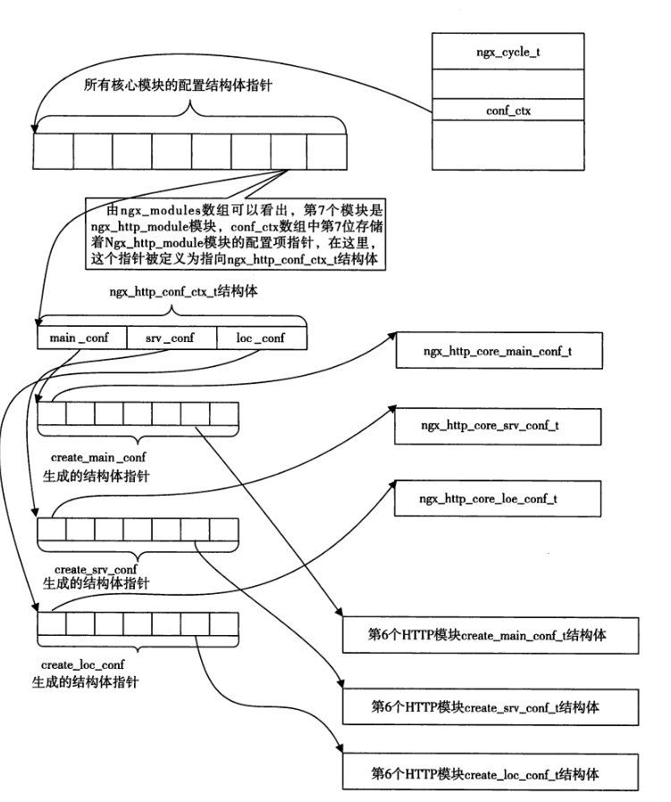


loc级别配置结构体
```cpp
struct ngx_http_core_loc_conf_s {
  ngx_str_t name;
  void **loc_conf;  // 指向指针数组, 保存所有create_loc_conf产生的结构体指针
  ngx_queue_t *locations; // 同一个server的多个location块的ngx_http_core_loc_conf_t结构体以双向链表形式组织, 而locations指向该双向链表
}
```

每一个虚拟主机server{}配置块都由一个ngx_http_core_srv_conf_t结构体来标识, 这些ngx_http_core_srv_conf_t又是通过全局的ngx_http_core_main_conf_t结构中的server动态数组关联起来。

当处理一个HTTP新连接时, 接收到HTTP头部并取到Host后, 需要遍历ngx_http_core_main_conf_t的server数组才能找到与server name配置项匹配的虚拟主机配置块。这个效率很低, 因为如果nginx.conf配置文件中存在数以百计的server{}块时, 查询效率就太低了。**因此HTTP框架使用了散列表存放虚拟主机**, key是server name, value是ngx_http_core_srv_conf_t结构体的指针, 即解析配置文件http-server得到的结构体。

在查询到server块后, 必须遍历其下的所有location组成的双向链表才能找到与其URI匹配的Location配置块, 这时候采用静态二叉树加速查找。因为location是由nginx.conf中读取到的, 是静态不变的, 不存在运行过程中添加或者删除location的场景。这棵静态的二叉平衡查找树用ngx_http_location_tree_node_t结构体表示

```cpp
typedef struct ngx_http_location_tree_node_s ngx_http_location_tree_node_t

struct ngx_http_location_tree_node_s {
  ngx_http_location_tree_node_t *left;
  ngx_http_location_tree_node_t *right;
  ngx_http_location_tree_node_t *tree;
  // ngx_http_core_loc_conf_t是解析location得到的结构体
  ngx_http_core_loc_conf_t  *exact; // 完全匹配, exact指向对应的ngx_http_core_loc_conf_t结构体
  ngx_http_core_loc_conf_t  *inclusive; // 非完全匹配类型

  u_char  auto_redirect;  // 自动重定向
  u_char  len;  // name字符串的实际长度
  u_char  name[1];
};

```

HTTP框架的初始化流程, 配置项解析存储结构体后会给到ngx_cycle_t中
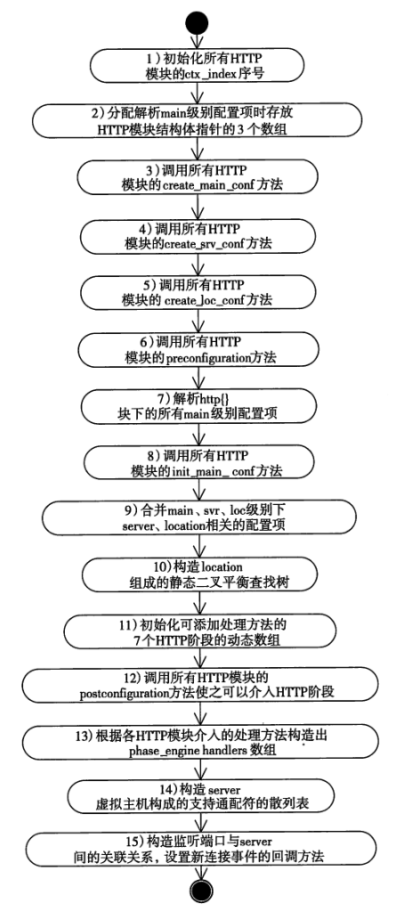

#### HTTP请求的处理

Nginx将HTTP请求的处理过程分为多个阶段, 因Nginx的模块化设计使得每一个HTTP模块可以仅专注于一个独立、简单的功能, 而一个请求的完整处理过程可以由无数个HTTP模块共同合作完成。HTTP框架依据常见的处理流程将处理划分为11个阶段, 每个处理阶段都可以由任意多个HTTP模块流水式地处理请求。

当Nginx接收到用户发起TCP连接地请求时, 事件框架会负责把TCP连接建立起来。如果TCP连接成功建立, HTTP框架就会介入请求地处理。HTTP框架动态执行的大致流程包括, 先于客户端建立TCP连接, 接收HTTP请求行、头部并解析它们的意义, 再根据nginx.conf配置文件找到一些HTTP模块合作处理这些请求。

对于TCP网络事件, 可粗略的分为可读事件和可写事件, 可读事件又可细分为收到SYN包带来的新连接事件, 收到FIN包带来的连接关闭事件, 以及套接字缓冲区真正收到TCP流。可写事件可能受到Nginx限流而未必发出响应。同时为了精确控制超时还需要把读/写事件放置到定时器中。

当TCP连接上第一次出现可读事件时, 将会调用ngx_http_init_request方法初始化这个HTTP请求。注意不会在建立连接时初始化请求，而是等到连接对应的套接字缓冲区收到了用户发来的请求内容。

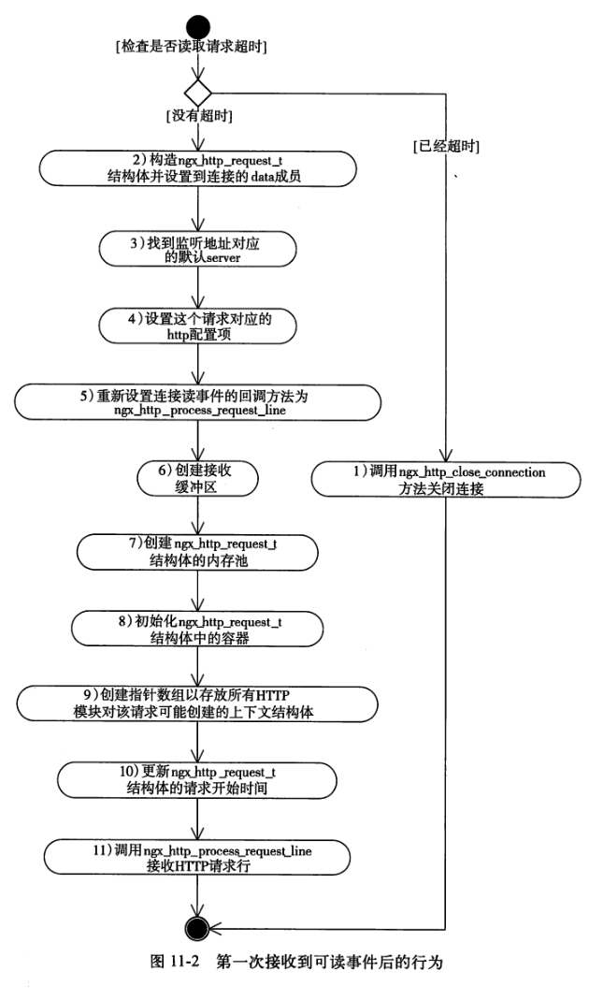

读事件被触发时, 内核套接字缓冲区的大小未必足够接收到全部的HTTP请求行, 因此调用一次ngx_http_process_request_line方法不一定能够做完这些工作。因此解析请求行方法ngx_http_process_request_line方法不一定能够做完这项工作, 可能被epoll这个事件驱动多次调度, 反复接收到TCP流并使用状态机解析它们。

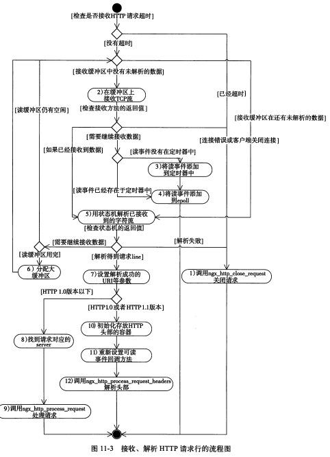

#### 有限状态机和解析头部

FSM(finite-state machine)有限状态机, 表示有限个状态以及在这些状态之间的转移和动作等行为的数学模型。

FSM的3特点, 1. 一个时刻，只有一个状态; 2. 某种条件下，会从一种状态转变（transition）到另一种状态。(比如待支付的下个状态是支付成功) 3. 状态有限(finite)

FSM的四要素, 1. currentState(当前状态) 2. nextState(下一个状态) 3. transition(currentState,action)。当前状态和下个状态的关系。接收当前的状态，根据不同的action返回不同的nextState. 4. action.state变动的event

FSM明显用来表征字符串的处理, 当其获得一个输入字符时，将从当前状态转换到另一个状态，或者仍然保持在当前状态。事实上在编译的词法分析也用到了有限状态机, 它们都是字符流的处理。常用的是确定状态有限自动机 DFA, 非确定的有限状态自动机 NFA。

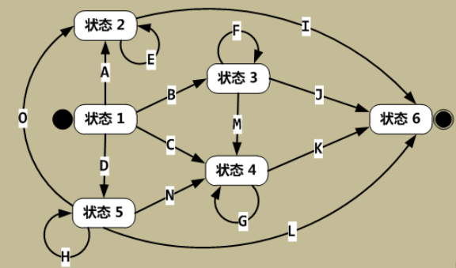
开始状态(状态1)只有出度没有入度, 结束状态(状态6)只有入度没有出度。


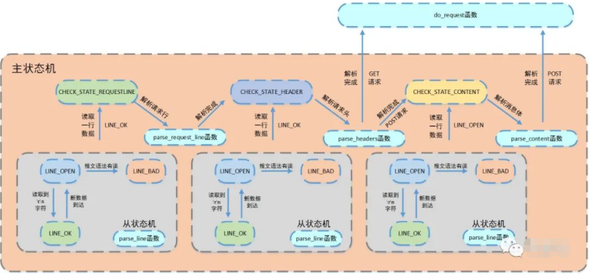
状态机来执行HTTP报文的解析, 主状态机用三种状态，标识解析位置。CHECK_STATE_REQUESTLINE，解析请求行; CHECK_STATE_HEADER，解析请求头; CHECK_STATE_CONTENT，解析消息体，仅用于解析POST请求。

另外还用到从状态机及时记录一行当前的解析状态, LINE_OK，完整读取一行
;LINE_BAD，报文语法有误;LINE_OPEN，读取的行不完整。

http头部的格式可以解析成字典
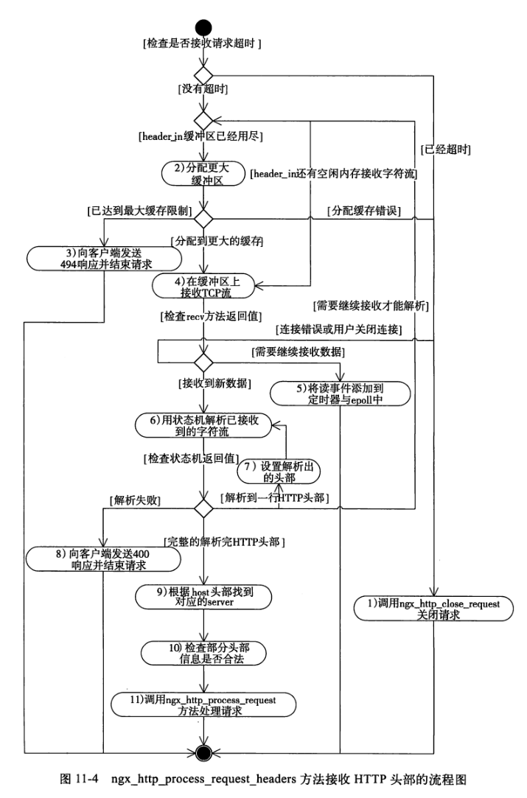

在接收到完整的HTTP头部后就已经拥有足够的必要信息开始在业务上处理HTTP请求了。之后准备调用各HTTP模块处理请求, 首先需要从定时器中把当前连接的读事件移除。检查读事件对应的timer_set标志位,为说明读事件还在定时器中, 调用ngx_del_timer从定时器移除读事件。

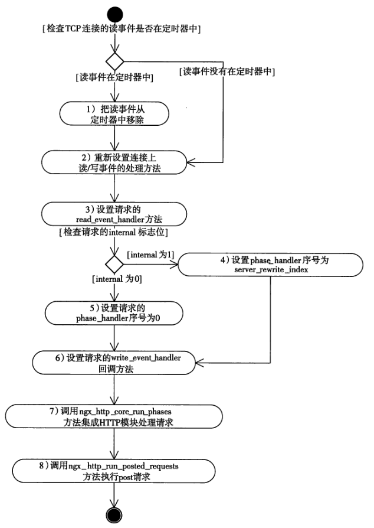

#### 处理HTTP请求阶段

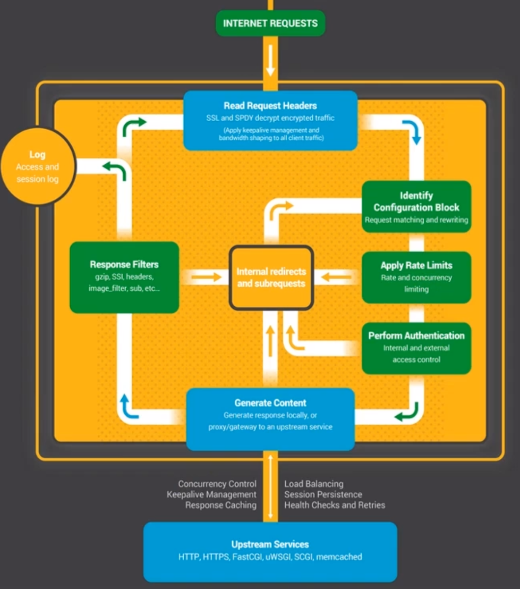

1. Read Request Headers：解析请求头。
2. Identify Configuration Block：识别由哪一个 location 进行处理，匹配 URL。
3. Apply Rate Limits：判断是否限速。例如可能这个请求并发的连接数太多超过了限制，或者 QPS 太高。
4. Perform Authentication：连接控制，验证请求。例如可能根据 Referrer 头部做一些防盗链的设置，或者验证用户的权限。
5. Generate Content：生成返回给用户的响应。为了生成这个响应，做反向代理的时候可能会和上游服务（Upstream Services）进行通信，然后这个过程中还可能会有些子请求或者重定向，那么还会走一下这个过程（Internal redirects and subrequests）。
6. Response Filters：过滤返回给用户的响应。比如压缩响应，或者对图片进行处理。
7. Log：记录日志。


HTTP阶段的定义, 包括checker检查方法和handler处理方法
```cpp
typedef struct ngx_http_phase_handler_s ngx_http_phase_handler_t;

// checker方法, 只可由http框架实现, 控制HTTP请求的流程
typedef ngx_int_t (*ngx_http_phase_handler_pt) (ngx_http_request_t *r, ngx_http_phase_handler_t *ph);

typedef ngx_int_t (*ngx_http_handler_pt) (ngx_http_request_t *r);

struct ngx_http_phase_handler_s {
  ngx_http_phase_handler_pt checker;  // 首先调用checker方法
  ngx_http_handler_pt handler;  // 通过定义handler方法接入HTTP某阶段处理
  ngx_uint_t  next; // 要执行的下一个HTTP处理阶段的序号
};
```

11个阶段
```cpp
typedef enum {
  // 在接收到完整的HTTP头部后处理的HTTP阶段
  NGX_HTTP_POST_READ_PHASE = 0,
  // 在将请求的URI和 location表达式匹配前, 修改请求的URI(重定向)
  NGX_HTTP_SERVER_REWRITE_PHASE,
  // 根据URI寻找匹配的location表达式
  NGX_HTTP_FIND_CONFIG_PHASE,
  // 寻找到匹配的location之_后修改请求的URI
  NGX_HTTP_REWRITE_PHASE,
  // 防止因错误配置nginx.conf导致重定向rewrite URL死循环
  NGX_HTTP_POST_REWRITE_PHASE,
  // 表示NGX_HTTP_ACCESS_PHASE阶段前, 可介入的阶段
  NGX_HTTP_PREACCESS_PHASE,
  // 让HTTP模块判断是否允许这个请求访问服务器
  NGX_HTTP_ACCESS_PHASE,
  // 相当于给NGX_HTTP_ACCESS_PHASE收尾, 例如发送错误码等
  NGX_HTTP_POST_ACCESS_PHASE,
  // 为try_files配置项设立, 可以允许顺序的访问多个静态文件资源
  NGX_HTTP_TRY_FILES_PHASE,
  // 用于处理HTTP请求的阶段, 大部分HTTP模块最常介入的阶段
  NGX_HTTP_CONTENT_PHASE,
  // 处理完请求记录日志的阶段, 记录access_log访问日志
  NGX_HTTP_LOG_PHASE
} ngx_http_phases;
```


HTTP框架通过checker方法回答如下问题, 当前阶段已经完全结束了吗? 下次要执行的回调方法时哪一个? 究竟是立刻执行下一个回调方法还是先把控制权交给epoll?

一般checker方法首先调用HTTP模块实现的handler方法, 这个方法不允许阻塞, 会立即返回。如果返回NGX_OK, 说明当前阶段已经执行完毕, 需要进入下一个阶段执行; 如果handler方法返回NGX_DECLINED, 则会执行下一个回调方法。如果返回NGX_AGAIN或NGX_DONE, 说明handler无法在这一次调用处理完这个阶段, 需要多次调用, 直接返回NGX_OK将使HTTP框架立刻把控制权还给epoll事件框架, 只有当epoll事件再次触发才会执行。

* post请求处理

Nginx使用的完全无阻塞的事件驱动框架是难以编写功能复杂的模块的, 一个请求在处理一个TCP连接时将需要处理这个连接上的可读, 可写以及定时器事件, 而可读事件又包含连接建立成功, 连接关闭事件, 正常的可读事件在接收到HTTP的不同部分又要做不同处理。且如果一个请求需要同时与多个上游服务器打交道, 同时处理多个TCP连接, 那么要处理的事件太多了。Nginx解决办法是subrequest机制, 将一个复杂请求拆分成许多子请求, 而每个HTTP模块只需要关心一个请求, 不用掌握派生的所有子请求。这些子请求以单链表形式组织。

```cpp
typedef struct ngx_http_posted_request_s ngx_http_posted_request_t;

struct ngx_http_posted_request_s {
  // 指向当前待处理子请求的ngx_http_request_t结构体
  ngx_http_request_t *request;
  // 指向下一个子请求
  ngx_http_posted_request_t *next;
};
```

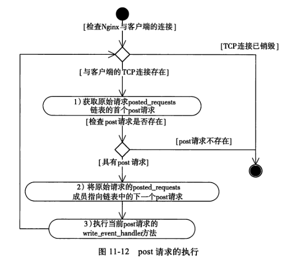


#### 包体处理

HTTP的请求通常由必选的HTTP请求行, 请求头部, 可选的包体组成。HTTP框架提供了两种方式处理HTTP包体, 第一种方式是把请求的包体接收到内存或者文件中, 第二种方式是选择丢弃包体。由于HTTP包体是可变长度的, 接收包体可能导致HTTP框架将TCP连接的读事件再次添加到epoll和定时器中, 直到在TCP连接上接收到全部包体。

保存包体的结构体
```cpp
typedef struct {
  ngx_temp_file_t *temp_file; // 存放http包体的临时文件
  ngx_chain_t *bufs;  // 接收HTTP包体的缓冲区链表, 因为一块缓冲区可能无法放完
  ngx_buf_t *buf; // 接收HTTP包体的缓存
  off_t rest; // 根据content_length和已接受到包体的长度, 计算得到还需要接收包体的长度
  ngx_chain_t *to_write;  // 该缓冲区链表存放着将要写入文件的包体
  ngx_http_client_body_handler_pt post_handler; // HTTP包体接收完毕执行的回调方法
} ngx_http_request_body_t;
```

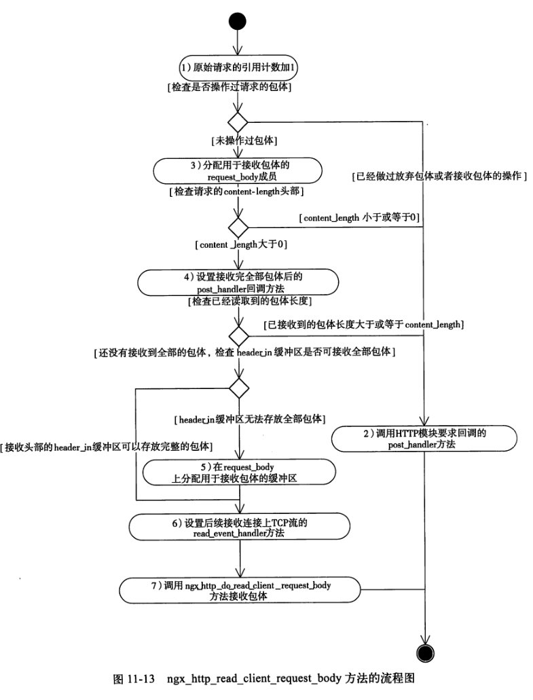

#### 发送HTTP响应

发送HTTP响应的两个方法: ngx_http_send_header和ngx_http_output_filter, 这两个方法负责将HTTP响应的应答行,头部, 包体发送给客户端。当响应过大无法一次性发完时(TCP的滑动窗口也是有限的, 一次非阻塞的发送多半是无法发送完整的HTTP响应), 就需要向epoll以及定时器添加写事件了, 当连接再次可写, 就调用ngx_http_writer方法继续发送响应, 直到全部的响应都发送到客户端。

注意到在接收HTTP请求时需要等全部请求接收到在调用post_handler回调方法表示本次连接请求已经结束, 但在发送请求不必等到数据发送完, 只要开始发送请求意味着结束。真正在后台异步发送响应的ngx_http_writer方法对HTTP模块而言是透明的。

ngx_http_send_header方法负责构造HTTP响应行, 头部, 并发送给客户端。

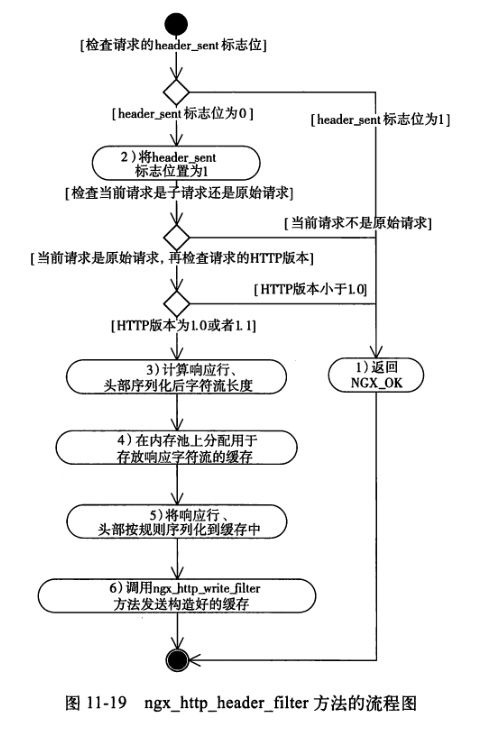

ngx_http_output_filter方法则用于发送响应包体
```cpp
ngx_int_t ngx_http_write_filter(ngx_http_reqeust_t* r, ngx_chain_t *in)
```

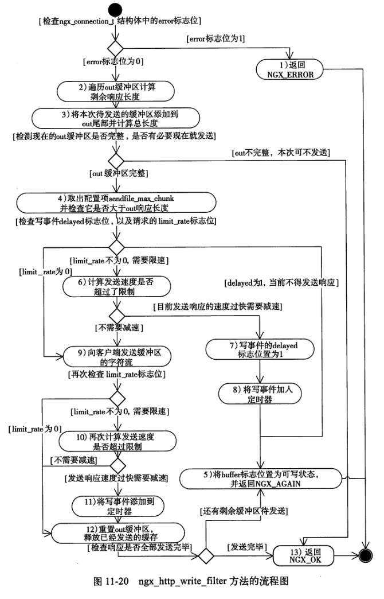

#### 结束HTTP请求

结束请求是一项复杂的工作, 因为一个请求可能被许多事件触发。如果结束了请求，销毁了和请求相关的内存，而定时器或epoll还存在该请求相关的事件，当这些事件被回调时请求已经不存在了，就会造成严重的内存访问越界错误。解决办法通过引用计数，每在该请求上派生出一种动作时引用计数都会+1，而动作结束时引用计数-1。调用ngx_http_finalize_request会检查引用计数的值, 当引用计数为0才会销毁请求。

ngx_http_close_connection用来释放TCP连接
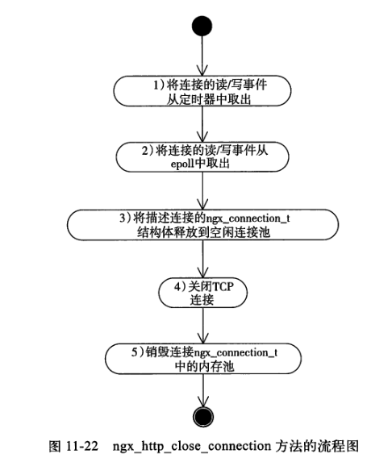

释放TCP连接, ngx_http_close_connection是HTTP框架提供的一个用于释放TCP连接的方法, 
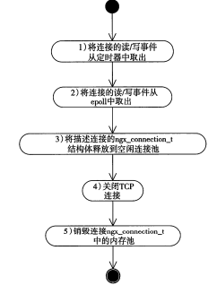

### upstream 与 subrequest

Nginx 提供了两种全异步方式与第三方服务进行通信：upstream和subrequest。upstream 在与第三方服务器交互时（包括建立TCP 连接、发送请求、接收响应、关闭TCP 连接），不会阻塞Nginx 进程处理其他请求。subrequest 只是分解复杂请求的一种设计模式，它可以把原始请求分解为多个子请求，使得诸多请求协同完成一个用户请求，并且每个请求只关注一个功能。

#### upstream

upstream机制与上游服务器是通过TCP建立连接的, 建立TCP连接需要三次握手, 三次握手消耗的时间是不可控的。为了保证建立TCP连接的操作不会阻塞进程, Nginx使用无阻塞的套接字来连接上游服务器。由于使用无阻塞套接字, 方法返回时与上游之间的TCP连接未必会成功建立, 可能还要等待上游服务器返回TCP的SYN/ACK包。因此, ngx_http_upstream_connect方法主要负责发起建立连接这个动作， 如果方法没有立刻返回成功, 那么需要在epoll中监控这个套接字, 当它出现可写事件时, 就说明连接已经建立成功了。

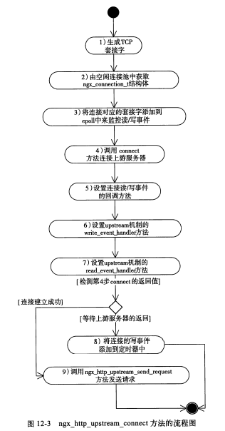

使用upstream机制必须构造ngx_http_upstream_t结构体
```cpp
typedef struct ngx_http_upstream_s ngx_http_upstream_t;

struct ngx_http_upstream_s {
  ngx_http_upstream_handler_pt read_event_handler;  // 读事件的回调算法
  ngx_http_upstream_handler_pt write_event_handler; // 写事件回调方法
  ngx_peer_connection_t peer; // 主动向上游服务器发起的连接

  ngx_http_upstream_conf_t *conf; // 配置
  ...
}
```

发送请求比较简单, 若一次没有发送完继续将写事件添加到定时器和epoll种从而继续触发。当发送完全部请求准备接收响应时, 将读事件添加到定时器中。

接收响应比较特殊, 首先应用层协议响应包可大可小, 最小的可以是128B, 最大堆可能达到5GB， 如果HTTP框架接收到全部响应再处理则可能引发OutOfMemory错误, 而如果磁盘文件中接收响应会带来大量I/O操作影响并发; 其次不一定要完全解析内容, 例如从Memcached服务器下载一幅图片Nginx只需要解析Memcached协议而不需要解析图片的内容, 对于图片内容Nginx只需要边接收边转发给客户端。

为了解决上述问题, 应用层协议通常会将请求和响应分成两部分: 包头和包体。包头相当于将不同的协议包之间的共同部分抽象出来, 而包体是否解析视业务需要而定。HTTP模块希望实现反向代理功能时大都不希望解析包体。

如果Nginx与上游服务器网速快(如内网)而与下游服务器慢, 可以尽可能将上游服务器响应接收到Nginx服务器上, 如果内存过大可以保存在磁盘文件中; 相反如果与上游服务器网速慢, 则可以开辟固定大小内容作为缓冲区, 一边接收上游响应一边向下游转发。

* upstream的负载均衡

负载均衡针对的是请求, 不仅仅是连接。同一个连接的不同请求可由不同服务器进行处理。

加权轮询, 加权轮询策略是先计算每个后端服务器的权重，然后选择权重最高的后端服务器来处理请求。但是同一个客户端的多次请求可能会被分配到不同的后端服务器进行处理，无法满足做会话保持的应用的需求。

IP 哈希, IP 哈希策略选择后端服务器时，将来自同一个 IP 地址的客户端请求分发到同一台后端服务器处理。但是来自同一的 IP 地址的请求比较多时，会导致某台后端服务器的压力可能非常大，而其他后端服务器却空闲的不均衡情况。

#### subrequest

subrequest 的使用步骤如下：
1. 在 nginx.conf 配置文件中配置好子请求的处理方式；
2. 启动 subrequest 子请求；
3. 实现子请求执行结束时的回调函数；
4. 实现父请求被激活时的回调函数；

子请求并不是由 HTTP 框架解析所接收到客户端网络包而得到的，而是由父请求派生的。它的配置和普通请求的配置相同，都是在nginx.conf 文件中配置相应的处理模块。例如：可以在配置文件nginx.conf 中配置以下的子请求访问 https://github.com
```cpp
location /subrq { 
  	    rewrite ^/subrq(.*)$ $1 break;
  	    proxy_pass https://github.com;
	}
```

### Nginx的进程通信

Nginx选择了哪些方式来同步master进程和多个work进程间的数据, Nginx由一个master进程和多个worker进程组成, 期间并未创建线程

#### 共享内存

共享内存是Linux提供的最基本的进程间通信方法, 它通过mmap或者shmget系统调用在内存中创建一块连续的线性地址空间, 对应的通过munmap或者shmdt系统调用释放这块内存。常在/dev/zero中使用mmap映射共享内存

/dev/null，或称空设备，是一个特殊的设备文件，它丢弃一切写入其中的数据（但报告写入操作成功），读取它则会立即得到一个EOF。/dev/zero 是一个特殊的文件，当你读它的时候，它会提供无限的空字符(NULL, ASCII NUL, 0x00)。

Nginx定义了ngx_shm_t结构体用于描述一块共享内存
```cpp
typedef struct {
  u_char  *addr;  // 指向共享内存的起始地址
  size_t  size; // 共享内存的长度
  ngx_str_t name; // 共享内存的名称
  ngx_log_t *log; // 记录日志的ngx_log_t对象
  ngx_uint_t  exists; // 共享内存是否分配过
} ngx_shm_t;
```

操作ngx_shm_t结构体的方法有两个, ngx_shm_alloc用于分配新的共享内存, 而ngx_shm_free用于释放已经存在的共享内存.

```cpp
void *mmap(void *start, size_t length, int prot, int flags, int fd, off_t offset);
```

mmap可以将磁盘文件映射到内存中, 直接操作内存Linux内核将负责同步内存和磁盘文件中的数据, fd参数就指向需要同步的磁盘文件, offset表示从文件偏移量开始共享。Nginx不需要映射文件, 因此flags参数可以是MAP_ANON表示不适用文件映射, fd和offset传入-1和0即可。

Nginx各进程间共享数据的主要方式就是共享内存, 一般由master进程创建, 在master fork出子进程后, 所有的进程开始使用这块内存的数据。

#### 原子操作

Nginx封装了原子操作, 例如使用原子操作来修改, 获取整型变量使用ngx_atomic_cmp_set, ngx_atomic_fetch_add
```cpp
static ngx_inline ngx_atomic_uint_t
ngx_atomic_cmp_set(ngx_atomic_t* lock, ngx_atomic_uint_t old, ngx_atomic_uint_t set)
```

Nginx要在源代码中实现对整型的原子操作, 自然必须通过内联汇编语言直接操作硬件。GCC在C语言中嵌入汇编语言的方式是使用__asm__关键字
```cpp
__asm__ volatile (
  [汇编语句]
  : [输出部分]  /* 可选 */
  : [输入部分]  /* 可选 */
  : [破坏描述部分]  /* 可选 */
);

static ngx_inline ngx_atomic_int_t
ngx_atomic_fetch_add(ngx_atomic_t* value, ngx_atomic_int_t add)
{
  __asm__ volatile (
    // 首先所住总线
    "lock;"
    // *value的值等于原先*value与add值之和
    "xaddl %0 %1;"
    : "+r"(add) : "m"(*value) : "cc", "memory");
    return add;
}
```

#### Nginx channel

ngx_channel_t channel频道是Nginx master进程与worker进程之间通信的常用工具, 它使用本机套接字实现。
```cpp
// 用于创建父子进程间使用的套接字
int socketpair(int d, int type, int protocol, int sv[2])
```
ngx_channel_t是Nginx定义的master父进程与worker子进程间的消息格式
```cpp
typedef struct {
  ngx_uint_t command; // 传递的TCP消息的命令
  ngx_pid_t pid;  // 进程Pid,一般是发送方的进程ID
  ngx_int_t slot; // 表示发送方在ngx_processes进程数组间的序号
  ngx_fd_t; // 通信的套接字句柄
} ngx_channel_t;
``` 

信号传递进程间信息, 信号是一种非常短的消息, 短到只有一个数字
```cpp
typedef struct {
  int signo;  // 需要处理的信号
  char* signame;  // 信号对应的字符串名称
  char* name; // 信号对应的Nginx命令
  void (*handler) (int signo);  // 收到signo信号后就会回调Handler方法 
};
```

信号, 信号是Linux定义进程信息传递的方式, 它是一种非常短的消息, 短到只有一个数字。Linux定义的前31个信号是最常用的
```
信 号	默认行为	描 述	信号值
SIGABRT	生成 core 文件然后终止进程	这个信号告诉进程终止操作。ABRT 通常由进程本身发送，即当进程调用 abort() 函数发出一个非正常终止信号时	6
SIGALRM	终止	警告时钟	14
SIGBUS	生成 core 文件然后终止进程	当进程引起一个总线错误时，BUS 信号将被发送到进程。例如，访问了一部分未定义的内存对象	10
SIGCHLD	忽略	当了进程结束、被中断或是在被中断之后重新恢复时，CHLD 信号会被发送到进程	20
SIGCONT	继续进程	CONT 信号指不操作系统重新开始先前被 STOP 或 TSTP 暂停的进程	19
SIGFPE	生成 core 文件然后终止进程	当一个进程执行一个错误的算术运算时，FPE 信号会被发送到进程	8
SIGHUP	终止	当进程的控制终端关闭时，HUP 信号会被发送到进程	1
SIGILL	生成 core 文件然后终止进程	当一个进程尝试执行一个非法指令时，ILL 信号会被发送到进程	4
SIGINT	终止	当用户想要中断进程时，INT 信号被进程的控制终端发送到进程	2
SIGKILL	终止	发送到进程的 KILL 信号会使进程立即终止。KILL 信号不能被捕获或忽略	9
SIGPIPE	终止	当一个进程尝试向一个没有连接到其他目标的管道写入时，PIPE 信号会被发送到进程	13
SIGQUIT	终止	当用户要求进程执行 core dump 时，QUIT 信号由进程的控制终端发送到进程	3
SIGSEGV	生成 core 文件然后终止进程	当进程生成了一个无效的内存引用时，SEGV 信号会被发送到进程	11
SIGSTOP	停止进程	STOP 信号指示操作系统停止进程的执行	17
SIGTERM	终止	发送到进程的 TERM 信号用于要求进程终止	15
SIGTSTP	停止进程	TSTP 信号由进程的控制终端发送到进程来要求它立即终止	18
SIGTTIN	停止进程	后台进程尝试读取时，TTIN 信号会被发送到进程	21
SIGTTOU	停止进程	后台进程尝试输出时，TTOU 信号会被发送到进程	22
SIGUSR1	终止	发送到进程的 USR1 信号用于指示用户定义的条件	30
SIGUSR2	终止	同上	31
SIGPOLL	终止	当一个异步输入/输出时间事件发生时，POLL  信号会被发送到进程	23
SIGPROF	终止	当仿形计时器过期时，PROF 信号会被发送到进程	27
SIGSYS	生成 core 文件然后终止进程	发生有错的系统调用时，SYS 信号会被发送到进程	12
SIGTRAP	生成 core 文件然后终止进程	追踪捕获/断点捕获时，会产生 TRAP 信号。	5
SIGURG	忽略	当侖一个 socket 有紧急的或是带外数据可被读取时，URG 信号会被发送到进程	16
SIGVTALRM	终止	当进程使用的虚拟计时器过期时，VTALRM 信号会被发送到进程	26
SIGXCPU	终止	当进程使用的 CPU 时间超出限制时，XCPU 信号会被发送到进程	24
SIGXFSZ	生成 core 文件然后终止进程	当文件大小超过限制时，会产生 XFSZ 信号	25
```

#### 文件锁和互斥锁

对一个文件上锁
```cpp
int fcntl(int fd, int cmd, struct flock* lock);

struct flock
{
  ...
  short l_type; // 锁类型, F_RDLCK, F_WRLCK, F_UNLCK
  short l_whence; // 锁区域起始地址的相对位置
  long  l_start;  // 锁区域起始地址偏移量, 与l_whence共同决定锁区域
  long  l_len;  // 锁的长度, 0表示锁到文件末尾
  long  l_pid; // 拥有锁的进程ID
};
```

基于原子操作, 信号量和文件锁, Nginx在更高层次封装了互斥锁。在使用文件锁实现互斥锁时, 进程获取到inode号fd就认为已经获取到了锁。

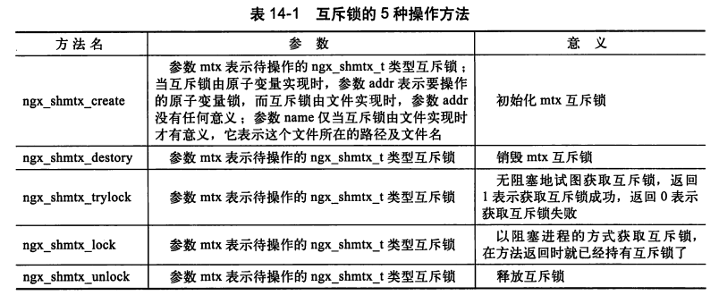

### http2.0

#### frame 

```cpp
static ngx_http_v2_handler_pt ngx_http_v2_frame_states[] = {
    ngx_http_v2_state_data,               /* NGX_HTTP_V2_DATA_FRAME */
    ngx_http_v2_state_headers,            /* NGX_HTTP_V2_HEADERS_FRAME */
    ngx_http_v2_state_priority,           /* NGX_HTTP_V2_PRIORITY_FRAME */
    ngx_http_v2_state_rst_stream,         /* NGX_HTTP_V2_RST_STREAM_FRAME */
    ngx_http_v2_state_settings,           /* NGX_HTTP_V2_SETTINGS_FRAME */
    ngx_http_v2_state_push_promise,       /* NGX_HTTP_V2_PUSH_PROMISE_FRAME */
    ngx_http_v2_state_ping,               /* NGX_HTTP_V2_PING_FRAME */
    ngx_http_v2_state_goaway,             /* NGX_HTTP_V2_GOAWAY_FRAME */
    ngx_http_v2_state_window_update,      /* NGX_HTTP_V2_WINDOW_UPDATE_FRAME */
    ngx_http_v2_state_continuation        /* NGX_HTTP_V2_CONTINUATION_FRAME */
};
```

对于http1.1的字符串序列, http2.0封装成若干帧, 包括保存请求行和头部的header帧, 数据的data帧, 还有表示设置的setting帧, 流控的window_update帧等。

处理帧是自底向下的, 读到tcp流后封装解析成帧, 调用帧回调函数可以动态的给stream增加信息, 当一个stream接受到所有要接收的帧后调用用户回调函数。(用户可以设置stream接收到哪些帧该怎样做)。

http2.0帧的下层还是tcp协议

#### stream

对于客户端来说, 到一个server只需要建立一个连接, 向该server并行的数据请求基于该连接下的流结构。

每个stream负责一次读写操作, 下含若干帧。stream由一个id唯一标识, stream下的帧要有序。

http2.0相比http1.1, 使用帧结构压缩数据, 降低传输内容(比如报头)。基于stream结构降低tcp建立的次数。stream共享一次连接增大的并行程度

http3.0/quic 使用udp作为传输层协议, 可以保证连接永远不会阻塞, 如果发生丢包用户层stream申请重传即可。(可看作多个stream等待一个udp的数据, udp不会阻塞永远在工作, udp可能丢包但stream请求重传即可)。http3.0赋予stream更多的功能, 主要是可靠性传输, 拥塞控制这种tcp的功能。

### 总结

存储配置项通过若干结构体, 一般一个配置块的信息通过一个结构体存储, 例如http模块
```cpp
typedef struct {
  void** main_conf; // 指向一个指针数组, 数组的每个成员为由preconfiguration创建的存储http{}的结构体
  void** srv_conf;
  void** loc_conf;
} ngx_http_conf_ctx_t;

// 管理这些配置项
  char* (*merge_srv_conf)(ngx_conf_t* cf, void* prev, void* conf);  // 合并main和srv配置项
  void* (*create_loc_conf)(ngx_conf_t* cf); // 创建存储loc配置项的结构体
  char* (*merge_loc_conf)(ngx_conf_t* cf, void* prev, void* conf);  // 合并main,srv和loc配置项
```

基于优先状态机解析http1.1, 每个解析状态用阶段表示

负载均衡通过nginx的upstream功能进行, 常用的负载均衡策略。加权轮询, 加权轮询策略是先计算每个后端服务器的权重，然后选择权重最高的后端服务器来处理请求。IP 哈希, IP 哈希策略选择后端服务器时，将来自同一个 IP 地址的客户端请求分发到同一台后端服务器处理。

共享内存, C嵌入汇编的原子操作, 信号信息只需要一个数字, 文件锁依然是锁住某个范围。

