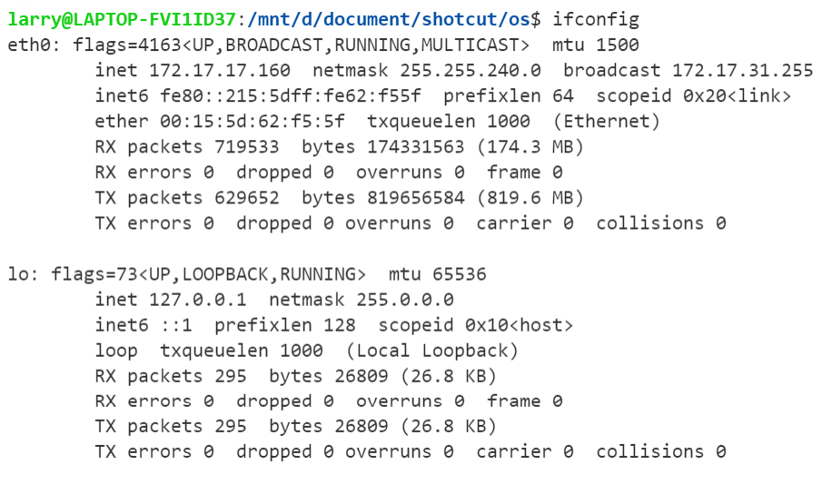
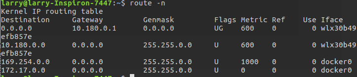

### centos

centos是服务器一般使用的linux操作系统, 大部分和ubuntu是一样的; 但由于环境，路径不同，在ubuntu编译的库文件，可执行文件等一般需要在centos重新编译一遍。

centos与ubuntu突出的不同是包管理系统，rpm, 基于centos rpm最大优势是可以直接安装编译好的可执行文件，库文件等，省去了大量的编译时间。

#### rpm

rpm 作用是执行安装包，包有二进制包（Binary）以及源代码包（Source）两种。二进制包可以直接安装在计算机中，而源代码包将会由RPM自动编译、安装。源代码包经常以src.rpm作为后缀名

安装常用库文件, 例如gcc, boost等, 使用rpm比源码编译方便的多。

常用命令
```
－ivh：安装显示安装进度--install--verbose--hash
－Uvh：升级软件包--Update;
－qpl：列出RPM软件包内的文件信息[Query Package list];
－qpi：列出RPM软件包的描述信息[Query Package install package(s)];
－qf：查找指定文件属于哪个RPM软件包[Query File];
－e：删除包

rpm　--recompile　vim-4.6-4.src.rpm   ＃这个命令会把源代码解包并编译、安装它，如果用户使用命令：
rpm　--rebuild　vim-4.6-4.src.rpm　　＃在安装完成后，还会把编译生成的可执行文件重新包装成i386.rpm的RPM软件包。
```
例如centos下gcc可以参考https://centos.pkgs.org/7/centos-sclo-rh-x86_64/devtoolset-7-gcc-7.2.1-1.el7.x86_64.rpm.html,

同样找软件先去镜像里看看有没有, http://www.gnu.org/prep/ftp.html
```
https://mirrors.aliyun.com/gnu/
http://mirrors.aliyun.com/gnu/
https://mirrors.ustc.edu.cn/gnu/
http://mirrors.ustc.edu.cn/gnu/
rsync://rsync.mirrors.ustc.edu.cn/gnu/
https://mirrors.tuna.tsinghua.edu.cn/gnu/
rsync://mirrors.tuna.tsinghua.edu.cn/gnu/
https://mirrors.sjtug.sjtu.edu.cn/gnu/
https://mirrors.nju.edu.cn/gnu/
http://mirrors.nju.edu.cn/gnu/
```

由于编译比较复杂，对于常用的软件，包括Mysql等，都可以使用rpm安装。更小的软件, 可以用yum install, 注意yum install默认安装版本，例如gcc就是4.8, 不方便自定义版本。

### lsof 基于端口查看进程

lsof(list open files)是一个查看进程打开的文件的工具。在 linux 系统中，一切皆文件。通过文件不仅仅可以访问常规数据，还可以访问网络连接和硬件。所以 lsof 命令不仅可以查看进程打开的文件、目录，还可以查看进程监听的端口等 socket 相关的信息。

```
-c <进程名> 输出指定进程所打开的文件
-d <文件描述符> 列出占用该文件号的进程
+d <目录>  输出目录及目录下被打开的文件和目录(不递归)
+D <目录>  递归输出及目录下被打开的文件和目录
-i <条件>  输出符合条件与网络相关的文件
-p <进程号> 输出指定 PID 的进程所打开的文件

lsof -i:8080：查看8080端口占用
lsof abc.txt：显示开启文件abc.txt的进程
lsof -c abc：显示abc进程现在打开的文件
lsof -c -p 1234：列出进程号为1234的进程所打开的文件
lsof -g gid：显示归属gid的进程情况
lsof +d /usr/local/：显示目录下被进程开启的文件
lsof +D /usr/local/：同上，但是会搜索目录下的目录，时间较长
lsof -d 4：显示使用fd为4的进程
lsof -i -U：显示所有打开的端口和UNIX domain文件
```

* lsof -i:端口号, 查看与打开端口相关的文件


* 查看哪个进程打开了这个文件, `lsof /bin/bash`


* 查看某个进程打开得全部文件


### netstat

Netstat(network statistics)是在内核中访问网络连接状态及其相关信息的命令行程序，可以显示路由表、网络连接和网络接口设备的状态信息，以及与 IP、TCP、UDP 和 ICMP 协议相关的统计数据，**一般用于检验本机各端口的网络服务运行状况**。


<!-- more -->

netstat的输出结果可以分为两个部分：
1. Active Internet connections，称为有源TCP连接，其中"Recv-Q"和"Send-Q"指%0A的是接收队列和发送队列。这些数字一般都应该是0。如果不是则表示软件包正在队列中堆积。
2. 另一个是Active UNIX domain sockets，称为有源Unix域套接口(和网络套接字一样，但是只能用于本机通信，性能可以提高一倍)。

常用参数
```
-a (all)显示所有选项，注意默认不显示LISTEN相关, 显示监听端口要么-l, 要么-a
-t (tcp)仅显示tcp相关选项
-u (udp)仅显示udp相关选项
-n 拒绝显示别名，能显示数字的全部转化成数字。
-l 仅列出有在 Listen (监听) 的服務状态

-p 显示建立相关链接的程序名
-r 显示路由信息，路由表
-e 显示扩展信息，例如uid等
-s 按各个协议进行统计
-c 每隔一个固定时间，执行该netstat命令。
```

* 列出所有端口 `netstat -a`,  列出所有 tcp 端口 `netstat -at`, 列出所有监听 tcp 端口 `netstat -lt`'。一般直接`netstat -nat|grep`
。可以通过`netstat -nat|grep pid`来基于端口找占用的进程。

* 显示所有协议的统计信息 `netstat -s`, 输出中显示 PID 和进程名称 `netstat -p`


* netstat -tunlp 用于显示 tcp，udp 的端口和进程等相关情况。

```
# netstat -tunlp | grep 8000
tcp        0      0 0.0.0.0:8000            0.0.0.0:*               LISTEN      26993/nodejs   

-t (tcp) 仅显示tcp相关选项
-u (udp)仅显示udp相关选项
-n 拒绝显示别名，能显示数字的全部转化为数字
-l 仅列出在Listen(监听)的服务状态
-p 显示建立相关链接的程序名
```

* 核心路由信息 `netstat -r`


### 系统信息

#### 查看进程信息

ps, `ps -ef` 是用标准的格式显示进程的、其格式如下

杀死进程 `kill -9 PID`

#### 查看cpu, 内存信息

top, 注意cpu的状态信息


```
cpu状态信息，具体属性说明如下：

us — 用户空间占用CPU的百分比。
sy — 内核空间占用CPU的百分比。
ni — 改变过优先级的进程占用CPU的百分比

id — 空闲CPU百分比
wa — IO等待占用CPU的百分比
hi — 硬中断（Hardware IRQ）占用CPU的百分比
si — 软中断（Software Interrupts）占用CPU的百分比
```

#### 查看磁盘信息

iostat

#### 查看域名解析

nslookup


本机地址为172.19.80.1, 解析baidu.com的地址为14.215.177.38

#### 检查路由traceroute

traceroute, 用来测试路由问题的最好的工具之一


### 防火墙iptables

所谓防火墙就是设定某种规则, 满足规则的数据包可以进入或发出, 不满足的不能进入和出去
#### 防火墙

1. 包过滤防火墙：包过滤是**IP层**实现，包过滤根据**数据包的源 IP、目的 IP、协议类型（TCP/UDP/ICMP）、源端口、目的端口**等包头信息及数据包传输方向灯信息来判断是否允许数据包通过。
2. 应用层防火墙：也称为应用层代理防火墙，基于应用层协议的信息流检测，可以拦截某应用程序的所有封包，提取包内容进行分析。有效防止 SQL 注入或者 XSS（跨站脚本攻击）之类的恶意代码。
3. 状态检测防火墙：结合包过滤和应用层防火墙优点，基于连接状态检测机制，将属于同一连接的所有包作为一个整体的数据流看待，构成连接状态表（通信信息，应用程序信息等），通过规则表与状态表共同配合，对表中的各个连接状态判断。

iptables 是 Linux 下的配置防火墙的工具，用于配置 Linux 内核集成的 IP 信息包过滤系统


四表,防火墙规则是一个表, 增加一条规则相当于在表中多写一行。
```
filter
用于包过滤
nat
网络地址转发
mangle
对特定数据包修改
raw
不做数据包链路跟踪
```

五链, 表示入口或者出口等
```
INPUT
本机数据包入口
OUTPUT
本机数据包出口
FORWARD
经过本机转发的数据包
PREROUTING
防火墙之前，修改目的地址（DNAT）
POSTROUTING
防火墙之后，修改源地址（SNAT）
```

表中的链
```
filter
INPUT/OUTPUT/FORWARD

nat
PREROUTING/POSTROUTING/OUTPUT

mangle
PREROUTING/POSTROUTING/INPUT/OUTPUT/FORWARD

raw
PREROUTING/OUTPUT
```

#### 命令

`iptables [-t table] 命令 [chain] 匹配条件 动作`

命令
```
-A, append	追加一条规则
-I, insert	插入一条规则，默认链头，后跟编号，指定第几条
-D, delete	删除一条规则
-F, flush	清空规则
-s	源地址
-d	目标地址
-p	协议类型
--sport	源端口
--dport	目的端口
```

动作
```
ACCEPT
允许数据包通过
DROP
丢弃数据包不做处理
REJECT
拒绝数据包，并返回报错信息
SNAT
一般用于nat表的POSTROUTING链，进行源地址转换
DNAT
一般用于nat表的PREROUTING链，进行目的地址转换
```

例子
```
iptables -F
# 清空表规则，默认filter表

iptables -t nat -F
# 清空nat表
    
iptables -A INPUT -p tcp --dport 22 -j ACCEPT
# 允许TCP的22端口访问

iptables -A INPUT -p tcp --dport 22:25 -j ACCEPT
    # 允许端口范围访问

iptables -D INPUT -p tcp --dport 22:25 -j ACCEPT
    # 删除这条规则

iptables -A INPUT -p tcp -m multiport --dports 22,80,8080 -j ACCEPT
# 允许多个 TCP 端口访问

iptables -A INPUT -s 192.168.1.0/24 -j ACCEPT
# 允许 192.168.1.0 段 IP 访问

iptables -I INPUT -s 121.0.0.0/8 -j DROP
丢弃某个ip段的包, 也就是禁止某个ip访问

iptables -A INPUT -s 192.168.1.10 -j DROP
# 对 1.10 数据包丢弃

iptables -A INPUT -i eth0 -p icmp -j DROP
# eth0 网卡 ICMP 数据包丢弃，也就是禁 ping

iptables -A INPUT -i lo -j ACCEPT
# 允许来自 lo 接口，如果没有这条规则，将不能通过 127.0.0.1 访问本地服务

iptables -I INPUT -p tcp --syn --dport 80 -m connlimit --connlimit-above 30 -j REJECT
# 限制并发连接数，超过 30 个拒绝

iptables -I INPUT -p tcp --syn -m limit --limit 1/s --limit-burst 3 -j ACCEPT
# 限制每个 IP 每秒并发连接数最大 3 个


iptables -t nat -A PREROUTING -d [对外 IP] -p tcp --dport [对外端口] -j DNAT --to [内网 IP:内网端口]
# 访问 iptables 公网 IP 端口，转发到内网服务器端口

iptables -t nat -A PREROUTING -p tcp --dport 80 -j REDIRECT --to-ports 8080
# 本地 80 端口转发到本地 8080 端口

iptables -A INPUT -m state --state ESTABLISHED,RELATED -j ACCEPT
# 允许已建立及该链接相关联的数据包通过

```

### 渗透 NMAP

NMap，也就是Network Mapper，是Linux下的网络扫描和嗅探工具包。与`netstat`不同的, `netstat`用来查看本机的端口，协议等情况, NMap用来测试对方主机的端口等信息。其基本功能有三个：
1. 扫描主机端口，嗅探所提供的网络服务
2. 探测一组主机是否在线
3. 推断主机所用的操作系统，到达主机经过的路由，系统已开放端口的软件版本

Nmap常用在渗透测试中信息搜集阶段，用于搜集目标机主机的基本状态信息

#### 端口扫描

端口分为TCP.和UDP两种类型。TCP: 面向连接. 较可靠, UDP:无连接.不可靠的。常见端口: 80, 443,139,445等.

端口扫描就是发送一组扫描信息,了解目标计算机的基本情况.并了解其提供的网络服务类型.从而找到攻击点。


使用nmap一个ip地址可以直接找到开放的端口


```
端口状态
open ： 应用程序在该端口接收 TCP 连接或者 UDP 报文。 
closed ：关闭的端口对于nmap也是可访问的， 它接收nmap探测报文并作出响应。但没有应用程序在其上监听。
filtered ：由于包过滤阻止探测报文到达端口，nmap无法确定该端口是否开放。过滤可能来自专业的防火墙设备，路由规则 或者主机上的软件防火墙。
unfiltered ：未被过滤状态意味着端口可访问，但是nmap无法确定它是开放还是关闭。 只有用于映射防火墙规则集的 ACK 扫描才会把端口分类到这个状态。
open | filtered ：无法确定端口是开放还是被过滤， 开放的端口不响应就是一个例子。没有响应也可能意味着报文过滤器丢弃了探测报文或者它引发的任何反应。UDP，IP协议,FIN, Null 等扫描会引起。
closed|filtered：（关闭或者被过滤的）：无法确定端口是关闭的还是被过滤的
```

* -sV可以得到端口进程的相关版本信息


* -O可以得到操作系统信息


### 抓包 tcpdump


* 基于ip 端口过滤

```
tcpdump host 192.168.10.100
根据源ip进行过滤
tcpdump -i eth2 src 192.168.10.100
根据目标ip进行过滤
tcpdump -i eth2 dst 192.168.10.200

根据网段过滤
tcpdump net 192.168.10.0/24

根据端口过滤
tcpdump port 8088

根据协议过滤
tcpdump icmp

过滤组合
tcpdump src 10.5.2.3 and dst port 3389

过滤结果输出到文件
tcpdump icmp -w icmp.pcap
```

远程运行一个server, 监听5000端口。用tcpdump抓包分析


### linux网络常用命令
#### /etc/hosts
hosts —— the static table lookup for host name（主机名查询静态表）。
hosts文件是Linux系统上一个负责ip地址与域名快速解析的文件，以ascii格式保存在/etc/目录下。hosts文件包含了ip地址与主机名之间的映射，还包括主机的别名。在没有域名解析服务器的情况下，系统上的所有网络程序都通过查询该文件来解析对应于某个主机名的ip地址，否则就需要使用dns服务程序来解决。通过可以将常用的域名和ip地址映射加入到hosts文件中，实现快速方便的访问。
优先级 ： dns缓存 > hosts > dns服务 

```sh
ip地址   主机名/域名   （主机别名）
192.30.255.112  github.com git 
185.31.16.184 github.global.ssl.fastly.net 
```

#### ping
ping属于一个通信协议，是TCP/IP协议的一部分。利用ping命令可以检查网络是否通畅或者网络连接速度，很好地分析和判定网络故障。

Ping发送一个ICMP（Internet Control Messages Protocol），即因特网信报控制协议；接收端回声消息给目的地并报告是否收到所希望的ICMPecho （ICMP回声应答）。它的原理是：利用网络上机器IP地址的唯一性，给目标IP地址发送一个数据包，通过对方回复的数据包来确定两台网络机器是否连接相通，时延是多少。ping没有通过运输层的TCP或UDP。

TCPing是基于TCP协议的一种Ping命令，用来测试数据包能否通过TCP协议到到达目标主机（其实就是抄上面的描述）。他又一大特点，就是可以监听某个端口的状态，在禁Ping的时候，也可以检测网络连通率。

<!-- more -->


#### wget和curl 
wget命令用来从指定的URL下载文件。wget非常稳定，它在带宽很窄的情况下和不稳定网络中有很强的适应性，如果是由于网络的原因下载失败，wget会不断的尝试，直到整个文件下载完毕。如果是服务器打断下载过程，它会再次联到服务器上从停止的地方继续下载。这对从那些限定了链接时间的服务器上下载大文件非常有用。

curl命令是一个利用URL规则在命令行下工作的文件传输工具。它支持文件的上传和下载，所以是综合传输工具，但按传统，习惯称curl为下载工具。作为一款强力工具，curl支持包括HTTP、HTTPS、ftp等众多协议，还支持POST、cookies、认证、从指定偏移处下载部分文件、用户代理字符串、限速、文件大小、进度条等特征。

wget 是一个独立的下载程序，无需额外的资源库，它也允许你下载网页中或是 FTP 目录中的任何内容, 能享受它超凡的下载速度，简单直接。
curl是一个多功能工具，是libcurl这个库支持的。它可以下载网络内容，但同时它也能做更多别的事情。

从用途方面，wget倾向于网络文件下载；curl倾向于网络接口调试，相当于一个无图形界面的 PostMan 工具

```

wget [选项] URL资源
-c：继续接着执行上次未下载完的任务
wget --http-user=USER --http-password=PASS http://www.example.com/testfile.zip

curl
-v：显示一次http通信的整个过程，包括端口连接和http request头信息
-H 'kev:value'：添加http请求头。例：-H 'Content-Type:application/json'
-F 'file=@文件'：模拟http表单向服务器上传文件。
-u 'user[:password]'：设置服务器认证的用户名和密码。
curl 0.0.0.0:12345
curl -sL www.google.com
```

#### VPN
two lines of cmds：在/.bashrc中配置

```
export ALL_PROXY="socks5://127.0.0.1080"
export all_proxy="socks5://127.0.0.1080"

export http_proxy="socks5://127.0.0.1:1080"
export https_proxy="socks5://127.0.0.1:1080"
```
这样 curl wget 是都走代理了，包括 git npm yarn .
SOCKS协议是传输层 (第四层)
ICMP协议是网络层(第三层)
ping ==> ICMP协议
但可以通过http进行访问

SSR是更注重流量混淆隐秘,
VPN则是更注重加密安全性。

```sh
curl -I --socks5 127.0.0.1:1090 www.google.com
```

#### pptp
“PPTP（点到点隧道协议）是一种用于让远程用户拨号连接到本地的ISP，通过因特网安全远程访问公司资源的新型技术。它能将PPP（点到点协议）帧封装成IP数据包，以便能够在基于IP的互联网上进行传输。PPTP使用TCP（传输控制协议）连接的创建，维护，与终止隧道，并使用GRE(通用路由封装)将PPP帧封装成隧道数据。被封装后的PPP帧的有效载荷可以被加密或者压缩或者同时被加密与压缩。

```
pptpsetup --create ppp0 --server 202.117.54.197 --username venray --password kongrui --encrypt --start
// 相当于增加了一个网卡，指向server
route add default dev ppp0

traceroute www.163.com 查看路由细节 如果未在预期的超时时间内确认数据包，则会显示一个星号。

poff ppp0 断开vpn链接， 相当与删除了vpn路由和vpn 网卡
pon pp0 重新链接vpn, 相当与恢复了vpn路由和vpn 网卡
pkill pptp  // 关闭vpn进程
```

#### CDN DNS
当我们向dns服务器发起解析域名的请求时，dns服务器首先会查询自己的缓存中有没有该域名，如果缓存中存在该域名，则可以直接返回ip地址。如果缓存中没有，服务器则会以递归的方式层层访问。例如，我们要访问www.baidu.com，首先我们会先向全球13个根服务器发起请求，询问com域名的地址，然后再向负责com域名的名称服务器发送请求，找到baidu.com，这样层层递归，最终找到我们需要的ip地址。

在用户访问网站时，CDN利用全局负载技术将用户访问指向距离最近的工作正常的缓存服务器上，由缓存服务器直接响应用户请求。

当用户请求一个资源时，cdn的工作过程如下：
1.dns请求当地local DNS
2.当地local DNS递归的查询服务器的gslb
3.服务器根据local DNS 分配最佳节点，返回ip
4.用户获得最佳接入ip，访问最佳节点。
5.如果该节点没有用户想要获取的内容，则通过内部路由访问上一节点，直到找到文件或到达源站为止。
6.cdn节点缓存该数据，下次请求该文件时可以直接返回。

#### ifconfig



lo是表示主机的回坏地址，比如把 httpd服务器的指定到回坏地址，在浏览器输入127.0.0.1就能看到你所架WEB网站了。

* 连接类型：Ethernet（以太网）HWaddr（硬件mac地址）
* 网卡的IPv4, ipv6地址、子网、掩码。
* 硬件mac地址
* 接收数据包情况统计。
* 发送数据字节数统计信息。

#### 路由route  traceroute
显示路由表


* Destination列出了路由器连接的所有的网段。同一网段指的是IP地址和子网掩码相与得到相同的网络地址。想在同一网段，必须做到网络标识相同。
 
* Genmask提供这个网段的子网掩码，这基本上能够让路由器确定目的网络的地址类。
 
* Genmask网关表告诉路由器这个数据包应该转发到哪一个IP地址才能达到目的网络段。
 
* Metric衡量主机间的成本

```
route add -net 192.168.0.0/24 gw 192.168.0.1

route add -host 192.168.1.1 dev 192.168.0.1

add 增加路由    del 删除路由
-net 设置到某个网段的路由    gw 出口网关IP地址
-host 设置到某台主机的路由  dev 出口网关物理设备名
增加默认路由：route add default gw 192.168.0.1
```

traceroute（跟踪路由）用于确定 IP 数据报访问目标所经过的路径。和ping一样是ICMP报文, 但目的不同。ping用来测试连接性, traceroute用来测试经过的路径。其用 IP 生存时间 (TTL) 字段和 ICMP 错误消息来确定从一个主机到网络上其他主机的路由。

#### netstat
Netstat 命令用于显示各种网络相关信息，如网络连接，路由表，接口状态


Active Internet connections，称为有源TCP连接，其中"Recv-Q"和"Send-Q"指%0A的是接收队列和发送队列。

Active UNIX domain sockets，称为有源Unix域套接口(和网络套接字一样，但是只能用于本机通信，性能可以提高一倍)。

列出所有端口,`netstat -a`

列出所有 tcp 端口 `netstat -at`

只列出所有监听 tcp 端口  `netstat -lt`

显示路由表, `netstat -rn` 相当于`route -n`
#### Tcpdump
tcpdump是用来抓取数据非常方便，Wireshark则是用于分析抓取到的数据比较方便。


Fiddler/Charles 主要面向http/https, 不但可以查看，而且可以便捷的修改，重放，重定向(到文件或者另一个 URL)。

