> 对象信息, 对象池, 多线程, 对象远程调用的融合

### protobuf

数据结构或对象以某种格式转化为字节流的过程，称之为序列化（Serialization）, 目的是把当前的状态保存下来，在需要时复原数据结构或对象。反序列化（Deserialization），是序列化的逆过程，读取字节流，根据约定的格式协议，将数据结构复原。序列号十分常见, 包括持久化数据结构, 神经网络权重等都涉及了序列化。

#### 大致概况

proto常用于网络传输数据的序列化和反序列化，因为网络传输数据在序列化的时候需要考虑网络字节序，等因素，单纯的C++强制类型转换并不能解决问题。
Over time, this is a fragile approach, as the receiving/reading code must be compiled with exactly the same memory layout, endianness, etc. Also, as files accumulate data in the raw format and copies of software that are wired(有线，连接) for that format are spread around, it's very hard to extend the format.

#### 常用方法接口

Message具有的接口 Each message class also contains a number of other methods that let you check or manipulate the entire message, including:

```cpp
bool IsInitialized() const;: checks if all the required fields have been set.
string DebugString() const;: returns a human-readable representation of the message, particularly useful for debugging.
void CopyFrom(const Person& from);: overwrites the message with the given message's values.
void Clear();: clears all the elements back to the empty state.
```

读写方法, each protocol buffer class has methods for writing and reading messages of your chosen type using the protocol buffer binary format. These include:
```cpp
bool SerializeToString(string* output) const;: serializes the message and stores the bytes in the given string. Note that the bytes are binary, not text; we only use the string class as a convenient container.
bool ParseFromString(const string& data);: parses a message from the given string.
bool SerializeToOstream(ostream* output) const;: writes the message to the given C++ ostream.
bool ParseFromIstream(istream* input);: parses a message from the given C++ istream.
```

对于每个字段，比如id, 还有
```cpp
inline bool has_id() const;
inline void clear_id();
inline int32_t id() const;
inline void set_id(int32_t value);
```

<!-- more -->

#### 简单使用

步骤一般如下
1. Define message formats in a .proto file.
2. Use the protocol buffer compiler.
3. Use the C++ protocol buffer API to write and read messages.

.protof的格式十分简单, message可以作为序列化的class, 而service则看成RPC调用的function。protobuf是和json, xml一样在网络传输的数据格式。
```cpp
option cc_generic_services = true;

// sample 消息
message EchoRequest {
    string text = 1;
}
message EchoResponse {
    string text = 1;
}

service TestService { 
    rpc Echo(EchoRequest) returns(EchoResponse) {
    }  
    rpc ToUpper(EchoRequest) returns(EchoResponse) {
    }  
    rpc AppendDots(EchoRequest) returns(EchoResponse) {
    }
}

message SearchRequest {
  required string query = 1;
  optional int32 page_number = 2;
  optional int32 result_per_page = 3;
}

message SearchRequest {
  required string query = 1;
  optional int32 page_number = 2;
  optional int32 result_per_page = 3;
}
//SearchRequest message definition specifies three fields (name/value pairs),
```

required: a well-formed message must have exactly one of this field.

optional: a well-formed message can have zero or one of this field (but not more than one 该字段可以有0或1个).

repeated: this field can be repeated any number of times (including zero 该字段可以有0或多个) in a well-formed message. The order of the repeated values will be preserved


C++, Java使用Protobuf进行序列化或者RPC需要引用序列化和反序列化的工具, 对C++来说, 这个工具相当于引用的头文件, 增加一个支持序列化和反序列化的编译单元。这样的头文件和编译文件是通过`protoc `工具实现的, 即编译google protobuf项目文件的结果。例如
`protoc test_rpc.proto --cpp_out=./`可以得到`test_rpc.pb.h`和`test_rpc.pb.cc`两个文件。

```cpp
// test.proto
syntax = "proto3";

enum Messagetype
{
	REQUEST_RESPONSE_NONE = 0;            
	REQUEST_HEARTBEAT_SIGNAL = 1;          
	RESPONSE_HEARTBEAT_RESULT = 2;      
}

message MsgResult
{
	bool result =1;  
	bytes error_code = 2; 
}

message TopMessage
{
	Messagetype message_type = 1; 		//message type, 枚举类型
	MsgResult msg_result = 2;

}
```
执行`protoc test.proto --cpp_out=./`序列化成`test.pb.h`和`test.pb.cc`两个文件
```cpp
// test.cc
#include "test.pb.h"		//解析出来的.h文件
#include "stdio.h"

void sendHeart();
void receHeart(TopMessage* topMessage);
void receHeartResp(TopMessage* topMessage);

void sendHeart(){   // 执行
	
	TopMessage message;
	message.set_message_type(REQUEST_HEARTBEAT_SIGNAL); // 消息
	printf("sendHeart %d\n",message.message_type());    
	receHeart(&message);
    printf("recvHeart %d\n",message.message_type());   
}

void receHeart(TopMessage* topMessage){

	if (topMessage->message_type() == REQUEST_HEARTBEAT_SIGNAL)
	{
		
		printf("request_heartbeat_signal\n");
		TopMessage topMessageResp;

		MsgResult mesResult;    // 设置MsgResultesult
		mesResult.set_result(true);
	
		mesResult.set_error_code("error");
		
		topMessageResp.set_message_type(RESPONSE_HEARTBEAT_RESULT); // 修改了top
		
		*topMessageResp.mutable_msg_result() = mesResult;   // MsgResult放入topMessageResp中

		receHeartResp(&topMessageResp);
	}
	
}

void receHeartResp(TopMessage* topMessage){

	if (topMessage->message_type() == RESPONSE_HEARTBEAT_RESULT)    // 读取topMessage
	{
		printf("response_heartbeat_result\n");
		
		printf("%s\n",topMessage->msg_result().error_code().c_str());

	}
}

int main()
{
	sendHeart();
	google::protobuf::ShutdownProtobufLibrary();
}
```

执行(g++ -std=c++11 test.pb.cc test.cc -o test `pkg-config --cflags --libs protobuf`)编译, 其中`pkg-config --cflags --libs protobuf`是链接和protobuf相关的库


#### protoc处理之后的文件

使用RPC需要两个proto文件, 一个规定rpcMessage的格式, 另一个规定Service的格式

以下rpc.proto规定rpcMessage的格式
```
package muduo.net;
// option go_package = "muduorpc";
option java_package = "com.chenshuo.muduo.protorpc";
option java_outer_classname = "RpcProto";

enum MessageType
{
  REQUEST = 1;
  RESPONSE = 2;
  ERROR = 3; // not used
}

enum ErrorCode
{
  NO_ERROR = 0;
  WRONG_PROTO = 1;
  NO_SERVICE = 2;
  NO_METHOD = 3;
  INVALID_REQUEST = 4;
  INVALID_RESPONSE = 5;
  TIMEOUT = 6;
}

message RpcMessage
{
  required MessageType type = 1;
  required fixed64 id = 2;

  optional string service = 3;
  optional string method = 4;
  optional bytes request = 5;

  optional bytes response = 6;

  optional ErrorCode error = 7;
}
```
生成rpc.pb.h为例主要的类有

* class RpcMessage final
* enum MessageType 
* enum ErrorCode

```cpp
#ifndef GOOGLE_PROTOBUF_INCLUDED_rpc_2eproto
#define GOOGLE_PROTOBUF_INCLUDED_rpc_2eproto

#include <google/protobuf/port_undef.inc>
#include <google/protobuf/io/coded_stream.h>
#include <google/protobuf/arena.h>
#include <google/protobuf/arenastring.h>
#include <google/protobuf/generated_message_table_driven.h>
#include <google/protobuf/generated_message_util.h>
#include <google/protobuf/metadata_lite.h>
#include <google/protobuf/generated_message_reflection.h>
#include <google/protobuf/message.h>
#include <google/protobuf/repeated_field.h>  // IWYU pragma: export
#include <google/protobuf/extension_set.h>  // IWYU pragma: export
#include <google/protobuf/generated_enum_reflection.h>
#include <google/protobuf/unknown_field_set.h>
// @@protoc_insertion_point(includes)
#include <google/protobuf/port_def.inc>
#define PROTOBUF_INTERNAL_EXPORT_rpc_2eproto
PROTOBUF_NAMESPACE_OPEN
namespace internal {
class AnyMetadata;
}  // namespace internal
PROTOBUF_NAMESPACE_CLOSE

// Internal implementation detail -- do not use these members.

extern const ::PROTOBUF_NAMESPACE_ID::internal::DescriptorTable descriptor_table_rpc_2eproto;
namespace muduo {
namespace net {
class RpcMessage;
struct RpcMessageDefaultTypeInternal;
extern RpcMessageDefaultTypeInternal _RpcMessage_default_instance_;
}  // namespace net
}  // namespace muduo
PROTOBUF_NAMESPACE_OPEN
template<> ::muduo::net::RpcMessage* Arena::CreateMaybeMessage<::muduo::net::RpcMessage>(Arena*);
PROTOBUF_NAMESPACE_CLOSE
namespace muduo {
namespace net {

enum MessageType : int {
  REQUEST = 1,
  RESPONSE = 2,
  ERROR = 3
};

enum ErrorCode : int {
  NO_ERROR = 0,
  WRONG_PROTO = 1,
  NO_SERVICE = 2,
  NO_METHOD = 3,
  INVALID_REQUEST = 4,
  INVALID_RESPONSE = 5,
  TIMEOUT = 6
};
bool ErrorCode_IsValid(int value);
constexpr ErrorCode ErrorCode_MIN = NO_ERROR;
constexpr ErrorCode ErrorCode_MAX = TIMEOUT;
constexpr int ErrorCode_ARRAYSIZE = ErrorCode_MAX + 1;

class RpcMessage final :
    public ::PROTOBUF_NAMESPACE_ID::Message /* @@protoc_insertion_point(class_definition:muduo.net.RpcMessage) */ {
 public:
  inline RpcMessage() : RpcMessage(nullptr) {}
  ~RpcMessage() override;
  explicit constexpr RpcMessage(::PROTOBUF_NAMESPACE_ID::internal::ConstantInitialized);

  RpcMessage(const RpcMessage& from);
  RpcMessage(RpcMessage&& from) noexcept
    : RpcMessage() {
    *this = ::std::move(from);
  }

  inline RpcMessage& operator=(const RpcMessage& from) {
    CopyFrom(from);
    return *this;
  }
  inline RpcMessage& operator=(RpcMessage&& from) noexcept {
    if (this == &from) return *this;
    if (GetOwningArena() == from.GetOwningArena()) {
      InternalSwap(&from);
    } else {
      CopyFrom(from);
    }
    return *this;
  }

  friend void swap(RpcMessage& a, RpcMessage& b) {
    a.Swap(&b);
  }

  // implements Message ----------------------------------------------

  inline RpcMessage* New() const final {
    return new RpcMessage();
  }

  RpcMessage* New(::PROTOBUF_NAMESPACE_ID::Arena* arena) const final {
    return CreateMaybeMessage<RpcMessage>(arena);
  }
};
```

* Echo_Service.protc

```
message EchoRequest {
	string message = 1;
}

message EchoResponse {
	string message = 1;
}

message AddRequest {
	int32 a = 1;
	int32 b = 2;
}

message AddResponse {
	int32 result = 1;
}

service EchoService {
	rpc Echo(EchoRequest) returns(EchoResponse);
	rpc Add(AddRequest) returns(AddResponse);
}
```

其中message的内容会生成对象如`class EchoRequest`, service的内容也会生成对象, 例如`class EchoService`, 其中EchoService提供了函数Echo, Add用于rpc远程过程调用。Service起到RPC中存根的作用, 而调用RPC就必须把message对象发送给服务器, 也就是序列化。服务器提供的服务也就是函数, 但是需要客户端把参数发送过去。
```cpp
class EchoService : public ::PROTOBUF_NAMESPACE_ID::Service {
    virtual void Echo(RpcController* controller, 
                    EchoRequest* request,
                    EchoResponse* response,
                    Closure* done);
                    
   virtual void Add(RpcController* controller,
                    AddRequest* request,
                    AddResponse* response,
                    Closure* done);
                    
    void CallMethod(MethodDescriptor* method,
                  RpcController* controller,
                  Message* request,
                  Message* response,
                  Closure* done);
}

class EchoService_Stub : public EchoService {
 public:
  EchoService_Stub(RpcChannel* channel);

  void Echo(RpcController* controller,
            EchoRequest* request,
            EchoResponse* response,
            Closure* done);
            
  void Add(RpcController* controller,
            AddRequest* request,
            AddResponse* response,
            Closure* done);
            
private:
    // 成员变量，比较关键
    RpcChannel* channel_;
};
```

Echo 方法：客户端调用这个方法，请求的数据结构 EchoRequest 中包含一个 string 类型，也就是一串字符；服务端返回的数据结构 EchoResponse 中也是一个 string 字符串

Add 方法：客户端调用这个方法，请求的数据结构 AddRequest 中包含 2 个整型数据，服务端返回的数据结构 AddResponse 中包含一个整型数据(计算结果);

#### protobuf序列化原理

protobuf在rpc中起到的重大作用是进行了对象的序列化和反序列化, 基于protoc文件生成的类描述了rpc的存根, 但是并没有提供网络传输标准。因此完整的rpc相对于protobuf主要增加了网络传输和服务注册的功能

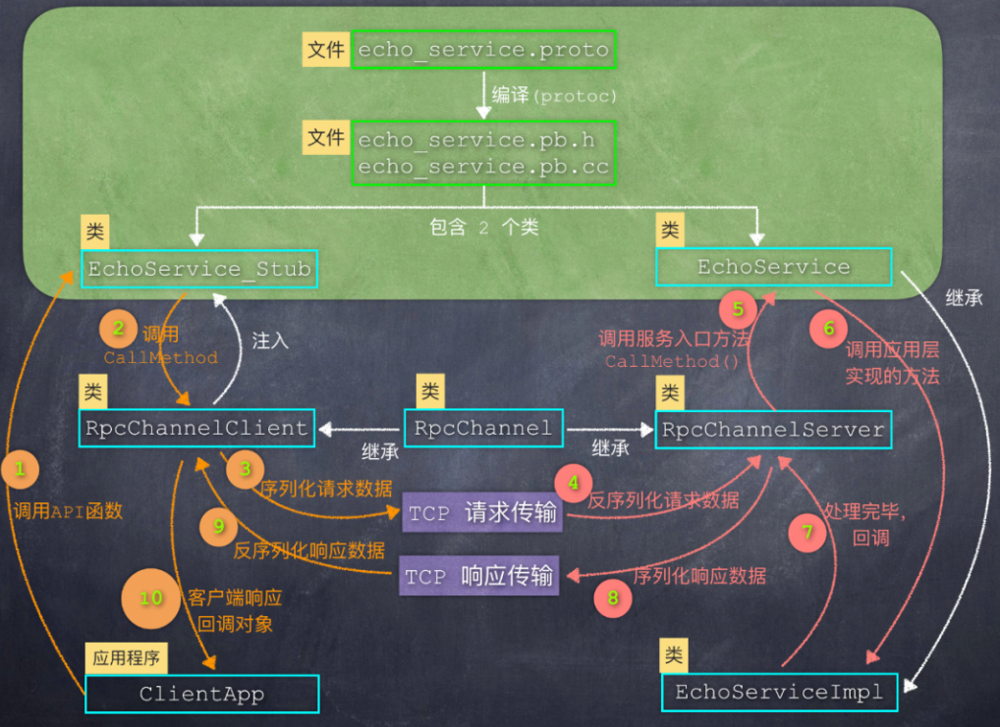

文件echo_service.proto包含了RPC服务和message两种对象, EchoService 和 EchoService_Stub提供了服务对象, 对客户端而言起到存根的作用
```cpp
class EchoService : public ::PROTOBUF_NAMESPACE_ID::Service {
    virtual void Echo(RpcController* controller, 
                    EchoRequest* request,
                    EchoResponse* response,
                    Closure* done);
                    
   virtual void Add(RpcController* controller,
                    AddRequest* request,
                    AddResponse* response,
                    Closure* done);
                    
    void CallMethod(MethodDescriptor* method,
                  RpcController* controller,
                  Message* request,
                  Message* response,
                  Closure* done);
}

class EchoService_Stub : public EchoService {
 public:
  EchoService_Stub(RpcChannel* channel);

  void Echo(RpcController* controller,
            EchoRequest* request,
            EchoResponse* response,
            Closure* done);
            
  void Add(RpcController* controller,
            AddRequest* request,
            AddResponse* response,
            Closure* done);
            
private:
    // 成员变量，比较关键
    RpcChannel* channel_;
};
```

EchoService_Stub 就相当于是客户端的代理，应用程序只要把它"当做"远程服务的替身，直接调用其中的函数就可以了
```cpp
void EchoService_Stub::Echo(RpcController* controller,
                            EchoRequest* request,
                            EchoResponse* response,
                            Closure* done) {
  channel_->CallMethod(descriptor()->method(0),
                       controller, 
                       request, 
                       response, 
                       done);
}

void EchoService_Stub::Add(RpcController* controller,
                            AddRequest* request,
                            AddResponse* response,
                            Closure* done) {
  channel_->CallMethod(descriptor()->method(1),
                       controller, 
                       request, 
                       response, 
                       done);
}
```

客户端或者服务端的本地代理_stub内部都调用了成员变量 channel_ 的 CallMethod 方法，这个成员变量的类型是 google::protobuf:RpcChannel。EchoService_Stub继承自 EchoService

channel_->CallMethod 方法会把所有的数据结构序列化之后，通过网络发送给服务器。RpcChannelClient是客户端使用的 Channel, RpcChannelServer是服务端使用的 Channel，它俩都是继承自 protobuf 提供的 RpcChannel。

自定义实现继承自google::protobuf:RpcChannel的rpcChannel, 该实现将rpcChannel和网络库回调方法绑定以及编解码, 从而基于网络库进行channel的信息传输

```cpp
void RpcChannel::CallMethod(const ::google::protobuf::MethodDescriptor* method,
                            google::protobuf::RpcController* controller,
                            const ::google::protobuf::Message* request,
                            ::google::protobuf::Message* response,
                            ::google::protobuf::Closure* done)
{
  RpcMessage message;
  message.set_type(REQUEST);
  int64_t id = id_.incrementAndGet();
  message.set_id(id);
  message.set_service(method->service()->full_name());
  message.set_method(method->name());
  message.set_request(request->SerializeAsString()); // FIXME: error check

  OutstandingCall out = { response, done };
  {
  MutexLockGuard lock(mutex_);
  outstandings_[id] = out;
  }
  codec_.send(conn_, message);
}

// codec_.send的实现
void ProtobufCodecLite::send(const TcpConnectionPtr& conn,
                             const ::google::protobuf::Message& message)
{
  // FIXME: serialize to TcpConnection::outputBuffer()
  muduo::net::Buffer buf;
  fillEmptyBuffer(&buf, message);
  conn->send(&buf); // 发送到客户端
}
```

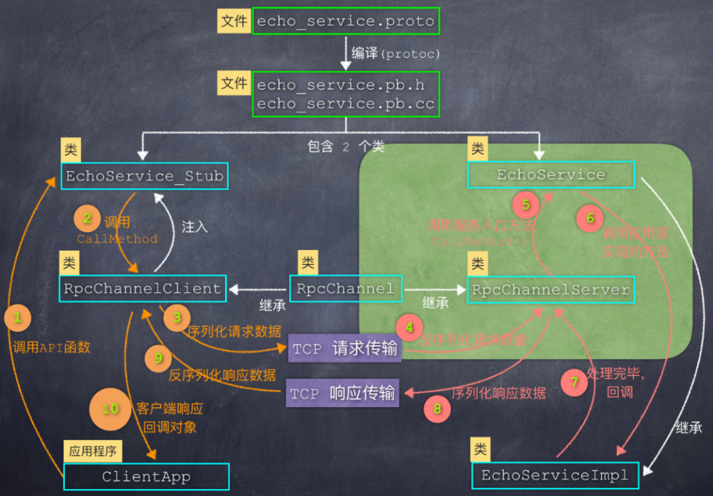

RpcChannelServer 是负责处理服务端的网络数据，当它接收到 TCP 数据之后，首先进行第一次反序列化，得到 RpcMessage 变量(RpcMessage来自.pb.h文件中)，这样就获得了 RPC 元数据，包括：消息类型(请求RPC_TYPE_REQUEST)、消息 Id、Service 名称("EchoServcie")、Method 名称("Echo")。

```cpp
RpcMessage rpcMsg;

// 第一次反序列化
rpcMsg.ParseFromString(tcpData); 

// 创建请求和响应实例
auto *serviceDesc = service->GetDescriptor();
auto *methodDesc = serviceDesc->FindMethodByName(rpcMsg.method());

// rpcChannel序列化数据
void RpcChannelImpl::onResponseDoneCB(Message *response)
{
    // 构造外层的 RPC 元数据
	RpcMessage rpcMsg;
	rpcMsg.set_type(RPC_TYPE_RESPONSE);
	rpcMsg.set_id([消息 Id]]);
	rpcMsg.set_error(RPC_ERR_SUCCESS);
	
	// 把响应对象序列化，设置到 response 字段。
	rpcMsg.set_response(response->SerializeAsString());
}

// 将rpcMessage 通过网络tcp socket发送出去
std::string message_str;
rpcMsg.SerializeToString(&message_str);
bufferevent_write(m_evBufferEvent, message_str.c_str(), message_str.size());
```

#### protobuf和反射

protobuf除了序列化反序列化还, 还提供了反射功能, 对于C++这种半面向对象, 运行时没有类型信息的语言是重大的.

反射, 简单的理解是你可以直接输入字符串来调用指定的对象函数, 例如输入`data.input`可以调用data对象的input函数.这在C++中是无法实现的, 因为运行时input函数被整合成类似`xx_data_input_`的形式, 已经和C语言的过程没有区别.换言之, 运行时只有`xx_data_input_`这样形式的函数, 并不知道该函数是属于data对象因为没有了对象信息, 自然不可用`data.input`来调用.

但有反射能力的语言可以实现, 比如Java, 
```cpp
// 运行时动态创建对象, 根据输入的字符串
Class<?> class1 = Class.forName("cn::lcy::dog");
Dog dogObj = (Dog) class1.newInstance();
// 运行时动态访问状态, 这是反射的作用, 根据字符串找到指定对象的方法
Field dogNameField = class1.getDeclaredField("name");
// 运行时动态修改状态
dogNameField.set(dogObj, "鸡你太美");
// 运行时动态修改行为
Method method = class1.getMethod("signJumpRapAndBall");
method.invoke(dogObj);`  // 相当于调用Dog对象dogObj.getMethod
```

反射实现的关键就是记录元信息, 或者说类型信息(主要是对象的类型信息, 编译时的类型信息C++可以通过模板元编程获取). 鉴于C++模板元编程的强大以及可以直接处理底层内存, 本身一定程度上实现部分反射能力, 至于动态创建对象本质也是调用类构造函数. 实际上C++对反射的需求主要体现在`通过一定规则的字符串能调用指定对象的函数`这样的功能.

ProtoBuf 能够为使用者提供了如下的反射能力
```cpp
/* 反射创建实例 */
auto descriptor = google::protobuf::DescriptorPool::generated_pool()->FindMessageTypeByName("Dog");
auto prototype = google::protobuf::MessageFactory::generated_factory()->GetPrototype(descriptor);
auto instance = prototype->New();

/* 反射相关接口 */
auto reflecter = instance.GetReflection();
// 这个很强
auto field = descriptor->FindFieldByName("name");
reflecter->SetString(&instance, field, "鸡你太美") ;

// 获取属性的值.
std::cout<<reflecter->GetString(instance , field)<< std::endl ;
```

ProtoBuf 反射所需的元信息在使用 ProtoBuf 的第一步就会接触到.proto 文件。(这其实是一种静态信息, C++模板元也可以做到)

自然获取成员方法和成员变量是通过, 一个映射表了. 鉴于C++内部是存储符号表的, 同样也可以通过映射方法来实现C++简单的反射.


```cpp
static void AddDescriptorsImpl() {
  InitDefaults();

  // .proto 内容
  static const char descriptor[] GOOGLE_PROTOBUF_ATTRIBUTE_SECTION_VARIABLE(protodesc_cold) = {
      "\n\022single_int32.proto\"\035\n\010Example1\022\021\n\010int3"
      "2Val\030\232\005 \001(\005\" \n\010Example2\022\024\n\010int32Val\030\377\377\377\377"
      "\001 \003(\005b\006proto3"
  };

  // 注册 descriptor, 用来对象池生成对象
  ::google::protobuf::DescriptorPool::InternalAddGeneratedFile(
      descriptor, 93);

  // 注册 instance, 基于工厂生成对象
  ::google::protobuf::MessageFactory::InternalRegisterGeneratedFile(
    "single_int32.proto", &protobuf_RegisterTypes);
}
```

类型信息映射表
```cpp
const ::google::protobuf::uint32 TableStruct::offsets[] GOOGLE_PROTOBUF_ATTRIBUTE_SECTION_VARIABLE(protodesc_cold) = {
  ~0u,  // no _has_bits_
  // 将会计算实例与属性的内存偏移
  GOOGLE_PROTOBUF_GENERATED_MESSAGE_FIELD_OFFSET(::Example1, _internal_metadata_),
  ~0u,  // no _extensions_
  ~0u,  // no _oneof_case_
  ~0u,  // no _weak_field_map_
  GOOGLE_PROTOBUF_GENERATED_MESSAGE_FIELD_OFFSET(::Example1, int32val_),
  ~0u,  // no _has_bits_
  GOOGLE_PROTOBUF_GENERATED_MESSAGE_FIELD_OFFSET(::Example2, _internal_metadata_),
  ~0u,  // no _extensions_
  ~0u,  // no _oneof_case_
  ~0u,  // no _weak_field_map_
  GOOGLE_PROTOBUF_GENERATED_MESSAGE_FIELD_OFFSET(::Example2, int32val_),
};

// 获取属性内存地址指针，内部根据 __
const std::string* default_ptr =
    &DefaultRaw<ArenaStringPtr>(field).Get();

// DefaultRaw 底层调用：
// reinterpret_cast<const uint8*>
// (default_instance_) +
//     OffsetValue(offsets_[field->index()], field->type());

// .......

// assign 赋值
MutableField<ArenaStringPtr>(message, field)
    ->Mutable(default_ptr, GetArena(message))
    ->assign(std::move(value));
```

整体上, protobuf把编码, 序列化, 内存池, 对象信息整合在一起. 不难想到我们可以实现这样的工具, 构造对象时不用new, 只通过内存池构造`google::protobuf::DescriptorPool::generated_pool()->FindMessageTypeByName("Dog");`

进一步整合grpc, 这将是一个庞大的框架, 一站式提供了构造对象, 对象池, 对象信息, 序列化, 对象远程调用的功能. 这种思路在应用上实际也是可行的.

### grpc

gRPC是一个高性能、通用的开源RPC框架，其由Google主要面向移动应用开发并基于HTTP/2协议标准而设计，基于ProtoBuf(Protocol Buffers)序列化协议开发。

#### 架构

gRPC 就是采用 HTTP/2 协议，并且默认采用 PB 序列化方式的一种 RPC, 同时具有权限认证的能力.传统REST相比，gRPC的一个重大改进是它使用HTTP 2作为其传输协议, 并且使用压缩方式protobuf而不是json

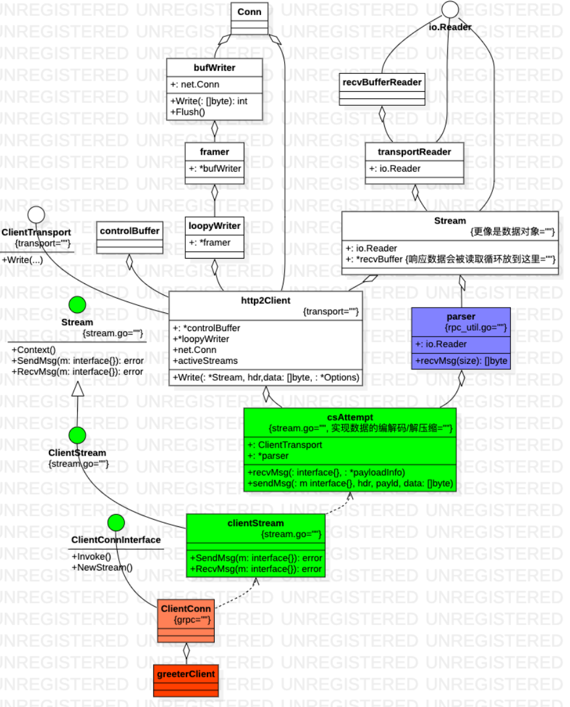

```
 	接口	实现struct	 

应用/治理层	ClientConnInterface	ClientConn	ClientConn represents a virtual connection to a conceptual endpoint, to perform RPCs
负责负载均衡及路由解析

Stream+协议层	ClientStream	clientStream	负责Stream 抽象及解压缩、协议编解码

transport层	ClientTransport	http2Client+parser	负责收发字节数据、处理流控等http2控制逻辑

tcp层	net.Conn	 	 
```

HTTP/2 传输基本单位是 Frame，Frame 格式是以固定 9 字节长度的 header，后面加上不定长的 payload 组成。

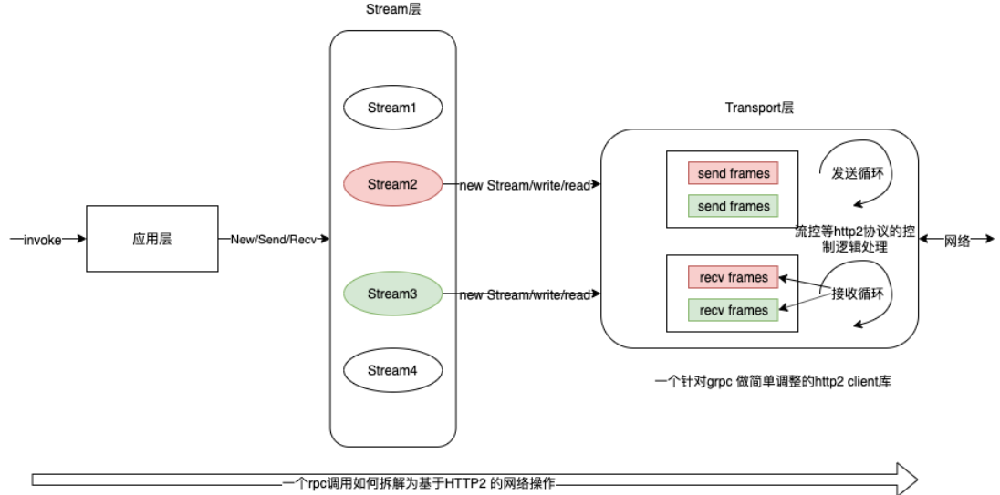
#### hello world demo

* helloworld.proto
其中有一个service为Greeter, 将会生成一个Greeter class。service作用是作为rpc服务接口, 可以封装message

HelloRequest为message, 也就是服务端和客户端可以交互的消息格式。


```cpp
package helloworld;

// The greeting service definition.
service Greeter {
  // Sends a greeting
  rpc SayHello (HelloRequest) returns (HelloReply) {}
  /// add sayhello again
  rpc SayHelloAgain (HelloRequest) returns (HelloReply) {}
}

//声明两个message The request message containing the user's name.
message HelloRequest {
  string name = 1;
}

// The response message containing the greetings
message HelloReply {
  string message = 1;
}
```

* 针对service, protocol编译器将产生一个抽象接口SearchService以及一个相应的存根实现。存根将所有的调用指向RpcChannel，它是一 个抽象接口，必须在RPC系统中对该接口进行实现。如，可以实现RpcChannel以完成序列化消息并通过HTTP方式来发送到一个服务器。

* 头文件和相关类
`helloworld.grpc.pb.h`由helloworld.proto产生, Greeter, HelloReply, HelloRequest来自生成的helloworld类

```cpp
#include <grpcpp/grpcpp.h>

#ifdef BAZEL_BUILD
#include "examples/protos/helloworld.grpc.pb.h"
#else
#include "helloworld.grpc.pb.h"
#endif

using grpc::Channel;
using grpc::ClientContext;
using grpc::Status;
using helloworld::Greeter;
using helloworld::HelloReply;
using helloworld::HelloRequest;
```

* server
server定义继承`Greeter::Service`的服务类, 该服务类内容对应于helloworld.proto message。该服务类绑定到ServerBuilder中

```cpp
/// 自定义服务类, 继承自Greeter::Service, final修饰GreeterServiceImpl, 说明其不可被继承
/// 内部所含函数对应helloworld.proto message, Service对应proto声明的service proto
class GreeterServiceImpl final : public Greeter::Service {
  /// 需要request, reply两个指针作为参数
  /// 这是被client调用的函数
  Status SayHello(ServerContext* context, const HelloRequest* request,
                  HelloReply* reply) override {
    std::string prefix("Hello ");
    /// 设置reply
    reply->set_message(prefix + request->name());
    return Status::OK;
  }

  Status SayHelloAgain(ServerContext* context, const HelloRequest* request,
                       HelloReply* reply) override {
    std::string prefix("Hello again ");
    reply->set_message(prefix + request->name());
    return Status::OK;
  }
};

void RunServer() {
  std::string server_address("0.0.0.0:50051");

  GreeterServiceImpl service;

  /// grpc相关参数
  grpc::EnableDefaultHealthCheckService(true);
  grpc::reflection::InitProtoReflectionServerBuilderPlugin();
  /// ServerBuilder类
  ServerBuilder builder;
  // Listen on the given address without any authentication mechanism.
  builder.AddListeningPort(server_address, grpc::InsecureServerCredentials());
  // Register "service" as the instance through which we'll communicate with
  // clients. In this case it corresponds to an *synchronous* service.
  /// 注册服务, 提供给client
  builder.RegisterService(&service);
  // Finally assemble the server.
  /// 从builder.BuildAndStart()构造Server类
  std::unique_ptr<Server> server(builder.BuildAndStart());
  std::cout << "Server listening on " << server_address << std::endl;

  // Wait for the server to shutdown. Note that some other thread must be
  // responsible for shutting down the server for this call to ever return.
  server->Wait();
}
```

* client

client将借Greeter::Stub调用服务端的sayhello函数

```cpp
class GreeterClient {
 public:
  GreeterClient(std::shared_ptr<Channel> channel)
      : stub_(Greeter::NewStub(channel)) {}

  // Assembles the client's payload, sends it and presents the response back
  // from the server.

  /// 函数
  std::string SayHello(const std::string& user) {
    // Data we are sending to the server.
    /// user封装到request中
    HelloRequest request;
    request.set_name(user);

    // Container for the data we expect from the server.
    HelloReply reply;

    // Context for the client. It could be used to convey extra information to
    // the server and/or tweak certain RPC behaviors.
    ClientContext context;

    // The actual RPC.
    /// 发送&context, request, &reply
    /// 这里实际上是要调用server的sayHello函数
    Status status = stub_->SayHello(&context, request, &reply);

    // Act upon its status.
    if (status.ok()) {
      /// 返回reply.message
      return reply.message();
    } else {
      std::cout << status.error_code() << ": " << status.error_message()
                << std::endl;
      return "RPC failed";
    }
  }
 private:
  std::unique_ptr<Greeter::Stub> stub_;
};
```

对应的CMakeList.txt文件
```cpp
cmake_minimum_required(VERSION 3.5.1)

project(HelloWorld C CXX)

include(../cmake/common.cmake)

# Proto file, 得到proto文件
get_filename_component(hw_proto "../../protos/helloworld.proto" ABSOLUTE)
get_filename_component(hw_proto_path "${hw_proto}" PATH)

# Generated sources, 从proto文件生成对应的pb.h grpc.pb.h
set(hw_proto_srcs "${CMAKE_CURRENT_BINARY_DIR}/helloworld.pb.cc")
set(hw_proto_hdrs "${CMAKE_CURRENT_BINARY_DIR}/helloworld.pb.h")
set(hw_grpc_srcs "${CMAKE_CURRENT_BINARY_DIR}/helloworld.grpc.pb.cc")
set(hw_grpc_hdrs "${CMAKE_CURRENT_BINARY_DIR}/helloworld.grpc.pb.h")
# 根据hw_proto, 生成hw_proto_srcs等
add_custom_command(
      OUTPUT "${hw_proto_srcs}" "${hw_proto_hdrs}" "${hw_grpc_srcs}" "${hw_grpc_hdrs}"
      COMMAND ${_PROTOBUF_PROTOC}
      ARGS --grpc_out "${CMAKE_CURRENT_BINARY_DIR}"
        --cpp_out "${CMAKE_CURRENT_BINARY_DIR}"
        -I "${hw_proto_path}"
        --plugin=protoc-gen-grpc="${_GRPC_CPP_PLUGIN_EXECUTABLE}"
        "${hw_proto}"
      DEPENDS "${hw_proto}")

# Include generated *.pb.h files
include_directories("${CMAKE_CURRENT_BINARY_DIR}")

# hw_grpc_proto
add_library(hw_grpc_proto
  ${hw_grpc_srcs}
  ${hw_grpc_hdrs}
  ${hw_proto_srcs}
  ${hw_proto_hdrs})
target_link_libraries(hw_grpc_proto
  ${_REFLECTION}
  ${_GRPC_GRPCPP}
  ${_PROTOBUF_LIBPROTOBUF})

# Targets greeter_[async_](client|server)
# 循环构建 add_executable
foreach(_target
  greeter_client greeter_server 
  greeter_callback_client greeter_callback_server 
  greeter_async_client greeter_async_client2 greeter_async_server)

  add_executable(${_target} "${_target}.cc")
  target_link_libraries(${_target}
    hw_grpc_proto
    ${_REFLECTION}
    ${_GRPC_GRPCPP}
    ${_PROTOBUF_LIBPROTOBUF})
endforeach()
```

#### 使用http2的grpc

抓包, 请求， 过程大概分为10个。
```
TCP三次握手
Magic (发送hello)
SETTINGS
HEADERS
DATA
WINDOW_UPDATE, PING
PING(pong)
HEADERS, DATA
WINDOW_UPDATE, PING
PING(pong)
```
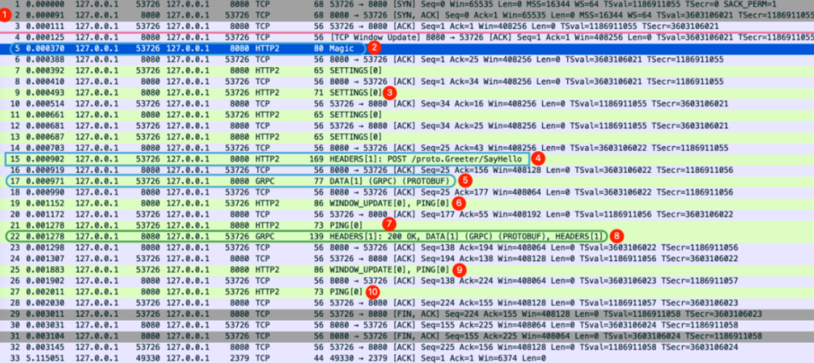

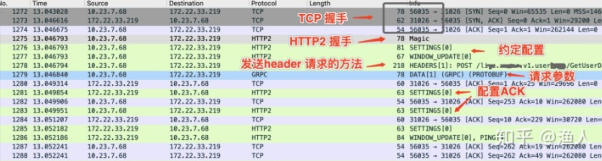

请求返回
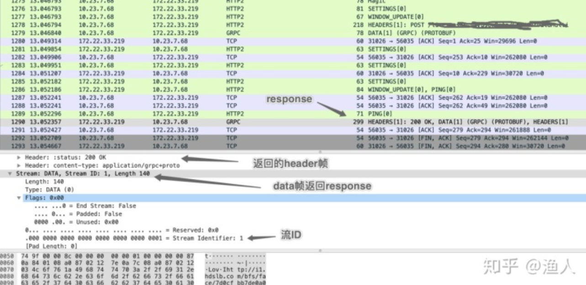

约定配置，SETTINGS帧有ACK表达确认

* 请求的Method在header中传递
* 参数用DATA帧
* 返回状态用HEADER帧
* 返回数据用DATA帧

Magic
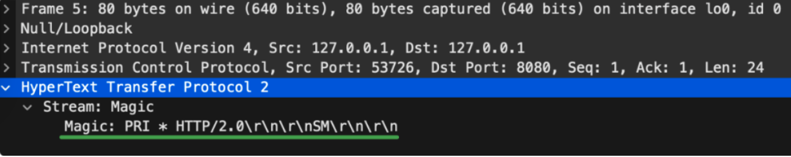
SETTINGS
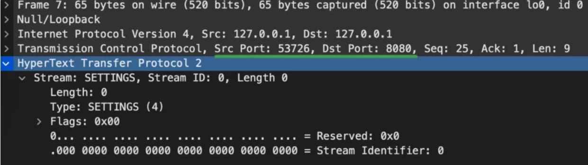

HEADERS
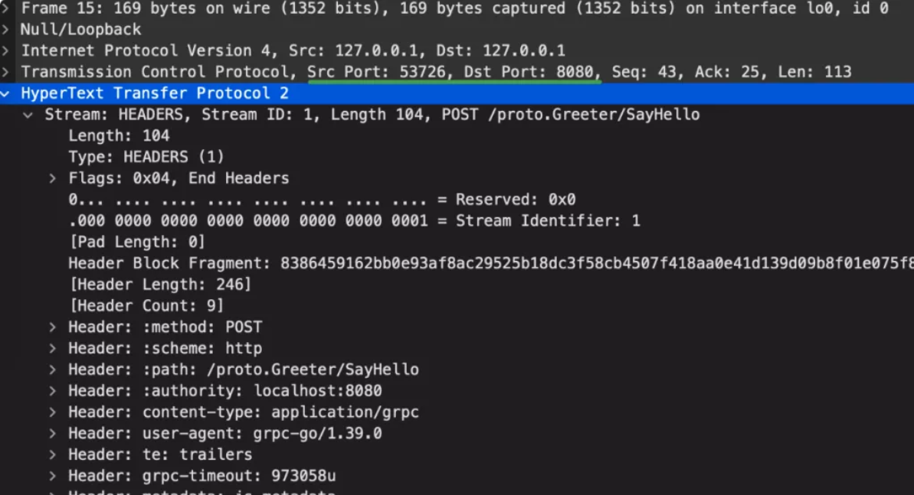

DATA,填充主体信息，是数据帧。
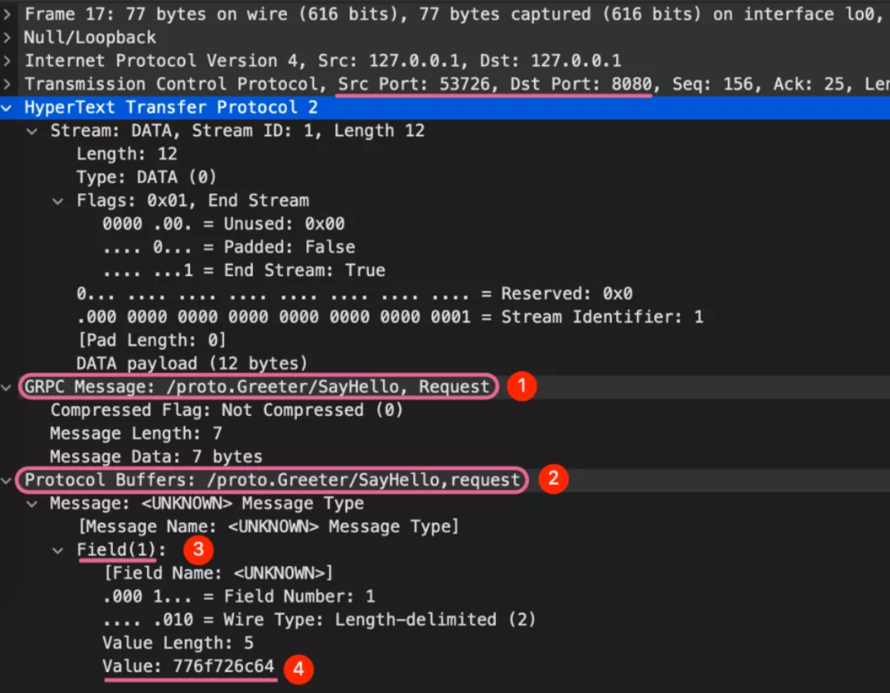

WINDOW_UPDATE
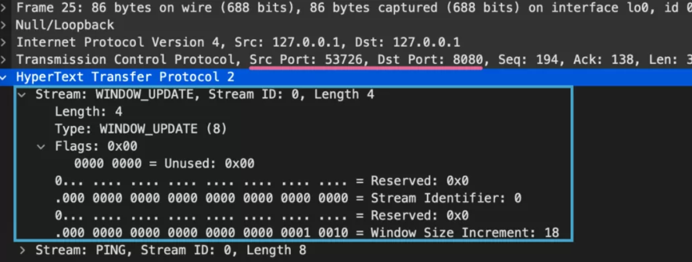

PING
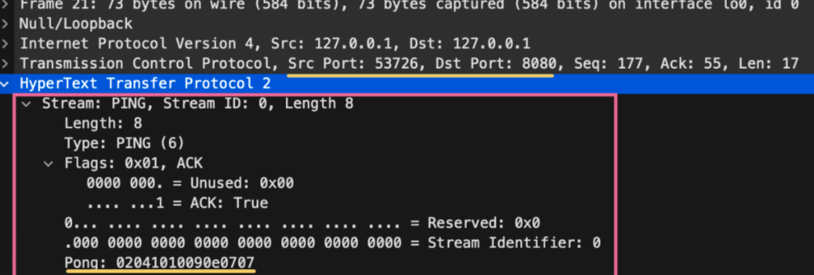

1. gRpc在三次握手之后，客户端/服务端会发送连接前言(Magic+SETTINGS)以确立协议和配置
2. gRpc在传输数据过程中会设计滑动窗口(WINDOW_UPDATE)等流控策略
3. gRpc附加信息基于HEADERS帧进行传递，例如服务地址(即调用的服务位置)位于HEADERS帧, 具体的请求/响应数据存储在DATA帧中, 即序列化后的对象存储在DATA帧
4. gRpc请求/响应结果分为HTTP和gRpc状态响应(grpc-status、grpc-message)两种类型
5. 如果服务端发起PING，客户端会响应PONG，反之亦然