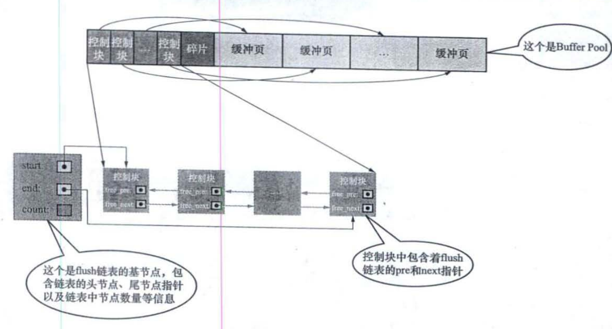
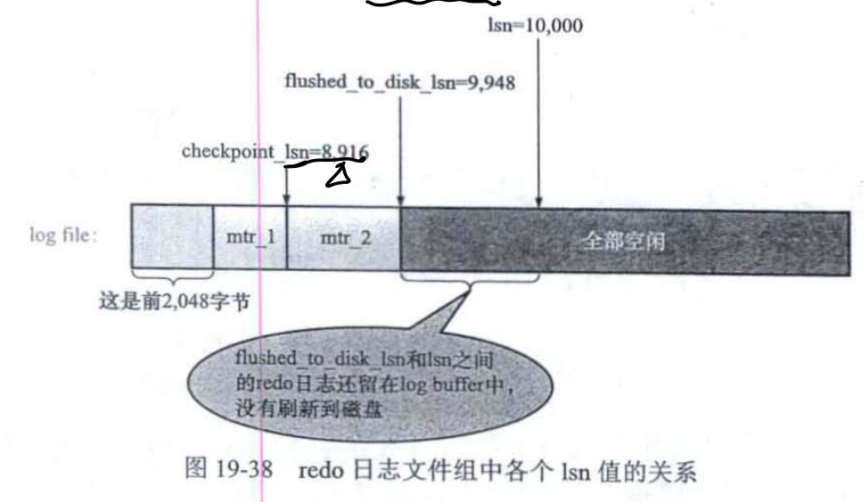
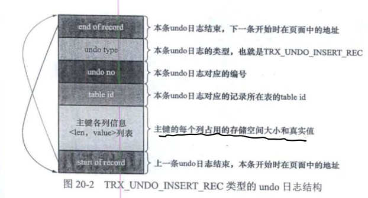
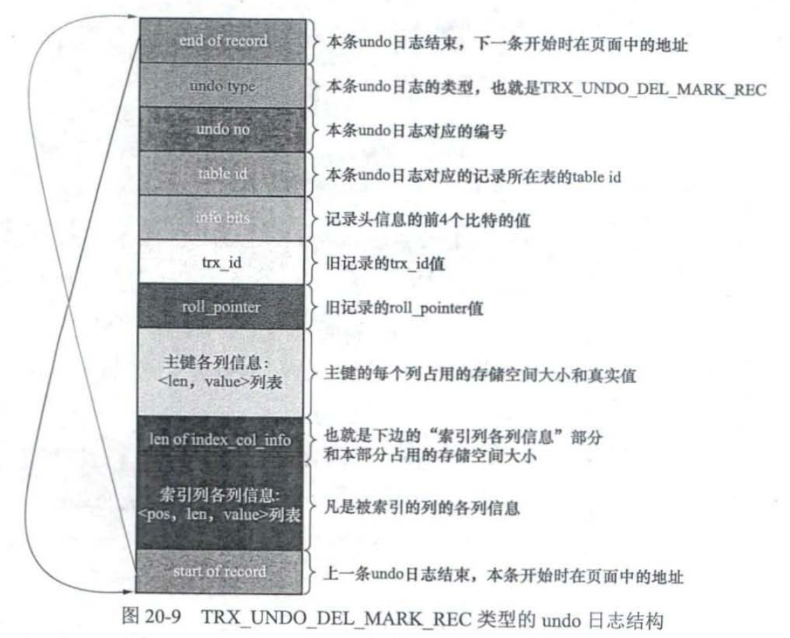
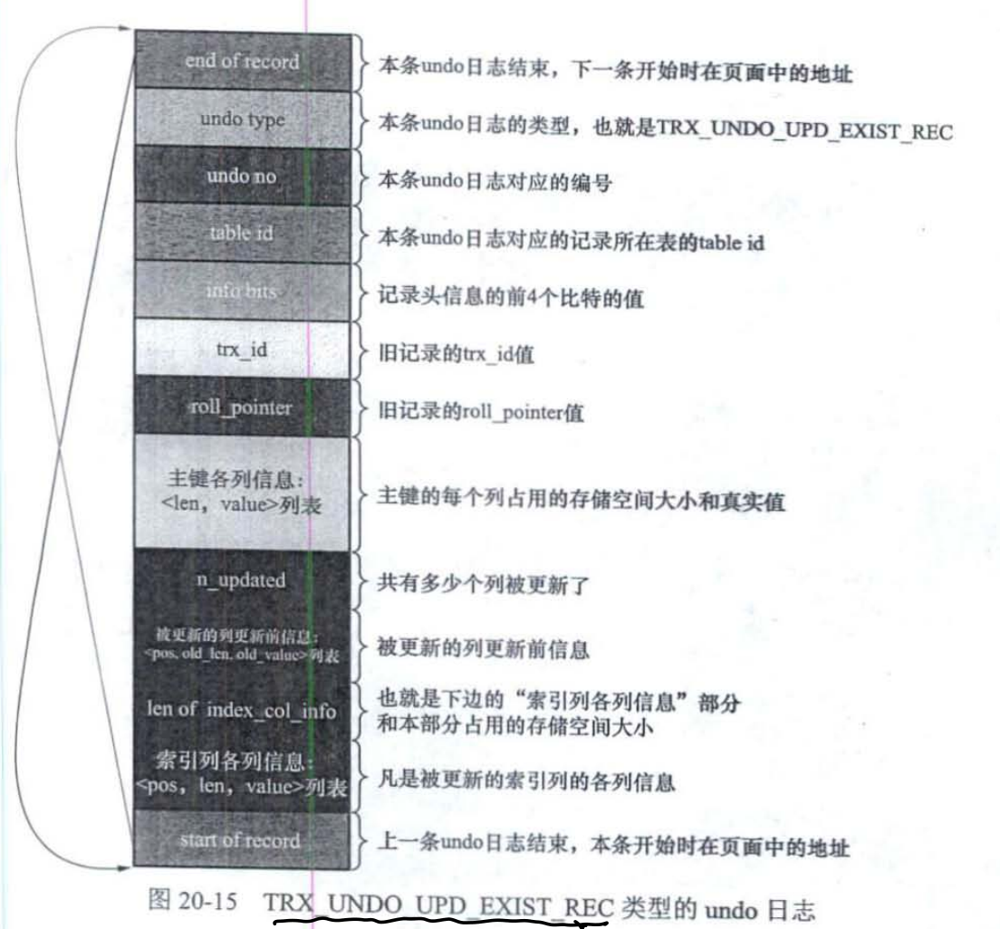
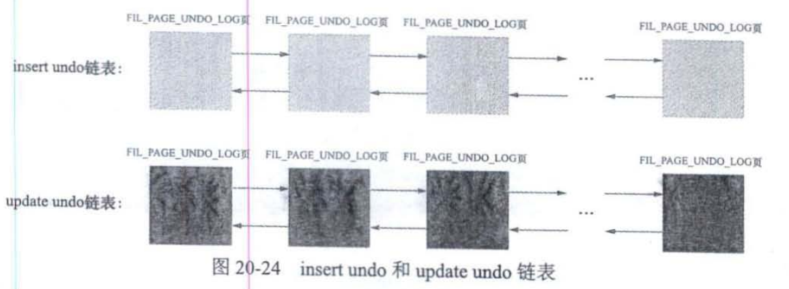
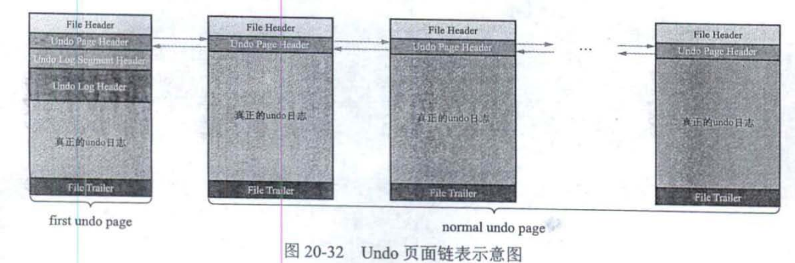
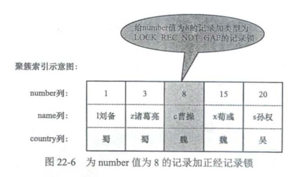
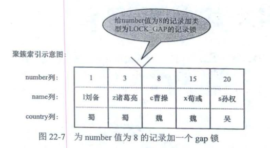
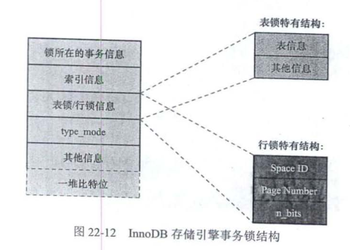

### 缓存

对于使用InnoDB存储引擎的表,无论是存储用户数据的索引(包括聚簇索引和二级索引),还是各种系统数据,都是以页的形式存储在表空间中。实际上索引等数据主要还是存储在磁盘,当使用时读取到I/O缓冲区读取,和文件没有太大不同。为了提高访问效率,InnoDB存储引擎如果需要访问某个页的数据,就会把完整的页全部加载到内存中, 内存中的数据起到磁盘缓存的作用， 即Buffer pool。由于内存是有限的,使用缓存就需要考虑到数据页的换入换出。

#### 缓冲页和freelist
Buffer Pool对应的一片连续的内存被划分为若干个页面, 页面大小与InnoDB表空间使用的页面大小一致,默认16KB(因为本身是磁盘页的赋值)。这些页面称之为缓冲页。每个缓冲页有一些控制信息, 包含该页所属的表空间编号, 页号, 地址,链表节点信息等。

刚刚初始化的Buffer Pool, 所有的缓冲页都是空闲的, **每一个缓冲页对应的控制块都会加入到free双向链表中**。每当需要从磁盘加载一个页到Buffer Pool中时，就从free链表取一个空闲的缓冲页, 把该缓冲页对应的控制块信息填入, 将控制块从free链表中移除表示该缓冲页已经使用了。


一般的，如果要访问某个页的数据，需要从磁盘中加载一个页到Buffer Pool中, 如果要访问的页已经在Buffer Pool中, 直接使用就可以不用从磁盘拿数据。直接判断该页是否存在于Buffer pool可以使用哈希, 以页的位置**表空间号+页号**作为key,以缓冲页控制块地址作为value建立哈希表。 缓冲页注意由free链表, flush链表, 

访问某个页数据时先根据表空间号+页号看看哈希表中是否有对应的缓冲页,如果有直接用缓冲页,如果没有就从free链表中选一个空闲的缓冲页,把磁盘中对应的页加载到该缓冲区的位置。然后将缓冲页对应free链表节点(也就是对应的控制块)移除,说明缓冲页可以用了。如果缓存释放,将这块区域再加入free链表。

当修改了Buffer Pool缓冲页的数据, 它就与磁盘上的页不一样了, 这样的缓冲页也称为脏页。频繁向磁盘中写数据会影响数据库的性能,因此对于脏页我们不立刻刷入磁盘,而是在某个时间点集体刷。为了判断哪些是脏页，通过创建一个存储脏页的链表,也就是flush链表,该链表和free链表差不多。某个缓冲页不可能既是free链表的节点, 又是flush链表的节点。

#### LRU链表 Least Recently Used

LRU链表, 留下最近最频繁使用的数据。实现方式很简单,用到某个缓冲页,就把该缓冲页移动到LRU链表的头部。
1. 如果该页不在Buffer Pool, 把该页从磁盘加载到Buffer Pool的缓冲页时,同时把该缓冲页对应的控制块作为节点放到LRU的头部
2. 如果该页已经在Buffer Pool中, 把该页直接移动到头部。

注意LRU链表是和free list, flush list同时存在的链表, 但只要从磁盘中加载一个页面到Buffer Pool的缓冲页中, 该缓冲页对应的控制块就会作为一个节点加入到LRU链表中, 从free list中删除。LRU的节点可能分配空间但没有写数据, 因此可能不是脏页, 但flush链表的节点(脏页)肯定包含在LRU链表中。

这种方式在MYSQL中存在问题, 因为
1. 预读,InnoDB将当前页写入到内存时, 认为后面还会读一些页面,所以会把后面一些页也读入内存,其实我们只需要一个页, 其他页并不是LRU(Least Recently Used)的页
2. 全表扫描, 全表扫描可能读一些进来然后这一些出去再读一些进来, LRU链表会频繁加入删除, 而且不存在最近频繁使用的原则。

解决以上问题, InnoDB将LRU链表按比例分两截, 一部分存储使用频率非常高的缓冲页, 称为热数据young 区域; 另一部分使用频率不高,称为冷数据或者old区域。LRU的优化目标就是尽可能地提高Buffer Pool地命中率。


1. 对于预读的页面,直接放到old区域的头部,这样不会影响young区域使用频繁的缓冲页
2. 设置innodb_old_blocks_time表示多次访问同一个页面时间低于innodb_old_blocks_time的不会进入young区域,显然全表扫描符合条件,页面不会进入young区域。

后台有线程负责每隔一段时间就把脏页刷新到磁盘, 刷新方式
1. 从LRU链表地冷数据中刷新一部分页面到磁盘, 定时扫描发现脏页刷入磁盘, 称为BUF_FLUSH_LRU
2. 从flush链表中刷新一部分到磁盘, 定时,速率取决于系统是否繁忙, 称为BUF_FLUSH_LIST


<!-- more -->
### 事务 transaction 和日志log

#### 事务简介

事务的特性 AICD
1. 原子性 Atomicity, 操作不可分割, 要么全部做完且成功, 要么不做(回滚解决)。
2. 隔离性 Isolation, 其他的操作不会影响本次操作(例如多线程), 事务隔离就是其他事务不要影响本事务(事务隔离级别, MVCC, 记录锁间隙锁解决)。
3. 一致性 Consistency 应用系统从一个正确的状态到另一个正确的状态。可以说AID都是来保证C。
4. 持久性 Durability 状态转移发生后 , 转换的结果永久保留不可更改。也就是事务持久化到硬盘。

事务的状态包括, 活动的(active), 部分提交的(partially committed), 提交的(committed), 失败的(failed), 中止的(aborted)。只有一个事务处于提交和中止的状态, 一个事务处于提交或者中止状态其生命周期才算结束。对于中止状态的事务，该事务对数据所做的所有修改都会被回滚到没执行该事务之前的状态。

保证事务原子性,持久性依靠的是undo日志和redo日志。


事务的语法

```
BEGIN;  #开启一个事务
UPDATE account SET balance = blance-10 WHERE id=1;
UPDATE account SET balance = blance+10 WHERE id=2;
COMMIT; # 提交 或者 ROLLBACK # 回滚
```
注意即使没有COMMIT;如果执行其他语句, 例如`create`, 前面的事务指令将自动提交, 称为隐式提交。

保存点

可以在事务中加入保存点`SAVEPOINT`, 回滚到指定的保存点。这样可以保证ROLLBACK不至于回滚到事务开始, 一夜回到解放前。

```
BEGIN;
UPDATE account SET balance = balance - 10 WHERE id = 1;
SAVEPOINT s1;
UPDATE account SET blance = blance + 1 WHERE id = 2;
ROLLBACK TO s1;
```


#### redo日志

redo日志可以理解为WAL(Write Ahead Log), 对于一个已经提交的事务. 在事务提交之后即使系统发生了崩溃, 对数据库做的更改也不能丢失。但为了提高IO速率, 事务提交往往提交在buffer pool, redo日志的作用就是防止因内存故障导致的数据丢失, 但当数据持久化到磁盘就应该山川相关的日志。

日志是一般是写入日志缓冲，这些缓冲将高频率刷入磁盘, 一般不需要考虑日志丢失的问题。日志采用的方式是顺序写，这远远高于B树数据的随机写速率。redo日志有以下好处

1. redo日志占用空间小, 只存储表空间id, 页号, 偏移量以及要更新的值。
2. redo日志顺序写入磁盘， 顺序IO

**Redo日志的本质是记录事务对数据库做了哪些修改, 例如记录数据库位置(表空间+页号), 修改的内容(命令)**。可以认为是一种增量的存储。利用日志恢复时，需要重新执行日志存储的修改命令。

定位一个存储为止可用表空间+页号


type日志类型, space ID表空间ID, page number页号, data具体内容

一条INSERT语句可能要修改很多, 表中包含多少个索引一条INSERT语句就可能更新多少B+树, 而且针对某棵B+树来说既可能更新叶子节点页面, 也可能更新内节点页面, 还可能创建新的页面。

* redo block和buffer

redo日志放在了大小为512字节的页中, 称为block。redo日志存储在496字节的log block body中, log block header和log block trailer存储的是一些管理信息。


服务器启动时会将操作系统申请大片redo log buffer redo日志缓冲区, 因此redo日志并不是直接写入到磁盘中。redo log buffer空间可以划分为若干个连续的redo log block, 向log buffer中写入redo 日志时顺序写入到log block body中。显然redo日志并不是直接落盘的, 这存在无法恢复的风险。


redo buffer的flush时机
1. log buffer空间不足(redo日志量占50%左右),log buffer时优先的,不够了就得把一些放入磁盘中
2. 事务提交
3. 后台一个线程大概1s一次的时机将redo日志缓冲区进行刷盘。
4. 正常关闭服务器时
5. 做checkpoint时

* redo日志文件格式

以上是redo日志在内存中的存储格式, 接下来是日志刷入磁盘后文件中redo日志文件格式。MYSQL的数据目录(可使用`SHOW VARIABLES LIKE 'datadir'`命令)默认有`iblogfile`文件, log buffer的日志默认刷新到这两个磁盘文件中。redo日志文件组中每个文件大小都一样, 格式也一样。前2048个字节可分为4个特殊block, 从2048字节往后存储log buffer中的block镜像。


* log sequence number

自系统开始运行, 就在不断修改页面, 意味着不断生成redo日志。每个redo日志赋予一个序列号。log sequence number是一个递增的序号, lsn之越小说明日志阐述的越早。

redo日志先写到log buffer中再刷新到磁盘的redo日志文件中, buf_next_to_write全局变量来标识当前log buffer哪些日志刷新到磁盘中了, 显然sequence应该大于等于buf_next_to_write。lsn的值可以表示系统写入到redo日志量的总和。


日志刷盘以MTR的形式将产生一组redo日志写入到log buffer中, 同时将修改过的页面加入到Buffer pool的flush链表中, flush链表中的脏页可以根据lsn排序, 即前面的修改时间比较晚, 后面的比较早。


脏页是Linux内核中的概念，因为硬盘的读写速度远赶不上内存的速度，系统就把读写比较频繁的数据事先放到内存中，以提高读写速度，这就叫高速缓存，linux是以页作为高速缓存的单位，当进程修改了高速缓存里的数据时，该页就被内核标记为脏页，内核将会在合适的时间把脏页的数据写到磁盘中去，以保持高速缓存中的数据和磁盘中的数据是一致的。因此缓存中的日志内容就是脏页。

* checkpoint

redo日志文件容量是有限的, 且redo日志只是为了系统崩溃后恢复脏页(恢复内存)用的, 如果对应的脏页已经刷新到磁盘中, 即使现在系统崩溃重启后也不用恢复页面,redo日志也就没用了。InnoDB使用一个全局变量checkpoint_lsn, 记录当前系统可以覆盖的日志容量。当页a被刷新到了磁盘上,关于其的redo日志就可以覆盖率, 于是增加checkpoint_lsn, 这个过程称为执行一次checkpoint



checkpoint执行时会把checkpoint_lsn内容写入到redo日志中, 具体的, 将checkpoint_lsn与对应的redo日志文件偏移量以及此次checkpoint的编号写到日志文件的管理信息中。用户线程会批量从flush链表中刷出脏页。


为了保证事务的持久性, 用户线程在事务提交时需要将该事务执行过程中产生的所有redo日志都刷新到磁盘中, 这会大大降低数据库性能, 可以设置不立即同步而是由后台线程处理。

* 崩溃恢复

对于lsn小于checkpoint_lsn的redo日志来说, 它们已经写入了磁盘,缓冲区时可以被覆盖的。对于lsn不小于checkpoint_lsn的日志, 就需要根据对应的redo日志开始恢复页面。

恢复时, 首先确定**恢复起始点, 也就是最近发生的那次checkpoint的信息**,checkpoint_lsn本作为日志被覆盖的点, 如果要恢复的lsn>=checkpoint_lsn,这时候从checkpoint_lsn为起点恢复(其实就是最近的一个checkpoint_lsn), 因为可以确信checkpoint_lsn之前的数据均已刷盘。 然后确定恢复的终点, redo日志是按照block(512字节)写入的, 写满一个block继续写下一个block, 恢复的终点是最后一个满的block redo日志。


#### undo日志

redo日志的目的是恢复, 换言之恢复内存崩溃的数据, 它是存在磁盘中的真WAL日志。但为了满足事务的原子性，要么做完，要么不做。有可能做了一般需要回滚，因此还需要一类可以撤销已经执行任务的日志，也就是undo日志, **undo日志是存在内存中的, 目的是满足事务的回滚以及解决事务的并发控制**。Redo日志的作用是将执行的命令等持久化磁盘以保证将未做完的做完, Undo日志的作用是记录过去时刻的快照以恢复到过去时候的样子。

当对一条记录进行改动时(INSERT, UPDATE, DELETE),需要记录回滚的内容。插入一条记录时至少把这条记录主键记录，这样回滚只需要删除这个记录; 删除一条记录则要把这条记录所有内容记录,回滚时需将这些内容插入表; 修改一个记录，需要把旧值记录下来以实现回滚。

事务ID和trx_id隐藏列, 

* INSERT操作的undo日志

向表中插入一条记录有乐观插入和悲观插入的区分, 如果希望回滚这个插入操作只需要把记录删除就好了, 这时候只需要记录主键信息。



* DELETE操作的undo日志

插入到页面的记录会根据头信息中的next_record属性组成一个单向链表, 这个链表可称为正常记录链表; 被删除的记录也根据头信息中的next_record组成删除链表, 这个链表可称为垃圾链表。而在事务中的DELETE删除操作, 位于记录链表中该记录会将一个标志deleted_flag设置为1, 在删除语句提交之之后才放到删除列表中。

由于事务提交后不需要回滚这个事务, 隐藏对DELETE操作的undo日志只需要关心delete_flag的设置位置, 注意roll_pointer将所有trx_id的版本串成一个版本链。



* UPDATE操作的undo日志

UPDATE语句中, InnoDB对更新主键和不更新主键两种情况有截然不同的处理方案。

如果不更新主键, UPDATE操作可以找到记录位置就地更新, 这种undo日志直接通过TRX_UNDO_UPD_EXIST_REC记录更新的列即可; 也可以先把记录删除掉再插入。针对不更新主键的情况, 采用TRX_UNDO_UPD_EXIST_REC的undo日志, 这个日志和delete操作的TRX_UNDO_UPD_EXIST_REC的undo日志是类似的



如果更新了主键, **由于聚簇索引中记录已经按照主键值的大小连成了单向链表,更新主键一位置记录在聚簇索引的位置会发生改变**。这时候
1. 将旧记录delete mark操作, 不立即删除而是先进行delete mark
2. 根据更新后的列创建一条新纪录，并插入到聚簇索引中。因为新记录的主键值已经发生变化
这种方式的undo日志相当于以上DELETE+INSERT两条。

undo log是逻辑日志，对事务回滚时，只是将数据库逻辑地恢复到原来的样子，而redo log是物理日志，记录的是数据页的物理变化。

单个事务的UNDO页面链表, 一个事务可能包含多个语句, 每条记录改动前都需要记录undo日志


* undo日志具体写入过程

段segment是一个逻辑上的概念, 本质上由若干个零散页面和若干个完整的区组成, 例如B+树索引划分为两个段, 叶子节点段和非叶子节点段。叶子节点就可以尽可能存放在一起, 非叶子节点也尽量存放在一起。每个段对应INODE Entry结构, 描述了这个段的各种信息。为了定位INODE Entry可以通过表空间ID, 页号, 页内偏移量

每个Undo页面链表都对应一个段, 称为Undo Log Segment。这个段由Undo日志组成的链表组成, 值得注意的是段隶属于表空间


### 事务隔离级别

数据库可以理解成全局变量, 多个事务可能会操作一个记录, 这就造成类似多线程的一致性问题。事务并发执行时的一致性问题可能有

1. 脏写 Dirty Write, 一个事务修改了另一个未提交事务已经修改过的数据。(修改了其他事务未提交修改的数据)

脏写最大问题是破坏原子性和持久性, 例如`w1[x=2]w2[x=3]w2[y=3]c2a1`, 其中`w1[x=2]`表示事务T1修改了x值为2, c2表示事务2提交,a1表示T1中止。这时T1没有提交前T2修改了它的数据`w2[x=3]`然后提交, 但T2提交后T1中止, 如果回滚T1就不知道x该设置成多少, 设置成3破坏T1的原子性, 设置成2破坏T2的持久性。当然脏写还会导致一致性问题，因此一般来说脏写是不可接受的。

2. 脏读 Dirty Read, 一个事务读到了另一个未提交事务修改过的数据 (读了其他事务未提交修改的数据)

脏读可能导致一致性问题, 简单的就是T1读到的数据是T2未提交的,T2还可以改, 从而T1读到的数据是不一致的。而且可能该中间数据相比T2修改前后的数据危害更大。 例如`w2[x=1]w2[y=0]r1[x=1]r1[y=0]c1w2[y=1]c2` T1读的数据y=0是中间数据，既不是最后T2提交的y=2,也不是原本的数据, 而是T2中间修改的y=1。所以脏读危害也是较大的。

3. 不可重复读 Non-Repeatable Read 一个事务修改了另一个未提交事务**读取**的数据。或者叫模糊读。(修改了其他事务未提交读取的数据)。

不可重复读会导致不一致状态, 例如`r1[x=0]w2[x=1]w2[y=1]c2r1[y=1]c1`这里T1是个只读任务, 先读取x=0, 但随后T2修改了x=1,y=1并提交, 造成T1读取的x=0是不一致的。这里不是脏读因为T1读y=1时T2已经提交。相比于脏读, 不可重复读只会造成新旧数据的不一致, 即T1只会读取旧数据x=0而不会读取T2修改数据的中间变量, 因此危害小于脏读。

* 幻读 Phantom 一个事务查询一些记录, 该事务未提交时, 另一个事务写入了那些符合条件的记录(写入可以是INSERT, DELETE, UPDATE), 称为幻读。

幻读和不可重复读都是读取了另一条已经提交的事务(这点就脏读不同)，在提交前被其他事务修改。不同的是不可重复读查询的都是同一个数据项，而幻读针对的是一批数据整体(比如数据的个数)。

脏读和脏写都是修改(读取)**其他未提交事务修改的数据**, 严重性, 脏写 > 脏读 > 不可重复读 > 幻读

隔离级别就是事务与事务之间的隔离关系, 隔离级别越低就越可能发生严重的问题。四个隔离级别由低到高分别是
1. READ UNCOMMITTED 未提交读
2. READ COMMITTED 已提交读
3. REPEATABLE READ 可重复读
4. SERIALIZABLE 可串行化

不同隔离级别下可能发生的一致性问题, 注意脏写不仅影响一致性，还影响原子性和持久性，因此所有隔离级别都不允许脏写。而REPEATABLE READ 可重复读的隔离级别下可以很大程度避免幻读。


MYSQL的默认隔离级别是REPEATABLE READ 可重复读。


### MVCC Muti-Version Concurrency Control 多版本并发控制

MVCC可以解决不可重复读的问题, 即防止一个事务修改其他事务读过的事务

#### 版本链
对于使用InnoDB存储引擎的表来说, 它的聚簇索引记录都包含两个必要的列`trx_id`,`roll_pointer`。trx_id, 一个事务每次对某条聚簇索引进行改动时都会把该事务的事务id赋值给trx_id隐藏列, 因此trx_id为最新修改数据的事务。roll_pointer, 每次对某条聚簇索引记录进行改动时, 都会把旧的版本写入到Undo日志中。

注意到undo日志也都有一个roll pointer, 每次更新该记录时都会把旧值放到一条undo日志中, 因此所有更新的版本通过roll pointer可以将undo日志串成一个版本链。对于insert因为没有更新(新加的), 就不设置roll pointer的值。

**trx_id和roll_pointer是MVCC最重要的两个字段, roll_pointer将undo日志串成了一个链表**。这样聚簇索引和undo日志通过roll pointer形成更新过程的版本链, 通过自身的trx_id判断这是通过哪个事务执行的。


#### READVIEW

对于使用READ UNCOMMITTED未提交读的隔离级别事务来说，因为不保证脏读, 可以读到未提交事务修改过的记录，那么直接读取最新版本的记录即可(哪怕被别的未提交事务修改过, 但无所谓)。对于使用SERIALIZABLE可串行化隔离级别的事务来说, InnoDB通过加锁的方式访问记录使不出现重复读和幻读。

使用READ COMMITTED提交读和REPEATABLE READ重复读隔离级别事务，必须保证读到已经提交的事务修改的记录(读完了数据可以被其他事务修改, 读之前修改该记录的事务均已提交)。由于版本链是某记录所有的修改历史, 因此核心就是确定版本链中的哪些事务对当前事务可见(因此有可能读到老版本的记录而不是最新版本, 但不用加锁)

**ReadView可以认为保存了当前所有活跃的事务信息**, 一致性视图用来解决MVCC多版本控制问题, 注意包括以下重要内容
1. m_ids: 生成ReadView时系统活跃的读写事务的id列表
2. min_trx_id, 生成ReadView时,系统活跃读写事务中的最小id
3. max_trx_id, 生成ReadView时, 系统应该分配给下一个事务的id值
4. creator_trx_id:生成该ReadView的事务的事务id

MYSQL中READ COMMITTED提交读和REPEATABLE READ重复读隔离级别区别在于生成ReadView的时机不同, READ COMMITTED提交读每次读取数据前事务都会生成一个ReadView, REPEATABLE READ重复读值在第一次读取数据时事务生成一个ReadView。

当事务访问某条记录时
1. 如果被访问数据版本的trx_id于ReadView的creator_trx_id相同, 说明当前事务访问它修改过的记录, 可以访问当前版本数据
2. 被访问数据版本的trx_id小于ReadView的min_trx_id(修改数据版本的trx_id已经不活跃了), 说明生成该版本的事务在生成ReadView前已经提交, 可以访问当前版本数据
3. 被访问数据版本的trx_id大于等于ReadView的max_trx_id, 说明当前事务生成readview后数据被其他事务修改过, 不能访问。由于ReadView生成时机不同, 这是READ COMMITTED提交读和REPEATABLE READ重复读隔离级别差距最大的地方。
4. 如果访问数据版本的trx_id位于min_trx_id和max_trx_id之间, 则需要判断是否在m_id列表中, 如果在, 说明创建readview时修改数据的事务尚活跃(没提交)，不可访问该版本。

既然是版本链, 则不可能在事务提交前将某个记录删除(即使该事务执行了删除记录), 因为需要保存数据历史版本, 所以使用一个delete mark标志删除版本

对于一个事务, REPEATABLE READ只会在第一次读(select)生成ReadView(即该select时活跃事务情况), 之后如果再有select操作则复用第一次生成的ReadView, 这样多次读情况下每次读到的数据版本都是一样, 避免了不可重复读。但是不能解决幻读, 因为幻读是获取数据的统计信息如数据总数, ReadView只是针对某个记录的信息(保证了不能修改不能保证数据插入), 间隙锁阻止了数据插入从而可以解决幻读。

二级索引条件下, 二级索引页面的Page Header部分有PAGE_MAX_IRX_ID的属性, 如果对该记录进行增删改操作时的事务ID大于PAGE_MAX_IRX_ID, 就会把该事务ID设置为新的PAGE_MAX_IRX_ID, 如果该事务ID大于PAGE_MAX_IRX_ID则该索引下所有记录均对ReadView可见, 否则回表判断可见性。

由此可见, 所谓的MVCC就是在使用READ COMMITTED, REPEATABLE READ这两种隔离级别的事务在执行SELECT操作时访问记录版本链的过程, 这需要事务id递增, trx_id记录, readview, roll_pointer链指针的支撑。**MVCC利用版本控制可以使不同事务的读-写, 写-读并发执行, 提高系统性能。但写-写只能加锁**。

### 锁

并发访问相同事务(全局变量)大致可以分为三种
1. 读-读情况, 并发事务相继读取相同的记录, 读操作不会对记录有影响,这种情况没有什么问题
2. 写-写情况, 并发事务相继对相同的记录进行改动
3. 读-写或写-读情况, 一个事务进行读操作, 一个写操作。

锁本质上是一个内存中的结构,数据/共享变量/记录可以看成某个内存块, 事务执行之前没有锁, 也就是没有锁结构和记录关联(两个内存块关联)。

当一个事务想对记录改动时, 首先判断有没有和记录关联的锁结构,如果没有就在内存中生成锁结构与之关联,线程上锁也类似,只是线程能和指定锁结构关联(获得锁)才能继续执行。获不到锁的线程进入等待队列,等待释放锁的线程唤醒。事务T1提交之后, 就会把它生成的锁结构释放掉, 然后检查是否有等待锁的事务, 并将其唤醒。
```cpp
    while (true)
    {
        this_thread::sleep_for(chrono::milliseconds(1000));
        {
            unique_lock<mutex> lck(mtx);                        // RAII，程序运行到此block的外面（进入下一个while循环之前），资源（内存）自动释放
            consume.wait(lck, [] {return q.size() != 0; });

            cout << "consumer " << this_thread::get_id() << ": ";
            q.pop();
            cout << q.size() << '\n';
        }


        produce.notify_all();                               // nodity(wake up) producer when q.size() != maxSize is true
    }
```

MYSQL和SQL很大不一样是,MYSQL的REPEATABLE READ重复读隔离级别很大程度避免幻读。而避免脏读，不可重复读，幻读可选的解决方案
1. 读操作用MVCC多版本并发控制, 写操作进行加锁。事务利用MVCC进行的读取称为一致性读Consistent Read,或者一致性无锁读,快照读。这种情况下读-写操作并不冲突。

2. 读,写操作都采用加锁的方式, 也就是读写锁。读模式的加锁，其他线程/事务可以执行读操作但不能写操作, 写模式的加锁其他线程/事务的读写操作均不可执行,执行写操作前提是没有读锁也没有写锁。读锁又称为共享锁Shared S锁, 写锁又称为独占锁Exclusive X锁。S锁和S锁是兼容的, S锁和X锁, X锁和X锁是不兼容的。

锁的粒度会影响并发执行, 粒度越小并发效率越好, 但会消耗更多资源。针对记录的锁称为行锁, 对一个表加锁称为表锁, 表级锁粒度粗,占用资源较少; 但行锁粒度小, 执行效率高。

* 锁的类型

Record Lock, 只对记录本身加锁, 该锁有S锁和X锁之分, 针对读记录和写记录。



Gap Lock, gap锁意味着不能在某个记录的一侧插入记录。gap锁的作用是解决幻读, 因为幻读情况下事务第一次读取操作时那些幻影尚不存在, 因此无法对这些幻影记录添加记录锁, 而给记录加gap锁能阻止其他事务插入number值。



Next-Key lock, 相当于记录锁和间隙锁的结合, 它能保护该条记录, 又能阻止别的事务将新纪录插入到被保护记录前面的间隙中。

Insert Intention Lock意向锁, 一个事务在插入一条记录时, 需要判断插入位置是否已被别的事务加了gap锁, 如果有, 插入操作则需要等待, 直到拥有gap锁的那个事务提交为止。等待的时候也要在内存生成一个锁结构, 即Insert Intention Lock。意向锁一般没啥意义

隐式锁, 一般直接INSERT语句不需要在内存中生成锁结构(当然如果存在gap锁需要等待,)。对于聚簇索引记录, 有一个trx_id隐藏列, 该隐藏列记录最后改动该事务的事务id。 当其他事务尝试insert时, 判断该记录事务id是否是当前活跃的事务, 如果不是可以正常读取, 如果是则为trx_id对应的当前活跃事务创建一个X锁, 该锁的is_wait为false; 然后为自己事务创建一个锁结构, 自己进入等待状态。对于二级索引来说, 本身没有trx_id隐藏列, 但是有一个PAGE_MAX_TRX_ID记录对该页面改动最大的事务id, 如果该值小于当前最小的活跃事务说明对该页面修改的所有事务均已提交, 反之则定位到聚簇索引执行上述操作。

隐式锁的存在延迟生成锁, 只有存在活跃事务时才会生成两个锁, 一个给活跃事务, 一个给自己。

#### 锁的实现

锁结构



我们可以吧锁定读的执行看成是依次读取若干个扫描区间中的记录, 一般情况下读取某个扫描区间中记录的过程如下所示
1. 首先快速地在B+树叶子节点中定位到该扫描区间中的第一条记录, 把该记录作为当前记录
2. 为当前记录加锁, 隔离级别为READ UNCOMMITEED, READ CONMMITTED时为当前记录加正经记录锁, 隔离级别为REPEATABLE READ, SERIALIZABLE时加next-key锁。读操作加S锁, 写操作加X锁
3. 二级索引的select可执行Index Condition Pushdown降低回表操作, 之后执行回表操作
4. 获取当前记录单向链表的下一条记录作为当前记录, 直到记录符合区间边界条件释放掉加在记录中的锁, 返回

`select ... LOCK IN SHARE MODE`语句为读取的记录加S锁; `select ... FOR UPDATE`语句为读取的记录加X锁。

InnoDB行锁是通过给索引上的索引项加锁来实现的, 这意味着只有通过索引条件检索数据，InnoDB才使用行级锁，否则，InnoDB将使用表锁。当发生死锁时, InnoDB会选择较小的一个事务进行回滚。

MySQL的行锁(记录锁)是针对索引(包括聚簇索引, 二级索引)加的锁，不是针对记录加的锁，所以虽然是访问不同行的记录，但是如果是使用相同的索引键，是会出现锁冲突的。即便在条件中使用了索引字段，MySQL会根据自身的执行计划，考虑是否使用索引。如果MySQL认为全表扫描效率更高，它就不会使用索引，这种情况下InnoDB将使用表锁，而不是行锁。因此，在分析锁冲突时，别忘了检查SQL的执行计划，以确认是否真正使用了索引。

使用表锁的场景
1. 全表更新。事务需要更新大部分或全部数据，且表又比较大。若使用行锁，会导致事务执行效率低，从而可能造成其他事务长时间锁等待和更多的锁冲突。

2. 多表级联。事务涉及多个表，比较复杂的关联查询，很可能引起死锁，造成大量事务回滚。这种情况若能一次性锁定事务涉及的表，从而可以避免死锁、减少数据库因事务回滚带来的开销。