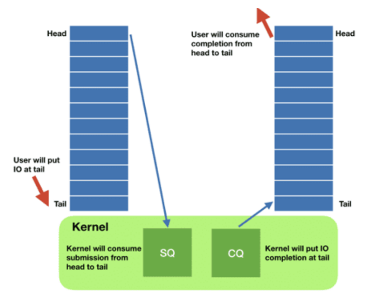

### socket

从一般的server socket编程说起
```cpp
#include<stdio.h>
#include<stdlib.h>
#include<string.h>
#include<errno.h>
#include<sys/types.h>
#include<sys/socket.h>
#include<netinet/in.h>

#define MAXLINE 4096    // 一次最多接收的数据

int main(int argc, char** argv) {
    int listenfd, connfd;
    struct sockaddr_in  servaddr;   // 来自#include<netinet/in.h>的数据结构sockaddr_in
    char buff[MAXLINE]; 
    int n;

    if ((listenfd = socket(AF_INET, SOCK_STREAM, 0)) == -1) {
        printf("create socket error: %s(errno: %d)\n",strerror(errno),errno);
        exit(0);
    }

    memset(&servaddr, 0, sizeof(servaddr));
    servaddr.sin_family = AF_INET;
    servaddr.sin_addr.s_addr = htonl(INADDR_ANY);
    servaddr.sin_port = htons(6666);

    if (bind(listenfd, (struct sockaddr*)&servaddr, sizeof(servaddr)) == -1){
        printf("bind socket error: %s(errno: %d)\n",strerror(errno),errno);
        exit(0);
    }

    if (listen(listenfd, 10) == -1) {
        printf("listen socket error: %s(errno: %d)\n",strerror(errno),errno);
        exit(0);
    }

    while(1) {
        if ((connfd = accept(listenfd, (struct sockaddr*)NULL, NULL)) == -1) {
            printf("accept socket error: %s(errno: %d)",strerror(errno),errno);
            continue;            
        }
        n = recv(connfd, buff, MAXLINE, 0); 
        buff[n] = '\0';
        printf("recv msg from client: %s\n", buff);
        close(connfd);  // 关闭连接
    }

    close(listenfd);

    return 0;
}

// 客户端将listen, accept替换为
connect(connfd, (struct sockaddr*)&serv_addr, sizeof(serv_addr));
```

<!-- more -->

#### socket函数

```cpp
#include <sys/socket.h>

int socket(int family, int type, int protocol)
// 成功返回非负描述符, 出错返回-1
// family表示协议族, 一般设置为AF_INET
#define AF_INET		PF_INET
#define PF_INET		2	/* IP protocol family.  */

// type表示套接字类型, TCP是流stream连接, type设置为SOCK_STREAM; UDP是datagrams连接, 设置SOCK_DGRAM
// 套接字类型
enum __socket_type
{
  SOCK_STREAM = 1,		/* Sequenced, reliable, connection-based
				   byte streams.  */
#define SOCK_STREAM SOCK_STREAM
  SOCK_DGRAM = 2,		/* Connectionless, unreliable datagrams
				   of fixed maximum length.  */
#define SOCK_DGRAM SOCK_DGRAM
  SOCK_RAW = 3,			/* Raw protocol interface.  */
#define SOCK_RAW SOCK_RAW
  SOCK_RDM = 4,			/* Reliably-delivered messages.  */
#define SOCK_RDM SOCK_RDM
  SOCK_SEQPACKET = 5,		/* Sequenced, reliable, connection-based,
				   datagrams of fixed maximum length.  */
#define SOCK_SEQPACKET SOCK_SEQPACKET
  SOCK_DCCP = 6,		/* Datagram Congestion Control Protocol.  */
#define SOCK_DCCP SOCK_DCCP
  SOCK_PACKET = 10,		/* Linux specific way of getting packets
				   at the dev level.  For writing rarp and
				   other similar things on the user level. */
#define SOCK_PACKET SOCK_PACKET

  /* Flags to be ORed into the type parameter of socket and socketpair and
     used for the flags parameter of paccept.  */

  SOCK_CLOEXEC = 02000000,	/* Atomically set close-on-exec flag for the
				   new descriptor(s).  */
#define SOCK_CLOEXEC SOCK_CLOEXEC
  SOCK_NONBLOCK = 00004000	/* Atomically mark descriptor(s) as
				   non-blocking.  */
#define SOCK_NONBLOCK SOCK_NONBLOCK
};

// 最后protocol具体协议类型, 设置0则选择family和type组合的默认值
```

#### sockaddr_in

sockaddr_in结构体出自文件`#include<netinet/in.h>`, 作用是使用`in_port_t sin_port`和`struct in_addr sin_addr`标注端口和地址, 二者都是整数。对于ip地址写为`sock_addr.sin_addr.s_addr = inet_addr("127.0.0.1");`, 而`servaddr.sin_addr.s_addr = htonl(INADDR_ANY);`一般用于服务端, 表示可以连接所有地址。

htonl表示host to net (unsigned) long, 表示将主机序转为网络序。

inet_addr函数需要`#include <arpa/inet.h>`
```cpp
/* Structure describing an Internet socket address.  */
struct sockaddr_in
  {
    __SOCKADDR_COMMON (sin_);
    in_port_t sin_port;			/* Port number.  */
    struct in_addr sin_addr;		/* Internet address.  */

    /* Pad to size of `struct sockaddr'.  */
    unsigned char sin_zero[sizeof (struct sockaddr) -
			   __SOCKADDR_COMMON_SIZE -
			   sizeof (in_port_t) -
			   sizeof (struct in_addr)];
  };

typedef uint16_t in_port_t; // 16位端口

struct in_addr
  {
    in_addr_t s_addr;
  };

typedef uint32_t in_addr_t;

/* Convert Internet host address from numbers-and-dots notation in CP
   into binary data in network byte order.  */
extern in_addr_t inet_addr (const char *__cp) __THROW;
```

#### bind

bind吧本地协议地址赋给一个套接字
```cpp
#include <sys/socket.h>

int bind(int sockfd, const struct sockaddr* myaddr, socklen_t addrlen);
// 成功返回0, 出错返回-1
```

可以将sockaddr_in作为地址结构sockaddr, 于是变为
```cpp
bind(listenfd, (struct sockaddr*)&servaddr, sizeof(servaddr)
```

#### listen

listen函数仅由Tcp服务器调用,它导致套接字从CLOSED状态转换到LISTEN状态。
```cpp
#include <sys/socket.h>

int listen(int sockfd, int backlog)
// 成功返回0, 失败返回-1
```

内核位对给定的监听套接字维护两个队列
1. 未完成连接队列, 服务器正在等待完成TCP三次握手, 套接字处于SYN_RCVD状态
2. 已完成连接队列, 这些套接字处于ESTABLISHED状态

backlog参数和这两个队列的大小有关

#### accept

accept由TCP服务器调用, 用于从已完成连接队列队头返回下一个已完成连接, 如果已完成连接队列为空, 那么进程睡眠
```cpp
#include <sys/socket.h>

int accept(int sockfd, struct sockaddr* cliaddr, socklen_t* addrlen);
// 成功返回非负描述符, 出错返回-1
// 参数cliaddr和addr是返回已连接对端进程的协议地址和长度
```

#### fcntl

fcntl本意是file control, 可以执行各种文件描述符fd操作。在网络编程下, fcntl提供
1. 非阻塞式I/O, 设置ONONBLOCK文件标识。`fcntl(fd, F_SETFL, O_ONOBLOCK)`
2. 信号驱动式I/O, 设置O_ASYNC文件标识

#### epoll下的server

epoll将listenfd注册到红黑树中, 此后直接调用epoll_wait即可。
```cpp
#include <stdio.h>
#include <sys/types.h>
#include <sys/socket.h>
#include <errno.h>
#include <string.h>
#include <stdlib.h>
#include <unistd.h>
#include <netinet/in.h>
#include <ctype.h>
#include <sys/epoll.h>	//epoll头文件

#define MAXSIZE 1024
#define IP_ADDR "127.0.0.1"
#define IP_PORT 8888

int main()
{
	int i_listenfd, i_connfd;
	struct sockaddr_in st_sersock;
	char msg[MAXSIZE];
	int nrecvSize = 0;

	struct epoll_event ev, events[MAXSIZE];	// events接受触发的事件
	int epfd, nCounts;	//epfd:epoll实例句柄, nCounts:epoll_wait返回值

	if((i_listenfd = socket(AF_INET, SOCK_STREAM, 0) ) < 0)	//建立socket套接字
	{
		printf("socket Error: %s (errno: %d)\n", strerror(errno), errno);
		exit(0);
	}

    //设置非阻塞
	int flag = fcntl(i_listenfd, F_GETFL, 0);
	if (fcntl(i_listenfd, F_SETFL, flag | SOCK_NONBLOCK) == -1) {
		printf("fcntl failed\n");
		close(i_listenfd);
		return;
	}

	memset(&st_sersock, 0, sizeof(st_sersock));
	st_sersock.sin_family = AF_INET;  //IPv4协议
	st_sersock.sin_addr.s_addr = htonl(INADDR_ANY);	// INADDR_ANY转换过来就是0.0.0.0，泛指所有ip, 即能接收所有ip
	st_sersock.sin_port = htons(IP_PORT);

	if(bind(i_listenfd,(struct sockaddr*)&st_sersock, sizeof(st_sersock)) < 0) //将套接字绑定IP和端口用于监听
	{
		printf("bind Error: %s (errno: %d)\n", strerror(errno), errno);
		exit(0);
	}

	if(listen(i_listenfd, 20) < 0)	//设定可同时排队的客户端最大连接个数
	{
		printf("listen Error: %s (errno: %d)\n", strerror(errno), errno);
		exit(0);
	}

	if((epfd = epoll_create(MAXSIZE)) < 0)	//创建epoll实例， 返回epfd
	{
		printf("epoll_create Error: %s (errno: %d)\n", strerror(errno), errno);
		exit(-1);
	}
	
	ev.events = EPOLLIN;	// 可读
	ev.data.fd = i_listenfd;	// 将listenfd注册到epoll中
	if(epoll_ctl(epfd, EPOLL_CTL_ADD, i_listenfd, &ev) < 0)
	{
		printf("epoll_ctl Error: %s (errno: %d)\n", strerror(errno), errno);
		exit(-1);
	}
	printf("======waiting for client's request======\n");
	//准备接受客户端连接
	while(1)
	{
		if((nCounts = epoll_wait(epfd, events, MAXSIZE, -1)) < 0)
		{
			printf("epoll_ctl Error: %s (errno: %d)\n", strerror(errno), errno);
			exit(-1);
		}
		else if(nCounts == 0)
		{
			printf("time out, No data!\n");
		}
		else
		{
			for(int i = 0; i < nCounts; i++)
			{
				int tmp_epoll_recv_fd = events[i].data.fd;
				if(tmp_epoll_recv_fd == i_listenfd)	//有客户端连接请求
				{
					if((i_connfd = accept(i_listenfd, (struct sockaddr*)NULL, NULL)) < 0)	//阻塞等待客户端连接
					{
						printf("accept Error: %s (errno: %d)\n", strerror(errno), errno);
					//	continue;
					}	
					else
					{
						printf("Client[%d], welcome!\n", i_connfd);
					}
	
					ev.events = EPOLLIN;
					ev.data.fd = i_connfd;
					if(epoll_ctl(epfd, EPOLL_CTL_ADD, i_connfd, &ev) < 0)
					{
						printf("epoll_ctl Error: %s (errno: %d)\n", strerror(errno), errno);
						exit(-1);
					}
				}
				else	//若是已连接的客户端发来数据请求
				{
					//接受客户端发来的消息并作处理(小写转大写)后回写给客户端
					memset(msg, 0 ,sizeof(msg));
					if((nrecvSize = read(tmp_epoll_recv_fd, msg, MAXSIZE)) < 0)
					{
						printf("read Error: %s (errno: %d)\n", strerror(errno), errno);
						continue;
					}
					else if( nrecvSize == 0)	//read返回0代表对方已close断开连接。
					{
						printf("client has disconnected!\n");
						epoll_ctl(epfd, EPOLL_CTL_DEL, tmp_epoll_recv_fd, NULL);
						close(tmp_epoll_recv_fd);  //
					
						continue;
					}
					else
					{
						printf("recvMsg:%s", msg);
						for(int i=0; msg[i] != '\0'; i++)
						{
							msg[i] = toupper(msg[i]);
						}
						if(write(tmp_epoll_recv_fd, msg, strlen(msg)+1) < 0)
						{
							printf("write Error: %s (errno: %d)\n", strerror(errno), errno);
						}

					}
				}
			}
		}
	}//while
	close(i_listenfd);
	close(epfd);
	return 0;
}
```

### 异步I/O

#### Linux I/O 系统调用演进

* 基于 fd 的阻塞式 I/O：read()/write()

```cpp
ssize_t read(int fd, void *buf, size_t count);
ssize_t write(int fd, const void *buf, size_t count);
```

如果数据在文件中，并且文件内容已经缓存在 page cache 中，调用会立即返回；如果数据在另一台机器上，就需要通过网络（例如 TCP）获取，会阻塞一段时间；如果数据在硬盘上，也会阻塞一段时间。

* 非阻塞式 I/O：select()/poll()/epoll()

I/O多路复用通过一个线程监听多个文件实现了同步模拟异步, 这种方法的缺点是只支持 network sockets 和 pipes —— epoll() 甚至连 storage files 都不支持。

* 线程池方式

storage I/O，经典的解决思路是 thread pool： 主线程将 I/O 分发给 worker 线程，后者代替主线程进行阻塞式读写，主线程不会阻塞。Nginx就是通过这种方式, 这种方式的问题是线程上下文切换开销可能非常大

* Direct I/O（数据库软件）：绕过 page cache

有时 并不想使用操作系统的 page cache， 而是希望打开一个文件后，直接从设备读写这个文件(direct access to the device), 包括自定义块存储, 文件存储, 而不用操作系统调用。 这种方式称为直接访问(direct access)或直接 I/O(direct I/O)

* 异步 IO(AIO)

异步的一般调用过程, 用户通过 io_submit() 提交 I/O 请求，过一会再调用 io_getevents() 来检查哪些 events 已经 ready 了(可以用定时器)

#### io_uring

io_uring 的基本逻辑与 linux-aio 是类似的：提供两个接口，一个将 I/O 请求提交到内核，一个从内核接收完成事件。这项工作始于一个很简单的观察：随着设备越来越快， 中断驱动（interrupt-driven）模式效率已经低于轮询模式 （polling for completions） —— 这也是高性能领域最常见的主题之一。

每个 io_uring 实例都有两个环形队列（ring），在内核和应用程序之间共享, 提交队列：submission queue (SQ), 完成队列：completion queue (CQ), 都是单生产者、单消费者，size 是 2 的幂次; 提供无锁接口（lock-less access interface），内部使用 内存屏障做同步（coordinated with memory barriers）。

原来需要多次系统调用（读或写），现在变成批处理一次提交。系统调用上下文中就只是将请求放入队列， 不会做其他任何额外的事情，保证了应用永远不会阻塞。



io_uring 实例可工作在三种模式：中断驱动模式（interrupt driven）默认模式。可通过 io_uring_enter() 提交 I/O 请求，然后直接检查 CQ 状态判断是否完成。轮询模式（polled）,这种模式需要文件系统（如果有）和块设备（block device）支持轮询功能(即如同epoll的回调函数)。 相比中断驱动方式，这种方式延迟更低（连系统调用都省了）， 但可能会消耗更多 CPU 资源。

* io_uring 系统调用 API

io_uring_setup()执行异步 I/O 需要先设置上下文, 包括创建一个 SQ 和一个 CQ, queue size 至少 entries 个元素, 返回一个文件描述符，随后用于在这个 io_uring 实例上执行操作。

```cpp
int io_uring_setup(u32 entries, struct io_uring_params *p);
```

io_uring_register()注册用于异步 I/O 的文件或用户缓冲区（files or user buffers）

```cpp
int io_uring_register(unsigned int fd, unsigned int opcode, void *arg, unsigned int nr_args);
```

io_uring_enter(), 这个系统调用用于初始化和完成（initiate and complete）I/O，使用共享的 SQ 和 CQ。 单次调用同时执行：提交新的 I/O 请求, 等待 I/O 完成

```cpp
int io_uring_enter(unsigned int fd, unsigned int to_submit, unsigned int min_complete, unsigned int flags, sigset_t *sig);
```

https://github.com/axboe/liburing
```cpp
#include "liburing.h"

#define QD    4 // io_uring 队列长度

int main(int argc, char *argv[]) {
    int i, fd, pending, done;
    void *buf;

    // 1. 初始化一个 io_uring 实例
    struct io_uring ring;
    ret = io_uring_queue_init(QD,    // 队列长度
                              &ring, // io_uring 实例
                              0);    // flags，0 表示默认配置，例如使用中断驱动模式

    // 2. 打开输入文件，注意这里指定了 O_DIRECT flag，内核轮询模式需要这个 flag，见前面介绍
    fd = open(argv[1], O_RDONLY | O_DIRECT);
    struct stat sb;
    fstat(fd, &sb); // 获取文件信息，例如文件长度，后面会用到

    // 3. 初始化 4 个读缓冲区
    ssize_t fsize = 0;             // 程序的最大读取长度
    struct iovec *iovecs = calloc(QD, sizeof(struct iovec));
    for (i = 0; i < QD; i++) {
        if (posix_memalign(&buf, 4096, 4096))
            return 1;
        iovecs[i].iov_base = buf;  // 起始地址
        iovecs[i].iov_len = 4096;  // 缓冲区大小
        fsize += 4096;
    }

    // 4. 依次准备 4 个 SQE 读请求，指定将随后读入的数据写入 iovecs 
    struct io_uring_sqe *sqe;
    offset = 0;
    i = 0;
    do {
        sqe = io_uring_get_sqe(&ring);  // 获取可用 SQE
        io_uring_prep_readv(sqe,        // 用这个 SQE 准备一个待提交的 read 操作
                            fd,         // 从 fd 打开的文件中读取数据
                            &iovecs[i], // iovec 地址，读到的数据写入 iovec 缓冲区
                            1,          // iovec 数量
                            offset);    // 读取操作的起始地址偏移量
        offset += iovecs[i].iov_len;    // 更新偏移量，下次使用
        i++;

        if (offset > sb.st_size)        // 如果超出了文件大小，停止准备后面的 SQE
            break;
    } while (1);

    // 5. 提交 SQE 读请求
    ret = io_uring_submit(&ring);       // 4 个 SQE 一次提交，返回提交成功的 SQE 数量
    if (ret < 0) {
        fprintf(stderr, "io_uring_submit: %s\n", strerror(-ret));
        return 1;
    } else if (ret != i) {
        fprintf(stderr, "io_uring_submit submitted less %d\n", ret);
        return 1;
    }

    // 6. 等待读请求完成（CQE）
    struct io_uring_cqe *cqe;
    done = 0;
    pending = ret;
    fsize = 0;
    for (i = 0; i < pending; i++) {
        io_uring_wait_cqe(&ring, &cqe);  // 等待系统返回一个读完成事件
        done++;

        if (cqe->res != 4096 && cqe->res + fsize != sb.st_size) {
            fprintf(stderr, "ret=%d, wanted 4096\n", cqe->res);
        }

        fsize += cqe->res;
        io_uring_cqe_seen(&ring, cqe);   // 更新 io_uring 实例的完成队列
    }

    // 7. 打印统计信息
    printf("Submitted=%d, completed=%d, bytes=%lu\n", pending, done, (unsigned long) fsize);

    // 8. 清理工作
    close(fd);
    io_uring_queue_exit(&ring);
    return 0;
}
```