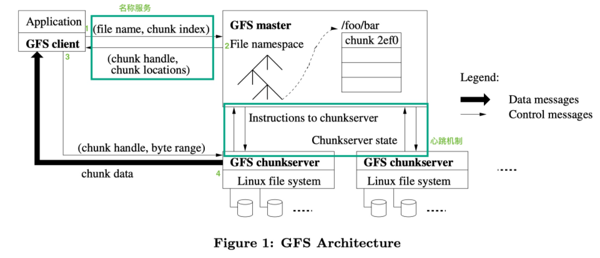
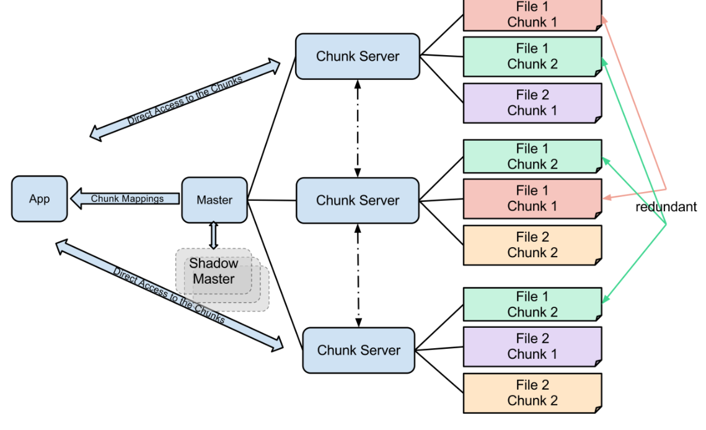
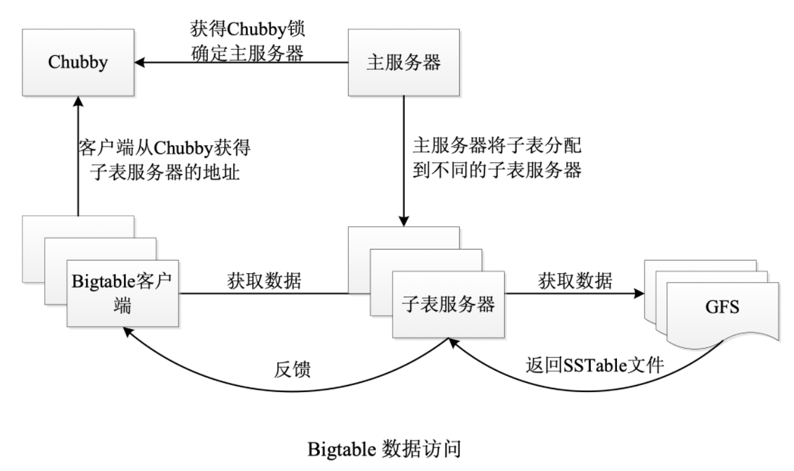

> 分布式是如今服务端架构的基本形式, 多机条件下, 不论是分布式计算还是分布式存储, 都需要遵循分布式系统的一般知识

### 分布式文件系统 GFS

分布式存储的四个背景
1. 分布式组件经常发生错误，应当将此视为常态而不是意外。分布系统的各个组件是廉价的商品主机，而不是专业服务器，因此它们不得不频繁地自我监测、发现故障，并被要求有一定故障容错与自我故障恢复能力；

2. 文件通常是大文件，而不是小文件；GFS 中直接将 chuksize 设置为 64 MB。文件数量处于几百万的规模，每一个文件的大小通常为 100 MB 或者更大，GB 也是很常见的数据大小

3. 大部分文件（主要是指字节数量占比高，而不是操作次数）通过 append（在已有的文件末尾追加）新数据的方式实现修改，而不是直接重写现有数据；
4. 协同设计应用以及文件系统可以提高系统整体灵活性，最终使整个系统收益

大多数的应用更子在乎高速率地处理大量数据，但是很少应用对单个读写操作由严格的响应时间要求。我们可以将带宽和延迟用比喻的方式进行比较：带宽和高速公路上的车道数有关，能同时跑多少量车就是带宽，延迟和路况有关，平均车速就是在描述延迟。带宽和延迟反相关。对于一个游戏服务来说，延迟就不能高, 也就是说宁愿少处理点数据也不能高延迟。国内游戏（包括代理）往往会有多个频道或者区的概念，目的都是为了分流, 也就是少处理点数据。

一个 GFS cluster（集群）分为两个组件：
1. 单个 master 节点；
2. 多个 chunkserver 节点；

Master + Worker 结构指的是存在一个 Master 来管理任务、分配任务，而 Worker 是真正干活的节点。在这里干的活自然是数据的存储和读取。Nginx就是典型的master+work架构

大文件分块存储, 将串行转为并行, 原本一个磁盘转速 5400 rpm，那么读完一个 10 GB 的文件可能需要 200 秒（假设），现在 10 GB 的文件分别在 10 个磁盘上存储，转速不变，那么文件读完仅仅需要 20 秒。

分布式系统由于不可避免的故障，因此我们需要使用 replication 机制，每一个 chunk 都存在着若干个副本（它们不一定完全一样 ，因为 GFS 并不是一个强一致性文件管理系统），我们称这些 chunk 的副本为 replica（复数形式为 replicas）。

每一个文件都被划分为多个 chunk,Chunk Size 是整个分布式文件系统的最重要的参数之一，GFS 以 64 MB 为固定的 Chunk Size 大小，这远远大于典型的单机文件系统 chunk 的大小。当然小数据量很多时就不适用于GFS了

<!-- more -->

GFS client 文件数据的步骤为：
1. GFS Client 首先对要读取的字节相对偏移量在 chunk size 固定的背景下计算出 chunk index；
2. 给 GFS Master 发送 file name 以及 chunk index，即文件名和 chunk index(索引)；
3. GFS Master 接收到查询请求后，将 filename 以及 chunk index 映射为 chunk handle 以及 chunk locations，并返回给 GFS Client；
4. GFS Client 接收到响应后以 key 为 file name + chunk index，value 为 chunk handle + chunk locations 的键值对形式缓存此次查询信息 ；
5. 接着，GFS Client 向其中一个 replicas (最有可能是最近的副本)发送请求，去请求中指定 chunk handle 以及块中的字节范围
6. chunkserver 收到数据读取请求后，根据 clinet 发来的 chunk hanle 进行磁盘 I/O 最终返回数据给 client；

GFS 系统中，每一个 chunk 的唯一识别符是 chunk handler。Master 节点在内存中存储着两个 Table，它们被统称为 metadata
1. Table1, key：file name, value：an array of chunk handler (nv)
2. Table2, key：chunk handler value, value：
a list of chunkserver(v), chunk version number(nv), which chunkserver is primary node(which means others are nomal chunkserver in the list)(v), lease expiration time(v)

Master 存储三类最重要的 metadata 数据：File 和 chunk 的 namespace(命名空间)、file 到 chunk 的映射 Map、每一个 chunk replica 的存储位置。所有元数据都保存在主服务器的内存中。

Master 使用日志系统以及 checkpoint 来确保 Master 状态信息的可靠性，这一点和 MySQL 的日志系统是类似的。只有在内存快照被刷新到本地磁盘以及其他主机上的磁盘上时，才会认为修改状态提交了. Master 还提供shadow Master 节点，这些节点在 Master 宕机时还能提供对文件系统的只读访问。但master节点只能人工地进行故障恢复，这会导致小时级别的 GFS 系统不可写

### 分布式数据库 Big table

Bigtable 是一种压缩的、高性能的、高可扩展性的，基于 Google 文件系统（Google File System，GFS）的数据存储系统，用于存储大规模结构化数据。但是这并非是关系型结构, 只是key-value简单结构

Row Key, 行关键字可以是任意字符串，最大容量为 64KB

Tablet, Bigtable 中表的行区间需要动态划分，每个行区间称为一个 Tablet（子表）。Tablet 是 Bigtable 数据分布和负载均衡的基本单位，不同的子表可以有不同的大小。为了限制 Tablet 的移动成本与恢复成本，每个子表默认的最大尺寸为 200 MB。

Column Key 一般都表示一种数据类型，Column Key 的集合称作 Column Family(列族), Column Family 下的数据被压缩在一起保存。Column Family 是 access control(访问控制)、disk and memory accounting(磁盘和内存计算)的基本单元。数据在被存储之前必须先确定其 Column Family，然后才能确定具体的 Column Key

Bigtable 中的表项可以包含同一数据的不同版本，采用时间戳进行索引。

Bigtable 是在 Google 的其他基础设施之上构建的：

* 依赖 WorkQueue 负责故障处理和监控；
* 依赖 GFS 存储日志文件和数据文件；
* 依赖 Chubby 存储元数据和进行主服务器的选择。

Bigtable 依赖于 Chubby 提供的锁服务, Chubby具有广泛的应用场景，包括GFS选主服务器, BigTable中的表锁；

主服务器起到系统管家的作用，主要用于为子表服务器分配子表、检测子表服务器的加入或过期、 进行子表服务器的负载均衡和对保存在 GFS 上的文件进行垃圾收集。主服务器持有活跃的子表服务器信息、子表的分配信息和未分配子表的信息。如果子表未分配，主服务器会将该子表分配给空间足够的子表服务器

每个子表服务器管理一组子表(a set of tablets)，负责其磁盘上的子表的读写请求，并在子表过大时进行子表的分割。与许多单一主节点的分布式存储系统一样，读写数据时，客户端直接和子表服务器通信，因此在实际应用中，主服务器的负载较轻。

Bigtable 内部采用 SSTable 的格式存储数据，子表的持久化状态信息保存在 GFS 上。SSTable 有如下的特点

1. 持久化存储：强调 SSTable 存储在硬盘上而不是存储于内存中；
2. 有序性：SSTable 中的数据根据 key 进行排序；
3. 不可变性；不会有删除操作, 操作操作也是追加
4. 纯文本存储：key 以及 value 都是以文本的形式进行存储；
5. 映射式查找：通过 key 来查找 value，通过 key range 来进行范围查找；
6. 分 block（块）存储：每一个 SSTable 内部分为多个 block 进行存储，默认情况下 block 大小为 64 KB（可配置）；
7. 块索引机制：在 SSTable 内部每一个 block 的索引，索引在打开 SSTable 时被加载到内存中。

#### chubby
Chubby本质上是一个分布式文件系统，存储大量小文件。每个文件就代表一个锁，并且可以保存一些应用层面的小规模数据。用户通过打开、关闭、读取文件来获取共享锁或者独占锁；并通过反向通知机制，向用户发送更新信息。分布式锁的目的是保证集群服务器的一致性(类似共享变量一致性, 如果不加锁势必服务器内容随着操作而不一致), 因此分布式锁算法也可以用分布式共识实现

客户端通过调用Chubby，申请锁服务, 判断能否访问服务区，并获取相关信息，同时通过租约保持与服务器的连接；这和多个客户端访问共享变量先请求加锁是类似的, 只是本地锁无法在多个服务器之间生效就要分布式锁了。一个服务器组一般由五台服务器组成(至少3台)，其中一台master，服务维护与客户端的所有通信；其他服务器不断和主服务器通信，获取用户操作。在分布式系统中, Chubby一般充当存储元数据的master节点。

etcd实现的分布式锁是基于日志复制的乐观锁, 读写性能和稳定性都更高。 

### 存储类型

块存储, 文件存储, 对象存储。本质区别：对外提供的协议不同，用户也不同。

对象：通常指提供S3以及类S3协议，可理解为网盘。    块：通常指提供ISCSI协议，可理解为硬盘。文件：通常指提供POSIX协议以及GFS等类似协议，可理解为文件系统。

相同点：都需要一套分布式存储系统来支持，

都需要数据分布算法、数据复制协议、单机存储引擎等，如果是自研的话，可以都在统一的分布式存储层之上提供3种不同的协议。

实现难易程度：文件 >  块 > 对象，所以对象存储各家都在造轮子，块和文件造的比较少。

数据分布：无区别，可以都使用通用的Hash及变种数据分布算法。数据存储：无区别，可以都使用一套单机存储引擎，也可以有根据自己场景定制(对象的单机存储引擎要比块和文件简单不少)。

IO速度：块 > 文件 > 对象

单机存储引擎：可以基于内核态的文件系统(EXT4/XFS)、内核态的裸设备(Libaio/io_uring)；也可以基于用户态的文件系统(bluefs等)、用户态的裸设备(SPDK bdev)。是否基于本地文件系统：取决于单机存储引擎的实现。

#### 对象存储 Object storage

Object storage (also known as object-based storage[1]) is a computer data storage architecture that manages data as objects, as opposed to other storage architectures like file systems which manages data as a file hierarchy, and block storage which manages data as blocks within sectors and track. 对象存储, 将数据组织成若干抽象对象进行存取, 相对于其他存储模型例如文件存储将数据组织成层次结构存储, 块存储将数据组织成磁盘轨道数据块(越来越觉得英文言简意赅了)。

Each object typically includes the data itself, a variable amount of metadata, and a globally unique identifier. Object storage can be implemented at multiple levels, including the device level (object-storage device), the system level, and the interface level. In each case, object storage seeks to enable capabilities not addressed by other storage architectures, like interfaces that are directly programmable by the application, a namespace that can span multiple instances of physical hardware, and data-management functions like data replication and data distribution at object-level granularity. 对象存储一般包含数据本身, 元数据, 一些唯一的标识。对象数据可以实现成若干层级, 包括设备层级, 系统层级, 接口层级。对象存储往往实现一种接口访问应用, 而不是通过存储地址访问, 对象存储有跨越多个物理磁盘实例的命名空间, 基于对象的空间分配。

Object storage is used for purposes such as storing objects like videos and photos on Facebook, songs on Spotify, or files in online collaboration services, such as Dropbox.[4] One of the limitations with object storage is that it is not intended for transactional data, as object storage was not designed to replace NAS file access and sharing; it does not support the locking and sharing mechanisms needed to maintain a single, accurately updated version of a file.[3] 对象存储可以用来存储一些对象, 例如Facebook的视频和照片, Spotify上的音乐, 在线协作的文件。对象存储的一个限制是它不是为事务性数据准备的(这是数据库的作用), 它不支持NAS文件的访问和共享也不支持锁机制来维护存储的数据(简而言之不适合并发写的文件存储)。

Some distributed file systems use an object-based architecture, where file metadata is stored in metadata servers and file data is stored in object storage servers. File system client software interacts with the distinct servers, and abstracts them to present a full file system to users and applications. 一些分布式文件系统使用了基于对象的结构, 主要体现在文件元数据存储在metaserver中, 文件数据存储在storage server中

#### 块存储Block (data storage)

In computing (specifically data transmission and data storage), a block,[1] sometimes called a physical record, is a sequence of bytes or bits, usually containing some whole number of records, having a maximum length; a block size 块block是一些字节或者比特序列, 包含一些完整的记录, 且有最大的大小blocksize。

The process of putting data into blocks is called blocking, while deblocking is the process of extracting data from blocks. Blocked data is normally stored in a data buffer, and read or written a whole block at a time. Blocking reduces the overhead and speeds up the handling of the data-stream.[3] For some devices, such as magnetic tape and CKD disk devices, blocking reduces the amount of external storage required for the data. Blocking is almost universally employed when storing data to 9-track magnetic tape, NAND flash memory, and rotating media such as floppy disks, hard disks, and optical discs. 将数据输入到block中称为blocking, 将数据从块中提取出来称为blocked。blocked data通常存储在数据缓冲区中,且一次性会读写一个完整块。基于块的读写可以降低开销(overhead)且加快数据流处理。

Most file systems are based on a block device, which is a level of abstraction for the hardware responsible for storing and retrieving specified blocks of data, though the block size in file systems may be a multiple of the physical block size. This leads to space inefficiency due to internal fragmentation, since file lengths are often not integer multiples of block size, and thus the last block of a file may remain partially empty.

Block storage offers greater storage efficiency (more efficient use of available storage hardware) and faster performance than file storage. Block storage breaks a file into equally-sized chunks (or blocks) of data and stores each block separately under a unique address. 块存储将文件划分为若干物理连续的chunks, 用特定的物理地址存储这些chunk To access any file, the server's operating system uses the unique address to pull the blocks back together into the file, which takes less time than navigating through directories and file hierarchies to access a file. Block storage works well for critical business applications, transactional databases, and virtual machines that require low-latency (minimal delay). It also gives you more granular access to data and consistent performance. 访问块存储文件, 操作系统可以通过独一无二的地址进行, 这要比通过文件系统目录和文件层次关系访问文件快得多。

#### 文件存储File storage

File storage—also called file-level or file-based storage—is a hierarchical storage methodology used to organize and store data on a computer hard drive or on network-attached storage (NAS) device. In file storage, data is stored in files, the files are organized in folders, and the folders are organized under a hierarchy of directories and subdirectories. To locate a file, all you or your computer system need is the path—from directory to subdirectory to folder to file. 文件存储是一个层次存储模型, 将数据存储到硬盘或者NAS中。数据存储到文件中, 文件由目录组织, 目录由层级的目录和子目录形成。为了确定一个文件, 必须输入文件路径。

#### Network-attached storage NAS

Network-attached storage (NAS) is a file-level (as opposed to block-level storage) computer data storage server connected to a computer network providing data access to a heterogeneous group of clients.Network-attached storage removes the responsibility of file serving from other servers on the network. They typically provide access to files using network file sharing protocols such as NFS, SMB, or AFP.  NAS通常使用网络文件共享协议提供文件的访问权。

NAS provides both storage and a file system. This is often contrasted with SAN (storage area network), which provides only block-based storage and leaves file system concerns on the "client" side. SAN protocols include Fibre Channel, iSCSI, ATA over Ethernet (AoE) and HyperSCSI.