### 数据结构和对象

#### 简单动态字符串

Redis中, C字符串只会作为字符串字面量(string literal)用在无需对字符串修改的地方, 例如打印日志。`redisLog(REDIS_WARNING, "Redis is now ready to exit, bye bye...")

而当使用字符串时, Redis使用SDS表示字符串。例如输入命令
```
SET msg "hello world"

RPUSH furits "apple" "banana" "cherry"
```
Redis将在数据库中创建新的键值对,键是一种字符串对象, 对象底层实现保存"msg"的SDS; 值也是一个字符串对象, 对象底层实现是一个保存字符串"hello world"的SDS; 第二条指令Redis创建新的键值对,键是字符串对象, 值是列表对象, 列表对象中包含了三个字符串对象。

除了保存数据库的字符串值, SDS还用作缓冲区(buffer): AOF模块中的AOF缓冲区, 客户端的输入缓冲区。

SDS的定义
```cpp
struct sdshdr {
  int len;  // buf数组中已使用字节的数量
  int free; // buf数组未使用字节大小
  char buf[];
};
```

<!-- more -->

SDS和C字符串的区别

1. 常数复杂度获取字符串长度, 因为记录了长度
2. 杜绝缓冲区溢出, 例如`sdscat(s, "cluster")`将首先检查SDS的空间是否足够, 由于记录了未使用字节数量,防止出现越界
3. 减少修改字符串带来的内存重分配次数

在C字符串中, 如果执行增长字符串的操作比如拼接操作(append), 那么执行操作之前需要先通过内存重分配来扩展底层数组大小, 如果没有将发生缓冲区溢出; 如果执行缩短字符串的操作比如截断(trim), 那么执行完操作之后需要通过内存重分配释放字符串不再使用的空间, 否则内存泄露。

为了避免大量内存重分配, SDS实现了空间预分配和惰性空间释放两种策略。空间预分配包括, 如果SDS长度小于1MB, 则分配free空间和len长度一样, 如果len=13, 则free也=13, buf的长度未13+13+1=27(多出来的一字节保存空字符)。如果SDS长度大于!MB, 则分配free=1MB的未使用空间。通过提前分配free未使用空间, 减少增长字符串时内存重分配次数。

惰性空间释放用于优化SDS的字符串缩短操作, 当SDS需要缩短时, 程序不立即使用内存重分配来回收缩短的字节, 而是先当这些字节表示为未使用空间。当有需要时才真正缩短字符串。

4. 二进制安全

C字符串的字符必须符合某种编码, 例如ASCII, 并且除了字符串末尾不能有空字符因为空字符表示字符串结尾。这些限制使C字符串只能保存文本数据而不能保存图片, 视频, 音频, 压缩文件等二进制数据。

SDS的buf可以保存二进制数据, 可称为字节数组, 可以保存文本数据和二进制数据。

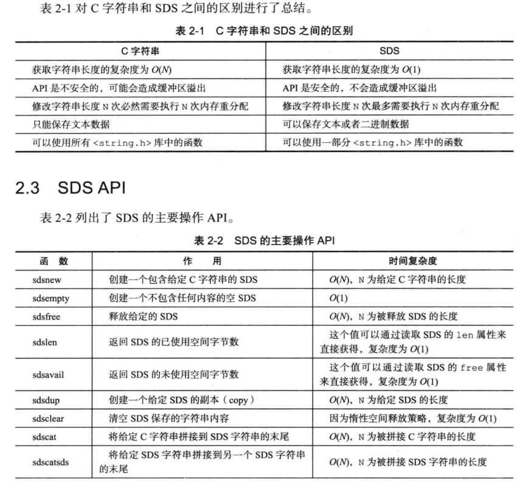

#### 链表

链表提供了高效的节点重排能力, 顺序性的节点访问方式, 通过增删节点来灵活调整链表的长度。列表键的底层实现之一就是链表, 当列表键包含了数量比较多的元素Redis就使用链表作为列表键的底层实现。除了列表键, 发布订阅, 慢查询, 监视器等功能也用到了链表, Redis服务器本身使用链表保存多个客户端的状态信息, 使用链表构建客户端输出缓冲区。

```cpp
// 链表节点
typedef struct listNode {
  struct listNode* prev;
  struct listNode* next;
  void *value;
}listNode;

// 链表对象
typedef struct list {
  listNode* head;
  listNode* tail;
  unsigned long len;  // 链表包含节点数量
  void* (*dup)(void *ptr);  // 节点复制
  void (*free)(void *ptr);  // 节点释放
  int (*match)(void* ptr, void* key); // 比较函数
} list;
```

链表节点使用void* 指针保存节点值, 并且通过list结构的dup, free, match属性为节点设置特定类型函数, 所以链表可以用于保存不同类型的值。

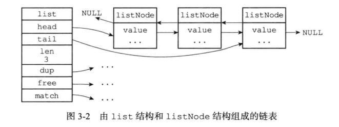

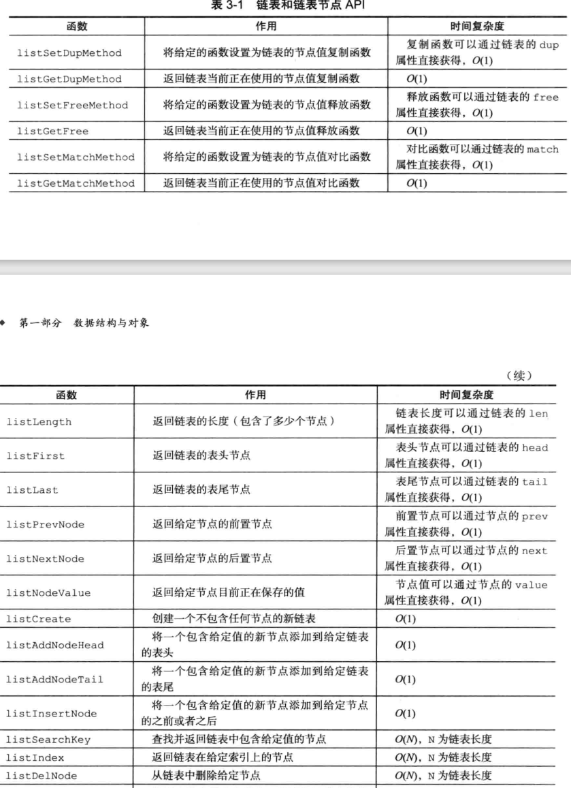

#### 字典

字典, 又称为符号表(symbol table), 关联数组(associative array)或映射(map), 是用来保存键值对(key-value pair)的抽象数据结构。Redis的数据库就是使用字典来作为底层实现的, 对数据库的增, 删, 改, 查操作也是构建在字典之上的。

字典使用哈希表作为底层实现
```cpp
typedef struct dictht {
  dictEntry** table;  // hash表数组
  unsigned long size; // hash表大小
  unsigned long sizemask; // hash表大小掩码, 用于计算索引值
  unsigned long used; // hash表已有节点的数量
} dictht;

typedef struct dictEntry {
  void *key;  // 键
  union { // 值
    void *val; 
    uint_64 tu64;
    int_64 ts64; 
  } v;

  struct dictEntry *next; // 指向下一个Entry节点, 形成链表, 即开链法
} dictEntry;
```

table是一个数组, 每个元素是指向dictEntry的指针, 每个dictEntry保存一个键值对。sizemask总是等于size-1, 这个属性和哈希值一起决定索引

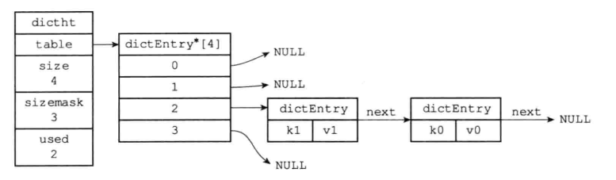

字典对象
```cpp
typedef struct dict {
  dictType* type; // 类型特定函数
  void* privdata; // 私有数据
  dictht ht[2]; // 哈希表

  int trehashidx; // rehash索引
} dict;
```

type属性是一个指向dictType结构的指针, 每个dictType结构保存了一簇用于操作特定类型键值对的函数, Redis会为用途不同的字典设置不同的类型特定函数。privdata则保存了传递这些函数的参数。

```cpp
typedef struct dictType {
  unsigned int (*hashFunction) (const void* key); // 计算哈希值的函数
  void* (*keyDup) (void* privdata, const void* key);  // 复制键的函数
  void* (*valDup)(void* privdata, const void* obj); // 复制值得函数
  int (*keyCompare) (void* privdata, const void* key1, const void* key2);  // 对比键的函数
  void (*keyDestructor) (void *privdata, void *key);  // 销毁键的函数
  void  (*valDestructor) (void* privdata, void* obj); // 销毁值得函数
}dictType;
```

一般字典只使用ht[0]哈希表, ht[1]哈希表只会在对ht[0]进行rehash时使用。另外rehashidx属性记录了rehash目前的进度。

哈希算法, Redis计算哈希值和索引值的方法如下。即使用MurmurHash算法计算键的哈希值
```cpp
hash = dict->type->hashFunction(key); // 使用哈希函数计算key的哈希值
index = hash & dict->ht[x].sizemask;  // ht[x]可以是ht[0]或ht[1], 计算出索引值
```

随着操作的不断执行, 哈希表保存的键值会逐渐的增多或者减少, 为了让哈希表的负载因子(哈希节点数量/ 哈希表长度)维持在合理范围内, 当哈希表保存的键值对数量太多或者太少时, 程序需要对哈希表的大小进行相应的扩展或者收缩。

扩展和收缩哈希表的工作可以通过rehash进行
1. 为字典的ht[1]哈希表分配空间, 如果执行的是扩展操作, ht[1]的大小为第一个大于等于ht[0].used*2的2^n; 如果执行的是收缩操作, ht[1]的大小为第一个大于等于ht[0].used的2^n。

2. 将保存再ht[0]的键值对重新计算键的哈希值和索引值, 然后将键值对放置到ht[1]哈希表的指定位置上

3. rehash完毕后释放ht[0], 将ht[1]设置为ht[0], ht[1]则创建新的空白hash表

当以下条件任意一个被满足时, 程序会自动开始对哈希表执行扩展操作。服务器目前没有执行BGSAVE或者BGREWRITEAOF命令且哈希表负载因子>1; 或者服务器目前再执行BGSAVE或NGREWRITEAOF命令且负载因子大于等于5。哈希表负载因子=哈希表已保存节点数量/ 哈希表大小。

因为BGSAVE或BGREWRITEAOF命令的过程中, Redis需要创建当前服务器的子进程, 而大多数擦偶哦在系统都使用写时复制处理子进程, 子进程存在期间写内存操作会增多, 因此避免在子进程存在期间进行哈希表扩展操作, 降低不必要的内存写入操作。

当哈希表的负载因子小于0.1时，程序自动开始对哈希表执行收缩操作

同时，为了避免rehash对服务器性能造成影响, 服务器不是一次性将ht[0]里面所有键值对rehash到ht[1], 而是分多次, 渐进地将ht[0]里地键值对rehash到ht[1]。即每次对字典执行添加, 删除, 查找或者更新操作时, 程序除了执行指定操作, 而会顺带将ht[0]哈希表rehashidx索引的所有键值对rehash到ht[1]. rehash期间字典查找会先在ht[0]查找,删除，更新 找不到在ht[1], 而添加操作只会保存到ht[1]上,随着rehash操作ht[0]会变成一个空表

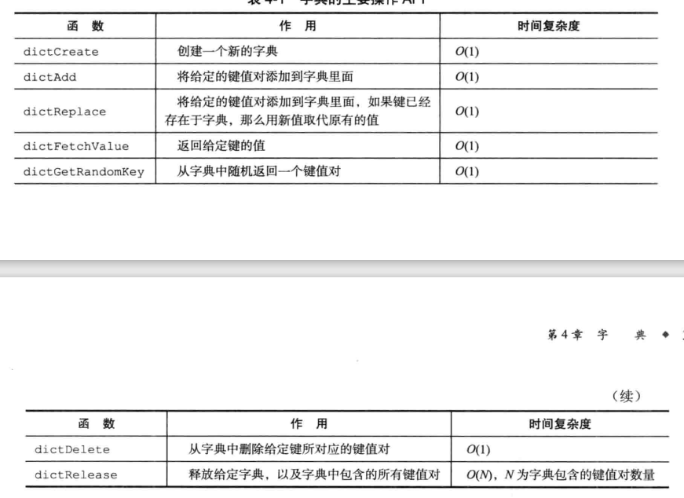

#### 跳跃表

跳跃表skiplist是一种有序数据结构, 它通过在每个节点维持多个指向其他节点的指针来实现快速访问节点。支持平均O(logN), 最快O(N)的查找。跳跃表的效率可以和平衡树媲美且实现比平衡树简单, 因此常常使用跳跃表代替平衡树。Redis使用跳跃表作为有序集合键的底层实现之一, 除有序集合外还在集群节点用作内部数据结构。

跳跃表节点
```cpp
typedef struct zskiplistNode {
  struct zskiplistLevel { // 每一层
    struct zskiplistNode* forward;  // 前进指针
    unsigned int span;  // 跨度
  } level[];

  struct zskipNode* backwark; // 只有最后一层的后退
  double score;
  robj* obj;  // 成员对象
} zskiplistNode;

typedef struct zskiplist {
  struct zskiplistNode *header, *tail;
  unsigned long length; // 表中节点数量
  int level;  // 表中最大层数
} zskiplist;
```

跨度span的作用用来记录两个节点的距离, 在查找某个节点时, 将沿途访问所有层的span累计, 结果就是目标节点在跳跃表中的span。下图箭头上的数字就是span
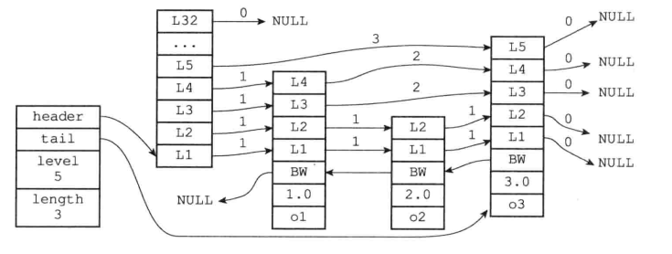

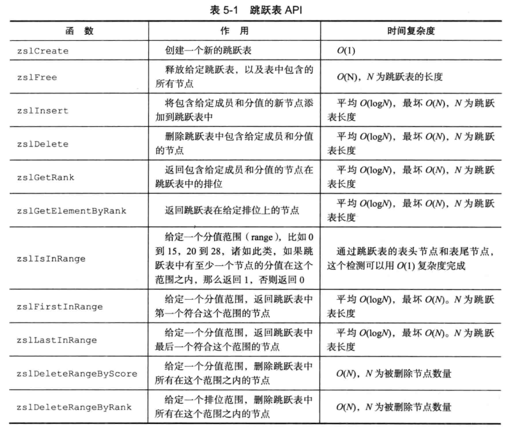

#### 整数集合

整数集合是集合键的底层实现之一, 当集合只包含整数并且元素数量不多时, Redis会使用整数集合作为集合键的底层实现(反之使用跳跃表作为集合实现)。整数集合可以保存类型为int16_t, int32_t, int64_t类型的元素, 且不出现重复元素
```cpp
typedef struct intset {
  uint32_t encoding;  // 编码方式
  uint32_t length;
  int8_t contents[];  // 保存元素的数组
} inset;
```

contents数组的真正类型取决于encoding属性的值, encoding属性可取INTSET_ENC_INT16, INTSET_ENC_INT32, INTSET_ENC_INT64.

当添加新元素且新元素类型大于当前整数集合的类型时, 整数集合要先升级upgrade。需要根据新元素类型扩展整数集合底层数据空间大小, 将所有元素转换为与新元素相同的类型且顺序不变。但整数集合不支持降级，编码会一直保持升级后的状态。

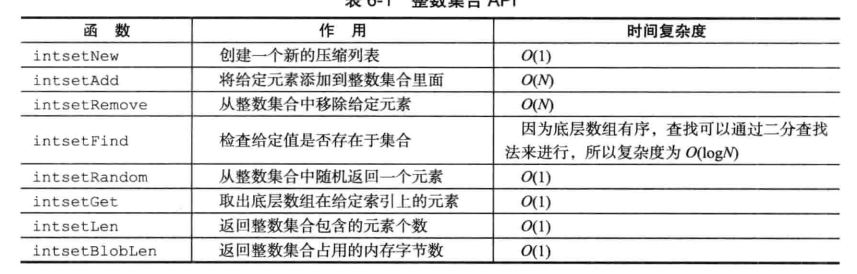

#### 压缩列表

压缩列表ziplist是列表键和哈希键的底层实现之一, 当列表项较少且列表项为小整数或者比较短的字符串, Redis将使用压缩列表做列表键的底层实现。压缩列表为节约内存而开发, 一个压缩列表包含任意多个节点entry, 每个节点可以保存一个字节数组或一个整数值

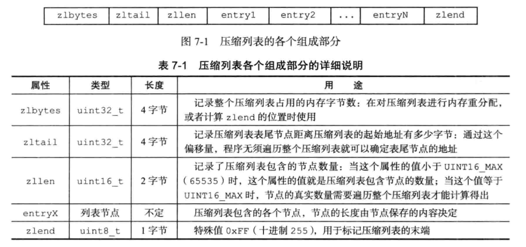

压缩列表节点的构成

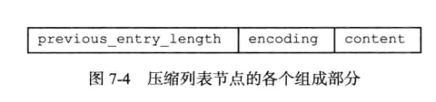

previous_entry_length属性记录压缩列表前一个节点的长度, 这样根据当前节点的起始地址可以算出前一个节点的起始地址。压缩列表从表尾向表头遍历操作就是通过这个原理实现的。

encoding记录节点content保存数据的类型和长度, 前两位表示类型, 后面表示content数据的长度。

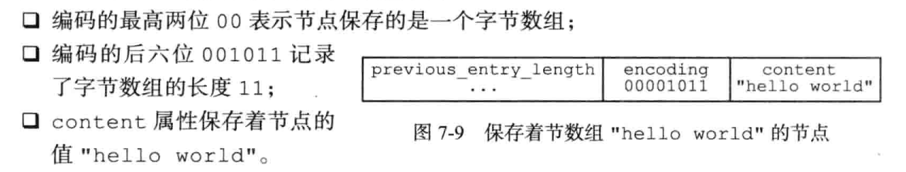

#### 对象

以上介绍了Redis用到的主要数据结构, 例如简单动态字符串SDS, 双端链表, 字典, 压缩列表, 整数集合。Redis并没有直接使用这些数据结构实现键值对数据库, 而是基于这些数据结构创建了一个对象, 即封装成对象。Redis使用对象标识数据库的键和值, 即键对象和值对象
```cpp
typedef struct redisObject {
  unsigned type:4;
  unsigned encoding:4;
  void *ptr;  // 底层实现的地址
} robj;
```

对象的type由常量组成, 分别为REDIS_STRING, REDIS_LIST, REDIS_HASH, REDIS_SET, REDISZET分别表示字符串对象, 列表对象, 哈希对象, 集合对象, 有序集合对象。

encoding记录对象使用的编码, 也就是底层具体的数据结构实现

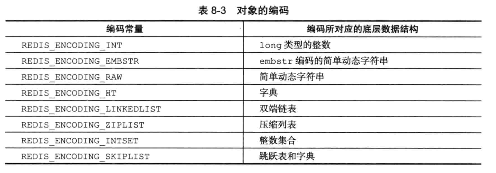
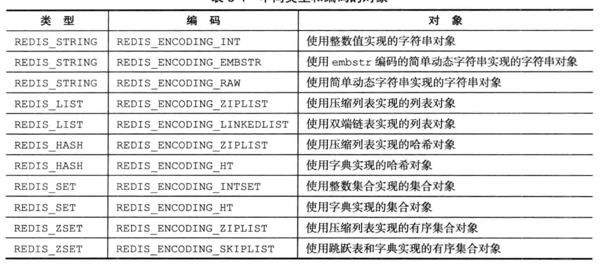

字符串对象的编码可以是int, raw, embstr, 结构
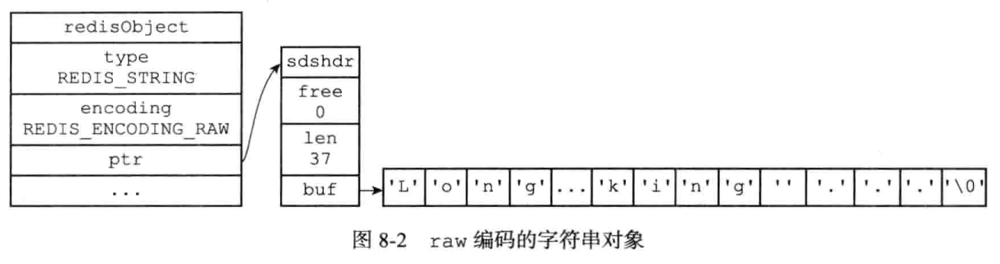

列表对象编码可以是ziplist或者linkedlist, 当同时满足1列表对象保存的所有字符串元素长度小于64字节 2.元素数量小于512个, 列表对象使用ziplist编码; 反之使用linkedlist编码
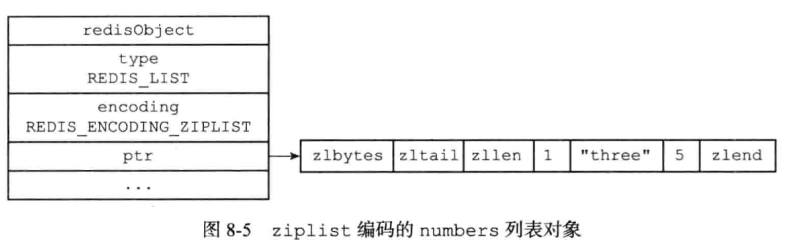

哈希对象编码可以是ziplist或者hashtable, 当所有键值对键和值字符串长度小于64字节且数量小于512, 采用ziplist编码。编码转换是自动进行的。
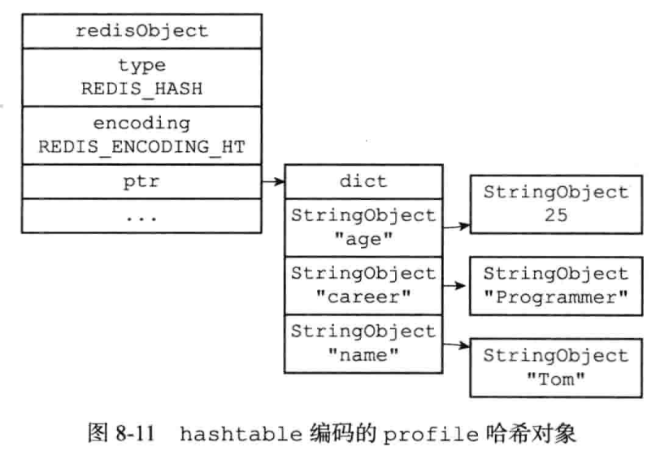

集合对象的编码可以是intset或者hashtable, 当所有元素都是整数值且数量不超过512个采用intset编码

有序结合对象编码可以是ziplist或者skiplist, 为了让有序集合的查找和范围型操作都尽可能快的执行, Redis选择了同时使用字典和跳跃表两种数据结构来实现有序集合。
```cpp
typedef struct zet {
  zskiplist* zsl;
  dict *dict;
} zset;
```

注意字典和跳跃表会共享元素的成员和score, 不会造成数据重复。

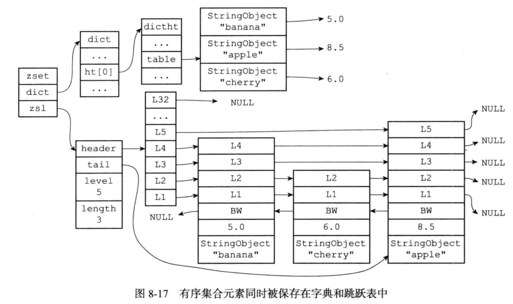

* 类型检查

Redis用于操作键的命令有的只能对某种类型的键有效, 因此操作前需要类型检查。类型检查是通过redisObject的type属性实现的

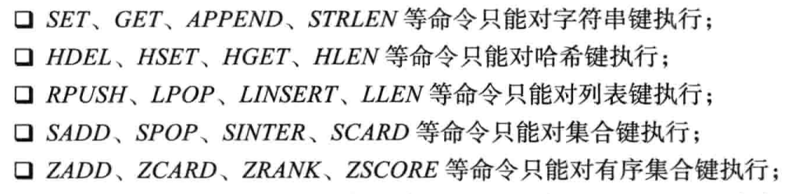

* 内存回收

Redis内置通过引用计数的内存回收, 在创建一个对象时引用计数初始化为1, 对象被新程序使用时, 引用计数+1; 对象不再被程序使用时引用计数-1, 引用计数为0时对象被释放。

Redis在redisObject结构包含了lru属性, 记录了对象最后一次被命令访问的时间, 也成为对象的空转时间。

### 单机数据库

#### 数据库

Redis服务器将所有数据库保存在redisServer结构的db数组中, 通过修改db指针可以实现切换数据库的功能。为了防止数据库所处位置出错(切换多次数据库后很可能处于别的数据库中, 执行命令前最好加一条select切换数据库
```cpp
struct redisServer {
  ...
  redisDB *db;
  int dbnum;  // 服务器的数据库数量, 默认为16
  ...
};

typedef struct redisDB {
  dict *dict; // 数据库键空间, 保存数据库的所有键值对
} redisDB;
```

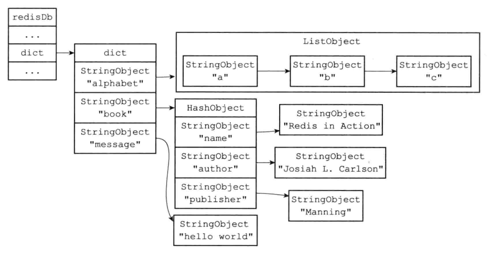

通过EXPIRE命令客户端可以以秒或者毫秒为单位为键设置生存时间, 到期后服务器会删除过期的键。redisDb结构的expires字典保存了数据库中所有键的过期时间, 称这个字典为过期字典。通过过期字典, 程序可以取得键的过期时间, 并检查当前UNIX时间戳是否大于键的过期时间, 如果是则说明键已过期。

一般来说对于过期键有三种删除策略
1. 定时删除, 创建一个定时器, 注册键到定时器当时间来临时立即执行删除。该方法对内存友好但对CPU不友好
2. 惰性删除, 每次从键空间获取键时都检查键是否过期, 如果过期删除。该方法对CPU友好但对内存不友好
3. 定期删除, 每隔一段时间检查并删除过期键

Redis采用惰性删除和定期删除策略, 所有读写数据库之前都会调用expireIfNeeded函数检查, 如果输入键过期那么将会删除。此外redis通过activeExpireCycle在规定时间内随机检查一部分键的过期时间, 并删除过期键

使用SAVE或BGSAVE命令生成RDB文件, 程序将会对数据库的键进行检查, 过期键不会保存在新创建的RDB文件中。写ROF文件时如果键已经过期但没有惰性删除或者定期删除将不会有影响, 但AOF重写时会检查并删除过期键。

在复制模式下, 主服务器删除过期键后会向所有从服务器发送删除命令, 从服务器本身不会检查删除过期键。由主服务器控制可以保证主从服务器的一致性。


#### RDB持久化

Redis提供了RDB持久化功能, 可以将Redis在内存的状态保存到磁盘中, 防止数据意外丢失。RDB是一个经过压缩的二进制文件, 通过该文件可以还原到生成RDB文件时的数据库状态。

SAVE命令阻塞当前服务器进程并创建RDB文件, BGSAVE会派生出一个子进程创建RDB文件, 不会阻塞当前进程。redisServer会通过saveparams数组存储save的选项。 redisServer还会通过成员dirty计数器记录距离上次执行SAVE或者BGSAVE之后服务器对数据库进行的修改次数, lastsave属性记录上次执行SAVE命令的时间。
```cpp
struct saveparam {
  time_t seconds; // 秒数
  int changes;  // 修改数
};

save 300 10 表示300s之内如果对数据执行了10次修改, 服务器自动执行BGSAVE命令
```

Redis服务器的周期操作函数serverCron默认每个100ms执行一次, 其中包括检查save选项设置的保存条件是否已经满足, 如果满足执行BGSAVE命令。

完整的RDB文件包括下面的部分, 注意RDB保存的是二进制数据, 不是C字符串(文本数据)。db_version长度4字节, 是一个整数, EOF长度为1字节, check_sum是8字节的校验和, 通过REDIS, db_version, databases, EOF四个部分算出
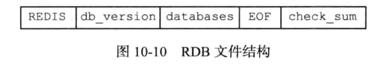

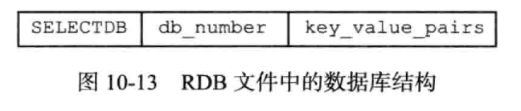
数据库结构的SELECTDB为1字节, 表示接下来是数据库数据。db_number是数据库号码, key_value_pairs保存了所有键值对数据, 由TYPE, key, value三部分组成。TYPE记录了value的类型, 程序根据TYPE决定如何读入和解释value的数据。key始终是字符串对象, 和REDIS_RDB_TYPE_STRING一样。

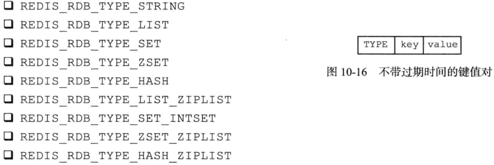

对字符串对象, 可以通过LZF算法压缩, 压缩后字符串的保存结构如下
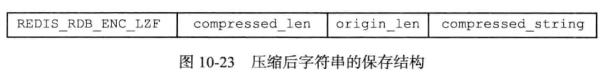

列表, 每个列表项item都是一个字符串对象, 同样, 集合的元素也是字符串对象。
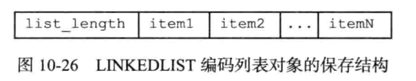

哈希表对象中键值也是字符串对象
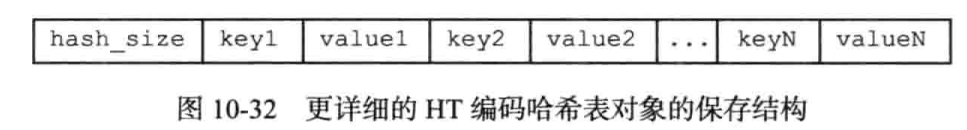

#### AOF持久化

* AOF持久化过程

与RDB持久化通过保存数据库中的键值对记录数据库状态不同, AOF持久化是通过保存Redis服务器执行的写命令来记录数据库状态, 写命令保存到AOF文件。AOF持久化功能实现可分为命令追加(append), 文件写入, 文件同步(sync)三个部分。、

命令追加 当AOF持久化功能处于打开状态时, 服务器执行完一个写命令之后会以协议格式将被执行的写命令追加到redisServer的aof_buf缓冲区的末尾
```cpp
struct redisServer {
  sds aof_buf;
  ...
};
```

Redis的服务器进程是一个时间循环, 这个循环的文件事件负责接收客户端的命令请求和发送回复, 时间事件则负责执行serverCron之类需要定时运行的函数。服务器在接收一个事件循环之前，都会调用flushAppendOnlyFile考虑是否需要将aof_buf中的内容写入和保存到AOF文件中。即文件写入, 一般是写入到缓冲区, 至于同步到磁盘, 和操作系统文件系统有关(一般是定期同步脏页)

* AOF的载入

AOF的载入, 首先创建一个不带网络连接的伪客户端, 伪客户端执行命令的效果和带网络连接的客户端执行效果一样; 之后伪客户端从AOF文件中分析并去除一条写命令, 并要求服务器执行, 直到所有写命令处理完毕。

* AOF重写rewrite

随着事件的流逝, AOF文件体积越来越大, 为了解决AOF文件膨胀问题, Redis提供了AOF文件重写功能。通过该功能Redis服务器创建一个新的AOF文件来替代现有的AOF文件, 新旧两个AOF保存的数据库状态相同, 但新AOF文件不包含任何浪费空间的冗余命令, 体积小很多。

rewrite目前采用的方式是创建一个新的 AOF 文件，将数据库里的全部键值对转换成协议的方式按照RPUSH命令保存到文件中，通过此操作达到减少 AOF 文件大小的目的，重写后的大小一定是小于等于旧 AOF 文件的大小。注意rewrite不对就AOF文件进行任何操作, 它只是通过读取当前的数据库状态实现

执行rewrite相当于将当前数据库全部键值对写入到AOF文件, 因此会开始一个子进程执行。而主进程同时处理写命令, 这时候会额外增加一个AOF重写缓冲区。主进程执行客户端发来的写命令时同时将写命令追加到AOF缓冲区和AOF重写缓冲区。在子进程完成AOF重写工作后, 会向父进程发送信号。父进程接收后将AOF重写缓冲区内容写入到新AOF文件中, 此时新AOF文件保存的数据库状态和当前状态一致。之后对新的AOF文件改名, 原子的覆盖现有的AOF文件。

#### 事件

Redis服务器是一个事件驱动程序, 服务器需要执行两类事件
1. 文件事件file event, 对套接字操作的抽象, 服务器和客户端通信会产生文件事件, 服务器通过监听处理事件来完成网络通信
2. 时间事件time event, Redis的一些操作比如serverCron在给定的时间点执行, 时间事件就是对定时任务的抽象

* 文件事件 

为了对连接服务器的各个客户端进行应答, 服务器为监听套接字连接应答处理器。当Redis服务器进行初始化的时候, 程序会将这个连接应答处理器和服务器监听套接字的AE_READABLE事件管理, 当客户端连接监听套接字时套接字产生AE_READABLE可读事件, 引发连接应答处理器执行应答操作

为了接收客户端传来的命令请求, 服务器为客户端套接字关联命令请求处理器。在客户端连接服务器的整个过程, 服务器一直为客户端套接字的AE_READABLE事件关联。

为了向客户端返回命令执行结果, 服务器关联回复处理器。当命令回复完毕之后, 服务器就会解除关联。

当主服务器和从服务器进行复制操作, 主从服务器关联复制处理器

* 时间事件

时间事件主要分为, 定时事件(指定时间执行一次, 一般是XX秒之后执行一次), 周期时间(每隔指定时间执行一次)

所有时间时间放在一个无序链表中, 每当时间事件执行器运行时, 就遍历整个链表。因为时间事件一般只有serverCron一个, 链表不影响事件执行的性能。

serverCron定时函数默认100ms运行一次, 主要工作包括
```
更新服务器的各类统计信息, 比如时间、内存占用、数据库占用情况等
清理数据库的过期键值对
关闭和清理连接失效的客户端
尝试进行AOF, RDB持久化操作
如果是主服务器, 定期同步
如果是集群模式, 对集群定期同步和连接测试
```

事件的调度和执行规则
1. aeApiPoll函数的最大阻塞事件由事件最接近当前时间的时间事件决定; 因为文件事件是随机出现的, 如果等待并处理完一次文件事件之后, 未有时间事件到达, 服务器将再次等待下一个文件事件, 直到时间时间到达

2. 对文件事件和时间事件的处理都是同步, 有序, 原子地, 服务器不会中途中断事件处理, 也不会对事件进行抢占。因此应该尽量减少程序地阻塞时间(除了等待事件地epoll_wait)。因为时间事件会在文件事件之后执行, 因此此时间事件地实际处理时间会比设定时间稍晚, 绝不会早。


#### 客户端

服务器对连接创建了客户端结构维护, 主要包含内容
```
1. 套接字描述符
2. name
3. 标识flag
4. 客户端正在使用地数据库地指针, 号码
5. 当前要执行地命令, 参数, 命令执行实现函数
6. 客户端输入和输出缓冲区
7. 客户端地复制状态信息, 所需地数据结构
8. 客户端事务状态, WATCH命令用到地结构
9. 发布订阅功能用到地数据结构
10. 身份验证标志
11. 创建时间, 最后一次通信时间
```

客户端组成一个链表, 链表头指针存储在redisServer中
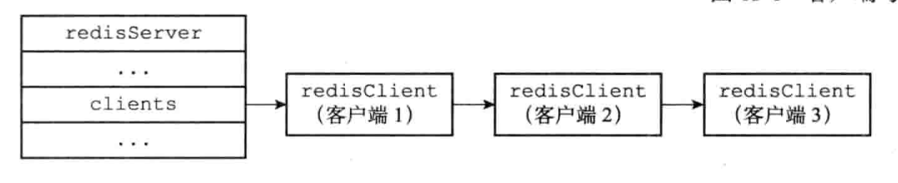

伪客户端fake client地fd属性值为-1, 伪客户端地命令请求来源于AOF文件或者Lua脚本, 而不是网络。

命令地实现函数来自于命令表redisCommand结构, 该结构保存了命令地实现函数, 命令标志, 命令参数个数, 命令总执行次数, 总消耗时长等统计信息

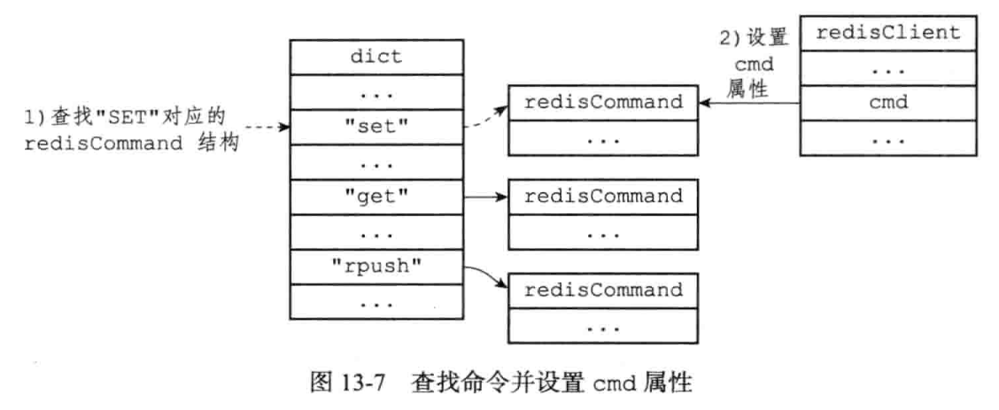

输入输出缓冲区有固定大小缓冲区和可变大小缓冲区可用，固定大小缓冲区最大大小为16KB, 可变大小缓冲区最大大小不能超过服务器设置的硬性限制值。如果发了不合理的协议, 空转超时, 缓冲区大小超限制, 这些原因会造成客户端被关闭。

#### 服务器

命令请求的执行过程

1. 用户在客户端键入命令请求时, 客户端会将命令转为协议格式, 连接到服务器的套接字, 将协议格式请求发送给服务器。

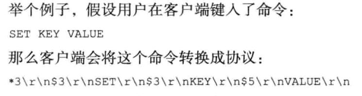

2. 服务器读取套接字协议格式数据保存在输入缓冲区中, 然后对输入缓冲区的命令请求分析, 提取出命令参数放在argc, argv中

3. 命令执行, 根据argv[0]在命令表查找执行的命令, 保存在client的cmd属性中

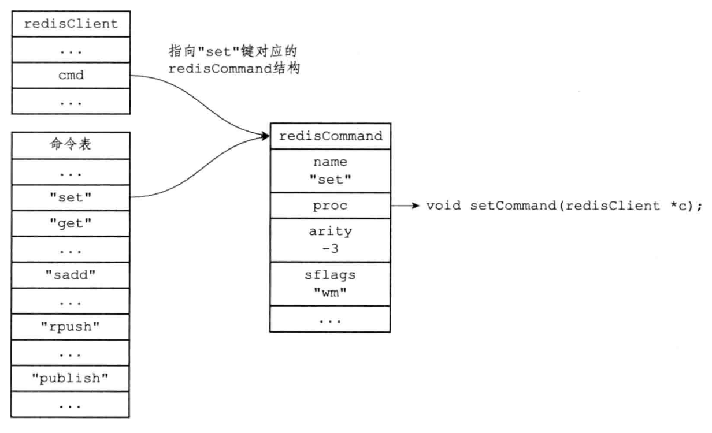

4. 执行一些预备操作, 例如检查cmd指着是否为NULL, 参数个数是否满足要求, 是否命令订阅模式, 是否在执行事务等情况。

5. 调用命令的实现函数, 命令回复保存在客户端的输出缓冲区中

6. 执行后续操作, 例如慢查询日志, 如果开启AOF持久化则把命令写入AOF缓冲区, 复制过程就将执行的写命令广播给从服务器。当套接字可写时, 服务器会将客户端缓冲区的命令回复给客户端

* serverCron函数

serverCron默认100ms执行一次, 其功能包括

1. 更新服务器时间缓存, 即更新redisServer的time_t unixtime 和long long mstime, 两者分别保存秒级精度和毫秒级精度的当前UNIX时间戳。这两个时间戳只用在日志, LRU时钟等精确度要求不高的功能上

2. 更新LRU时钟, 保存在redisServer的unsigned lruclock:22;, 每个redisObject会有一个lru属性保存对象最后被访问的时间

3. 更新服务器每秒执行命令次数

4. 更新服务器内存峰值记录

5. 处理SIGRERM信号, 负责关闭服务器

6. 管理客户端, 是否连接超时释放等

7. 管理数据库, 例如删除过期键

8. 执行延迟执行的NGREWRITEOF, 持久化操作的运行状态(即持久化是否在执行)

9. 将AOF缓冲区内容写入到AOF文件

10. 服务器的cronloops属性记录了serverCron的执行次数, 因此每执行一次将+1

* 初始化服务器

1. 初始化服务器状态结构, 创建redisServer对象, 并为各个属性设置默认值

2. 载入配置选项, 配置默认在redis.conf

3. 初始化服务器相关的数据结构, 例如server.client链表,server.db数据库数组 用于执行Lua的Lua环境server.lua等

4. 为服务器设置进程信号处理器, 一些必要的共享对象, 打开服务器监听端口, 为serverCron创建时间事件插入到定时器, 初始化后台I/O模块

5. 还原数据库状态, 优先使用AOF还原, AOF未开启则使用RDB

6. 执行事件循环, 开始接收客户端连接请求和命令请求