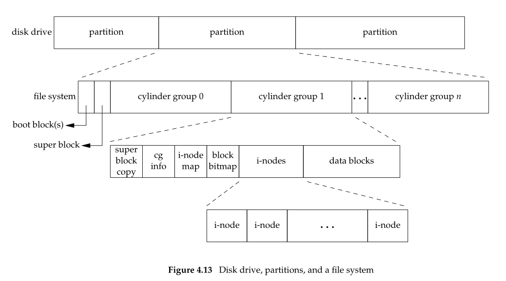
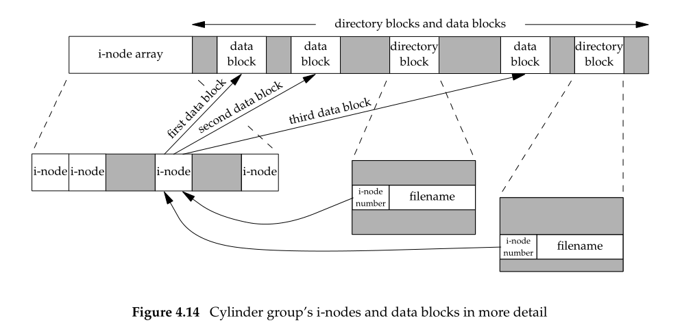
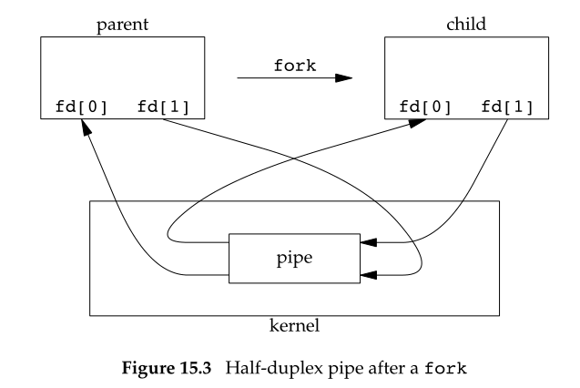
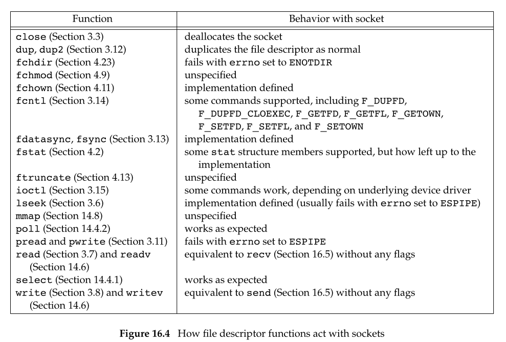

### 文件和目录

#### stat, fstat和lstat函数

```cpp
#include <sys/stat.h>
int stat (const char* restrict pathname, struct stat *restrict buf);
int fstat(int filedes. struct stat* buf);
int lstat(const char* restrict pathname, struct stat* restrict buf);

struct stat {
	mode_t	st_mode;	// file type & mode
	ino_t	st_ino;	// i-node number
	dev_t	st_dev;	// device number
	dev_t	st_rdev;
	nlink_t st_nlink;	// number of links
	uid_t	st_uid;	// user ID of owner
	gid_t	st_gid;	// group ID of owner
	off_t	st_size;	// size in bytes
	time_t	st_atime;	// time of last access
	time_t	st_mtime	// time of last modification
	time_t	st_ctime;	// time of last file status change
	blksize_t	st_blksize;	// best I/O block size
	blkcnt_t	st_blocks;	// number of disk blocks allocated
};
```

给出pathname, 返回与命名文件有关的stat信息结构, 填写在buf中。值得注意的是stat函数返回和ls -l类似, 即一个文件所有信息


<!-- more -->

文件类型包含在stat结构的st_mode中, 分为普通文件regular file, 目录文件directory, 块特殊文件block special file, 字符特殊文件, FIFO 命名管道, socket, 符号链接symbolic link

st_mode也包含了针对文件的访问权限位, 所有文件都有访问权限, 且9个访问权限位。用户有u所有者, g用户组, o其他。以及三类访问权限读, 写, 执行。

我们用pathname打开一类型的文件, 对该文件的每个目录都要有执行权限。例如打开/usr/include/stdio.h, 应对/, /usr, /usr/include目录都有执行权限, 对该文件的权限取决于打开模式是只读还是读写。创建文件和删除文件都需要对目录具有执行和写权限。

若进程有效用户ID是0(即超级用户), 则对文件系统有充分自由; 若进程用户ID等于文件所有者ID,则按owner用户处理...

chmod和fchmod函数可以更改文件的访问权限, 改变权限的用户要么是超级用户, 要么是文件owner。
```cpp
#include <sys/stat.h>

int chmod(const char* pathname, mode_t	mode);
int fchmod(int filedes, mode_t	mode);
```

chown, fchown用来改变文件的用户ID和组ID
```cpp
#include <unistd.h>

int chown(const char* pathname, uid_t owner, gid_t group);
```

#### 文件系统

一个磁盘可以分为多个分区, 每个分区可以包含一个文件系统


i节点是固定长度的记录项, 包含有关文件的基本信息, 文件的数据存放在数据库中


可以发现目录块directory block存在指针指向i节点, 且可以多个目录块指向同一个i节点, 这个指针链接就是硬链接, 只有链接计数减少到0时, 才可删除该文件。对于另一种链接符号链接, 表示一个文件, 该文件实际内容(存放在数据块中)包含了指向文件的名字。

i-node包含了与文件有关的大多数信息, 文件类型、访问权限位、文件长度和指向数据块指针等, stat结构的大多数信息取自i-node, 只有文件名和i节点编号放在目录项中。当文件更名时不需要动文件, 只需要重新构造一个目录项即可。

每个进程都有一个当前工作目录, 此目录是搜索相对路径的起点, 使用chdir或fchdir可以修改当前工作目录。getcwd用来返回当前工作目录的地址
```cpp
#include <unistd.h>

int chdir(const char* path);
char *getcwd(char* buf, size_t size);
```

每个文件系统所在的存储设备都由其主、次设备号表示, 设备号用结构dev_t表示。主设备号标识设备驱动程序, 次设备号标识特定的子设备。例如同一磁盘驱动器的各文件系统往往具有相同的主设备号, 但次设备号却不同。设备的文件名和i节点在devfs伪文件系统(即/dev文件系统)

#### 相关linux命令

* cp

当file_2不存在时，执行cp file_1 file_2，可以发现file_2和file_1的inode不一样，也就是用open()新建一个文件file_2，然后读取file_1的数据再写入file_2。

* rm

在Linux中，要真正删除一个文件，需要满足两个条件：链接数为0. 没有进程打开该文件

系统调用unlink()是移除目标文件的一个链接。可以发现rm底层调用的其实就是unlink()

* mv

当目标文件file_2不存在时，执行mv file_1 file_2，可以发现inode信息不变，只是在目录项上更改了链接指针

### 进程间通信

进程交换信息自然可以通过fork或exec共享内存, 或者通过文件系统。但是进程一般通信方法是IPC, InterProcess Communication

#### IPC

管道是UNIX系统IPC的最古老形式, 但是具有两个局限性1. 一般是半双工的 2. 只能在具有共同祖先的进程之间使用。通常一个管道由一个进程创建, 然后该进程调用fork产生子进程, 父子进程就可以使用该管道。管道是最常用的IPC形式

```cpp
#include <unistd.h>

int pipe(int filedes[2]);
// filedes为两个文件描述符, [0]可以认为是读端,[1]为写端
```
filedes为两个文件描述符, [0]可以认为是读端,[1]为写端。如果读一个写端关闭的管道, 所有数据读完read返回0; 如果写一个读端关闭的管道, 产生信号SIGPIPE, 处理结果是write返回-1, errno设置为EPIPE


FIFO又被称为命名管道, 管道pipe只能由相关进程调用, 且这些相关进程的共同祖先创建了管道。通过FIFO, 不相关的进程也能交换数据。

```cpp
// 创建FIFO类似于创建文件
#include <sys/stat.h>

int mkfifo(const char* pathname, mode_t mode);
```

创建了FIFO, 就可用open打开它, 且一般的文件I/O函数(close, write, read, unlink等)都可用于FIFO。当FIFO没有设置非阻塞(O_NONBLOCK)时只读open会阻塞到其他进程为写而打开FIFO, 如果指定了O_NONBLOCK则只读open会返回-1, errno是ENXIO

消息队列是消息的链表, 存放在内核并由消息队列标识符标识。每个对垒都有一个msqid_ds结构关联规定了消息队列的状态。
```cpp
#include <sys/msg.h>

int msgget(key_t key, int flag);	// 打开现存队列或创建一个新队列
int msgsnd(int msqid, const void* ptr, size_t nbytes, int flag);	// 将数据放到消息队列中

ssize_t msgrcv(int msqid, void* ptr, size_t nbytes, long type, int flag);	// 从队列取出消息
```

信号量与前列的IPC管道,FIFO, 消息队列不同, 它只是一个计数器, 用于多线程对共享数据的访问。

进程访问共享自由时, 倘若信号量值为正则进程可以使用资源并将信号量减1, 若信号量值为0则进程进入休眠等待信号量为正, 进程不再使用共享资源后会令信号量增加1

共享存储, 内核为每个共享存储端设置了shmid_ds结构
```cpp
struct shmid_ds {
	struct ipc_perm shm_perm;	// 
	size_t	shm_segsz;	// size of segment in bytes
	...
}

#include <sys/shm.h>
// 创建共享数据段
int shmget(key_t key, size_t size, int flag);
// 对共享存储端的操作
int shmctl(int shmid, int cmd, struct shmid_ds* buf);
// 创建共享存储端后进程可以连接到存储空间中
void *shmat(int shmid, const void* addr. int flag);
```

#### 网络套接字

套接字是通信端点的抽象, 套接字描述符在UNIX中是用文件描述符实现的, 许多处理文件描述符的函数也可以处理套接字描述符

```cpp
#include <sys/socket.h>

int socket(int domain, int type, int protocol);
```
参数domain确定通信的特性, 各个域都有自己的格式表示地址, 各个域开头以AF, 意味着地址族(address family)

|  域   | 描述  |
|  ----  | ----  |
| AF_INET  | IPV4因特网域 |
| AF_INET6  | IPV6因特网域 |
| AF_UNIX  | UNIX域 |
| AF_UNSPEC  | 未指定 |

参数type确定套接字类型, 进一步确定通信特征

|  类型   | 描述  |
|  ----  | ----  |
| SOCK_DGRAM  | 长度固定, 无连接的不可靠报文传递 |
| SOCK_RAW  | IP协议的数据报接口 |
| SOCK_SEQPACKET  | 长度固定、有序、可靠的面向连接报文传递 |
| SOCK_STREAM  | 有序、可靠、双向的面向连接字节流 |

参数protocol通常是0, 表示按照给定的域和套接字类型选择默认协议。在AF_INET域SOCK_STREAM类型的默认协议是TCP, AF_INET域SOCK_DGRAM的默认协议是UDP



套接字是双向的, 可以使用shutdown关闭套接字连接的输入输出
```cpp
int shutdown (int sockfd, int how);
```
how是SHUT_WR表示关闭写端, SHUT_RD关闭读端, SHUT_RDWR关闭读写。相比对close, close关闭了fd但不意味着关闭连接, 因为可能多个fd引用一个连接, 这样需要把连接所有引用fd关闭才能关闭连接, 而shutdown可以直接关闭连接。2. shutdown可以规定关闭读端，写端，非常方便

在IPV4(AF_INET)域中, 套接字地址采用如下结构表示
```cpp
struct sockaddr_in {
	as_family_t sin_family;
	in_port_t sin_port;	// in_port_t为uint16_t
	struct in_addr sin_addr;
};

struct in_addr {
	in_addr_t s_addr;	// in_addr_t为uint32_t
};
```

套接字和地址绑定
```cpp
int bind(int sockfd, const struct sockaddr *addr, socklen_t len);
```