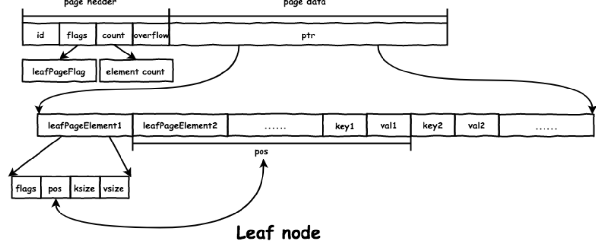
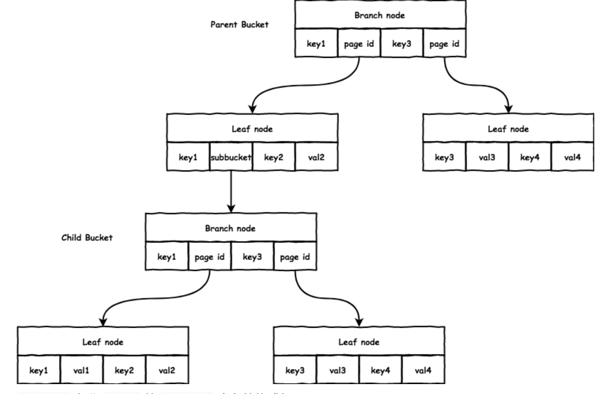
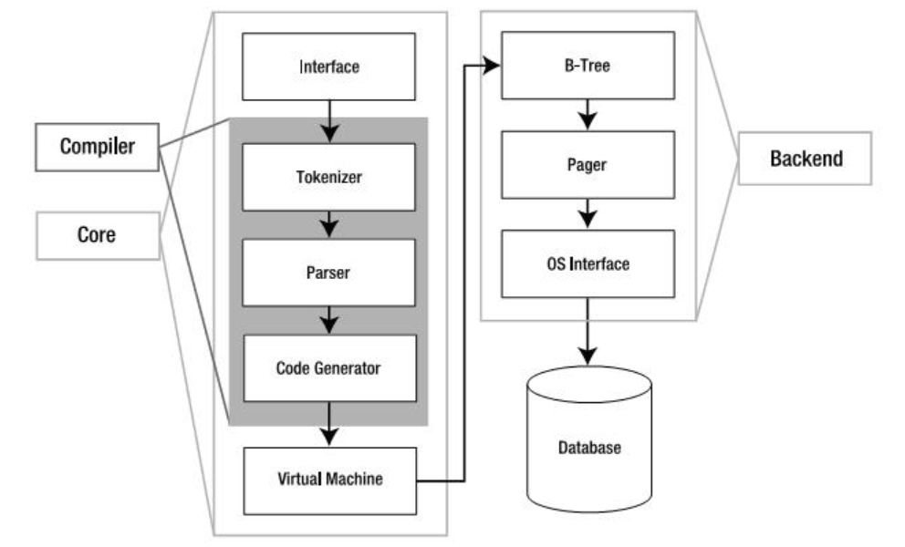
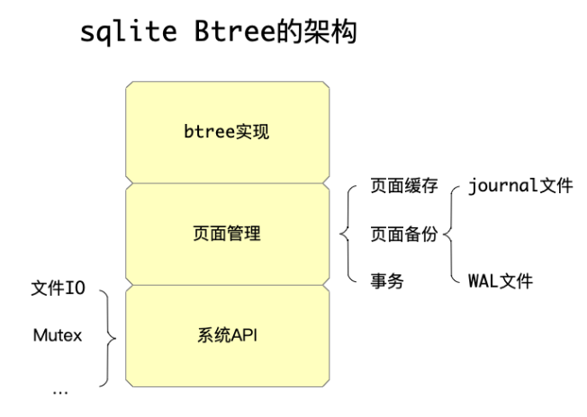

### boltdb

boltdb是etcd项目使用的kv存储引擎, 有以下性质
1. K/V 型存储, 使用 B+ 树索引。
2. 支持 namespace，每对 K/V 存放在一个 Bucket 下，不同 Bucket 可以有相同的 key，支持嵌套的 Bucket。
3. 支持事务(ACID)，使用 MVCC 和 COW，允许多个读事务和一个写事务并发执行，但是读事务有可能会阻塞写事务，适合读多写少的场景。

基本操作功能
```go
// Open the my.db data file in your current directory.
// It will be created if it doesn't exist.
// 打开文件 my.db 对应的数据库
db, err := bolt.Open("my.db", 0600, nil)
if err != nil {
    log.Fatal(err)
}
defer db.Close()

// Start a writable transaction. 开始一个写事务
tx, err := db.Begin(true)
if err != nil {
    return err
}
defer tx.Rollback()

// Use the transaction... 该事务中创建 Bucket
bucket, err := tx.CreateBucket([]byte("MyBucket"))
if err != nil {
    return err
}
// 写入 key: foo, value: bar
bucket.Put([]byte("foo"), []byte("bar"))

// Commit the transaction and check for error.
// 提交事务
if err := tx.Commit(); err != nil {
    return err
}
```

<!-- more -->

#### 存储引擎

boltdb 的存储有如下特点：

每个 db 对应一个文件，文件按照 page size(一般为 4096 Bytes) 划分为 page: page分为三种分别保存metadata, freelist, 数据。前2个 page 保存 metadata; 特殊的 page 保存 freelist，存放空闲 page 的 id; 剩下的 page 构成一个 B+ 树结构。

每个 Bucket 是一个完整的 B+ 树(显然bucket类似mysql的table), B+ 树的每个结点对应一个或多个连续的 page；
因为内存比磁盘小，一般会实现 page cache 缓存部分 page，比如使用 LRU 算法。boltdb 没有实现缓存，而是使用 mmap() 创建共享、只读的文件映射并调用 madvise(MADV_RANDOM)，由操作系统 管理 page cache；

没有 WAL(Write Ahead Log, 预写日志, 一般事务提交前先写WAL)，事务中所有操作都在内存中进行，只有 commit 时才会写到磁盘; commit 时会将 dirty page 写入新的 page，从而保证同时读的事务不受到影响。

一个典型的查找过程如下：

1. 首先找到 Bucket 的根节点，也就是 B+ 树的根节点的 page id；
2. 读取对应的 page，转化为内存中的 node；
3. 若是 branch node，则根据 key 查找合适的子节点的 page id;
4. 重复2、3直到找到 leaf node，返回 node 中对应的 val。

#### node和page

page, 共有4种 page, 通过 flags 区分:
1. meta page: 存放 db 的 meta data。
2. freelist page: 存放 db 的空闲 page。
3. branch page: 存放 branch node 的数据。
4. leaf page: 存放 leaf node 的数据

```go
type page struct {
	id    pgid // page id
	flags uint16 // 区分不同类型的 page
	count    uint16 // page data 中的数据个数
	overflow uint32 // 若单个 page 大小不够，会分配多个 page
	ptr uintptr // 存放 page data 的起始地址
}
```

boltdb 直接将 page 结构体的二进制格式写入文件，避免了序列化和反序列化的开销
```go
// 写的时候直接将需要写入的结构体转换为 byte 数组写入文件
ptr := (*[maxAllocSize]byte)(unsafe.Pointer(p))

// 读的时候直接将 byte 数组转换为对应结构体即可:
// page retrieves a page reference from the mmap based on the current page size.
func (db *DB) page(id pgid) *page {
  pos := id * pgid(db.pageSize)
  return (*page)(unsafe.Pointer(&db.data[pos]))
}
```

page cache

boltdb 没有实现 page cache，而是调用 mmap() 将整个文件映射进来，并调用 madvise(MADV_RANDOM) 由操作系统管理 page cache，后续对磁盘上文件的所有读操作直接读取 db.data
```go
// mmap memory maps a DB's data file.
func mmap(db *DB, sz int) error {
	// Map the data file to memory.
	b, err := syscall.Mmap(int(db.file.Fd()), 0, sz, syscall.PROT_READ, syscall.MAP_SHARED|db.MmapFlags)
	if err != nil {
		return err
	}

	// Advise the kernel that the mmap is accessed randomly.
	if err := madvise(b, syscall.MADV_RANDOM); err != nil {
		return fmt.Errorf("madvise: %s", err)
	}

	// Save the original byte slice and convert to a byte array pointer.
	db.dataref = b
	db.data = (*[maxMapSize]byte)(unsafe.Pointer(&b[0]))
	db.datasz = sz
	return nil
}
```

node

node 的数据存放在 page.ptr 的位置: 内容包括leafPageElement, 以及后面的key,value。通过 pos、ksize 和 vsize 可获取对应的 key/value 的地址。`&leafPageElement + pos == &key`,`&leafPageElement + pos + ksize == &val`


访问结点时，首先要将 page 反序列化后得到得到 node 结构体，代表 B+ 树中一个结点。inodes 保存了该 node 的 K/V 数据。node 和 page 的相互转换通过 `node.read(p *page)` 和 `node.write(p *page)`
```go
// node represents an in-memory, deserialized page.
type node struct {
	bucket     *Bucket
	isLeaf     bool // 区分 branch node 和 leaf node
	unbalanced bool
	spilled    bool
	key        []byte // 该 node 的起始 key
	pgid       pgid
	parent     *node
	children nodes
	inodes   inodes // 存放 node 的数据
}

// inode represents an internal node inside of a node.
// It can be used to point to elements in a page or point
// to an element which hasn't been added to a page yet.
type inode struct {
	flags uint32 // 用于 leaf node，区分是正常 value 还是 subbucket
	pgid  pgid // 用于 branch node, 子节点的 page id
	key   []byte
	value []byte
}
```

#### Bucket

操作都是对 Bucket 进行操作，Bucket 是一个 namespace，相当于一张表，一个 Bucket 代表一个完整的 B+ 树

```go
// Bucket represents a collection of key/value pairs inside the database.
type Bucket struct {
	*bucket
	tx      *Tx // the associated transaction
	buckets map[string]*Bucket // subbucket cache
	page *page // inline page reference
	rootNode *node // materialized node for the root page.
	nodes map[pgid]*node // node cache
	// Sets the threshold for filling nodes when they split. By default,
	// the bucket will fill to 50% but it can be useful to increase this
	// amount if you know that your write workloads are mostly append-only.
	//
	// This is non-persisted across transactions so it must be set in every Tx.
	FillPercent float64
}
// bucket represents the on-file representation of a bucket.
// This is stored as the "value" of a bucket key. If the bucket is small enough,
// then its root page can be stored inline in the "value", after the bucket
// header. In the case of inline buckets, the "root" will be 0.
type bucket struct {
	root pgid // page id of the bucket's root-level page
	sequence uint64 // monotonically incrementing, used by NextSequence()
}
```

get/put 操作首先都要查找到 key 对应的位置，boltdb 通过 Cursor 实现:
```cpp
// Cursor creates a cursor associated with the bucket.
// The cursor is only valid as long as the transaction is open.
// Do not use a cursor after the transaction is closed.
func (b *Bucket) Cursor() *Cursor {
	// Update transaction statistics.
	b.tx.stats.CursorCount++

	// Allocate and return a cursor.
	return &Cursor{
		bucket: b,
		stack:  make([]elemRef, 0),
	}
}
type Cursor struct {
	bucket *Bucket
	stack  []elemRef
}
type elemRef struct {
	page  *page
	node  *node
	index int
}
```

Cursor首先从 Bucket.root 对应的 page 开始，递归的进行查找，直到 leaf node。Cursor.stack 中保存了查找对应 key 的路径，栈顶保存了 key 所在的结点和位置:

get 操作返回栈顶结点中对应的 key/val
```go
// keyValue returns the key and value of the current leaf element.
func (c *Cursor) keyValue() ([]byte, []byte, uint32) {
  ref := &c.stack[len(c.stack)-1]
  if ref.count() == 0 || ref.index >= ref.count() {
      return nil, nil, 0
  }

  // Retrieve value from node.
  if ref.node != nil {
      inode := &ref.node.inodes[ref.index]
      return inode.key, inode.value, inode.flags
  }

  // Or retrieve value from page.
  elem := ref.page.leafPageElement(uint16(ref.index))
  return elem.key(), elem.value(), elem.flags
}
```

put 操作将对应的 key/val 添加到栈顶结点


#### 事务

boltdb 支持完整的事务特性(ACID)，使用 MVCC 并发控制，允许多个读事务和一个写事务并发执行，但是读事务有可能会阻塞写事务。它的特点如下：

1. Durability: 写事务提交时，会为该事务修改的数据(dirty page)分配新的 page，写入文件。
2. Atomicity: 未提交的写事务操作都在内存中进行；提交的写事务会按照 B+ 树数据、freelist、metadata 的顺序写入文件，只有 metadata 写入成功，整个事务才算完成，只写入前两个数据对数据库无影响。
3. Isolation: 每个读事务开始时会获取一个版本号，读事务涉及到的 page 不会被写事务覆盖；提交的写事务会更新数据库的版本号。

boltdb 所有操作都会分配一个事务 Tx
```cpp
// Tx represents a read-only or read/write transaction on the database.
// Read-only transactions can be used for retrieving values for keys and creating cursors.
// Read/write transactions can create and remove buckets and create and remove keys.
//
// IMPORTANT: You must commit or rollback transactions when you are done with
// them. Pages can not be reclaimed by the writer until no more transactions
// are using them. A long running read transaction can cause the database to
// quickly grow.
type Tx struct {
	writable bool
	managed  bool
	db       *DB
	meta     *meta
	root     Bucket
	pages          map[pgid]*page
	stats          TxStats
	commitHandlers []func()

	// WriteFlag specifies the flag for write-related methods like WriteTo().
	// Tx opens the database file with the specified flag to copy the data.
	//
	// By default, the flag is unset, which works well for mostly in-memory
	// workloads. For databases that are much larger than available RAM,
	// set the flag to syscall.O_DIRECT to avoid trashing the page cache.
	WriteFlag int
}
```

写事务的流程如下：

1. 根据 db 初始化事务：拷贝一份 metadata，初始化 root bucket，自增 txid；
2. 从 root bucket 开始，遍历 B+ 树进行操作，所有的修改在内存中进行；
3. c提交写事务: 平衡 B+ 树，在分裂的时候会给每个修改过的 node 分配新的 page; 给 freelist 分配新的 page; 将 B+ 树数据和 freelist 数据写入文件; 将 metadata 写入文件。


读事务的流程如下：

1. 根据 db 初始化事务：拷贝一份 metadata，初始化 root bucket；
2. 将当前读事务添加到 db.txs 中；
3. 从 root bucket 开始，遍历 B+ 树进行查找；
结束时，将自身移出 db.txs。


数据库的前两个 page 保存 metadata，从而保证重启时恢复 db 的信息
```cpp
type meta struct {
	magic    uint32
	version  uint32
	pageSize uint32
	flags    uint32
	root     bucket // root bucket 的 page id
	freelist pgid // freelist 的 page id
	pgid     pgid // 文件的 page 个数
	txid     txid // 当前 db 提交的最大的写事务 id
	checksum uint64
}
```

在写事务 commit 时，会为脏 node 分配新的 page(位于内存中)，同时将之前使用的 page 释放。freelist 中维护了当前文件中的空闲 page id，分配时会从 freelist.ids 中寻找合适的 page。

* 事务的原子性

事务原子性保证如下
1. 若事务未提交时出错，因为 boltdb 的操作都是在内存中进行，不会对数据库造成影响
2. 若是在 commit 的过程中出错，如写入文件失败或机器崩溃，boltdb 写入文件的顺序也保证了不会造成影响:
顺序为先写入 B+ 树数据和 freelist 数据; 后写入 metadata。只有写完metadata才会成功以及被访问, 只写了前两个对数据库不产生影响

* 事务的隔离性

boltdb 支持多个读事务与一个写事务同时执行，写事务提交时分配一个空闲页面，将新的页面内容存储到这个空闲页面上。同时将旧的页面设置为这一次事务操作的pending页面, 事务提交时该页面变为空闲页面。

所以放在 freelist.pending 中是为了实现MVCC。MVCC就是保存当前数据的多个版本，这样写事务操作的同时，允许有多个读事务操作进行，只是读事务不会马上读到写事务修改的数据，直到这个写事务提交为止。 只有确保没有读事务会用到时，才将相应的 pending page 放入 freelist.ids 中用于分配。peed即通过事务递增的txid, 在创建写事务时，会找到 db.txs 中最小的 txid，释放 freelist.pending 中所有 txid 小于它的 pending page

每个事务都有一个 txid，db.meta.txid 保存了最大的已提交的写事务 id。读事务: txid == db.meta.txid, 写事务txid == db.meta.txid + 1, 当写事务成功提交时，会更新 metadata，也就更新了 db.meta.txid

因为 boltdb 使用 mmap() 将整个文件映射进来，同时读事务加上了读锁, 写事务提交时需要分配 page，如果当前文件没有足够的 free page，需要扩大文件并重新 mmap()。而 mmap() 中加上了写锁, 在这种情况下读事务会阻塞写事务。一种方法就是设置大的 Options.InitialMmapSize，增大打开数据库时的初始 mmap() 大小:

boltdb 不支持多个写事务同时执行，在创建写事务的时候会加上锁


### Sqlite

SQLite是一个开源的嵌入式关系数据库, 嵌入式数据库的一大好处就是在你的程序内部不需要网络配置，也不需要管理。因为客户端和服务器在同一进程空间运行



在编译器中，分词器（Tokenizer）和分析器(Parser)对SQL进行语法检查，然后把它转化为底层能更方便处理的分层的数据结构---语法树，然后把语法树传给代码生成器(code generator)进行处理。而代码生成器根据它生成一种针对SQLite的汇编代码，最后由虚拟机(Virtual Machine)执行。

架构中最核心的部分是虚拟机，或者叫做虚拟数据库引擎(Virtual Database Engine,VDBE)。它和Java虚拟机相似，解释执行字节代码。VDBE的字节代码由128个操作码(opcodes)构成，它们主要集中在数据库操作。它的每一条指令都用来完成特定的数据库操作(比如打开一个表的游标)或者为这些操作栈空间的准备(比如压入参数)。总之，所有的这些指令都是为了满足SQL命令的要求

后端由B-树(B-tree)，页缓存(page cache，pager)和操作系统接口(即系统调用)构成。B-tree和page cache共同对数据进行管理。B-tree的主要功能就是索引，它维护着各个页面之间的复杂的关系，便于快速找到所需数据。而pager的主要作用就是通过OS接口在B-tree和Disk之间传递页面。


#### Btree
sqlite的btree架构, 系统级API这一层，需要解决平台相关的文件IO、锁等问题, 涉及到系统级的系统调用; 

页面管理模块解决以下的问题：对上层的btree模块，暴露针对页面读、写的接口，内部会缓存页面的内容，何时将修改的页面（所谓脏页面，dirty page）落盘到磁盘, 以及页面缓存模块, WAL, 事务

btree：基于页面管理模块之上，实现了可以存储可变数据的btree模块。


注意到页面管理模块无疑是这里最大最复杂的部分，Andy Pavlo在CMU 15445课程中提到过：任何用mmap来做页面管理的做法都是很糟糕的做法（如boltdb、LMDB等）